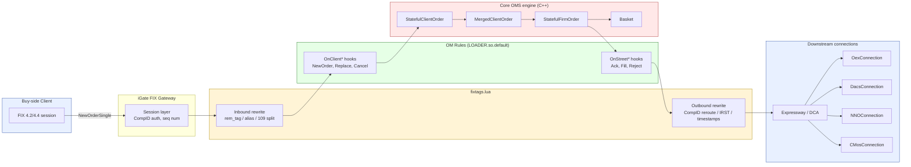
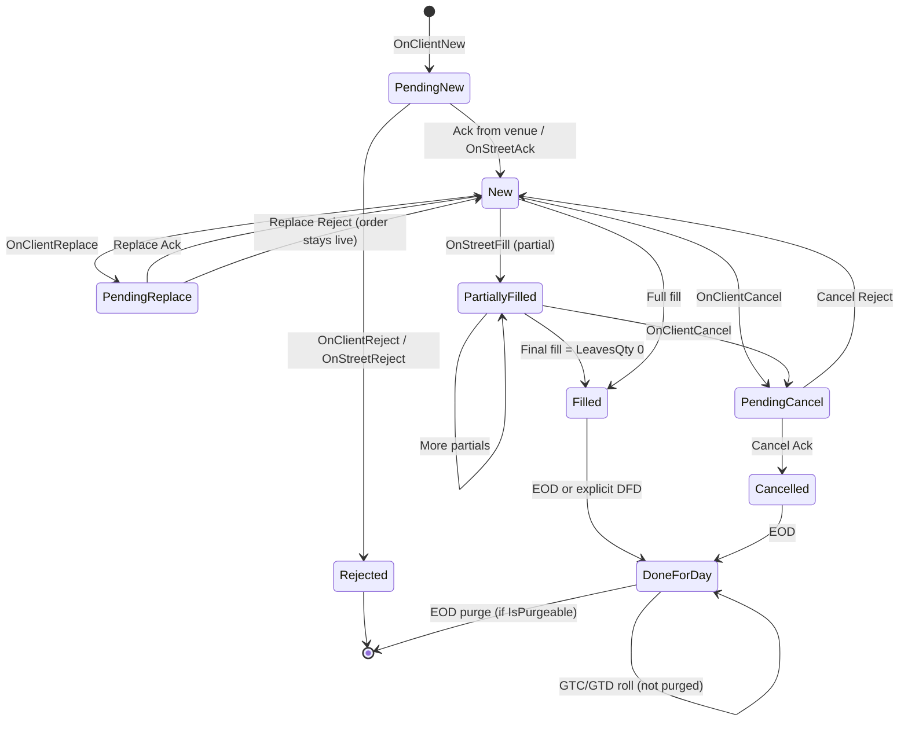

# 01 — Internal Codebase Comprehensive Q&A

> 100+ questions grounded in the vendor-core OMS + client-code overlays. Answer as a Technical Analyst with ~5 years supporting production trading flows.

## Contents

- Part A: architecture, Lua transform layer, OM rules, core OMS engine
- Part B: order lifecycle, IRST cross book-out, EOD purge cascade, alerts
- Part C: DACS + DCA, ATDL, build & config, custom FIX tags

---



## 1. Architecture & wire flow (15 Q&A)

### Q1. Walk me through the end-to-end path of a NewOrderSingle from a buy-side client to the street.
**Interviewer signal:** Do you actually know the OMS stack or just buzzwords?
**Answer:**
1. Client sends 35=D over a FIX session terminated at **iGate**, which handles session-layer concerns (CompID auth, sequence numbers, heartbeats).
2. iGate hands the parsed message to **fixtags.lua** inbound. Lua does connection routing, tag suppression via `rem_tag`, alias-to-CompID mapping via tag 30056, and APAC compound-ID splitting on tag 109.
3. Message enters the **OM rules layer** — event-driven `.rule` files compiled into `LOADER.so.default`. The `OnClientNewOrder` hook runs validations, account assignment, portfolio decoration, sysOrderType stamping.
4. Rules call into the **Core OMS engine** (C++/Linux). A `StatefulClientOrder` is created; if merging is enabled it joins a `MergedClientOrder`, which owns a `StatefulFirmOrder` sent to the street.
5. On send, `OnStreetOut*` rules stamp compliance IDs (MERGE/ISO/IRST), tag 21220 event timestamps.
6. **fixtags.lua** outbound rewrites CompID per venue and drops internal-only tags.
7. **Expressway/DCA** routes to the destination via `OexConnection`, `DacsConnection`, or venue-specific connections.

**Watch-outs:** Don't confuse iGate (session) with fixtags.lua (application-level transform). Two different layers.

---

### Q2. What does `FLEX_REGION` control and why does it matter for production support?
**Interviewer signal:** Do you know region-specific quirks that cause pages at 2am?
**Answer:**
`FLEX_REGION` is an environment variable set to `EU`, `US`, or `HK`. It gates region-specific branches in both Lua and rules — for example, APAC uses the compound-ID split on tag 109 while EU/US don't. EU has MiFID short-selling flags in rules that don't fire elsewhere. HK has SFC BCAN (tag 9507) enrichment. On support, the first thing I check for any "why did X happen in Tokyo but not London" ticket is whether the code path is `FLEX_REGION`-gated.

**Watch-outs:** Setting it wrong at process start silently changes semantics — no error, just wrong behavior.

---

### Q3. Where does the boundary between iGate and fixtags.lua sit? What does each own?
**Interviewer signal:** Layering discipline.
**Answer:**
iGate owns the **FIX session**: TCP, TLS, logon/logout, heartbeats, sequence numbers, resend requests, gap fills. By the time a message reaches Lua, it's a valid, in-sequence application message. **fixtags.lua** owns **application-level rewrites**: what tags to keep, what to translate, what CompID to route to downstream. Rules of thumb: anything session-layer stays in iGate config; anything content-based lives in Lua.

**Watch-outs:** Session-level rejects (e.g., bad seq num) never reach Lua — don't hunt for them in Lua logs.

---

### Q4. How are OM rules deployed to production?
**Interviewer signal:** Release hygiene.
**Answer:**
`.rule` files are compiled by **rulebuilder** into a shared object, `LOADER.so.default`. That artifact is deployed alongside base binaries. At OMS startup the loader `dlopen`s it and registers event handlers. To roll a rule change, we rebuild `LOADER.so.default`, ship it via our deployment pipeline, and either bounce the OMS or, for hot-loadable rulesets, trigger a reload. In prod I always check `md5sum` of the deployed .so against build artifacts before I trust a rules change is actually live.

**Watch-outs:** People forget that a `.rule` edit without a rebuild does nothing. Always verify the .so timestamp.

---

### Q5. Name the main connection classes and what each does.
**Interviewer signal:** Do you know the C++ backbone?
**Answer:**
- `OMConnection` — generic order management downstream.
- `OexConnection` — Order Execution (street-side venue/broker).
- `DacsConnection` — market data entitlements / permissioning.
- `DepthConnection` — order book depth feed.
- `BarConnection` — OHLC bars.
- `BboxConnection` — algo container / black-box strategy IO.
- `NNOConnection` — non-native order feed (bridge from external OMS).
- `CMosConnection` — Compliance Middleware Order Service.

**Watch-outs:** Don't confuse `OexConnection` (outbound to street) with `OMConnection` (upstream to another OMS).

---

### Q6. A trader says "my order is stuck." Where do you look first?
**Interviewer signal:** Triage discipline under pressure.
**Answer:**
1. Grab the ClOrdID and pull it from the OMS blotter — establish current state (`_state`, `_lastLeavesQty`).
2. Check iGate FIX log for the inbound NewOrderSingle timestamp and any session-level reject.
3. If it entered the OMS, grep the OMS log for the ClOrdID: did `OnClientNewOrder` fire? Any rule reject?
4. If it got a `StatefulFirmOrder`, check whether an outbound message left — grep the `OexConnection` log by internal order ID.
5. If sent, check for ack from downstream. No ack → downstream/broker issue.
Rule of thumb: work in wire order — session → Lua → rules → core → connection → downstream ack.

**Watch-outs:** Jumping straight to "restart the OMS" without narrowing the layer is how you lose fills.

---

### Q7. What is Expressway/DCA in this stack?
**Interviewer signal:** Do you know what's between the OMS and the venue?
**Answer:**
Expressway (a.k.a. DCA — Direct Connect Adapter) is the smart-order router / venue-gateway layer. The OMS delegates venue-specific FIX dialects, session management, and low-latency routing to Expressway. Our OMS speaks one internal protocol to Expressway; Expressway speaks each venue's native FIX. This is why `OexConnection` looks uniform in the OMS regardless of whether the destination is a MTF, ECN, or broker DMA.

**Watch-outs:** Latency issues often live in DCA, not in the OMS. Always check DCA metrics before blaming the OMS.

---

### Q8. Explain the difference between OnClient* and OnStreet* rule hooks.
**Interviewer signal:** Event model.
**Answer:**
`OnClient*` hooks fire on messages **coming from the client** — `OnClientNewOrder`, `OnClientReplace`, `OnClientCancel`. `OnStreet*` hooks fire on messages **from or to the street** — `OnStreetAck`, `OnStreetFill`, `OnStreetReject`, and outbound-direction `OnStreetOutNewOrder`. Client-side rules mutate the incoming order or reject it before it hits Core. Street-side rules react to executions or shape the outbound message. Getting these mixed up (putting a client-side check in a street-side hook) is a classic bug — the check runs at the wrong time and misses orders.

**Watch-outs:** Don't put mutations that must be visible pre-merge into OnStreetOut — merging has already happened.

---

### Q9. Which custom tags are core to our order flow and what do they do?
**Interviewer signal:** Domain vocabulary.
**Answer:**
| Tag | Purpose |
|---|---|
| 5000 | tradingAcct |
| 5011 | acctType |
| 30056 | routingAlias (translated to CompID in Lua) |
| 31284 | desk |
| 99040 | sysOrderType (e.g. 13 = AgencyMerged) |
| 99376 | portfolio |
| 21220 | eventTS — stamped outbound |
| 27800 | strategyId |
| 21283 | IOBX cross pre/post indicator |
| 30865 | PRINC-CROSS |
| 7865 | DIRECTED-CROSS |
| 7801 | IOBX |
| 99063 | IRST (compliance suffix key) |
| 9507 | BCAN (HK regulatory) |

**Watch-outs:** Don't quote tag numbers as truth without checking the current dictionary — some are venue-overloaded.

---

### Q10. Draw the parent/child hierarchy of order objects in Core.
**Interviewer signal:** Data model.
**Answer:**
```
Basket
  └── StatefulFirmOrder      (street-facing, one per outbound leg)
        └── MergedClientOrder (aggregation of merged clients)
              └── StatefulClientOrder (one per client-side order)
```
Multiple `StatefulClientOrder`s can be merged into one `MergedClientOrder`, which produces one `StatefulFirmOrder` to the street. Baskets hold groups of firm orders that must live/die together at EOD.

**Watch-outs:** A `MergedClientOrder` has its own state distinct from any child — clearing a field on the merged parent (e.g., `_comm_type = '\0'`) can leak through on replaces.

---

### Q11. What logs do you routinely tail during a rollout?
**Interviewer signal:** Ops experience.
**Answer:**
- `oms.log` — main engine, look for state transitions, rule firing, rejects.
- iGate session log — session state, seq-num issues.
- `fixtags.lua` trace log — inbound/outbound tag rewrites (usually toggled with a debug flag).
- `OexConnection` log — outbound wire, ack round-trip.
- `CMosConnection` log — compliance holds.
- DCA/Expressway log for venue-side.
I usually `multitail` all of these keyed on the ClOrdID during a rollout.

**Watch-outs:** Don't leave Lua trace logging on in prod — it's chatty and it slows the loop.

---

### Q12. Where does compliance fit in the wire flow?
**Interviewer signal:** Do you know CMOS vs. inline rule checks.
**Answer:**
Two places. **Inline** — OM rules perform lightweight checks (account permissions, restricted list flags, IRST/MERGE/ISO stamping). **Out-of-band** — `CMosConnection` sends orders to a Compliance Middleware service for heavier checks (pre-trade limits, wash trades, cross-venue aggregation). CMOS can return a hold, which parks the `StatefulFirmOrder` until released. On the wire, from a trader's perspective, it looks like a slow ack.

**Watch-outs:** A "compliance hold" ticket almost always means CMOS, not an inline rule reject.

---

### Q13. Merging vs. non-merging flow — when does an order avoid the MergedClientOrder layer?
**Interviewer signal:** Understanding of DMA vs. merged.
**Answer:**
DMA / directed / cross orders bypass merging — each `StatefulClientOrder` produces its own `StatefulFirmOrder` directly. Merging applies to agency flow tagged with `sysOrderType` = 13 (AgencyMerged), where multiple client orders on the same symbol/side/account bundle into one street order. Non-agency flow, principal legs of crosses, and orders with an explicit routing hint skip merging.

**Watch-outs:** Don't assume "no merge" means "no shared parent" — cross orders still have complex parent/child relationships via the cross pairing.

---

### Q14. What breaks first when disk fills up on the OMS host?
**Interviewer signal:** SRE muscle.
**Answer:**
The FIX message store and OMS journals stop writing, which triggers a session tear-down on iGate (can't persist inbound seq nums) and internal state checkpoints stop. Depending on config, the OMS may keep running in-memory but no recovery is possible if it crashes. First symptom is usually a burst of session logouts across venues. Runbook: rotate/archive `oms.log*`, `*.jrn`, iGate store files, then bounce iGate sessions cleanly.

**Watch-outs:** Do not `rm` an active journal file — corrupts recovery. Rotate, don't delete.

---

### Q15. How would you verify in prod that a rule change is actually taking effect?
**Interviewer signal:** Verification discipline.
**Answer:**
1. Confirm `LOADER.so.default` md5/mtime matches the build artifact.
2. Check OMS startup log for the rule-registration line naming the changed hook.
3. Send a known test order that exercises the changed branch and grep for a rule-side log line I added intentionally.
4. Diff blotter behavior against a control order in a lower environment.
5. If it's a stamping change, decode an outbound FIX message off the wire (or from the DCA log) and verify the tag.

**Watch-outs:** "It compiled" is not "it's live." Always prove with an order.

---

## 2. FIX tag transform layer (Lua fixtags.lua) (15 Q&A)

### Q1. What is fixtags.lua responsible for?
**Interviewer signal:** Layer ownership.
**Answer:**
It's the FIX application-level rewrite layer sitting between iGate and the OM rules. Concretely it handles:
- Connection routing — deciding which downstream OMS/desk a message goes to.
- Tag suppression via `rem_tag` — drop internal or venue-forbidden tags.
- Alias-to-CompID translation via tag 30056.
- Compound ID 109 splitting for APAC (single field carrying multiple sub-IDs).
- MERGE / ISO / IRST compliance-ID suffixes on outbound orders.
- Timestamp stamping on tag 21220.

**Watch-outs:** It is not a session-layer tool — it doesn't touch seq nums, heartbeats, or logon.

---

### Q2. How does `rem_tag` work and when do you use it?
**Interviewer signal:** Practical Lua usage.
**Answer:**
`rem_tag(msg, <tagnum>)` removes a tag from a message before it moves on. Use it to strip:
- Internal-only tags that must not leak to a broker (e.g., desk 31284 to an external counterparty).
- Venue-forbidden tags that would cause a session reject at the broker.
- Deprecated tags kept for internal legacy compatibility.
Typical pattern is a table of `{compid = {tags_to_strip}}` looked up in the outbound hook.

**Watch-outs:** Stripping a tag the counterparty needs will cause silent behavior differences downstream, not always a reject. Test with a real ack.

---

### Q3. How does the alias-to-CompID mapping via tag 30056 work?
**Interviewer signal:** Real-world routing.
**Answer:**
Tag 30056 carries an internal routing alias (e.g., a desk-friendly name). Lua looks it up in a table keyed by alias and rewrites the outbound message's destination CompID (and typically the TargetSubID if used). This lets traders and rules use stable alias names while the actual FIX CompID for a broker can change without a rule/base-code redeploy — we just update the Lua table.

**Watch-outs:** If the alias is missing from the table, the order routes to a default or drops. Always add both `EU` and `HK` region entries when a broker onboards.

---

### Q4. Explain compound ID 109 splitting for APAC.
**Interviewer signal:** Regional quirk.
**Answer:**
In APAC some upstream systems pack multiple IDs into FIX tag 109 (ClientID) with a delimiter — e.g., `TRADER|BOOK|SUBACCT`. Lua splits this on inbound and populates the downstream fields (usually 5000 tradingAcct, 5011 acctType, 31284 desk) so downstream rules see clean fields. Only runs when `FLEX_REGION == 'HK'`.

**Watch-outs:** Delimiter drift — an upstream change to `,` from `|` silently mis-parses and mis-books.

---

### Q5. What are MERGE / ISO / IRST suffixes and where are they stamped?
**Interviewer signal:** Compliance flow.
**Answer:**
On outbound street-facing orders, Lua appends a suffix to the ClOrdID (or a dedicated compliance-ID tag like 99063 IRST) indicating:
- **MERGE** — this street order aggregates multiple client orders.
- **ISO** — Intermarket Sweep Order (US Reg NMS).
- **IRST** — Immediate/Restricted Suffix Tag for internal compliance surveillance.
The suffix lets downstream compliance and post-trade systems reconstruct the order lineage without querying the OMS.

**Watch-outs:** Don't overwrite an existing suffix on a replace — append or leave alone. Overwriting breaks trade capture.

---

### Q6. When does Lua stamp tag 21220 and why?
**Interviewer signal:** Attention to timestamps.
**Answer:**
Tag 21220 is our event timestamp — stamped outbound with microsecond precision at the moment Lua touches the message on its way to Expressway/DCA. It's used for latency reconciliation: subtract inbound-to-OMS timestamp from 21220 to get in-OMS dwell time. During incident post-mortems this is how we prove "OMS added 800µs" vs "DCA added 30ms."

**Watch-outs:** Clock drift on the host will pollute this — NTP discipline matters.

---

### Q7. Debug flow: a broker rejects our order with "unknown tag." How do you narrow it down in Lua?
**Interviewer signal:** Debug technique.
**Answer:**
1. Pull the outbound FIX message the broker saw from the DCA log.
2. Identify the offending tag from the reject.
3. Check whether the tag is in our internal-only list — should have been stripped by `rem_tag`.
4. Look at the outbound Lua function for this CompID; check the `rem_tag` table for the tag.
5. If missing, add it, redeploy Lua (usually hot-reloadable), send a test.
Common culprits: 31284 desk, 99040 sysOrderType, 99376 portfolio.

**Watch-outs:** Some brokers reject only under specific product configs (e.g., only for options) — check the broker's rules of engagement doc, not just their reject text.

---

### Q8. Is Lua hot-reloadable in our stack?
**Interviewer signal:** Ops knowledge.
**Answer:**
Usually yes — the iGate host reloads fixtags.lua on a SIGHUP or via an admin command without dropping FIX sessions, because the Lua state is per-message. Base-code and rules are not hot-reloadable. That's why config-shaped fixes (add a tag to `rem_tag`, add a CompID mapping) are the fastest incident mitigation path.

**Watch-outs:** A syntax error in Lua after reload can silently bypass all rewrites — always tail the reload log for parse errors.

---

### Q9. Show a minimal `rem_tag` pattern for stripping desk and portfolio outbound to Broker X.
**Interviewer signal:** Can you write Lua?
**Answer:**
```lua
local strip_by_compid = {
  ["BROKER_X_PROD"] = { 31284, 99376, 99040 },
}

function outbound(msg, target_compid)
  local tags = strip_by_compid[target_compid]
  if tags then
    for _, t in ipairs(tags) do
      rem_tag(msg, t)
    end
  end
end
```
**Watch-outs:** Don't iterate `pairs` if order matters, and don't mutate the table while iterating.

---

### Q10. What is the risk of putting business logic in Lua vs. rules?
**Interviewer signal:** Architectural judgement.
**Answer:**
Lua is meant for **stateless message rewrites**. Rules own **stateful business logic** — they have access to the order book, prior state, and can gate transitions. Putting business logic in Lua tempts you because Lua is hot-reloadable, but it means duplicating state or making decisions without full context. Rule of thumb: if you need to know the order's current state to decide, it belongs in a rule.

**Watch-outs:** "Just add it in Lua for now" ages badly — that quick fix becomes a permanent shadow rule.

---

### Q11. How do you unit-test Lua transforms?
**Interviewer signal:** Test discipline.
**Answer:**
We have a Lua test harness that stubs the `rem_tag`, `set_tag`, `get_tag` API and runs the transform on canned FIX messages. Each test asserts the outbound message equals an expected payload. In CI these run on every commit to fixtags.lua. Locally I use `lua5.1 test_fixtags.lua` and diff outputs.

**Watch-outs:** Don't rely on prod-parity tests only — regional branches often go untested if you only test one `FLEX_REGION`.

---

### Q12. A trader onboards a new broker. What Lua changes do you typically need?
**Interviewer signal:** Onboarding process.
**Answer:**
1. Add the broker CompID to the alias-to-CompID mapping (both region variants if applicable).
2. Add any broker-specific `rem_tag` list — most brokers refuse internal tags.
3. Add MERGE/ISO/IRST rules if the broker requires the ClOrdID suffix format they specify.
4. Optionally stamp a broker-specific SenderSubID or account.
5. Coordinate with the rules team if the broker needs custom sysOrderType handling.

**Watch-outs:** Skipping the strip list is the #1 first-week onboarding bug.

---

### Q13. How is the inbound path different from the outbound path in Lua?
**Interviewer signal:** Direction awareness.
**Answer:**
Inbound: enrichment and normalization — split compound IDs, translate aliases to internal IDs, populate missing tags with defaults. Outbound: sanitization and decoration — strip internal tags, translate internal IDs back to broker-visible values, stamp compliance suffixes and timestamps. Same file, two distinct entry points and mindsets.

**Watch-outs:** Symmetrical bugs — enriching inbound but forgetting to strip outbound leaks internal data.

---

### Q14. A Multi-Cross checkbox value on tag 21283 is being truncated at 15 characters. Where do you start?
**Interviewer signal:** Real incident recall.
**Answer:**
This isn't a Lua issue — it's an ATDL/base-code issue. The value comes in already-truncated because `DtagParam_Checkbox` in `utl/include/DtagParam.h` at lines 199–200 uses `char[16]` (15 chars + null). The `maxLength` ATDL attribute only helps `TextField_t`, not `CheckBox_t`. Lua sees the truncated string and passes it through faithfully. Fix is to widen the buffers to `char[64]` in base code, rebuild, redeploy. Lua is not the layer to patch.

**Watch-outs:** Don't try to reconstruct the truncated value in Lua — you don't have the source. Fix at origin.

---

### Q15. Traders complain some fills have wrong CompID on outbound child. How do you triage in Lua?
**Interviewer signal:** Real triage.
**Answer:**
1. Confirm the alias-to-CompID mapping table is what I expect (grep the deployed file).
2. Confirm tag 30056 on the outbound has the right alias — could be the rules setting a stale alias.
3. Add temporary trace on the outbound hook, capture 10 samples.
4. Check whether a recent Lua reload actually loaded — sometimes a syntax error means the old table is still cached.
5. If all Lua-side looks right, escalate — root cause is likely in rules setting the wrong alias upstream.

**Watch-outs:** Blaming Lua when rules set the input alias wrong is a common wrong turn.

---

## 3. OM rules layer (event hooks) (12 Q&A)

### Q1. What's the compilation model for OM rules?
**Interviewer signal:** Toolchain literacy.
**Answer:**
`.rule` files are DSL source. **rulebuilder** parses them, generates C++ glue, compiles into a shared object `LOADER.so.default`. At OMS startup the loader `dlopen`s the .so and registers handler pointers keyed by event name (`OnClientNewOrder`, `OnStreetFill`, etc.). Rules can call into base-code C++ APIs on the order object.

**Watch-outs:** Rules are not scripted at runtime — they're compiled C++ under the hood.

---

### Q2. Give the categories of hooks and when each fires.
**Interviewer signal:** Event model breadth.
**Answer:**
- `OnClient*` — client→OMS: NewOrder, Replace, Cancel, Status.
- `OnStreet*` (inbound) — venue→OMS: Ack, Fill, PartialFill, Reject, DFD (Done For Day).
- `OnStreetOut*` — OMS→venue, just before send.
- `OnTimer*` — cron-like or elapsed-time hooks.
- `OnLoad` / `OnUnload` — lifecycle.
- `OnAlert*` — internal alert engine hooks.

**Watch-outs:** `OnStreetOut*` runs after merging — don't try to mutate per-client-order state here.

---

### Q3. Walk me through what OnClientNewOrder typically does.
**Interviewer signal:** Concrete rule flow.
**Answer:**
1. Validate mandatory tags (account, symbol, side, qty).
2. Assign `tradingAcct` and `acctType` from a lookup (`ft_mm_rule_acct_assign`).
3. Enrich portfolio (tag 99376) from account or from a mapping.
4. Set `sysOrderType` (tag 99040) — 13 for AgencyMerged, various values for principal/cross.
5. Attach desk 31284 from user identity.
6. Perform inline compliance checks (restricted list, per-account limits).
7. Optionally reject with a reason code.
8. Pass to Core to create the `StatefulClientOrder`.

**Watch-outs:** Skipping account assignment leaves downstream rules with empty fields — cascades into non-std settle bugs.

---

### Q4. `ft_mm_rule_acct_assign` was empty in prod for a cross. What happened?
**Interviewer signal:** Real incident recall.
**Answer:**
An IOBX cross with a principal leg (528=P) ended up carrying an agency `_portfolio` value. Root cause was two-fold: (a) `ft_mm_rule_acct_assign` returned empty in prod so the principal-side account decoration didn't happen; (b) `Order::Copy()` in Core copies `_portfolio` from the agency parent, so the principal leg inherited a non-empty portfolio. Then `FirmOrder::ActionStageNew()` guarded on `if(_portfolio.empty())` — false, so it never re-derived the correct value. Fix required both: populate the account mapping in prod config **and** change `ActionStageNew` to not trust an inherited portfolio when the leg is principal.

**Watch-outs:** Empty account mapping is a config problem masquerading as a code bug. Always check config/mapping tables before hunting in base code.

---

### Q5. How would you write a rule that rejects an order if the trader isn't entitled to the desk?
**Interviewer signal:** Rule pseudocode fluency.
**Answer:**
```
OnClientNewOrder {
  desk    = get_tag(31284)
  trader  = get_user()
  if (!entitled(trader, desk)) {
    reject("NOT_ENTITLED_TO_DESK: " + desk)
    return
  }
}
```
Real syntax is DSL-specific but the shape is: fetch fields, evaluate, `reject()` with a reason, `return`. The reject reason surfaces in the FIX ExecutionReport tag 58.

**Watch-outs:** Always return after `reject()` — otherwise you keep mutating a rejected order.

---

### Q6. What are OnStreetAck and OnStreetFill and how do they differ?
**Interviewer signal:** State-transition awareness.
**Answer:**
`OnStreetAck` fires when the venue/broker acknowledges the order — moves state from Pending → Live. `OnStreetFill` fires on execution (partial or full) — updates leaves qty, cum qty, avg px. Both need to be idempotent-safe because you can get retransmissions, and both must lock the order for state update.

**Watch-outs:** A fill can arrive before an ack in some venues — rule code must handle out-of-order.

---

### Q7. The alert engine — what fires an alert and where does the subscription live?
**Interviewer signal:** Real incident recall.
**Answer:**
Alerts are event-driven and evaluated against `AlertSubscriptions`. A subscription is registered in an in-memory `m_subscriptions` multimap keyed by criteria. When an event (order reject, breach, DFD, etc.) fires, the alert engine walks the multimap for matches and dispatches to the trader's subscribed channel. There's a generic-alert short-circuit around line 356 of the alert dispatcher that skips detailed evaluation for generic types.

We had an incident where a trader stopped receiving alerts after a reconnect. Root cause: on reconnect, `RemoveSubscriptions` cleared `m_subscriptions`, but the DB re-add step missed re-inserting because of an early return on a subscription-ID collision. `AlertSubscriptions` looked fine in DB, so the fix required repopulating `m_subscriptions` from DB on reconnect and guarding the collision path.

**Watch-outs:** "DB says subscribed" ≠ "in-memory says subscribed." Always check both sides.

---

### Q8. How do rules interact with the merging layer?
**Interviewer signal:** Merge-awareness.
**Answer:**
Client-side rules run **before** merging on each `StatefulClientOrder`. The merge engine then bundles compatible orders into a `MergedClientOrder` and creates/updates a `StatefulFirmOrder`. `OnStreetOut*` rules run on the merged parent. That means fields set only on `StatefulClientOrder` in `OnClient*` don't automatically flow to the firm order unless base code copies them. This is exactly the bug pattern behind the tag 12/13 commission leak — see the Core section.

**Watch-outs:** Setting a field in `OnStreetOut*` and expecting per-child behavior is a category error.

---

### Q9. What is sysOrderType 13 (AgencyMerged) and how does it flow?
**Interviewer signal:** Sys order type semantics.
**Answer:**
99040=13 identifies an agency order eligible for merging. `OnClientNewOrder` stamps 13 based on account/desk/config. Core routes it into the merging engine; the resulting `StatefulFirmOrder` carries a **MERGE** compliance suffix (stamped in Lua outbound) so the broker sees "this is an aggregated agency order." Principal, directed, and cross orders use different sysOrderType values and bypass merging.

**Watch-outs:** Setting 13 on a principal order forces merging and produces wrong economics.

---

### Q10. How do you add a new inline compliance check in rules?
**Interviewer signal:** Change process.
**Answer:**
1. Identify the correct hook — usually `OnClientNewOrder` for pre-trade checks.
2. Write the predicate — pull the fields you need from the order.
3. Emit `reject()` with a clear reason so it surfaces in tag 58.
4. Add a log line so support can audit.
5. Rebuild `LOADER.so.default`, deploy to UAT, test with orders that should and shouldn't trip it.
6. Roll to prod inside the release train.

**Watch-outs:** Compliance-critical checks should not be optional-config guarded — hardcode them.

---

### Q11. How do rules communicate with base-code C++ state?
**Interviewer signal:** Rule/base boundary.
**Answer:**
Rules receive the current `Order*` (client or firm) and call C++ getter/setter methods (`get_symbol()`, `set_portfolio()`, `get_comm_type()`, etc.). Rulebuilder generates the glue that maps DSL identifiers to these C++ methods. Rules can read collections (child orders, executions) but should not mutate Core-managed lifecycle state directly — that's what the OMS engine does.

**Watch-outs:** Setting `_state` from a rule is almost always wrong. Fire an intent, let base code transition.

---

### Q12. Deployment risk: a rules bug is in prod. Rollback options?
**Interviewer signal:** Prod-safety instinct.
**Answer:**
1. **Revert `LOADER.so.default`** to the previous build and bounce the OMS (or hot-reload if supported).
2. If revert is too costly, gate the bad rule behind a config flag (many rules check a config table) and flip the flag.
3. If a full revert isn't possible, ship a targeted rule patch through the fast-track release train.
4. As last resort, use Lua to strip the trigger tag on inbound so the rule never fires — but only as a bridge, always follow up with a proper fix.

**Watch-outs:** Rolling back the .so without also rolling back the rule config schema will fail — check for schema drift.

---

## 4. Core OMS engine — StatefulClientOrder / StatefulFirmOrder / MergedClientOrder / Basket (12 Q&A)

### Q1. What state does StatefulClientOrder own?
**Interviewer signal:** Object model.
**Answer:**
The full client-side lifecycle: incoming order fields (symbol, side, qty, price, TIF), current `_state` (New, Pending, Live, Cancelled, Filled), `_leavesQty`, `_cumQty`, `_avgPx`, account fields (tradingAcct, acctType, portfolio), and pointers to any parent `MergedClientOrder`. Also owns the client's ClOrdID chain (replace history).

**Watch-outs:** Confusing client-side qty with firm-side qty when merged — they're not identical.

---

### Q2. What does StatefulFirmOrder do?
**Interviewer signal:** Street-side object.
**Answer:**
Represents the order on the wire to the street. Owns downstream ClOrdID, target CompID, cumulative fills from the venue, current pending/live/cancelled state, and links back to its `MergedClientOrder` parent. Its `ActionStageNew()` finalizes fields before send — this is where things like `_portfolio` derivation live.

**Watch-outs:** `ActionStageNew` runs once per new street order — replaces have a different path.

---

### Q3. Explain how commission tags leaked on a replace of a merged DMA order.
**Interviewer signal:** Root-cause depth.
**Answer:**
Incident: 2nd replace of a merged DMA order sent tags 12 (Commission) and 13 (CommType) to a European sell-side broker that doesn't accept them. Traceback:
1. Base code has `FLEX_ORDER_COMMISSION_OVERRIDE` that only fires `if(!get_comm_type())` — i.e., only when comm_type is empty.
2. On the 2nd replace, the incoming replace already has `_comm_type` set (populated by our system from state), so the guard is false and the override branch is skipped.
3. The merged parent had `_comm_type = '\0'` — cleared at `OMS.cpp:5123-5125` — so the child inheritance path also fails to clean up.
4. Result: 12 and 13 pass through to the broker.

Two fixes needed: (a) don't inherit `_comm_type` from parent when parent's is null-cleared, and/or (b) invert the guard so we always re-evaluate override on replace. Also add a Lua `rem_tag` for 12 and 13 to this broker as a belt-and-braces safeguard.

**Watch-outs:** "It works on the first send" is the tell — always test replaces of merged orders.

---

### Q4. Order::Copy — when is it called and what does it copy?
**Interviewer signal:** Base-code awareness.
**Answer:**
`Order::Copy()` shallow-copies most fields when a derived order (child, cross leg, replace) is created from a parent. It's convenient but dangerous — it copies fields that shouldn't cross the boundary. The IOBX principal-leg incident was exactly this: `_portfolio` copied from the agency parent onto the principal leg. The fix is either to zero specific fields after Copy or to add per-scenario derivation logic in `ActionStageNew`.

**Watch-outs:** New fields added to Order should be reviewed for Copy semantics.

---

### Q5. FirmOrder::ActionStageNew — what does the guard `if(_portfolio.empty())` protect?
**Interviewer signal:** Bug location memory.
**Answer:**
It protects a re-derivation of `_portfolio` from account lookup — only runs when the field is empty. In the cross incident, `_portfolio` was inherited non-empty from Copy, so the guard was false and the correct principal-side portfolio was never derived. This is a classic "empty means derive" trap — it should be "if the source of truth (account) says derive, then derive," regardless of current value.

**Watch-outs:** Empty-check guards are a smell — they encode "I've been set" but not "I've been set correctly."

---

### Q6. What is a Basket in Core and what invariants does it hold?
**Interviewer signal:** Basket semantics.
**Answer:**
A `Basket` groups related firm orders that must be evaluated together — think a program trade, a pairs trade, or a broker basket. Invariants:
- Membership: fixed at creation (usually) or additive.
- Aggregate qty and notionals rollup.
- Cancel-all / activate-all semantics.
- **Purge cohesion**: the basket keeps ALL members alive if any one is still active. You can't purge half a basket.

**Watch-outs:** "Just purge that one order" of a basket doesn't work — you have to release it from the basket first.

---

### Q7. Explain the EOD purge cascade: IsActive vs IsPurgeable.
**Interviewer signal:** Purge logic.
**Answer:**
`IsActive` — does this order have any open lifecycle state (open child, pending fills, late-trade-pending, unbooked executions)? `IsPurgeable` — is it eligible for EOD cleanup? An order is purgeable only if it's not active AND its logical container (basket) has no active siblings. Key blockers:
- Basket keeps all members alive if any one is active.
- GTC / GTD orders roll over instead of purging.
- Late-trade-pending state blocks purge until booked.
- Any pending fill blocks purge.
- Open child order blocks parent purge.
- Booking not fully complete blocks purge.

**Watch-outs:** A stuck purge overnight almost always traces to one of these blockers — check the cascade in order.

---

### Q8. GTC orders on rollover — what happens exactly?
**Interviewer signal:** GTC lifecycle.
**Answer:**
On EOD, GTC (Good Till Cancel) and GTD (Good Till Date, if date > today) orders skip the purge. Their `StatefulClientOrder` and `StatefulFirmOrder` persist with `_state = Live` and their leaves qty. The next day the OMS re-establishes the working state, replays outstanding messages to the venue if needed (per venue policy), and continues. GTD orders whose date == today expire and are eligible for purge.

**Watch-outs:** Venue-side GTC behavior varies — some venues require re-submission at start of day. Don't assume symmetry.

---

### Q9. MergedClientOrder — how does it aggregate and how are fills back-allocated?
**Interviewer signal:** Merge mechanics.
**Answer:**
When multiple `StatefulClientOrder`s match on merge criteria (same account/symbol/side/TIF/tags), the engine attaches them to one `MergedClientOrder`. That parent creates one `StatefulFirmOrder` sized to the sum. On fill, the fill lands on the firm order, then is **back-allocated** to child clients pro-rata (or by declared allocation) — each `StatefulClientOrder` sees its share of qty/avgPx via an execution report to the client. Cancel of one child reduces the merged qty, which triggers a replace-down to the street.

**Watch-outs:** Back-allocation rounding — cumQty across children must equal firm-side cumQty. Rounding drift is a class of bugs.

---

### Q10. What breaks when a replace race with a fill happens on a merged order?
**Interviewer signal:** Concurrency in the engine.
**Answer:**
Classic race: trader sends a replace-down (reduce qty) while the venue sends a fill for the exact qty being reduced. Result can be over-fill (leaves goes negative) or a phantom cancel. The engine has to serialize replace acknowledgment and fill application — usually via an outstanding-replace flag on the firm order. When the venue's ack of the replace lands, if fills already came in, base code reconciles by treating the fill as "against the pre-replace qty." Debug clue: `_cumQty > _orderQty` post-reconciliation.

**Watch-outs:** Never trust the ordering of ack and fill from the venue.

---

### Q11. How does DFD (Done For Day) affect the object model?
**Interviewer signal:** End-of-day protocol.
**Answer:**
DFD from the venue closes out the outstanding leaves on the `StatefulFirmOrder` — leaves goes to zero, state moves to DoneForDay. Client-side children see terminal executions equal to their unfilled qty being cancelled. If DFD arrives late or is malformed the order sits with non-zero leaves and blocks purge — a common overnight page.

**Watch-outs:** DFD is not a fill; don't book it as an execution. Bookkeeping systems downstream care.

---

### Q12. If you had to add a new field to StatefulClientOrder, what's your checklist?
**Interviewer signal:** Change discipline.
**Answer:**
1. Add the member with an explicit initializer.
2. Add getter/setter, expose to rules via rulebuilder.
3. Decide `Order::Copy()` semantics — does the child/replace inherit it? If not, zero after Copy.
4. Serialize/deserialize for journaling — otherwise recovery loses the field.
5. Consider outbound FIX mapping — new tag or piggyback existing.
6. Add to blotter display columns if it's user-visible.
7. Journal replay test — kill and restart the OMS with an in-flight order carrying the field, verify restore.
8. Regression: merge, replace, cross, GTC rollover, EOD purge.

**Watch-outs:** Forgetting journaling means the field silently disappears on OMS restart. Always test the recovery path.
## 5. Order lifecycle & states (10 Q&A) — include a mermaid state diagram



### Q1. Walk me through the full lifecycle of a DMA order from the client FIX session to fill.
**Interviewer signal:** Do you understand the wire, the rule engine, and the state machine, not just the FIX tags?
**Answer:**
- Client sends `NewOrderSingle` (35=D) into iGate. `fixtags.lua` inbound runs first: connection routing, alias→CompID via tag 30056, compound 109 splitting for APAC, stamps `21220` event timestamp.
- Message enters the OM rule engine on the `OMConnection`. `OnClientNew` rules fire — validation, desk assignment via 31284, portfolio/acct via 5000/5011/99376, principal/agency flags. If validation passes, order is created inside Core OMS in `PendingNew`.
- Core routes to the street: `OnStreetNew` rules fire, `fixtags.lua` outbound adds MERGE/ISO/IRST compliance-ID suffixes, `rem_tag` strips internal-only tags, then to Expressway/DCA.
- Venue responds with `ExecutionReport` 39=0 → order moves to `New`. Fills (39=1/2) bring it to `PartiallyFilled`/`Filled`. `DoneForDay` at EOD or explicit DFD.

**Watch-outs:** Candidates who describe FIX tags but skip the rule-engine hooks and `fixtags.lua` — that's where the majority of prod issues actually live.

### Q2. What are the terminal states, and what's the difference between Cancelled, DoneForDay, and Filled?
**Interviewer signal:** Understanding of the EOD boundary and what "closed" really means for compliance.
**Answer:**
- **Filled** — LeavesQty is 0, CumQty = OrderQty, book-out is complete.
- **Cancelled** — client or venue cancelled with LeavesQty > 0 unfilled.
- **DoneForDay (DFD)** — no more activity today, but not necessarily terminated. GTC/GTD orders roll to the next session; day orders in DFD become purge candidates.
- **Rejected** — never made it to `New`, no order ID assigned street-side in most cases.

**Watch-outs:** Treating DFD as "final" — a GTC order in DFD is very much alive and cannot be purged.

### Q3. What happens when a client sends a Replace on an order that has a pending fill?
**Interviewer signal:** Do you know Core OMS's ordering discipline?
**Answer:**
Core OMS serialises events per-order via the OM sequence engine. If a fill is in-flight, the replace is queued behind it. Two outcomes:
1. Fill lands first, CumQty updates. If the client's requested new qty is now less than CumQty, the replace is rejected (35=9 with `CxlRejReason=3` "OrderExceedsLimit" or vendor-specific).
2. Replace lands first street-side but is rejected because venue already partially matched — order remains `New`/`PartiallyFilled` at the pre-replace params. We reconcile via `PendingReplace` → `New` transition on reject.

**Watch-outs:** Candidates who say the fill is "lost" — it isn't; the sequencer guarantees fills are never dropped, only that state is consistent.

### Q4. What is a Pending state, and why do we need it?
**Interviewer signal:** Understanding of the async nature of the venue leg.
**Answer:**
`PendingNew`, `PendingReplace`, `PendingCancel` are intermediate states that reflect "we've sent the intent street-side but haven't heard back." They exist because the client's ack contract and the venue's ack are asynchronous. Client sees an ExecutionReport with 39=A/E/6 (PendingNew/PendingReplace/PendingCancel). Without them, a client that sent Cancel and then immediately queried the order would see it as still `New` — which is wrong for their risk view.

**Watch-outs:** Not distinguishing between client-side pending (waiting on us) and street-side pending (waiting on venue). The tag 39 states we surface are street-side reality.

### Q5. Explain how a merged parent order and its child slices relate in the state machine.
**Interviewer signal:** Do you know AgencyMerged (99040=13) semantics?
**Answer:**
- The parent (99040=13, AgencyMerged) is a synthetic order that aggregates client agency orders on the same symbol/side/etc.
- Each client agency order becomes a "leg" of the merged parent. The parent is what actually goes street-side.
- Fills on the parent are broken back down and allocated to the child legs.
- Parent state is driven by the venue; child legs get synthetic states derived from allocation.
- If a child is cancelled, its share is deducted from the parent. If the parent's remaining qty hits zero, parent is cancelled.

**Watch-outs:** The merged parent has `_comm_type=\0` (cleared at OMS.cpp:5123–5125). Any assumption that parent inherits child commissions is wrong and has caused prod leaks (see Q about tag 12/13 later).

### Q6. What is `IsActive` vs `IsPurgeable`?
**Interviewer signal:** Do you know the EOD-purge predicates cold?
**Answer:**
- **IsActive** — the order can still transact: any of `PendingNew`, `New`, `PartiallyFilled`, `PendingReplace`, `PendingCancel`, or has open child slices, or has pending fills.
- **IsPurgeable** — the order is in a terminal or DFD state AND has no open children AND booking is fully complete AND is not GTC/GTD still open AND no late-trade-pending flag AND no pending fill flag.
- An order can be "not active" but "not purgeable" (e.g., DFD with booking still in progress).

**Watch-outs:** Assuming Cancelled ⇒ Purgeable. If a late trade is pending against the cancelled qty (very common with dark pools), it stays.

### Q7. What state is an IOC order in, right after it's sent?
**Interviewer signal:** TimeInForce semantics.
**Answer:**
IOC (TIF=3) transitions like any other: `PendingNew` → `New` → immediate partial fill or full fill or immediate cancel of unfilled leaves. The venue is contractually obliged to respond within milliseconds. If we see an IOC still in `PendingNew` after ~5 seconds, that's an alertable stuck-order condition and we page the venue-connectivity team.

**Watch-outs:** IOC does not skip `PendingNew` even though it feels instantaneous.

### Q8. What's a stuck order and how do you triage one?
**Interviewer signal:** Production support instinct.
**Answer:**
Any order sitting in a Pending state past its expected ack latency. Triage sequence:
1. `omdump` / order inspector to confirm current state and last event timestamp.
2. Check Expressway/DCA outbound queue for the venue — is our SLM even sending?
3. Check the venue session status; heartbeat gaps?
4. Grep `fixtags.lua` logs for the OrderID — was outbound rewritten correctly? (MERGE/ISO/IRST suffix present?)
5. Grep the OM rules trace — did `OnStreetNew` fire?
6. If confirmed stuck at venue, we can manually force-cancel or manually ack via ops utility, with trader/compliance sign-off.

**Watch-outs:** Force-cancelling before confirming the venue really didn't get it — you can double-cancel and create a short.

### Q9. What happens on a client disconnect mid-order?
**Interviewer signal:** Session vs order state separation.
**Answer:**
Session drop ≠ order cancel. Orders remain in whatever state they were. On reconnect, the client typically requests an `OrderMassStatusRequest` (35=AF) or subscribes to their drop-copy. `RemoveSubscriptions` fires on disconnect and clears in-memory alert subscriptions — those are re-registered on login via DB replay. (Bug we've hit: DB re-add can miss, causing alerts not to fire post-reconnect.)

**Watch-outs:** DoNothingOnDisconnect must be explicitly configured; some client sessions have `CancelOnDisconnect=Y` for regulatory reasons.

### Q10. Give me the state transitions for a GTC order that partially fills day 1 and is cancelled by the client on day 3.
**Interviewer signal:** Multi-session lifecycle awareness.
**Answer:**
```
Day 1 SOD: PendingNew → New
Day 1 midday: New → PartiallyFilled (say 300 of 1000)
Day 1 EOD: PartiallyFilled → DoneForDay (rolled, not purged, IsPurgeable=false because GTC)
Day 2 SOD: DoneForDay → New (rehydrated at open, remaining 700)
Day 2 EOD: New → DoneForDay (no activity)
Day 3 SOD: DoneForDay → New
Day 3 client cancel: New → PendingCancel → Cancelled (leaves 700 dropped)
Day 3 EOD: Cancelled → DoneForDay → Purgeable
```
CumQty stays 300 across all sessions; ClOrdID chain is preserved.

**Watch-outs:** Reusing ClOrdID across days — the client's ClOrdID from Day 1 is not re-sent on Day 2 rehydration. We use the original OMS OrderID for tracking.

---

## 6. IRST / principal cross book-out (8 Q&A)

### Q1. What is IRST and where does the 99063 tag sit in the flow?
**Interviewer signal:** Compliance-cross fundamentals.
**Answer:**
IRST = Internal Riskless Principal Cross (Salesforce/US-regulated cross book). Tag 99063 flags an order as IRST-eligible. `fixtags.lua` outbound appends the IRST compliance-ID suffix onto the venue's ClOrdID so the venue's regulatory reporting can pair the two legs. This runs alongside MERGE and ISO suffix logic — order matters, IRST is applied last for us.

**Watch-outs:** Confusing IRST with generic principal cross (30865) or directed cross (7865) — different regulatory frameworks, different book-out paths.

### Q2. What are 30865 (PRINC-CROSS), 7865 (DIRECTED-CROSS), 7801 (IOBX), and 21283 (IOBXCrossPrePost)?
**Interviewer signal:** Do you know your custom-tag zoo cold?
**Answer:**
- **30865 PRINC-CROSS** — a principal-cross flag; the firm's book is on one side of the trade.
- **7865 DIRECTED-CROSS** — client-directed cross to a specific counterparty.
- **7801 IOBX** — Internal Order Book Cross flag; matched inside our internal book.
- **21283 IOBXCrossPrePost** — checkbox indicating pre-market vs post-market cross window (from ATDL).

**Watch-outs:** 21283 has a 15-char truncation bug in `DtagParam_Checkbox` (char[16] buffer at `utl/include/DtagParam.h:199-200`); the ATDL `maxLength` attribute only applies to `TextField_t`, not `CheckBox_t`. Fix is to widen the buffer to char[64].

### Q3. Walk me through the book-out path for a principal cross.
**Interviewer signal:** Two-legged trade booking discipline.
**Answer:**
A principal cross generates two mirrored executions: the client leg (agency) and the firm leg (principal, 528=P). Both must book to the correct books:
1. Order in with 30865 set and 528=P for the principal leg.
2. `OnStreetFill` fires; OMS creates two allocations.
3. Agency leg books to client account (5000 tradingAcct, 5011=A).
4. Principal leg books to firm's principal book (5011=P, 99376 portfolio must be the firm's principal portfolio, NOT the client's).
5. `fixtags.lua` outbound tags 21220 event timestamps for both legs and stamps compliance IDs.

**Watch-outs:** `Order::Copy()` copies `_portfolio` from the agency parent, so the principal leg inherits the client's portfolio unless `FirmOrder::ActionStageNew()` explicitly clears it — that check is `if(_portfolio.empty())`, which never fires when copied non-empty. Prod incident we had.

### Q4. Describe the IOBX cross incident with non-standard settlement.
**Interviewer signal:** Can you tell a real prod story with the exact code paths?
**Answer:**
An IOBX principal cross for non-standard settlement (T+0 special) landed with tag 528=P on the principal leg, but 99376 (portfolio) still had the agency-side value. Two contributing causes:
1. **`Order::Copy()` behaviour** — the principal-leg order is generated by copying the agency parent, and `_portfolio` was non-empty on the parent, so the copy carried it through. `FirmOrder::ActionStageNew()` has an `if(_portfolio.empty())` guard for assigning the firm portfolio, which never fired.
2. **`ft_mm_rule_acct_assign` empty in prod** — the fallback rule that should have overridden portfolio for principal legs was not populated in the prod deployment (was in UAT).

Fix required both: change the guard to explicit "is this a firm/principal leg?" and populate the rule table in prod.

**Watch-outs:** Blaming just the rule table misses the code bug. Blaming just the code misses the deploy gap.

### Q5. How does `fixtags.lua` handle compliance-ID suffixes for MERGE / ISO / IRST?
**Interviewer signal:** Understand outbound rewrite discipline.
**Answer:**
On outbound, `fixtags.lua` inspects the order flags and appends a suffix to the venue-facing ClOrdID:
- MERGE suffix — for AgencyMerged parents (99040=13), so the venue can attribute back to our internal aggregation.
- ISO suffix — Intermarket Sweep Order flag, required by Reg NMS.
- IRST suffix — regulatory cross pairing.

Multiple suffixes can stack (rare but possible: an ISO on a merged parent). The order matters because the venue's parser is positional in some cases. `rem_tag` runs first to strip internal-only tags before suffix logic touches the ID.

**Watch-outs:** If you rewrite ClOrdID after the suffix is applied and don't update the reverse-lookup map, executions come back with an ID the OMS can't match — orphaned fills.

### Q6. What's the difference between a riskless principal cross and a principal cross?
**Interviewer signal:** Regulatory literacy.
**Answer:**
- **Principal cross** — firm holds inventory risk between the client fill and the offsetting street trade (or holds the position).
- **Riskless principal** — firm has already sourced the offsetting fill from the street before facing the client, so no inventory risk is held. IRST is the riskless flavour and has stricter reporting: the two legs must be linked at the same price (net of any explicit riskless mark-up) and within a defined time window.

**Watch-outs:** Marking a normal principal trade as IRST is a compliance breach; the regulator can see the timestamps don't line up.

### Q7. What alerts fire on principal-cross failures, and what do you do?
**Interviewer signal:** Prod runbook awareness.
**Answer:**
Common alerts:
- "Principal leg portfolio mismatch" — 99376 on the principal leg is not in the firm's principal-portfolio whitelist.
- "IRST pairing timeout" — client leg booked but street leg not received within N seconds.
- "Cross compliance-ID missing suffix" — outbound message lacks the IRST/MERGE tail.

Triage: dump both legs via `omdump`, compare 528, 99376, 5011, timestamps. If it's the portfolio-copy bug, we manually rebook the principal leg to the correct portfolio via ops utility and file a defect. If it's the compliance-ID, we resend the venue message with the corrected suffix; if the venue has already reported, we file a broken-trade with the exchange.

**Watch-outs:** Never resend to venue without checking whether the venue already reported to regs — you can create a duplicate.

### Q8. How does 21283 IOBXCrossPrePost get set, and why did we see truncation?
**Interviewer signal:** Do you know the ATDL/checkbox root cause?
**Answer:**
21283 is populated from an ATDL `CheckBox_t` control in the trader UI. The value going over the wire is a comma-separated tag list like `IOBX_PRE=Y,IOBX_POST=N,...`. `DtagParam_Checkbox` in `utl/include/DtagParam.h:199-200` stores this in a `char[16]` — anything longer is silently truncated at 15 chars plus null terminator. ATDL's `maxLength` attribute only widens the buffer for `TextField_t`, not `CheckBox_t`. The candidate fix is to widen `DtagParam_Checkbox` buffers to `char[64]`.

**Watch-outs:** Adding `maxLength` on the ATDL side looks like a fix but doesn't do anything for checkboxes — you must fix the C++ buffer.

---

## 7. EOD purge cascade (10 Q&A)

### Q1. What is the EOD purge and when does it run?
**Interviewer signal:** Basic operational knowledge.
**Answer:**
End-of-day purge is a Core OMS batch that runs after market close (region-dependent — driven by `FLEX_REGION`). It walks the in-memory order book and removes orders that are `!IsActive && IsPurgeable`. Purged orders are archived to the audit store; they no longer occupy OMS memory for the next session.

**Watch-outs:** Purge does NOT delete history — it moves to archive. "Purge" is an in-memory eviction, not a data delete.

### Q2. Walk me through `IsPurgeable` conditions in order of frequency of blocking.
**Interviewer signal:** Depth on purge predicates.
**Answer:**
Blocks purge (most common first):
1. **Open child orders** — parent stays until all children terminal.
2. **Booking not fully complete** — allocations pending confirmation.
3. **Pending fill flag** — a fill message is in-flight or reconciliation is running.
4. **Late-trade-pending** — dark-pool or delayed print not yet reported.
5. **GTC / GTD still open** — rolls to next session, never purged today.
6. **Order still in a Pending state** — should be rare at EOD, but happens with slow venues.

**Watch-outs:** Missing "booking not fully complete" — this is the number-one cause of orders lingering into the next day for allocation-heavy desks.

### Q3. How does the basket cascade affect purge?
**Interviewer signal:** Basket semantics.
**Answer:**
A basket keeps ALL its member orders alive if ANY single member is still active. The basket-level `IsActive` is `OR` across members. Even if 999 out of 1000 basket members are Cancelled/Filled, one PartiallyFilled or PendingCancel keeps the entire basket resident. This is by design — baskets are analytical/reporting units and split state is confusing for traders.

**Watch-outs:** Devs sometimes try to purge individual members of a basket independently; that's not permitted by the current cascade logic.

### Q4. What happens to GTC and GTD orders at EOD?
**Interviewer signal:** Session rollover mechanics.
**Answer:**
GTC (Good-Till-Cancel) and GTD (Good-Till-Date) orders in a non-terminal state at EOD are rolled forward:
- State transitions to `DoneForDay` for the closing session.
- At next SOD, they rehydrate to `New` (or `PartiallyFilled` if partially filled) with CumQty preserved.
- GTD checks the expiry date first; if today ≥ expiry, cancelled instead of rolled.
- ClOrdID chain is preserved via OMS OrderID linkage.

**Watch-outs:** GTD expiry is inclusive vs exclusive — venue-specific. Some venues cancel on the expiry date, some the day after.

### Q5. Describe a real EOD purge incident.
**Interviewer signal:** War-story credibility.
**Answer:**
We had a case where a merged agency parent (99040=13) with 40 legs stayed resident overnight. All legs were terminal but one leg had a "late trade pending" flag stuck on due to a missed venue print reconciliation. Because the parent's `IsPurgeable` cascades from children, the entire cluster stayed in memory. Root cause: dark pool sent the print late, our reconciler didn't clear the flag because the print didn't match on a rounding issue in price. Fix: manual reconcile via ops utility, then a defect on the price-tolerance check.

**Watch-outs:** Restarting Core OMS to "clear it" is wrong — you lose the audit trail and orphan the allocation.

### Q6. What's the difference between "purge" and "cancel"?
**Interviewer signal:** Terminology precision.
**Answer:**
- **Cancel** — a business action on a live order to stop it from executing. Sends 35=F to venue, state transitions to `Cancelled`.
- **Purge** — an operational, in-memory eviction of a terminal order at EOD. No message to venue, no state change from the trader's perspective. The order is archived and no longer resident.

**Watch-outs:** A trader saying "purge this order" mid-day almost always means cancel — clarify before acting.

### Q7. Can you purge an order manually? What's the risk?
**Interviewer signal:** Operational safety.
**Answer:**
Yes, via ops utility with compliance sign-off. Risks:
- If the order still has an open venue leg, you lose visibility of subsequent fills.
- Late trades that come in after purge go to an "unmatched executions" queue and require manual matching.
- Audit trail integrity is preserved via archive, but any in-flight allocation is orphaned.

Manual purge is a last resort — always investigate why `IsPurgeable` is false first.

**Watch-outs:** Never manually purge a GTC/GTD before checking with the trader — you kill their standing order.

### Q8. How does purge interact with drop-copy consumers?
**Interviewer signal:** Downstream awareness.
**Answer:**
Drop-copy sessions receive a `DoneForDay` ExecutionReport (39=3) before purge for each purged order, so downstream systems get a clean signal. If purge happens without a preceding DFD message, the downstream trade capture system will think the order is still live at SOD next day — reconciliation break.

**Watch-outs:** Custom drop-copy clients that don't handle 39=3 correctly (some treat it as "cancelled") — this is a known integration wart.

### Q9. What logs and metrics do you check when purge doesn't run?
**Interviewer signal:** Ops-debugging depth.
**Answer:**
- `oms.log` for the EOD-purge job start/finish banner.
- Count of `IsActive=true` and `IsPurgeable=false` orders at cutoff.
- Late-trade-pending queue depth.
- Allocation/booking backlog.
- Venue-session close status — if a session is still up past close time, its orders may not have DFD'd.
- Alert dashboard for "purge failed" or "orders retained" metrics.

**Watch-outs:** Just checking `IsActive` count and missing the `IsPurgeable=false` residual — those are the ones that leak into next day.

### Q10. Explain the difference between IsActive and IsPurgeable using a truth table.
**Interviewer signal:** Systematic thinking.
**Answer:**

| Order state                         | IsActive | IsPurgeable | Purged at EOD? |
|-------------------------------------|----------|-------------|----------------|
| New (day order)                     | Y        | N           | No (live)      |
| PartiallyFilled (day)               | Y        | N           | No (live)      |
| PendingCancel                       | Y        | N           | No (in-flight) |
| Cancelled, no children, book done   | N        | Y           | Yes            |
| Cancelled, late-trade-pending       | N        | N           | No             |
| Filled, allocation pending          | N        | N           | No             |
| Filled, book fully done             | N        | Y           | Yes            |
| GTC in `New` at EOD                 | Y        | N           | No (rolls)     |
| GTC rolled → DoneForDay             | N        | N           | No (still open)|
| DFD day-order, no children, book done | N      | Y           | Yes            |
| Rejected (never made venue)         | N        | Y           | Yes            |
| Basket parent, 1 of N legs active   | Y        | N           | No             |

**Watch-outs:** GTC in DFD is `IsActive=false` but `IsPurgeable=false` — this is the row people get wrong.

---

## 8. Alert framework (AlertSubscriptions) (8 Q&A)

### Q1. What is the AlertSubscriptions framework in the OMS?
**Interviewer signal:** Understanding of the alerting substrate.
**Answer:**
AlertSubscriptions is an in-memory publish/subscribe mechanism inside Core OMS. Traders/desks/ops register subscriptions (by symbol, side, desk, account, threshold, event type). When an event fires (order state change, fill, exception), the alert engine matches against subscriptions and dispatches to the appropriate delivery channel — trader UI toast, email, Slack, page.

Subscriptions live in a `m_subscriptions` multimap keyed by event category. On login they're loaded from DB; on disconnect `RemoveSubscriptions` clears them. On reconnect they're re-registered from DB.

**Watch-outs:** Subscriptions are session-scoped in memory but persistent in DB. Confusing the two is the root of the "alert not firing" class of bugs.

### Q2. Walk me through a generic alert dispatch.
**Interviewer signal:** Code-path awareness.
**Answer:**
1. Event fires (say, order rejected).
2. Alert engine builds an alert record with event category, symbol, side, desk, etc.
3. Engine queries `m_subscriptions` multimap for the event category.
4. For each candidate subscription, `MatchesSubscription(...)` runs — filter predicates.
5. If match, "generic-alert short-circuit" at line 356 fires the delivery.
6. Delivery goes out via the configured channel(s).

**Watch-outs:** Generic-alert short-circuit only fires if the subscription is IN `m_subscriptions`. If DB has it but memory doesn't, no fire — even though a `SELECT` on the DB shows the subscription exists.

### Q3. Describe the "alert not firing" incident.
**Interviewer signal:** Debugging depth on a subtle bug.
**Answer:**
A trader complained their reject alert wasn't firing. Verified:
- Subscription was in DB, matched the event exactly.
- `MatchesSubscription` returned true when invoked manually.
- Yet the generic-alert short-circuit at line 356 never fired for their sub.

Root cause: the trader had reconnected earlier. `RemoveSubscriptions` cleared their entries from `m_subscriptions` on the disconnect. The reconnect handler's DB re-add path had a bug — it skipped their record because of a filter on `active_flag` that had gone stale. So DB was correct, memory was empty, `MatchesSubscription` was never called for their sub, and the alert silently didn't fire.

Fix: patched the reconnect handler to re-add unconditionally on any status where the sub is meant to be live, plus added a "subscription count mismatch DB vs memory" alert.

**Watch-outs:** Trusting the DB view of subscriptions without checking the in-memory multimap. Always dump `m_subscriptions` size on incident.

### Q4. How would you debug "alert fires twice" for the same event?
**Interviewer signal:** Systematic multi-hypothesis debugging.
**Answer:**
Hypotheses:
1. Duplicate subscription in `m_subscriptions` — check size and iterate to find duplicates.
2. Two delivery channels configured for the same sub (email + Slack) — this is expected, not a bug.
3. Event dispatched twice (upstream bug) — check event source.
4. Reconnect handler re-added without removing the pre-existing entry — a stale one plus a new one.
5. Multiple sessions for the same user, each with their own subscription copy.

Method: enable subscription-dispatch trace, grep for the event ID, count matches. Then dump `m_subscriptions`, count entries for that trader/event.

**Watch-outs:** Duplicate subscriptions after reconnect are the most common cause and are silent — no error, just extra alerts.

### Q5. What's the impact of `RemoveSubscriptions` at disconnect?
**Interviewer signal:** Session lifecycle understanding.
**Answer:**
On disconnect (client session drops), `RemoveSubscriptions` walks `m_subscriptions` and removes all entries for that session. This prevents alerts from firing for a disconnected client (no delivery channel). On reconnect, the login handler queries DB for that user's active subscriptions and re-inserts them into `m_subscriptions`. Any bug in the re-add path leads to silent alert loss until the next OMS restart.

**Watch-outs:** Some deployments have `PersistAlertsOnDisconnect=Y` which changes this behaviour — check the config before assuming standard flow.

### Q6. How are subscriptions matched — what fields participate?
**Interviewer signal:** Query/filter mechanics.
**Answer:**
`MatchesSubscription` typically compares:
- Event category (mandatory — this is the multimap key).
- Symbol / instrument (optional; wildcard `*` means all).
- Side (Buy / Sell / *).
- Desk (31284).
- Account (5000) / account type (5011).
- Threshold (e.g., "fill > $1M notional").
- Custom expression (some deployments allow rule-language predicates).

Matching is AND across specified fields; unspecified fields are wildcards.

**Watch-outs:** Case sensitivity on symbol matching — deployment-dependent, common bug source.

### Q7. How do we test alerts in UAT?
**Interviewer signal:** Test discipline.
**Answer:**
- Synthetic event injection via ops utility — pushes a fake event through the alert engine without needing a real order.
- End-to-end via UAT trading session — send a canned order, force a reject, verify alert delivered.
- Dump `m_subscriptions` before and after user login to confirm re-add.
- Compare DB subscription count to in-memory count post-login as a smoke check.
- Regression-test the reconnect path specifically — that's where the historical bugs live.

**Watch-outs:** UAT often has fewer traders logged in, so the reconnect race conditions rarely reproduce. Some bugs only show in prod scale.

### Q8. What's the difference between an alert and a rule notification?
**Interviewer signal:** Distinguishing infrastructure layers.
**Answer:**
- **Rule notification** — fires inside the OM rule engine as part of business logic. Example: `OnClientNew` rule that emits a warning for out-of-band size. Delivery is tightly bound to the rule.
- **Alert** — fires from the alert engine based on registered subscriptions matching a categorised event. Decoupled: the event source doesn't know who's listening.

An alert can be triggered by a rule (rule fires event → alert engine dispatches), but they're separate layers. Alerts have delivery channels, retry, and subscription management; rule notifications are fire-and-forget.

**Watch-outs:** "Alerts not firing" incidents often turn out to be rule notifications that never emitted the event in the first place. Trace back to the rule before blaming the alert layer.
## 9. DACS entitlement + DCA drop copy (6 Q&A)

### Q1. What is DACS and why does an OMS care about it?
**Interviewer signal:** Do you understand the market-data entitlement layer that sits under the OMS.
**Answer:**
DACS is Refinitiv's entitlement service. It gates who can see which market-data instruments, exchanges, and level-of-book. Our OMS runs a dedicated `DacsConnection` class alongside the trading connections. On login, the connection performs a DACS lock check against the trader's DACS ID and the subscribed RICs — if the user isn't entitled to a symbol, the depth/quote feed suppresses it and downstream algos see no top-of-book. Practically this shows up as "why is the pre-trade quote empty for user X on RIC Y" tickets, and 90% of the time it's a DACS entitlement drift after a user moved desks or after a Refinitiv nightly re-sync.
**Watch-outs:** Don't confuse DACS (data entitlement) with the OMS's own permissioning (which desks/algos a trader can send). They're independent layers.

### Q2. Walk me through how you'd triage "trader X has no L2 depth on RIC ABC.N".
**Interviewer signal:** Structured triage across connection layers.
**Answer:**
1. Confirm the RIC is actually publishing — check the `DepthConnection` log for ticks on ABC.N from a service account that we know is entitled.
2. Check the trader's DACS ID mapping in the config layer (usually a per-region YAML mapping login → DACS ID).
3. Query DACS directly (`dacs_check` or equivalent CLI) with (userDACSID, service, RIC) to get PERMIT / DENY.
4. If DENY, hand off to the market-data entitlement team with the exact tuple.
5. If PERMIT but OMS still shows no depth, restart the user's `DepthConnection` subscription — DACS PERMIT changes require a re-subscription; the OMS caches DENY at connect time.
6. Check FLEX_REGION — a HK user requesting a US RIC needs a cross-region depth feed configured.
**Watch-outs:** DACS PERMIT can be granted after login, but the OMS won't pick it up without an unsubscribe/resubscribe. Restarting the whole session is overkill.

### Q3. What is a DCA drop copy and who consumes it?
**Interviewer signal:** Understanding of downstream compliance/booking flow.
**Answer:**
DCA (drop-copy adapter) is the outbound duplicate feed of every execution and order state change from our OMS to compliance, back-office booking, TCA, and regulators. It's a FIX session but treated as read-only downstream — no acks flow back into trading logic. The `CMosConnection` and dedicated DCA sender read the OMS event stream and republish 8 (Execution Report), 35=D/F/G lifecycle, and cancel/replace history. Consumers include: the firm's booking system, the compliance surveillance platform (e.g. for spoofing/layering detection), TCA vendors, and regulator-mandated feeds (CAT in the US, MiFID II ARM in EU).
**Watch-outs:** Don't say "it's just a copy of FIX out" — the DCA feed often has additional enrichment (LEI, MIC, MiFID short codes) that the trading FIX session doesn't carry.

### Q4. A back-office team says "we're missing bookings for the last hour on gateway GW3." Where do you look first?
**Interviewer signal:** Production support instincts.
**Answer:**
- Check the DCA session state — is the FIX session up? Look for logout/heartbeat gaps in the DCA log.
- Check the drop-copy queue depth / lag metric in Argus. Backpressure on the consumer means the OMS is buffering.
- Confirm the OMS itself was processing fills in that hour (grep executor log for `ExecutionReport` on GW3). If OMS shows fills but DCA doesn't, it's a DCA-side issue. If OMS shows nothing, it's a trading-connection issue and DCA is a red herring.
- Check for a `SeqNumReset` on the DCA session — if the consumer forced a reset, gap fills may have been swallowed.
- Trigger a controlled DCA resend for the affected time window.
**Watch-outs:** Never do an ad-hoc SeqReset on a compliance/regulator drop copy without written sign-off — you'll punch a hole in the audit trail.

### Q5. Difference between the trading FIX session and the DCA session in terms of failure semantics?
**Interviewer signal:** Do you know which one is safe to bounce.
**Answer:**
| Aspect | Trading session | DCA drop copy |
|---|---|---|
| Direction | Bi-di, order flow | Uni-directional out |
| Bouncing risk | High — kills live orders | Low — consumers replay from seq |
| SLA | Sub-second | Minutes acceptable |
| Gap recovery | ResendRequest → live | ResendRequest → historical replay |
| Impact of pause | Trader can't trade | Booking delay only |

So on a bad Friday night, you bounce DCA freely, but you never bounce trading without desk sign-off.
**Watch-outs:** Some regulators (e.g. for CAT) treat DCA gaps as reportable — "low risk to bounce" doesn't mean "free to bounce".

### Q6. How does DACS interact with FLEX_REGION?
**Interviewer signal:** Cross-region data plumbing.
**Answer:**
FLEX_REGION (EU / US / HK) selects which DACS realm the `DacsConnection` binds to. Each region has its own Refinitiv DACS server and its own set of entitled services (e.g. `IDN_RDF` in EU vs `ELEKTRON_DD` in US). A user with FLEX_REGION=HK requesting a US RIC needs either a cross-region DACS grant or the user's session needs to be brought up under FLEX_REGION=US. In practice we run one process per region and route the trader's login accordingly via `fixtags.lua` on tag 30056. If the alias mapping is wrong, the user lands in the wrong region and DACS DENYs everything — classic symptom of a botched user migration.
**Watch-outs:** DACS realm is per-region; a "global" DACS ID is a convenience mapping, not a real cross-region entitlement.

---

## 10. ATDL (algo definition XML) (8 Q&A)

### Q1. What is ATDL and where does it fit in the OMS?
**Interviewer signal:** Do you know how algo params get from XML into a FIX message.
**Answer:**
ATDL (Algorithmic Trading Definition Language) is a FIX Protocol XML standard that describes a broker's algo — the parameters, their UI widgets, validation rules, and the FIX tags each parameter maps to. In our OMS the vendor and each broker ships an ATDL file per algo (e.g. `broker_vwap.xml`). The OMS parses it at startup, renders the trader's ticket UI from it, and at order-send time serialises the widget values back into custom FIX tags (StrategyParameters block or tags in the 5000+ / 7000+ / 21000+ / 30000+ range). ATDL is what lets a new broker algo be added without a code change — in theory.
**Watch-outs:** ATDL 1.1 is the common version. Widgets are typed (`Control_t` subclasses); the type determines how the value is serialised, which is where nasty bugs hide.

### Q2. Explain the widget-type hierarchy in ATDL — TextField vs CheckBox vs DropDownList.
**Interviewer signal:** Depth of ATDL internals.
**Answer:**
Every ATDL parameter has a `<Parameter>` and a `<Control>`. Common `Control_t` subclasses:
- `TextField_t` — free text, respects `maxLength`.
- `CheckBox_t` — boolean, serialises `checkedEnumRef` / `uncheckedEnumRef` (which map to `<EnumPair>` wireValues, often multi-char strings like `"PrincipalCross"`).
- `DropDownList_t` — enum select, wireValue from selected EnumPair.
- `SingleSpinner_t` / `DoubleSpinner_t` — numeric.
- `RadioButtonList_t` — grouped enums.

The bug-prone part: only `TextField_t` honours `maxLength`. `CheckBox_t` and `DropDownList_t` serialise whatever EnumPair wireValue the ATDL says — and if the OMS's internal buffer for a param value is too small, you get silent truncation.
**Watch-outs:** `maxLength` on a non-text control is essentially cosmetic in most engines.

### Q3. Tell me about a truncation bug you debugged in ATDL.
**Interviewer signal:** War story with concrete root cause.
**Answer:**
Multi-Cross ticket on tag 21283 (IOBXCrossPrePost) — the CheckBox_t's `checkedEnumRef` had wireValue `"MultiCrossPrePost"` (18 chars). Wire showed 21283=`MultiCrossPrePos` — 15 chars. Traced through the ATDL parser to `DtagParam_Checkbox` in `utl/include/DtagParam.h:199-200`, which stored the value in a `char[16]` — 15 usable chars plus the NUL. `maxLength=64` in the ATDL was ignored because that attribute is only wired into `DtagParam_TextField`. Fix was to widen all non-text `DtagParam_*` buffers to `char[64]` and add a compile-time `static_assert` on max wireValue length across all EnumPairs. Broker's compliance engine had been silently mapping the truncated string to a default cross type, which meant several months of orders were mis-tagged.
**Watch-outs:** Anyone who "fixes" this by lengthening the ATDL wireValue instead of the buffer is treating the symptom. Also — regression: check every other CheckBox in the ATDL catalog for wireValues > 15 chars.

### Q4. How would you add a new broker algo to the OMS?
**Interviewer signal:** Change management.
**Answer:**
1. Get the broker's ATDL XML and the FIX tag spec (which tags are custom vs standard StrategyParameters).
2. Validate the XML against the ATDL 1.1 schema.
3. Drop it into `config/atdl/<broker>/` and register it in the algo catalog config (usually one line: algoName → xml path → CompID).
4. Reload the config layer (some deployments hot-reload; ours requires a bounce of the algo-UI process, not the trading engine).
5. UAT: send a small notional order, capture the wire, and diff every serialised tag against the broker's spec. Especially check enum wireValues, timestamp formats, and any conditional/dependent parameters (`<StrategyEdit>` rules).
6. Wire the algo into any OM rules that need to gate/route it (e.g. don't send to broker Y before 08:00).
7. Bake the ATDL and its checksum into the release, so we can detect drift between env config and shipped code.
**Watch-outs:** Never edit a vendor-supplied ATDL in place — fork it, so upstream refreshes don't silently overwrite the customisation.

### Q5. What are StrategyEdit rules in ATDL?
**Interviewer signal:** Do you know cross-field validation.
**Answer:**
`<StrategyEdit>` blocks are declarative validation rules over parameter values — think "if `Strategy=VWAP` then `StartTime < EndTime` and `Participation ≤ 30`." They can reference other params, use `<Edit>` operators (`EQ`, `NX`, `LT`, `GT`, `LX`, `EX`), and combine via `<LogicOperator>` AND/OR. The OMS evaluates them client-side to grey out Send, and again server-side before serialising the FIX. In our engine there's a subtle bug pattern: an edit references a param that isn't rendered (e.g. hidden under a different Strategy) — the eval treats the missing value as empty string, and edits like `NX ""` misfire. Fix: gate edits on `<StrategyEditRef>` inside the specific `<Strategy>` block, not at top level.
**Watch-outs:** Server-side StrategyEdit is the last line of defence — never rely on the UI having caught it, especially for FIX-in via DCA-style API clients.

### Q6. How do you version and roll back an ATDL change?
**Interviewer signal:** Prod hygiene.
**Answer:**
- ATDL files live in the config repo, tagged per release.
- Each broker/algo directory has an `atdl_version.txt` with the SHA and the effective date.
- OMS logs the loaded ATDL SHA per algo on startup — first thing I grep after a bounce.
- Rollback = swap the file, bounce the algo UI, no engine change. Trading FIX sessions don't need a bounce because the tag serialisation code doesn't change.
- If the widget-type buffer bug is involved (like the CheckBox truncation), rollback of ATDL alone won't fix it — need a code rollback of the parser too.
**Watch-outs:** Config drift between EU/US/HK is the #1 cause of "works in one region, breaks in another".

### Q7. A trader says "the algo ticket is greying out Send but I don't know why." How do you diagnose?
**Interviewer signal:** UI-side ATDL support.
**Answer:**
1. Ask them the exact algo + broker.
2. Turn on the ATDL debug logger for their session — most engines have a StrategyEdit trace mode that prints which edit failed.
3. If no debug, replicate on my box with their param set, then walk the `<StrategyEdit>` chain manually. Usually it's one of: mandatory field not filled, edit referencing a hidden field that resolves to empty, or a numeric edit tripping on a locale decimal separator (`,` vs `.`).
4. Cross-check the effective ATDL file (right file, right version, right region).
5. If still stuck, escalate to the broker — sometimes the ATDL has an edit that's stricter than their actual FIX gateway will enforce, and they can send a corrected file.
**Watch-outs:** Don't just tell the trader to bypass validation via a FIX-in shortcut — the edit exists for a reason, and the broker will reject or misroute the order downstream.

### Q8. How does ATDL interact with our custom FIX tags?
**Interviewer signal:** The plumbing between XML and wire.
**Answer:**
Each `<Parameter>` has a `fixTag` attribute (or the FIXatdl 1.1 tag `fixTag` on `<Parameter_t>`). At serialisation time the OMS iterates parameters, picks the widget's current value, applies the EnumPair mapping if the control is enumerated, and writes `fixTag=value` into the outbound message. Our custom tags in the 5000/7000/21000/30000 range (e.g. 21283 IOBXCrossPrePost, 27800 strategyId, 30865 PRINC-CROSS) are all wired this way. `fixtags.lua` on the outbound path then runs its own transforms — suppression via `rem_tag`, alias→CompID via 30056, timestamp stamping on 21220, compliance-ID suffix logic (MERGE/ISO/IRST) — after ATDL has produced the initial tag set. So the order is: ATDL widget → param value → fixTag write → OM outbound rule → fixtags.lua → wire.
**Watch-outs:** If you see a tag on the wire with an unexpected value, decide whether ATDL wrote the wrong thing, or fixtags.lua rewrote it. The lua transforms are the sneakier layer.

---

## 11. Build system & config layer (8 Q&A)

### Q1. Describe the build pipeline for the OMS from source to a running process.
**Interviewer signal:** End-to-end familiarity with the build.
**Answer:**
- C++/Linux core, built with a make-based system (or Bazel in newer deployments). Produces the trading engine binary and per-connection `.so` libraries (`OMConnection`, `OexConnection`, `DacsConnection`, `DepthConnection`, `BarConnection`, `BboxConnection`, `NNOConnection`, `CMosConnection`).
- OM rules (`.rule` files, event-driven DSL) are compiled by `rulebuilder` into a single `LOADER.so.default` per environment. `OnClient*` and `OnStreet*` rules are separate compilation groups.
- Lua scripts (`fixtags.lua`, per-connection scripts) are shipped as-is; they're loaded and JIT-compiled at process start.
- ATDL XMLs, YAML config, and per-region overrides get packaged into a versioned config bundle.
- A release tag pins: engine version, LOADER.so.default hash, lua script hashes, ATDL bundle version, config bundle version.
- Deploy = drop artifacts to the box, bounce process, verify startup log shows all expected hashes.
**Watch-outs:** A "code deploy" and a "rule deploy" and a "config deploy" are three different operational events, each with its own change ticket.

### Q2. What is `LOADER.so.default` and how do you debug a bad rule?
**Interviewer signal:** OM rules internals.
**Answer:**
It's the compiled artifact from all `.rule` files in the OM rules directory. The engine `dlopen`s it at startup; each rule becomes an event handler symbol keyed by event type + priority. Debugging a bad rule:
1. Confirm the rule shipped — grep the process's `LOADER.so.default` version log line at boot.
2. Enable rule-trace for the specific event (e.g. `OnClientOrderNew`) — the engine will log every rule fired, in priority order, with pre/post field snapshots.
3. Reproduce in a UAT env with the trader's exact order shape.
4. If the rule fires but the field write "doesn't stick", check for a higher-priority rule that overwrites downstream — rule ordering by priority number is critical.
5. If the rule doesn't fire at all, check the event mask and any `enabled` flag in the config layer.
**Watch-outs:** `rulebuilder` silently skips syntax-broken rules with a warning, leaving a gap in behaviour that's easy to miss at boot.

### Q3. How is config layered across regions?
**Interviewer signal:** Config precedence knowledge.
**Answer:**
Typical precedence, highest wins:
1. Per-user override (rare, usually only for entitlements).
2. Per-desk override.
3. Per-region override (EU / US / HK, keyed by FLEX_REGION).
4. Global defaults.

Files live in a config repo, deployed as a bundle. The engine merges them at load and emits the effective config to a startup log — first thing to check when someone says "it behaves differently in HK". Some values (like DACS realm, tag 30056 alias maps, MIC codes) are almost always region-specific; others (algo catalog, ATDL paths) are global with region-specific overrides only when a broker isn't licensed for a region.
**Watch-outs:** Silent region drift — a global default gets changed but an EU override was pinning the old value; the change lands everywhere except EU.

### Q4. Walk me through a config change in production.
**Interviewer signal:** Change control instincts.
**Answer:**
1. Raise a change ticket with before/after values and the exact scope (region, desk, user).
2. PR into the config repo, get the effective-config diff attached (a CI job that shows the merged output diff for each region).
3. Peer review — someone who was NOT the requester.
4. Deploy to UAT first, replay canned order flow, diff behavior.
5. Production window — deploy, bounce the affected process(es), verify startup log shows the new config hash.
6. Smoke: one small order, confirm wire and downstream systems.
7. Roll-forward plan documented; roll-back is `git revert` + redeploy + bounce.
**Watch-outs:** Never edit config on the prod box directly. The moment there's drift between what's in git and what's on the box, you've lost the ability to reason about prod.

### Q5. The engine won't start after a deploy. What's your first move?
**Interviewer signal:** Cold-start triage.
**Answer:**
- Tail the startup log — 90% of failures are printed in the first 200 lines.
- Common causes, in order of frequency:
  1. `LOADER.so.default` fails to `dlopen` — a `.rule` referenced a symbol that changed signature; rulebuilder didn't catch it.
  2. ATDL XML fails schema validation — malformed EnumPair or unknown Control type from a broker refresh.
  3. Lua syntax error in `fixtags.lua` — bare `nil` deref or missing `end`.
  4. Config layer references an undefined key after a rename — YAML anchor drift.
  5. Port bind failure — stale process still holding the FIX listener.
- If nothing obvious in the log, bisect the release: which artifact changed? Roll back the smallest one first.
**Watch-outs:** Don't restart in a loop hoping it'll come up — you'll fill the log ring buffer and lose the actual first error.

### Q6. How do OM rules get triggered — walk me through the event model.
**Interviewer signal:** Depth of rule engine understanding.
**Answer:**
Rules bind to named events with a priority:
- `OnClientOrderNew`, `OnClientOrderReplace`, `OnClientOrderCancel` — inbound from client, before core OMS processing.
- `OnStreetOrderNew`, `OnStreetOrderAck`, `OnStreetOrderReject`, `OnStreetExecution` — outbound to street / responses from street.
- `OnTimer`, `OnStartOfDay`, `OnEndOfDay` — lifecycle.

On event, the engine walks all rules bound to that event in priority order. Each rule sees the current order state and can mutate fields, veto (reject), route (set destination CompID), or emit follow-up events. `OnClient*` rules run before Core OMS logic, so they shape what Core sees. `OnStreet*` rules run after Core has decided to route, so they shape what goes on the wire (in coordination with `fixtags.lua` further downstream).
**Watch-outs:** A rule that mutates state in `OnClient*` will affect Core routing decisions; the same mutation in `OnStreet*` won't. Choose the event carefully.

### Q7. How do you keep the lua scripts safe from regression?
**Interviewer signal:** Testing practices for scripting layers.
**Answer:**
- Lua is dynamically typed and shipped as-is, so a typo makes it to prod unless you have process:
  - Unit tests using `busted` or an equivalent, mocking the OMS-exposed API (`get_tag`, `set_tag`, `rem_tag`, `route_to`).
  - Fixture-based tests: feed in a captured FIX message, run `fixtags.lua`, assert the outbound bytes.
  - Static analysis: `luacheck` in CI catches undefined globals and unused locals — this is what catches most "typo bugs".
  - Lint against a curated allowlist of the OMS's exposed lua globals.
  - Diff-based review — small blast radius per PR.
- Also every OMS lua load should print a script SHA at startup so you can prove which version is running.
**Watch-outs:** `pcall` swallowing errors silently is the classic prod hazard — one bad codepath and orders start dropping tags without a log.

### Q8. What environment-driven behaviour toggles exist and how do you audit them?
**Interviewer signal:** Feature-flag hygiene.
**Answer:**
- `FLEX_REGION` (EU / US / HK) drives DACS realm, tag 30056 alias maps, compliance-ID suffix rules (MERGE/ISO/IRST), and MIC codes.
- Various env vars gate feature toggles — e.g. `FLEX_ORDER_COMMISSION_OVERRIDE` on the commission logic.
- Rule-level `enabled` flags in the config layer let you kill a rule without a redeploy.
- ATDL-level per-algo enable flags.

To audit: startup log should emit the effective toggle set. I keep a "flags-in-prod" wiki page with owner, purpose, current value per region, and a target retirement date. Long-lived toggles rot into landmines — the commission leak on a European sell-side broker (tag 12/13 on 2nd replace of merged DMA) was made worse because the `FLEX_ORDER_COMMISSION_OVERRIDE` toggle's `if(!get_comm_type())` guard interacted with a `_comm_type` cleared at OMS.cpp:5123-5125 during merge; nobody had audited that path in years.
**Watch-outs:** A toggle without an owner and a retirement date is technical debt with interest.

---

## 12. Custom FIX tags (12 Q&A)

### Q1. Walk me through the custom tags this OMS uses and why they exist.
**Interviewer signal:** Breadth of familiarity with the wire format.
**Answer:**
Custom tags are firm-internal or broker-negotiated extensions beyond standard FIX 4.4/5.0. The ones I work with daily:
| Tag | Name | Purpose |
|---|---|---|
| 5000 | tradingAcct | Internal trading account code |
| 5011 | acctType | Account classification (Firm/Client/Agency) |
| 7801 | IOBX | IOBX venue flag |
| 7865 | DIRECTED-CROSS | Directed cross flag |
| 9507 | BCAN | Client account number, HK reg |
| 21220 | eventTS | High-precision event timestamp, stamped by `fixtags.lua` |
| 21283 | IOBXCrossPrePost | IOBX cross pre/post-trade type |
| 27800 | strategyId | Algo strategy identifier |
| 30056 | routingAlias→CompID | Alias resolution used by `fixtags.lua` outbound |
| 30865 | PRINC-CROSS | Principal-cross flag |
| 31284 | desk | Trading desk code |
| 99040 | sysOrderType | Firm order type (13 = AgencyMerged) |
| 99063 | IRST | Compliance-ID suffix marker |
| 99376 | portfolio | Portfolio identifier |

They exist because standard FIX doesn't model firm-specific concepts (like AgencyMerged flow) or regulator-specific fields (like BCAN in HK).
**Watch-outs:** Custom tag numbers must be in the user-defined range (5000+) or negotiated with the counterparty. Reusing a public FIX tag for a custom meaning is a common footgun.

### Q2. Explain tag 30056 and the alias-to-CompID flow.
**Interviewer signal:** Understanding of `fixtags.lua` routing.
**Answer:**
Trader tickets carry a human-readable alias (e.g. `BROKER_X_DMA_EU`) rather than a raw CompID. On outbound, `fixtags.lua` reads tag 30056, looks up the alias in a per-region map (loaded from config layer), replaces `TargetCompID` (56) with the resolved CompID, and strips tag 30056 via `rem_tag` before the message hits the wire. This lets us change routing (e.g. failover to a backup gateway) by changing config, without any code change or rule change. Region-aware: same alias can resolve to different CompIDs in EU vs US vs HK.
**Watch-outs:** If the alias isn't in the map, most engines default to sending the raw alias as CompID — which the counterparty rejects at session level. Log every unresolved alias.

### Q3. Tell me about tag 21220 and why it's stamped in `fixtags.lua` rather than by the engine.
**Interviewer signal:** Timestamp precision & responsibility placement.
**Answer:**
Tag 21220 is a high-precision event timestamp (microsecond or nanosecond). It's stamped in `fixtags.lua` on the outbound path so that it captures the moment the message leaves the OMS — after all OM rules have run — rather than an earlier moment inside the engine that would understate latency in latency reporting. Doing it in lua also means we can change the granularity (μs vs ns) without an engine build. TCA and MiFID clock-sync reporting both consume 21220.
**Watch-outs:** If 21220 is stamped inside a rule that runs before another rule that mutates the message, the "event time" no longer represents the on-wire moment — put it as the very last transform.

### Q4. Explain tag 99040=13 (AgencyMerged) and its downstream consequences.
**Interviewer signal:** Merged-order semantics.
**Answer:**
`99040=13` marks an order as an "AgencyMerged" parent — several agency client orders bundled into a single street parent for DMA execution. Downstream this triggers:
- Special allocation logic on fills — the parent's fills fan back out to the child clients pro-rata.
- Different commission handling — merged parents have `_comm_type` cleared at `OMS.cpp:5123-5125` because commissions apply at the child level, not the parent.
- Booking system needs to know it's merged so it doesn't book the parent to the firm's own book.

The commission-clear was the root cause of the tag 12/13 leak to a European sell-side broker: on a 2nd replace of a merged DMA order the incoming replace already had `_comm_type` set from the client-side field, so the guard `if(!get_comm_type())` in `FLEX_ORDER_COMMISSION_OVERRIDE` was FALSE, override was skipped, and tags 12/13 flowed to the street. Fix was to force the clear on the merged parent for every replace, not just new.
**Watch-outs:** Never assume "flag on parent implies flag on children" — the merge/fan-out breaks that assumption in both directions.

### Q5. Tag 21283 IOBXCrossPrePost — what values does it take and how does it get on the wire?
**Interviewer signal:** Full stack of one custom tag.
**Answer:**
Values are broker-defined enums like `PrincipalCross`, `AgencyCross`, `MultiCrossPrePost`, `MultiCrossPost`, etc. The trader picks the value via a CheckBox_t or DropDownList_t in the ATDL algo ticket. The widget's `checkedEnumRef` maps to an `<EnumPair>` with the wireValue string. At serialise time, the ATDL parser writes `21283=<wireValue>` into the FIX message. The bug I mentioned — `DtagParam_Checkbox` had a `char[16]` buffer that truncated `MultiCrossPrePost` (18 chars) to `MultiCrossPrePos` (15 chars). Fix: widen the buffer to `char[64]` across all non-text `DtagParam_*` classes.
**Watch-outs:** Any custom-tag value that comes from an ATDL enum is a truncation risk if the internal buffer is smaller than the longest EnumPair wireValue.

### Q6. What's tag 9507 (BCAN) and why is region matters?
**Interviewer signal:** HK-specific regulatory awareness.
**Answer:**
BCAN (Broker-to-Client Assigned Number) is the HK SFC's investor identification code — every HK-listed trade must carry the client's BCAN. It's a HK-specific mandatory field, populated on FLEX_REGION=HK sessions, sourced from the trader's account setup and stamped either by an OM rule (`OnClientOrderNew` for HK) or the config layer if it's static per account. If the BCAN is missing on an HK order, the exchange rejects; we have a hard reject rule to catch it before it leaves us.
**Watch-outs:** Don't stamp BCAN globally — an EU or US order carrying BCAN can confuse EU/US counterparty parsing.

### Q7. Compliance-ID suffix logic — MERGE / ISO / IRST — where does that live?
**Interviewer signal:** Sublety of outbound tag transformation.
**Answer:**
The compliance ID (typically `ComplianceID` or a broker-specific tag) needs a suffix to indicate the order's regulatory character: `-MERGE` for merged orders, `-ISO` for intermarket sweep, `-IRST` for tag 99063 IRST-flagged orders. This is stamped in `fixtags.lua` on the outbound path, using state read from the message (99040 for MERGE, 99063 for IRST, order type / TIF for ISO). Doing it in lua means we can change the suffix format per counterparty without an engine build. Some counterparties want no suffix, some want it in a separate tag — that's config-driven.
**Watch-outs:** Suffix logic that's inconsistent between the trading FIX and the DCA drop copy causes compliance reconciliation nightmares. Keep one source of truth.

### Q8. Tag 99376 (portfolio) on IOBX cross non-standard settle — what happened?
**Interviewer signal:** Cross-flow / merged-order state hygiene.
**Answer:**
On an IOBX cross with a principal leg (528=P), the outbound to street had 99376=<agency portfolio value> instead of the expected principal portfolio (or empty). Root cause chain:
- The cross was created from an agency parent; `Order::Copy()` copied `_portfolio` from the agency parent (non-empty).
- `FirmOrder::ActionStageNew()` has `if(_portfolio.empty()) { assign from firm... }` — the guard never fired because `_portfolio` was already non-empty (inherited from agency).
- Additionally, `ft_mm_rule_acct_assign` was empty in prod, so the fallback rule that would have reassigned `_portfolio` for principal legs didn't run.

Fix: on the 528=P path, force-clear `_portfolio` before `ActionStageNew` so the empty-check guard fires; independently, restore the missing rule in `ft_mm_rule_acct_assign` prod config.
**Watch-outs:** "Copy from parent" is the enemy of principal/agency separation — audit every Copy() for fields that must not cross the boundary.

### Q9. How does `fixtags.lua` decide when to suppress a tag with `rem_tag`?
**Interviewer signal:** Understanding of the suppression layer.
**Answer:**
Common suppression cases:
- Internal-only routing tags (30056 alias) — stripped before wire.
- Counterparty doesn't support a tag — per-CompID allowlist.
- Region mismatch — e.g. BCAN (9507) suppressed on non-HK destinations even if present internally.
- Merged-parent tags that shouldn't reach street (e.g. child-level allocation hints on the parent).

Pattern in the lua:
```lua
if is_internal_tag(tag) then rem_tag(msg, tag) end
if not counterparty_supports(target_cid, tag) then rem_tag(msg, tag) end
```
Suppression is silent — if a required tag is accidentally in the suppression list, the counterparty session-rejects and it looks like an outage.
**Watch-outs:** Always log every `rem_tag` at DEBUG so you can diff the pre/post-lua message when triaging "tag missing from wire".

### Q10. Tag 109 (ClientID) — I hear you split it in APAC. Why?
**Interviewer signal:** APAC-specific tag semantics.
**Answer:**
Historically some APAC counterparties packed multiple sub-IDs into tag 109 with a delimiter (e.g. `SUBACCT|SUBDESK|CLIENTREF`). On inbound, `fixtags.lua` splits it into distinct custom tags so the OMS rules can reason about each part cleanly; on outbound to the same counterparty, it recomposes 109 from the split fields. This keeps rule logic clean (rules match on structured tags, not string parsing) and isolates the compound-ID quirk to one place.
**Watch-outs:** The delimiter can differ per counterparty. Hardcoding `|` will bite you the day a new APAC broker uses `:`.

### Q11. How do you go about adding a new custom tag?
**Interviewer signal:** Change discipline for the wire format.
**Answer:**
1. Pick a number in the user-defined range (5000+) that doesn't collide with existing internal or negotiated tags. Register it in the internal tag dictionary.
2. Update the FIX dictionary XML so the FIX engine parses it (or it gets dropped as unknown).
3. Decide where it's stamped: ATDL widget, OM rule, or lua? Rule of thumb: ATDL if trader-facing, OM rule if computed from order state, lua if wire-only transform.
4. Decide suppression rules per counterparty — most new internal tags need to be `rem_tag`ed on outbound to street.
5. Update the DCA drop copy consumer contract if it's a tag downstream cares about.
6. Add coverage: unit test on the rule / ATDL / lua path, and an integration test that captures the wire and asserts the tag presence/value.
7. Document in the tag catalog wiki with owner and retirement condition.
**Watch-outs:** Adding a tag is easy; retiring one is nearly impossible. Every consumer downstream (DCA, TCA, compliance, back-office) needs to be told when it goes away.

### Q12. Give me a triage playbook for "the counterparty says our tag X is wrong."
**Interviewer signal:** Practical wire-diff debugging.
**Answer:**
1. Capture the actual outbound message from the OMS log (post-lua) — this is what really went on the wire.
2. Compare to the trader's ticket state and the ATDL param values.
3. Walk the transform chain in reverse:
   - Was the tag written by ATDL? Check the widget wireValue and any EnumPair mapping.
   - Was it mutated by an `OnStreet*` OM rule? Check rule-trace for that event.
   - Was it rewritten by `fixtags.lua`? Enable lua DEBUG for that message, look for `set_tag` / `rem_tag` calls on that tag.
4. Cross-check against the counterparty's spec — sometimes the "wrong" value is spec-correct and their side is wrong.
5. Reproduce in UAT with the same order shape, iterate on the fix in the correct layer (ATDL vs rule vs lua).
6. Fix + regression test that pins the wire bytes for that scenario.
Concrete example: the tag 21283 truncation was caught this way — the counterparty flagged "MultiCrossPrePos" as invalid; wire capture matched their claim; ATDL wireValue was 18 chars but wire had 15 chars; that pointed straight at a buffer, and the fix was at `utl/include/DtagParam.h:199-200`, not in ATDL or lua.
**Watch-outs:** Never trust a post-mortem based on the trader's UI screenshot alone. Only the wire capture (or the DCA drop copy) is authoritative.
