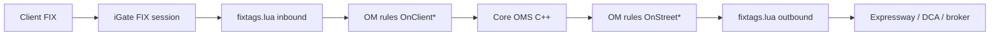

# 02 — Focused: 50 Highest-Frequency Q&A

Ranked most-likely first. Answers are first-person for the candidate. "Interviewer signal" is third-person.

## Table of Contents

1.  Walk me through the end-to-end wire flow of an order in your OMS.
2.  What does `fixtags.lua` actually do?
3.  How are OM rules structured and deployed?
4.  Explain the EOD purge logic.
5.  What is IRST and how do you populate tag 99063?
6.  Walk me through a real production incident you owned.
7.  What is ATDL and where does it live in the stack?
8.  How do custom tags 5000, 5011, 30056, 31284 work?
9.  Tell me about the IOBX Multi-Cross truncation bug.
10. Explain the tag 12/13 commission leak on the merged DMA replace.
11. Why did the alert not fire for one trader?
12. Describe a non-standard settle IOBX cross going out half-agency-half-principal.
13. What is a "basket" in purge terms — why can one child keep the whole basket alive?
14. What is the difference between `OnClientNew` and `OnStreetNew`?
15. Explain compound tag 109 splitting in APAC.
16. What is `rem_tag` and when do you use it?
17. Alias-to-CompID routing via tag 30056 — walk me through it.
18. What are `MERGE`, `ISO`, and `IRST` compliance-ID suffixes?
19. What is `FLEX_REGION` and how does it affect behavior?
20. How do you debug a FIX session that keeps dropping?
21. A trader says their child slice is stuck "New" — how do you investigate?
22. What is tag 21220 and why do you stamp it outbound?
23. Explain `sysOrderType 13 = AgencyMerged`.
24. What does connection class `OexConnection` do vs `OMConnection`?
25. What is `DacsConnection` and why is entitlement gating important?
26. How does a GTC/GTD order survive EOD purge?
27. What blocks a filled order from being purged?
28. What does `IsActive` vs `IsPurgeable` mean on an order?
29. A DFD (Downstream Fill Delivery) fails at EOD — what happens to the parent?
30. How do you read `LOADER.so.default` back to source `.rule` files?
31. What is `rulebuilder` and how do you rebuild rules?
32. How do you deploy an OM rules change to production safely?
33. What is the difference between a `TextField_t` and `CheckBox_t` in ATDL, and why does it matter?
34. Walk me through debugging an ATDL widget that sends the wrong wire value.
35. What is tag 30865 vs 7865 vs 7801 — PRINC-CROSS, DIRECTED-CROSS, IOBX?
36. Explain 99040 sysOrderType — what values do you see and why?
37. How does tag 99376 (portfolio) get set on principal vs agency legs?
38. A trader complains their DMA fill has commission tags 12/13 populated — where do you look?
39. What is `FLEX_ORDER_COMMISSION_OVERRIDE` and why is the `if (!get_comm_type())` guard there?
40. How does a merged parent order get created — what clears `_comm_type` on it?
41. What is `PropAcctAssign` and when does it fire?
42. What is `ft_mm_rule_acct_assign` and what happens when it is empty?
43. Explain your alert-subscription model — where does the trader-to-alert mapping live?
44. What does `RemoveSubscriptions` do on reconnect, and why is that a footgun?
45. Walk me through the depth/quote pipeline — `DepthConnection`, `BboxConnection`, `NNOConnection`.
46. What is `BarConnection` and where do bars get consumed?
47. What is `CMosConnection`?
48. Give me an example of a runbook you wrote.
49. How would you onboard a new broker to the OMS?
50. What is one thing you would change about the OMS if you owned the roadmap?

---

### Q1. Walk me through the end-to-end wire flow of an order in your OMS.
**Interviewer signal:** Can the candidate draw the box diagram from memory — do they know where transformation happens?
**Answer:**
Client sends a NewOrderSingle over FIX to our iGate session. Inbound path:

1. iGate terminates the FIX session and hands the parsed message to `fixtags.lua` inbound.
2. `fixtags.lua` inbound normalizes tags — resolves alias→CompID via tag 30056, splits compound tag 109 in APAC, strips hash suffixes, stamps tag 21220 event timestamp.
3. The message hits OM rules `OnClientNew` / `OnClientReplace` etc. — these are event-driven `.rule` files compiled into `LOADER.so.default` by rulebuilder.
4. Rules call into vendor core (C++/Linux) which persists the order and drives lifecycle.
5. On the way out, `OnStreetNew` rules fire, add compliance-ID suffixes (MERGE/ISO/IRST), and hand off to `fixtags.lua` outbound.
6. Outbound Lua does connection routing, tag suppression via `rem_tag`, and final envelope work, then Expressway or DCA ships it to the broker.

**Watch-outs:** Do not conflate iGate (session layer) with `fixtags.lua` (application-level transform). Both run before rules.

---

### Q2. What does `fixtags.lua` actually do?
**Interviewer signal:** Depth on the transform layer — most candidates hand-wave "it does mapping".
**Answer:**
`fixtags.lua` is the ingress/egress transform hook. Concretely it does:
- **Connection routing** — picks the outbound session based on order attributes.
- **Tag suppression** via `rem_tag(msg, <tagno>)` — strips tags that would confuse a specific counterparty.
- **Alias → CompID resolution** using tag 30056 (routing alias) to pick the right SenderCompID/TargetCompID.
- **Compound tag 109 splitting** in APAC — the client crams multiple identifiers into 109, we split them into discrete tags.
- **Compliance-ID suffixing** — MERGE for merged parents, ISO for intermarket sweep, IRST for retail-segregation orders.
- **Hash suffix removal** — internal client IDs carry `#nnnn` disambiguators that must not go to the street.
- **Event timestamping** — stamps tag 21220 with our internal event time for latency reconstruction.

**Watch-outs:** Say `rem_tag` not "delete tag". And note that `fixtags.lua` runs on both directions, not just inbound.

---

### Q3. How are OM rules structured and deployed?
**Interviewer signal:** Do they know what a `.rule` file looks like and how it becomes a binary?
**Answer:**
OM rules are event-driven text files with the `.rule` extension. Each rule declares an event trigger (`OnClientNew`, `OnClientReplace`, `OnStreetNew`, `OnStreetFill`, `OnCancelReject`, etc.) and a body that manipulates the order object, sends messages, or vetoes the action. `rulebuilder` compiles the whole rule set into a single shared object — `LOADER.so.default` — which the OMS process `dlopen`s at start. Deploy is: edit `.rule`, run rulebuilder in dev, run the regression harness, promote through UAT, then swap `LOADER.so.default` in prod with a rolling restart or `SIGHUP` reload where supported.
**Watch-outs:** Rules are not scripts interpreted at runtime — they are compiled. Any syntax error blocks the whole build.

---

### Q4. Explain the EOD purge logic.
**Interviewer signal:** Do they understand `IsActive` vs `IsPurgeable` and the basket cascade?
**Answer:**
At EOD a sweeper walks every order and asks two questions: `IsActive()` — is it still working on the street or waiting on something? — and `IsPurgeable()` — can we archive and drop it from the in-memory book? An order is kept if:
- It is GTC/GTD (rolls over).
- It has late-trade-pending fills.
- It has pending fills we have not yet booked.
- It has any open child.
- Booking is not fully done.
- It is a basket and any one member is still active — the whole basket stays.

Only orders that are terminal on all axes get purged. Everything else survives to the next session.
**Watch-outs:** The basket cascade catches people out. One stuck child = whole basket rolls. Also DFD failures block the parent even after the child is filled.

---

### Q5. What is IRST and how do you populate tag 99063?
**Interviewer signal:** Do they know regulatory compliance IDs and where they get set?
**Answer:**
IRST is our internal retail-segregation flag. Tag 99063 is the IRST marker. It gets set in the outbound OM rules based on client account attributes and order origin. `fixtags.lua` outbound then appends the `IRST` compliance-ID suffix to the ClOrdID or a designated tag so the broker's surveillance can key on it. If 99063 is missing on a retail-flow order, surveillance will complain and the trade can be rejected downstream.
**Watch-outs:** IRST is populated in rules, not by the client. Never trust the client-supplied value.

---

### Q6. Walk me through a real production incident you owned.
**Interviewer signal:** Story structure — symptom, triage, root cause, fix, prevention.
**Answer:**
Traders reported their Multi-Cross ticket was rejecting downstream. Symptom: outgoing FIX had tag `21283=IOBX-CROSS-PRE-` — the value was truncated. Triage: grepped outbound logs, confirmed the value from the ATDL ticket was `IOBX-CROSS-PRE-POST` (19 chars) but only 15 chars survived. Traced to the ATDL widget: the checkbox parameter was serialized through `DtagParam_Checkbox` in `utl/include/DtagParam.h:199-200` which used a `char[16]` buffer — hard 15-char cap plus null terminator. `maxLength` in the ATDL XML only applies to `TextField_t`, not `CheckBox_t`, so the ATDL author had no lever. Two fixes: (a) widen `DtagParam_Checkbox` buffers to `char[64]`, or (b) revert the widget to `constValue` + `StateRule` so the wire value is emitted directly instead of going through the checkbox buffer path. We shipped (b) as a hotfix and (a) as the durable fix in the next release. Prevention: added a rulebuilder assertion that any checkbox wire value >15 chars fails the build.
**Watch-outs:** Anonymize — do not name the client. Lead with symptom, not code.

---

### Q7. What is ATDL and where does it live in the stack?
**Interviewer signal:** Do they know ATDL is FIXatdl — the algo-ticket XML standard?
**Answer:**
ATDL (FIXatdl) is the FIX Protocol XML schema for describing algo tickets — parameters, layout, validation, and how each widget maps to a FIX tag on the wire. In our OMS, ATDL files describe broker algo screens: the UI renders from the XML, the trader fills fields, and the ticket serializes each parameter into its declared tag. It lives entirely on the client-side of the ticket flow — by the time the order reaches OM rules, ATDL is done. Widget types include `TextField_t`, `CheckBox_t`, `RadioButton_t`, `DropDownList_t`, and validation via `StateRule` / `Edit`. `Parameter` blocks bind widgets to tags and declare `wireValue`, `constValue`, `fixType`, etc.
**Watch-outs:** ATDL is a spec, not our internal thing. And widget-type quirks (like the `CheckBox_t` buffer bug) are our code, not the spec.

---

### Q8. How do custom tags 5000, 5011, 30056, 31284 work?
**Interviewer signal:** Can they rattle off custom tags without the cheat-sheet?
**Answer:**
- **5000 tradingAcct** — the internal trading account used for booking. Set by client or overridden by `PropAcctAssign` on principal legs.
- **5011 acctType** — account type discriminator (agency, principal, mixed, etc.).
- **30056 routingAlias** — client-facing alias that `fixtags.lua` inbound maps to a real SenderCompID/TargetCompID pair.
- **31284 desk** — desk code for surveillance and P&L attribution.

They travel end-to-end but get transformed at three points: inbound Lua (alias resolution), OM rules (account assignment), outbound Lua (potential suppression).
**Watch-outs:** 5000 is not the same as 5011. And 30056 is *alias* not CompID.

---

### Q9. Tell me about the IOBX Multi-Cross truncation bug.
**Interviewer signal:** Depth of ownership — file path, line numbers, alternate fixes.
**Answer:**
Tag 21283 (`IOBXCrossPrePost`) was being sent as `IOBX-CROSS-PRE-` instead of `IOBX-CROSS-PRE-POST`. The ATDL ticket used a `CheckBox_t` bound to tag 21283 with `wireValue="IOBX-CROSS-PRE-POST"`. On serialization the value flowed through `DtagParam_Checkbox` (`utl/include/DtagParam.h:199-200`) which stored the wire string in a `char[16]` — 15 usable chars. `maxLength` attribute in ATDL only extends `TextField_t` buffers; checkboxes have no such lever. Two fixes:
1. Widen `DtagParam_Checkbox` buffers to `char[64]` — durable, but requires a core rebuild.
2. Change the widget from `CheckBox_t` → `constValue` on the Parameter with a `StateRule` controlling emission — the wire value bypasses the checkbox buffer entirely.
Shipped (2) as hotfix, (1) as long-term.
**Watch-outs:** Do not blame ATDL — the spec is fine, our widget implementation had the fixed buffer.

---

### Q10. Explain the tag 12/13 commission leak on the merged DMA replace.
**Interviewer signal:** Can they read a real bug through the code path?
**Answer:**
A European sell-side broker got tags 12 (Commission) and 13 (CommType) on a DMA replace where commission should have been suppressed. Sequence: client sent New → we merged into an existing agency-merged parent → client sent Replace #1 → clean. Client sent Replace #2 → the replace inbound already carried `_comm_type` (client-populated). Our commission override lives in `FLEX_ORDER_COMMISSION_OVERRIDE` guarded by `if (!get_comm_type())` — the guard was TRUE on Replace #1 (merged parent had `_comm_type=\0` cleared at `OMS.cpp:5123-5125`), but on Replace #2 the incoming message's `_comm_type` was already set, so the guard was FALSE and the override was skipped. Commission leaked through to the street. Fix: change the guard to always override for DMA merged children, or clear `_comm_type` on replace-inbound before the override check.
**Watch-outs:** The bug is not in the merge logic — it is the guard in the override function. Read the whole path.

---

### Q11. Why did the alert not fire for one trader?
**Interviewer signal:** Multi-hypothesis triage — do they consider the plumbing not just the config?
**Answer:**
Trader's subscription matched the alert criteria in the DB, but no alert fired. Walked the code: `AlertSubscriptions` match was correct, generic-alert short-circuit at line 356 should have fired but didn't. Root cause was the in-memory `m_subscriptions` multimap — after a reconnect, `RemoveSubscriptions` cleared the trader's entries, and the DB re-add path missed re-registering into the multimap. So the DB said "subscribed" and the UI said "subscribed" but the runtime dispatch had no entry to match on. Fix: make the re-add path idempotent and add a post-reconnect reconciliation check.
**Watch-outs:** Do not stop at "DB says it's fine" — always check the in-memory dispatcher.

---

### Q12. Describe a non-standard settle IOBX cross going out half-agency-half-principal.
**Interviewer signal:** Understanding of Order::Copy, portfolio propagation, and account assignment ordering.
**Answer:**
IOBX cross on non-standard settle went out with `528=P` (principal leg) but tag 99376 (portfolio) still carried the agency parent's value. Root cause chain:
1. `Order::Copy()` copies `_portfolio` from the agency parent — non-empty.
2. `FirmOrder::ActionStageNew()` has `if (_portfolio.empty()) { assign principal portfolio }` — guard fires only on empty. Non-empty parent value survives.
3. Later `PropAcctAssign` mutates `_trading_acct` (tag 5000) to the principal account but does NOT touch `_portfolio`.
4. `ft_mm_rule_acct_assign` was empty in prod so the safety net did not kick in.

Result: `528=P` says principal, `5000` is principal, but `99376` is agency — a half-agency-half-principal order that surveillance flagged. Fix: clear `_portfolio` on `Order::Copy()` for cross-legs, or have `PropAcctAssign` mirror the portfolio change alongside `_trading_acct`.
**Watch-outs:** The `if (_portfolio.empty())` is the classic "guard on wrong invariant" bug. Non-empty ≠ correct.

---

### Q13. What is a "basket" in purge terms — why can one child keep the whole basket alive?
**Interviewer signal:** Cascade understanding.
**Answer:**
A basket is a grouped list of orders traded as one instruction. Purge treats the basket as an aggregate: `IsPurgeable(basket) = AND over all members`. If any member is still `IsActive` — working, pending fill, has open child, GTC/GTD — the basket carries. This is intentional so P&L and audit stay consistent across the basket, but it means one stuck child on Friday rolls the whole basket into Monday.
**Watch-outs:** Do not say "basket purges member-by-member". That is wrong.

---

### Q14. What is the difference between `OnClientNew` and `OnStreetNew`?
**Interviewer signal:** Do they know the rule event vocabulary?
**Answer:**
`OnClientNew` fires when a New arrives from the client — inbound side, before we send anything to the street. `OnStreetNew` fires when we are about to send a New to the street — outbound side, after core processing and any child/slice generation. Client-side rules do validation, enrichment, account assignment, compliance stamps. Street-side rules do outbound tag shaping, suffix appending, and last-mile suppression.
**Watch-outs:** They are not mirrors — order transformation between them is significant.

---

### Q15. Explain compound tag 109 splitting in APAC.
**Interviewer signal:** Regional quirks awareness.
**Answer:**
Certain APAC clients pack multiple identifiers (e.g. client mnemonic, sub-account, book code) into tag 109 (ClientID) separated by delimiters. `fixtags.lua` inbound detects the APAC session and splits tag 109 into its component tags — typically 109 stays as the mnemonic, and the extras get mapped to internal tags like 5000, 5011, 30056. Without the split, downstream rules would see a compound blob and mis-route.
**Watch-outs:** The split is region-gated via `FLEX_REGION=HK`. Do not enable globally.

---

### Q16. What is `rem_tag` and when do you use it?
**Interviewer signal:** Lua-side hygiene.
**Answer:**
`rem_tag(msg, <tagno>)` deletes a tag from a FIX message inside `fixtags.lua`. Used on the outbound path when a specific counterparty rejects a tag we send, or when we need to strip internal-only tags (99xxx range) before shipping to the street. Also used inbound to drop redundant tags before rule evaluation.
**Watch-outs:** Do not use to hide bugs upstream — strip is a last resort.

---

### Q17. Alias-to-CompID routing via tag 30056 — walk me through it.
**Interviewer signal:** Session-layer routing knowledge.
**Answer:**
Clients send tag 30056 with a human-friendly alias (e.g. `BROKER_X_LOW_TOUCH`). `fixtags.lua` inbound consults a lookup table (typically in a config or the DB) and resolves the alias to a concrete SenderCompID/TargetCompID pair that identifies the actual FIX session. That resolved pair is then attached to the message context so the outbound layer knows which session to ship on. Benefit: clients don't need to know the wire CompIDs, and we can rotate/rename sessions without a client change.
**Watch-outs:** If 30056 is missing or unmapped, default routing kicks in — usually a reject.

---

### Q18. What are `MERGE`, `ISO`, and `IRST` compliance-ID suffixes?
**Interviewer signal:** Compliance-vocab fluency.
**Answer:**
Compliance-ID suffixes are string tags appended to ClOrdID or a designated compliance tag on outbound so the street/broker can categorize the flow:
- `MERGE` — this street order represents a merged parent of multiple client orders.
- `ISO` — Intermarket Sweep Order under Reg NMS.
- `IRST` — internal retail-segregation flag.

Appending happens in `fixtags.lua` outbound after rules have set the corresponding internal tags (99040=13 for merge, 99063 for IRST, etc.).
**Watch-outs:** Suffix is separate from the numeric tag — both go out.

---

### Q19. What is `FLEX_REGION` and how does it affect behavior?
**Interviewer signal:** Env-driven region gating.
**Answer:**
`FLEX_REGION` is a process env var: `EU`, `US`, or `HK`. It gates region-specific logic in Lua and rules: HK enables tag 109 splitting, EU applies MiFID reporting fields, US enables ISO/Reg NMS handling. It is set at process start and read by both the C++ core and Lua hooks.
**Watch-outs:** Never assume region — always check the env var.

---

### Q20. How do you debug a FIX session that keeps dropping?
**Interviewer signal:** Ops instinct.
**Answer:**
1. Check the iGate session log for `Logout` / `Disconnect` reasons and sequence number gaps.
2. Compare `LastSeqNum` on our side vs the counterparty's confirm.
3. Check heartbeat interval (tag 108) mismatch.
4. Look at TestRequest cadence — if we didn't respond in time, they cut us.
5. Network layer — packet capture on the session port for TCP resets.
6. Check for oversized messages (some counterparties reject >4KB).
7. If it's a re-login loop, look for a resend request that we cannot satisfy — may need to reset sequence numbers on both sides.

**Watch-outs:** Do not reset sequence numbers unilaterally — always coordinate with counterparty.

---

### Q21. A trader says their child slice is stuck "New" — how do you investigate?
**Interviewer signal:** Triage discipline.
**Answer:**
1. Get the client OrdID and the internal OrderID from the trader.
2. Grep OM logs for lifecycle events on that order — did it hit `OnStreetNew`, did we send an outbound NewOrderSingle?
3. Check outbound FIX log for the sent message and the counterparty's ack.
4. If we sent but no ack, session issue on the outbound side.
5. If no send, check the rules that fire on `OnStreetNew` for a veto — often a compliance check or account-assignment failure vetoes silently.
6. Check the parent state — if the parent is paused/held, children won't release.

**Watch-outs:** "Stuck New" often means a rule veto with no user-visible reject.

---

### Q22. What is tag 21220 and why do you stamp it outbound?
**Interviewer signal:** Latency instrumentation.
**Answer:**
Tag 21220 is our internal event timestamp — the time the OMS actually processed the event (as opposed to tag 60 TransactTime). Stamped by `fixtags.lua` outbound so downstream latency reconstruction can measure OMS transit time end-to-end. Traders use it during post-trade forensics to prove or disprove "the OMS held my order".
**Watch-outs:** 21220 is not tag 60. Do not overwrite tag 60.

---

### Q23. Explain `sysOrderType 13 = AgencyMerged`.
**Interviewer signal:** Merge semantics.
**Answer:**
Tag 99040 is our sysOrderType. Value 13 = `AgencyMerged` — this is a synthetic parent that aggregates multiple client agency orders into one street order for better fill economics. The parent is created by rules on `OnClientNew` when merge criteria match (same symbol, side, timeframe, account bucket). Children point at the merged parent, fills are split back to children pro-rata.
**Watch-outs:** Merged parents have specific state — e.g. `_comm_type=\0` cleared — that downstream code sometimes forgets to handle.

---

### Q24. What does connection class `OexConnection` do vs `OMConnection`?
**Interviewer signal:** Core class fluency.
**Answer:**
`OMConnection` is the primary order-messaging connection — inbound orders and outbound street traffic flow via OM sessions. `OexConnection` is the order-execution / execution-report path — it handles fills and execution reports coming back. They are separate class hierarchies so lifecycle can be tuned independently.
**Watch-outs:** They can be conflated because both carry FIX. Different classes, different sessions.

---

### Q25. What is `DacsConnection` and why is entitlement gating important?
**Interviewer signal:** Market-data entitlement.
**Answer:**
`DacsConnection` fronts the Refinitiv/LSEG DACS entitlement server. Any market-data connection (`DepthConnection`, `BboxConnection`, `BarConnection`) must be entitlement-checked against DACS before serving data to a user. If DACS is down or the user is not entitled, data is suppressed. It matters because feeding non-entitled data is a contract violation with the exchange and can trigger fines.
**Watch-outs:** Never bypass DACS for "convenience".

---

### Q26. How does a GTC/GTD order survive EOD purge?
**Interviewer signal:** Time-in-force handling.
**Answer:**
GTC (Good Till Cancel) and GTD (Good Till Date) orders have `IsActive=true` at EOD by design. The purge sweeper reads TIF (tag 59) and skips these. The order rolls into the next session, keeping its state and any working street quantity. Rules on session-start re-establish the outbound working state.
**Watch-outs:** GTD past expiry must be handled — the purger should recognize the date has passed.

---

### Q27. What blocks a filled order from being purged?
**Interviewer signal:** Post-fill lifecycle knowledge.
**Answer:**
- Booking not fully complete.
- Pending fills not yet acknowledged.
- Late-trade-pending — a fill arrived after we thought the order was done.
- DFD (Downstream Fill Delivery) failed — we could not push the fill to a downstream system.
- Open child — parent stays if any child is not terminal.
- Basket member alive — parent stays.

Only when all boxes tick does `IsPurgeable` return true.
**Watch-outs:** "Filled" is not "purgeable". Two different states.

---

### Q28. What does `IsActive` vs `IsPurgeable` mean on an order?
**Interviewer signal:** Semantic precision.
**Answer:**
`IsActive` — the order is still working or expecting further activity. GTC, GTD, open on the street, waiting on a fill ack, waiting on a booking. `IsPurgeable` — the order is terminal AND all downstream obligations (booking, DFD, child cascade) are complete. An order can be `!IsActive && !IsPurgeable` — done trading but not yet safe to drop from memory.
**Watch-outs:** They are not opposites. There is a state in between.

---

### Q29. A DFD (Downstream Fill Delivery) fails at EOD — what happens to the parent?
**Interviewer signal:** Failure semantics.
**Answer:**
DFD failure blocks purge. The parent stays alive in the book, gets an operational alert to the support desk, and the DFD retry loop keeps trying overnight. At next session-start we reconcile — if the downstream system finally accepts, DFD succeeds and next EOD will purge cleanly. If not, support intervenes manually with the downstream team.
**Watch-outs:** Do not force-purge a DFD-failed order — you lose fill audit.

---

### Q30. How do you read `LOADER.so.default` back to source `.rule` files?
**Interviewer signal:** Debug reflex.
**Answer:**
`LOADER.so.default` is a compiled shared object — you don't read it back. You read the `.rule` sources in the rules directory; the loader is a build artifact. For debugging, log statements inside rules print at runtime, and rulebuilder produces symbol maps if you need to trace which rule fired. If someone lost the sources, they have a bigger problem.
**Watch-outs:** Do not `strings` the loader and pretend that's source-of-truth.

---

### Q31. What is `rulebuilder` and how do you rebuild rules?
**Interviewer signal:** Build workflow.
**Answer:**
`rulebuilder` is the compiler tool that takes `.rule` sources and emits `LOADER.so.default`. Workflow: edit rule, run `rulebuilder` in the dev environment, it produces a new loader plus a diagnostic report. Deploy the loader alongside the OMS binary; the process picks it up on next start or reload.
**Watch-outs:** Rulebuilder failures block the build — one broken rule fails the whole loader.

---

### Q32. How do you deploy an OM rules change to production safely?
**Interviewer signal:** Release discipline.
**Answer:**
1. Reproduce the trigger in dev, write the rule change.
2. Run rulebuilder — clean build.
3. Run the regression harness against a captured production message set.
4. Deploy to UAT, run traders' smoke scenarios.
5. Schedule the prod deploy at a maintenance window — swap `LOADER.so.default`, restart or reload.
6. Watch outbound FIX and alerts for the first hour.
7. Have a documented rollback (previous loader kept next to the new one).

**Watch-outs:** Never deploy a rules change during trading hours without maintenance approval.

---

### Q33. What is the difference between a `TextField_t` and `CheckBox_t` in ATDL, and why does it matter?
**Interviewer signal:** ATDL widget knowledge — tied to the bug story.
**Answer:**
`TextField_t` is a free-text input widget; the trader types a value that gets serialized to the tag. `CheckBox_t` is a boolean widget — when checked it emits `checkedEnumRef` (typically a fixed wire value), when unchecked it emits `uncheckedEnumRef` or nothing. `maxLength` in ATDL applies only to `TextField_t` — it does NOT extend the internal buffer for `CheckBox_t`. In our implementation, `DtagParam_Checkbox` uses a fixed `char[16]` buffer, so any wire value >15 chars gets truncated silently.
**Watch-outs:** `maxLength` on a checkbox does nothing. Common confusion.

---

### Q34. Walk me through debugging an ATDL widget that sends the wrong wire value.
**Interviewer signal:** ATDL debug muscle.
**Answer:**
1. Capture outbound FIX for the affected order — see the actual tag value.
2. Open the ATDL XML — find the `Parameter` block for that tag.
3. Note the widget type (`TextField_t`, `CheckBox_t`, `DropDownList_t`) and the wire-value source (`wireValue`, `constValue`, `checkedEnumRef`).
4. If value is truncated, suspect fixed-buffer widgets (`DtagParam_Checkbox` has a 15-char cap).
5. If value is missing, check `StateRule` — the widget may be disabled/hidden.
6. If value is wrong enum, check `EnumPair` mappings.
7. Reproduce in the ATDL previewer with logging.

**Watch-outs:** ATDL previewer masks buffer bugs — they only surface at wire serialization time.

---

### Q35. What is tag 30865 vs 7865 vs 7801 — PRINC-CROSS, DIRECTED-CROSS, IOBX?
**Interviewer signal:** Custom-tag recall.
**Answer:**
- **30865 PRINC-CROSS** — principal cross indicator; the firm takes the other side.
- **7865 DIRECTED-CROSS** — directed cross to a specific counterparty.
- **7801 IOBX** — Internal Order Book crossing (our internal dark pool).

They mark the cross type for surveillance and reporting. Rules set them on `OnClientNew` based on ticket attributes; `fixtags.lua` outbound suffixes ClOrdID with the corresponding compliance ID.
**Watch-outs:** These are non-standard tags — never assume they exist on inbound from a client.

---

### Q36. Explain 99040 sysOrderType — what values do you see and why?
**Interviewer signal:** Order-type enum fluency.
**Answer:**
Tag 99040 is our internal sysOrderType. Value 13 = `AgencyMerged` (merged parent). Other values cover agency child, principal, mixed, cross, program-trade — each drives different downstream logic. Rules and post-trade systems key on 99040 to route reporting.
**Watch-outs:** Do not confuse 99040 with tag 40 OrdType (standard FIX).

---

### Q37. How does tag 99376 (portfolio) get set on principal vs agency legs?
**Interviewer signal:** Portfolio propagation — tied to the IOBX cross incident.
**Answer:**
Portfolio should mirror the account: agency parent carries the agency portfolio, principal leg carries the principal portfolio. Setter path on principal:
1. `Order::Copy()` copies `_portfolio` from parent — starts with agency value.
2. `FirmOrder::ActionStageNew()` has `if (_portfolio.empty()) { set principal }` — guard fires only if parent was empty.
3. `PropAcctAssign` sets `_trading_acct` to principal but does NOT touch `_portfolio`.

Bug I found: when the agency parent has a non-empty portfolio, the principal leg inherits it and never gets corrected. Fix is to force portfolio reassignment when `PropAcctAssign` fires.
**Watch-outs:** Guard is `empty()` not `!= principal`. Wrong invariant.

---

### Q38. A trader complains their DMA fill has commission tags 12/13 populated — where do you look?
**Interviewer signal:** Commission-override path.
**Answer:**
1. Grab the child street order and its history — how many replaces?
2. For each replace, check whether the inbound message from client carried `_comm_type`.
3. Trace through `FLEX_ORDER_COMMISSION_OVERRIDE` — the guard `if (!get_comm_type())` skips override if inbound already has comm_type set.
4. Check the parent — is it merged (99040=13)? Merged parents have `_comm_type=\0` cleared at `OMS.cpp:5123-5125`.
5. If inbound comm_type is set on a replace, the override skips and comm bleeds through to the street.

Fix: unconditionally clear comm_type on merged DMA children before override.
**Watch-outs:** Bug was on 2nd replace, not 1st. Repro needs the full sequence.

---

### Q39. What is `FLEX_ORDER_COMMISSION_OVERRIDE` and why is the `if (!get_comm_type())` guard there?
**Interviewer signal:** Reading the override function.
**Answer:**
`FLEX_ORDER_COMMISSION_OVERRIDE` is a hook in the OMS that stamps commission tags 12/13 based on the internal commission schedule. The guard `if (!get_comm_type())` was intended to respect a client-supplied commission override — i.e. "if the client explicitly set comm_type, trust them." In practice, on merged DMA parents we should never trust client comm_type on a replace, so the guard is too permissive.
**Watch-outs:** The guard exists for a reason (non-merged flow). Do not remove it globally.

---

### Q40. How does a merged parent order get created — what clears `_comm_type` on it?
**Interviewer signal:** Merge internals.
**Answer:**
When `OnClientNew` decides to merge, rules create a synthetic parent with `sysOrderType=13`. During creation, `OMS.cpp:5123-5125` explicitly clears `_comm_type = \0` because merged parents represent aggregate flow with no single client-level comm arrangement. Downstream override then fills it from the internal schedule.
**Watch-outs:** `\0` is null-char clearing, not empty string. Read the code.

---

### Q41. What is `PropAcctAssign` and when does it fire?
**Interviewer signal:** Account-assignment lifecycle.
**Answer:**
`PropAcctAssign` (proprietary account assignment) fires on principal-leg creation to switch `_trading_acct` (tag 5000) from the agency parent's account to the firm's principal account. It runs after `Order::Copy()` and before outbound rules stamp compliance IDs.
**Watch-outs:** It only touches `_trading_acct` — does not mirror to `_portfolio` (99376). Root cause of the IOBX cross bug.

---

### Q42. What is `ft_mm_rule_acct_assign` and what happens when it is empty?
**Interviewer signal:** Config-safety-net awareness.
**Answer:**
`ft_mm_rule_acct_assign` is a market-maker rule table that acts as a safety net for account assignment when `PropAcctAssign` misses. In prod this table was empty at the time of the IOBX cross incident — so no safety net kicked in, and the bad portfolio propagation shipped to the street. Adding baseline entries to `ft_mm_rule_acct_assign` is a common hardening step.
**Watch-outs:** Empty in prod is a config gap, not a code bug — but code should be defensive.

---

### Q43. Explain your alert-subscription model — where does the trader-to-alert mapping live?
**Interviewer signal:** Alert plumbing.
**Answer:**
Trader-to-alert mapping lives in the `AlertSubscriptions` table in the DB. At OMS start-up, the process loads subscriptions into an in-memory `m_subscriptions` multimap keyed by trader ID. When an event fires that could trigger an alert, dispatcher walks `m_subscriptions` and generates alerts for matching entries. There is a short-circuit at line 356 for generic alerts.
**Watch-outs:** DB has the truth; multimap has the runtime dispatch. If they drift, alerts silently drop.

---

### Q44. What does `RemoveSubscriptions` do on reconnect, and why is that a footgun?
**Interviewer signal:** Reconnect-path bug awareness.
**Answer:**
On trader reconnect, `RemoveSubscriptions` clears the trader's entries from `m_subscriptions` — reasonable cleanup. The footgun is the re-add path: if the DB re-read on reconnect doesn't correctly repopulate the multimap (bug in the re-registration code), the trader ends up "subscribed in DB, unsubscribed in runtime." UI shows subscribed, alerts don't fire. Root cause of the "alert not firing for one trader" incident.
**Watch-outs:** Always test reconnect scenarios for alerts — not just cold start.

---

### Q45. Walk me through the depth/quote pipeline — `DepthConnection`, `BboxConnection`, `NNOConnection`.
**Interviewer signal:** Market-data class fluency.
**Answer:**
- `DepthConnection` — full order book depth feed from an exchange or venue.
- `BboxConnection` — Best-Bid-and-Offer (top-of-book) feed.
- `NNOConnection` — normalized/net order feed for smart-router consumption.

All are entitlement-gated through `DacsConnection`. They feed the internal book and are consumed by pricing, smart-order-router, and the trading UI.
**Watch-outs:** Depth ≠ BBO. Do not treat them as interchangeable.

---

### Q46. What is `BarConnection` and where do bars get consumed?
**Interviewer signal:** Bar / OHLC data.
**Answer:**
`BarConnection` streams bar (OHLC) data — typically 1-minute, 5-minute, etc. Consumed by charts in the trading UI, VWAP/TWAP algos, and post-trade analytics. Entitlement via DACS.
**Watch-outs:** Bars are derived from trades — not a substitute for tick data.

---

### Q47. What is `CMosConnection`?
**Interviewer signal:** Do they know the less-common connection classes?
**Answer:**
`CMosConnection` is our client-messaging orders session — a client-facing OM connection variant used for specific client integrations (typically buy-side clients on a proprietary session with custom auth or heartbeat behavior). Similar semantics to `OMConnection` but with client-specific hooks.
**Watch-outs:** If you don't know, say "I've seen it in the class list but haven't debugged it recently."

---

### Q48. Give me an example of a runbook you wrote.
**Interviewer signal:** Ops maturity.
**Answer:**
Runbook: "Alert not firing for a specific trader."
1. Confirm the alert is expected to fire — check `AlertSubscriptions` in DB for the trader ID + alert type.
2. Check trader recent reconnect events — grep session log for logout/login in last 24h.
3. Dump `m_subscriptions` multimap via admin console — verify trader entry present.
4. If DB has it but multimap does not — force a subscription refresh via admin command.
5. Test with a synthetic event.
6. If persists, open a bug, attach logs, notify the alerts team.
7. Post-fix: verify next reconnect re-registers cleanly.

Runbook lives in the team's Confluence, updated after every reoccurrence.
**Watch-outs:** Runbook should have decision points, not just steps.

---

### Q49. How would you onboard a new broker to the OMS?
**Interviewer signal:** Broker-onboarding process.
**Answer:**
1. Get the broker's FIX spec — supported tags, session parameters, ClOrdID format.
2. Configure the iGate session — CompIDs, ports, heartbeat, TLS.
3. Add alias mapping in `fixtags.lua` — 30056 → session.
4. Write outbound rule adjustments — tag suppression, custom fields.
5. Load ATDL for the broker's algos if any.
6. UAT: run a certification test pack — Newton, Amend, Cancel, Fills, Reject scenarios.
7. Coordinate cert with the broker on their UAT env.
8. Prod cutover: staged (one trader first), monitor, then full rollout.
9. Add DACS entitlements if the broker provides market data.

**Watch-outs:** Do not skip the cert pack — every new broker has quirks.

---

### Q50. What is one thing you would change about the OMS if you owned the roadmap?
**Interviewer signal:** Product thinking, not just support.
**Answer:**
Introduce a compile-time or rulebuilder-time schema check that validates ATDL wire-value lengths against the internal buffer sizes of each widget implementation. The IOBX truncation bug I described would have failed the build instead of shipping — a `char[16]` widget carrying a 19-char wireValue would raise a rulebuilder error. Broader: I'd invest in a shared "invariants" layer that reasserts things like "portfolio matches account family" and "comm_type is cleared on merged children" every N events, so silent state drift shows up as a fast alert instead of a broker-flagged trade.
**Watch-outs:** Do not overreach — pick one concrete change, tie it to a real incident, and show ROI.
