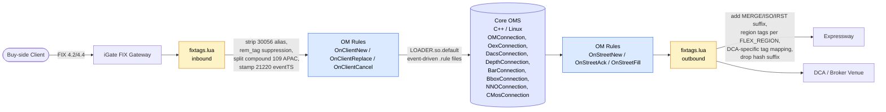
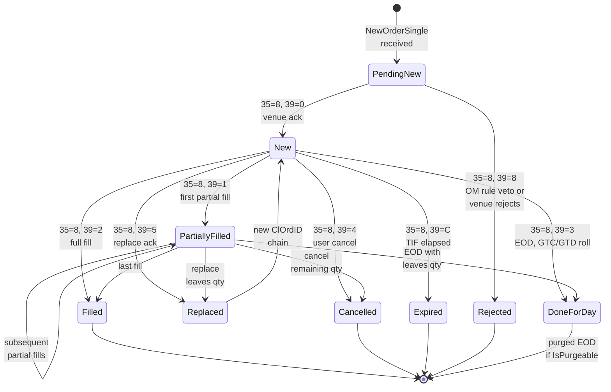
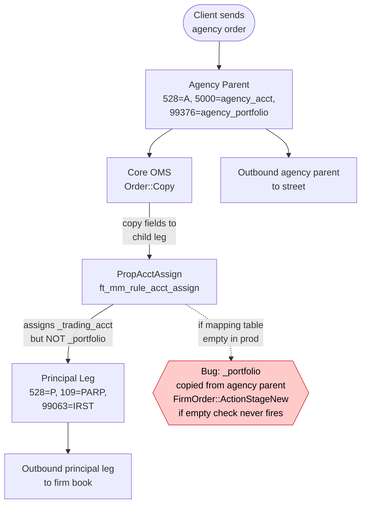
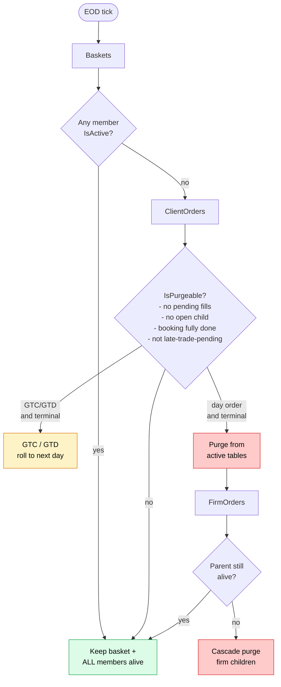
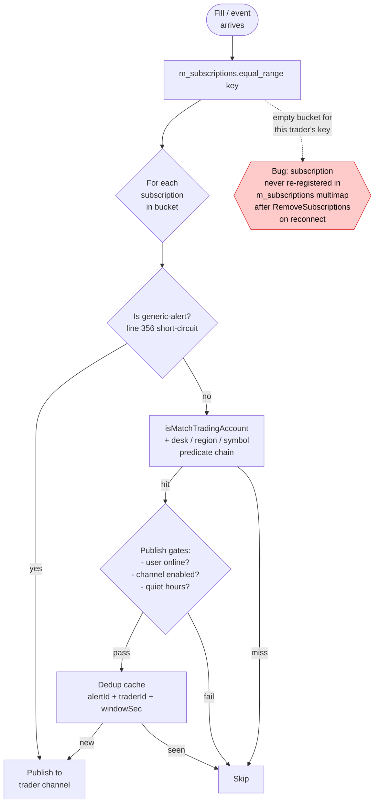
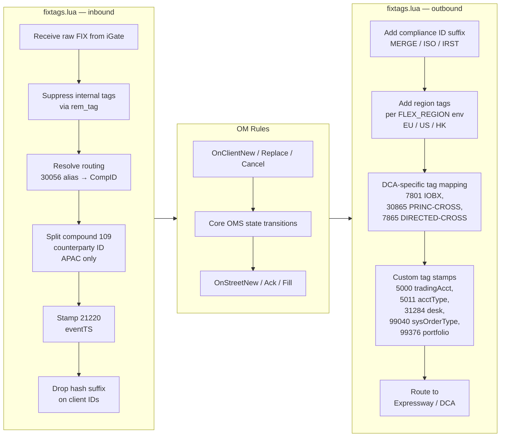
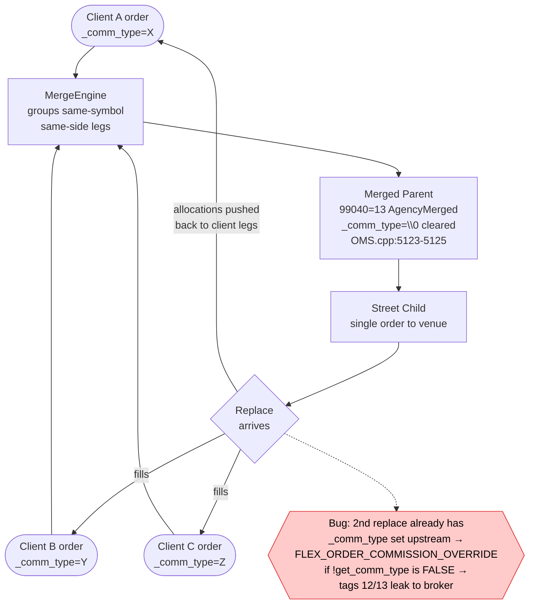

# Whiteboard Diagram Set — OMS Internal Codebase

Practice each of these until you can draw them on a whiteboard from memory in under 3 minutes. The caption under each block is what an interviewer wants to hear you *say* while pointing at the diagram — not just what to draw.

---

## 1. End-to-End Order Wire Flow

**Title:** Client order → downstream venue, showing every transform hop.

**Caption:** Walk the interviewer left-to-right and name the layer's *job*: iGate terminates the FIX session, `fixtags.lua` is a scriptable transform layer that does connection routing, tag suppression, alias→CompID resolution via 30056, and stamps event timestamps in 21220. OM rules are the business layer — event-driven `.rule` files (`OnClient*` inbound, `OnStreet*` outbound) that compile to `LOADER.so.default` via rulebuilder. Core OMS is the C++ state machine that owns the order book across the OMConnection/OexConnection/DacsConnection/etc. family of connection classes.

---

## 2. Order State Machine

**Title:** Full FIX-39 lifecycle a single order can traverse.

**Caption:** Emphasize that `PendingNew` and `Replaced` are transient — the interviewer wants to hear you name the terminal states (`Filled`, `Cancelled`, `Expired`, `Rejected`, `DoneForDay`) and the fact that `Replaced` re-enters `New` under a fresh ClOrdID, which is the whole reason our merged-parent commission bug on the 2nd replace was subtle. Also call out that `DoneForDay` is where the EOD purge cascade decides who dies vs. who rolls (GTC/GTD survive).

---

## 3. IRST Cross Flow (Agency Parent → Principal Leg)

**Title:** Interlisted retail-flow cross — the two-leg dance where non-std settle bit us.

**Caption:** Frame it as a two-leg workflow: the agency parent (528=A) triggers a principal offset leg (528=P) tagged with 109=PARP counterparty and 99063=IRST as the compliance suffix. The failure the interviewer will drill into: `Order::Copy()` propagates `_portfolio` from the agency parent, so `FirmOrder::ActionStageNew()`'s `if(_portfolio.empty())` guard never fires, and `PropAcctAssign` only rewrites `_trading_acct` — leaving a half-agency-half-principal record when the mapping rule table is empty in that region.

---

## 4. EOD Purge Cascade

**Title:** Who lives, who dies, who rolls — end-of-day housekeeping.

**Caption:** The key insight for the interviewer is the *cascade direction* — baskets hold the whole tree alive if even one leg is active, so a single stuck child (booking-not-fully-done, pending fill, open street child, late-trade-pending) protects the entire basket from purge. GTC/GTD orders roll on their own axis independent of the basket check. Firm orders are dependent leaves — they only get purged after their client parent is confirmed dead, otherwise you orphan them.

---

## 5. Alert Subscription Match Flow

**Title:** How a fill event finds the right traders to notify.

**Caption:** Sell the flow as three phases: (1) `equal_range` on the subscription multimap keyed by whatever fired the event, (2) predicate match per subscription — `isMatchTradingAccount` plus desk/region/symbol filters, with a fast-path for generic alerts that short-circuits the match, and (3) publish gates + dedup so the trader doesn't get spammed. The specific incident to have ready: one trader's subscription looked correct in the DB but never made it back into `m_subscriptions` after a reconnect — `RemoveSubscriptions` cleared the in-memory map and the DB re-add path missed re-registering, so `equal_range` returned an empty bucket.

---

## 6. FIX Tag Transform Pipeline

**Title:** What `fixtags.lua` does on the inbound and outbound sides.

**Caption:** Frame `fixtags.lua` as the seam between "wire format" and "domain model" — inbound it strips things the OM shouldn't see, resolves aliases to real CompIDs, and normalizes edge cases like APAC's compound 109 tag. Outbound it decorates orders with compliance suffixes (MERGE for merged parents, ISO for intermarket sweeps, IRST for interlisted retail), region-specific tags driven by `FLEX_REGION`, and DCA-only tags like 7801 IOBX / 30865 PRINC-CROSS / 7865 DIRECTED-CROSS. This is where a lot of production bugs live because it's easy to forget to strip an internal tag or double-add a suffix on replaces.

---

## 7. Merged Order Parent/Child Relationship

**Title:** Agency-merged DMA — one parent, many client legs, one street child.

**Caption:** Explain the fan-in / fan-out shape: multiple client legs collapse into one merged parent (`99040=13 AgencyMerged`), which spawns a single street child so we get one execution and better price improvement, then fills are allocated back down to the original client legs on the return path. The commission bug lives on replace — the merged parent explicitly clears `_comm_type` at `OMS.cpp:5123-5125` to prevent leaking client commission tags outbound, but on the 2nd replace the incoming message already carries `_comm_type` set upstream, so `FLEX_ORDER_COMMISSION_OVERRIDE`'s `if(!get_comm_type())` guard evaluates false and tags 12/13 escape to the sell-side broker.

---

## Whiteboard Practice Tips

- Draw each diagram cold, no reference, in under 3 minutes.
- Say the *caption* out loud while drawing — that's the muscle you're building for the actual interview.
- When you narrate a bug, follow the pattern: **symptom → suspect code path → line-level root cause → the guard/check that failed → the fix**.
- Anchor every diagram to at least one real production incident from your history — makes the story stick and shows you've owned prod, not just read the code.
