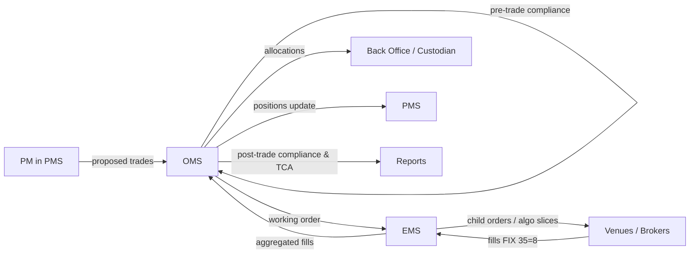
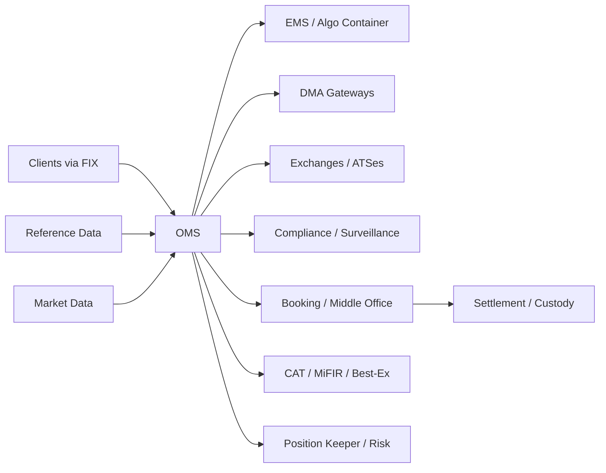
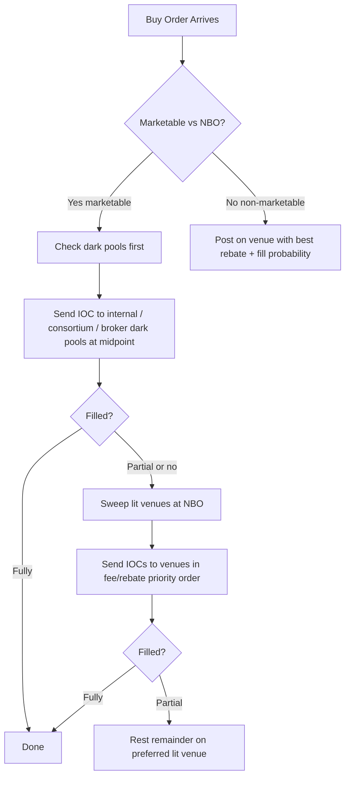

# 02 — OMS & Market Comprehensive Q&A

> 100+ questions on OMS/EMS, US equities, options, FX/FI, market structure and regulation.

---

## 1. OMS vs EMS vs PMS vs TMS (10 Q&A)

### Q1. Define OMS, EMS, PMS, and TMS in one sentence each.
**Interviewer signal:** Do you actually know what these systems do or are you conflating them?
**Answer:**
- **OMS (Order Management System):** The system of record for the order lifecycle — takes orders from PMs or clients, enforces compliance, routes to brokers/venues, tracks state (new/partial/filled/cancelled), and captures allocations and fills for downstream booking.
- **EMS (Execution Management System):** A trader-facing tool optimized for slicing, algo selection, TCA, low-latency market data, and direct venue/broker connectivity — focused on the microstructure of getting the order done.
- **PMS (Portfolio Management System):** Holds positions, cash, NAV, exposures, and P&L; used by PMs for what-if analysis, rebalancing, and generating orders that get pushed into the OMS.
- **TMS (Treasury Management System):** Manages cash, funding, FX, liquidity, and payments at the firm/treasury level — different domain from equity/derivatives trading, but frequently confused with OMS.
**Watch-outs:** Candidates who describe OMS and EMS as the same. They overlap but the OMS is book-of-record, the EMS is execution-workflow.

### Q2. In a typical buy-side flow, what triggers an order in the OMS and where does it come from?
**Interviewer signal:** Understanding of upstream systems and PM-to-trader handoff.
**Answer:**
Orders originate in the PMS when a portfolio manager rebalances or acts on a model signal. The PMS generates a proposed trade list — target vs current weights — and pushes those into the OMS (often over FIX or a proprietary API). The OMS runs pre-trade compliance (concentration, restricted list, wash-sale), assigns to a trader/desk, and either stages the order for manual routing or sends it straight to the EMS for algo execution. In some setups the PM works directly in the OMS with a model-driven order pad, so the boundary is fuzzy.
**Watch-outs:** Saying "the trader creates the order" — on the buy-side the PM usually does, and the trader executes.

### Q3. Why do most sell-side desks still run OMS and EMS as separate systems?
**Interviewer signal:** Awareness of trade-offs — one platform sounds simpler but there are reasons.
**Answer:**
Latency and specialization. The EMS lives close to the wire — it needs microsecond market data, colocated FIX sessions, algo containers, and rapid iteration on execution logic. The OMS is transaction-heavy, needs durability, audit trails, allocations, position keeping, and regulatory reporting. Merging them means either compromising EMS latency by dragging in OMS bookkeeping, or bloating the OMS with hot-path code. Vendors also specialize — an EMS vendor and an OMS vendor tune very differently. That said, "OEMS" (combined) products exist and are common on the buy-side where latency demands are lower.
**Watch-outs:** Claiming OEMS is universally better — on high-touch sell-side flow desks, separation is deliberate.

### Q4. Which system owns compliance checks, and what's the difference between pre-trade and post-trade compliance?
**Interviewer signal:** Regulatory awareness and understanding of where checks fire.
**Answer:**
The OMS owns compliance because it sits before the order goes out and after fills come back. **Pre-trade** checks fire before routing — restricted list, position limits, concentration, credit lines, mandate rules (e.g. no tobacco), reg checks (Reg SHO locate for shorts, uptick). If any fail, the order is blocked or routed to a supervisor for override. **Post-trade** compliance runs on fills — best-execution analysis, mandate breach detection at end of day, wash-sale identification. Some pre-trade checks (fat-finger, price collar) can also live in the EMS or venue gateway to catch problems closer to the wire, but the OMS is the authoritative record.
**Watch-outs:** Forgetting that some checks are duplicated in EMS/gateway for defense-in-depth.

### Q5. Where in this stack does a Technical Analyst on production support typically get involved?
**Interviewer signal:** Do you understand the operational reality of the job?
**Answer:**
Everywhere the systems talk to each other. Most production tickets are on the seams: PMS-to-OMS trade list didn't flow, OMS-to-EMS handoff hung, FIX session to broker down, allocation didn't book to back office, compliance rule fired unexpectedly. On our OMS I'd spend most of my day on FIX session issues, stuck orders, misconfigured client routing rules, tag-level rejects from destinations, and reconciliation gaps between OMS positions and downstream books. Deep dives into single-system internals happen less often than boundary debugging.
**Watch-outs:** Saying "I only debug the OMS" — real support work is end-to-end.

### Q6. Draw the flow from PM idea to booked trade.
**Interviewer signal:** Can you narrate the full lifecycle without missing steps.
**Answer:**

The key idea is that fills flow back the same way orders flow out, and the OMS is the pivot point that fans out to allocations, positions, and reporting.
**Watch-outs:** Missing the fill-back path or forgetting allocation.

### Q7. If a fill comes in on the EMS but the OMS shows the order as still working, where do you look?
**Interviewer signal:** Real production instinct — reconciliation and message loss.
**Answer:**
Three main places. First, the FIX session between EMS and OMS — check sequence numbers, resend requests, and whether the ExecutionReport (35=8) with ExecType=F was actually delivered. Second, the OMS message processor — sometimes the fill is received but stuck in a queue or errored on a downstream persist (DB deadlock, missing reference data for the instrument). Third, message content — a mismatched ClOrdID, OrderID, or execution ID means the OMS can't correlate it to the parent order. On our OMS I'd pull the raw FIX log, confirm the message arrived, then trace it through the internal event bus. Nine times out of ten it's either a sequence gap or a reference data problem, not real data loss.
**Watch-outs:** Blaming the EMS immediately — the message usually made it, something on the OMS side rejected or stalled it.

### Q8. What is an OEMS and why is it popular on the buy-side?
**Interviewer signal:** Vendor landscape awareness.
**Answer:**
An OEMS is a combined Order and Execution Management System in one product. It's popular on the buy-side because buy-side traders don't need sub-millisecond latency and benefit hugely from a single blotter — no reconciliation between two systems, one compliance layer, one position view, one audit trail. Vendors like Charles River, BlackRock Aladdin, and Bloomberg AIM are effectively OEMS platforms. On the sell-side, latency-critical desks still separate them.
**Watch-outs:** Assuming OEMS is a new concept — it's been standard on the buy-side for over a decade.

### Q9. How does a PMS differ from an accounting or portfolio-accounting system?
**Interviewer signal:** Precision on system boundaries — front vs middle/back office.
**Answer:**
A PMS is a front-office decision-support tool — real-time or near-real-time positions, exposures, scenario analysis, model-driven order generation. A portfolio accounting system is a middle/back-office record — official positions, corporate actions applied, income accrued, NAV struck, reconciled to custodians. The PMS pulls a start-of-day position from accounting and applies intraday trades from the OMS to stay current. They're often confused because both talk about "positions", but the accounting system is the golden source and the PMS is a working copy.
**Watch-outs:** Treating PMS as accounting — a PM cares about exposure and risk, not settled cost basis.

### Q10. Where does a TMS fit and why is it usually outside the trading stack?
**Interviewer signal:** Do you know TMS is a different domain, not just another OMS acronym?
**Answer:**
A Treasury Management System manages corporate cash, funding, liquidity, FX hedging, intercompany loans, and bank connectivity for payments. It's used by the corporate treasury or bank treasury desk, not equity/derivatives traders. It does interact with trading — the treasury desk might place FX or money-market trades that flow through an FX OMS — but the TMS itself is focused on cash position, forecasts, and payments, not equity/derivatives order routing. On a trading floor you'd rarely touch a TMS unless you're on FX or liquidity operations.
**Watch-outs:** Confusing TMS with "Trade Management System" — some vendors use TMS to mean trade lifecycle for OTC derivatives, so always clarify context.

## 2. Buy-side vs sell-side OMS (10 Q&A)

### Q1. What's the fundamental difference between a buy-side OMS and a sell-side OMS?
**Interviewer signal:** Do you understand who each system serves?
**Answer:**
A buy-side OMS serves asset managers, hedge funds, and pension funds — its users are PMs and buy-side traders acting for a fund. It emphasizes portfolio-level workflows: rebalancing, mandate compliance, allocation across sub-accounts, IBOR-style positions, TCA, broker selection. A sell-side OMS serves broker-dealers executing on behalf of clients — it emphasizes client order intake, agency vs principal handling, order books, DMA and algo routing, inventory and risk management, and regulatory reporting for a broker (OATS/CAT, best execution obligations). Buy-side thinks in portfolios and allocations; sell-side thinks in client orders and executions.
**Watch-outs:** Saying "buy-side buys and sell-side sells" — both sides do both, the distinction is who they act for.

### Q2. Name the leading buy-side OMS/OEMS products and roughly what each is known for.
**Interviewer signal:** Vendor landscape literacy.
**Answer:**
- **Charles River (CRD / State Street Alpha):** Broad multi-asset OEMS, dominant with large asset managers, strong compliance engine.
- **BlackRock Aladdin:** Integrated PMS + OMS + risk platform, popular with pension funds and insurers; risk analytics is the crown jewel.
- **Eze OMS (SS&C Eze):** Strong in hedge funds, flexible workflows, popular with smaller and mid-size funds.
- **Bloomberg AIM:** Integrated with the Bloomberg terminal, common at fixed-income and multi-strategy shops.
- **SimCorp Dimension:** Big in Europe, front-to-back including accounting.
- **FactSet / Enfusion:** Newer cloud-native OEMS for hedge funds.
**Watch-outs:** Mixing Aladdin (buy-side platform) with BlackRock's own asset management — the platform is licensed to competitors.

### Q3. Name the leading sell-side OMS products.
**Interviewer signal:** Same question, different side.
**Answer:**
- **Fidessa (ION):** The dominant sell-side equity OMS globally — cash equities, DMA, algo, market-making, extensive venue connectivity.
- **Bloomberg TOMS:** Sell-side fixed-income OMS — inventory, RFQ, market-making for bonds and rates.
- **Our OMS vendor:** Multi-asset OMS/EMS, popular for cross-asset and derivatives desks.
- **Broadridge (Paladyne, Instinet BEST):** Various sell-side platforms, strong in mid-tier brokers and post-trade.
- **ION (multiple products via acquisition):** Owns Fidessa, Wall Street Systems, and others.
**Watch-outs:** Forgetting that ION now owns Fidessa — many "Fidessa" conversations are really ION conversations.

### Q4. Why would a hedge fund pick Eze over Aladdin?
**Interviewer signal:** Vendor selection reasoning.
**Answer:**
Cost, flexibility, and fit. Aladdin is a heavyweight platform priced and structured for the largest asset managers with long-only mandates and heavy risk analytics needs. A mid-size hedge fund running L/S equity or event-driven strategies would find Aladdin overkill and expensive, and might chafe at its opinionated workflows. Eze is lighter, more configurable to hedge-fund workflows (shorts, prime broker locates, PB reconciliation, side pockets), and cheaper. Aladdin's strength — deep risk modelling — matters less to a fund that already has its own quant risk stack.
**Watch-outs:** Saying "Aladdin is better" — it depends on the shop.

### Q5. What does a sell-side OMS do that a buy-side OMS doesn't?
**Interviewer signal:** Understanding of broker-specific workflows.
**Answer:**
- **Client order intake and management** — receive orders from many clients over FIX with per-client tagging, entitlements, commission schedules.
- **Agency vs principal** — flag orders as agency (route to market) or principal (fill from firm inventory) with different downstream booking.
- **Inventory / market-making** — track firm's own positions for market-making desks.
- **Order book management** — for capital-commitment or facilitation, run internal order books.
- **Regulatory reporting for brokers** — CAT/OATS, MiFID II transaction reporting, best-ex reporting to clients.
- **Broker crossing / internalization** — match client orders internally before going to market.
- **Sales trader workflow** — high-touch order handling, IOI generation, indication management.
None of these are core buy-side concerns.
**Watch-outs:** Missing internalization/crossing — a big revenue and regulatory area for brokers.

### Q6. If you support our OMS on the sell-side, what's your typical day look like?
**Interviewer signal:** Realistic view of the role.
**Answer:**
Morning: check overnight batch (position load from back office, reference data refresh, client account setup), verify all FIX sessions logged on before market open, review any open incidents. Market hours: respond to trader tickets (order stuck, fill missing, algo not routing, client rejects), monitor FIX session health, coordinate with clients on session issues, handle break/bust requests. Afternoon: post-market reconciliation, position break investigations, allocation issues, working with dev on config changes for new clients or venues. End of day: EOD batch, T+1 prep, weekly changes go through change management. Ad-hoc: incident calls for anything broken in production.
**Watch-outs:** Painting it as pure firefighting — a lot of the job is proactive checks and config work.

### Q7. What are the integration touchpoints of a sell-side OMS?
**Interviewer signal:** Systems awareness.
**Answer:**

Every one of these arrows is a potential production incident source. Support people learn them well.
**Watch-outs:** Forgetting reference data — mis-set instrument or client static breaks more orders than you'd think.

### Q8. How does a sell-side OMS handle client credit and pre-trade risk?
**Interviewer signal:** Regulatory awareness — post-Reg 15c3-5.
**Answer:**
Under SEC Rule 15c3-5 (the market access rule), brokers must have pre-trade risk controls before an order reaches an exchange. In practice the OMS or its DMA gateway enforces per-client limits: notional/gross per order, per-day rolling limits, order rate limits, price collars, restricted symbols, credit exposure. These fire in microseconds before routing. Sell-side OMSes typically have a risk layer either embedded or as a separate gateway (some brokers use vendors like FTEN or their own). In production, a common ticket is "client X hit their notional limit" and support has to verify the limit config, bump it if approved by risk, and get the client trading again.
**Watch-outs:** Confusing 15c3-5 (US) with MiFID II RTS 6 (EU algorithmic trading requirements) — related but different regimes.

### Q9. What's the difference between Bloomberg AIM and Bloomberg TOMS?
**Interviewer signal:** Product-level knowledge.
**Answer:**
Bloomberg AIM is a buy-side OEMS for asset managers — portfolio management, order generation, execution, compliance, integrated with the terminal. Bloomberg TOMS is a sell-side OMS for fixed-income brokers — inventory management, RFQ pricing, market-making, connectivity to fixed-income venues like MarketAxess and Tradeweb. Same company, opposite sides of the trade, different user bases.
**Watch-outs:** Assuming Bloomberg only has one OMS.

### Q10. Where does our OMS vendor sit and why does it get used?
**Interviewer signal:** Positioning of our OMS vendor.
**Answer:**
Our OMS vendor is a multi-asset execution and order management provider, best known for its EMS and its OMS products. It's used across both buy-side and sell-side, especially where cross-asset workflows (equities, FX, options, futures) matter and where firms want deep customization. Its strength is a flexible, configurable platform — routing logic, algo containers, and connectivity can be tailored heavily. That flexibility is also why production support ends up owning a lot of client-specific config. It competes with Fidessa on the sell-side and with the tier-2 OMS vendors on the buy-side.
**Watch-outs:** Calling it only an EMS — the OMS side is significant.

## 3. Order types (10 Q&A)

### Q1. Walk me through the core order types: market, limit, stop.
**Interviewer signal:** Foundational — you must nail this.
**Answer:**
- **Market order:** Execute immediately at the best available price. No price protection — in fast markets you can get filled well away from the last quote. Rarely used naked in institutional flow because of slippage risk.
- **Limit order:** Execute at a specified price or better. A buy limit at 100 will fill at 100 or lower, a sell limit at 100 at 100 or higher. Protects price at the cost of certainty of execution.
- **Stop order:** Dormant until the market trades at or through the stop price, then activates. A **stop market** becomes a market order (used as a protective sell-stop below the market or buy-stop above). A **stop-limit** becomes a limit order at a specified limit price — safer against slippage but can miss the market in a fast move.
**Watch-outs:** Confusing stop-limit with limit — stop-limit needs both trigger price and limit price.

### Q2. Explain MOO, MOC, LOO, LOC.
**Interviewer signal:** Auction-order literacy.
**Answer:**
- **MOO (Market-On-Open):** Market order to be executed in the opening auction only. Cut-off is exchange-specific (NYSE MOO cut-off is 9:28 ET on the primary listing).
- **MOC (Market-On-Close):** Market order for the closing auction, common for index tracking and end-of-day rebalances. NYSE MOC cut-off is 15:50 ET (with post-cutoff modifications limited).
- **LOO (Limit-On-Open):** Same as MOO but with a limit price — participates in the opening cross only if the auction price is within the limit.
- **LOC (Limit-On-Close):** Same as MOC with a limit price.
Auction orders are important because MOC volume on US equities has grown to be a huge share of daily volume — often 10-15% at NYSE closing auctions.
**Watch-outs:** Missing that auction orders have hard cut-off times and cancel/replace restrictions near the auction.

### Q3. TIF flags: IOC, FOK, GTC, GTD, DAY, GTX. Walk through them.
**Interviewer signal:** FIX tag 59 knowledge.
**Answer:**
- **DAY (TIF=0):** Good for the current trading day, cancelled at close. Default TIF.
- **GTC (TIF=1) — Good Til Cancel:** Persists across days until filled or cancelled. Not all venues honor it — many brokers simulate GTC by resubmitting daily.
- **IOC (TIF=3) — Immediate or Cancel:** Fill whatever is available immediately, cancel the rest. Partial fills allowed.
- **FOK (TIF=4) — Fill or Kill:** Fill the entire quantity immediately or cancel entirely. No partial fills.
- **GTD (TIF=6) — Good Til Date:** Persist until a specified date/time (ExpireDate/ExpireTime, tags 432/126).
- **GTX (TIF=5) — Good Til Crossing:** Rest until the auction (typically closing cross).
**Watch-outs:** IOC vs FOK — IOC accepts partials, FOK does not. Mixing them up on an interview is a red flag.

### Q4. What's a pegged order and what are the peg variants?
**Interviewer signal:** Understanding of hidden-price liquidity provision.
**Answer:**
A pegged order has its limit price automatically referenced to a market benchmark instead of being a fixed value. Variants:
- **Primary peg:** Buy pegged to the bid, sell pegged to the ask — passive, joins the queue.
- **Market peg (opposite-side peg):** Buy pegged to the ask, sell pegged to the bid — aggressive, crosses the spread.
- **Midpoint peg:** Priced at the NBBO midpoint — hidden liquidity, often in dark pools.
- **Peg with offset:** Offset from the reference, e.g. bid minus one tick.
Pegged orders are common in dark pools (midpoint) and on lit venues where you want to join the top of book without constant repricing. On FIX these come through as OrdType=P (tag 40) with PegOffsetValue and PegPriceType tags.
**Watch-outs:** Confusing primary peg (passive) with market peg (aggressive) — the direction matters.

### Q5. Iceberg orders vs hidden orders — same or different?
**Interviewer signal:** Precision on liquidity display types.
**Answer:**
Related but different. An **iceberg (reserve) order** shows a small display quantity on the book and hides the rest; as the display slice fills, another slice is refreshed from the hidden reserve. The book sees a small order refresh repeatedly — a giveaway to smart HFTs. A **fully hidden order** shows zero size on the book; it's completely invisible until it trades. Hidden orders typically pay a worse fee (rebate structure penalizes them) and lose queue priority against displayed size at the same price on most venues. Icebergs are common for large working orders on lit venues; hidden orders are common in dark pools or as sweeping hidden liquidity on lit exchanges.
**Watch-outs:** Calling icebergs "hidden" — they show a slice.

### Q6. AON and MinQty — what problem do they solve?
**Interviewer signal:** Understanding of size constraints.
**Answer:**
- **AON (All-Or-None):** The entire order must fill in a single execution, no partials at any point in time. If the venue can't match the full size, the order rests without partial fills, or is cancelled depending on TIF. Combined with IOC or FOK it's effectively FOK.
- **MinQty (Minimum Quantity):** The order can partial-fill, but each execution must be at least MinQty shares. A 10,000-share MinQty 500 order can trade in blocks of 500 or more, not in tiny slices. Used to avoid getting picked off in small slices by fast counterparties or to enforce a block-execution style.
Both come through as FIX tags — AON via ExecInst (tag 18) value G, MinQty via tag 110.
**Watch-outs:** Treating AON and MinQty as interchangeable — AON is all-or-nothing, MinQty allows multiple sufficiently-large fills.

### Q7. A trader complains a MinQty 1000 order is showing partial fills of 100 shares. Where do you look?
**Interviewer signal:** Debugging discipline.
**Answer:**
Confirm the MinQty was actually sent — pull the outbound FIX and check tag 110 was populated correctly. Some venues silently ignore MinQty if the order is routed to a destination that doesn't support it, or drop it on certain order types. Check the routing decision: did the OMS route to a venue that honors MinQty (many lit exchanges do, some dark pools do, others don't)? Check the destination's ack — some venues send an ExecutionReport confirming ExecInst back, others don't. If MinQty was on the order but the fill was still 100 shares, that's a venue-side issue and needs a ticket to the venue's client-service desk. If MinQty wasn't on the order, that's an OMS config or client instruction issue.
**Watch-outs:** Blaming the venue first — always verify the outbound message before escalating.

### Q8. What does FIX tag 40 (OrdType) look like for these types?
**Interviewer signal:** Are you actually FIX-literate?
**Answer:**
- **1:** Market
- **2:** Limit
- **3:** Stop
- **4:** Stop-Limit
- **5:** Market-on-Close (deprecated in FIX 4.4+, done via TIF now)
- **P:** Pegged
- **K:** Market with Left-over as Limit
- **J:** Market-if-Touched
- **H:** Previously Quoted (for RFQ workflows)
- Auction (MOO/MOC/LOO/LOC) is usually tag 40 = 1 or 2 with tag 59 (TIF) = 2 (OPG for opening) or 7 (CLO for closing) plus explicit auction handling. Vendors vary.
**Watch-outs:** Different FIX versions and venues encode auction orders differently — some use OrdType=B (limit-on-close). Always check the venue spec.

### Q9. What's a discretionary order and how is it different from pegged?
**Interviewer signal:** Nuance on execution styles.
**Answer:**
A discretionary order displays at one price but has a hidden willingness to trade up to a discretionary offset — e.g. displayed at 99.50, discretionary to 99.55 for a buy. It sits passively at the displayed price but will step up to fill against contra liquidity within the discretionary range. Different from a pegged order because the displayed price is fixed, not tied to a market reference — only the willingness-to-cross is hidden. Common on some ECNs and dark pools. FIX-wise it comes through as ExecInst or specific DiscretionInst / DiscretionOffsetValue tags depending on the vendor.
**Watch-outs:** Confusing discretionary (hidden range on top of a displayed price) with pegged (whole price references market).

### Q10. When would a large buy-side trader use IOC vs FOK vs GTX?
**Interviewer signal:** Practical execution reasoning.
**Answer:**
- **IOC:** Sweeping hidden or displayed liquidity across venues without leaving a resting footprint. Common in smart-order-router (SOR) implementations — send IOCs to each venue, whatever fills fills, cancel the rest. Doesn't want to show intent.
- **FOK:** Rarely used in institutional flow because it demands full size immediately — mostly a retail or specific block-negotiation tool. Common in some crypto and derivatives markets.
- **GTX:** Used when a trader wants to participate specifically in the closing auction — the order rests during the day and only becomes active at the cross. Common for index-tracking or benchmark-hitting flow that wants to reference the closing print without being exposed intraday.
**Watch-outs:** Assuming IOC is always aggressive — it can be a marketable-limit sweep, not just a market order.

## 4. US equity market structure (10 Q&A)

### Q1. Name the primary US equity exchanges and their operators.
**Interviewer signal:** Structural literacy.
**Answer:**
Under three main operators plus challengers:
- **NYSE Group (ICE):** NYSE (Big Board, primary listing), NYSE American (formerly AMEX), NYSE Arca (ETF-focused, electronic), NYSE National, NYSE Chicago.
- **Nasdaq:** Nasdaq (primary listing), Nasdaq BX, Nasdaq PSX.
- **Cboe (formerly BATS):** BZX, BYX, EDGA, EDGX.
- **MEMX (Members Exchange):** Backed by broker-dealers and buy-side, launched 2020, low-fee.
- **IEX (Investors Exchange):** Speed-bump exchange, launched 2016.
- **LTSE (Long-Term Stock Exchange):** Small, focused on long-term-oriented listings.
That's 16+ registered exchanges; most flow concentrates on 6-7 of them.
**Watch-outs:** Calling BATS by its old name — Cboe acquired BATS in 2017.

### Q2. What differentiates BZX, BYX, EDGA, and EDGX?
**Interviewer signal:** Fee-model literacy.
**Answer:**
All four are Cboe exchanges but they run different fee/rebate models to attract different flow:
- **BZX (Cboe BZX Exchange):** Maker-taker, largest of the four by volume. Standard rebate for adding liquidity, fee for removing. Broad participation.
- **BYX (Cboe BYX Exchange):** Inverted / taker-maker — pays for removing liquidity, charges for adding. Attracts aggressive flow.
- **EDGX:** Maker-taker like BZX, but with different tiered fee schedules and often used for options-linked equity flow.
- **EDGA:** Flat-fee or low-fee, sometimes inverted, aimed at cost-sensitive flow.
Having four variants lets Cboe capture different broker preferences — SORs pick the venue based on rebate arbitrage and fill quality.
**Watch-outs:** Assuming all four have the same fees — the whole point is they don't.

### Q3. What's IEX's speed bump and why does it exist?
**Interviewer signal:** Understanding of latency arbitrage.
**Answer:**
IEX imposes a 350-microsecond delay (a coiled fiber optic line, the "shoebox") on all inbound and outbound orders. It exists to neutralize latency-arbitrage strategies where fast HFTs would race to fade stale quotes on slow venues after a price move on a fast one. By making everyone equally slow to see and act on IEX quotes, IEX protects resting orders from being picked off. IEX also has D-Peg and Crumbling Quote Indicator (CQI) — pegged orders that pull back automatically when the NBBO is about to move against them. It's a lit exchange (post-2016) with a market-model specifically hostile to certain HFT strategies. Popular with buy-side flow that hates being adversely selected.
**Watch-outs:** Calling IEX a dark pool — it was one originally, but is now a lit exchange.

### Q4. What's NYSE Arca known for?
**Interviewer signal:** Product knowledge.
**Answer:**
NYSE Arca is the dominant listing and trading venue for ETFs in the US — the vast majority of ETFs list on Arca. It's fully electronic (no floor), maker-taker, and has specific closing auction mechanics designed for ETFs. For a support person on the sell-side, Arca comes up constantly because ETF flow disproportionately touches it. Arca is also historically important — it was the first fully electronic US equity exchange (Archipelago), acquired by NYSE in 2006.
**Watch-outs:** Confusing NYSE Arca with the NYSE floor — they're separate matching engines, though both under NYSE Group.

### Q5. Explain the difference between a dark pool and a lit exchange.
**Interviewer signal:** Regulatory and structural clarity.
**Answer:**
A **lit exchange** publishes its full order book — all displayed orders show price and size to the market (SIP feed and direct feeds). Public price discovery happens there. A **dark pool** is an ATS (Alternative Trading System) regulated under Reg ATS — it doesn't publish quotes pre-trade, matches internally, and reports executions to the tape post-trade (usually within 10 seconds under CAT/CTS rules). Dark pools exist so large orders can execute without moving the market. Examples: UBS ATS, Credit Suisse Crossfinder (now closed), Barclays LX, Level ATS, IEX (originally). Regulators require dark pools to disclose venue statistics (Rule 606, ATS-N) and constrain how much of national volume can trade dark (the "trade-through rule" and Reg NMS Rule 611 still apply).
**Watch-outs:** Calling dark pools unregulated — they're heavily regulated ATSes.

### Q6. Name a few major dark pools and roughly who runs them.
**Interviewer signal:** Venue landscape awareness.
**Answer:**
- **UBS ATS (UBS PIN):** UBS-operated, one of the largest US dark pools by volume, known for wide participation.
- **Level ATS:** Consortium-owned (originally by broker-dealers including Citi, Merrill, Fidelity, others), midpoint-focused.
- **JPM-X:** Broker X's dark pool.
- **Barclays LX:** Barclays-run.
- **MS Pool (Morgan Stanley):** MS-operated.
- **Goldman Sigma X:** GS-operated.
- **Instinet CBX / BlockCross:** Nomura-owned, block-focused.
- **Liquidnet:** Buy-side-only block crossing network.
- **Virtu MatchIt:** Virtu-run.
Dark pools cluster into three types: broker-run (internalize client flow), consortium-run (Level, BIDS), and independent (Liquidnet). Around 12-15% of US equity volume trades on dark pools.
**Watch-outs:** Confusing Liquidnet (block crossing, buy-side only) with a normal broker dark pool.

### Q7. What's Reg NMS Rule 611 and why does it matter for order routing?
**Interviewer signal:** Foundational US market structure regulation.
**Answer:**
Rule 611 (the Order Protection Rule, or "trade-through" rule) says a market center cannot execute a trade at a price worse than a protected quote available elsewhere. Protected quotes are automated, immediately-accessible top-of-book quotes from registered exchanges. In practice, a broker's SOR must check the NBBO across all lit venues and either route to the venue with the best price or execute at least as well. If Nasdaq's best offer is 100.00 and Arca's is 100.01, you can't sell at 100.00 without hitting Nasdaq (or a venue at 100.00 or better). This drives SOR complexity — every sell-side broker has a smart order router that continuously scans the NBBO. When Rule 611 breaks in production, it usually means a stale market data feed, a venue latency spike, or a router bug — high-severity incidents.
**Watch-outs:** Saying it applies to all quotes — only protected (top-of-book, automated) quotes matter.

### Q8. What's the SIP and why do institutional traders often not rely on it?
**Interviewer signal:** Market data plumbing awareness.
**Answer:**
The SIP (Securities Information Processor) is the consolidated market data feed that aggregates top-of-book quotes and trades from all US exchanges — CTA/CQS for NYSE-listed and UTP for Nasdaq-listed. It's the "official" NBBO. Institutional traders often subscribe to **direct exchange feeds** instead because the SIP has structural latency — it aggregates and republishes, adding milliseconds — whereas direct feeds arrive faster. HFTs and serious institutional players build their own NBBO from direct feeds to beat the SIP. The gap between SIP and direct feeds was a major topic in the Michael Lewis book *Flash Boys* and drives a lot of the perceived advantage of speed. For a support engineer, understanding whether the trader's screen is showing SIP or direct-feed data is crucial when debugging "why did I miss that print" questions.
**Watch-outs:** Assuming the SIP is authoritative for execution routing — brokers use direct feeds for SOR decisions.

### Q9. Draw the routing decision a smart order router makes for a buy order.
**Interviewer signal:** SOR logic understanding.
**Answer:**

Real SORs also incorporate historical fill rates, adverse-selection stats, latency, and per-venue fees. But the skeleton is: try dark for price improvement, sweep lit for the rest, rest what's left.
**Watch-outs:** Missing dark-first — most institutional SORs try dark before lit for price improvement.

### Q10. If a client complains their order was traded through (filled worse than NBBO at time of execution), what's your triage?
**Interviewer signal:** Real production support scenario.
**Answer:**
1. **Get specifics:** ClOrdID, execution timestamp to microsecond precision, execution price, and the client's alleged NBBO at that time.
2. **Pull the OMS/EMS logs:** confirm the outbound order and the fill, timestamps at the wire.
3. **Reconstruct the NBBO:** pull the market data snapshot at the execution timestamp from our internal feed (direct or SIP, depending on what our SOR uses). Compare to what the client is claiming.
4. **Common explanations:** client is looking at SIP NBBO and we routed on direct-feed NBBO (or vice versa), latency between SIP and direct meant the quote moved in microseconds, venue displayed a protected quote that was actually inaccessible (locked or crossed market), or a genuine trade-through happened due to a router bug.
5. **Escalate if real:** if we did trade through a protected quote, that's a regulatory issue — engage compliance, potentially file a Rule 611 exception report, and open a bug on the SOR.
6. **Communicate:** most trade-through complaints turn out to be SIP-vs-direct feed timing differences, not real breaches. Explain clearly with timestamps.
**Watch-outs:** Assuming the client is right — most alleged trade-throughs are timing artifacts, but you have to prove it with data.

## 5. Reg NMS, Reg SHO, LULD, MWCB & halts (10 Q&A)

### Q1. What is the Order Protection Rule (Rule 611) and how do you ensure compliance?
**Interviewer signal:** Testing knowledge of trade-through obligations and routing logic.
**Answer:**
Rule 611 (17 CFR 242.611) prohibits trading through protected quotations on other markets. A protected quote is an automated, immediately accessible best bid/offer from an NMS stock on a registered exchange. Our OMS prevents trade-throughs by maintaining a consolidated NBBO view from all SIP feeds (CTA/UTP) and proprietary direct feeds. Before executing, we check that the order price doesn't trade through any protected quote. For marketable orders, we either route to the protected market or use an ISO (Intermarket Sweep Order) to simultaneously access multiple price levels. If our SOR detects a potential trade-through due to latency, we mark the child order as ISO and route to all relevant venues within the NBBO.
**Watch-outs:** ISO tagging errors and stale NBBO data can cause violations; always validate feed timestamps.

### Q2. Explain Reg SHO's locate and marking requirements for short sales.
**Interviewer signal:** Assessing understanding of short sale regulations and operational compliance.
**Answer:**
Reg SHO (17 CFR 242.200-204) requires three things: (1) Before executing a short sale, we must "locate" – obtain reasonable grounds to believe the security can be borrowed – typically via a locate service or inventory check. (2) All orders must be marked Long, Short, or Short Exempt on each leg. Our OMS queries the client's position file and applies marking rules automatically. (3) For threshold securities (fails-to-deliver exceeding 0.5% of shares outstanding for 5+ days), close-out obligations kick in at T+4 for market makers, T+6 for others. We monitor the threshold list published by exchanges daily. Rule 201 (alternative uptick) restricts short selling when a stock drops 10% intraday; we apply Short Exempt only for bona fide market making.
**Watch-outs:** Missing locates on aggregated parent orders can trigger regulatory inquiries; always validate position vs. order quantity.

### Q3. How do LULD (Limit Up-Limit Down) bands work and how does your system handle them?
**Interviewer signal:** Checking operational awareness of circuit breaker mechanics.
**Answer:**
LULD (Rule 5310, Plan pursuant to Rule 608) sets dynamic price bands around a reference price. For Tier 1 NMS stocks (S&P 500, Russell 1000, select ETPs), bands are ±5% from 9:30-9:45 and 3:35-4:00, ±10% rest of day. Tier 2 stocks have ±10% / ±20% bands. If a trade would occur outside the band, the security enters a Limit State for 15 seconds; if no trades execute within the band, trading halts (5-minute pause). Our OMS subscribes to LULD messages (SSR feed) and blocks orders priced outside the bands. We re-price limit orders to the band edge if they'd be rejected, and we queue market orders until the Limit State clears. Post-halt, we re-evaluate working orders against the new reference price.
**Watch-outs:** Aggressive algo orders can trigger LULD repeatedly; throttle order rates near band edges.

### Q4. What are the MWCB (Market-Wide Circuit Breaker) levels and procedures?
**Interviewer signal:** Testing crisis scenario awareness.
**Answer:**
MWCB thresholds are based on the S&P 500 decline from the prior day's close: Level 1 (7% drop) and Level 2 (13% drop) halt trading for 15 minutes if triggered before 3:25 PM ET; no halt if after 3:25 PM. Level 3 (20% drop) halts trading for the remainder of the day, regardless of time. Halts are market-wide – all NMS stocks stop trading. Our OMS receives MWCB halt notifications via FIX (35=h) and admin messages. We immediately pause all order routing, notify traders via blotter alerts, and queue new orders until the halt lifts. Post-resumption, we re-send working orders in a controlled manner to avoid overwhelming venues. We've tested MWCB procedures quarterly since the 2010 Flash Crash.
**Watch-outs:** Downstream systems (position, risk) may not reflect intraday P&L during halts; manual overrides can cause issues.

### Q5. What is an ISO order and when would you use it?
**Interviewer signal:** Evaluating understanding of trade-through rule exceptions.
**Answer:**
An ISO (Intermarket Sweep Order) is marked with FIX tag 18=4 and simultaneously routed to multiple venues to access liquidity across the NBBO spread. ISOs are exempt from Rule 611's trade-through prohibition because the sender is responsible for "sweeping" all better-priced protected quotes. We use ISOs in our SOR when a large marketable order needs to access multiple price levels quickly – e.g., a 50k share buy when the NBBO is 10k@50.00 on XNYS, 15k@50.01 on ARCX, 20k@50.02 on XNAS. We send three ISO child orders simultaneously. The key obligation is that we must route ISOs to *all* protected markets showing better prices. If we miss a venue, it's a trade-through violation.
**Watch-outs:** ISO logic must account for odd-lot quotes and exchange latency; missing a protected quote is a violation.

### Q6. How do trading halts (T1, T2, T5, T6) differ and how does your OMS respond?
**Interviewer signal:** Probing operational handling of corporate events and news halts.
**Answer:**
T1 (pending news) is the most common – exchange halts trading until material news is disseminated, typically 5-10 minutes. T2 (news released) indicates resumption is imminent. T5 (single-stock trading pause due to extraordinary volatility, pre-LULD) is rare now. T6 (regulatory halt) is SEC-imposed for serious issues like fraud investigations. T12 (additional info requested) and M (volatility trading pause, LULD-related) are also common. Our OMS subscribes to halt messages via OPRA (options) and CTA/UTP (equities), FIX SecurityStatus (35=f), and vendor feeds (Bloomberg HALT). Upon detecting a halt, we immediately stop routing, mark the symbol as halted in our reference data, and alert traders. For T1 halts, we auto-cancel GTC orders per client instructions. We track halt lift times and queue orders for 5-minute post-halt auctions when applicable.
**Watch-outs:** Options trading may halt independently; always check both equity and derivative feeds.

### Q7. What is the Access Rule (Rule 610) and how does it affect order routing?
**Interviewer signal:** Testing knowledge of fair access and fee caps.
**Answer:**
Rule 610 (17 CFR 242.610) requires exchanges to provide fair, non-discriminatory access to their quotes and prohibits displaying quotes that lock or cross other protected markets. It also caps access fees at $0.003/share for securities ≥$1.00 (effectively 30¢ per 100 shares). For our SOR, Rule 610 means we can assume all protected quotes are accessible at a known maximum cost. We factor these fees into routing decisions – e.g., routing to EDGX (rebate) vs BATS (take fee) based on net economics. Rule 610(d) prevents locked/crossed markets by requiring Trade-Through and Price Sliding rules. If we post a bid that would lock a protected offer, the exchange either rejects it or slides the price down (price sliding). Our OMS pre-validates orders to avoid these scenarios.
**Watch-outs:** Sub-dollar stocks have different fee caps ($0.0003/share); always check price thresholds.

### Q8. Explain the sub-penny rule (Rule 612) and its exceptions.
**Interviewer signal:** Checking attention to detail on order pricing.
**Answer:**
Rule 612 (17 CFR 242.612) prohibits market participants from displaying, ranking, or accepting quotes or orders in sub-penny increments for NMS stocks priced ≥$1.00. Minimum increment is $0.01. Stocks <$1.00 can quote in $0.0001 increments. Exceptions exist for midpoint pegs (not displayed), retail price improvement programs (e.g., 0.001 improvement is allowed for retail orders on some ATSs), and certain block trades. Our OMS enforces sub-penny checks before order submission – we round limit prices to the nearest penny for orders ≥$1.00. For midpoint dark orders, we calculate the midpoint to four decimal places internally but don't display it. On venues like IBKR's MIDPOINT or JPM-X, we can provide sub-penny price improvement for retail flow under Rule 612(c) exception.
**Watch-outs:** Midpoint crossing logic must not display sub-penny prices; validate all hidden order types.

### Q9. How do you handle Reg NMS market data obligations (Rules 601-603)?
**Interviewer signal:** Assessing understanding of consolidated data feeds and fees.
**Answer:**
Rules 601-603 mandate consolidated market data distribution via SIPs (CTA for NYSE-listed, UTP for Nasdaq-listed) and define fees. Rule 603 requires exchanges to make their data available on fair, reasonable, non-discriminatory terms. Our OMS subscribes to SIP feeds (CTA/CQS, UTP/UQDF) for official NBBO and trade reporting, plus proprietary direct feeds (XNYS BBO, XNAS TotalView) for lower latency. We use SIP NBBO as the regulatory reference for trade-through compliance and direct feeds for routing decisions. Market data fees are usage-based (professional vs non-pro, display vs non-display, enterprise licenses). We report monthly usage to data vendors and pay fees via OPRA/CTA admin. For audit purposes, we timestamp all quote updates and trades to prove best execution against the prevailing NBBO.
**Watch-outs:** SIP vs direct feed discrepancies can cause trade-through false positives; always reconcile both sources.

### Q10. What are the close-out requirements under Reg SHO Rule 204?
**Interviewer signal:** Testing knowledge of fail-to-deliver consequences.
**Answer:**
Rule 204 (17 CFR 242.204) requires broker-dealers with net short positions resulting in fails-to-deliver to close out the fail by purchasing or borrowing securities by the beginning of regular trading on T+4 (for market makers) or T+6 (for all others) following the settlement date. If the close-out doesn't occur, the firm and its clients are prohibited from further short sales in that security without pre-borrowing (locate required every time). This "penalty box" restriction remains until the fail is closed. Our OMS tracks settlement status via NSCC reports and flags securities with open fails. For threshold securities (on the exchange-published list for 5+ consecutive days), we apply additional scrutiny – blocking new short sales unless a hard locate is confirmed. We run daily reconciliation between trade-date shorts and settlement-date borrows to avoid Rule 204 violations.
**Watch-outs:** Threshold list updates lag; proactively monitor CNS fail reports to avoid penalty box restrictions.

## 6. US equity algos (VWAP/TWAP/POV/IS/Close/Sniper/Dark aggregator/Liquidity seeker) & SOR mechanics (10 Q&A)

### Q11. How does a VWAP (Volume Weighted Average Price) algorithm work?
**Interviewer signal:** Testing understanding of passive execution strategies.
**Answer:**
VWAP algo aims to execute an order at a price close to the volume-weighted average price over a specified time period, minimizing market impact. The algo divides the order into child slices based on predicted intraday volume curve (often historical VWAP curve or real-time volume profiles from vendors like IB or Bloomberg). For example, if 30% of daily volume typically occurs 9:30-10:30 AM, the algo will target 30% of the parent order quantity in that hour. Each slice posts passive limit orders near the midpoint or VWAP benchmark, periodically sweeping liquidity if we're behind schedule. We dynamically adjust slice sizes based on actual market volume vs forecast. I've used VWAP extensively for large parent orders (>5% ADV) where minimizing slippage is more important than urgency. Success is measured by VWAP distance (bps vs benchmark) and participation rate.
**Watch-outs:** VWAP can underperform in trending markets; always set urgency overrides for adverse price moves.

### Q12. What is the difference between VWAP and TWAP algorithms?
**Interviewer signal:** Checking awareness of execution strategy nuances.
**Answer:**
TWAP (Time Weighted Average Price) slices the order evenly over time, ignoring volume patterns, aiming to execute at the arithmetic mean price over the period. VWAP slices proportionally to predicted volume, aiming for the volume-weighted mean. TWAP is simpler – divide parent quantity by number of intervals (e.g., 10k shares over 60 minutes = ~167 shares/minute) and post passive orders each interval. I use TWAP when volume forecasts are unreliable (e.g., low-liquidity names, news-driven volatility) or when the goal is to maintain a steady pace regardless of market activity. VWAP is better for high-volume stocks where intraday volume patterns are predictable. Both are participation strategies – they're not trying to time the market, just blend into the flow. TWAP tends to have lower market impact variance but may miss volume spikes; VWAP adapts but requires accurate volume models.
**Watch-outs:** TWAP can lag badly in high-volume hours; consider hybrid VWAP/TWAP schedules for mixed objectives.

### Q13. Explain a POV (Percent of Volume) algorithm and when you'd use it.
**Interviewer signal:** Testing ability to match algo to execution goals.
**Answer:**
POV (also called Participation, Target %, or Volume Inline) executes at a fixed percentage of market volume – e.g., "buy 100k shares at 10% of volume." The algo monitors real-time volume (via prints, tick data, or exchange feeds) and adjusts child order rates to maintain the target participation rate. If market volume spikes, POV accelerates; if it drops, POV slows. I've used POV when clients want to "hide in the flow" without dominating the tape – e.g., buying 10% of volume in a stock that trades 2M shares/day means we'll finish in ~5M shares of market activity, roughly 2-3 hours. POV is riskier than VWAP in thin markets because you're forced to chase volume, potentially signaling intent. Most POV algos have min/max rate limits (e.g., 5-20% participation) and clip size caps to avoid detection. We measure success by participation variance and price performance vs arrival price.
**Watch-outs:** POV can trigger adverse selection in momentum trades; set price limit fences to cap slippage.

### Q14. What is Implementation Shortfall and how does an IS algo optimize it?
**Interviewer signal:** Probing advanced understanding of transaction cost analysis.
**Answer:**
Implementation Shortfall (IS) measures total cost of execution from decision time to completion: slippage (execution price vs decision price), market impact, timing risk, and opportunity cost of unfilled quantity. An IS algo minimizes this total cost by dynamically balancing urgency vs patience based on real-time market conditions. Unlike VWAP (which targets a benchmark), IS algo adapts strategy – it may start passive to reduce impact, then turn aggressive if the price moves adversely or if we're behind schedule. The algo uses predictive models (volatility, spread, volume, momentum) to decide when to post vs take liquidity. I've used IS for large institutional orders where the goal is "best net outcome" rather than hitting a specific benchmark. Success is measured by IS bps (total cost from decision to completion). It's harder to explain to clients than VWAP but generally achieves better risk-adjusted results.
**Watch-outs:** IS algos can be too passive in fast markets; always set maximum completion time constraints.

### Q15. How do MOC/LOC algorithms handle closing auctions?
**Interviewer signal:** Testing knowledge of auction mechanics and order types.
**Answer:**
MOC (Market-On-Close) and LOC (Limit-On-Close) algorithms participate in the exchange closing auction, primarily on NYSE (XNYS), Nasdaq (XNAS), and IEX. NYSE's closing auction accounts for ~8-10% of daily volume, Nasdaq ~5%. The algo submits MOC/LOC orders by the cutoff times (typically 3:50 PM for NYSE MOC entry, 3:58 PM for LOC, 3:59:50 for NYSE close imbalance). Our MOC algo monitors the Closing Imbalance feed (15-second snapshots from 3:55-4:00 PM) showing auction-side imbalance and indicative clearing price. If we're buying and the imbalance is heavily buy-side, we may split some quantity to LOC at a limit below the indicative price, or route pre-close market orders (3:50-4:00 PM) to avoid auction risk. Post-close, we reconcile fills against the Official Closing Price. I use MOC for low-urgency flow and portfolio rebalances where tracking the close is critical.
**Watch-outs:** Large MOC orders can move the indicative price; stagger submission times or use LOC to cap execution price.

### Q16. What is a Sniper or opportunistic algo?
**Interviewer signal:** Checking familiarity with aggressive, short-term strategies.
**Answer:**
Sniper algos are ultra-low-latency, opportunistic strategies that react instantly to fleeting liquidity – e.g., sweeping lit markets when a large order appears, pinging dark pools for IOIs (Indications of Interest), or arbitraging sub-millisecond price dislocations. They typically use co-located servers at exchanges (XNYS Mahwah, XNAS Carteret) and direct market data feeds. The logic is: detect a signal (e.g., large passive order posted, or dark pool IOI), fire a child order within microseconds before the opportunity vanishes. I've seen Sniper algos used by prop desks and HFT firms more than buy-side; for agency trading, we use "opportunistic overlays" on VWAP/TWAP – e.g., if we detect a block print or a sweep, we may fire a quick IOC (Immediate-Or-Cancel) order to capture the momentum. Success is measured by capture rate (how often we fill before the opportunity disappears) and slippage vs reference price.
**Watch-outs:** Sniper algos can trigger adverse selection; avoid chasing every print or you'll systematically lose.

### Q17. How does a Dark Aggregator algorithm work?
**Interviewer signal:** Testing knowledge of dark pool routing and cost-benefit trade-offs.
**Answer:**
Dark Aggregator routes orders across multiple dark pools (ATSs like LiquidNet, CROS, JPM-X, VNDM, EBXL, MLCO, DBAX, etc.) to access non-displayed liquidity and minimize market impact. The algo pings each dark venue simultaneously or sequentially (to avoid information leakage) using IOC or FOK (Fill-Or-Kill) orders, typically at midpoint. If no fill occurs within ~100-500ms, the algo either re-pings or routes to lit markets. We prioritize dark pools by historical fill rates, inverse fees (some dark pools pay rebates), and information leakage risk (avoiding venues with known HFT sniping). I've integrated 15+ dark venues in our OMS; we dynamically enable/disable pools based on real-time fill metrics and TCA (Transaction Cost Analysis). Dark aggregation works best for larger orders (>$50k notional) where the spread savings outweigh routing complexity. We measure success by dark fill rate and price improvement vs NBBO midpoint.
**Watch-outs:** Over-pinging dark pools leaks information; limit ping frequency and use randomization to avoid detection.

### Q18. What is a Liquidity Seeker (aka Smart Order Router with intelligence)?
**Interviewer signal:** Evaluating understanding of adaptive routing strategies.
**Answer:**
Liquidity Seeker (or Adaptive Liquidity) actively hunts for hidden liquidity by analyzing order book depth, historical fill patterns, and venue-specific behaviors. Unlike a basic SOR that just routes to the best quote, Liquidity Seeker probes for iceberg orders, dark mid-point fills, and queue priority on maker-taker exchanges. For example, if we detect consistent fills at the touch on EDGX but XNYS has higher displayed size, Liquidity Seeker may split quantity to both, favoring EDGX due to "hidden liquidity" probability. The algo also detects "flickering quotes" (rapid quote updates indicating algo activity) and adjusts routing to avoid adverse selection. I've used Liquidity Seeker for mid-sized orders (1-5% ADV) where speed matters but we want to minimize information leakage. Success metrics include fill rate at or better than arrival price, and effective spread captured vs NBBO.
**Watch-outs:** Liquidity Seeker can over-route to low-quality venues; always validate fill quality vs rebate-chasing.

### Q19. How does your SOR (Smart Order Router) decide where to route an order?
**Interviewer signal:** Probing technical depth on routing logic and decision trees.
**Answer:**
Our SOR evaluates each potential venue (exchanges, dark pools, ATSs) using a multi-factor score: (1) Price – NBBO and hidden liquidity probability; (2) Fees – maker-taker rebates (e.g., EDGX $0.0030/sh rebate) vs taker fees (e.g., ARCX -$0.0030/sh); (3) Fill probability – historical fill rates and displayed size; (4) Latency – direct connections vs consolidated; (5) Order type support (e.g., ISO, PegMid, Hide-Not-Slide); (6) Regulatory – trade-through compliance, access rule. The SOR computes net effective price for each venue (e.g., buying at $50.01 with $0.003 rebate = $50.007 effective cost) and routes to the best net price. For aggressive orders, we prioritize speed over cost. For passive orders, we post to multiple maker exchanges simultaneously. We also apply client-specific routing rules (e.g., avoid certain dark pools, preferred venues). The SOR re-evaluates every 50-100ms and can recall/reroute if NBBO changes. I've tuned SOR parameters weekly based on TCA reports.
**Watch-outs:** Rebate-chasing can cause adverse selection; always measure net P&L, not gross rebates.

### Q20. What are the key differences between a public exchange SOR and a dark pool SOR?
**Interviewer signal:** Testing nuanced understanding of venue types and routing strategies.
**Answer:**
Public exchange SOR routes to lit markets (XNYS, XNAS, ARCX, BATS, IEX, etc.) where quotes are displayed and protected under Reg NMS. Priority is price, then fees, then speed. Dark pool SOR routes to ATSs (LiquidNet, CROS, JPM-X, VNDM, etc.) where liquidity is non-displayed; we're fishing for midpoint fills and information leakage is the top concern. Key differences: (1) Dark pools don't contribute to NBBO, so we can't guarantee best price – we rely on historical fill rates; (2) Dark pool fills typically occur at midpoint (price improvement vs spread), but no certainty; (3) Dark pools have varying access models (broker-dealer, consortium, conditional fills); (4) Signaling risk – pinging 20 dark pools can leak intent. Our dark SOR uses a "spray-and-pray" approach for IOC orders, or sequential pinging with randomization. For public exchanges, we route simultaneously (ISO) or to the best price with queue priority. Success metrics differ: public SOR is judged on effective spread, dark SOR on fill rate and toxicity avoidance.
**Watch-outs:** Dark pools with high predatory HFT activity (e.g., known "sniper pools") should be disabled; monitor TCA toxicity scores.

## 7. Cross types (on-close/midpoint/at-market/principal/agency/block) & trading capacity (8 Q&A)

### Q21. What is a closing cross and how do MOC/LOC orders participate?
**Interviewer signal:** Testing understanding of auction mechanics.
**Answer:**
A closing cross is the end-of-day auction where MOC (Market-On-Close) and LOC (Limit-On-Close) orders are matched at a single price (the Official Closing Price) to maximize volume. NYSE executes the largest closing cross (Closing Auction), followed by Nasdaq Closing Cross. MOC orders guarantee participation at the closing price with no price limit; LOC orders only fill if the closing price meets the limit. Order entry cutoffs are strict – NYSE MOC cutoff is 3:50 PM, LOC 3:58 PM, Nasdaq 3:55 PM for both. The exchange publishes Closing Imbalance feeds (SSR messages) showing net buy/sell imbalance and indicative clearing price. Market makers and arb desks watch these feeds to provide liquidity. I route MOC for index rebalances and portfolio closes where tracking error is critical. LOC protects against adverse closing price moves but risks non-execution.
**Watch-outs:** Large MOC orders can influence the closing price; consider LOC or splitting across pre-close and auction.

### Q22. Explain midpoint cross and its benefits.
**Interviewer signal:** Checking knowledge of dark pool mechanisms.
**Answer:**
Midpoint cross matches buy and sell orders at the midpoint of the NBBO (bid-ask spread), providing price improvement vs trading at the touch. Most dark pools (CROS, JPM-X, VNDM, MLCO, DBAX) operate continuous midpoint crosses – orders rest in the dark book and fill when contra-side arrives at midpoint. Some venues offer periodic batch auctions (e.g., IEX Discretionary Peg, CHX Match). Benefits: (1) Save half the spread on average – e.g., NBBO 50.00 x 50.02, midpoint 50.01 saves $0.01/sh vs lifting offer; (2) Reduce market impact – no displayed quotes signal intent; (3) Access institutional liquidity – many dark pools restrict retail or HFT flow. I use midpoint cross for larger orders (>$50k) where spread savings outweigh execution uncertainty. Trade-off: no guaranteed fill; may wait seconds to minutes for contra-side. We typically ping dark pools with IOC orders, then route to lit if no fill within 500ms.
**Watch-outs:** Midpoint fills can still trigger adverse selection if the dark pool has toxic HFT flow; monitor fill quality.

### Q23. What is an at-the-market cross and when is it used?
**Interviewer signal:** Testing familiarity with less common crossing mechanisms.
**Answer:**
At-the-market cross matches orders at the current NBBO touch (bid or offer) rather than midpoint, typically used in opening/closing auctions or internal broker-dealer crosses. For example, if NBBO is 50.00 x 50.02, an at-market buy cross would execute at 50.02 (the offer). This is less common in dark pools (where midpoint is standard) but occurs in: (1) Opening auctions (NYSE, Nasdaq) where MOO/LOO orders cross at the opening price; (2) Internal broker crosses where the BD matches client orders at the prevailing quote to provide immediate execution without routing externally; (3) Block facilitation – a BD may cross a large block with internal inventory at the mid or touch. I've used at-market crosses when urgency overrides price improvement – e.g., a client needs immediate execution and we have internal contra-side. Trade-off: no price improvement vs lit markets, but avoids slippage and signaling.
**Watch-outs:** At-market crosses must comply with best execution; always document rationale for not seeking price improvement.

### Q24. What is the difference between principal and agency trading capacity?
**Interviewer signal:** Testing regulatory and operational awareness.
**Answer:**
Principal capacity means the broker-dealer is trading from its own inventory as counterparty to the client – we buy/sell from our own account and report the trade with capacity code "P" (FIX tag 29=1). Agency capacity means we're acting as agent, routing the client's order to external venues and charging a commission – capacity code "A" (FIX tag 29=2). Principal trades: we assume market risk, may provide price improvement or charge a markup, and must disclose we're acting as principal. Agency trades: we owe best execution, may collect rebates/pay fees, and must pass through the best net price. Riskless principal (capacity "R") is a hybrid – we execute as principal but immediately hedge, so no material risk. Mixed capacity ("M") is rare, used for partial principal fills. I track capacity per trade for regulatory reporting (FINRA OATS, CAT) and client transparency. Principal trades let us monetize inventory and capture spread; agency trades earn commission.
**Watch-outs:** Mis-marking capacity can trigger FINRA violations; always validate capacity logic in OMS.

### Q25. How do block crosses work and what are the regulatory considerations?
**Interviewer signal:** Probing knowledge of large trade facilitation.
**Answer:**
Block crosses are negotiated trades for large quantities (typically ≥10,000 shares and ≥$200,000 notional), executed away from the public market to minimize impact. Common mechanisms: (1) Upstairs market – institutional desks negotiate directly via Bloomberg/IB chat, then cross on an exchange or ATS (e.g., Liquidnet, AxeTrading); (2) Broker facilitation – we commit capital to buy/cross a block, then work out the risk; (3) Portfolio trades – VWAP-priced basket crosses for entire portfolios. Regulatory considerations: blocks are generally exempt from certain Reg NMS requirements (e.g., tick increment, immediate display) under Rule 612(c) and Rule 602 exemptions. We must report block trades to the tape within 10 seconds (Tape C for Nasdaq, Tape A/B for NYSE), often with "Form T" modifier if after-hours. I've facilitated blocks using internal liquidity or by pinging our institutional clients. Success depends on relationship, capital commitment, and discretion.
**Watch-outs:** Leaking block interest can cause front-running; use secure channels and limit information sharing.

### Q26. What are the four trade capacity codes (P, A, M, R) and when is each used?
**Interviewer signal:** Testing detailed regulatory knowledge.
**Answer:**
(P) Principal: Broker-dealer trades from own account, acts as counterparty. Used when we commit capital to buy/sell, or cross internally from inventory. (A) Agency: Pure agent, routing to external venues on client's behalf, no principal risk. Most common for electronic order flow. (M) Mixed: Single trade with partial principal, partial agency – e.g., we fill 5k shares from inventory (P) and route 5k to market (A), both reported as one trade. Rare, requires complex OMS logic. (R) Riskless Principal: We act as principal but immediately hedge (back-to-back trades), so no material market risk. Used for retail wholesaling (payment for order flow) or when we want to earn bid-offer spread without risk. Each capacity has different reporting and disclosure requirements (FINRA Rule 5320, CAT reporting). I've implemented capacity logic in OMS – the system determines capacity based on order source, routing path, and inventory participation. Client confirms/statements must disclose capacity and any markups/markdowns.
**Watch-outs:** Riskless principal requires near-simultaneous hedge; delays can convert it to principal with risk.

### Q27. How do you handle trade reporting for different capacity types?
**Interviewer signal:** Assessing operational and compliance knowledge.
**Answer:**
Trade reporting varies by capacity and venue. Principal trades (P): we report as executing party, using our MPID (Market Participant ID), with capacity=Principal in CAT/OATS. Agency trades (A): we report with client's executing capacity, often with our routing tag. Riskless Principal (R): we report both legs – client-facing leg as Principal, hedge leg as offsetting. For Tape reporting, all trades must be reported to FINRA's TRF (Trade Reporting Facility), NYSE Arca, or Nasdaq TRF within 10 seconds. We include modifiers: .T (extended hours), .Z (sold out of sequence), .PRP (prior reference price). For CAT (Consolidated Audit Trail), we report order events (new, route, fill) with capacity, account type, and timestamps. Our OMS auto-generates CAT CAIS (Customer Account Information System) records. Compliance reviews daily for late reports, capacity mis-marks, and trade-through violations.
**Watch-outs:** Capacity mis-reporting can cause SEC/FINRA fines; always validate before submission.

### Q28. What is the difference between a continuous cross and a periodic batch auction?
**Interviewer signal:** Testing knowledge of matching mechanism varieties.
**Answer:**
Continuous cross matches orders instantly when contra-side arrives – e.g., a dark pool buy order rests until a sell order crosses at midpoint, fills immediately. Most dark pools (CROS, JPM-X, VNDM) are continuous. Periodic batch auction collects orders over an interval (e.g., 100ms, 1 second, 5 seconds) then matches all at once using a clearing algorithm to maximize volume and price-time priority. IEX Discretionary Peg Auction runs every ~10ms, CHX Match every 500ms, EBS FX market every 100ms. Batch auctions reduce latency arbitrage – no one can "snipe" orders because all participants see the same match time. Trade-off: continuous cross provides immediate execution but higher predatory risk; batch auction protects from snipers but adds deterministic delay. I prefer batch auctions for larger orders in fast markets (reduces toxic fills). For urgent small orders, continuous cross is better.
**Watch-outs:** Batch auction timing can be gamed if predictable; use randomized auction intervals (e.g., IEX "crumbling quote" logic).

## 8. Settlement (T+1 US May 2024, CNS, DVP, RVP), corporate actions (6 Q&A)

### Q29. What changed with the US move to T+1 settlement in May 2024?
**Interviewer signal:** Testing awareness of recent industry shift and operational impacts.
**Answer:**
On May 28, 2024, the US equity market moved from T+2 to T+1 settlement (SEC Rule 15c6-1(a)). Trades executed on day T now settle on T+1 instead of T+2. Key impacts: (1) Compressed timeline for affirmations, allocations, and give-ups – institutional blocks must be affirmed same-day vs next-day under T+2; (2) Reduced counterparty risk and margin requirements – shorter exposure window; (3) Operational challenges – systems must process trades, confirm allocations, and deliver securities 24 hours faster. For our OMS, we updated settlement date calculation logic (T+1 vs T+2), accelerated reconciliation processes, and added same-day affirmation workflows. International trades (cross-border) still often settle T+2 or T+3 due to time-zone and currency lags. I monitored the transition closely – industry tests ran Q1 2024, and we ran parallel T+1/T+2 calculations to ensure no breaks. Post-transition, fail rates initially spiked but normalized within 2 weeks.
**Watch-outs:** Cross-border trades and ADRs may still settle T+2; always validate settlement cycle per security type.

### Q30. Explain CNS (Continuous Net Settlement) and its role in clearing.
**Interviewer signal:** Checking understanding of NSCC clearing mechanics.
**Answer:**
CNS is NSCC's (National Securities Clearing Corporation) system that nets buy and sell trades across all participants to minimize securities and cash movements. Instead of settling each trade bilaterally, CNS aggregates all trades in a security and calculates each participant's net position (long or short) and net money (debit or credit). For example, if I buy 10k shares from Broker A, sell 7k to Broker B, and buy 3k from Broker C, CNS nets to +6k shares owed to me. Settlement occurs via book-entry at DTC (Depository Trust Company). CNS runs nightly – trades executed on T are netted overnight and settle T+1 morning. Benefits: (1) Reduces settlement volume by ~98%; (2) Eliminates most DvP (Delivery vs Payment) bilateral movements; (3) NSCC guarantees settlement via clearing fund. I interact with CNS via our clearing broker's reports – we reconcile trade-date activity vs CNS settle positions daily. Fails-to-deliver are reported in CNS obligation reports.
**Watch-outs:** CNS netting can obscure individual trade fails; always track gross trade vs net settle to identify problem counterparties.

### Q31. What is DVP (Delivery vs Payment) and when is it used instead of CNS?
**Interviewer signal:** Testing knowledge of bilateral settlement alternatives.
**Answer:**
DVP (Delivery versus Payment) is a settlement mechanism where securities are delivered only if payment is simultaneously received, eliminating principal risk. Used for bilateral trades outside CNS – e.g., institutional block trades, private placements, when-issued securities, or international cross-border trades. In DVP, the seller's custodian delivers securities to the buyer's custodian via DTC book-entry, and payment is released atomically (same moment). If either side fails, the entire settlement fails (no partial delivery). Contrast with CNS, where NSCC guarantees settlement even if one party fails (via clearing fund). RVP (Receive vs Payment) is the buyer's perspective of DVP – same process, opposite side. I use DVP for trades that can't be CNS-eligible (e.g., non-DTC-eligible securities, trades with foreign counterparties via Euroclear/Clearstream link). DVP requires pre-settlement matching via DTC ID/CUSIP and affirmed SSIs (Standard Settlement Instructions).
**Watch-outs:** DVP fails if SSIs mismatch; always confirm counterparty instructions before trade date.

### Q32. How do you handle dividends and ex-dividend dates?
**Interviewer signal:** Testing operational awareness of corporate actions.
**Answer:**
Dividend workflow: (1) Declaration date – company announces dividend amount, ex-date, record date, pay date. (2) Ex-dividend date – stock trades "ex-dividend" (without dividend entitlement); stock price typically drops by ~dividend amount at open. Buyers on or after ex-date don't receive the dividend. (3) Record date (typically T+1 after ex-date) – shareholders on record receive dividend. (4) Pay date – cash is distributed. Our OMS receives corporate action feeds (from DTCC, Bloomberg, vendor) and marks positions with ex-dates. For clients holding long positions before ex-date, we accrue the dividend in their cash ledger. For short positions, we debit the dividend (short sellers owe the dividend to the lender). Tax treatment varies – qualified dividends (15%/20% cap gains rate) vs ordinary dividends. For international stocks, withholding taxes apply (e.g., 15% for Canada, 30% for non-treaty countries). I reconcile dividend entitlements vs DTCC payment files on pay date to ensure correct cash posting.
**Watch-outs:** Ex-date price adjustments can trigger limit order repricing; always check corporate action calendar before setting orders.

### Q33. What happens during a stock split and how do you adjust positions?
**Interviewer signal:** Checking understanding of mandatory corporate actions.
**Answer:**
A stock split increases shares outstanding and proportionally reduces price. Example: 2-for-1 split – you hold 100 shares at $100, post-split you hold 200 shares at $50 (same total value $10k). Forward splits (2:1, 3:1, 5:1) increase shares; reverse splits (1:2, 1:10) consolidate shares (common for distressed stocks to meet exchange listing requirements). Process: (1) Announcement – company declares split ratio and effective date (ex-date). (2) Ex-date – stock trades at new price, all open orders are adjusted (limit orders repriced, quantities adjusted). (3) DTC processes split – share balance updated in accounts. Our OMS auto-adjusts positions, orders, and historical cost basis on ex-date. For fractional shares in reverse splits, cash-in-lieu is paid. I monitor split processing via DTCC announcements and reconcile position quantities post-split. Options strikes and quantities also adjust (e.g., 2:1 split – 1 contract $100 strike becomes 2 contracts $50 strike).
**Watch-outs:** Reverse splits can trigger delisting for stocks falling below $1; always check continued listing standards.

### Q34. How do you handle mergers, spin-offs, and other reorganization events?
**Interviewer signal:** Testing breadth of corporate action knowledge.
**Answer:**
Mergers: In an all-cash acquisition, target shareholders receive cash per share (e.g., $50/share), position converts to cash on close date. In stock-for-stock merger, shares convert to acquirer shares at a ratio (e.g., 0.5 shares of Acquirer per 1 share of Target). Mandatory – no election. In mixed deals (cash + stock), shareholders may elect or receive pro-rata. Our OMS receives merger terms via corporate action feeds, marks positions with event dates, and processes conversions on close date. Spin-offs: Parent company distributes subsidiary shares to shareholders as a dividend. Example: 1 share of Parent receives 0.1 share of SpinCo. Post-spin, you hold both Parent and SpinCo. Cost basis is allocated between the two based on fair value. Our OMS creates new SpinCo positions on distribution date. Rights offerings: Shareholders receive rights to buy additional shares at discount; must be exercised by expiry or they expire worthless. I track electable events (tenders, rights, mergers with elections) and ensure client elections are submitted before deadlines.
**Watch-outs:** Spin-off tax treatment varies (taxable vs tax-free); always validate cost basis allocation with corporate action notices.
