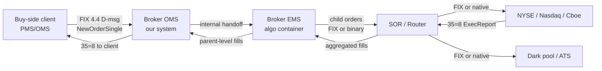
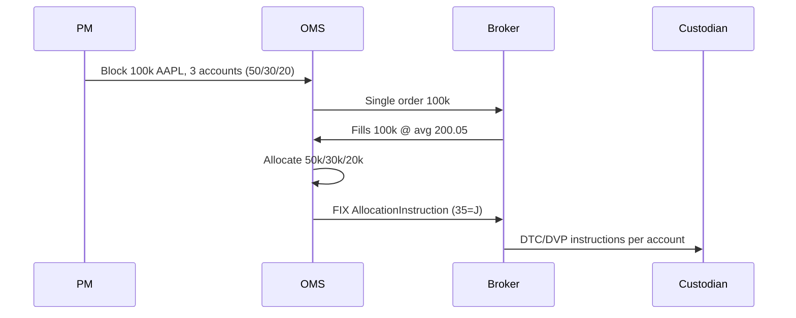
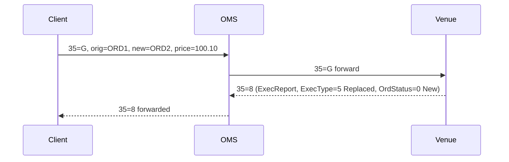
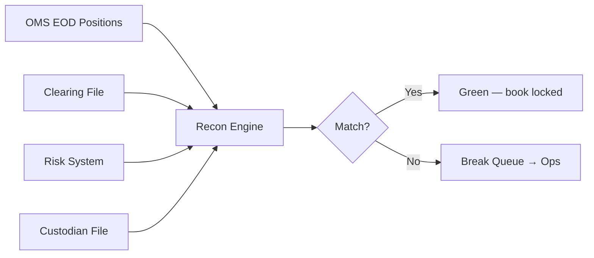

# 02 — OMS & Market Focused Q&A

> The 50 highest-frequency market-knowledge questions, ranked most-likely first.

---

## 1-25

### Q1. What is the core difference between an OMS and an EMS, and where does each sit in the trade lifecycle?
**Interviewer signal:** Can you draw a clean boundary or do you conflate the two?
**Answer:**
The OMS is the **book of record** for the order — it owns the parent order state (New, PartFill, Filled, Cancelled, DFD), enforces pre-trade compliance, drives allocations and settlement, and feeds the back office. The EMS is a **trader-facing execution tool** — algo selection, slicing, real-time market data, TCA, low-latency venue/broker connectivity. In our stack the OMS holds the parent order and pushes it to the EMS (or a broker's algo) which manages child orders on the wire. Fills flow back up: EMS aggregates, OMS books.

A rough split:
- OMS owns: order state, compliance, allocations, positions, audit trail, regulatory reporting.
- EMS owns: algo containers, market data, colocated FIX sessions, execution decisions.

**Watch-outs:** Calling an OEMS "the same thing" — it's a merged product that's common buy-side but sell-side flow desks still keep them separate for latency and specialization reasons.

---

### Q2. Which system typically hosts pre-trade compliance, and why not push it to the EMS?
**Interviewer signal:** Do you know where regulatory checks belong architecturally?
**Answer:**
Pre-trade compliance lives in the OMS because it's the first system to see the *parent* order with full context — client mandate, position, restricted list, credit line, Reg SHO locate for shorts, wash-sale, concentration limits. The EMS only sees child slices and lacks portfolio-level state. Pushing compliance to the EMS would mean either re-plumbing mandate data into the EMS (duplication, staleness) or evaluating rules on child orders where you can't see cumulative exposure. That said, some **cheap, hot-path** checks like fat-finger and price collar are duplicated in the EMS or the FIX gateway as defense-in-depth — they fire closer to the wire.
**Watch-outs:** Saying "compliance is only in the OMS" — real stacks layer checks at OMS, EMS, and gateway.

---

### Q3. Explain Reg NMS Rule 611 (the Order Protection Rule) in plain terms.
**Interviewer signal:** Do you understand what "trade-through protection" actually means?
**Answer:**
Rule 611 says a US equity venue cannot execute a trade at a price **worse than the best displayed protected quote** on any other NMS venue. The best protected bid/offer across all lit exchanges is the **NBBO** (National Best Bid and Offer). If NYSE is showing 100.00 bid and BATS is showing 100.02 bid, an incoming sell order routed to NYSE cannot trade at 100.00 — that would "trade through" the better BATS quote. The venue must either re-route to BATS (via an ISO or its own SOR), or reject/repost, or match the NBBO. Only **top-of-book, automated, immediately-accessible** quotes are protected — hidden and manual quotes are not. This is what forces smart order routing to exist.
**Watch-outs:** Confusing "protected quote" with "all quotes" — only the top-of-book, automated, displayed quote on each NMS venue is protected.

---

### Q4. What is an ISO (Intermarket Sweep Order) and when would a broker use one?
**Interviewer signal:** Do you understand how brokers legally bypass Rule 611 routing obligations?
**Answer:**
An ISO is a limit order type marked with a special flag (FIX tag 18 ExecInst = "f" or a venue-specific ISO indicator, and tag 528 = "P" for principal, tag 40 limit) that tells the receiving venue: *"I've simultaneously swept all better-priced protected quotes elsewhere — you don't need to re-route this, just execute against your own book at my limit."* The sending broker takes on the obligation to sweep those other venues themselves in parallel. Use cases:
- **Sweep the top of book across all lit venues in one shot** to grab liquidity before a fast market moves.
- **Take out a stale quote on one venue** while simultaneously hitting better prices elsewhere.
- **Avoid re-route latency** — the receiving venue would otherwise ship the order back out.

Practically, an SOR fires off N parallel ISOs, one per venue, sized to the displayed quantity at each price level.
**Watch-outs:** Don't say ISO "ignores the NBBO" — it doesn't; the sender has already committed to sweeping it.

---

### Q5. Walk me through what Rule 605 and Rule 606 reports capture.
**Interviewer signal:** Do you know the execution-quality disclosure regime?
**Answer:**
Both are Reg NMS execution-quality disclosure rules:
- **Rule 605** ("Disclosure of Order Execution"): venues publish monthly stats on execution quality — fill rates, effective spread, price improvement, execution speed, by order size and type. This is the *market center's* report card.
- **Rule 606** ("Disclosure of Order Routing"): broker-dealers publish quarterly reports on *where they routed* customer orders (top venues, % non-directed, payment for order flow received). Post-2020 amendments added a customer-request-only granular 606(b)(3) report for institutional NMS orders — venue-by-venue routing, fills, rebates, prices.

Prod support angle: 606 data comes from the OMS/EMS audit tables — routing decisions, venue, order type, PFOF. If the compliance team asks "where did we send order X," you're pulling from the same execution log.
**Watch-outs:** Mixing them up — 605 is *venue* quality, 606 is *broker* routing.

---

### Q6. What is LULD and how does it interact with order routing?
**Interviewer signal:** Do you know what to expect operationally when a stock triggers limits?
**Answer:**
LULD (Limit Up-Limit Down) is a market-wide volatility control that prevents US equities from trading outside a dynamic price band (typically ±5% or ±10% of a 5-minute rolling reference price, wider at open/close, wider still for lower-priced stocks). Mechanics:
1. Bands are published every 30s by the SIP.
2. If the NBB reaches the upper band or NBO reaches the lower band, the stock enters a 15-second **Limit State**.
3. If it doesn't move back into the band, a **5-minute trading pause** is triggered by the primary listing exchange.
4. During the pause, market makers submit reopening interest and the stock reopens via an auction.

From a support desk perspective: during a LULD pause, expect a wave of `35=8 39=8` (reject) or `35=9` (cancel-reject) messages, algo orders in the OMS will stall, and traders will call asking "why isn't my order going out." The correct answer is "the primary is halted — nothing routes until the reopening auction prints."
**Watch-outs:** Confusing LULD with the market-wide circuit breakers (MWCB) which are S&P 500-based and halt *the whole market* at 7/13/20% moves.

---

### Q7. T+1 settlement went live in May 2024. What operational headaches did that create for the OMS/back-office pipeline?
**Interviewer signal:** Do you understand the compression of the post-trade window and its knock-ons?
**Answer:**
T+1 collapsed the settlement window from two business days to one, so **allocation, affirmation, and confirmation now have to happen the same day**. Prior process had until T+1 morning for FX funding and DVP instructions — now you have hours. Concrete pain points:
- **Same-day allocation cutoff:** most brokers moved to a 7pm ET (or earlier) allocation deadline. If the OMS can't produce and transmit allocations by then, trades DK on T+1.
- **FX funding:** for a European buy-side buying US equity, USD funding must be arranged intraday, not overnight. CLS cutoff is 6pm ET; miss it and you're on bilateral settlement.
- **Fail rates spike:** any manual step (allocation exception, mismatch on tag 55, wrong SSI) that used to be fixed overnight now causes a T+1 fail — CNS fail charges apply.
- **Reconciliation cadence:** end-of-day recon between OMS/EMS/back office moved earlier; ops teams are staffed later in the day.
- **Cross-border:** buying US names funded from GBP/EUR is now a same-day currency race; some funds pre-fund.

Prod support impact: more urgent tickets on allocation failures, more OMS ↔ downstream (settlement, custodian) reconciliation gaps, tighter SLAs.
**Watch-outs:** Saying "it's just one day faster" — the operational compression is the whole story.

---

### Q8. Categorize the main types of US dark pools.
**Interviewer signal:** Do you understand that "dark pool" is a bucket that hides very different venues?
**Answer:**
Dark pools (ATSs) split into three broad categories:

1. **Broker-dealer-owned / internalizers:** the broker crosses its own client flow (retail + institutional) against its principal book or other clients. Examples: Sigma X (Goldman), MS Pool, UBS ATS. Often has segmentation tiers — retail flow priced separately from prop/HFT.
2. **Agency / consortium / independent:** owned by a consortium of buy-side firms or independent operator, no principal trading. Examples: Liquidnet, POSIT, LeveL. Focus on block-size crosses, minimum quantity gates.
3. **Exchange-owned dark venues / hidden liquidity:** technically not ATSs but hidden order types on lit exchanges (mid-point peg, hidden limit) act similarly. NYSE's Retail Liquidity Program, IEX D-Peg.

Also often called out as a fourth: **electronic market-maker ATSs / EMM pools** (Citadel Connect, VIRTU MatchIt) — principal liquidity provider crossing internally.

Regulatory angle: all ATSs file Form ATS-N (post-2018) which discloses order types, subscribers, conflicts. That's now a Rule 606-adjacent disclosure any prod support team can cite when routing questions come up.
**Watch-outs:** Calling *all* off-exchange trading "dark" — internalization at a wholesaler (retail PFOF) is off-exchange but not always through an ATS.

---

### Q9. How does a Smart Order Router (SOR) decide where to send a child order?
**Interviewer signal:** Do you understand the actual decision logic, not just "it picks the best venue"?
**Answer:**
An SOR takes a child order (from an algo or a trader) and decides across venues. The decision function typically combines:

1. **Displayed liquidity** at each venue's NBBO — snapshot from consolidated feed (SIP) plus direct feeds.
2. **Historical fill probability** by venue/time-of-day/symbol — feature learned from prior fills.
3. **Fee/rebate structure** — maker-taker vs taker-maker vs inverted vs flat. Post routes to venues that *pay* the broker (rebate) if the order is passive.
4. **Latency to venue** — colocated? Cross-connect? Round-trip time.
5. **Signal / anti-gaming** — venues with more toxic flow are downweighted for large orders.
6. **Client preferences / routing table** — some clients opt-out of specific venues (no dark, no inverted, no PFOF).

Typical mechanics: SOR fires **parallel ISOs** to sweep visible liquidity, then **pegs residuals** to dark venues at midpoint, then re-evaluates on each fill/cancel. It has a "spray" mode for aggressive orders and a "post" mode for passive.

In support: 90% of "why did my order go to venue X" tickets come down to the routing table or a venue-priority config change. Know where that config lives.
**Watch-outs:** Saying "it picks the venue with the best price" — SOR minimizes *expected all-in cost* including fees, adverse selection, and fill probability, not just quoted price.

---

### Q10. Explain maker-taker vs taker-maker (inverted) fee models.
**Interviewer signal:** Do you know why some venues pay you to trade and others charge you?
**Answer:**
- **Maker-taker** (classic model, e.g., NYSE, Nasdaq, BATS BZX): the venue pays a **rebate** (~$0.0020–$0.0030/share) to the party that *added* liquidity (posted a resting limit order that got hit) and charges a **fee** (~$0.0028–$0.0030) to the party that *took* liquidity (crossed the spread with a marketable order). Net venue captures the spread between fee and rebate.
- **Taker-maker / inverted** (e.g., BATS BYX, EDGA, Nasdaq BX): reversed — taker gets a small rebate, maker pays a fee. Attracts aggressive flow, useful for brokers who want to *pay* for a fill quickly on inverted venues rather than wait passively.

Why it matters for routing: an SOR will prefer to *post passively* on maker-taker venues (earn rebate) and *take aggressively* on inverted venues (still earn rebate on the take). Rule 606 disclosures require brokers to report PFOF/rebates received. SEC has floated banning rebates repeatedly under Reg Best Ex proposals.

Support tip: complaints about "routing to a weird venue" often trace to inverted-venue take flow — the SOR is optimizing for cost, not price alone.
**Watch-outs:** Don't say "makers are always market makers" — a maker is anyone who posts a resting order that gets hit.

---

### Q11. Name the main US lit equity venues and roughly what differentiates them.
**Interviewer signal:** Do you actually know the venue landscape?
**Answer:**
The three exchange families run most of the market share:

- **NYSE Group (ICE):** NYSE (primary listing for large caps, DMM model), NYSE Arca (ETF primary), NYSE American (small/mid caps), NYSE Chicago, NYSE National (inverted / low fee).
- **Nasdaq:** Nasdaq (primary listing for tech), Nasdaq BX (inverted), Nasdaq PSX (price-time priority variant).
- **Cboe (formerly BATS):** BZX (maker-taker), BYX (inverted), EDGA (inverted low fee), EDGX (maker-taker).

Independents / newer:
- **IEX** — famous for the 350μs speed bump, midpoint peg, D-Peg (crumbling quote signal). Marketed as anti-HFT.
- **MEMX** — member-owned, low-cost, launched 2020.
- **MIAX Pearl Equities** — newer entrant, aggressive rebates.
- **LTSE** — long-term stock exchange, small.

Plus ~30+ ATSs (dark pools) and a handful of retail wholesalers (Citadel Securities, Virtu, Jane Street, G1) who internalize the majority of retail flow off-exchange.
**Watch-outs:** Calling BATS/DirectEdge "separate" — they're all Cboe now (Cboe bought BATS which had already bought DirectEdge).

---

### Q12. What role does the SIP play and why do fast traders bypass it?
**Interviewer signal:** Do you understand the two-tier market-data structure?
**Answer:**
The SIP (Securities Information Processor) is the regulated consolidated tape — CTA/UTP feeds — that aggregates the top-of-book (NBBO) and trades from every NMS venue. It's the source-of-truth for the **official NBBO** and is used for Rule 611 protection and regulatory reporting.

But the SIP has non-trivial latency (median 15–500μs+ depending on symbol/tape and load) because it has to receive, sequence, and rebroadcast from every venue. HFTs and latency-sensitive firms subscribe to **direct feeds** from each exchange (NYSE Integrated, Nasdaq TotalView-ITCH, Cboe Depth-of-Book) and build their own consolidated book in ~microseconds. This is the "SIP arbitrage" concern — a firm with direct feeds can see the true NBBO before the SIP publishes it and race trades against slower participants who trust the SIP.

The 2021 MDI (Market Data Infrastructure) rules and the CT Plan aim to reduce this gap by introducing decentralized competing consolidators and expanded core data (depth of book, auction data). Rollout has been slow.
**Watch-outs:** Saying "the SIP is realtime" — it is, but *directly connected* feeds are typically 100μs–1ms faster in effective delivery.

---

### Q13. What happens in a typical trading day at the open? Walk me through the auction.
**Interviewer signal:** Do you understand the opening auction — a common source of stuck-order tickets?
**Answer:**
US primary exchanges (NYSE, Nasdaq) run an **opening auction** at 09:30 ET that determines the official opening print for stocks listed there:

1. **Pre-market imbalance messages** publish from ~09:28 (Nasdaq) / ~09:00 (NYSE) — imbalance quantity, indicative price. Traders/algos react by adding offsetting interest.
2. **MOO (Market-on-Open)** and **LOO (Limit-on-Open)** orders can only participate in the auction; **OPG** orders (opening only) as well. These have cutoff times (e.g., 09:28 for MOO on Nasdaq).
3. **Cross event at 09:30** — the auction matches at a single clearing price that maximizes matched volume. That print becomes the official open.
4. **Continuous trading** begins immediately after.

Support pain: MOO orders sent after cutoff reject with venue-specific reason codes. Orders held at the OMS due to a compliance override that gets approved *after* the cutoff will miss the auction and go into continuous — traders will complain. Know the venue cutoffs and how your OMS's release workflow handles cutoff misses.

The **closing auction** at 16:00 ET is symmetric (MOC/LOC/imbalance-only) and typically prints the highest single-print volume of the day — heavy institutional benchmark trading.
**Watch-outs:** Confusing Nasdaq and NYSE cutoff times — they differ; check the reference table.

---

### Q14. What is odd-lot handling and why did the SEC change it recently?
**Interviewer signal:** Do you track evolving market-structure rules?
**Answer:**
An odd lot is an order less than 100 shares (the standard round lot for US equities). Historically odd lots were **not part of the protected NBBO** — they didn't trade through, they weren't disseminated on the top-of-book SIP feed. That mattered less when everything was multi-share; now with high-priced stocks (BRK/A, AMZN pre-split) round lots become economically massive and most retail flow is fractional/odd-lot.

Rule changes:
- **2020 MDI amendments** required the SIP to include odd-lot data (depth) and introduced a variable round-lot definition based on stock price tiers (e.g., 40 shares for $250–$1000, 10 shares for $1000–$10000, 1 share above $10000).
- **Effective phase-in through 2024–2025** — odd-lot best bid/offer (OBBO) is now disseminated and, per pending rule updates, potentially protected.

Operational impact on the desk: SORs need to consume odd-lot depth, best-ex reports need odd-lot fills, and the OMS's tick tables need to reflect the variable round-lot definition.
**Watch-outs:** Assuming 100 is still the universal round lot — it is not anymore for very high-priced stocks.

---

### Q15. Describe how a market maker's obligations differ on NYSE (DMM) vs Nasdaq.
**Interviewer signal:** Do you understand exchange microstructure history?
**Answer:**
- **NYSE Designated Market Maker (DMM):** each listed stock has *one* DMM firm responsible for maintaining a fair and orderly market — obligations include quoting at the NBBO a minimum % of the time, providing liquidity during volatility, and facilitating opening/closing auctions. Rebates are enhanced (Supplemental Liquidity Provider tier). Historical descendant of the specialist model.
- **Nasdaq market makers:** *multiple* competing market makers per stock (originally called "SOES bandits" era). No single-firm obligation per name. Nasdaq has a Designated Liquidity Provider (DLP) program for less liquid ETFs.

For our purposes on prod support, this matters when troubleshooting a stuck order in the pre-open/auction — NYSE names have a human-in-the-loop (DMM) who can facilitate manual reopening after a halt; Nasdaq relies on the electronic reopening auction alone.
**Watch-outs:** Saying "specialists still exist" — they're DMMs since 2008.

---

### Q16. What is payment for order flow (PFOF) and why is it controversial?
**Interviewer signal:** Awareness of retail-flow economics and current regulatory scrutiny.
**Answer:**
PFOF is when a retail broker (Robinhood, Schwab) routes customer orders to a wholesaler market maker (Citadel Securities, Virtu, G1) which pays the broker a per-share fee to receive that flow. The wholesaler internalizes the order — matching against its own book, providing price improvement over the NBBO (typically fractions of a cent), and pocketing the spread.

Controversy:
- **Best execution conflict:** the broker is incentivized to route to the highest-paying wholesaler, not necessarily the best-executing one.
- **Segmentation:** wholesalers cherry-pick retail flow (perceived non-toxic) leaving institutional orders to trade against more informed flow on lit venues.
- **Price improvement vs NBBO** — critics argue if all this flow was on-exchange, the NBBO itself would be tighter.

SEC's 2022 "Equity Market Structure Proposals" included an **order-by-order competition rule** that would have forced retail marketable orders into a segmented auction — that specific rule was dropped, but Rule 605 (execution quality disclosure) was expanded and applies to wholesalers now.
**Watch-outs:** Institutions don't PFOF — this is a retail-broker phenomenon. Don't apply it to buy-side institutional flow.

---

### Q17. What's the difference between a marketable limit order, an IOC, and a FOK?
**Interviewer signal:** Order-type mechanics — bread and butter.
**Answer:**
- **Marketable limit:** a limit order priced at or through the current NBBO — behaves like a market order but with a price cap. E.g., stock offered at $100.02, you send limit buy $100.02 or $100.05 — will trade immediately up to your limit, resting balance stays on the book.
- **IOC (Immediate-or-Cancel):** trade whatever's available at the limit right now; **cancel the residual** — nothing rests. FIX tag 59=3.
- **FOK (Fill-or-Kill):** trade the **entire** quantity right now at the limit, or cancel the whole thing — no partial fills. FIX tag 59=4.

Two more you'll see:
- **DAY** (59=0) — rests until 4pm close then expires.
- **GTC** (59=1) — good-till-cancel, rests up to 90 days depending on broker.

SOR uses IOC heavily for parallel sweep orders — fire N venues with IOC, take what fills, don't leave any residuals resting on wrong venues.
**Watch-outs:** People confuse FOK with AON (all-or-none) — AON can be a resting order that waits for a full-size counterparty; FOK cancels immediately if not fully fillable now.

---

### Q18. What is Reg SHO and what specifically does Rule 201 do?
**Interviewer signal:** Short sale regulation, high-frequency source of routing rejects.
**Answer:**
Reg SHO governs short sales in US equities. Two headline rules:
- **Rule 203 (locate requirement):** before executing a short sale, the broker must have a **locate** — a reasonable basis to believe shares can be borrowed for delivery on settlement. The OMS enforces this pre-trade; the locate is typically sourced from prime brokerage.
- **Rule 201 (uptick rule / short-sale price test):** if a security drops **≥10%** from the prior day's close, a **circuit breaker** triggers for the rest of that day and the following day. During the trigger, short sales can only execute **above the NBB** (i.e., you can't hit the bid short — you can only post above it or trade above it). Venues enforce this via order type "short sale exempt" (ISO) or by rejecting non-conforming shorts.

Operational reality: when the 10% breaker trips, expect a wave of rejects from venues on short orders that were previously routing fine. Tag 58 will say "Short sale price test violation" or similar. The OMS should stamp `ExecInst=SSE` (short sale exempt) or reprice above NBB.
**Watch-outs:** Old "uptick rule" (removed in 2007) is different — Rule 201 is the modern circuit-breaker version.

---

### Q19. Explain the difference between a hidden order, a midpoint peg, and a discretionary order.
**Interviewer signal:** Do you know how non-displayed liquidity is expressed at the venue level?
**Answer:**
- **Hidden limit:** order posted at a specific limit price but not displayed on the book. Loses time priority behind displayed orders at the same price. Available on most lit venues (e.g., Nasdaq "hidden" order type). FIX tag 18 ExecInst = "H".
- **Midpoint peg:** order pegged to the midpoint of the NBBO — floats with the market. Never displayed. Trades when a counterparty crosses the spread and hits mid. Common in dark pools and some lit venues (IEX M-Peg, Cboe MidPoint Match).
- **Discretionary order:** displayed at a base price (say offer at $10.05) with a hidden "discretionary range" (say $0.02) — will trade at any price within the range when opportunity arises. Displays priority at the visible price; uses hidden discretion to execute better silently.

Also relevant:
- **D-Peg (IEX):** discretionary peg that pegs to the far side but adds a signal-avoidance layer (the "crumbling quote" indicator) to avoid trading during adverse moves.
- **Reserve / iceberg:** displays a slice, refreshes when hit — technically displayed liquidity that hides size, not price.

**Watch-outs:** Don't say "hidden orders are illegal" — they're regulated and disclosed via ATS-N and venue rulebooks.

---

### Q20. What is CAT (Consolidated Audit Trail) and how does it change compliance ops?
**Interviewer signal:** Are you familiar with the biggest regulatory data mandate of the last decade?
**Answer:**
CAT is a SEC-mandated (Rule 613) audit trail that captures **every order event** on every NMS security — origination, routing, modification, execution, cancellation — with timestamps to millisecond precision and full lifecycle linkage across firms. Rolled out in phases 2018–2022, replacing legacy OATS.

Reporters: broker-dealers and exchanges submit daily to the CAT LLC (managed by FINRA CAT). Data includes customer identifiers (CCID, initially FDID) mapped to actual customer PII stored separately for privacy.

Impact on prod support:
- **Every order in the OMS gets a CAT reportable event.** Reject any order that can't be tagged with an FDID/handling instructions.
- **Same-day submission** by 8am ET the next business day. If your CAT feed jobs fail overnight, you'll be on a T+0 fire drill.
- **Error correction cycle** — the CAT reporter portal returns error files; ops teams have 3 business days to correct and resubmit or face fines.
- **Cross-firm linkage** — for a customer order routed from firm A to firm B to venue C, all three parties file, and CAT stitches the linkage via a routed order ID. Mismatches cause "unlinked" errors that both firms have to reconcile.

Support tickets: "CAT error 1234 — invalid handling instructions" is a common Monday-morning pull.
**Watch-outs:** CAT replaced OATS in 2022 — don't cite OATS as current.

---

### Q21. What is the "SIP timestamp" vs "exchange timestamp" and why does that matter for trade breaks?
**Interviewer signal:** Do you understand the subtleties of time-sync in reg reporting?
**Answer:**
Every fill has multiple timestamps:
- **Exchange timestamp** — when the match happened inside the venue's matching engine.
- **SIP timestamp** — when the trade was received and disseminated by the SIP.
- **Firm receipt timestamp** — when your OMS/EMS received the fill message.

These can differ by hundreds of microseconds to milliseconds. Reg NMS/CAT require timestamping to at least **millisecond** precision (moving to microsecond for many events). For a trade break:
- Reconciling which price is "official" for reporting or client TCA usually uses the exchange timestamp for print time.
- For NBBO/best-ex analysis, the SIP timestamp matters because that's what all other participants saw.
- For OMS position keeping, the firm receipt timestamp drives the risk update.

Time synchronization across firm systems is mandated to be within 100 milliseconds of NIST (FINRA rule 4590 / MiFID II equivalent is 1ms). Prod support: monitor NTP/PTP drift on trade capture servers — clock drift causes "future-dated" fills that break reconciliation.
**Watch-outs:** Don't assume all timestamps are equal — a fill's "trade time" for regulatory reporting is the exchange timestamp, not when your OMS logged it.

---

### Q22. Explain the closing auction — MOC, LOC, imbalance messages — and why it matters for benchmark trading.
**Interviewer signal:** Same as opening auction but for the closing print.
**Answer:**
The primary listing exchange runs a closing auction at 16:00 ET that determines the official closing price. Order types:
- **MOC (Market-on-Close):** unpriced order guaranteed to execute at the closing print. Cutoff to enter: 15:50 ET (Nasdaq/NYSE, was 15:45 pre-2020). No cancels after 15:50 except to reduce size.
- **LOC (Limit-on-Close):** priced, executes only if the closing print is at/better than the limit.
- **Imbalance-only orders** (ICL / IO): can only trade *against* the imbalance published from 15:50 onward, providing offsetting liquidity.

Imbalance messages publish every 5 seconds from 15:50, showing imbalance quantity, side, and indicative match price. Algos and market makers react to these.

Why it matters:
- **Benchmark trading:** most index rebalances, mutual-fund NAVs, and ETF creates/redeems reference the closing price. Institutional flow floods the auction — often 5–10%+ of daily volume prints at the close on a single tick.
- **Support angle:** MOC cutoff misses are frequent. If the OMS releases an order at 15:51, it *cannot* participate in the auction and will trade in the continuous session at whatever price is available — often catastrophically off-benchmark. Know your cutoff enforcement logic.

**Watch-outs:** Nasdaq and NYSE have slightly different cutoff and imbalance-messaging rules — don't generalize across venues.

---

### Q23. What is a wash trade and why does the OMS flag it?
**Interviewer signal:** Do you understand market-abuse surveillance basics?
**Answer:**
A wash trade is a transaction where the **buyer and seller are the same beneficial owner** (or coordinated to be) — no change in economic ownership. It's prohibited under Commodity Exchange Act (CFTC) and SEC anti-manipulation rules because it can be used to create the illusion of volume or manipulate prices.

Common OMS flags:
- **Same account both sides** (buy and sell in the same order book) — hard block.
- **Same beneficial owner, different accounts** — soft warning; some are legitimate (internal transfer, tax lot mgmt) and need supervisor approval.
- **Self-cross detection:** two orders from the same firm crossing at a venue. Many venues implement Self-Match Prevention (SMP) — the OMS attaches a Self-Match Prevention ID (FIX tag 7928 or venue-specific) and the venue cancels the older of the two before match.

Prod support angle: SMP mis-tagging is a common source of "why did my order cancel" tickets — traders on the same desk with the same SMP ID unknowingly cross each other and the venue silently cancels. Fix: ensure SMP IDs are trader-level or fund-level, not desk-level.
**Watch-outs:** Wash trade is not the same as "wash sale" (a tax rule about realizing losses).

---

### Q24. What does a typical FIX-based routing chain look like from an institutional client to a US venue?
**Interviewer signal:** Do you know the actual FIX topology of a real trade?
**Answer:**


Key handoffs:
1. **Client → Broker OMS:** FIX 4.2 or 4.4. Client-facing session with tag 49/56 identifying counterparties. Broker OMS is the point of pre-trade compliance and staging.
2. **Broker OMS → EMS:** often internal (proprietary API) or a colocated FIX bridge.
3. **EMS → SOR → Venue:** venue gateway; many venues now speak binary/OUCH/BOE for latency but still accept FIX. Colocated in NY4/NY5/Carteret.
4. **Fills reverse the chain:** each hop rewrites the ExecReport with its own perspective (parent vs child, client-facing vs venue-facing IDs).

Support: 90% of "lost fill" tickets are because a hop in this chain dropped or misrouted the message. Trace via ClOrdID (tag 11) at each hop — most firms have a correlation ID that persists end-to-end.
**Watch-outs:** Don't say "everything is FIX" — venue gateways increasingly use binary protocols (OUCH, ITCH, BOE) for latency.

---

### Q25. A trader says "my order is stuck DFD in the OMS, can you release it?" What are the possible causes and how do you diagnose?
**Interviewer signal:** Do you actually know your production system? DFD is one of the most common states you'll see.
**Answer:**
"DFD" (Done-For-Day, or in some OMS vernaculars "Deferred / Held") means the order stopped working before completion but isn't cancelled. Common causes on our OMS:

1. **Session drop:** the FIX session to the destination broker/venue went down mid-order. OMS marks the working balance DFD to prevent stale routing. Check session status first — is 35=A logon healthy? Any sequence gap?
2. **Venue rejected the last child** with a non-recoverable reason (e.g., short sale price test violation, symbol suspended, LULD pause). Parent goes DFD until support acknowledges.
3. **Compliance breach mid-flight:** a rule fired on a subsequent child (concentration limit tripped by an earlier fill). Order stops, needs supervisor override to resume.
4. **Manual DFD by trader / algo termination:** trader hit "kill" on the algo but didn't cancel the parent — leftover residual sits DFD.
5. **Downstream DFD flag from EMS:** EMS killed the child but didn't propagate a cancel to the OMS, so parent thinks it's still active but no children are working.

Diagnosis order:
1. Check OMS order log for the last state transition and reason code — that's usually the fastest answer.
2. Check FIX session dashboard — session up? Sequence numbers in sync?
3. Check downstream (broker/venue) drop-copy for orphan child orders.
4. Reconcile OMS parent qty vs sum of child fills — if there's a gap, that's a lost message.
5. If it's a compliance hold, route to compliance for override, not to release blindly.

To "release," typically the trader either cancels + resubmits, or (with supervisor approval) the OMS has a "resume from DFD" action that re-arms the algo. Never blindly release without knowing why it went DFD — you may re-fire an order that violated compliance.
**Watch-outs:** Don't just click "release" because a trader asked — always trace the *reason* first. Releasing an order that was DFD'd for compliance is a career-limiting move.
## 26-50

### Q26. Walk me through how a VWAP algo actually slices an order across the day.
**Interviewer signal:** Do you understand volume-curve based scheduling, not just the acronym?
**Answer:**
VWAP (Volume-Weighted Average Price) aims to match the day's volume-weighted average by slicing the parent order in proportion to a historical intraday volume curve — typically a U-shape with a heavy open, thin midday, and heavy close.

1. **Historical curve:** the algo loads a 20–30 day median volume profile per symbol, bucketed into 5-min or 15-min bins, normalized to sum to 1.0.
2. **Schedule:** parent qty × bucket_weight = child qty per bucket. E.g., 1M share order, bucket 09:30–09:45 weighted 8% → target 80k in that bin.
3. **Execution inside a bucket:** the algo posts child orders (limit/peg/mid) to hit that bin's target, adjusting for real-time volume — if actual volume runs hot, it accelerates; if cold, it slows.
4. **Catch-up / slow-down bands:** most algos have ±10–20% tolerance vs schedule before they aggress or pull back.
5. **End-of-day:** any residual is typically finished at the close auction or MOC.

The benchmark reported back on the fill is `avg_fill_price` vs `market_VWAP` over the same interval, in bps.
**Watch-outs:** Don't confuse VWAP (schedule-driven) with POV (participation-driven) — VWAP is committed to a curve, POV floats with realized volume.

---

### Q27. When would a PM pick TWAP over VWAP?
**Interviewer signal:** Do you know when each algo is appropriate?
**Answer:**
- **TWAP** (Time-Weighted Average Price) slices evenly across a time window regardless of volume. Pick it when:
  - The name is illiquid or has a spiky/unreliable volume profile (VWAP curve is unreliable).
  - The PM wants predictable, low-signal execution — e.g., an unwind they don't want to telegraph.
  - Volume forecasts are broken (earnings day, index rebalance, halt recovery).
- **VWAP** is better when:
  - The name is liquid with a stable volume curve.
  - The benchmark is VWAP (common for buy-side desks measured on VWAP slippage).
  - You want to hide inside natural volume.

At a US buy-side client I supported, PMs often used TWAP for small-cap unwinds and VWAP for large-cap rebalances.
**Watch-outs:** Saying "TWAP is safer" — it's not, it can be worse in a heavy-close name because you underparticipate at the close.

---

### Q28. Explain POV (Percentage of Volume) and its main failure mode.
**Interviewer signal:** Do you understand participation risk?
**Answer:**
POV targets a fixed percentage of realized market volume — e.g., "trade at 10% of volume." As the tape prints, the algo sends children so its cumulative fills stay near 10% of cumulative market volume.

**Failure modes:**
1. **Gaming / adverse selection:** if the algo is too mechanical, HFTs can detect a persistent 10% child in the queue and front-run.
2. **No completion guarantee:** if volume dies (thin day, halt), the parent will not fill. PMs sometimes set a "must-complete" flag which converts POV to a more aggressive style near close — this is a common source of end-of-day slippage tickets.
3. **Volume spikes:** a print of 500k in one trade forces the algo to catch up 50k instantly, and it may cross the spread aggressively — bad prints.

In production, "POV didn't complete" is one of the top-3 tickets I get on close. Fix is usually to set `WouldStyle=Aggressive` or add a min-fill safety net.
**Watch-outs:** Don't say "POV guarantees you'll trade X%" — it targets, doesn't guarantee.

---

### Q29. What is Implementation Shortfall (IS) and why do PMs care?
**Interviewer signal:** Do you understand arrival-price benchmarking?
**Answer:**
Implementation Shortfall measures the total cost from the decision price (arrival price when order hit the trader) to the actual average fill price, including opportunity cost on unfilled shares.

```
IS (bps) = [ (avg_fill_px - arrival_px) × filled_qty
           + (close_px - arrival_px) × unfilled_qty ]
           / (parent_qty × arrival_px) × 10000
```

An **IS algo** front-loads execution to minimize the risk that price drifts away from arrival, balancing:
- **Market impact** (trading fast moves the price against you)
- **Timing risk** (trading slow lets alpha decay)

The algo uses an Almgren-Chriss style optimizer with a risk-aversion parameter (`urgency=low/med/high`). High urgency = front-loaded; low urgency = closer to VWAP.

PMs care because IS is the honest measure of alpha capture — VWAP can look flat while the PM lost 30bps to market drift.
**Watch-outs:** IS is negative when you beat arrival (good). Signs get confused; state your convention.

---

### Q30. Buy-side vs sell-side OMS — what actually differs?
**Interviewer signal:** Do you understand the client-side workflow at a fund vs at a broker?
**Answer:**

| Dimension | Buy-side OMS (fund) | Sell-side OMS (broker) |
|---|---|---|
| **Primary user** | PM & buy-side trader | Sales trader, algo trader, DMA client |
| **Order origin** | Internal PM idea, model, rebalance | Client (via FIX from buy-side) |
| **Compliance** | Pre-trade: mandate, position limit, restricted list | Pre-trade: credit, wash, short-sell locate, reg checks (SHO, LULD) |
| **Allocations** | Post-trade block-to-account allocation | Not usually — broker sees one account per client |
| **Benchmarking** | VWAP/IS vs decision price | Fill quality, best-ex, venue analysis |
| **Connectivity** | FIX out to N brokers | FIX in from N clients + FIX out to venues/OMS |
| **Books & risk** | Portfolio-level | Firm inventory, principal risk, capital |
| **Regulatory focus** | 15c3-5 on broker, mandate on fund | 15c3-5, Reg NMS, MiFID II RTS 27/28, best-ex |

A global bank OMS I supported sat on the sell-side, receiving flow from buy-side clients (like a US buy-side client) and routing to exchanges. The buy-side has a totally different OMS (Charles River, Aladdin) which is what sends me the FIX order.
**Watch-outs:** Don't conflate — buy-side does allocations, sell-side does venue routing. Both do TCA but from different perspectives.

---

### Q31. Client sends a FIX NewOrderSingle for an equity option — what extra fields do you expect vs a stock order?
**Interviewer signal:** Options basics on FIX.
**Answer:**
For a listed equity option (OCC-style), a NewOrderSingle carries the standard fields plus option instrument identifiers:

```
55  = Symbol            (e.g., AAPL or OSI root)
167 = SecurityType      = "OPT"
200 = MaturityMonthYear (e.g., 202612)
205 = MaturityDay       (e.g., 15)
201 = PutOrCall         (0=Put, 1=Call)
202 = StrikePrice       (e.g., 200.00)
15  = Currency          (USD)
461 = CFICode           (e.g., OCASPS)
48  = SecurityID        (OCC 21-char OSI symbol)
22  = SecurityIDSource  ("8" = Exchange symbol)
9303 = CoveredOrUncovered (some venues)
```

For **multi-leg** (spread, straddle), you'd see `NoLegs(555)` repeating group with each leg's instrument block, or a `SecurityType=MLEG` plus `MultiLegReportingType(442)`.

Options also carry `OpenClose(77) = O|C` (opening or closing position), which drives position keeping and margin.
**Watch-outs:** Don't forget CFICode / OSI symbol — many venues reject if missing. Also, options have their own tick size regime (penny pilot names vs 5-cent names).

---

### Q32. What's an OSI option symbol and why does it matter for OMS?
**Interviewer signal:** Real-world identifier fluency.
**Answer:**
OSI (Options Symbology Initiative, 2010) standardized US listed option symbols to a 21-character format:

```
AAPL  261218C00200000
^^^^^^-------------- Root symbol (6 chars, padded)
      ^^^^^^--------- Expiration YYMMDD
            ^-------- C (call) or P (put)
             ^^^^^^^^ Strike × 1000, 8 digits
```

Example: `AAPL  261218C00200000` = AAPL Dec 18 2026 200 Call.

**Why it matters for OMS:**
- Instrument master must key on OSI, not the legacy 5-char root+series.
- FIX tag 48 (SecurityID) carries it with tag 22=8.
- Reconciliation to clearing (OCC) requires exact OSI match — one bad space and the position break shows up in T+1 clearing.
- Weeklies, quarterlies, LEAPS all fit the same format.
**Watch-outs:** Spaces matter — the root is space-padded to 6. `AAPL__261218C...` (two spaces) is correct.

---

### Q33. What is TCA and what are the three most common benchmarks?
**Interviewer signal:** Do you know what analysts actually measure?
**Answer:**
TCA = Transaction Cost Analysis. It's the post-trade (and increasingly pre-trade) measurement of execution quality vs a benchmark, reported in basis points.

**Three most common benchmarks:**
1. **Arrival Price (IS):** avg fill vs price at order arrival. Measures total cost including delay + impact + opportunity. The honest one.
2. **Interval VWAP:** avg fill vs market VWAP over the execution window. Measures whether the algo tracked volume — but can be gamed by choosing the window.
3. **Close Price:** avg fill vs official close. Used for index / rebalance flow, MOC orders, and passive strategies.

Others: PWP (Participation-Weighted Price), Open Price, Prev Close, Reversion (fill vs price 5/30 min after last fill — measures information leakage).

**In production:** I get TCA outlier tickets when a fill is >X bps from benchmark. First step is always: is it a bad print, a bad benchmark (e.g., halt in the window), or a genuine slippage event?
**Watch-outs:** VWAP TCA on a small order is meaningless if you're 90% of the volume — you *are* the VWAP.

---

### Q34. How does block-to-account allocation work on the buy-side?
**Interviewer signal:** Do you understand the allocation lifecycle?
**Answer:**
Buy-side PMs trade a **block** (parent order) on behalf of multiple sub-accounts, then allocate fills back to accounts post-trade — usually pro-rata by pre-trade intent.

**Flow:**


**FIX messages:**
- **35=J** AllocationInstruction — buy-side sends account breakdown to broker
- **35=P** AllocationInstructionAck — broker accepts/rejects
- **35=AS** AllocationReport — confirms

**Pricing methods:**
- **Average price** (most common): all accounts get the same avg fill price.
- **Actual fills**: each account gets specific tape prints — rare, tax-driven.
- **Random**: audited random allocation to prove fairness.

Common breaks: sum of allocations ≠ block qty (rounding), an account is restricted post-trade, or a sub-account rejects (fund closed).
**Watch-outs:** Don't confuse **allocation** (post-trade split) with **routing** (pre-trade venue choice). Different systems, different tags.

---

### Q35. Explain the exception queue in an OMS and how you prioritize.
**Interviewer signal:** How do you handle production triage?
**Answer:**
Every OMS has an exception queue — orders that couldn't proceed automatically: rejects, unmatched fills, stale acks, allocation breaks, DFD (drop-copy) mismatches, purge failures.

**My triage priority (production support at our OMS vendor):**
1. **Market-open blockers (P0):** anything preventing new orders from flowing at 09:30. Route down, session disconnect, static data missing.
2. **Client-visible order stuck (P1):** parent in `PENDING_NEW` or `PENDING_CANCEL` past SLA (usually 30s). Trader can't see status.
3. **Fill mismatch (P1):** exec report says filled but OMS says working, or vice versa. Risk implications — position is wrong.
4. **Allocation break (P2):** T+0 but before affirmation cutoff. Usually rounding or restricted account.
5. **Purge failures (P2):** end-of-day orders that didn't clean up — pollutes next day's book.
6. **TCA outliers (P3):** report to trader for review, not real-time blockers.

**Common exception patterns I've seen:**
- Cross-instance session desync (basket in instance A, child in B) → cascade fail.
- IOBX tag 21283 truncation on long strategy names → I've documented this at 15-char cap from a `char[16]` buffer in `DtagParam_Checkbox`.
- DFD (drop-copy feed) mismatch between primary and DR — clearing sees one, risk sees the other.
**Watch-outs:** Never resolve an exception by "manually filling in the OMS" without an audit trail — every fix needs a ticket and a re-drive path.

---

### Q36. What's a DFD or drop-copy and why is it critical?
**Interviewer signal:** Post-trade plumbing awareness.
**Answer:**
A drop-copy is a real-time FIX copy of every order and execution sent to a **secondary system** — typically middle-office risk, clearing, or regulatory reporting — separate from the primary trading session.

**Why critical:**
- **Regulatory (15c3-5):** brokers must have real-time risk view independent of the front office.
- **Clearing:** OCC / DTCC / LCH consume drop-copies to pre-stage settlement.
- **Reconciliation:** end-of-day, positions from trading OMS must equal positions from drop-copy consumer. If not = a **DFD mismatch** and someone stays late.
- **Kill switch:** the risk system watching drop-copies can pull the plug if limits breach.

**Common failure:** primary FIX session is up, drop-copy session drops silently. Orders flow, but risk goes blind. Every OMS should alert on drop-copy heartbeat loss within seconds.

At a global bank OMS I supported, DFD failures were P1 because clearing wouldn't accept a T+1 file that didn't tie.
**Watch-outs:** Drop-copy is not a backup session — it's a listener. Losing it doesn't stop trading, which is exactly the problem.

---

### Q37. Difference between an IOI, RFQ, and firm order?
**Interviewer signal:** Pre-trade workflow vocabulary.
**Answer:**
- **IOI (Indication of Interest, 35=6):** non-binding advertisement — "I have 500k AAPL to sell, natural interest." Sent by sell-side to buy-side. Buy-side reacts by calling or sending a firm order. Can be `Natural`, `IOIQualifier=A` (all-or-none), etc.
- **RFQ (Request for Quote, 35=R):** buy-side asks one or more dealers "quote me a price for 10mm 5Y IBM CDS." Dealer responds with a Quote (35=S). Common in FI, options, swaps. RFQ can be one-to-one or one-to-many.
- **Firm order (NewOrderSingle, 35=D):** binding — "execute this now at limit X." Live in the book, can fill.

**In equity workflow:** IOIs are how block trades get sourced. In FI/derivs, RFQ is the norm — no continuous order book, everything is quote-driven.

**Common exception:** IOI matched but firm order never arrives → sales trader chases. Or RFQ times out → auto-decline.
**Watch-outs:** IOIs got a bad reputation ("phantom liquidity") pre-MiFID II — regulators tightened rules on `NaturalFlag` and required Bona-fide indications.

---

### Q38. What is a locate and when is it required?
**Interviewer signal:** Reg SHO / short-selling compliance.
**Answer:**
A **locate** is a broker's confirmation that shares are available to borrow before a client places a short sale. Required by SEC Reg SHO Rule 203(b)(1) in the US.

**Flow:**
1. Client wants to short 100k XYZ.
2. Client's OMS pings broker(s) with a locate request (proprietary API or FIX `LocateRequired=Y` on the order).
3. Broker's stock loan desk confirms availability, returns a locate ID with a quantity + expiry (usually EOD).
4. OMS attaches locate ID to the short sell order; broker validates on receipt.

**FIX fields:**
- Tag 114 `LocateReqd` = Y/N
- Tag 5700 `LocateBroker` (custom, varies)
- Tag 54 `Side` = 5 (Short) or 6 (Short Exempt)

**Rejection causes:**
- Locate expired (EOD, order sent T+1)
- Locate qty < order qty
- Hard-to-borrow (HTB) name with no availability
- Symbol on threshold list

In production, "why did my short reject" is a top ticket. First check: is `Side=5`, is `LocateReqd=Y`, is the locate ID valid and unexpired?
**Watch-outs:** Long sales, married puts, and market-maker exempt shorts don't need locates. Don't reject them for missing locate ID.

---

### Q39. How does the OMS handle LULD reject storms and repricing during a band shift?
**Interviewer signal:** Can you handle the operational reality? Q6 covered *what* LULD is — this is about what the OMS actually does when bands move against a working book.
**Answer:**
Assume the band definition and pause mechanics are understood (see Q6). The OMS-side handling is where most of the production pain lives:

**1. Reject-storm containment.** When a band shifts (every 30s off the SIP), any resting limit priced outside the new band will get a wave of `35=8 ExecType=8` with venue text like `Order price outside LULD band` on any modify or re-post attempt. Naive algos re-send at the same price and generate a reject storm — thousands of messages per second — which trips FIX session throttles (typically 200-500 msg/s per session) and can auto-disable the session. The OMS must:
- Consume the LULD band feed itself (SIP or direct) and pre-filter outbound child orders that would breach.
- Debounce rejects: after N same-reason rejects on a symbol, quarantine the parent and alert instead of re-firing.

**2. Repricing logic.** When the algo does need to reprice, the OMS has to decide between:
- **Peg-to-band:** reprice the child to the new band edge (safe, but may trade through the algo's own limit).
- **Cancel and hold:** cancel outstanding children, wait for the band to widen, resume when the reference price moves.
- **Convert to auction-eligible:** for orders that must complete, flip to imbalance-only for the reopening cross.
The choice is a parent-level parameter — traders will scream if their limit price gets silently overridden.

**3. State handling during the 5-minute pause.** During a paused symbol: existing orders on the primary stay parked, but child orders in flight to *away* venues are indeterminate — some venues auto-cancel on primary halt, some hold. The OMS's order-state view can go stale for 5 minutes. Best practice: mark all children `SUSPENDED` on halt notification (tag 58 or venue admin message), reconcile against drop-copy after the reopen.

**4. Reopening auction handoff.** After the pause, the primary runs a reopening auction. Orders queued during the pause become auction-eligible on the primary but continuous elsewhere — mismatched semantics. Traders often want to add auction-only interest during the pause; the OMS release workflow needs to know the halt state and route those to the right order type (e.g., LULD reopen auction eligible flag).

At our OMS vendor, LULD reject spikes during earnings season were a top-5 P1 driver — the fix was adding a symbol-level LULD circuit breaker in the OMS that quarantined the parent after 3 rejects rather than relying on the algo to back off.
**Watch-outs:** Don't just "raise the throttle" to absorb reject storms — that masks the root cause and eventually gets the session disabled by the venue for message abuse.

---

### Q40. Walk me through what happens on order cancel/replace (35=G).
**Interviewer signal:** State machine, race conditions.
**Answer:**
Cancel/Replace (OrderCancelReplaceRequest, 35=G) modifies an existing working order — new price, new qty, new TIF.

**Flow:**


**Key tags:**
- 41 `OrigClOrdID` — the order being replaced
- 11 `ClOrdID` — new ID for the replaced order
- 37 `OrderID` — venue's persistent ID
- 39 `OrdStatus` (post-replace) = 0 (New) or 1 (Partial) depending on prior fills
- 150 `ExecType` = 5 (Replaced)

**Race conditions (the interesting part):**
1. **Fill vs Cancel/Replace:** client sends 35=G, but before venue receives it, order fills fully. Venue sends `35=9` (CancelReject, reason=Too late to cancel). OMS must not double-book.
2. **Partial fill in flight:** replace approved for 10k, but 3k already filled. Remaining working = 7k at new price. OMS must reduce, not use raw new qty.
3. **Duplicate ClOrdID:** replay of 35=G with same ClOrdID → session-level reject.

Best practice: only one in-flight 35=G per order; use `LeavesQty` (151) from prior ExecReport as source of truth.
**Watch-outs:** Never replace with `OrderQty` less than already-filled qty — reject or you'll blow up position tracking.

---

### Q41. Client says "my order is stuck in PENDING_NEW" — how do you debug?
**Interviewer signal:** Real production triage.
**Answer:**
`PendingNew` (39=A) means the OMS has acknowledged receipt but has not yet gotten a New Ack (39=0) from the venue. Being stuck usually means the message is in flight or lost.

**My debug checklist:**
1. **Session heartbeat:** is the outbound FIX session (to the venue) alive? Check last heartbeat, TCP state. If down, ticket op the connection.
2. **Message actually sent?** Grep the FIX log for the ClOrdID outbound. If not in log = OMS blocked (risk check, credit check, hung thread).
3. **Venue received?** Check drop-copy or venue portal. If yes but no ack, venue is slow — check their status page.
4. **Sequence gap:** if MsgSeqNum jumped, session may be in Logon/Resend state — orders held.
5. **Pre-trade check hung:** many OMSes do sync risk check before sending. If the risk service is slow, order sits in PendingNew. Check risk service logs.
6. **Compliance hold:** restricted list, wash trade prevention, self-trade block — some fire silently as "hold" not "reject."
7. **Duplicate ClOrdID:** OMS may hold if it thinks it's a replay.

At our OMS vendor's product, the most common cause was a slow static-data lookup on a new symbol not yet in the instrument master — order waits until enrichment succeeds or times out.
**Watch-outs:** Don't cancel the order and resend as a fix — you may end up with two live orders if the first ack arrives after your cancel.

---

### Q42. What's the difference between average pricing and actual pricing on allocations?
**Interviewer signal:** Post-trade nuance.
**Answer:**
When a buy-side block fills over multiple prints and gets allocated to N sub-accounts:

- **Average price allocation:** all accounts get the same VWAP of the block's fills. Simple, fair, standard for institutional trading. Most OMSes default here.
- **Actual price allocation:** each account is assigned specific tape prints. Used when tax lots need to be optimized (e.g., HIFO for capital gains) or when a fund is closed and can't participate in later fills.

**Example:** 100k AAPL fills as 40k @ 200.00 and 60k @ 200.10. Allocation: Acct A 50k, Acct B 50k.
- Average: both get 200.06 (VWAP).
- Actual: Acct A gets 40k @ 200.00 + 10k @ 200.10 = 200.02; Acct B gets 50k @ 200.10.

**Regulatory nuance:** FINRA and SEC require the method be pre-declared and consistent. Random allocation must be genuinely random and auditable.

**Break scenario:** a fund's admin (custodian) rejects an average-price allocation because their books use actual — reconciliation break at T+1.
**Watch-outs:** Average price is not the same as VWAP — average is over *your* fills, VWAP is over all market fills in the interval.

---

### Q43. How does a market-on-close (MOC) order actually work?
**Interviewer signal:** Auction mechanics.
**Answer:**
An MOC executes at the official closing price of the primary listing exchange (NYSE close auction, Nasdaq closing cross).

**Timing (NYSE example, US equities):**
- **15:50:00** — MOC / LOC entry deadline. After this, no new MOC or offsetting orders except to reduce imbalance.
- **15:50:00** — First imbalance publication ("SELL IMB 500k XYZ"). Updates every second.
- **15:55:00** — Additional order entry closed for imbalance-only orders.
- **16:00:00** — Auction runs. Single crossing price determined by max-volume algorithm across all MOC + LOC + continuous limit orders.
- **16:00:00.xx** — Prints published, MOCs filled at closing price.

**OMS handling:**
- Order sent as `35=D, TIF=7 (AtClose), OrdType=5 (MarketOnClose)`.
- Any cancel/replace after 15:50 is rejected by venue.
- Fill arrives as one execution at the close print, `ExecType=F` after 16:00.

**Common production issues:**
- MOC sent at 15:51 → reject. Client didn't know the cutoff moved.
- MOC on a halted stock → executes only if auction runs; else no fill.
- Imbalance flip mid-auction → some algos will offset, and PMs get surprise fills opposite of intent.
**Watch-outs:** LOC (Limit-on-Close) is not MOC — LOC only fills if the close price is within the limit; MOC always fills at close (if the auction runs).

---

### Q44. What is best execution and how is it measured?
**Interviewer signal:** Regulatory + practical.
**Answer:**
Best execution = the broker's obligation to seek the most favorable terms reasonably available for client orders. Not just "best price" — considers price, cost, speed, likelihood of execution, size, and nature of order.

**Regulatory frameworks:**
- **US:** FINRA Rule 5310 + SEC Reg NMS Rule 611 (order protection rule / trade-through rule).
- **EU/UK:** MiFID II — brokers publish RTS 27 (venue quality) and RTS 28 (top-5 venues by class).

**How measured:**
1. **Price improvement:** filled inside NBBO — reported in bps of improvement × shares.
2. **NBBO capture rate:** % of shares filled at or better than NBBO at order receipt.
3. **Effective spread / quoted spread:** measures true cost including impact.
4. **Fill rate + speed:** especially for marketable orders.
5. **Venue analysis:** cross-venue comparisons via SOR (Smart Order Router) logs.

**Reg NMS Trade-Through:** a broker must not execute a trade at a price worse than a protected quote on another venue — the SOR must route or reprice.

In production, best-ex committees meet quarterly to review venue performance and route weights.
**Watch-outs:** Best-ex is not "always the best price on one fill" — it's a process obligation over time.

---

### Q45. How does an OMS/SOR prevent cross-venue self-crosses when STP tags only bind within a single venue?
**Interviewer signal:** Q23 covered the wash-trade definition and single-venue SMP. This is the harder question: STP tags don't stitch across venues, so how does the firm actually stop self-crosses that fragment across NYSE/Nasdaq/dark pools?
**Answer:**
Assume the wash-trade definition and single-venue Self-Match Prevention semantics from Q23. The gap is that SMP IDs are **per-venue** — a firm with a buy resting on NYSE and a sell resting on Nasdaq can still self-cross because neither venue can see the other's book. That's where the SOR and OMS have to fill in.

**1. Central "shadow book" of firm-wide resting interest.** The OMS maintains a real-time view of every open order across all destinations, keyed by beneficial owner and symbol. Before the SOR releases a new child, it queries the shadow book: "does this firm have opposite-side interest resting anywhere?" If yes, the SOR either:
- **Redirect:** send the aggressor as a marketable order to the same venue as the resting order, so the venue's own SMP fires and cancels one side cleanly.
- **Cross internally:** if the firm operates an ATS or internalizer, cross the two orders off-exchange (subject to Reg NMS trade-through — the internal cross must be at or better than NBBO).
- **Hold:** quarantine the aggressor until the resting order fills or cancels.

**2. Beneficial-owner ID enrichment.** SMP works at the venue level using an ID the OMS enriches on outbound. The hard part is deciding *what* ID — trader-level catches too much (blocks legitimate agency crosses between two clients on the same desk); fund/BO-level is correct but requires clean upstream data. Common bug: legal entity mapping stale after an account transfer, so the same beneficial owner gets two different SMP IDs and self-crosses silently.

**3. Cross-broker exposure.** If a client uses two prime brokers, self-crosses can happen with neither firm's OMS visibility. Detection is post-trade only — surveillance flags matched buys/sells at same size/price across brokers, which the fund's compliance team must reconcile. There is no pre-trade fix from a single broker's OMS.

**4. Regulatory reporting.** CAT captures every event with beneficial-owner linkage (CCID), so self-crosses show up in the audit trail regardless of venue. FINRA surveillance runs pattern-detection on same-BO buy/sell within tight time windows and issues wells letters if patterns look intentional. The OMS must ensure `PartyID(448) / PartyRole(452) = 24` (customer account) is populated correctly on every reportable event; missing BO tags = surveillance blind spot.

**5. Common production issue.** A trader on our OMS vendor's platform had a working buy in a dark pool and sent a marketable sell that the SOR routed to a lit venue at NBBO. No venue-level SMP fired (different pools), the fill happened, and it showed up as a wash on next-day CAT surveillance. Fix: promote the firm-wide shadow-book check to a hard pre-trade block, not a warning.

**Watch-outs:** Don't call cross-venue self-crosses "wash trades" reflexively — they're only violations if intentional or reckless. A genuinely fragmented book can self-cross innocently and the fix is process (SOR logic + BO enrichment), not surveillance-only.

---

### Q46. Explain the difference between agency and principal trading.
**Interviewer signal:** Buy-side/sell-side workflow.
**Answer:**
- **Agency:** the broker acts as a middleman. Client pays a commission; broker does not take the other side, doesn't put its capital at risk. Fills come from external liquidity. Reported with capacity code `A`.
- **Principal (risk):** the broker takes the other side of the trade from its own inventory. Client pays via spread (mark-up/mark-down), not commission. Broker has risk until it hedges. Capacity code `P`.
- **Riskless principal:** broker buys from market and immediately sells to client (or vice versa) at same price + markup. Two prints on tape but one client trade. Capacity `R`.

**FIX tag:** `528 OrderCapacity` (or `29 LastCapacity` on the fill).

**Why it matters in the OMS:**
- Different reporting (TRACE / OATS / CAT flags differ).
- Different risk workflow — principal fills hit firm P&L instantly.
- Different best-ex obligation — riskless principal must document the offsetting fill.
- MiFID II requires disclosure of capacity on every fill.

At a European sell-side broker, we had separate FIX sessions for agency and principal flow because the downstream risk systems handled them differently.
**Watch-outs:** Don't confuse principal with market maker — every MM is principal, but not every principal trade is MM (blocks, facilitation, etc.).

---

### Q47. What are Greeks (Delta/Gamma/Vega/Theta) and does an OMS care?
**Interviewer signal:** Options basics + system context.
**Answer:**
Greeks are sensitivities of option price to market variables:

- **Delta (Δ):** ∂Price / ∂Underlying. Roughly the probability of ending ITM. Call delta 0..1, put delta -1..0.
- **Gamma (Γ):** ∂Delta / ∂Underlying. Convexity — how fast delta changes.
- **Vega (ν):** ∂Price / ∂ImpliedVol. Sensitivity to vol changes, per 1 vol point.
- **Theta (Θ):** ∂Price / ∂Time. Time decay, per calendar day.
- **Rho (ρ):** ∂Price / ∂Rate. Rate sensitivity, usually small for short-dated.

**Does an OMS care?** Yes, especially on the sell-side / options market-making desk:
- **Delta-hedged orders:** trader executes an option and OMS auto-generates a stock hedge equal to `-delta × contract_multiplier × qty`.
- **Position risk display:** OMS shows aggregate delta/gamma/vega per book — traders manage exposure real-time.
- **Pre-trade limits:** firm might cap gross vega or gamma per trader; OMS enforces on new orders.
- **Reporting:** end-of-day risk file shows Greek-weighted exposures.

An OMS itself typically doesn't compute Greeks — it consumes them from a pricing library (in-house or vendor like Numerix, Murex) and enriches fills.
**Watch-outs:** OMS-level Greeks are usually a snapshot — real risk view lives in the risk system. Don't overclaim.

---

### Q48. How does end-of-day position reconciliation work?
**Interviewer signal:** T+1 workflow, break management.
**Answer:**
Every trading day, the OMS positions must reconcile against:
1. **Clearing broker (OCC for options, NSCC for equities)** — daily position files, T+1 morning.
2. **Middle office / risk system** — internal book.
3. **Fund admin / custodian** (buy-side) — for allocations.
4. **Prime broker** (hedge fund) — SWIFT MT535/536 statements.

**Reconciliation flow:**


**Common break causes:**
- **Timing:** trade executed 15:59:58 but clearing file cut at 16:00:00.000, missed the file.
- **Corporate action:** stock split not applied on one side.
- **Allocation not posted:** block filled but allocation instruction not sent.
- **Wrong CUSIP:** class A vs class B share on one side.
- **Purge failure:** stale order left in book, position off by that qty.
- **DFD mismatch:** clearing sees the fill via drop-copy, OMS never got the ack.

**Ops workflow:** morning of T+1, break report goes to ops. Each break gets assigned, resolved, and closed by cutoff (usually T+1 EOD, sometimes 11 AM for CNS).
**Watch-outs:** A "one-share" break is almost always a rounding/allocation issue, not a real position problem — but you still have to fix it.

---

### Q49. How do you measure SOR quality in production — what metrics matter and what does a "bad SOR day" look like on a dashboard?
**Interviewer signal:** Q9 covered how the SOR decides. This is about how you *observe and prove* the SOR is behaving — the metrics, dashboards, and alerts a prod support team actually watches.
**Answer:**
Assume the decision-factor list from Q9 (price, fill probability, fees, latency, impact). The interesting question is how you know the SOR is working. There are four canonical metrics and a set of second-order signals.

**Core metrics (report daily per venue and per strategy):**

1. **Slippage vs NBBO-at-arrival (bps).** For each child, compare the fill price against the NBBO at the moment the SOR received the child. Aggregate by venue. A well-behaved SOR should be at or better than 0 bps on marketable IOCs (price improvement) and near-flat on posted orders. If a specific venue is consistently 2+ bps worse, the routing table is probably weighting it too high.

2. **Fill rate (% filled / % routed).** Per venue per order-type. Lit venues should be 90%+ on marketable orders. Dark pools vary wildly (5-40%). The alarm is *change* — if Barclays LX drops from 25% to 8% overnight, that's either a venue outage or a change in flow toxicity.

3. **Reversion (bps).** Measure the mid-price move at T+30s, T+1min, T+5min after each fill. If reversion is consistently against you (price moves further away after your fill), you're signaling — the SOR is being detected. Segment by venue and child size. Reversion is the honest measure of information leakage that fill-rate alone hides.

4. **Fee capture (net $ / share).** Rebate earned on maker fills minus taker fees paid, plus any PFOF received. Reg 606 requires this be tracked and disclosed. A negative surprise (rebate capture dropped 40%) usually means the SOR is crossing the spread more often than it should — check aggression config.

**Second-order signals worth alerting on:**

- **Route-to-fill latency:** time between SOR sending 35=D and receiving 35=8. Per-venue baseline; alert on >2σ deviation.
- **Reject rate by venue by reason code.** A spike in `outside LULD band` on one symbol vs `no such price level` across the board are very different diagnoses.
- **Distribution of child sizes vs displayed size at the venue.** If children consistently exceed displayed size, they're crossing multiple levels or being detected as slice-and-dice.
- **Cross-venue coverage:** what % of NBBO-touching venues received a child. Under 60% coverage on marketable orders = the routing table has dead venues.

**What a bad SOR day looks like:**
- Slippage vs arrival jumps from -0.5 bps to +3 bps across the board → market-data feed is stale (SOR seeing yesterday's NBBO).
- Fill rate on IEX drops to zero → connectivity failure, not detected by heartbeat alone because the session is up but orders aren't matching.
- Reversion at 30s degrades sharply on a single strategy → algo parameter change leaked more signal.
- Fee capture flips negative → aggression parameter got bumped, SOR is taking when it should be posting.

**In prod support:** the first question when a trader complains about execution quality is "which of these four metrics moved today vs the 30-day baseline?" Never diagnose SOR issues from a single fill — you need distribution shifts, not anecdotes.
**Watch-outs:** VWAP-vs-benchmark is *not* an SOR metric — that's an algo metric (Q50). SOR quality is measured against the NBBO the SOR itself saw, not a market benchmark over an interval.

---

### Q50. A trader complains: "my algo is 20 bps worse than VWAP today." Walk me through the investigation.
**Interviewer signal:** End-to-end TCA + system debug.
**Answer:**
This is a real ticket I've handled many times. My playbook:

**1. Verify the benchmark (5 min):**
- Pull the parent order: start time, end time, side, qty.
- Recompute market VWAP over the exact interval from tick data (not vendor summary).
- Confirm the 20 bps — sometimes it's a display bug or interval mismatch (e.g., trader sees full-day VWAP but algo ran 10:00–11:00).

**2. Break down the slippage (10 min):**
- Split into: **delay cost** (arrival → first fill), **impact cost** (each child vs mid), **timing cost** (schedule adherence).
- If delay is big → order sat in PendingNew or the algo warmed up slowly.
- If impact is big → children crossed spread too often; check aggression parameter.
- If timing is big → algo underparticipated early / overparticipated late.

**3. Check the market context:**
- Was there news / earnings / halt during the interval?
- Volume vs historical average — if volume was 3× normal, VWAP-tracking is hard.
- Was the symbol at LULD? Did the algo suspend children during a pause?

**4. Check the algo internals:**
- Aggression / urgency setting — did trader set high urgency and blame VWAP tracking?
- Any SOR reject waves? Pull FIX log, count 35=8 with `ExecType=8` (Rejected).
- Dark pool fill rate — if usual dark venues were dry, algo defaulted to lit → more impact.
- Any parameter changes / algo version rollout that day.

**5. Compare to peers:**
- Same algo on similar orders today — is it just this order or the whole strategy?
- If systemic → escalate to algo team, potentially pull the algo.
- If isolated → likely order-specific (bad time, adverse selection).

**6. Deliverable to trader:** a one-page TCA breakdown with bps attribution, market context callout, and either a "here's why" or "we're investigating an algo issue, ETA X."

**Watch-outs:** Don't just say "the market moved against you" — that's true and useless. Attribution is the answer.
