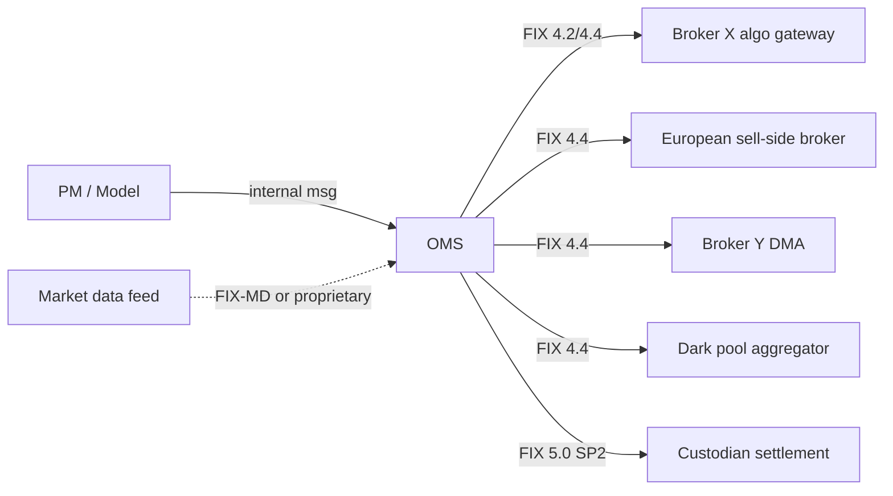
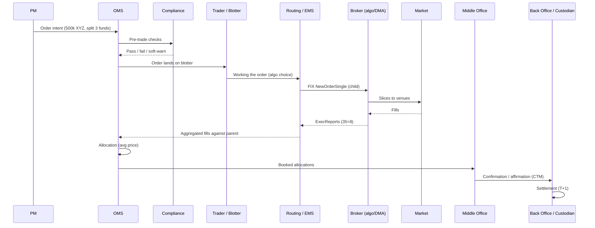
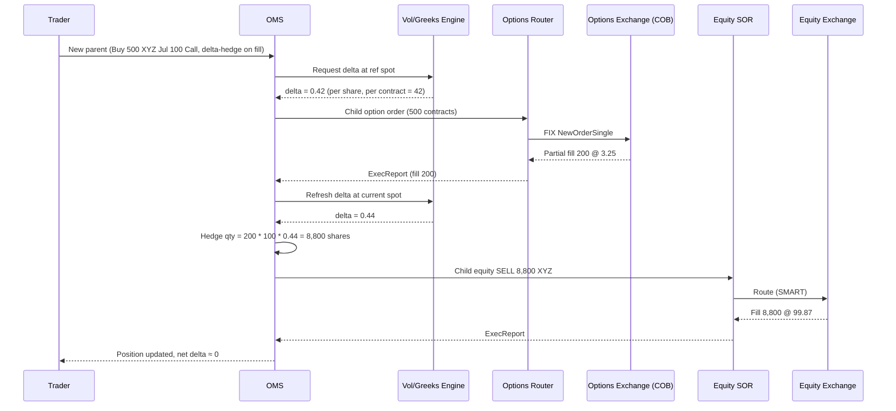

# 02 — OMS & Market Mock Interviews

> Three live-dialogue transcripts. Practice out loud with a timer.

---

## Mock Dialogues — OMS

Two long-form dialogues simulating the type of back-and-forth an interviewer for a Technical Analyst / Production Support seat on an OMS desk would run. First is a topical deep-dive on buy-side vs sell-side OMS; second is a "walk-me-through" of a US equity cash order from PM intent to booked fill. Both end with a short debrief calling out signal strengths and gaps.

---

### Dialogue 1 — Buy-side vs sell-side OMS deep dive (30 min)

**Setting:** panel of two — an OMS platform lead and a senior trading desk PS engineer. Whiteboard available. Candidate has been in prod support on our OMS for ~5 years, mostly buy-side flow.

---

**Interviewer 1:** Thanks for coming in. Let's skip the intros — I've read your CV. Give me your one-paragraph definition of an OMS, and where you draw the line between OMS and EMS.

**Candidate:** An Order Management System is the system of record for the lifecycle of an order — from creation (either manual or upstream from a PM's model), through pre-trade compliance and allocation, into routing, execution capture, post-trade allocation, and booking to the back office. It owns state and audit. An EMS, by contrast, is optimised for the *execution* slice — smart order routing, algo wheels, DMA, market data, low-latency FIX gateways. Buy-side desks usually have an OMS with an embedded or bolted-on EMS; sell-side desks usually have OMS-as-order-book with the EMS being their algo container plus SOR. The line I draw: if the system's primary job is "keep me legal and booked correctly," it's OMS. If it's "get me the best fill in the next 3 seconds," it's EMS.

**Interviewer 1:** Good. Now — same system, buy-side vs sell-side deployment. What actually differs?

**Candidate:** Five axes. (1) *Order origination* — buy-side is PM- or model-generated with implied cash; sell-side originates from client FIX inbound or sales-trader entry. (2) *Compliance* — buy-side runs mandate/IPS-driven checks (concentration, restricted lists, wash sales, 40-Act, UCITS); sell-side runs client-suitability, market-abuse (MAR), short-sale locate, RegSHO, best-ex logging. (3) *Allocation model* — buy-side does average-price allocation across funds pre- or post-trade; sell-side is per-client order, allocation is the client's problem, but they run their own book/agency split. (4) *Booking* — buy-side books to fund accounting and custody; sell-side books to firm P&L, prime brokerage, or client settlement. (5) *Regulatory reporting* — sell-side carries the reporting burden (CAT, MiFID II RTS 22/27/28, TRACE) far more than buy-side.

**Interviewer 2:** You said buy-side "does allocation pre- or post-trade." When would you pick which?

**Candidate:** Pre-trade allocation — the "block-and-slice" model — is used when the PM has already decided the split across funds and wants each fund to trade its own child order for clean audit and compliance-per-fund. It also makes commission-sharing and soft-dollar accounting cleaner. Post-trade average-price allocation — "trade first, allocate later" — is used when the PM wants best execution on the block and cares less about intra-fund variance. Most desks I've supported use post-trade for liquid US equities and pre-trade for anything where a per-fund restriction might trip (EM, restricted names, ADR conversions).

**Interviewer 2:** And when average-price allocation goes wrong — what's the failure mode you've actually seen?

**Candidate:** Two classics. First, a partial fill on a block where the allocation math rounds badly across many small funds — you get a residual share that has to be absorbed somewhere, and if the OMS's rounding rule isn't set (or is set inconsistently vs the fund accounting book), the position on the fund's side won't tie out with the OMS overnight. Fix is usually a "largest-fund-absorbs-residual" or "random-fund-absorbs-residual" policy configured on the allocation profile. Second, an allocation on a foreign name where the average price is in local currency but one fund's base currency is USD — if the FX rate captured for the allocation isn't the same rate used at booking, you get a break. Both show up as T+0 recon fails, not as OMS errors, which is what makes them nasty.

**Interviewer 1:** OK, moving to sell-side. Walk me through what a sell-side OMS has to do that a buy-side one doesn't.

**Candidate:** Three things stand out.

- **Care-order handling** — a client sends a DMA order via FIX, but if they mark it as "care" or "worked," a sales trader has to touch it. The OMS has to represent that as a parent-with-desk-intervention state, log the trader's actions for MiFID II best-ex evidence, and merge fills back to the client order cleanly.
- **Facilitation and principal risk** — the sell-side desk can commit its own capital. The OMS needs to represent both the client leg and the firm leg of the trade, with correct booking to the firm's inventory and correct client fill price (often at a benchmark like VWAP or arrival). Handling the two legs as related orders with separate P&L attribution but a common trade ID is non-trivial.
- **Regulatory reporting pipes** — CAT (US), MiFID II transaction reports (EU/UK), TRACE (US corporate bonds), short-sale marking, LOPR for options. The OMS is usually the source of the reportable event stream, and reporting failures are prod-support pages.

**Interviewer 1:** You've said "care order" — describe the FIX-level representation.

**Candidate:** Incoming NewOrderSingle (35=D) from the client with `HandlInst` (21) = 3 ("manual order, best execution") or a firm-specific tag indicating care/worked. The OMS accepts, sends an execution report (35=8) with `ExecType`=New / `OrdStatus`=New, and parks the order on the sales trader's blotter. The trader then works it — either by sending child orders to an algo/SOR (which are separate parent-child chains internally) or by voice-crossing. As fills come back, the OMS aggregates them and streams `ExecType`=Trade execution reports back to the client on the *original* client order ID, so from the client's view it looks like a normal working order. Key nuance: `LastPx` and `LastQty` are per-fill; `AvgPx` and `CumQty` are cumulative. Getting `AvgPx` rounding wrong is one of the most common client-facing bugs.

**Interviewer 2:** Let's stay with FIX. On the buy-side OMS you support today — how many FIX sessions do you typically have up, and what's the topology?

**Candidate:** In the deployment I support we run something like this:



Per broker we normally have one production session plus a UAT session, and per session there's a store (SeqNum persistence), a scheduler (start/stop times, weekend rules), and a heartbeat monitor. On a typical morning the first thing we do is check all sessions are logged on, sequence numbers reset if scheduled, and the drop-copy sessions from the brokers are also up so we can reconcile.

**Interviewer 2:** Drop-copy — why does the buy-side care?

**Candidate:** Because the broker's copy of the fills is the authoritative one for booking. Our OMS records what we *think* happened based on execution reports on the trading session, but if a session drops mid-day and re-logs on with a gap-fill, we might have missed a `35=8`. The drop-copy is a separate, low-touch session that just streams all fills, and we recon against it at end-of-day (or intra-day for HFT-adjacent flow). Any mismatch is a P1 — someone is going to be out of position at settlement.

**Interviewer 1:** Give me a concrete example — a session gaps, what do you do?

**Candidate:** Steps I'd run:

1. Confirm from the FIX log which side detected the gap — was it a `ResendRequest` from us or from the counterparty?
2. Check the last known `SendingTime` (52) and `MsgSeqNum` (34) before the gap on both sides.
3. Look at the store — did we ship all messages the counterparty is asking us to resend? If we did, and they didn't ack, that's their problem; if we didn't, we need to replay with `PossDup` (43=Y) or `GapFill` (123=Y for admin messages we shouldn't resend).
4. Cross-check the drop-copy for any fills we might have missed on the trading session during the outage.
5. If we find missing fills, book them manually via the OMS's manual-fill workflow, tag them with a reason code, and open a break ticket to the counterparty.
6. Post-mortem: was the gap a network blip, a session-config mismatch (heartbeat interval, seq reset policy), or an app-level bug?

**Watch-out I'd flag on step 3:** never blindly `ResetSeqNumFlag` (141=Y) in prod during trading hours — you'll lose the ability to recover any un-ack'd messages. That's a middle-of-the-night change with counterparty coordination.

**Interviewer 1:** Nicely paranoid. Compliance next — a PM tries to send a buy on a name that's on the restricted list. What does the OMS do, and who owns each step?

**Candidate:** In the OMS I support, the check runs in the pre-trade compliance engine synchronously between order-capture and order-release-to-routing. Flow:

1. PM saves the order in the OMS UI or model.
2. OMS internal state: `Pending New`.
3. Compliance engine evaluates rules (restricted list, concentration limits, sector caps, wash sale, etc.) against the *proposed post-trade* position.
4. If any hard rule fails, order state goes to `Compliance Rejected` — never leaves the OMS. The PM sees a rejection reason. Compliance/legal owns the restricted list itself; the OMS just enforces.
5. If a soft rule fails, order state goes to `Pending Compliance Approval` — a compliance officer has to override. That override is logged with the officer's ID, timestamp, and reason.
6. Only after all rules pass does the order transition to `Ready to Route`, and the routing engine picks it up.

The failure mode I've seen is when the restricted list feed is late — market opens and PMs are trading, but the list from Compliance's system hasn't refreshed. Our OMS is configured to *fail-closed* — no restricted list, no trading — but I've seen shops configured to fail-open and get burnt.

**Interviewer 2:** Fail-closed vs fail-open — when would fail-open ever be acceptable?

**Candidate:** Rarely. Maybe on a soft rule where the business has decided the cost of blocking flow is worse than the compliance risk, and only where there's a compensating detective control (post-trade surveillance that catches it same-day). For hard rules — restricted, insider window, sanctions — fail-open is almost never defensible. When I've been asked to config fail-open on a hard rule, I push back hard and ask for a signed exception from the CCO.

**Interviewer 1:** Two more. First — settlement. When does the OMS hand off to settlement, and what does the handoff look like?

**Candidate:** In the world I know: after all fills for a client/parent order are captured, the OMS runs allocation (if post-trade) and produces booked trades. The booked trades flow to the middle office / back office via an internal message bus or a file drop (SWIFT MT-format, or FIX 5.0 allocation messages, or a proprietary CSV — depends on the counterparty and the back-office system). The back office confirms/affirms via CTM/Alert (DTCC in the US), sends SWIFT MT540/541/542/543 to the custodian, and settles on T+1 for US equities (as of 2024). The OMS's job typically ends at "allocation booked and shipped"; the middle office owns break management from there. But we still get paged when a break traces back to bad data in the OMS — wrong custodian SSI, wrong account code, wrong currency.

**Interviewer 1:** And the SSI question — how does the OMS know which SSI to stamp?

**Candidate:** From the account master. Each fund/account has a set of Standing Settlement Instructions keyed by (currency, market, instrument type). At allocation time, the OMS looks up SSIs for each allocation leg and stamps the confirmation with the right custodian, account number, and place of settlement. When SSIs change (custodian migration, account move), that's a coordinated release with Ops — and the classic prod issue is trades booked in the transition window with old SSIs, requiring manual re-issue of confirms.

**Interviewer 2:** Last one. In one sentence — what's the single biggest architectural difference between the OMS you support and, say, a sell-side flow OMS at a bank?

**Candidate:** State ownership: the buy-side OMS is the golden source for *positions and mandate compliance*, and everything else is downstream of that; a sell-side flow OMS is the golden source for *the client order book and firm risk*, and positions live in the risk system upstream. Different pivot, different data model, different disaster-recovery priorities.

**Interviewer 1:** Good. That's time.

---

#### Debrief — Dialogue 1

- **Strengths:** clear line between OMS/EMS; concrete failure modes (rounding residual, FX-rate mismatch); knew fail-closed default; sensible FIX gap-recovery instinct (won't reset in-hours); understood drop-copy purpose.
- **Gaps to close:** could have named specific vendor components (compliance engine name, allocation module name) — sounded slightly generic. Didn't mention T+1 explicitly at first (self-corrected). No mention of order-staging vs order-blotter distinction. CAT reporting only named, not described.
- **Signal read:** solid mid-level PS engineer. Would push in a follow-up on regulatory reporting (CAT event types), allocation edge cases (fractional shares, partial-day allocation), and DR/BCP failover of FIX sessions.

---

### Dialogue 2 — Walk-me-through: a US equity cash order from PM to fill (45 min)

**Setting:** one-on-one with a lead engineer on the buy-side OMS platform team. The interviewer will interrupt frequently with "what if" branches. Whiteboard used.

---

**Interviewer:** Warm-up. Set the scene. A PM at a US buy-side asset manager decides to buy 500,000 shares of a large-cap US name — call it XYZ — across three funds. Walk me through what happens, end to end, and I'll interrupt. Start at "the PM has decided."

**Candidate:** OK. High level, the chain is:



Now let me unpack each step.

**Interviewer:** Yes, unpack. Start with order origination — is this manual, model-driven, or hybrid, and does the OMS care?

**Candidate:** The OMS cares because origination determines the audit trail and the compliance path. Three common patterns:

- **Manual PM entry** — PM types into the OMS UI, either a single order or a "model rebalance." The OMS assigns a client-order-ID and stamps origin=`Manual` with the PM's user ID.
- **Model-driven** — the PM's portfolio construction tool (something like a proprietary tool or a third-party like Aladdin) publishes desired positions; the OMS's *order generation* module diffs against current holdings and produces orders. Origin=`Model` with the model run ID. This is where a lot of buy-side flow starts.
- **Rebalance / cash management** — a subscription/redemption triggers cash flow, and the OMS generates orders to invest or raise cash. Origin=`Cash Flow` with the flow ID as the parent.

For the XYZ block, let's say it's a manual PM decision to add exposure. The PM enters a *block order* for 500k, with a proposed allocation across three funds: Fund A 250k, Fund B 150k, Fund C 100k. Order state: `Draft`.

**Interviewer:** Stop — proposed allocation at entry vs. post-trade allocation. Which is this and why?

**Candidate:** This is pre-trade *proposed* allocation — the PM has declared their intent. But whether it's *executed* as one block with post-trade average-price allocation, or as three separate child orders, is a routing choice made when the trader picks it up. On this desk, for a liquid large-cap, we'd almost always trade the block and do post-trade allocation at average price. For a less liquid name where per-fund restrictions might trip, or where one fund is in a subscription window, we'd trade three separate slices. The proposed allocation still gets stored — it's what compliance evaluates against, and it's the target for allocation.

**Interviewer:** OK. Compliance. What actually runs?

**Candidate:** Between `Draft` and `Pending New`, the OMS calls the compliance engine synchronously with the proposed post-trade positions:

- **Fund A** — currently holds 4% XYZ, buying 250k moves to ~4.8%. Check against Fund A's IPS single-issuer max of 5%. Pass with warning ("within 20 bps of limit").
- **Fund B** — check sector concentration; XYZ is tech, Fund B has a tech cap. Recompute post-trade sector weight. Pass.
- **Fund C** — check restricted list. Fund C has an insider window on XYZ because its parent adviser was recently in a research black-out. **Fail.**
- **Cross-fund** — check aggregation for 13D/13G thresholds (5% of issuer shares outstanding). If the firm's total XYZ across all funds after the trade crosses 5%, that's a filing trigger. Assume for now it doesn't.

Because Fund C fails a hard rule, the order state goes to `Compliance Rejected — Fund C`. Depending on the OMS config, either the whole block is rejected (safer, our default) or Fund C's leg is stripped and the block trades at 400k. The PM has to either drop Fund C or get compliance to release, which for an insider window they will not.

**Interviewer:** Let's say the PM drops Fund C. Block is now 400k across Fund A (250k) and Fund B (150k). Compliance passes. What now?

**Candidate:** State transitions to `Ready to Route` and the order appears on the trading desk blotter. The trader — separate role from the PM in most shops — picks it up. The trader's job: choose a strategy (VWAP, TWAP, POV, IS, or a broker-specific algo), choose a broker, decide on urgency, decide whether to work it themselves via an EMS blotter or hand it to an algo. On a 400k order in a large-cap, that's maybe 5–10% of ADV depending on the name — probably a VWAP or POV algo over a slice of the day. Say the trader picks a POV 15% strategy on the broker's algo, with a limit price 20 bps through arrival.

The OMS/EMS then constructs a FIX `NewOrderSingle` (35=D) to the broker. Fields:

```
35=D
11=<ClOrdID>     (our order ID for this parent-to-broker)
1=<AccountCode>  (a firm-level algo account, not the fund)
55=XYZ
54=1             (Buy)
38=400000
40=2             (Limit)
44=<limit px>
59=0             (Day)
21=1             (Automated exec, no broker intervention)
6017=<algo=POV, participation=15, start=now, end=15:45 ET, ...>
```

Broker acks with 35=8 / 150=0 (New).

**Interviewer:** Note that you sent this on a firm-level algo account, not a fund. Why?

**Candidate:** Because the broker doesn't need to know the fund breakdown — they see the block. Sending fund-level accounts on the child order would leak our allocation intent to the broker, which is information you don't want in the market. The fund breakdown lives inside the OMS and is applied at allocation time post-trade. At allocation, the OMS sends the broker a `35=J` (Allocation Instruction) or 35=AS (Allocation Report) message with the per-fund breakdown, or increasingly this is done via CTM rather than FIX.

**Interviewer:** Fills come back. What does that look like?

**Candidate:** Broker's algo starts slicing to venues. For each fill, we get a 35=8 execution report:

```
35=8
11=<original ClOrdID>
17=<ExecID unique per fill>
150=F            (Trade)
39=1 or 2        (Partially filled / Filled)
32=<LastQty>
31=<LastPx>
14=<CumQty>
6=<AvgPx>
60=<TransactTime>
30=<LastMkt>     (venue MIC, e.g. XNYS, XNAS, BATS)
```

The OMS/EMS ingests each execution report, updates the parent order's `CumQty` and `AvgPx`, and streams a synthetic view up to the PM's blotter. Typical prod incident here: the broker's `AvgPx` and our computed `AvgPx` diverge because of rounding — we compute from `LastQty * LastPx` running sum, they compute differently. Doesn't matter until allocation, but it will matter then. We recon on `CumQty` first (must match to the share) and on notional (must match within a defined tolerance, usually less than a cent per share).

**Interviewer:** During the trading day, a fill comes in with 30=XADF — off-exchange (TRF). Anything different from a regular fill?

**Candidate:** Functionally not much for the OMS — it's still `150=F`. But it's a signal that the broker crossed you in a dark pool or against internal flow. Two things I'd watch:

1. **Best-ex justification** — if the algo took a dark print at a price outside the NBBO at that microsecond (which shouldn't happen but can, on a fast market), the compliance/best-ex team will want the venue and timestamp for TCA.
2. **Regulatory tape** — TRF prints show up on the SIP with a delay; some venues have their own quirks around trade condition codes. That's more the broker's problem than ours, but we log it.

**Interviewer:** Order fills fully — 400,000 shares filled, average price 152.4375. Now what?

**Candidate:** Parent order transitions to `Filled`. The OMS runs allocation:

- Total: 400,000 shares @ 152.4375, notional = $60,975,000.
- Fund A: 250,000 shares @ 152.4375 = $38,109,375.
- Fund B: 150,000 shares @ 152.4375 = $22,865,625.

At this simple ratio the numbers are exact, but let's inject reality — say the actual average is 152.437512345... The allocation engine applies the desk's rounding policy. Typical policy: round each fund's price to 4 decimals (equities standard), compute notional at rounded price, and let the residual (fractions of a cent) fall to the largest fund. So Fund A absorbs a $0.03 rounding residual; Fund B is clean. This is stored on the allocation record for audit.

Each allocation becomes a booked trade in the OMS with:

- Fund account (Fund A's real custody account, not the algo account)
- Trade date = today, Settlement date = T+1
- Broker code
- Commission (usually a fixed cps or bps)
- SEC fee (sell-side only, but the OMS still calcs and stamps)
- Any research/CSA split if the desk uses commission sharing

**Interviewer:** Commission — how does the OMS know the rate?

**Candidate:** Broker rate cards, stored in the reference-data layer of the OMS, keyed by (broker, algo, asset class, region, and sometimes account). Rate cards change quarterly at most desks; changes are a coordinated release with the trading desk and Ops. Common prod issue: a rate card change that misses one broker or one account, and you find out when the broker's confirm doesn't tie to our booked commission. Usually a $200 break, but if it hits every trade for a month, that's a real number.

**Interviewer:** Booked. What ships out of the OMS and to whom?

**Candidate:** Two streams:

1. **Confirmation/affirmation flow** — the OMS ships allocation details to the CTM platform (DTCC's post-trade matching service in the US). CTM matches our allocations against the broker's confirmation. Match → auto-affirmed → flows to DTC for settlement. No match → break, worked by middle office.
2. **Downstream feed** — the OMS publishes booked trades to fund accounting, the position master, the risk system, and the compliance surveillance system. Usually a Kafka topic or a mainframe file feed at end-of-day. Fund accounting will strike NAV tonight using these trades; if they're wrong, NAV is wrong, and that's a *very* bad day.

**Interviewer:** T+1 settlement. What's the failure mode you've seen most often on settle date?

**Candidate:** Three, in order of frequency:

1. **SSI mismatch** — our confirm has custodian X for Fund A, broker's confirm has custodian Y. Root cause: our account master wasn't updated when Fund A migrated custodian. Fix: re-issue the confirm with correct SSI; broker re-affirms. If not caught by market open on T+1, DTC will fail the delivery, and you may get charged a fail fee.
2. **Quantity/price mismatch** — usually a rounding disagreement or a manual booking on one side that didn't match. Fix depends on who's right.
3. **Late affirmation** — we affirmed after the DTC cut-off (US equities is 9pm ET on T for auto-settlement). Fail fee. Root cause is usually a slow allocation process on our side because of a compliance re-check or a broken feed.

**Interviewer:** Let's back up. Between fill and allocation, PM changes their mind — wants to add Fund D 50k. What happens?

**Candidate:** Depends on when.

- **Before allocation is booked and shipped:** it's a re-allocation. The OMS lets a user (with allocation permission) modify the allocation split, subject to a re-run of compliance on the new Fund D leg. If Fund D passes, the total block stays at 400k but is now split A/B/D. But — you can't create shares out of nothing, so this only works if the PM reduces A or B correspondingly. If the PM wants to *add* 50k, that's a new order for Fund D 50k, traded separately.
- **After allocation is booked and shipped to CTM:** you're in cancel-and-correct territory. Cancel the allocation with the broker (35=AT or via CTM), re-affirm the new one. Every downstream system that consumed the original booking needs to consume the correction. This is where you generate work for six teams to fix one number.
- **After settlement:** as-of trade. Legal and Ops involvement, potential P&L impact, unhappy PM, unhappy fund accounting. Almost always caused by a process failure earlier.

**Interviewer:** Same order, different branch — broker's session drops after 200k has filled. What now?

**Candidate:** Assume it's mid-morning, market is live, algo is running on broker side.

1. **Detect** — our FIX engine notices heartbeat loss, alerts fire (Splunk/monitoring dashboard shows session down).
2. **Contain** — the parent order on our side is at `Partially Filled` (200k of 400k). No new child slices are going out from us; the broker's algo, however, may still be working the remaining 200k in the market. That's the risk.
3. **Get eyes on the broker** — trader calls the broker's coverage or algo desk. Two questions: is the algo still working, and can they stop it. Usually the broker's side will pause the algo if they can't communicate fills back to us.
4. **Reconcile** — check the drop-copy session (if we have one — most brokers give us one). Any fills we missed on the trading session will be on the drop-copy. Book them in the OMS as manual fills with an audit reason.
5. **Recover session** — bring the session back up, resolve any seq-num gap via `ResendRequest` on our end, receive gap-fills or actual resends of missed messages. Confirm parent CumQty is now correct.
6. **Decide** — trader decides whether to keep working (session is stable, continue) or pull the remaining order and re-route via another broker.

Root-cause after the fact — usually network, sometimes counterparty deploy, occasionally something on our side.

**Interviewer:** Fair. Take me back to allocation. What happens when the PM wants to allocate a partial fill?

**Candidate:** Two policies. Some desks force allocation only at end-of-day or at parent-order-fill. Other desks allow *partial-day* or *street-side* allocation on request — you can book what you've got, keep working the rest. The trade-off is operational complexity (multiple confirms per parent) vs. cash management (fund may need to know the trade is booked to compute exposure). On the desk I support, we default to end-of-day, but the head trader can request an early allocation on large blocks. That triggers a partial-fill allocation run against the current `AvgPx`, and any subsequent fills allocate at the *new* running average, which means Fund A's cost basis becomes an average of two allocation runs. It's fine but the reconciliation is subtler.

**Interviewer:** OK, one more curveball. It's 3:55pm, the algo has filled 380k of 400k, and now the venue halts XYZ for news pending. Your desk is holding a working order for 20k unfilled. Walk me through it.

**Candidate:** Steps:

1. **Confirm the halt** — market data feed shows halt status, exchange (primary listing) has issued a Rule 4120 halt code. Any resting order on the primary is held; algo pauses.
2. **Broker communicates** — should get a 35=8 with `150=6` (Stopped) or similar depending on broker; more commonly the algo just goes quiet.
3. **Halt persists past close** — some halts resume same day, some don't. If it doesn't resume, the 20k unfilled sits as `Partially Filled` at day-end. Depending on the order's TIF, it may auto-cancel at the close (Day order) or remain live for tomorrow (GTC).
4. **Allocation decision** — allocate the 380k that filled today at today's `AvgPx`, or hold everything until fully done? PM's call. Typically we allocate the 380k today (that's real exposure, has to hit fund NAV tonight), and the residual 20k either cancels or rolls to tomorrow as a new parent order for clean audit.
5. **News event on resumption** — if the halt is for M&A news, price will gap. That's a PM/trader decision to keep working or pull. Not our problem as PS unless the OMS state gets confused (e.g., an old resting order re-activates at a stale limit price — worth double-checking).

**Interviewer:** Sanity check — total time from PM click to booked allocation, roughly?

**Candidate:** For a well-behaved order like this: PM enter to `Ready to Route` — seconds (compliance latency dominates). Working the order — depends on strategy, could be minutes to hours (POV 15% on a 5% ADV name is a couple of hours). Fill to allocation booked — seconds if it's auto-allocation, up to end-of-day if manual. Booked to affirmed via CTM — usually within minutes, must be by 9pm ET cut-off. Settled — T+1 close of business.

**Interviewer:** Last question. If you had to add *one* observability signal to this whole flow that isn't there today, what would it be?

**Candidate:** Latency budget per stage, with alerts on breach. Concretely: timestamp the order at every state transition (Draft, Pending Compliance, Ready to Route, Routed, First Fill, Fully Filled, Allocated, Booked, Affirmed) and expose a dashboard showing time-in-stage per order. Today, when a PM complains "my order took forever to hit the market," I have to piece it together from four different logs — OMS, compliance, EMS, broker FIX log. If every stage-transition timestamp were on one record with alert thresholds per stage, we'd catch stuck-in-compliance or slow-to-route issues immediately, and it would kill 30% of "why is this slow" tickets.

**Interviewer:** Good place to stop.

---

#### Debrief — Dialogue 2

- **Strengths:** followed the FIX-level flow accurately, including the firm-level-account-on-child point (which many candidates miss). Handled the "PM changes mind" branch with the right buckets (before allocation, after affirm, after settle). Session-drop recovery was concrete and cited drop-copy correctly. Good instinct on the observability question — showed operational maturity.
- **Gaps to close:**
  - Did not proactively mention CAT reporting on the buy-side leg (buy-side has some CAT obligations too, e.g. Industry Member reporting).
  - No mention of TCA (transaction cost analysis) feedback loop back to the PM.
  - Rounding-residual explanation was good but did not name a specific FIX tag or vendor field.
  - The `35=J` vs `35=AS` distinction was casual — worth being sharper: 35=J is Allocation Instruction (block-and-split), 35=AS is Allocation Report (bilateral confirm). Different workflows.
- **Signal read:** strong prod-support engineer with real desk exposure. Clear enough to sit on a first-line rota. Follow-up rounds would test: (a) code — could they read a FIX message dump and spot the bug; (b) SQL — could they reconcile a break given two data extracts; (c) design — could they propose the observability system they just described.

---

*End of chunk.*
### Dialogue 3 — Options desk support: what do you monitor differently (30 min)

**Setting:** Late-morning coffee chat with the hiring manager for an Equity Derivatives / Listed Options support role. Candidate has 5 years on our cash equities OMS and is being probed on how options support differs day-to-day.

---

### Q1. Walk me through the first 15 minutes of your day on an options desk vs a cash desk. What changes?

**Interviewer signal:** Do you actually know the pre-open rituals for listed options, or are you extrapolating from cash?

**Answer:**
On cash, my pre-open is basically three things: sessions up to all destinations, reference data loaded (symbols, restricted lists, borrow), and a smoke order round-trip per venue. Roughly 15 minutes.

On options, that same checklist is a subset. What I add:

- **Contract reference data.** Series and chain rolls happen on expiry Fridays and after corporate actions. I check that the previous night's OCC series file loaded cleanly and that new strikes and weeklies are subscribed on the market data side. A missing strike is the number-one silent failure.
- **Exchange links per listing exchange.** A single underlying can trade on 16+ US options exchanges. I verify the sessions to CBOE, ISE, NYSE Arca Options, MIAX, BOX, etc., and the SMART/RASH-style router config that decides where a marketable order lands.
- **Greeks and vol surface.** The pricing engine that supplies theoretical, implied vol, and Greeks has to have loaded overnight vols and dividend schedules. If the vol server is stale, the whole desk is flying blind on delta hedges.
- **Underlying feed sanity.** Options are derived — if the underlying spot feed is 200ms late or crossed, quotes on the desk look wrong even when the option leg is fine.
- **Pending corporate actions.** Splits, special dividends, mergers — any of those cause OCC contract adjustments (non-standard deliverables, adjusted strikes). I want to know before the trader asks why the option symbol changed.

**Watch-outs:** Candidates often say "same as cash plus Greeks." Miss the corporate-action / OCC adjustment angle and you sound like you've never covered an expiry week.

---

### Q2. A trader pings you: "my delta hedge order is going out with the wrong size." Where do you start?

**Interviewer signal:** Do you understand the auto-hedge flow — option fill → delta calc → underlying order — and where each link can lie?

**Answer:**
I treat this as a three-stage pipeline and bisect:

```
option fill  →  delta calc  →  hedge order builder  →  underlying route
   (A)              (B)              (C)                    (D)
```

- **(A) The option fill itself.** Pull the exec report. Is the fill quantity in **contracts** and did downstream code apply the correct multiplier (usually 100, but 10 for mini-options, non-standard after corporate actions)? A classic bug: fill for 5 contracts is treated as 5 shares equivalent, hedge undersized by 100x.
- **(B) The delta the hedger used.** Was it the delta at fill time or a stale delta from the parent order? For a fast market, a delta from 30 seconds ago can be materially off. I also check whether it's the model delta from our vol surface vs the exchange-published delta — different desks configure differently.
- **(C) Hedge order builder.** Look at any rounding rules, min lot size, and whether an existing residual position was netted. If the strategy is delta-neutral on a basket, the hedger nets across legs before firing; a stuck leg on the previous fill can throw the net.
- **(D) The route.** Confirm the child order tag 38/OrderQty matches what stage C computed. If it doesn't, we have a serialization bug between engine and FIX.

I'd screen-share the parent, the option child fill, the computed delta, and the hedge child in one view. Nine times out of ten the answer is a multiplier issue or a stale delta.

**Watch-outs:** Jumping straight to "check the FIX log" without knowing the multiplier / delta-source question makes you look like a cash guy in options clothing.

---

### Q3. What's the equivalent of a "bad print" on cash, in options?

**Interviewer signal:** Do you know that options have their own market-data pathologies?

**Answer:**
Several, and they're worse than cash because pricing is derived:

- **Crossed / locked NBBO across exchanges.** With 16 listing exchanges, one venue publishing a stale quote can cross the composite. Auto-quoters and marketable-limit logic misbehave.
- **Wide markets at the open.** Options often don't open until the underlying prints on the primary. If our order router sends a marketable order at 09:30:00.100 and the option isn't open yet, we can trade against a very wide auto-quote. Cash equivalent: LULD band violations, but options have no LULD, only exchange-level obvious-error rules.
- **Stale implied vol.** If the vol feed hasn't ticked but spot has moved 1%, our theoretical is off and every "fair value" display on the desk lies.
- **Contract-adjusted symbols.** Post-corporate-action, a symbol like AAPL1 (non-standard) trades alongside AAPL. If our reference data hasn't picked it up, we display it as unknown or map it to the wrong deliverable.

**Watch-outs:** Don't just say "wide spreads." Name the mechanism — pre-open auto-quotes, adjusted contracts, cross-exchange NBBO staleness.

---

### Q4. Explain the settlement and clearing difference from a support-ticket standpoint.

**Interviewer signal:** Cash T+1 vs OCC-cleared options — do you know why break tickets look different?

**Answer:**
Cash US equities are T+1 through DTCC/NSCC. Breaks are usually price, quantity, or SSI mismatches, and I resolve at the executing broker or via a CTM affirm.

Listed options clear through the OCC, and settlement is T+1 for premium in cash. What changes operationally:

- **Position lifecycle is longer.** Options live until expiry or close. So a booking break isn't just "does the trade match" — it's "does our open position match OCC's position statement." I reconcile the daily position file, not just executions.
- **Assignment and exercise.** Overnight, in-the-money longs can be exercised, shorts can be assigned. Support has to handle assignment notices, book the stock leg, and make sure the desk sees it before market open.
- **Expiry processing.** On expiry Friday and Saturday morning, we run auto-exercise thresholds (usually $0.01 ITM under OCC rules). Any manual do-not-exercise (DNE) instructions from the trader have to be captured, and the CMTA / give-up flow to the clearing firm has to reconcile.
- **CMTA.** Options often trade at one broker and clear at another via CMTA agreements. Breaks on the CMTA leg are their own category.

**Watch-outs:** Saying "same as cash but T+1 premium" misses assignment, expiry auto-exercise, and CMTA — three of the biggest ticket categories.

---

### Q5. A PM wants to buy a large put spread — 5,000 by 5,000. What controls do you expect in the OMS and what breaks first?

**Interviewer signal:** Do you understand multi-leg / complex order types and pre-trade risk?

**Answer:**
For a defined-risk vertical spread, the OMS should route as a **complex order** to a single exchange's complex order book (COB) — CBOE COB, ISE, NYSE Arca — rather than legging in. Reason: legging risk is real; if the second leg moves before you fill, you're stuck naked.

Controls I expect and where I've seen them fail:

- **Notional and Greek limits.** 5,000 contracts of a put spread has bounded max loss but real delta and vega. Pre-trade check should compute delta-adjusted notional and net vega and compare to the desk's book limits.
- **Leg ratio validation.** For a 1:1 vertical the OMS accepts easily; ratios (1x2, backspreads) need explicit strategy templates or the exchange rejects.
- **Strategy code mapping.** Each exchange has its own COB strategy codes. If the OMS sends a spread as two independent legs (multi-leg order but not tagged as a spread), you legs get filled independently and possibly at bad relative prices.
- **Fat-finger on limit price.** Spread is quoted as a net debit/credit. Traders enter debit as a positive; if the OMS accidentally sends absolute values per leg you overpay wildly.

First break I usually see: the **exchange complex strategy code** isn't provisioned for a newly listed underlying, so the order gets rejected with an unhelpful "invalid strategy" message. Fix is a reference-data push and coordination with the exchange desk.

**Watch-outs:** Don't confuse "multi-leg order" (routed as separate children) with "complex order" (single COB order). Different risk profile.

---

### Q6. Show me how you'd draw the flow for a paired option + delta-hedge order.

**Interviewer signal:** Can you diagram this cleanly under pressure?

**Answer:**



The support-critical arrows are the two `Request delta` calls. If VolEngine returns stale or the second call is skipped (some implementations cache delta from order entry), the hedge is wrong.

**Watch-outs:** Missing the "refresh delta at fill" step is the single most common bug on custom hedgers.

---

### Q7. Overnight, a client's short call gets assigned. What tickets and monitoring alerts do you expect?

**Interviewer signal:** Do you know the operational choreography of assignment?

**Answer:**
Sequence I expect between OCC allocation (evening) and market open next day:

1. **OCC assignment notice** arrives to the clearing firm; our OMS ingests via the position/assignment file (or DTCC feed for equity leg).
2. **Position update:** short call closed at strike, short stock position opened at strike.
3. **Alert to the trader** — a canned "you were assigned on X" pre-open email/Slack, generated from the assignment file diff.
4. **Book the stock leg** in the equity ledger with correct settlement date (T+1 from assignment date, so it may not match today's cash trades).
5. **Locate check.** If the resulting short stock position needs a borrow, ops has to have located it or the position is a fail-to-deliver risk. This is a real monitoring alert I'd set up.
6. **Margin refresh.** The assignment changes the margin footprint materially; risk engine has to recompute pre-open.

Monitoring I'd have in place:
- Alert if the assignment file didn't arrive by a cutoff (say 22:00 local).
- Diff of overnight positions vs prior close, flagging any ITM shorts that were NOT assigned (rare but possible for cash-settled or if counterparty chose DNE).
- Alert if any assigned short-stock leg has no borrow located by 08:00.

**Watch-outs:** Forgetting that assignment creates a stock position, not just a P&L event, is the classic cash-only-support mistake.

---

### Q8. Same underlying, but the desk trades on both CBOE and ISE — what does that mean for your P&L reconciliation?

**Interviewer signal:** Multi-venue clearing and position aggregation.

**Answer:**
Clearing is unified at OCC — all US listed options land in one OCC position regardless of the executing exchange. So end-of-day OCC position is one number per contract per account.

But for **support**, I care about the pre-clearing view:

- Each exchange sends its own drop-copy / trade file.
- Our OMS builds an intraday position from execs; end-of-day I reconcile against each exchange's drop-copy AND the OCC position statement.
- A break can appear as "OMS shows 100 long, CBOE drop-copy shows 100, ISE drop-copy shows 0, OCC shows 100" — which is fine. Or "OMS 100, CBOE 80, ISE 0, OCC 100" — which means we mis-booked 20 contracts as CBOE that actually filled on ISE. Root cause is usually a route-tag mismatch in the exec report.

P&L reconciliation ties out at the OCC level. Intraday risk uses the OMS view, which is the one I keep clean.

**Watch-outs:** Saying "just check OCC" misses the intraday breaks that only show up in per-exchange drop-copies.

---

### Q9. What tools or dashboards would you build in the first 90 days that you didn't need on cash?

**Interviewer signal:** Proactive mindset — what's missing when you arrive.

**Answer:**
Assuming standard OMS dashboards exist, I'd add:

- **Vol surface staleness monitor.** Age of last update per underlying, per tenor. Alarm on any tenor > threshold during market hours.
- **Contract reference-data diff dashboard.** Overnight diff of OCC series file: new listings, delisted, adjusted contracts. Not just log lines — a screen the ops lead reviews with coffee.
- **Complex order rejection heatmap.** Reject rate per exchange per strategy code. Catches provisioning issues before the trader does.
- **Delta-hedge slippage report.** For every parent with hedging enabled: computed delta at fill vs realized hedge fill price vs mid at fill time. Slippage attribution — is it delta staleness, routing, or spread?
- **Assignment forecast (pre-close).** Any short position that is ITM by more than $0.05 with < 1 day to expiry, sized by contract count. Nothing fancy, just an "expect assignment on these" pre-close screen.
- **Expiry playbook checklist.** Not a dashboard, a runbook. Which underlyings expire this week, which are AM-settled vs PM-settled (indexes matter), which have known corporate actions pending. I'd have this ready by Thursday for every Friday.

**Watch-outs:** Don't overpromise dashboards you can't staff. The vol staleness monitor and the assignment forecast are the two that pay back fastest.

---

### Q10. Last one — how do you handle a trader who's convinced the OMS is wrong when the data says otherwise?

**Interviewer signal:** Soft skills, escalation judgment.

**Answer:**
Two-step approach that I've refined over five years:

1. **Never argue in the moment.** During market hours the trader's job is to trade. I acknowledge, ask for the order ID or a screenshot, and say "let me pull the full trace and come back in 5 minutes." That buys me the data I need and de-escalates.
2. **Come back with the receipts.** I show the FIX message, the timestamp, the delta value at fill, the config in effect. If the OMS was right, I frame it as "here's what happened and here's why it looked wrong from your side" — never "you were wrong." If the OMS was wrong, I own it fast, quantify the impact, and outline the fix.

The failure mode is the support person who either capitulates ("yeah must be a bug") without evidence, or digs in ("system is right, you're wrong") without empathy. Both destroy trust. The middle path is: data first, then dialogue.

**Watch-outs:** Don't promise a code fix in the heat of a trade. Log the ticket, then decide with the dev team whether it's a config, data, or code issue.

---

## Debrief

**Signal the interviewer is looking for across these 10 questions:**

- Does the candidate treat options as *derived instruments* — where underlying, vol, and reference data are first-class support surfaces, not afterthoughts?
- Can they name the operational events that don't exist on cash: **assignment, exercise, expiry auto-exercise, contract adjustments, CMTA, complex-order strategy codes**?
- Do they distinguish **multi-leg** (leg risk) from **complex** (COB, atomic) orders?
- Do they know the delta-hedge pipeline well enough to bisect it under pressure?
- Do they have a monitoring instinct — vol staleness, assignment forecast, per-exchange drop-copy reconciliation — rather than just "check the FIX log"?

**Red flags:**
- Answering every question through a cash-equities lens.
- Confusing OCC settlement with DTCC.
- Not mentioning corporate actions / contract adjustments at all.
- Vague on where multipliers get applied.

**Green flags:**
- Naming specific exchanges (CBOE, ISE, MIAX, BOX) and knowing COB vs single-leg routing.
- Distinguishing AM-settled vs PM-settled expiry.
- Owning the trader-relationship question with a concrete two-step approach.
- Proposing dashboards that reflect actual options pain points, not generic ops screens.
