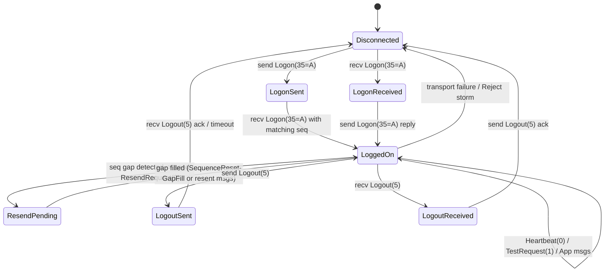
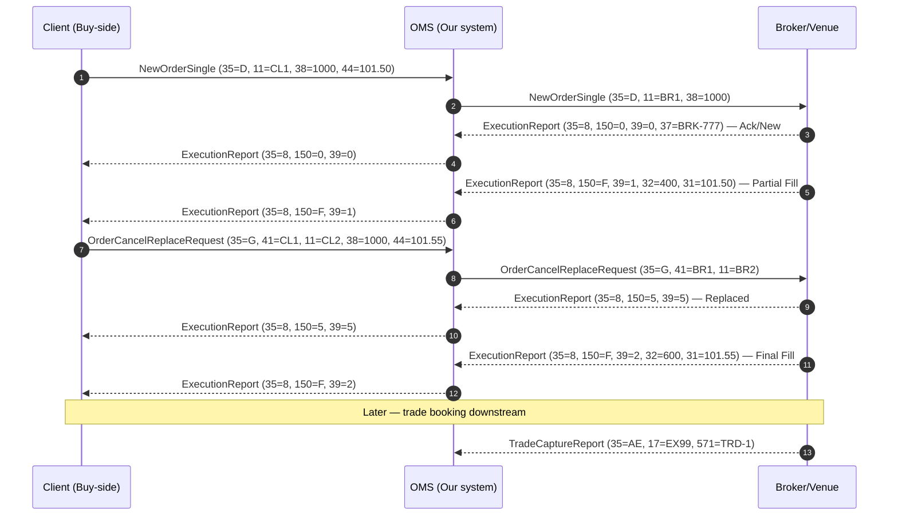

# 03 — FIX Protocol Comprehensive Q&A

> 100+ FIX questions covering versions, session layer, application messages, drop copy, gateway architecture.

---

## FIX Protocol — Part A: Versions, Layers, Anatomy, Session Messages



## 1. FIX versions (4.0 / 4.2 / 4.4 / 5.0 SP2 / FIXT 1.1) — differences, when used

### Q1. Walk me through the FIX versions you have seen in production and where each one still lives.
**Interviewer signal:** Do you actually know what's running in the wild vs. reciting a spec?
**Answer:**
- **FIX 4.0 (1996):** Effectively dead. I've only ever seen it on very old market-data drops from legacy venues.
- **FIX 4.2 (2000):** Still the workhorse for a huge amount of US equities order flow — many buy-side/sell-side pipes on our OMS run 4.2 because it was "good enough" and nobody wanted to recertify.
- **FIX 4.4 (2003):** The dominant version for global equities, listed derivatives, and most sell-side broker connections today. Adds proper allocation, confirmation, and cross-order support. Most of the client-facing sessions I supported on our OMS were 4.4.
- **FIX 5.0 SP2 (2009):** Used mostly where post-trade / regulatory extensions matter — e.g., MiFID II fields, some clearing flows. It is almost always paired with FIXT 1.1 for the session layer.
- **FIXT 1.1:** Not an application version — it's the session transport layer that FIX 5.0 rides on. Header carries `1128=9` (ApplVerID) to say "this app payload is 5.0 SP2".

**Watch-outs:** Don't call FIXT 1.1 "a FIX version" — it's the session envelope. FIX 5.0 without FIXT is not a real deployment.

### Q2. Why did the industry split the session layer out into FIXT 1.1?
**Interviewer signal:** Do you understand *why* the protocol evolved, not just *what* changed?
**Answer:**
Before 5.0, every FIX version had its own session semantics baked in — so upgrading the application dictionary (adding new tags, new message types) forced you to also renegotiate the session. That was painful: you'd take an outage to move from 4.2 to 4.4 even if all you wanted was a new field. FIXT 1.1 decouples the two. The session layer is frozen at FIXT 1.1 and the application dictionary version is advertised per-message via `ApplVerID(1128)`. That means a single FIXT session can, in principle, carry FIX 5.0, 5.0 SP1, 5.0 SP2 or custom extension packs without a session-level upgrade.
**Watch-outs:** Don't say "FIXT replaced FIX 4.4" — 4.4 still has its own bundled session layer and is used more than 5.0 in practice.

### Q3. Client sends `BeginString=FIX.4.2` but our OMS is configured as FIX.4.4. What happens and what would you check?
**Interviewer signal:** Do you know that tag 8 is the version handshake and it's fatal if it mismatches?
**Answer:**
The Logon will be rejected — usually at the session engine before it even reaches the app layer, because tag 8 (BeginString) must match the configured session's expected value exactly. Symptoms:
- Session never establishes; counterparty sees an immediate disconnect or a Logout(5) with `Text(58)` like "Incompatible BeginString".
- In our OMS logs I'd grep for the session-level Reject or the raw disconnect.
Fix path: confirm the session config on both sides (FIX version, SenderCompID/TargetCompID), and check if the client accidentally pointed at the wrong session (e.g., UAT config pointed at prod endpoint). I've seen this most often after a client's own config push.
**Watch-outs:** Tag 8 mismatch is *not* recoverable with a Reject(3) or ResendRequest — it kills the session.

### Q4. When would you deploy FIX 4.4 vs FIX 5.0 SP2 today for a new client onboarding?
**Interviewer signal:** Practical judgment on version choice.
**Answer:**
Default is **4.4** unless there's a reason to go higher:
- Equities cash / listed derivatives, buy-side to sell-side, DMA, algos — **4.4**. Broadest counterparty support, mature dictionary, all the trade lifecycle messages you need.
- Post-trade allocation / confirmation flow with regulatory fields (MiFID II short-sell indicators, LEIs, decision-maker IDs) — **5.0 SP2 over FIXT 1.1**, because the standard fields are already defined; on 4.4 you'd bolt them on as user-defined tags.
- Market data from a modern venue — often **5.0 SP2**.
- Custom broker extensions (a European sell-side broker's algo params, for instance) — usually 4.4 with user-defined tags in the 5000–9999 range.

**Watch-outs:** Version choice is often dictated by the counterparty, not you. Don't say "we always pick the newest."

### Q5. What is `ApplVerID` (tag 1128) and when is it required?
**Interviewer signal:** FIXT knowledge.
**Answer:**
`ApplVerID(1128)` tells the receiver which application-layer FIX dictionary to use to parse this message. It's only meaningful on FIXT 1.1 sessions. Values are enumerated: `7`=FIX 4.4, `9`=FIX 5.0 SP2, etc. It can appear on the Logon (as the default for the session) via `DefaultApplVerID(1137)`, and on individual application messages if a session carries mixed versions. On a classic 4.4 session, tag 1128 is not used — the version is implicit from `BeginString(8)`.
**Watch-outs:** `DefaultApplVerID` goes on the Logon; `ApplVerID` goes on the app message. Mixing them up is a common interview trap.

### Q6. A US buy-side client wants to send you Cross Orders. Which FIX version supports that natively?
**Interviewer signal:** Do you know what feature landed in which version?
**Answer:**
Cross Orders (`NewOrderCross`, `35=s`) were introduced in **FIX 4.3** and are properly supported from **4.4** onward. On 4.2 you'd have to fake it with custom tags on a `NewOrderSingle`. In practice with a US buy-side client on our OMS we'd insist on 4.4 for anything involving crosses, or use a bilateral extension if they were stuck on 4.2. There was one client where their agency cross flow had `tag 21283` truncation because of a `char[16]` buffer — that was an OMS vendor-side bug, not a FIX version issue, but it surfaced only on cross messages.
**Watch-outs:** Don't confuse `NewOrderCross(35=s)` with `NewOrderMultileg(35=AB)` — different message, different use case.

### Q7. What are the biggest wire-level differences between 4.2 and 4.4?
**Interviewer signal:** Depth of practical knowledge.
**Answer:**
- **Header ordering:** 4.4 formalized `OnBehalfOfCompID`, `DeliverToCompID`, and stricter header field ordering.
- **New message types:** 4.4 added `Confirmation(35=AK)`, `AllocationInstruction` overhaul, `TradeCaptureReport(35=AE)`, `MassQuote` improvements.
- **Repeating groups:** 4.4 tightened the "NoXxx" count semantics and disallowed some ambiguous group orderings.
- **Session:** Both use the bundled session layer; the wire framing (tag 8/9/10) is identical.
- **Field additions:** hundreds of new tags in 4.4 for post-trade and settlement (e.g., `SettlType`, `AllocID` becomes more prominent).

**Watch-outs:** Don't claim SOH or checksum changed — the framing has been stable since 4.0.

### Q8. Can you run FIX 5.0 SP2 without FIXT 1.1?
**Interviewer signal:** Testing whether you understand the architectural split.
**Answer:**
No, not per spec. FIX 5.0 (and all SPs) was published *without* a session layer of its own — it deliberately relies on FIXT 1.1 to carry it. So a compliant 5.0 SP2 deployment always has `BeginString=FIXT.1.1` on the wire, with `DefaultApplVerID=9` on the Logon telling the counterparty "the app payload dictionary is 5.0 SP2." In our OMS the session config would say something like `BeginString=FIXT.1.1` and `DefaultApplVerID=FIX.5.0SP2`.
**Watch-outs:** You'll never see `BeginString=FIX.5.0` on the wire in a spec-compliant flow.

### Q9. Which FIX version would a global bank OMS most likely expose to a European sell-side broker for algo orders?
**Interviewer signal:** Real-world pattern recognition.
**Answer:**
Overwhelmingly **FIX 4.4**. Every major sell-side broker's algo gateway I've integrated with used 4.4 with custom tags for algo parameters (aggression, participation rate, dark pool preferences). The broker publishes a "rules of engagement" document listing user-defined tags (usually in the 5000–9999 range or 20000+ for that broker's namespace). We'd import that into the OMS session config as an extension dictionary. FIXT/5.0 is rare for algo flow because the dictionary is over-engineered for the use case and counterparty support is thinner.
**Watch-outs:** Custom tags per broker are not portable — same tag number can mean different things at different brokers.

### Q10. How would you tell from a raw capture which FIX version is on the wire?
**Interviewer signal:** Can you do first-line triage from a pcap or FIX log?
**Answer:**
Look at tag 8 (BeginString), always the first field in every message. Examples:
```
8=FIX.4.2^9=...           -> FIX 4.2
8=FIX.4.4^9=...           -> FIX 4.4
8=FIXT.1.1^9=...          -> FIXT session, then check tag 1128/1137 for app version
```
On a FIXT session, grep the Logon for `1137=9` to confirm FIX 5.0 SP2. If you see `1128=` on individual app messages, the session may be carrying mixed application versions.
**Watch-outs:** Some vendor logs pretty-print tag 8 as "FIX44" — that's the vendor's label, not the wire value.

---

## 2. Session vs application layer split; FIXT 1.1 separation

### Q1. Explain the FIX session layer vs application layer at a high level.
**Interviewer signal:** Baseline understanding of the two-layer model.
**Answer:**
- **Session layer:** Everything to keep the pipe alive and ordered — Logon, Logout, Heartbeat, TestRequest, ResendRequest, SequenceReset, Reject. Sequence numbers, checksum, body length. Delivered by message types `35=A,5,0,1,2,3,4`.
- **Application layer:** The business messages — orders, executions, quotes, trades. Types like `35=D` (NewOrderSingle), `35=8` (ExecutionReport), `35=9` (OrderCancelReject), `35=F` (OrderCancelReplace), `35=j` (BusinessMessageReject).

They ride the same TCP connection, share the same tag/value framing, but a session-layer error kills the pipe (or resets it), while an application-layer rejection is just a business "no" and the session keeps running.
**Watch-outs:** BusinessMessageReject(35=j) is app layer even though it looks like a "reject" — Reject(3) is the session-layer one.

### Q2. Why is the separation important operationally?
**Interviewer signal:** Support engineer perspective.
**Answer:**
When an alert fires, the first triage question is: "session issue or business issue?" Because the fix path is completely different.
- **Session issue** (gap, mismatched seq, logon fail, heartbeat timeout): I'm looking at connectivity, sequence files on disk, clock drift, config mismatch. Often needs both sides to coordinate a session reset.
- **Application issue** (order rejected, price out of band, invalid account): I'm looking at the message content, static data, entitlements. Trader can usually retry with a corrected order.

Confusing the two burns time — e.g., trying to fix an app-level order reject by resetting sequence numbers.
**Watch-outs:** A flood of `35=3` Rejects can look like a business problem but is usually a session-layer schema/dictionary mismatch.

### Q3. What did FIXT 1.1 change architecturally?
**Interviewer signal:** Same as Section 1 Q2 but framed differently.
**Answer:**
FIXT 1.1 froze the session layer as its own versioned artifact so the application dictionary can evolve independently. Before, "FIX 4.4" meant both session semantics *and* app dictionary in one bundle. After FIXT, the session is `BeginString=FIXT.1.1` forever (until a hypothetical FIXT 1.2), and the app version is advertised via `DefaultApplVerID(1137)` on Logon and optionally `ApplVerID(1128)` per message.
**Watch-outs:** People say "FIXT 1.1 is a version of FIX" — technically it's a session transport protocol.

### Q4. In a FIXT 1.1 session, where does the application version live on the wire?
**Interviewer signal:** Specific tag knowledge.
**Answer:**
- **On Logon (35=A):** `DefaultApplVerID(1137)` — sets the default for the whole session. E.g., `1137=9` = FIX 5.0 SP2.
- **On any application message:** `ApplVerID(1128)` in the header — overrides the default for that single message. Rare in practice; used when a session must carry multiple app versions.
- **Optional:** `ApplExtID(1156)` for extension packs, `CstmApplVerID(1129)` for custom dictionaries.

**Watch-outs:** Tag 1137 goes only on the Logon; putting it on every message is wrong and wastes bandwidth.

### Q5. Give an example of a message that is purely session layer vs one that is purely application layer.
**Interviewer signal:** Concrete recall.
**Answer:**
- **Pure session:** `Heartbeat(35=0)`. It has no business content — just header + `TestReqID(112)` if it's a reply + checksum. Its only job is to prove the pipe is alive.
- **Pure application:** `NewOrderSingle(35=D)` — carries `ClOrdID(11)`, `Symbol(55)`, `Side(54)`, `OrderQty(38)`, `Price(44)`, `OrdType(40)`, etc. All business.

**Watch-outs:** `SequenceReset(35=4)` looks weird — it's session layer, sent to fast-forward the peer's expected sequence number.

### Q6. Can a session-layer message have business content?
**Interviewer signal:** Edge cases.
**Answer:**
Only in a limited way. `Logon(35=A)` carries session parameters (`HeartBtInt`, `EncryptMethod`, `ResetSeqNumFlag`) plus optional `RawData` for authentication (username/password or a signed token). `Logout(35=5)` can carry `Text(58)` explaining why. None of these are order/trade data. The reverse — an app message carrying session control — never happens; that's exactly what the layering forbids.
**Watch-outs:** Some vendors bolt custom auth tags on Logon (usernames on tag 553/554). That's still session layer.

### Q7. If you had to add a new business field, would you touch the session layer?
**Interviewer signal:** Change-management awareness.
**Answer:**
No. New business fields live in the application dictionary. On a classic 4.4 session I'd allocate a user-defined tag (5000–9999 range) or use a broker-published tag. On a FIXT 1.1 session I might bump `DefaultApplVerID` to a newer app dictionary version or use `CstmApplVerID(1129)` for a custom extension pack. The session layer (Logon/Logout/Heartbeat framing, seq nums, checksum) never changes for a business-field addition. This is exactly the pain point FIXT 1.1 solved.
**Watch-outs:** Don't invent tags in the 1–5000 reserved range — that's the standard dictionary namespace.

### Q8. During an incident, what's your first check to isolate session vs app problem?
**Interviewer signal:** Triage playbook.
**Answer:**
1. Is the session **up**? Check the engine's session state — LoggedOn or Disconnected. If Disconnected, session problem.
2. Are **heartbeats** flowing both directions? If one-way, likely a network / firewall / TLS issue.
3. Are there **35=3 (Reject)** messages in the log? Session-layer schema / seq / required-field failures.
4. Are there **35=j (BusinessMessageReject)** or **35=8 with OrdStatus=8 (Rejected)** messages? Application layer — business validation failure.
5. Are **sequence numbers** advancing on both sides? Gaps = session recovery needed.

Only after (1)–(3) come back clean do I look at the business payload.
**Watch-outs:** A silent session (no messages either way) can be a firewall dropping heartbeats — don't assume the counterparty is offline.

---

## 3. Message anatomy — tags 8, 9, 35, 49, 56, 34, 52, 10, SOH delimiter

### Q1. Walk me through the anatomy of a FIX message end-to-end.
**Interviewer signal:** Can you read a FIX message cold?
**Answer:**
A FIX message is a stream of `tag=value` pairs separated by the SOH control character (ASCII 0x01). It has three parts: **header**, **body**, **trailer**.
```
8=FIX.4.4^9=145^35=D^49=BUYSIDE^56=BROKERX^34=42^52=20260718-13:45:22.123^
11=ORD-987^21=1^55=IBM^54=1^38=100^40=2^44=195.50^59=0^60=20260718-13:45:22^
10=087^
```
- **Header (must start with):** `8` BeginString → `9` BodyLength → `35` MsgType → then `49/56/34/52` etc.
- **Body:** application-specific fields, order matters loosely except for repeating groups.
- **Trailer:** ends with `10=NNN^` checksum.

`^` here is the SOH delimiter.
**Watch-outs:** Order of tags 8, 9, 35 is mandatory and fixed. Everything else in the header is defined but slightly more flexible.

### Q2. What is tag 8 (BeginString) and why must it be first?
**Interviewer signal:** Framing knowledge.
**Answer:**
`BeginString(8)` identifies the FIX version and is always the first field on the wire. Values: `FIX.4.2`, `FIX.4.4`, `FIXT.1.1`. It's first because the receiving engine needs to know which dictionary and framing rules to apply before it can parse anything else. If tag 8 doesn't match the configured session version, the message (and usually the session) is torn down immediately — no Reject, just disconnect.
**Watch-outs:** Tag 8 value is not enumerated as a number — it's a literal string like `FIX.4.4`.

### Q3. What is tag 9 (BodyLength) and how is it computed?
**Interviewer signal:** Do you know the exact byte-counting rule? This trips up a lot of people.
**Answer:**
`BodyLength(9)` is the number of bytes between (and not including) the SOH after `9=NNN` and the SOH before `10=NNN`. So it counts from the start of `35=` all the way through the last body/header field's SOH, but excludes the trailer checksum field entirely.
```
8=FIX.4.4^9=145^35=D^...^10=087^
              ^-- count starts here (from '3' of 35=)  ...^-- count ends before '1' of 10=
```
Formal rule: `BodyLength = number of bytes from position after "9=NNN<SOH>" up to and including the <SOH> before "10=..."` — inclusive of that trailing SOH before `10=`.
**Watch-outs:** Off-by-one on BodyLength is one of the most common engine bugs. If BodyLength is wrong, the receiver treats the message as malformed and either rejects it or disconnects.

### Q4. What is tag 35 (MsgType)?
**Interviewer signal:** Core recall.
**Answer:**
`MsgType(35)` is the message type identifier — a short alphanumeric code. Common values I use daily:
- `A` = Logon
- `0` = Heartbeat
- `1` = TestRequest
- `2` = ResendRequest
- `3` = Reject (session-level)
- `4` = SequenceReset
- `5` = Logout
- `D` = NewOrderSingle
- `F` = OrderCancelReplaceRequest
- `G` = OrderCancelRequest
- `8` = ExecutionReport
- `9` = OrderCancelReject
- `j` = BusinessMessageReject
- `s` = NewOrderCross
- `AE` = TradeCaptureReport

Tag 35 must appear as the third field in the header (after 8 and 9).
**Watch-outs:** MsgType is case-sensitive; `35=d` and `35=D` are different messages.

### Q5. Tags 49 and 56 — SenderCompID and TargetCompID?
**Interviewer signal:** Routing understanding.
**Answer:**
- **`SenderCompID(49)`:** Identifies who sent the message.
- **`TargetCompID(56)`:** Identifies who it's meant for.

They must be symmetric across the session — if the buy-side sends `49=BUYSIDE 56=BROKERX`, the broker's response has `49=BROKERX 56=BUYSIDE`. These are configured per session on both ends and must match exactly (case-sensitive, whitespace matters). Mismatched CompIDs are the #1 cause of failed Logons in my experience — usually a typo or someone pointing UAT config at prod. Some deployments also add `OnBehalfOfCompID(115)` and `DeliverToCompID(128)` when a message is being routed through an intermediary.
**Watch-outs:** CompIDs are opaque strings, not FIX-defined enums. Whitespace/case bugs are silent killers.

### Q6. What does tag 34 (MsgSeqNum) do and why does it matter?
**Interviewer signal:** Session recovery understanding.
**Answer:**
`MsgSeqNum(34)` is a monotonically increasing per-direction counter starting at 1 on each new session. Each side maintains two numbers: **NextExpectedIn** (what I expect next from you) and **NextOutbound** (what I'll stamp on my next send). On receipt:
- `34` equals expected → process normally, increment expected.
- `34` > expected → sequence gap → send `ResendRequest(2)` for the missing range.
- `34` < expected → duplicate. If `PossDupFlag(43)=Y` process cautiously; otherwise disconnect (this is a serious error).

Sequence numbers are what make FIX guaranteed-delivery in-order despite running over plain TCP. They persist to disk so a crash-recovered engine picks up exactly where it left off.
**Watch-outs:** A lower-than-expected seq num without `43=Y` is a session-killer. Do not "just reset seq numbers" without coordinating with the counterparty.

### Q7. What is tag 52 (SendingTime) and how strict is it?
**Interviewer signal:** Timing / audit knowledge.
**Answer:**
`SendingTime(52)` is the UTC timestamp when the sender created the message, format `YYYYMMDD-HH:MM:SS[.sss]` (millisecond precision optional in 4.2, standard from 4.4). It's used for audit, latency measurement, and — critically — sanity checks: many engines reject messages more than N seconds out of range from the receiver's clock (typical N is 120s). Clock drift on one side causes a flood of session-level Rejects with `Text=SendingTime accuracy problem`. Post-MiFID II, timestamp precision on 5.0 SP2 sessions is often microsecond via `OrigSendingTime(122)` on resends. On our OMS, NTP sync alerts on both sides were mandatory.
**Watch-outs:** SendingTime is UTC, not local. Regional time zone bugs during DST are a classic pre-market incident.

### Q8. Tag 10 (CheckSum) — how is it computed and what does it protect against?
**Interviewer signal:** Framing detail.
**Answer:**
`CheckSum(10)` is the last field of every FIX message. Computation:
1. Sum the ASCII byte values of every byte in the message *up to* (but not including) the checksum field itself — including the SOH before `10=`.
2. Modulo 256.
3. Format as a **3-digit zero-padded decimal** string. Values are `000`–`255`.

Example: if the byte sum mod 256 is 87, the trailer is `10=087^`.

It protects against low-level corruption on transports without their own integrity (historically, some engines ran over serial links). Over TCP it's mostly ceremonial but engines still enforce it — a bad checksum is treated as a malformed message and rejected.
**Watch-outs:** Common mistakes: forgetting the leading zeros, or including the checksum bytes themselves in the sum.

### Q9. What is the SOH delimiter and what does it look like in logs?
**Interviewer signal:** Practical log-reading skill.
**Answer:**
SOH is ASCII **0x01** ("Start of Header"), the field separator between tag=value pairs. On the wire it's a single non-printable byte. In logs and captures it's usually rendered as one of:
- `^A` (caret notation)
- `|` (pipe) — most human-friendly
- `\x01` or `\001` in hex/octal dumps
- Sometimes just a space or nothing at all in poorly-formatted logs

I usually pipe raw captures through a tool that swaps `\x01` for `|` to make them readable. Never send a `|`-delimited message on the wire — the wire always uses actual SOH.
**Watch-outs:** If you paste a FIX message from a log into a test tool, remember to convert `|` back to SOH or the engine will treat it as a single garbled field.

### Q10. Given this raw message, what would you check first if it fails to parse?
```
8=FIX.4.4|9=112|35=D|49=BUYSIDE|56=BROKERX|34=42|52=20260718-13:45:22|11=ORD-987|55=IBM|54=1|38=100|40=2|44=195.50|10=234|
```
**Interviewer signal:** Debug instinct.
**Answer:**
Checklist in order:
1. **Delimiter:** Is that `|` in the source or actual SOH on the wire? If `|` is on the wire, everything fails — treated as one giant tag.
2. **Tag 9 (BodyLength=112):** Recount the bytes from after `9=112|` to before `10=234|` inclusive of the SOH before `10`. If it doesn't equal 112, the engine drops the message.
3. **Tag 10 (CheckSum=234):** Recompute sum of ASCII bytes mod 256, formatted as 3 digits. Mismatch = malformed.
4. **Required fields for `35=D`:** ClOrdID(11), Symbol(55), Side(54), OrderQty(38), OrdType(40), and if OrdType=2 (Limit) then Price(44) is required. Missing required field triggers session-level Reject(3) with `SessionRejectReason(373)=1` (required tag missing).
5. **CompID validity:** Do `49=BUYSIDE` and `56=BROKERX` match the session config?
6. **Seq num 34=42:** Is it the expected next inbound?

**Watch-outs:** `TransactTime(60)` is required on `35=D`. If it's missing this message will be rejected regardless of everything else being valid.

---

## 4. Session messages: Logon A, Logout 5, Heartbeat 0, TestRequest 1, ResendRequest 2, Reject 3, SequenceReset 4, BusinessMessageReject j

### Q1. Walk me through a Logon(35=A) handshake.
**Interviewer signal:** Session lifecycle basics.
**Answer:**
1. Initiator opens TCP connection to acceptor.
2. Initiator sends `Logon(35=A)` with `HeartBtInt(108)`, `EncryptMethod(98)=0` (none, usually), `MsgSeqNum(34)=<next expected>`, optionally `ResetSeqNumFlag(141)=Y` to start seq at 1, `Username/Password(553/554)` if bilateral auth, and on FIXT `DefaultApplVerID(1137)`.
3. Acceptor validates CompIDs, version, credentials.
4. Acceptor replies with its own `Logon(35=A)` echoing `HeartBtInt`.
5. If either side's seq num is higher than expected, a `ResendRequest(2)` is triggered right after — this is normal on reconnection.
6. Both sides transition to `LoggedOn`; app traffic can flow.

**Watch-outs:** `ResetSeqNumFlag=Y` on both sides is disruptive — it wipes any in-flight recovery. Only use it during a coordinated reset, typically start-of-day.

### Q2. What is `HeartBtInt` and how do Heartbeats(35=0) and TestRequest(35=1) interact?
**Interviewer signal:** Keep-alive mechanics.
**Answer:**
`HeartBtInt(108)` is the agreed heartbeat interval in seconds, negotiated on Logon (30s is typical, some low-latency setups use 5s).

Rules per FIX spec:
- If I have nothing to send for `HeartBtInt` seconds, I send a `Heartbeat(35=0)`.
- If I haven't heard **anything** from you for `HeartBtInt` seconds, I send a `TestRequest(35=1)` with a `TestReqID(112)`.
- You must respond with a `Heartbeat(35=0)` that echoes my `TestReqID(112)` within a short window (usually another `HeartBtInt`).
- If no response, I assume the link is dead → send `Logout(5)` and disconnect.

**Watch-outs:** Some engines interpret "any message" as reset-the-heartbeat-clock; others reset only on app messages. Know your engine.

### Q3. When would you send a ResendRequest(35=2)?
**Interviewer signal:** Gap recovery mechanics.
**Answer:**
Any time I receive a message with `MsgSeqNum(34)` greater than what I expected. I send `ResendRequest(2)` with:
- `BeginSeqNo(7)` = first missing seq
- `EndSeqNo(16)` = last missing seq, or `0` meaning "everything from BeginSeqNo forward"

The counterparty then resends the missing range with `PossDupFlag(43)=Y` and preserving `OrigSendingTime(122)` from the original send. For messages that shouldn't be retransmitted (session-level like Heartbeats), the sender uses `SequenceReset(4)` with `GapFillFlag(123)=Y` to fast-forward.
**Watch-outs:** Don't send ResendRequest on `35 < expected` — that's a duplicate, not a gap; if `43=Y` it's benign, otherwise it's a session violation.

### Q4. Explain SequenceReset(35=4) in GapFill mode vs Reset mode.
**Interviewer signal:** Deep session recovery knowledge.
**Answer:**
Two modes:
- **GapFill mode (`GapFillFlag(123)=Y`):** Used during resend. It tells the receiver "I'm skipping over admin messages I don't need to resend. Advance your expected sequence to `NewSeqNo(36)`." Non-destructive; used inside a resend range.
- **Reset mode (`GapFillFlag=N` or absent):** "Force your expected inbound seq to `NewSeqNo(36)` regardless of state." Destructive — should only be used out-of-band during a coordinated reset because it can mask real gaps. Most engines only accept it if `NewSeqNo` is *higher* than current expected; going backwards is refused unless the session is being reset entirely.

**Watch-outs:** Never use Reset mode to fix a live gap — you'll lose messages. Use it only during scheduled resets with the counterparty on the phone.

### Q5. What is Reject(35=3) and when is it used?
**Interviewer signal:** Session vs app rejection.
**Answer:**
`Reject(35=3)` is a **session-layer** rejection sent when a message violates FIX rules — before business logic even runs. Common triggers (via `SessionRejectReason(373)`):
- `0` Invalid tag number
- `1` Required tag missing
- `2` Tag not defined for this message type
- `4` Tag specified without a value
- `5` Value is incorrect (out of range)
- `10` SendingTime accuracy problem
- `11` Invalid MsgType

The reject references `RefSeqNum(45)` and `RefTagID(371)` so the sender can identify the offending message and field. The offending message is *not* acknowledged at the application level; the sender's seq num still increments.
**Watch-outs:** Reject(3) means "your message was malformed" — resending the same thing won't help. Business-logic rejections use `35=j` or the appropriate response type (e.g., `35=8` with OrdStatus=8).

### Q6. What is BusinessMessageReject(35=j) and how is it different from Reject(35=3)?
**Interviewer signal:** Do you know the split?
**Answer:**
`BusinessMessageReject(35=j)` is an **application-layer** rejection — the message parsed fine at the session layer but business validation refused it (unknown account, entitlement missing, invalid instrument, unsupported OrdType). Fields:
- `RefSeqNum(45)`, `RefMsgType(372)` — what's being rejected
- `BusinessRejectReason(380)` — enumerated reason (e.g., `0`=Other, `1`=Unknown ID, `3`=Unsupported message type, `5`=Conditionally required field missing, `6`=Not authorized)
- `Text(58)` — free-form explanation

Contrast: `Reject(3)` = parser/schema failure, `BusinessMessageReject(j)` = business rule failure. Order-specific business rejections use `ExecutionReport(35=8)` with `OrdStatus(39)=8 (Rejected)` and `OrdRejReason(103)`, not `35=j`.
**Watch-outs:** Never send `35=j` for a `NewOrderSingle` — use `35=8` with `39=8`. Send `35=j` for messages that don't have a natural business response (e.g., an unknown message type from the counterparty).

### Q7. Walk through a Logout(35=5) sequence.
**Interviewer signal:** Graceful shutdown.
**Answer:**
1. Side A sends `Logout(35=5)` with optional `Text(58)` explaining why (e.g., "Scheduled EOD").
2. Side B, on receipt, flushes any pending outbound messages, then sends its own `Logout(5)` in reply.
3. Both sides close the TCP connection.
4. If Side A doesn't get a Logout reply within a short timeout (usually 10s), it closes anyway.

Sequence numbers persist to disk. Next session Logon resumes from the persisted number unless `ResetSeqNumFlag(141)=Y`.
**Watch-outs:** A one-sided Logout (no reply) is usually fine but should be investigated — it can indicate the peer is hung.

### Q8. A trader complains orders aren't going through. First few messages you'd look at?
**Interviewer signal:** Real triage.
**Answer:**
1. Is the session `LoggedOn`? Check for recent `35=A` and heartbeats.
2. Look for the trader's `35=D` in the outbound log — did we send it?
3. Look for the counterparty's response — `35=8` (ExecutionReport) with `39=0` (New/Ack), `39=8` (Rejected), or `35=j` BusinessMessageReject, or `35=3` Reject.
4. If `35=3` — session-level: fix the malformed field, re-send.
5. If `35=8` with `39=8` — business reject: check `OrdRejReason(103)` and `Text(58)`.
6. If nothing came back — check heartbeats and whether there's a sequence gap; look for ResendRequest activity.
7. Check for `35=j` — application rejected the message type entirely.

**Watch-outs:** Absence of a response is more diagnostic than any specific response — silence usually means session or connectivity, not business logic.

### Q9. What happens if my sequence-number file gets corrupted or deleted overnight?
**Interviewer signal:** Ops experience.
**Answer:**
Depending on the engine, next Logon attempt either:
- Starts with `MsgSeqNum=1`, counterparty sees it below expected → session refused (`too low`) → disconnect.
- Or hangs waiting for a coordinated `ResetSeqNumFlag=Y` from both sides.

Recovery playbook:
1. Do **not** silently reset. Coordinate with the counterparty ops desk.
2. Agree on a start-of-day reset: both sides send `Logon(35=A)` with `141=Y`.
3. Investigate root cause — disk failure, misconfigured backup restore, engine bug.
4. Ensure sequence files are on durable, backed-up storage. This is what caused an all-hands incident on our OMS once — a rolling restart wiped the ephemeral volume where the seq files lived.

**Watch-outs:** Blind seq reset in production can cause missed fills to disappear — you must be sure any in-flight messages have been reconciled first.

### Q10. What does `PossDupFlag(43)=Y` mean, and when does an engine set it?
**Interviewer signal:** Recovery detail.
**Answer:**
`PossDupFlag(43)=Y` on a message means "this may be a duplicate of a message I sent before." Engines set it on **resent** messages during a ResendRequest recovery — the resent copy carries `43=Y` and `OrigSendingTime(122)` = the original send time (while `SendingTime(52)` reflects the current time). The receiver uses this to detect and safely discard duplicates without treating them as sequence violations.

Related but different: `PossResend(97)=Y` means "same business content as a prior message but a new session sequence number" — sent by the application layer when it thinks the app may have already processed the order and wants to redeliver it out-of-band.
**Watch-outs:** `43=Y` handling matters — if the engine doesn't check for duplicates, you can double-execute an order during recovery.

### Q11. What is a "GapFill" and how does it differ from a normal Resend?
**Interviewer signal:** Advanced recovery.
**Answer:**
When resending a range, the sender does not always retransmit every message — session admin messages (Heartbeats, TestRequests) are meaningless in a resend. So instead of a real message, the sender emits `SequenceReset(35=4)` with `GapFillFlag(123)=Y` and `NewSeqNo(36)=<next real seq>`, effectively saying "skip from here to there, they were admin messages you don't need." A pure resend without gap-fill retransmits every business message in the range with `PossDupFlag=Y`.

Typical resend looks like: a few `35=8` with `43=Y`, then a `35=4` GapFill to skip a heartbeat, then more `35=8` with `43=Y`.
**Watch-outs:** GapFill with `NewSeqNo` lower than current expected is a spec violation — engines will reject.

### Q12. Compare Reject(3), BusinessMessageReject(j), and ExecutionReport(8) with OrdStatus=8. When does each fire?
**Interviewer signal:** Full picture of rejection paths.
**Answer:**

| Response | Layer | Trigger | Referenced by |
|---|---|---|---|
| `Reject(35=3)` | Session | Malformed message: missing required tag, bad value, wrong data type, dup seq without `43=Y` | `RefSeqNum(45)`, `RefTagID(371)`, `SessionRejectReason(373)` |
| `BusinessMessageReject(35=j)` | Application | Message parsed OK but business rejects it: unknown MsgType, unsupported operation, unknown ID | `RefMsgType(372)`, `BusinessRejectReason(380)`, `BusinessRejectRefID(379)` |
| `ExecutionReport(35=8)` with `OrdStatus(39)=8` | Application | Order-specific business rejection: invalid symbol, no entitlement, price out of collar, credit limit | `ClOrdID(11)`, `OrdRejReason(103)`, `Text(58)` |

Rule of thumb:
- Order messages (`35=D/F/G`) rejected → `35=8` with `39=8`.
- Non-order business messages rejected → `35=j`.
- Anything malformed → `35=3`.

**Watch-outs:** Sending `35=j` for an order rejection is a spec violation and will break most buy-side reconciliation logic — the buy-side expects `35=8` for every order.
## Order Lifecycle — Sequence Diagram



---

## 5. Sequence numbers & gap fill — MsgSeqNum, GapFillFlag Y, PossDupFlag 43, PossResend 97

### Q1. What is MsgSeqNum (34) and how is it managed per session?
**Interviewer signal:** Do you understand that seq nums are per-direction, per-session, and persisted.
**Answer:**
MsgSeqNum (tag 34) is a strictly monotonically increasing integer assigned per FIX session, per direction. Each side maintains two counters: NextOutgoingSeqNum and NextExpectedIncomingSeqNum. They start at 1 on session initialization (unless ResetSeqNumFlag 141=Y is negotiated in Logon) and are persisted to disk so they survive process restarts. Every application and admin message we send carries a 34 that is exactly one higher than the last one we sent. On receipt we compare the incoming 34 to our expected value — equal means normal processing, higher means we missed messages (gap), lower means either a bug or a legitimate PossDup replay.
**Watch-outs:** Candidates often think seq nums are global or bidirectional — they are not; each direction has its own independent counter.

### Q2. What happens when you receive a MsgSeqNum higher than expected?
**Interviewer signal:** Gap detection and ResendRequest workflow.
**Answer:**
The receiving engine detects a gap and immediately sends a ResendRequest (35=2) covering BeginSeqNo=NextExpected through EndSeqNo=received_seq_num−1 (or 0 meaning "infinity" in modern FIX). It queues the higher-seq message in memory and does not process it until the gap is filled. The counterparty then re-sends the missing messages with PossDupFlag=Y (43=Y) and their original 34s, or gap-fills the administrative ones. Once all missing messages arrive in order, the queued message is processed and the counter advances past it. If the counterparty cannot resend, they send a SequenceReset-GapFill or SequenceReset-Reset.
**Watch-outs:** Do not process the out-of-order message eagerly — that corrupts ordering guarantees.

### Q3. What is GapFillFlag (123=Y) and when is it used?
**Interviewer signal:** Difference between GapFill mode and Reset mode of SequenceReset (35=4).
**Answer:**
SequenceReset (35=4) has two modes controlled by GapFillFlag (tag 123):
- **GapFill mode (123=Y):** the sender is skipping a range of admin messages during a resend that should not be re-delivered (Heartbeats, TestRequests, ResendRequests themselves, prior SequenceResets). NewSeqNo (36) tells the receiver "advance your expected seq to this value." This message itself carries the seq num of the first message being skipped and PossDupFlag=Y.
- **Reset mode (123=N or absent):** an administrative override that unconditionally sets the counterparty's expected inbound sequence to NewSeqNo. This is dangerous — it can only move forward, never backward, and it bypasses gap detection.
Application messages (35=D, F, G, 8, AE, etc.) must always be resent as-is with PossDupFlag=Y — they cannot be gap-filled.
**Watch-outs:** Never gap-fill an ExecutionReport or a NewOrderSingle. That silently drops business events.

### Q4. What does PossDupFlag (43=Y) mean and how does the recipient handle it?
**Interviewer signal:** Idempotency and duplicate detection on the receiving app.
**Answer:**
PossDupFlag=Y on tag 43 means "this message may already have been delivered to you — I am replaying it as part of a resend." The MsgSeqNum on it is the ORIGINAL seq num, not a new one; the body/checksum/OrigSendingTime (122) reflect the original send. The session layer accepts it, and the application layer must check its own state: if it has already processed the ClOrdID / ExecID, it discards; if not, it processes it as a new event. Our OMS deduplicates ExecutionReports by ExecID (17) and NewOrderSingle by ClOrdID (11) with the sender's CompID as the namespace.
**Watch-outs:** PossDupFlag=Y is emitted by the session engine automatically during resend — humans should never set it manually on a fresh business message.

### Q5. What is PossResend (97=Y) and how does it differ from PossDupFlag (43=Y)?
**Interviewer signal:** Deep FIX knowledge — this trips up most candidates.
**Answer:**
The two look similar but are semantically different:
- **PossDupFlag (43=Y)** — SAME message body, SAME MsgSeqNum, session-layer replay. Recipient dedupes by identity fields (ClOrdID/ExecID).
- **PossResend (97=Y)** — a NEW MsgSeqNum, but the APPLICATION-layer content may already have been delivered (e.g., a broker restarts and re-sends a batch of ExecutionReports it isn't sure the client received). Because the seq num is fresh, the session layer treats it as new; only the application layer can decide "I already have ExecID EX123."
In production support, 43=Y issues surface as session gap-fill after a disconnect; 97=Y issues surface as duplicate fills or duplicate booking events after a counterparty failover.
**Watch-outs:** Confusing them leads to either double-booking (accepting a 97=Y as new) or dropping legit fills (rejecting a 43=Y that hasn't actually been seen).

### Q6. Walk through a real production seq-num mismatch you resolved.
**Interviewer signal:** Hands-on troubleshooting.
**Answer:**
On our session to a European sell-side broker, we got a Logout at 04:12 GMT with text "MsgSeqNum too low, expecting 45231, received 45228." Root cause: after a hot restart of the FIX engine on our side, the persistence store had rolled back three messages because a fsync had not completed before the crash. The broker had already ack'd 45230, so our next outbound had to be 45231. Fix:
1. Coordinated with the broker desk to agree on the correct next-outgoing seq.
2. Stopped our engine, edited the seq store to set NextOutgoing=45231 and NextIncoming to the correct value based on their last SendingTime.
3. Reconnected with 141=N (no reset) so the broker's counter stayed intact.
4. Verified with a TestRequest/Heartbeat round-trip before enabling order flow.
For anything ambiguous we prefer a coordinated 141=Y reset at start-of-day rather than editing seq stores mid-session.
**Watch-outs:** Never blindly send SequenceReset-Reset (123=N) to escape — you can permanently skip real business messages.

### Q7. What is ResetSeqNumFlag (141=Y) and when is it used?
**Interviewer signal:** Understands session start-of-day vs. mid-session recovery.
**Answer:**
ResetSeqNumFlag=Y on the Logon message (35=A) requests both sides to reset their sequence counters to 1. It must be agreed by both counterparties — the responder echoes 141=Y in its Logon response. Common usages:
- **Start of trading day** — many venues and brokers reset at SOD so each session day starts clean.
- **Recovery from unreconcilable state** — if seq stores are corrupted on both sides.
It is destructive: all in-flight resend recovery is abandoned. So it is scheduled or coordinated, never fired unilaterally in the middle of the trading day.
**Watch-outs:** If only one side sets 141=Y and the other doesn't agree, the session will bounce with "seq num too low" errors.

### Q8. If you send a ResendRequest for 100 through 200 and the counterparty is missing message 150, what do they do?
**Interviewer signal:** Understanding partial resend and GapFill of missing app messages.
**Answer:**
They should resend 100–149 as PossDup=Y, then send a SequenceReset-GapFill with 123=Y and NewSeqNo=151 to skip message 150 (implying it is unrecoverable and non-critical, e.g., a stale admin message they no longer have), then resend 151–200 as PossDup=Y. If message 150 was an application message (e.g., a NewOrderSingle), gap-filling it is a protocol violation — the correct action is either (a) resend it if they have it in their app-level journal, or (b) escalate operationally because business data has been lost. Well-behaved engines never gap-fill business messages.
**Watch-outs:** Some cheap engines gap-fill everything — that is a bug and will hide dropped fills.

### Q9. Why must OrigSendingTime (122) be populated on PossDup=Y messages?
**Interviewer signal:** Timestamp semantics on replayed messages.
**Answer:**
When a message is replayed with 43=Y, SendingTime (52) reflects the NEW send time (right now), but OrigSendingTime (122) must carry the ORIGINAL send time from the first transmission. Receivers use 122 for business timestamping (e.g., trade booking, latency measurement, TCA) and 52 for session-level ordering only. If a replayed message arrives with 52 later than 122 by an unreasonable margin, or with 122 missing, most engines reject it with a Session-Level Reject (35=3) citing "SendingTime accuracy problem" or "Required tag missing."
**Watch-outs:** Some homegrown engines forget 122 on resend — this makes all replays fail validation and blocks recovery.

### Q10. How do you monitor for silent seq num drift in production?
**Interviewer signal:** Proactive ops, not just reactive.
**Answer:**
We monitor several signals:
- **Gap alerts** — any ResendRequest sent or received alerts the on-call.
- **Heartbeat cadence** — expected every HeartBtInt (108) seconds; missing three in a row triggers a session review.
- **Persisted counter sanity** — a nightly job diffs our persisted NextOutgoing against the broker's last-ack'd 34 from their EOD file.
- **Test-symbol round-trip at SOD** — send a canary order and verify ExecutionReport comes back with an expected 34.
- **Splunk dashboard** on the FIX engine log parsing "34=" from admin and app messages, alerting on non-monotonic jumps.
Silent drift is rare but catastrophic — usually caused by seq-store corruption or an operator mid-session edit.
**Watch-outs:** Don't rely solely on the FIX engine's built-in alerting — many vendor engines suppress gap warnings if auto-resend succeeds.

---

## 6. Application messages: NewOrderSingle D, OrderCancelRequest F, OrderCancelReplaceRequest G, ExecutionReport 8, OrderCancelReject 9, TradeCaptureReport AE

### Q1. What are the minimum required tags on a NewOrderSingle (35=D)?
**Interviewer signal:** Knows the schema cold.
**Answer:**
Beyond the standard header (8, 9, 35, 34, 49, 56, 52) and trailer (10), a compliant NewOrderSingle requires:
- **11 ClOrdID** — client-assigned unique order identifier
- **55 Symbol** (or SecurityID + IDSource for non-ticker instruments)
- **54 Side** — 1=Buy, 2=Sell, 5=Sell Short, etc.
- **60 TransactTime** — when the client created the order
- **40 OrdType** — 1=Market, 2=Limit, 3=Stop, 4=StopLimit, etc.
- **38 OrderQty** (or 152 CashOrderQty, or 516 OrderPercent depending on OrdType)
- **44 Price** — required if 40=2 (Limit) or 40=4 (StopLimit)
- **99 StopPx** — required if 40=3 or 40=4
- **59 TimeInForce** — 0=Day, 1=GTC, 3=IOC, 4=FOK, 6=GTD (default is Day if omitted)
- **21 HandlInst** — 1=Automated no intervention, 2=Automated w/ intervention, 3=Manual (deprecated in FIX 5.0+)
- Often required by counterparties: **1 Account**, **207 SecurityExchange**, **15 Currency**.
**Watch-outs:** Missing 44 on a limit order → SessionReject or BusinessReject 35=j with reason "Conditionally required field missing."

### Q2. Contrast OrderCancelRequest (35=F) and OrderCancelReplaceRequest (35=G).
**Interviewer signal:** Understand order-chain semantics.
**Answer:**
Both target an existing live order and require **41 OrigClOrdID** (the ClOrdID of the order being acted on) and **11 ClOrdID** (a fresh unique id for the cancel/replace request itself).
- **35=F Cancel** — asks the counterparty to cancel remaining open quantity. Body carries identity (11, 41, 55, 54, 60) but not price/qty changes.
- **35=G Cancel/Replace** — atomically cancels the existing order and creates a new one with modified terms (typically price 44, quantity 38, or time-in-force 59). Body carries the FULL new order specification, not a delta.
Both are acknowledged with an ExecutionReport: 150=4 for a successful cancel, 150=5 for a successful replace, or with an OrderCancelReject (35=9) if it fails.
**Watch-outs:** A common bug is sending a Cancel/Replace with an unchanged price and quantity — some counterparties reject with "no meaningful change."

### Q3. What does ExecutionReport (35=8) tell you and what are its two key state tags?
**Interviewer signal:** Core message of the protocol.
**Answer:**
ExecutionReport (35=8) is the primary broker-to-client message for every event in an order's life: acks, fills, cancels, replaces, rejects, expirations. The two key state tags are:
- **150 ExecType** — the SPECIFIC event this report describes (New, Trade, Canceled, Replaced, Rejected, DoneForDay, PendingCancel, Expired, etc.).
- **39 OrdStatus** — the CURRENT overall state of the order after this event (New, PartiallyFilled, Filled, Canceled, Replaced, Rejected, etc.).
Additional important tags: 17 ExecID (unique id for this specific report), 37 OrderID (broker's id for the order), 11 ClOrdID (client's id — for replaces this is the NEW id), 41 OrigClOrdID (for cancel/replace confirmations), 32 LastQty and 31 LastPx (for fill events), 14 CumQty and 6 AvgPx (running totals), 151 LeavesQty (open remaining qty).
**Watch-outs:** Confusing 150 with 39 — ExecType is the event, OrdStatus is the state.

### Q4. When is OrderCancelReject (35=9) sent and what tags does it carry?
**Interviewer signal:** Distinguishing rejects of cancels/replaces vs. rejects of new orders.
**Answer:**
OrderCancelReject (35=9) is sent when a cancel or cancel/replace request cannot be honored — the request itself is rejected, not the underlying order. Key tags:
- **11 ClOrdID** — the id of the rejected cancel/replace request
- **41 OrigClOrdID** — the id of the original order the request targeted
- **37 OrderID** — broker's id for the target order
- **39 OrdStatus** — CURRENT state of the target order (unchanged by this reject)
- **434 CxlRejResponseTo** — 1=Response to OrderCancelRequest, 2=Response to OrderCancelReplaceRequest
- **102 CxlRejReason** — 0=TooLateToCancel, 1=UnknownOrder, 2=BrokerOption, 3=OrderAlreadyInPendingStatus, 6=DuplicateClOrdID, 99=Other
- **58 Text** — free-text explanation
By contrast, a NewOrderSingle rejection comes back as an ExecutionReport with 150=8 (Rejected) and 39=8, not as 35=9.
**Watch-outs:** Candidates often think 35=9 covers new-order rejects — it does not.

### Q5. What is TradeCaptureReport (35=AE) and how is it different from an ExecutionReport fill?
**Interviewer signal:** Post-trade vs. pre-trade / execution layer.
**Answer:**
TradeCaptureReport (35=AE) is a post-trade / clearing message that describes a completed trade for booking, allocation, or regulatory reporting. It is not part of the order-entry lifecycle; it is generated after execution — often by a middle-office or clearing system — and typically flows over a separate FIX session.
Key differences from a fill ExecutionReport (35=8, 150=F):
- **AE reports the TRADE** as an entity (with 571 TradeReportID, 487 TradeReportTransType, 856 TradeReportType, both sides' account details), while 35=8 reports an EVENT on an ORDER.
- AE carries **552 NoSides** repeating group with full buy-side and sell-side details, enabling one-to-many allocation.
- AE is commonly used for regulatory trade reporting (MiFID II, CAT, TRF) and for T+1 affirmation flow, whereas ExecutionReport fills are execution-time notifications.
In our OMS, fills come in as 35=8 during the trading day and are then enriched into 35=AE for the downstream booking/allocation engine.
**Watch-outs:** Do not assume 35=AE and 35=8 are interchangeable — different consumers, different lifecycle.

### Q6. In a Cancel/Replace, which ClOrdID goes in tag 11 and which in tag 41?
**Interviewer signal:** Order-chain identity — commonly asked.
**Answer:**
- **41 OrigClOrdID** — the ClOrdID of the order currently live at the broker (the one you want to modify).
- **11 ClOrdID** — a BRAND-NEW unique id you assign to this replace request. It becomes the new live ClOrdID after the broker acks the replace.
If you replace multiple times, each request has:
- 41 = the ClOrdID of the CURRENTLY-LIVE order (which is the 11 from the LAST successful replace, not the original).
- 11 = a fresh unique id.
The broker's ExecutionReport for the replace ack (150=5) will echo both 11 (new) and 41 (previous).
**Watch-outs:** A frequent bug is always putting the ORIGINAL first ClOrdID in 41 — that breaks the chain and the broker rejects with 102=1 (Unknown Order).

### Q7. What is a Pending New / Pending Cancel / Pending Replace state?
**Interviewer signal:** Optimistic UI states and their FIX representation.
**Answer:**
These are transient states reported when the broker has received the request but not yet fully acknowledged it at the venue:
- **150=A / 39=A PendingNew** — broker got the NewOrderSingle, forwarding to the venue.
- **150=6 / 39=6 PendingCancel** — broker got the OrderCancelRequest, forwarding.
- **150=E / 39=E PendingReplace** — broker got the OrderCancelReplaceRequest, forwarding.
They allow the OMS UI to show "cancel in flight" so traders don't spam another cancel. The final state (Canceled, Replaced, or Rejected) arrives moments later. During Pending states, most systems block further modifications on the same ClOrdID.
**Watch-outs:** Some brokers skip Pending states and go straight to the terminal state — don't rely on them being present.

### Q8. What does DoneForDay (150=3) mean?
**Interviewer signal:** Understanding end-of-day states, especially for GTC / GTD orders.
**Answer:**
ExecType=3 DoneForDay signals that trading on this order has ended for the current trading session. It is used for orders that carry over to the next day (GTC 59=1 or GTD 59=6) — the order remains alive at the broker but no more activity is expected today. Any partial fill CumQty is locked in; LeavesQty stays open into the next session. Day orders (59=0) do not receive DoneForDay; they get Expired (150=C) or a final fill.
**Watch-outs:** Some venues emit 150=3 for day orders at close instead of 150=C — check counterparty behavior spec before writing state-machine logic.

### Q9. If a broker rejects your NewOrderSingle for bad symbol, what message and tags do you get?
**Interviewer signal:** New-order reject vs. session-level reject.
**Answer:**
Assuming the message parsed cleanly at the session layer, you get an **ExecutionReport with 150=8 (Rejected), 39=8 (Rejected)**, echoing your 11 ClOrdID, plus:
- **103 OrdRejReason** — 1=UnknownSymbol, 2=ExchangeClosed, 3=OrderExceedsLimit, 5=UnknownOrder, 6=DuplicateOrder, 11=UnsupportedOrderCharacteristic, 99=Other
- **58 Text** — human-readable detail
- **37 OrderID** — often "NONE" or a broker-generated placeholder
If instead the message was malformed (missing required tag, wrong format), you get a **Session-Level Reject (35=3)** citing the offending tag in 371 RefTagID and reason in 373 SessionRejectReason. If the broker's business layer rejected an unroutable message that wasn't an order, you might see **BusinessMessageReject (35=j)** with 380 BusinessRejectReason.
**Watch-outs:** Distinguish where the reject came from — session (35=3), business (35=j), or order-level (35=8, 150=8). Different remediation.

### Q10. What is the difference between an Order and an Execution in FIX terms?
**Interviewer signal:** Conceptual clarity.
**Answer:**
An **Order** is a persistent object identified by ClOrdID/OrderID (11/37) — a client's intent to buy or sell, which has a lifecycle from New through Filled/Canceled/Expired.
An **Execution** is a discrete event on that order — an ack, a partial fill, a full fill, a cancel confirmation, a reject. Each execution is reported in exactly one ExecutionReport identified by its own ExecID (17). One Order can have many Executions.
This distinction shows up when you reconcile: you match trades to orders via 11/37, and you dedupe executions via 17.
**Watch-outs:** New junior devs sometimes treat every ExecutionReport as a new order — leads to duplicate rows in booking.

### Q11. How does a Market Order (40=1) differ from a Limit Order (40=2) in FIX terms?
**Interviewer signal:** Basic OrdType understanding.
**Answer:**
- **Market (40=1)** — execute immediately at the best available price; tag 44 Price is not sent (or is ignored). Priced only after execution. Typically pairs with 59=3 IOC because leftover market qty rarely rests.
- **Limit (40=2)** — execute at 44 Price or better; if not immediately executable, rests on the book until filled, canceled, or expired. Price tag 44 is REQUIRED.
Additional types: 3 Stop, 4 StopLimit (both require 99 StopPx), 5 MarketOnClose, P Pegged, R Previously Quoted, K MarketWithLeftOverAsLimit, J MarketIfTouched, etc. Support varies by venue.
**Watch-outs:** Sending 44 with 40=1 is not an error but some venues reject; sending 40=2 without 44 is always a reject.

### Q12. How do you handle a NewOrderSingle for a multi-leg order like a spread?
**Interviewer signal:** Awareness of NewOrderMultileg (AB) and beyond single-instrument flow.
**Answer:**
Single-leg vs. multi-leg is handled by different messages:
- **35=AB NewOrderMultileg** — for exchange-defined or user-defined multi-leg strategies (options spreads, futures calendar spreads). Contains a 555 NoLegs repeating group with per-leg 600 LegSymbol, 624 LegSide, 623 LegRatioQty, etc.
- **35=D NewOrderSingle** — used only for single-instrument orders.
Confirmations come back as ExecutionReport (35=8) with leg-specific reports or as MultilegExecutionReport variants depending on venue. In our OMS the pricing UI generates the spread order and downstream we route as AB to venues that support it; those that don't get the legs sent as separate 35=D orders with a strategy id in a custom tag for TCA linkage.
**Watch-outs:** Don't try to jam multiple instruments into a 35=D via custom tags — will fail at any strict counterparty.

---

## 7. Execution reports — ExecType 150 all values + OrdStatus 39

### Q1. List the main ExecType (150) values and what they mean.
**Interviewer signal:** Do you know the enum cold.
**Answer:**
Key values (FIX 4.4 baseline; some are deprecated in 5.0):
- **0 New** — order accepted by broker/venue (ack).
- **1 PartialFill** *(deprecated in 4.4; use F Trade)* — a fill for less than the remaining qty.
- **2 Fill** *(deprecated in 4.4; use F Trade)* — a fill that completes the order.
- **3 DoneForDay** — order done for the day (GTC/GTD roll over).
- **4 Canceled** — cancel confirmation.
- **5 Replaced** — cancel/replace confirmation.
- **6 PendingCancel** — cancel received, in flight to venue.
- **7 Stopped** — order stopped/frozen by exchange (guaranteed price pending).
- **8 Rejected** — order rejected.
- **9 Suspended** — order in suspended state.
- **A PendingNew** — new-order in flight to venue.
- **B Calculated** — account-level calculation event.
- **C Expired** — order expired (Day order at close, GTD past date).
- **D Restated** — broker restating order details; 378 ExecRestatementReason explains why.
- **E PendingReplace** — replace received, in flight.
- **F Trade** — a fill (partial or full); look at 39 OrdStatus to know which.
- **G TradeCorrect** — an earlier trade is being corrected.
- **H TradeCancel** — an earlier trade is being busted/canceled.
- **I OrderStatus** — response to OrderStatusRequest, not a state change.
- **J TradeInAClearingHold** — trade sitting at clearing.
- **K TradeHasBeenReleasedToClearing** — trade released.
- **L TriggeredOrActivatedBySystem** — stop triggered.
**Watch-outs:** 4.4 collapsed 1/2 into F Trade — many candidates give the pre-4.4 list.

### Q2. List the main OrdStatus (39) values.
**Interviewer signal:** State enum.
**Answer:**
- **0 New** — accepted, unfilled.
- **1 PartiallyFilled** — some qty filled, some open.
- **2 Filled** — fully filled.
- **3 DoneForDay** — done for the session (open qty carries).
- **4 Canceled** — canceled.
- **5 Replaced** *(deprecated; look at ExecType 5)*.
- **6 PendingCancel** — cancel pending.
- **7 Stopped** — stopped, guaranteed price.
- **8 Rejected** — rejected.
- **9 Suspended** — suspended.
- **A PendingNew** — new pending.
- **B Calculated** — account calc done.
- **C Expired** — expired.
- **D AcceptedForBidding**.
- **E PendingReplace** — replace pending.
**Watch-outs:** OrdStatus 5 (Replaced) has been deprecated for years; use ExecType=5 with OrdStatus reflecting current fill state (0/1/2).

### Q3. On a partial fill, what are the exact values of 150, 39, 32, 31, 14, 6, 151?
**Interviewer signal:** Reading a fill ER cleanly.
**Answer:**
For a partial fill on a 1000-share buy order where 400 just filled at 101.50 and 200 previously filled at 101.45:
- **150 ExecType = F** — Trade
- **39 OrdStatus = 1** — PartiallyFilled
- **32 LastQty = 400** — quantity of THIS fill
- **31 LastPx = 101.50** — price of THIS fill
- **14 CumQty = 600** — total filled so far (400 + 200)
- **6 AvgPx = 101.4833** — volume-weighted avg price ((200*101.45 + 400*101.50) / 600)
- **151 LeavesQty = 400** — open quantity remaining (1000 − 600)
Additional: 17 ExecID (unique for this event), 11 ClOrdID, 37 OrderID, 60 TransactTime.
**Watch-outs:** Don't confuse 32/31 (this-fill) with 14/6 (running totals); reconciliation bugs stem from adding LastQty to a running counter when CumQty already provides it.

### Q4. What does ExecType=D Restated mean in practice?
**Interviewer signal:** Nuanced state — broker-initiated state modification.
**Answer:**
ExecType=D Restated is used when the broker unilaterally modifies the terms of an existing order — usually to correct an earlier error or reflect an out-of-band adjustment. It is not a client-driven cancel/replace; the client did not send a 35=G. Tag **378 ExecRestatementReason** carries the cause:
- 0 = GT (Good-Till) corporate action
- 1 = GT renewal / restatement (no corporate action)
- 2 = Verbal change
- 3 = Repricing of order
- 4 = Broker option
- 5 = Partial decline of OrderQty
- 6 = Cancel on trading halt
- 7 = Cancel on system failure
- 8 = Market option
- 9 = Canceled, not best
Our OMS treats restated ERs as trusted broker updates and reflects them in the order blotter with a "restated" flag so the trader is aware.
**Watch-outs:** Silently accepting a restatement without flagging in the UI has led to trader confusion — always surface these to the desk.

### Q5. Explain TradeCorrect (150=G) vs TradeCancel (150=H).
**Interviewer signal:** Post-trade correction flow.
**Answer:**
Both act on a previously reported fill (identified via 19 ExecRefID pointing at the original 17 ExecID):
- **150=G TradeCorrect** — the original trade's economics are being modified (price or quantity change). The original ExecID is superseded by this new one; downstream systems should apply the delta.
- **150=H TradeCancel (bust)** — the original trade is being fully cancelled/busted (venue bust, error trade cancellation). CumQty and AvgPx must be recomputed excluding the busted event.
Both require careful downstream handling because they change already-booked economics. Our OMS treats them as re-runs of position/P&L calculation and generates cancel-and-rebook messages to the accounting system.
**Watch-outs:** Missing 19 ExecRefID makes correction/cancel unlinkable — reject if the original ExecID is unknown.

### Q6. What is the relationship between ExecType F Trade and OrdStatus?
**Interviewer signal:** Understanding that same event can leave order in different states.
**Answer:**
Every fill has 150=F, but 39 depends on whether more qty is left:
- 150=F, 39=1 PartiallyFilled — LeavesQty > 0
- 150=F, 39=2 Filled — LeavesQty = 0
So the same ExecType can correspond to different order states. Systems should always look at BOTH tags — 150 for "what event" and 39 for "resulting state." The state machine transition is: any (New/PartiallyFilled) + F(with LeavesQty>0) → PartiallyFilled; any + F(with LeavesQty=0) → Filled (terminal).
**Watch-outs:** Some pre-4.4 counterparties still send 150=1 for partial and 150=2 for full — modern engines translate this to F internally.

### Q7. How do you handle an out-of-order ExecutionReport (e.g., cancel confirmation arrives before the ack)?
**Interviewer signal:** Real-world race conditions.
**Answer:**
In principle a well-behaved counterparty always sends ERs in causal order over a single FIX session, so this shouldn't happen at the session layer. In practice it can happen if:
- Two sessions are used and events cross paths.
- Broker's internal fanout races.
- We replay from journal in the wrong order.
Defensive OMS design uses the **CumQty (14) high-water mark and TransactTime (60)** as the source of truth for order state, rather than assuming ERs arrive in order. We also keep a per-order state machine that ignores ERs that would move the state backward (e.g., a "New" ack after a "Filled" arrives). Anything anomalous logs to an ops-alert channel for the support desk to review.
**Watch-outs:** Blindly overwriting state from the latest ER is wrong — always merge based on 14/17/60.

### Q8. What is the ExecType for a stop order being triggered into a market/limit order?
**Interviewer signal:** Knowledge of trigger events.
**Answer:**
When a stop order (40=3 or 40=4) is triggered because the stop price 99 was hit, the broker sends an ExecutionReport with **150=L TriggeredOrActivatedBySystem**. The OrdStatus (39) usually stays at 0 New (the underlying order is now active on the book). Subsequent fills come as 150=F. Not all counterparties emit 150=L — some go silent until the first fill or cancel — so absence of this event should not be treated as an error.
**Watch-outs:** 150=L is post-4.4; older engines may skip it entirely.

### Q9. If you never receive an ack (150=0) for a NewOrderSingle, what do you do?
**Interviewer signal:** Timeout handling and operational discipline.
**Answer:**
We wait up to a configured ack timeout (typically 5–30 seconds, per venue SLA). Actions if it expires:
1. **Do NOT** blindly re-send the NewOrderSingle — you risk a duplicate order.
2. Send an **OrderStatusRequest (35=H)** with the same 11 ClOrdID; the broker responds with 35=8, 150=I OrderStatus indicating the actual state (accepted, rejected, unknown).
3. If the broker returns 39=8 Rejected or "unknown order," it's safe to re-submit with a new ClOrdID.
4. If session is disconnected, wait for reconnect and resend recovery to bring us up to date before deciding.
5. Escalate to the trader — they may want to place manually or via alternate route.
**Watch-outs:** Auto-resending a NewOrderSingle without checking status is the classic way to double-fill a client.

### Q10. What does OrdStatus=7 Stopped mean (vs. a triggered stop order)?
**Interviewer signal:** Common terminology confusion.
**Answer:**
Confusingly, OrdStatus=7 Stopped has NOTHING to do with stop orders (40=3). It means the broker has **stopped** the order at a guaranteed price — an old broker-desk practice where the broker agrees to fill the client at a specified price if the market doesn't fill it first, effectively an option to the client. The broker still tries to work the order at a better price, but the client has a guaranteed backstop.
Very rare in modern electronic flow — you might see it in high-touch cash equities desks or block trading. Not to be confused with 40=3 Stop (a client-side trigger order).
**Watch-outs:** Do not confuse Stopped (OrdStatus=7) with a triggered Stop Order (which uses ExecType=L).

---

## 8. Order chain tags — ClOrdID 11, OrigClOrdID 41, OrderID 37, ExecID 17, ExecRefID 19

### Q1. Who assigns ClOrdID (11), OrderID (37), and ExecID (17)?
**Interviewer signal:** Ownership of identifiers.
**Answer:**
- **11 ClOrdID** — assigned by the ORDER SENDER (the client / our OMS on outbound). Must be unique per session per trading day per SenderCompID. Preserved through the order chain and echoed in every counterparty response.
- **37 OrderID** — assigned by the RECIPIENT / broker/venue. Unique on the broker's side. Returned in the first ack and remains stable for the life of the order (including through replaces, though some venues re-issue it on replace).
- **17 ExecID** — assigned by the SENDER of the ExecutionReport (broker/venue). Unique per ExecutionReport for at least the trading day. Used by the client to dedupe and to reference specific events via ExecRefID.
So on an inbound ER: 11 is ours (echoed back), 37 and 17 are the broker's.
**Watch-outs:** Some venues assign a fresh OrderID after a replace — do not hard-code assumptions about 37 stability.

### Q2. What are the uniqueness rules for ClOrdID (11)?
**Interviewer signal:** Practical implementation of unique id generation.
**Answer:**
FIX spec requires ClOrdID to be unique per SenderCompID per trading day. Standard implementation:
- Include SenderCompID + date in the internal keyspace.
- Generate with a monotonic sequence or UUID.
- Never reuse across a NewOrderSingle and a subsequent Cancel or Replace — every 35=D, 35=F, and 35=G carries its OWN fresh ClOrdID.
- On cancel/replace, tag 41 OrigClOrdID references the PREVIOUS ClOrdID in the chain.
Length limit is technically 6-40 chars in most broker SLAs; some brokers reject >20 chars. Format is broker-agreed prefix + counter, e.g., "OMS20260717000001234."
**Watch-outs:** Reusing a ClOrdID across cancel and replace is a common junior mistake — always fresh.

### Q3. Walk through the ClOrdID chain across a New → Replace → Replace → Cancel sequence.
**Interviewer signal:** Deep chain tracking.
**Answer:**
Outbound messages we send:
1. NewOrderSingle: 11=CL1
2. Cancel/Replace: 11=CL2, 41=CL1
3. Cancel/Replace: 11=CL3, 41=CL2 (NOT CL1)
4. Cancel: 11=CL4, 41=CL3

Broker ExecutionReports:
- After (1): 150=0, 11=CL1, 37=BRK-777
- After (2): 150=5 Replaced, 11=CL2, 41=CL1, 37=BRK-777
- After (3): 150=5 Replaced, 11=CL3, 41=CL2, 37=BRK-777
- After (4): 150=4 Canceled, 11=CL4, 41=CL3, 37=BRK-777

Key rules: tag 41 always references the CURRENTLY-LIVE ClOrdID at the broker (i.e., the ClOrdID from the last successful ack), never the original. Tag 37 typically stays stable across the chain.
**Watch-outs:** Chaining 41 back to CL1 on step 3 is the classic bug that gets you 102=1 UnknownOrder.

### Q4. What is ExecRefID (19) and when is it used?
**Interviewer signal:** Post-trade linkage.
**Answer:**
ExecRefID (19) is used on **corrective** ExecutionReports (150=G TradeCorrect, 150=H TradeCancel, 150=D Restated) to reference the original ExecID (17) that is being corrected or busted. Example flow:
1. Original fill: 17=EX1, 150=F, 32=400, 31=101.50
2. Trade cancel (bust) of that fill: 17=EX2, 19=EX1, 150=H
3. Optional replacement fill: 17=EX3, 150=F, 32=400, 31=101.55

Downstream systems use 19 to locate and reverse the original booking. Without 19 you cannot link corrections to originals.
**Watch-outs:** A 150=H without 19 is technically a protocol violation — treat as ops-alertable.

### Q5. Can OrderID (37) be reused across the order chain in a replace?
**Interviewer signal:** Broker-specific behavior awareness.
**Answer:**
FIX spec allows either behavior:
- Most brokers keep 37 stable across replaces — the OrderID represents the "logical order" whose ClOrdID may change.
- Some venues (particularly ECNs) assign a fresh 37 on each replace because internally the replace is a cancel-and-new-book operation.
Our OMS keys internally by our own OrderKey (linked to the chain of ClOrdIDs) rather than trusting 37 to be stable. We store both 37s if they change.
**Watch-outs:** If you assume 37 is stable and it isn't, your OMS state may show two orders where there is one, or lose linkage after a replace.

### Q6. What ClOrdID goes on an OrderStatusRequest (35=H)?
**Interviewer signal:** How to inquire about a specific order.
**Answer:**
OrderStatusRequest (35=H) uses:
- **11 ClOrdID** — the ClOrdID of the order we want the status of (CURRENT live ClOrdID after any replaces)
- **37 OrderID** — optional but helpful
- **790 OrdStatusReqID** — unique id for THIS status request (like ClOrdID but for status queries; distinct namespace)
- **55 Symbol, 54 Side** — for validation

Response is ExecutionReport with 150=I OrderStatus reflecting the current state. The 11 in the response echoes the ClOrdID we asked about.
**Watch-outs:** Using an OLD (superseded) ClOrdID after replaces will typically get "unknown order" back — always use the currently-live one.

### Q7. How do you handle a broker that reuses ExecID (17) across trading days?
**Interviewer signal:** Real-world dedup design.
**Answer:**
FIX spec only requires ExecID uniqueness per session per day — some brokers reuse simple counters daily. To dedupe safely:
- Namespace by **(SenderCompID + business_date + ExecID)** — not by ExecID alone.
- Business_date comes from 75 TradeDate on the ER if present, otherwise from our system clock at receive time.
- Persist the dedup key set for at least a rolling window (7 days is typical) to catch replays.
On boot, we load recent dedup keys from disk so a restart doesn't accidentally re-process yesterday's fills as new.
**Watch-outs:** Global ExecID-only dedup will silently swallow legitimate fills that reuse an ID from a prior day.

### Q8. In a TradeCaptureReport (35=AE), which tag links back to the ExecutionReport?
**Interviewer signal:** Post-trade linkage.
**Answer:**
Multiple linkage tags depending on the counterparty's flow:
- **17 ExecID** — often the same ExecID as the originating fill ER, or a fresh trade-capture-specific id.
- **1003 TradeID** — a venue-assigned trade id that also appears on the fill ER (via 1003 or a repeating group).
- **571 TradeReportID** — unique id for THIS trade capture report.
- **572 TradeReportRefID** — used when this AE amends a prior AE.
- **11 ClOrdID / 37 OrderID** — inside the NoSides group, link back to the underlying order.

Best practice for reconciliation is to match fill ERs to AEs on TradeID (1003) if the counterparty provides it, falling back to ExecID (17) + ClOrdID (11) + TransactTime (60).
**Watch-outs:** Do not match AEs to fills on ExecID alone if the counterparty regenerates IDs at capture time — use TradeID or the full composite key.
## 9. Instrument / Party / Handling tags (10 Q&A)

### Q1. Walk me through the core instrument identification tags in NewOrderSingle.
**Interviewer signal:** "How do you uniquely identify a security in FIX?"  
**Answer:** Tag 55 (Symbol) is required and contains the human-readable ticker (e.g., "AAPL"). Tags 22 (SecurityIDSource) + 48 (SecurityID) provide alternate identifiers—22 might be "1" (CUSIP), "2" (SEDOL), "4" (ISIN), "8" (Exchange Symbol); 48 holds the actual ID. Tag 167 (SecurityType) categorizes the instrument ("CS" = common stock, "FUT" = future, "OPT" = option, "MLEG" = multileg). Tag 461 (CFICode) is a six-character ISO 10962 code (e.g., "ESVUFR" for equity, voting, common, full paid). Many venues require at least Symbol + SecurityIDSource/SecurityID to avoid ambiguity.  
**Watch-outs:** Don't assume Symbol alone is sufficient—different exchanges may use the same symbol for different instruments. Always validate SecurityIDSource if using alternate identifiers.

---

### Q2. Explain the Parties repeating group and give a trading example.
**Interviewer signal:** "How do you represent executing broker, clearing firm, client IDs in a FIX message?"  
**Answer:** Tag 453 (NoPartyIDs) starts the repeating group. Each instance has tag 448 (PartyID, the actual ID string), 447 (PartyIDSource—"D" = proprietary, "1" = BIC, "4" = proprietary with scheme, etc.), and 452 (PartyRole—"1" = executing firm, "3" = client ID, "4" = clearing firm, "17" = contra firm, etc.). Example: a retail order might include PartyRole=1 with the executing broker MPID, PartyRole=3 with the end-client account number, and PartyRole=4 with the clearing firm ID. The group can repeat for multiple party types.  
**Watch-outs:** Some venues mandate specific PartyRole values (e.g., PartyRole=76 for LEI in ESMA RTS 24). Always check venue specs—missing required party data can trigger rejections or compliance failures.

---

### Q3. What is HandlInst (tag 21) and when is it used?
**Interviewer signal:** "How do you tell the broker whether an order can be worked manually?"  
**Answer:** Tag 21 (HandlInst) controls automated vs. manual handling. Valid values: "1" = automated execution with no broker intervention, "2" = automated execution with broker intervention allowed, "3" = manual order (broker must handle). Most high-frequency or direct-market-access orders use "1" to ensure no human delay. Algorithmic orders typically use "1" or "2" depending on urgency. Manual "3" is rare in electronic trading but may appear for block trades or complex structured orders.  
**Watch-outs:** Some venues ignore HandlInst if they only support automated execution. If you send "3" to a pure ECN, the order may be rejected or treated as "1".

---

### Q4. Describe ExecInst (tag 18) and common multi-value combinations.
**Interviewer signal:** "How do you encode special instructions like 'Do Not Reduce' or 'All or None' in FIX?"  
**Answer:** Tag 18 (ExecInst) is a multi-value field using space-separated codes. Common values: "Q" = market on open, "M" = market on close, "G" = market on close, "a" = DNR (do not reduce on ex-dividend), "R" = reinvest (dividends), "3" = not held (no liability for execution quality), "e" = AON (all or none), "f" = IOC with AON, "n" = strict limit (no price improvement), "o" = OPG (opening), "p" = participate don't initiate, "d" = DNI (do not increase). Example: "a e" = DNR + AON. The field is optional but widely used for complex order types.  
**Watch-outs:** Not all venues support all codes—check specs. Sending unsupported ExecInst may trigger reject (35=3) or silent ignore, leading to unexpected fills.

---

### Q5. What does TransactTime (tag 60) represent, and why is it critical?
**Interviewer signal:** "What timestamp matters most for regulatory reporting?"  
**Answer:** Tag 60 (TransactTime) is the time the order was entered or the event occurred, typically in UTC with millisecond or microsecond precision (format YYYYMMDD-HH:MM:SS.sss or .ssssss). For NewOrderSingle, it's when the order was created at the client. For ExecutionReport, it's the time of the fill or state change. Regulators use TransactTime for MiFID II, CAT, and audit trail reconstruction—it's the golden timestamp for latency analysis and best execution proofs.  
**Watch-outs:** Clock sync is critical—use NTP or PTP to keep drift under 100 microseconds. Sending stale TransactTime (e.g., > 1 second old in fast markets) may trigger rejections or compliance flags. Always set it as close to order creation as possible, not batch-send time.

---

### Q6. How do you route an order to a specific exchange or venue using ExDestination?
**Interviewer signal:** "How do you ensure your order goes to Nasdaq vs. NYSE?"  
**Answer:** Tag 100 (ExDestination) specifies the target market or routing code. Common values: "XNYS" (NYSE MIC code), "XNAS" (Nasdaq), "BATS" (BATS), "ARCA" (NYSE Arca), or custom routing codes like "SMART" (smart router), "VWAP" (VWAP algo). Some brokers use proprietary codes (e.g., "ALG1" for their internal algo). The field is optional; if omitted, the broker uses their default routing logic. For direct market access, ExDestination is typically required to ensure the order hits the intended venue.  
**Watch-outs:** MIC codes (ISO 10383) are the standard but not universally adopted—some brokers use proprietary codes. Always validate ExDestination with broker specs to avoid misrouting or rejections.

---

### Q7. How do you handle multi-leg instruments (spreads, strategies) in FIX?
**Interviewer signal:** "How do you represent a calendar spread in a FIX message?"  
**Answer:** Tag 167 (SecurityType) = "MLEG" signals a multi-leg instrument. Tag 555 (NoLegs) starts the legs repeating group. Each leg includes tag 600 (LegSymbol), 602 (LegSecurityIDSource), 603 (LegSecurityID), 624 (LegSide, "1" = buy/"2" = sell), 687 (LegQty), 564 (LegPositionEffect, "O" = open/"C" = close). Example: a calendar spread buying Mar futures and selling Jun futures would have NoLegs=2, Leg1 with LegSide=1 and Mar contract, Leg2 with LegSide=2 and Jun contract. The aggregate order quantity is in tag 38.  
**Watch-outs:** Not all venues support MLEG—some require you to send separate orders and link them manually. Leg ratios (e.g., 1:2 spreads) may require tag 623 (LegRatioQty). Always confirm leg support with venue specs.

---

### Q8. What is the difference between SecurityID (48) and Symbol (55)?
**Interviewer signal:** "Why do we need both SecurityID and Symbol?"  
**Answer:** Tag 55 (Symbol) is human-readable and broker/venue-specific (e.g., "MSFT", "ES", "AAPL US"). Tag 48 (SecurityID) + 22 (SecurityIDSource) provide a standardized, unambiguous identifier (e.g., SecurityID = "037833100" with SecurityIDSource = "1" for AAPL's CUSIP). Symbol can vary across venues (e.g., "SPY" on NYSE vs. "SPY.US" on a European venue), but SecurityID is globally consistent for the same source. For straight-through processing and cross-venue reconciliation, SecurityID is more reliable. Most venues require Symbol but accept SecurityID as a validation cross-check.  
**Watch-outs:** Some venues only support Symbol and ignore SecurityID. Others mandate both. Always populate Symbol at minimum; add SecurityID when available to reduce ambiguity.

---

### Q9. Explain CFICode (tag 461) and when it's required.
**Interviewer signal:** "How do you classify a convertible bond vs. a common stock in FIX?"  
**Answer:** Tag 461 (CFICode) is a six-character ISO 10962 code classifying the instrument. Format: [Category][Group][Attribute1][Attribute2][Attribute3][Attribute4]. Example: "ESVUFR" = Equities (E), Shares (S), Voting (V), Unrestricted free (U), Fully paid (F), Registered (R). "DBVUFR" = Debt (D), Bonds (B), Vanilla (V), etc. CFICode is optional in FIX but required by some European venues (MiFID II) and for regulatory reporting (ESMA RTS 22). It disambiguates SecurityType—"CS" is common stock, but CFICode specifies voting rights, transfer restrictions, etc.  
**Watch-outs:** CFICode is often omitted in U.S. markets but critical in EU. If sending cross-border orders, populate it to avoid rejects. The code must match the instrument's legal classification, not just the SecurityType.

---

### Q10. How do you validate that instrument tags are consistent before sending a NewOrderSingle?
**Interviewer signal:** "What pre-flight checks do you run on instrument tags?"  
**Answer:** (1) Ensure Symbol (55) is populated and matches your security master. (2) If using SecurityID (48) + SecurityIDSource (22), verify they correspond to the same instrument as Symbol. (3) Check SecurityType (167) is valid for the venue (e.g., don't send "OPT" to a cash equity venue). (4) If CFICode (461) is present, confirm it aligns with SecurityType. (5) For MLEGs, validate NoLegs (555) count matches actual leg data and LegSymbols are valid. (6) Cross-check ExDestination (100) supports the SecurityType (e.g., futures venues won't accept "CS"). (7) Log mismatches for audit trail.  
**Watch-outs:** Inconsistent instrument tags are a top cause of rejects. Always maintain a normalized security master and validate against it pre-send. If venue rejects due to instrument mismatch, log the reject reason (tag 58) and update your master to prevent repeat errors.

---

## 10. Drop copy (6 Q&A)

### Q11. What is FIX drop copy and what problem does it solve?
**Interviewer signal:** "Why would you need a separate session to receive execution reports?"  
**Answer:** Drop copy is a parallel FIX session where the broker sends unsolicited execution reports (35=8) to a third-party system (e.g., TRS, middle office, compliance) without requiring that system to send orders. Purpose: real-time downstream reporting, regulatory audit trails (CAT, OATS, MiFID II), and post-trade reconciliation. The client's OMS sends orders on Session A; the broker drops copies of ExecutionReports to Session B (drop copy). Drop copy is read-only—no NewOrderSingle, Cancel, or Replace messages are accepted on the drop copy session.  
**Watch-outs:** Drop copy sessions are strictly unidirectional (broker → client). Don't attempt to send orders on a drop copy session—FIX engine will reject them. Always configure drop copy with TargetCompID/SenderCompID distinct from the primary trading session to avoid routing confusion.

---

### Q12. How does sequence number management differ in drop copy vs. a primary trading session?
**Interviewer signal:** "If the drop copy session goes down, how do you recover?"  
**Answer:** Drop copy sessions use standard FIX sequence numbers (tags 34 MsgSeqNum). If the drop copy client disconnects and reconnects, it sends Logon (35=A) and the broker resends missed ExecutionReports using ResendRequest (35=2) or SequenceReset-GapFill (35=4). Unlike primary sessions where you can replay orders, drop copy only replays outbound ExecutionReports. Sequence gaps are filled with PossDupFlag (43=Y) to indicate replays. The drop copy client must persist MsgSeqNum and reconcile gaps on reconnect to ensure no execution is missed.  
**Watch-outs:** Some brokers don't support ResendRequest on drop copy—they just reset sequence to 1 on each Logon. Always test disconnect/reconnect scenarios and confirm broker behavior. If broker doesn't replay, you must implement end-of-day reconciliation to catch missed executions.

---

### Q13. What is PossDupFlag (tag 43) and when do you see it on drop copy?
**Interviewer signal:** "How do you know if an execution report is a duplicate?"  
**Answer:** Tag 43 (PossDupFlag) = "Y" indicates the message is a possible duplicate due to resend or failover. On drop copy, if the broker replays ExecutionReports after a disconnect, PossDupFlag=Y is set. The client must use OrderID (37) or ExecID (17) to deduplicate—don't reprocess the same fill twice. PossDupFlag is also set during disaster recovery or primary-backup failover when the backup engine resends messages. The client should log PossDupFlag=Y messages and match them to existing records before updating state.  
**Watch-outs:** PossDupFlag=Y doesn't guarantee a duplicate—it's "possible," not "confirmed." Always use ExecID as the deduplication key. If you see PossDupFlag=N but the ExecID exists in your database, treat it as a duplicate (broker error or sequence reset issue).

---

### Q14. How do you use drop copy for regulatory reporting (e.g., CAT, MiFID II)?
**Interviewer signal:** "How does drop copy feed into your CAT reporting pipeline?"  
**Answer:** Drop copy provides a real-time or near-real-time feed of all executions with full FIX tags (TransactTime, ExecID, LastQty, LastPx, OrderID, etc.). The TRS or regulatory reporting system consumes the drop copy session, extracts required fields (e.g., tag 60 TransactTime, 17 ExecID, 31 LastPx, 32 LastQty, 37 OrderID, 109 ClientID, 76 ExecBroker), enriches with static reference data (symbol, security type, venue MIC), and formats into CAT CSV or MiFID II RTS 22 XML. Drop copy ensures you capture every execution even if the primary OMS fails or loses messages—it's your backup of record for regulatory compliance.  
**Watch-outs:** Drop copy latency varies (10ms to 1s). For real-time regulatory reporting (e.g., CAT within 15 minutes), ensure drop copy session is prioritized and network latency is minimal. Always reconcile drop copy against primary session end-of-day to catch any dropped messages.

---

### Q15. Can you send order instructions on a drop copy session?
**Interviewer signal:** "What happens if I accidentally send a NewOrderSingle on drop copy?"  
**Answer:** No. Drop copy sessions are configured as receive-only on the client side. If you send NewOrderSingle (35=D), Cancel (35=F), or Replace (35=G) on a drop copy session, the broker's FIX engine will reject it (35=3 with SessionRejectReason=10, "SendingTime accuracy problem", or a custom reject). The broker's session configuration explicitly disallows inbound order messages on drop copy TargetCompID. Drop copy is strictly for outbound ExecutionReports from broker to client.  
**Watch-outs:** Misrouting orders to drop copy is a common configuration error in multi-session environments. Always validate FIX session routing logic—use distinct TargetCompID/SenderCompID pairs for trading vs. drop copy. In production, implement pre-send session validation to prevent orders from being sent to drop copy sessions.

---

### Q16. How do you reconcile drop copy against your primary trading session?
**Interviewer signal:** "How do you ensure drop copy and primary session are in sync?"  
**Answer:** End-of-day: compare ExecutionReports (35=8) received on primary session vs. drop copy session. Key reconciliation fields: ExecID (17), OrderID (37), ClOrdID (11), LastQty (32), LastPx (31), TransactTime (60). Match by ExecID—it should be unique and identical across both sessions. Breaks: (1) ExecID on drop copy but not primary = primary session missed a message (sequence gap or disconnect). (2) ExecID on primary but not drop copy = drop copy missed a message (rare if broker is reliable). (3) Same ExecID, different LastQty/LastPx = broker data corruption (log and escalate). Automate daily reconciliation and alert on breaks.  
**Watch-outs:** Some brokers send partial fills as separate ExecutionReports on drop copy but aggregate on primary—use ExecID as the atomic unit. Always reconcile by ExecID, not by ClOrdID or OrderID (which can have multiple executions).

---

## 11. Cancel/replace chain semantics (6 Q&A)

### Q17. Explain the lifecycle of an OrderCancelReplaceRequest (35=G).
**Interviewer signal:** "How does a replace message update a working order?"  
**Answer:** Client sends 35=G with OrigClOrdID (41) = ClOrdID of the previous order, and a new ClOrdID (11). The broker validates the original order is working (OrdStatus=0 or 1). If valid, the broker atomically replaces the working order with the new parameters (price, qty, etc.) and sends ExecutionReport (35=8) with ExecType (150) = "5" (Replaced), OrdStatus (39) = "0" (New) or "1" (Partially Filled), ClOrdID = new value, OrigClOrdID = old value. The old ClOrdID is no longer valid for subsequent cancels or replaces—all future messages must reference the new ClOrdID. If the original order is already filled or canceled, the broker rejects with 35=9 (OrderCancelReject) and CxlRejResponseTo (434) = "2" (OrderCancelReplaceRequest).  
**Watch-outs:** Never reference a stale ClOrdID in a replace—always track the latest ClOrdID from the most recent ExecutionReport. If you send multiple replaces in flight, ensure each OrigClOrdID chains correctly (G1 → G2 → G3), or the broker will reject out-of-order replaces.

---

### Q18. What happens if you send a cancel (35=F) while a replace (35=G) is in flight?
**Interviewer signal:** "How do you handle a race between cancel and replace?"  
**Answer:** Race scenario: Client sends 35=G (replace) at T0, then 35=F (cancel) at T1, both referencing the same OrigClOrdID. Broker receives G first, replaces the order, assigns new ClOrdID (say, "C2"). Broker then receives F referencing the old ClOrdID ("C1"). Since C1 is superseded by C2, the broker rejects the cancel with 35=9 (OrderCancelReject), CxlRejReason (102) = "1" (Unknown Order / ClOrdID not found). Client must now send a fresh cancel (35=F) referencing C2. To avoid races, implement a local state machine: don't send cancel until you receive the Replaced ExecutionReport from the prior replace.  
**Watch-outs:** Some brokers serialize cancel/replace—they reject the second message if the first is pending. Always wait for ExecutionReport confirming the replace before sending a subsequent cancel or replace. If you must cancel urgently, send cancel referencing the latest known ClOrdID and handle rejection gracefully.

---

### Q19. How do you reconstruct the chain of ClOrdIDs for an order that was replaced multiple times?
**Interviewer signal:** "How do you link an original order to its final state after three replaces?"  
**Answer:** Track OrigClOrdID (41) in each ExecutionReport with ExecType=5 (Replaced). Build a linked list: Original NewOrderSingle (35=D) has ClOrdID=A. First replace (35=G) has OrigClOrdID=A, ClOrdID=B → ExecutionReport has ClOrdID=B, OrigClOrdID=A. Second replace has OrigClOrdID=B, ClOrdID=C → ExecutionReport has ClOrdID=C, OrigClOrdID=B. Third replace has OrigClOrdID=C, ClOrdID=D → ExecutionReport has ClOrdID=D, OrigClOrdID=C. The chain is A → B → C → D. Store this in a database table: `order_chain(original_clordid, current_clordid, prev_clordid, timestamp)`. For audit queries, walk the chain from D back to A.  
**Watch-outs:** If the broker doesn't echo OrigClOrdID in ExecutionReports, the chain is broken—you must track it client-side in your replace requests. Always log OrigClOrdID and ClOrdID from every ExecutionReport to reconstruct the full order lifecycle.

---

### Q20. What OrdStatus (tag 39) and ExecType (tag 150) do you see on a successful replace?
**Interviewer signal:** "What does the ExecutionReport look like after a replace?"  
**Answer:** On successful replace, ExecutionReport (35=8) has ExecType (150) = "5" (Replaced) and OrdStatus (39) = "0" (New) if the order was previously working with no fills, or "1" (Partially Filled) if there was a partial fill before the replace. The new ClOrdID (11) is the replaced order's ID, and OrigClOrdID (41) is the previous ClOrdID. OrderID (37) remains the same (broker's internal ID doesn't change). Subsequent ExecutionReports for fills will use the new ClOrdID. If the order was fully filled before the replace was processed, OrdStatus = "2" (Filled) and ExecType = "F" (Trade), and the replace is implicitly rejected (you may get 35=9).  
**Watch-outs:** Some brokers send ExecType=5 with OrdStatus=1 even if no fills occurred (just to indicate replacement). Always check LeavesQty (151) and CumQty (14) to determine working vs. filled quantity, not just OrdStatus.

---

### Q21. How do you handle a replace request that arrives after the order is fully filled?
**Interviewer signal:** "What happens if the market fills your order before your replace request arrives?"  
**Answer:** Broker receives 35=G (replace) but the order is already OrdStatus=2 (Filled). Broker sends OrderCancelReject (35=9) with OrigClOrdID (41) = the ClOrdID you tried to replace, ClOrdID (11) = the new ClOrdID from your replace request, CxlRejResponseTo (434) = "2" (OrderCancelReplaceRequest), CxlRejReason (102) = "1" (Unknown Order) or "18" (Order already closed). The client must check for this race: before sending a replace, validate local OrdStatus is not Filled or Canceled. If you receive 35=9 after a replace, reconcile with the most recent ExecutionReport to confirm the order's terminal state.  
**Watch-outs:** In fast markets, this race is common. Always implement optimistic concurrency control: send the replace, but handle rejection gracefully. Log the reject and alert the user that the order filled before the replace could be applied.

---

### Q22. What is the difference between a replace and a cancel-and-resend?
**Interviewer signal:** "Why use 35=G instead of 35=F followed by 35=D?"  
**Answer:** 35=G (OrderCancelReplaceRequest) is atomic—the broker replaces the order without removing it from the order book, preserving queue priority (if supported). The OrderID (37) remains the same. Cancel (35=F) + new order (35=D) is two separate transactions: the original order loses queue priority, OrderID changes, and there's a gap where you have no working order. Replace is faster (one round trip vs. two) and guarantees continuity—critical for algorithms that must maintain a presence in the book. Cancel-and-resend risks missing fills if the market moves between cancel confirmation and new order acceptance.  
**Watch-outs:** Not all venues support atomic replace with queue priority—some venues treat replace as cancel + new order internally. Always check venue specs. If queue priority is not preserved, cancel-and-resend may be equivalent and simpler to implement.

---

## 12. Gateway architecture, QuickFIX/QuickFIX-n/QuickFIX-j/ONIXS/Rapidaddition, conformance testing (8 Q&A)

### Q23. Compare QuickFIX, QuickFIX-n, QuickFIX-j, and ONIXS—when do you use each?
**Interviewer signal:** "Which FIX engine should I use for a low-latency C++ gateway?"  
**Answer:** **QuickFIX (C++)**: Open-source, mature, good for moderate throughput (<10k msgs/sec). **QuickFIX-n (.NET/C#)**: Port of QuickFIX for .NET, used in Windows-based OMS/EMS. **QuickFIX-j (Java)**: Java port, popular in Java-based trading systems, slightly higher latency than C++. **ONIXS (C++)**: Commercial, ultra-low-latency (<100 microseconds), hardware timestamping, used by HFT firms and tier-1 banks. **Rapidaddition (C++)**: Open-source, high-performance, async I/O, codec-only (no session management), used for custom gateways. Choose: ONIXS for sub-millisecond latency + support SLA; QuickFIX for cost-sensitive or moderate latency; Rapidaddition for full control + custom protocol extensions.  
**Watch-outs:** QuickFIX has higher latency (1-10ms round trip) due to its design—it's not suitable for HFT. ONIXS is expensive but includes support and conformance testing. If budget allows, ONIXS; otherwise, QuickFIX for prototyping, then optimize with a custom engine if latency becomes critical.

---

### Q24. What is FIX conformance testing and why is it required?
**Interviewer signal:** "How do you prove your FIX implementation is correct?"  
**Answer:** Conformance testing validates that your FIX engine correctly implements the FIX protocol specification (session layer + application layer) per the venue's rules. Process: (1) Venue provides a conformance test suite (e.g., CME Cert, NYSE CTI, FINRA OATS). (2) You run your FIX engine against the test harness, which sends test messages and validates responses. (3) Test cases cover: Logon/Logout, Heartbeat/TestRequest, sequence number handling, ResendRequest, reject messages, NewOrderSingle, Cancel, Replace, ExecutionReport, all OrdStatus/ExecType combinations, error handling (malformed messages, missing required tags). (4) You submit test logs to the venue for certification. (5) Venue approves and grants production access.  
**Watch-outs:** Conformance is mandatory for most exchanges and brokers—you cannot go live without passing. Budget 2-4 weeks for conformance testing and bug fixes. Common failure points: sequence number gaps, incorrect session state transitions, missing required tags, wrong tag data types.

---

### Q25. Describe a typical FIX gateway architecture in a trading system.
**Interviewer signal:** "Draw the components between your OMS and the exchange."  
**Answer:** (1) **OMS** (Order Management System): Generates NewOrderSingle, Cancel, Replace. (2) **FIX Gateway**: Handles FIX session layer (Logon, Heartbeat, sequence numbers), encodes application messages, sends to broker/exchange. (3) **Network Layer**: TCP socket or middleware (e.g., Solace, MQ). (4) **Broker FIX Engine**: Receives messages, validates, routes to exchange. (5) **Exchange Matching Engine**: Executes orders, generates ExecutionReports. (6) **Broker FIX Engine**: Sends ExecutionReports back. (7) **FIX Gateway**: Decodes, updates internal state, forwards to OMS. (8) **Drop Copy Session** (parallel): Broker sends ExecutionReports to TRS/middle office. FIX Gateway is stateful—maintains MsgSeqNum, session state (logged on/disconnected), and resend queue.  
**Watch-outs:** Gateway is the bottleneck—latency here compounds across all orders. Optimize for lock-free queues, zero-copy buffers, and kernel bypass (e.g., Solarflare, Mellanox DPDK). Always separate trading sessions from drop copy in the gateway to avoid cross-contamination.

---

### Q26. How do you implement ResendRequest (35=2) in a custom FIX engine?
**Interviewer signal:** "How do you replay missed messages after a disconnect?"  
**Answer:** On Logon (35=A), compare incoming MsgSeqNum (34) with your expected sequence. If incoming < expected, you have a gap. Send ResendRequest (35=2) with BeginSeqNo (7) = expected sequence, EndSeqNo (16) = 0 (all messages) or specific end sequence. Broker responds with either: (1) Full replay: Resends missed messages with PossDupFlag (43) = Y, OrigSendingTime (122) = original timestamp, SendingTime (52) = resend timestamp. (2) Gap fill: Sends SequenceReset-GapFill (35=4) with GapFillFlag (123) = Y, NewSeqNo (36) = next sequence after the gap (used for admin messages like Heartbeat, which aren't resent). Your engine must: store all outbound messages in a persistent resend queue (file or database), handle incoming PossDupFlag to deduplicate, and update MsgSeqNum after replays.  
**Watch-outs:** Resend queue can grow large—implement retention policy (e.g., purge after 7 days). If broker doesn't support ResendRequest (rare), you must reset sequence to 1 on each Logon (loses history).

---

### Q27. What is the role of the FIX Session Layer vs. Application Layer?
**Interviewer signal:** "Why is FIX split into session and application layers?"  
**Answer:** **Session Layer** (BeginString, MsgSeqNum, SendingTime, Logon, Logout, Heartbeat, TestRequest, ResendRequest, SequenceReset, Reject): Ensures reliable, ordered delivery over TCP. Handles connection state, sequence numbers, retransmission, keepalive. Independent of business logic. **Application Layer** (NewOrderSingle, ExecutionReport, Cancel, Replace, OrderCancelReject, etc.): Business messages for order routing, execution, status. The session layer guarantees every application message is delivered exactly once in order. Separation allows: (1) Session layer reuse across protocols (e.g., FIX 4.2, 4.4, 5.0). (2) Independent testing—session layer can be tested without order logic. (3) Middleware proxies can handle session layer without parsing application messages.  
**Watch-outs:** Session layer bugs (sequence gaps, heartbeat timeout) break all application messages. Always stabilize session layer before testing application layer. In production, monitor session state (logged on/disconnected) separately from application state (orders working/filled).

---

### Q28. How do you handle network failover in a FIX gateway?
**Interviewer signal:** "What happens if the primary FIX connection drops?"  
**Answer:** Typical failover architecture: (1) **Primary and backup sessions**: Two FIX sessions to the broker (different TargetCompID or same TargetCompID with failover flag). (2) **Heartbeat monitoring**: If no Heartbeat (35=0) received within HeartBtInt + grace period (e.g., 30s + 10s), declare primary dead. (3) **Failover**: Switch to backup session. Send Logon (35=A) to backup. If MsgSeqNum is out of sync, send ResendRequest (35=2) to replay missed messages. (4) **Order state sync**: Backup session may not have in-flight order state—send OrderStatusRequest (35=H) for all open orders to resync. (5) **Network layer**: Use multipath TCP or redundant NICs to avoid single point of failure.  
**Watch-outs:** Failover is not instant—budget 1-5 seconds for reconnect + resync. Orders sent during failover may be lost—implement local persistent queue and retry logic. Some brokers charge extra for backup sessions—confirm pricing before implementing.

---

### Q29. How do you unit test a FIX gateway?
**Interviewer signal:** "How do you test your FIX engine without connecting to a real broker?"  
**Answer:** Use a FIX simulator or mock engine (e.g., QuickFIX's built-in test harness, or commercial tools like FIX Flyer, ATDL.org test server). Test scenarios: (1) **Session layer**: Logon success/failure, Heartbeat/TestRequest round trip, sequence number rollover, ResendRequest with gap fill, SequenceReset. (2) **Application layer**: Send NewOrderSingle, receive ExecutionReport with New → PartialFill → Filled, send Cancel, receive Canceled, send Replace, receive Replaced, send invalid message, receive Reject (35=3). (3) **Error cases**: Missing required tags, wrong data type, sequence gap, stale order, duplicate ClOrdID. (4) **Load testing**: Send 10k orders/sec, measure latency, check for sequence gaps or dropped messages. Automate tests with expected vs. actual message assertions.  
**Watch-outs:** Mock engines may not perfectly match production broker behavior—always run conformance testing against the real venue. Unit tests catch protocol errors but not business logic mismatches (e.g., venue-specific reject reasons).

---

### Q30. What are the top 3 performance bottlenecks in a FIX gateway and how do you optimize them?
**Interviewer signal:** "How do you get your FIX gateway latency under 100 microseconds?"  
**Answer:** (1) **Message encoding/decoding**: Avoid dynamic memory allocation (string copying, heap allocations). Use stack-based buffers, zero-copy parsers (e.g., Rapidaddition's codec), pre-serialize common messages. (2) **Network I/O**: Use kernel bypass (e.g., DPDK, Solarflare TCPDirect) to avoid syscall overhead. Enable TCP_NODELAY to disable Nagle's algorithm. Use dedicated 10/40Gig NICs with hardware timestamping. (3) **Sequence number persistence**: Writing MsgSeqNum to disk on every message is slow. Use memory-mapped files (mmap) or replicate to standby node via RDMA. Batch writes: persist every N messages instead of every message, with recovery logic to handle gaps. With these optimizations, sub-100 microsecond latency is achievable (encoding: 10μs, network: 50μs, persistence: 20μs).  
**Watch-outs:** Optimization is hardware-dependent—benchmark on production hardware. Don't over-optimize prematurely—start with QuickFIX, measure, identify bottlenecks with profiling (perf, VTune), then optimize hotspots. Lock-free queues (e.g., Disruptor pattern) help avoid thread contention in multi-threaded gateways.
