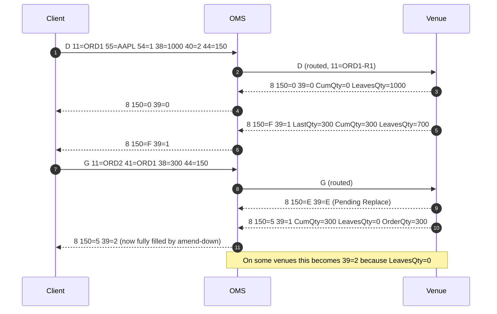
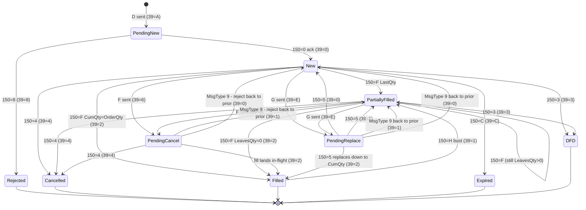

# 03 — FIX Protocol Focused Q&A

> 50 highest-frequency FIX questions.

---

## FIX Protocol — Core Message Types, ExecType, OrdStatus, Session Logon

### Q1. Walk me through the five FIX message types you deal with every day — MsgType D, F, G, 8, and 9 — and what each one means for the OMS.
**Interviewer signal:** Can the candidate recite the core order lifecycle vocabulary without hesitation?
**Answer:**
These five are the backbone of any equities/derivatives order flow I support:

- **D — NewOrderSingle:** Client (or upstream desk) sends a new order. Carries `11=ClOrdID`, `55=Symbol`, `54=Side`, `38=OrderQty`, `40=OrdType`, `44=Price` (if limit), `59=TimeInForce`, `60=TransactTime`. Our OMS validates, enriches, and routes.
- **F — OrderCancelRequest:** Pure cancel. Must reference the order via `41=OrigClOrdID` plus a new `11=ClOrdID`. No qty/price change allowed — that's what G is for.
- **G — OrderCancelReplaceRequest:** Amend. Same `41=OrigClOrdID` chaining, but carries the new `38`/`44`/`59`. In our OMS, a G with only a qty-down is treated as a partial cancel internally, but downstream still sees a G.
- **8 — ExecutionReport:** The workhorse response. Every ack, reject, replace-ack, cancel-ack, fill, partial fill, DFD, and expire comes back as an 8. The `150=ExecType` tells you *what event* and `39=OrdStatus` tells you the *current state*.
- **9 — OrderCancelReject:** Sent only when an F or G cannot be honored — e.g., unknown order, already filled, pending cancel. Carries `434=CxlRejResponseTo` (1=cancel, 2=replace) and `102=CxlRejReason`.

**Watch-outs:** Candidates often say "a fill is a message type" — no, a fill is `150=F` on an ExecutionReport (MsgType 8). Also, 9 is *only* for cancel/replace rejects; new-order rejects come back as 8 with `150=8`.

---

### Q2. What is the difference between MsgType 8 (ExecutionReport) and MsgType 9 (OrderCancelReject)? When would you see each?
**Interviewer signal:** Understanding of when rejection paths diverge.
**Answer:**
An **ExecutionReport (8)** is the universal state-change message for an order — every ack, fill, replace, cancel-ack, and even new-order-reject is delivered as an 8. If the order exists (or the exchange accepted the reject as an order-level event), you get an 8.

An **OrderCancelReject (9)** is much narrower: it is sent *only* when the OMS/exchange refuses to process an **F** or **G** — usually because the order is unknown, already terminal (filled/cancelled/expired), or has a pending state. Key tags: `434=CxlRejResponseTo` (1 = F, 2 = G), `102=CxlRejReason` (0=Too late, 1=Unknown order, 2=Broker credit, 3=Order already in pending status, 4=Unable to process request, 6=Duplicate ClOrdID, 99=Other), and `39=OrdStatus` which reflects the *current* status of the target order (often 8=Rejected or the prior live status).

In production I use this distinction constantly — if a trader complains "my cancel didn't work," the first thing I check is: did we get a 9 back? If yes, `102` tells us why. If no 9 and no 8 with `150=6` (Pending Cancel) or `150=4` (Cancelled), then it's a session/connectivity issue, not a business reject.

**Watch-outs:** Don't confuse a new-order reject (comes as **8** with `150=8`, `39=8`) with a cancel reject (**9**). Two totally different message types.

---

### Q3. List all the ExecType (tag 150) values you have seen in production and what each one signals.
**Interviewer signal:** Depth of FIX 4.2/4.4 knowledge and lifecycle fluency.
**Answer:**
The ones I see routinely in our OMS logs:

| 150 | ExecType | Meaning |
|-----|----------|---------|
| `0` | New | Order accepted, live on book |
| `1` | Partial fill (FIX 4.2) — deprecated in 4.4, replaced by `F` with cumqty logic |
| `2` | Fill (FIX 4.2) — same, replaced by `F` in 4.4 |
| `3` | Done for day | End-of-day, unfilled qty expires |
| `4` | Cancelled | Successful cancel (response to F) |
| `5` | Replaced | Successful amend (response to G) |
| `6` | Pending Cancel | Cancel received, awaiting venue confirmation |
| `7` | Stopped | Order stopped (guaranteed price, rare in equities) |
| `8` | Rejected | New-order reject; `58=Text` and `103=OrdRejReason` explain why |
| `9` | Suspended | Order held by OMS (compliance, credit) |
| `A` | Pending New | Sent to venue, no ack yet |
| `B` | Calculated | Post-trade calc event |
| `C` | Expired | GTD/GTC expiry |
| `D` | Restated | System-initiated state change (rare) |
| `E` | Pending Replace | Replace received, awaiting venue |
| `F` | Trade (FIX 4.4) | Any execution — partial or full. Distinguish via `39` and `14=CumQty` vs `38=OrderQty` |
| `H` | Trade Cancel | Bust — fill reversed |
| `I` | Order Status | Response to OrderStatusRequest (MsgType H) |

**Watch-outs:** In **FIX 4.4** the old `150=1` (partial fill) and `150=2` (fill) were **collapsed into `150=F`** — you tell partial vs full from `39` (1=partial fill, 2=filled) and by comparing `14=CumQty` against `38`. Getting this wrong is a classic screening-round mistake.

---

### Q4. Walk me through the OrdStatus (tag 39) values and how they compose with ExecType.
**Interviewer signal:** Does the candidate understand 150 is "what just happened" and 39 is "current state"?
**Answer:**
`150` is the *event*, `39` is the *state after the event*. They are related but not the same tag.

OrdStatus values:

| 39 | OrdStatus | Meaning |
|----|-----------|---------|
| `0` | New | Live, working, zero filled |
| `1` | Partially Filled | CumQty > 0, LeavesQty > 0 |
| `2` | Filled | CumQty == OrderQty, LeavesQty == 0 |
| `3` | Done for Day | Terminal, unfilled remainder expired today |
| `4` | Cancelled | Terminal |
| `5` | Replaced (FIX 4.2; removed in 4.4 — use `150=5` with prior 39) |
| `6` | Pending Cancel | Non-terminal — cancel in flight |
| `7` | Stopped |
| `8` | Rejected | Terminal — order never made it live |
| `9` | Suspended | Held |
| `A` | Pending New |
| `B` | Calculated |
| `C` | Expired |
| `E` | Pending Replace |

Typical compositions I check in logs:

```
150=0  39=0   -> Ack on the book
150=F  39=1   -> Partial fill (CumQty < OrderQty)
150=F  39=2   -> Final fill
150=6  39=6   -> Pending cancel (waiting on venue)
150=4  39=4   -> Cancel confirmed
150=5  39=0   -> Replace ack, back on book with new terms
150=8  39=8   -> New-order reject
150=H  39=1   -> Bust — fill reversed, order now back to partial
```

**Watch-outs:** A common trap: after `150=F` with `39=2`, some venues also send a terminal `150=3` (DFD) — that is wrong per spec but happens. And after a bust (`150=H`), `39` **moves backwards** — the only legitimate case where state regresses.

---

### Q5. What tags are mandatory in a NewOrderSingle (D)?
**Interviewer signal:** Baseline required-field knowledge.
**Answer:**
Beyond the standard header (`8=BeginString`, `9=BodyLength`, `35=D`, `49=SenderCompID`, `56=TargetCompID`, `34=MsgSeqNum`, `52=SendingTime`) and trailer (`10=CheckSum`), the required D body tags per FIX 4.4:

- `11=ClOrdID` — unique per session, per day (some venues require unique across day globally)
- `55=Symbol` (or a security-block: `48=SecurityID` + `22=SecurityIDSource`)
- `54=Side` (1=Buy, 2=Sell, 5=SellShort, 6=SellShortExempt)
- `60=TransactTime`
- `40=OrdType` (1=Market, 2=Limit, 3=Stop, 4=StopLimit, P=Pegged)
- `38=OrderQty` (or `152=CashOrderQty` / `516=OrderPercent` in some contexts)
- `44=Price` — conditionally required when `40=2` or `4`
- `59=TimeInForce` — conditionally required; if absent, venue default (usually 0=Day) applies
- `21=HandlInst` (1=Auto private, 2=Auto public, 3=Manual) — required in 4.2, made optional in 4.4 but most brokers still enforce

**Watch-outs:** Don't forget `60=TransactTime` — a surprising number of rejects I see are missing or malformed `60` (must be UTC, `YYYYMMDD-HH:MM:SS.sss`). Also `11` must be **unique per session per day** — reusing a ClOrdID gets a `102=6` (Duplicate) on the reject.

---

### Q6. Tag 39 says `6` (Pending Cancel). A trader asks: "Is my order cancelled or not?" What do you tell them?
**Interviewer signal:** Do they understand pending states are non-terminal and what to do next?
**Answer:**
Not cancelled — pending. The OMS has forwarded the cancel to the venue and is waiting for confirmation. Order is still **live and could still fill** during this window. Two possible outcomes:

1. **Success:** Venue sends back `150=4, 39=4` — order is now terminally cancelled.
2. **Failure:** Venue sends back a **9 (OrderCancelReject)** with `102=CxlRejReason` — most commonly `0=Too late to cancel` (order filled or DFD'd) or `1=Unknown order`.

Standard operating procedure I follow:
1. Note the time we entered pending cancel.
2. Watch for the terminal event — typical latency is sub-second to a few seconds; anything > 30s in pending is abnormal.
3. If we time out, I check the venue session (is the FIX line down? is the venue in a halt?).
4. Never send another F while `39=6` — you'll get `102=3` (Order already in pending status).

**Watch-outs:** Traders will sometimes see "pending cancel" and click cancel *again*. Duplicate cancel is a hard reject and clutters logs. Also, a fill can still land while `39=6` — the trader must accept that fill.

---

### Q7. Walk me through the FIX session logon (MsgType A) — what fields are exchanged and why.
**Interviewer signal:** Session-level protocol knowledge, not just application layer.
**Answer:**
The **Logon (MsgType A)** is the first application message on a fresh TCP connection. Both sides send an A. Key fields:

| Tag | Name | Purpose |
|-----|------|---------|
| `8` | BeginString | `FIX.4.2` / `FIX.4.4` / `FIXT.1.1` (for FIX 5.0) |
| `35` | MsgType | `A` |
| `49` | SenderCompID | Our identity |
| `56` | TargetCompID | Counterparty identity |
| `34` | MsgSeqNum | Starts at 1 (or continues from prior day if not resetting) |
| `52` | SendingTime | UTC timestamp |
| `98` | EncryptMethod | Almost always `0` (None — TLS is handled at the transport layer) |
| `108` | HeartBtInt | Heartbeat interval in seconds — typical 30 |
| `141` | ResetSeqNumFlag | `Y` to reset sequence numbers to 1, `N` to continue |
| `553` | Username | Optional — some brokers require |
| `554` | Password | Optional |
| `789` | NextExpectedMsgSeqNum | FIX 4.4+ — tells counterparty what seq num you expect next (helps resync) |
| `1137` | DefaultApplVerID | FIXT/5.0 only |

The exchange is symmetric — we send our logon, they send theirs. Once both are ack'd, the session is **established** and either side can send application messages.

**Watch-outs:** Setting `141=Y` in production without coordination is a career-limiting move — you'll skip any queued messages the counterparty has for you. Do it only on scheduled resets (typically start-of-week or after a day rollover) and always confirm with the counterparty first.

---

### Q8. What is `108=HeartBtInt` for, and what happens if a heartbeat is missed?
**Interviewer signal:** Session keepalive mechanics.
**Answer:**
`108=HeartBtInt` is the interval, in seconds, at which each side must send a **Heartbeat (MsgType 0)** if no other message has been sent. It's negotiated in the Logon — both sides must agree, and by convention the initiator's value wins (or both must match, depending on broker).

Sequence of events when a session goes quiet:
1. At `HeartBtInt` seconds of silence → send `0=Heartbeat`.
2. If the counterparty doesn't send anything for `HeartBtInt + reasonable delta` (usually `HeartBtInt * 1.2` or +5s), send a **TestRequest (MsgType 1)** with a `112=TestReqID`.
3. Counterparty must reply with `0=Heartbeat` echoing `112=TestReqID`.
4. If still silent after another `HeartBtInt` → **disconnect the socket**. The session is dead.

In prod I've seen this misconfigured — one side at 30s, other at 60s — which leads to spurious disconnects. Always confirm both endpoints agree.

**Watch-outs:** Heartbeat is *application-level*, not TCP-level. A TCP connection can look healthy (kernel-level keepalives passing) while the FIX session is dead because heartbeats stopped. Always check FIX engine logs, not just `netstat`.

---

### Q9. What is a Resend Request (MsgType 2) and when does it fire?
**Interviewer signal:** Recovery mechanics — key for support role.
**Answer:**
A **Resend Request (MsgType 2)** is sent when the counterparty detects a **sequence number gap** — i.e., they received `34=105` but were expecting `34=103`. Fields:

- `7=BeginSeqNo` — first missing seq num (103 in the example)
- `16=EndSeqNo` — last requested; `0` means "up to the current"

The counterparty responds by **replaying** messages `7` through `16` in order. Two important rules:

1. **Admin messages** (Logon, Logout, Heartbeat, TestRequest, ResendRequest, Reject, SequenceReset) are typically replaced by a **SequenceReset-GapFill (MsgType 4 with `123=Y`)** rather than being replayed — those are session-level and don't have business meaning to replay.
2. **Application messages** (D, F, G, 8, 9, etc.) must be replayed with `43=PossDupFlag=Y` set so the receiver knows this is a resend and can de-dupe by ClOrdID.

Common production trigger: FIX line flap during the day — when it reconnects, both sides compare `34=NextExpectedMsgSeqNum` and either side may fire a Resend Request to catch up.

**Watch-outs:** A rogue Resend Request for `7=1, 16=0` at market open is dangerous — the counterparty may try to replay the entire day. Some FIX engines cap this. If you see one, escalate; something is very wrong with the initiator's sequence store.

---

### Q10. Explain sequence numbers (tag 34) — why do they matter?
**Interviewer signal:** Reliability and message ordering.
**Answer:**
`34=MsgSeqNum` is the **monotonically increasing counter** that guarantees FIX's at-least-once, in-order delivery semantics. Each side maintains two counters per session:

- **Outbound seq num** — starts at 1, increments on every message we send.
- **Inbound seq num** — the seq num we expect *next* from the counterparty.

On receive:
- If `34` == expected → process, increment expected.
- If `34` > expected → **gap detected** → send Resend Request (MsgType 2).
- If `34` < expected → **fatal** → send Logout with reason "MsgSeqNum too low" and disconnect. Manual reset required.

Sequence numbers **persist across disconnects** unless `141=Y` (ResetSeqNumFlag) is negotiated at logon. That persistence is what allows a broken TCP connection to reconnect and resume without message loss.

In our OMS we store sequence numbers on disk (some engines use a filesystem-backed store, others a DB). If that store gets corrupted, we're in for a bad day — usually needs coordinated reset with the counterparty.

**Watch-outs:** "Just reset seq nums" is a support anti-pattern. You lose the audit trail and potentially skip real messages. Only reset in coordination with the counterparty, and log the decision.

---

### Q11. What is the difference between MsgType F (Cancel) and MsgType G (Cancel/Replace)?
**Interviewer signal:** Amendment semantics.
**Answer:**
- **F (OrderCancelRequest)** — pure cancel. Removes the working balance (LeavesQty) from the book. Cannot change qty, price, or any economic term. Body: `41=OrigClOrdID`, `11=ClOrdID` (new), `55`, `54`, `38` (original qty), `60`.
- **G (OrderCancelReplaceRequest)** — atomic cancel-and-replace ("amend"). Same chaining tags but carries the *new* economic terms: new `38`, new `44`, new `59`, sometimes new `126=ExpireTime`. Preserves the order's priority *conditionally* — some venues re-queue on price change but keep priority on qty-down.

Interesting FIX-level behaviors I've hit:

- **Qty-down via G:** Reducing quantity via G typically **preserves priority** on most venues. Cancelling and re-entering with F+D does not.
- **Qty-up via G:** Almost always **loses priority** — treated as a new arrival at the new size.
- **Price change via G:** Always loses price/time priority.
- **In-flight amends:** If a G is in `39=E` (Pending Replace) and a fill lands, the fill applies against the *original* qty until the replace confirms.

**Watch-outs:** Don't send G to "cancel" — some venues will accept `38=0` on a G, but most reject it. Use F.

---

### Q12. Trader says: "I sent a cancel and got a 9 with 102=0. What does that mean?"
**Interviewer signal:** Reading a reject in real time.
**Answer:**
`102=0` is **"Too late to cancel"** — the cancel arrived after the order was already terminal. Three usual causes:

1. **Fully filled** — order completed before the F reached the venue. Check for `150=F, 39=2` on the parent ClOrdID just before the reject timestamp.
2. **DFD (Done for Day)** — for GTD/Day orders, if the venue rolled it off at close.
3. **Cancelled by venue** — self-trade prevention, halt, market data outage, etc.

My triage:
```
1. Find OrigClOrdID in the reject (41).
2. Search log for that ClOrdID.
3. Look at the sequence of 150 values — what was the last event before the F?
4. If 150=F 39=2: fully filled, trader is out of luck.
5. If 150=3: DFD.
6. If 150=4 with source=venue-initiated: escalate to venue ops.
```

**Watch-outs:** `102=0` is the most common cancel reject in fast markets. It's not a bug — it's the reality of a race between the cancel and fills. Traders who send cancels late in the day, or during opens/closes, will see this frequently.

---

### Q13. Explain PossDupFlag (43) and PossResend (97).
**Interviewer signal:** Duplicate handling for idempotency.
**Answer:**
Both signal "this might be a repeat" but for different reasons:

- **`43=PossDupFlag=Y`** — Set by the **FIX engine** on messages sent as part of a Resend Request response. Semantics: "I am replaying this at the session layer because you asked me to. If you already processed the original by `11=ClOrdID`, drop it." Same `34` as the original.
- **`97=PossResend=Y`** — Set by the **application** when it consciously re-sends business-level content (e.g., after an application crash) with a **new** `34`. Semantics: "I don't know if you got the original. Please de-dupe on business keys — ClOrdID for orders, ExecID for fills."

De-duplication strategy in our OMS:
- On `43=Y`: check if `11=ClOrdID` is already known. If yes, ignore silently.
- On `97=Y`: same, but also log — because a `97` implies something went wrong upstream.

**Watch-outs:** Never set both `43=Y` and `97=Y` on the same message. Some counterparty engines interpret that as malformed and reject. Also: `43=Y` alone with a duplicate ClOrdID that was **originally rejected** — you must still process the resend and reject it again with the same reason, not silently drop.

---

### Q14. What tags identify a fill on ExecutionReport, and how do you calculate LeavesQty?
**Interviewer signal:** Fill accounting basics.
**Answer:**
On a fill (`150=F` in 4.4 / `150=1|2` in 4.2), the key tags are:

- `31=LastPx` — price of this individual fill
- `32=LastQty` — qty of this individual fill (a.k.a. LastShares in older versions)
- `14=CumQty` — running total filled so far on this order
- `151=LeavesQty` — remaining qty still working
- `6=AvgPx` — running average fill price
- `17=ExecID` — unique identifier for this execution (used for bust reference)
- `39=OrdStatus` — 1 (partial) or 2 (filled)

Invariants that must always hold:
```
LeavesQty = OrderQty - CumQty     (for a non-replaced order)
CumQty(n) = CumQty(n-1) + LastQty
AvgPx = sum(LastPx_i * LastQty_i) / CumQty
```

For **cancelled** orders: `LeavesQty=0` and `39=4`, even if `CumQty < OrderQty` (partial-fill-then-cancel).

**Watch-outs:** After a **replace** that changes qty, `OrderQty` on subsequent 8s reflects the *new* qty, so `LeavesQty = NewQty - CumQty`. This is a common source of confusion when reconciling — the OrderQty you see on the fill is not the original.

---

### Q15. What is a Business Message Reject (MsgType j) vs a session-level Reject (MsgType 3)?
**Interviewer signal:** Layer separation — session vs application.
**Answer:**
- **Session Reject (MsgType 3)** — Sent by the FIX engine itself when the *message* is malformed at the protocol level. Examples: unknown tag, tag value out of range for its type, missing conditionally required tag, wrong data format. `45=RefSeqNum`, `371=RefTagID`, `372=RefMsgType`, `373=SessionRejectReason` (0=Invalid tag, 1=Required missing, 5=Value incorrect, etc.), `58=Text`. Message is **not passed to the application**.
- **Business Message Reject (MsgType j)** — Sent by the **application** when the message parsed fine but violates business rules that don't have a message-specific reject (i.e., not an order — for orders you get an 8 with `150=8`). Used for unsupported message types, ApplicationVersionID mismatches, etc. Tags: `45=RefSeqNum`, `372=RefMsgType`, `379=BusinessRejectRefID`, `380=BusinessRejectReason`.

In my day-to-day, session-level 3s point at **FIX engine config or malformed content from upstream** — usually a code bug. Business rejects on **8** for orders point at **business validation** — trader entitlement, limit breach, symbol not supported, etc.

**Watch-outs:** Session Reject (3) is sometimes confused with OrderCancelReject (9) because both are "rejects." They are on different layers — 3 is protocol, 9 is business (cancel-specific).

---

### Q16. Walk me through the exact FIX message flow for a limit order that partially fills, then gets amended down to the filled qty, then cancelled.
**Interviewer signal:** Multi-step lifecycle reasoning.
**Answer:**
Let's say original order: 1000 shares AAPL @ 150 limit. Fills 300, trader wants to amend to 300 (effectively "cancel the rest").



Wait — if the amend brings OrderQty (300) down to equal CumQty (300), the order becomes **fully filled**, `39=2`, terminal. **No cancel needed.** The G itself terminated the order.

If instead the trader amended to 500 and *then* cancelled:
```
G 38=500 -> 150=5 39=1 LeavesQty=200
F -> 150=6 39=6 (pending)
   -> 150=4 39=4 LeavesQty=0 CumQty=300
```

**Watch-outs:** The "amend down to CumQty" trick is a legit way to close out a working order without a separate cancel. Not all venues handle it identically — some send `150=5, 39=2`, others send `150=5, 39=1` immediately followed by `150=3` (DFD). Know your venues.

---

### Q17. What is FIXT.1.1 and how does it relate to FIX 5.0?
**Interviewer signal:** Awareness of protocol evolution.
**Answer:**
Starting with FIX 5.0, the FIX committee **separated the session layer from the application layer**:

- **FIXT.1.1** — the **transport/session** protocol (Logon, Heartbeat, sequence numbers, resend). Sits below.
- **FIX 5.0 / 5.0SP1 / 5.0SP2** — the **application** message dictionary (D, F, G, 8, etc.). Sits above.

In a FIXT session, `8=FIXT.1.1` in the header. Application version is negotiated via `1137=DefaultApplVerID` in Logon (`9=FIX50SP2`, for example). Individual messages can also override via `1128=ApplVerID`.

Why the split? Before 5.0, upgrading the app dictionary meant upgrading the session — impractical for firms. FIXT decouples them so you can run FIX 5.0SP2 messages over the same session infrastructure as 4.x once you've moved to FIXT.

**Reality on the ground:** Most sell-side and buy-side connectivity is still **FIX 4.2 or 4.4**. FIX 5.0 adoption is patchy — mostly seen in newer venues, post-trade, and some fixed-income flows. In my role I mostly deal with 4.2 and 4.4.

**Watch-outs:** Don't say "FIX 5.0 replaced FIX 4.4" — the industry did not migrate wholesale. 4.4 is still the workhorse.

---

### Q18. Explain the ClOrdID chain across cancel/replace — how do you trace an order that has been amended three times?
**Interviewer signal:** Order-level identity tracking.
**Answer:**
Each F or G carries **two** ClOrdIDs:

- `11=ClOrdID` — new, unique for this request
- `41=OrigClOrdID` — the ClOrdID of the *most recent successfully acked* version of the order

So a chain looks like:

```
D:  11=ORD1                         (new order)
G:  11=ORD2  41=ORD1  38=800        (amend #1: 1000 -> 800)
G:  11=ORD3  41=ORD2  38=800 44=151 (amend #2: reprice)
G:  11=ORD4  41=ORD3  38=500 44=151 (amend #3: 800 -> 500)
F:  11=ORD5  41=ORD4                (cancel)
```

`41` always points to the last **acknowledged** ClOrdID, not the original. The venue tracks this chain internally.

To reconstruct in logs, I have two options:
1. **Walk the chain forward** from D by matching `41` on each subsequent request.
2. **Use OrderID (tag 37)** — the *venue-assigned* identifier, which is stable across the entire chain. This is the cleanest way to correlate.

**Watch-outs:** If a G is **rejected** (via 9), you do **not** advance the "last acked" pointer. The next amend must point `41` at the previously-acked ClOrdID, not the rejected one. I've seen production incidents where an OMS incorrectly advanced the pointer on reject and then every subsequent amend was chained wrong, causing cascading unknown-order rejects.

---

### Q19. What's the difference between OrderID (tag 37) and ClOrdID (tag 11)?
**Interviewer signal:** Identifier semantics.
**Answer:**
- **`11=ClOrdID`** — **Client-assigned**. Unique per session per day. The client picks it. Changes on every F, G, and D (each is a new client request).
- **`37=OrderID`** — **Venue-assigned**. Set by the exchange/broker on the first ack (or first fill on some venues). Stable across the entire order lifecycle — same value on the ack, all fills, all replaces, and the terminal event.
- **`41=OrigClOrdID`** — points to the previous ClOrdID in a cancel/replace chain.
- **`198=SecondaryOrderID`** — optional secondary venue ID, used in nested venue routing (e.g., broker's ID vs exchange's ID).

**How I use them in ops:**
- To find *my* order in *my* logs → grep for ClOrdID (I control it, it's short, memorable).
- To find the venue's view of an order → use OrderID (the venue's stable handle).
- To reconcile positions/fills across days → OrderID because ClOrdID may repeat cross-day.

**Watch-outs:** Don't assume `37` is always populated on the first ack — some venues populate it only on the first fill. In that case, if the order is rejected before any fill, you may only have ClOrdID to work with.

---

### Q20. What is a `150=D` (Restated) ExecutionReport?
**Interviewer signal:** Awareness of less-common ExecTypes.
**Answer:**
`150=D` (Restated) is sent when the venue or OMS makes a **system-initiated change** to the order that isn't a fill, cancel, or replace — a "corrective" or "informational" update. `378=ExecRestatementReason` tells you what:

| 378 | Reason |
|-----|--------|
| `0` | GT corporate action (adjustment for split/dividend) |
| `1` | GT renewal (rolling GTD to next day) |
| `2` | Verbal change |
| `3` | Repricing of order (e.g., re-peg) |
| `4` | Broker option |
| `5` | Partial decline of OrderQty (credit limits) |
| `6` | Cancel on Trading Halt |
| `7` | Cancel on system failure |
| `8` | Market option |
| `9` | Canceled, not best (routing choice) |

Where I see it in production: **pegged orders repricing** intraday (`378=3`) and **GTC orders rolling to next day** (`378=1`). The order state doesn't change — `39` stays at `0` or `1` — but the client is notified that *something happened*.

**Watch-outs:** Some downstream systems mis-handle `150=D` because it's uncommon. If you're integrating a new client, always test the corporate-action-on-open GTC case — that's when `150=D 378=0` fires and adjustments to price/qty flow through.

---

### Q21. What is `150=H` (Trade Cancel / Bust)? How does the OMS handle it?
**Interviewer signal:** Post-trade correction handling.
**Answer:**
`150=H` is a **bust** — the venue is reversing a previously-reported fill. Usually from an exchange bust ruling ("erroneous trade") or a self-match cancellation. Key tags:

- `19=ExecRefID` — references the `17=ExecID` of the fill being busted.
- `20=ExecTransType=1` (Cancel) — in FIX 4.2. Removed in 4.4; `150=H` alone conveys it.
- The message will show the fill being **subtracted** — `32=LastQty` is the amount being backed out, and `14=CumQty` reflects the *new post-bust* cumulative total.

**OMS handling:**
1. Look up the original fill by `ExecRefID` → `ExecID`.
2. Subtract `LastQty` and `LastQty*LastPx` from position and PnL.
3. If the bust brings CumQty back below OrderQty, the order **may return to `39=1` or `39=0`** — the LeavesQty is now larger. On some venues, the busted qty goes into `LeavesQty`; on others, the order stays terminal and can't be re-worked.
4. Notify downstream (risk, position keeping, allocations) — this is a real economic event.

**Watch-outs:** Busts on **already-cleared / allocated** trades are ops-heavy — you have to reverse the allocation, notify the client, potentially re-book. Always page the trader and the middle office when a bust hits. And never let a bust flow silently to position keeping — the PnL swing is real.

---

### Q22. A FIX session won't come up — logon is being rejected. Walk me through your triage.
**Interviewer signal:** Real-world support instincts.
**Answer:**
Standard triage playbook:

1. **Look at the disconnect reason.** The counterparty usually sends a `5=Logout` with `58=Text` before dropping. Read it. Common texts: "Invalid CompID", "MsgSeqNum too low, expected X but got Y", "Password expired", "Session not active" (i.e., outside connect window).

2. **Compare CompIDs.** `49=SenderCompID` and `56=TargetCompID` must match what the counterparty provisioned. Case-sensitive. Whitespace-sensitive. I've spent an embarrassing hour on this before.

3. **Check sequence numbers.** If our engine says outbound next = 105, and their engine expects inbound next = 200, we're 95 messages behind. Options: (a) coordinate a `141=Y` reset, (b) coordinate they replay 105-199 to us. Never just reset silently.

4. **Check credentials.** `553=Username` and `554=Password` in Logon (if used). Passwords sometimes rotate — check the ticket for the current one.

5. **Check the schedule.** Many sessions have a **connect window** (e.g., Mon-Fri 06:00-22:00 UTC). Outside that, the counterparty won't accept the socket. Check their session config.

6. **Check network.** Actual TCP reach — telnet/nc to their IP/port. Some brokers whitelist by source IP; if our egress IP changed (VPC migration, VPN change), we're blocked.

7. **Check TLS.** If the socket is TLS-wrapped, cert expiry is a real thing. `openssl s_client -connect ip:port` and check `notAfter`.

8. **Check version.** `8=FIX.4.2` vs `8=FIX.4.4` mismatch → immediate reject.

9. **Escalate to counterparty** with our timestamps, our seq nums, the exact reject text. Don't guess.

**Watch-outs:** Never restart the FIX engine as first response. That's a "nuclear option" that loses state. Always diagnose first.

---

### Q23. Explain `59=TimeInForce` values.
**Interviewer signal:** Order attribute knowledge.
**Answer:**

| 59 | TIF | Behavior |
|----|-----|----------|
| `0` | Day | Expires at close of trading day (venue-local close) |
| `1` | GTC (Good Till Cancel) | Rests indefinitely until cancelled or filled |
| `2` | OPG (At the Opening) | Fills at opening auction only; unfilled → cancelled |
| `3` | IOC (Immediate or Cancel) | Fills immediately what it can, cancels the rest |
| `4` | FOK (Fill or Kill) | Fills entirely immediately or cancels (all-or-nothing IOC) |
| `5` | GTX (Good Till Cross) | Fills at next auction crossing |
| `6` | GTD (Good Till Date) | Requires `432=ExpireDate` or `126=ExpireTime` |
| `7` | AT_CLOSE (At the Close) | Closing auction only |

**Practical notes:**
- **IOC vs FOK:** IOC fills the immediately available liquidity (partial OK), FOK is all-or-nothing.
- **GTC support:** Not all venues support GTC — many equity venues cap at GTD 30 days.
- **Day** in a global OMS: watch for **venue vs client** timezone. A "Day" order sent to a Tokyo venue at 10pm NY time is going into the *next* Tokyo session.

**Watch-outs:** `59=1` (GTC) requires the OMS to persist the order across days and re-submit or re-register with the venue at each open. That's a big ops surface — GTC-on-book state at start-of-day is a common source of mismatches between OMS and venue.

---

### Q24. What is `21=HandlInst` and why does it still matter?
**Interviewer signal:** Handling instructions — DMA vs care.
**Answer:**
`21=HandlInst` tells the receiver how much human intervention the order wants:

| 21 | Meaning |
|----|---------|
| `1` | Automated execution, private (no broker intervention) — pure DMA |
| `2` | Automated execution, public (order may be shown/worked) |
| `3` | Manual order, best execution ("care order" — trader handles it) |

**Why it still matters** (even though FIX 4.4 made it optional):
- Most sell-sides use it to route: `21=1` → DMA gateway, direct to venue; `21=3` → sales trading desk, trader works it.
- **Regulatory:** MiFID II and SEC Rule 606 require best-ex handling that depends on this classification.
- **Billing:** Different rate cards for DMA vs care.

Even in modern flows, we still see `21` populated. Some brokers reject D messages missing it, some default to `21=1`.

**Watch-outs:** In FIX 4.4 the spec says `21` is *not required*, but in practice most brokers require it or default. Never omit it unless you've confirmed with the counterparty. Also, `21=3` (care) plus a fully automated algo destination is a common misconfig — you get orders sitting on the sales desk that were meant to auto-route.

---

### Q25. Draw the state diagram for an order's OrdStatus (39) transitions.
**Interviewer signal:** Systems thinking — can they visualize the state machine?
**Answer:**



**Key invariants:**
- Only `150=H` (bust) can move state *backwards*.
- Pending states (`6`, `E`, `A`) are transitional — cannot be terminal.
- Terminal states are `2` (Filled), `4` (Cancelled), `8` (Rejected), `C` (Expired), `3` (DFD).

**Watch-outs:** A common bug in downstream systems is treating `Filled` as absolutely terminal. Then a bust arrives and the system has no path back — you get orphan positions. Always model the bust path.

---
## 26. Gap Fill Mechanics

### Q26. What is the difference between GapFillFlag Y and sequence reset?
**Interviewer signal:** Testing sequence number recovery mechanics

**Answer:** GapFillFlag (tag 123=Y) indicates a SequenceReset-GapFill message (MsgType=4) that administratively fills a gap without requiring message replay. Used when original messages are administrative (heartbeats, test requests) or not recoverable. The NewSeqNo (tag 36) indicates the next expected sequence number. Unlike a hard reset (SequenceReset with GapFillFlag=N or absent), gap fill preserves audit trail continuity and doesn't break the sequence number chain.

**Watch-outs:**
- Gap fill must only cover non-recoverable or administrative messages
- NewSeqNo must be greater than MsgSeqNum
- Receiving side must validate the gap fill range is legitimate
- Never gap fill business messages (orders, executions, cancels)

---

## 27. PossDupFlag vs PossResend Semantics

### Q27. What is the semantic difference between PossDupFlag (43) and PossResend (97)?
**Interviewer signal:** Probing replay vs retransmission understanding

**Answer:** PossDupFlag (43=Y) indicates a message is a possible duplicate due to resend request or recovery. It MUST be set when resending any message with OrigSendingTime (tag 122) populated. PossResend (97=Y) is more specific—it indicates the message is being resent due to a communications failure, typically during the same session. PossDupFlag is broader (covers session recovery, gap fills, manual replay), while PossResend is narrower (network-level retransmission). Both require identical content to the original message.

**Watch-outs:**
- Set PossDupFlag whenever OrigSendingTime is present
- PossResend typically used in same-session retransmits
- Downstream systems must dedupe using ClOrdID, ExecID, etc.
- Missing PossDupFlag on resend is a conformance violation

---

## 28. ClOrdID vs OrigClOrdID vs OrderID Chain

### Q28. Explain the relationship between ClOrdID (11), OrigClOrdID (41), and OrderID (37).
**Interviewer signal:** Testing order lifecycle tracking knowledge

**Answer:** ClOrdID (11) is the client-assigned unique identifier for each order request—new order, cancel, replace. OrigClOrdID (41) references the ClOrdID of the order being canceled or replaced, creating a chain: NewOrder (ClOrdID=A) → CancelReplace (ClOrdID=B, OrigClOrdID=A) → Cancel (ClOrdID=C, OrigClOrdID=B). OrderID (37) is the exchange/broker-assigned identifier that remains constant across the order's lifecycle (unless OrderID changes on replace). The chain is: Client uses ClOrdID/OrigClOrdID for commands; exchange returns OrderID for state.

**Watch-outs:**
- OrigClOrdID must match the previous accepted ClOrdID
- Some venues change OrderID on replace (chain breaks)
- ClOrdID must be unique across session for the trading day
- Missing OrigClOrdID on cancel/replace causes rejections

---

## 29. Drop Copy PossDup Replay Behavior

### Q29. How should a drop copy session handle PossDupFlag messages during replay?
**Interviewer signal:** Testing drop copy session recovery understanding

**Answer:** Drop copy sessions are receive-only; the drop copy server doesn't expect ResendRequests. However, if the drop copy server replays messages (e.g., client reconnects after disconnect), it should set PossDupFlag=Y and OrigSendingTime (tag 122) to the original send time. The drop copy client must dedupe using ExecID (tag 17) or other business identifiers. Some implementations use a snapshot + incremental model instead of replay. Key principle: drop copy clients must be idempotent—processing the same ExecID twice must be safe.

**Watch-outs:**
- Drop copy clients don't send ResendRequests (server-driven replay)
- ExecID-based deduplication is critical
- Some venues send SequenceReset-GapFill instead of replay
- Client must handle out-of-order drop copy messages gracefully

---

## 30. Session Reject vs BusinessMessageReject vs OrderCancelReject

### Q30. When do you use Session Reject (3) vs BusinessMessageReject (j) vs OrderCancelReject (9)?
**Interviewer signal:** Testing FIX error handling taxonomy

**Answer:**
- **Session Reject (MsgType=3):** Protocol-level errors—invalid tag, missing required field, incorrect checksum, tag not defined for this message type. Does not increment target's expected sequence number for the rejected message.
- **BusinessMessageReject (MsgType=j):** Application-level rejection but not order-specific—unsupported message type, conditionally required field missing, business rule violation not tied to order state. Increments sequence number.
- **OrderCancelReject (MsgType=9):** Order-specific rejections—unknown order, order already filled, duplicate ClOrdID, broker option (e.g., too late to cancel). Increments sequence number.

**Watch-outs:**
- Session Reject is session-layer; others are application-layer
- Session Reject uses RefTagID (371) to identify problematic tag
- BusinessMessageReject uses RefMsgType (372) and RefSeqNum (45)
- OrderCancelReject uses CxlRejResponseTo (434) to indicate whether rejecting cancel or replace

---

## 31. Tag Ordering Rules

### Q31. Are there tag ordering rules in FIX? What happens if tags are out of order?
**Interviewer signal:** Testing conformance and parsing knowledge

**Answer:** FIX requires header tags (8, 9, 35) to be in exact order: BeginString, BodyLength, MsgType. Trailer tag 10 (CheckSum) must be last. Body tags have no mandated order (though recommended order exists in spec). However, repeating groups must have NoXyz (count tag) before group entries, and group entries must contain tags in declared order. Parsers must handle tags in any order (except header/trailer) but strict implementations may reject out-of-order groups. Tag ordering affects checksum calculation order (tags are summed in appearance order).

**Watch-outs:**
- Header: 8, 9, 35 must be first three tags in that order
- Trailer: 10 must be last
- Repeating groups: count tag, then group delimiter, then group members
- Some venues enforce stricter ordering for performance
- Checksum is order-dependent (sum bytes in message order)

---

## 32. Checksum Computation

### Q32. How is the FIX checksum (tag 10) computed?
**Interviewer signal:** Testing low-level protocol knowledge

**Answer:** The checksum is computed as the sum of all byte values (ASCII codes) in the message from the start of tag 8 (BeginString) up to but NOT including the checksum field (tag 10). The sum is taken modulo 256, then formatted as a zero-padded 3-digit string (e.g., "056"). Formula: `checksum = (sum(bytes) % 256)` formatted as `%03d`. The checksum is the last field (tag 10=###\x01). Purpose: detects transmission errors, corrupted messages, incorrect BodyLength.

**Watch-outs:**
- Include SOH delimiter (\x01) bytes in sum
- Exclude tag 10 and its value from sum
- Must be 3-digit zero-padded (e.g., "010", not "10")
- Modulo 256, not 255
- Checksum mismatch → Session Reject (tag 373=1)

---

## 33. SendingTime Lag Rejects

### Q33. How do FIX engines handle SendingTime (tag 52) lag, and why reject on it?
**Interviewer signal:** Testing latency/clock skew handling

**Answer:** FIX engines compare incoming message SendingTime (tag 52) against local clock. If skew exceeds a threshold (e.g., 2 minutes), the message is rejected via Session Reject or BusinessMessageReject (SessionRejectReason=10, "SendingTime accuracy problem"). Purpose: detect clock skew, stale messages, replay attacks. Some venues allow configurable tolerance (e.g., 120 seconds). Messages with SendingTime far in the future are also suspicious. This prevents order submission with timestamps hours/days off, which breaks audit trails and regulatory reporting.

**Watch-outs:**
- Synchronize clocks via NTP/PTP
- Typical tolerance: 2–5 minutes
- SendingTime too old or too far in future both trigger rejects
- Reject reason: SessionRejectReason=10
- Persistent skew indicates infrastructure issue

---

## 34. Common Conformance Test Gotchas

### Q34. What are common gotchas in FIX conformance testing?
**Interviewer signal:** Testing real-world certification experience

**Answer:**
1. **Missing PossDupFlag on resend:** Conformance tests check PossDupFlag=Y and OrigSendingTime on replayed messages
2. **Incorrect gap fill range:** Gap filling business messages or NewSeqNo calculation errors
3. **Session Reject loop:** Rejecting a reject creates infinite loop; must handle reject of reject gracefully
4. **Heartbeat timing:** Sending heartbeats too early or too late (must be at HeartBtInt, not before)
5. **ResendRequest handling:** Not preserving original SendingTime, modifying business fields
6. **Sequence number gaps:** Not detecting gaps promptly or sending ResendRequest with wrong range
7. **Tag 8/9/10 manual editing:** Editing these breaks checksum/length, instant failure

**Watch-outs:**
- Use conformance test harness (e.g., FIX Antenna, QuickFIX validator)
- Test all reject scenarios
- Verify sequence number state machine rigorously
- Clock synchronization before testing

---

## 35. ResendRequest with BeginSeqNo/EndSeqNo=0

### Q35. What is the semantic meaning of ResendRequest (MsgType=2) with BeginSeqNo=1 and EndSeqNo=0?
**Interviewer signal:** Testing sequence recovery edge cases

**Answer:** EndSeqNo=0 in a ResendRequest means "resend from BeginSeqNo to infinity" (i.e., all messages from BeginSeqNo through the last sent message). This is used when a client has lost all state and needs a full replay from a checkpoint. The server responds with all recoverable messages starting at BeginSeqNo, potentially gap-filling administrative messages, up to the current outbound sequence number minus one. Some implementations use 999999 instead of 0 for "infinity," but 0 is the spec-compliant approach per FIX 4.2+.

**Watch-outs:**
- BeginSeqNo=1, EndSeqNo=0 → full replay
- Server may gap fill instead of replaying all admin messages
- Large replays can cause backpressure; implement throttling
- Some venues reject EndSeqNo=0; use 999999 or max supported sequence
- After replay, verify sequence number continuity

---

## 36. Sequence Number Reset Flag on Logon

### Q36. What does the ResetSeqNumFlag (tag 141=Y) on Logon mean?
**Interviewer signal:** Testing session initialization mechanics

**Answer:** ResetSeqNumFlag (141=Y) on Logon (MsgType=A) requests a sequence number reset to 1 for both directions. Both parties reset their outbound MsgSeqNum to 1 and expect inbound to start at 1. This is used for daily session resets or recovery from catastrophic state loss. If only one side sends 141=Y, behavior is undefined (some engines reject Logon, others honor reset). Best practice: coordinate reset out-of-band or configure both sides to reset at a scheduled time (e.g., daily 00:00 UTC). Unilateral reset can cause sequence mismatches.

**Watch-outs:**
- Both sides must agree to reset (usually configured)
- ResetSeqNumFlag=Y means next message is MsgSeqNum=1
- Persistent stores must be cleared or flagged as reset
- Resetting intraday risks losing unreconciled messages
- Some venues only support reset at scheduled session boundaries

---

## 37. FIXT.1.1 vs FIX 5.0 Sessioning

### Q37. What is the difference between FIXT.1.1 and FIX 5.0 in terms of sessioning?
**Interviewer signal:** Testing modern FIX protocol evolution knowledge

**Answer:** FIXT.1.1 (FIX Transport) decouples session protocol from application protocol. BeginString (tag 8) is "FIXT.1.1", and ApplVerID (tag 1128) indicates application version (e.g., "FIX.5.0SP2"). This allows session-layer stability while evolving application layer. FIX 5.0+ uses FIXT.1.1 for session messages (Logon, Heartbeat, Logout, ResendRequest, etc.) and FIX 5.0 for business messages (NewOrderSingle, ExecutionReport, etc.). In contrast, FIX 4.x uses the same version for both session and application (e.g., BeginString=FIX.4.4 for everything). FIXT enables version negotiation per application message.

**Watch-outs:**
- FIXT.1.1 is the session layer for FIX 5.0+
- ApplVerID (1128) required in Logon for FIX 5.0+
- Session messages (A, 0, 1, 2, 4, 5) use FIXT.1.1 tags
- Application messages use FIX 5.0+ tags
- Not widely adopted; FIX 4.4 still dominates (as of 2026)

---

## 38. NextExpectedMsgSeqNum (tag 789) Usage

### Q38. What is the purpose of NextExpectedMsgSeqNum (tag 789) in Logon?
**Interviewer signal:** Testing sequence number synchronization awareness

**Answer:** NextExpectedMsgSeqNum (tag 789) in Logon indicates the sequence number the sender expects to receive next from the counterparty. This allows the counterparty to proactively detect a gap without waiting for the first message. If the counterparty's outbound sequence is less than 789, it knows it must send a SequenceReset-GapFill or replay messages. If greater, it knows the sender has a gap and should send a ResendRequest. This accelerates recovery by avoiding the round-trip of waiting for a gap detection. Introduced in FIX 4.4, commonly used in high-reliability sessions.

**Watch-outs:**
- Optional field; not all engines support it
- Sender must compute accurately (expected inbound sequence)
- Counterparty must honor it by sending SequenceReset or replay
- Mismatch can trigger immediate ResendRequest upon Logon response
- Useful in daily reset scenarios to confirm both sides aligned

---

## 39. Session-Level Negotiation

### Q39. How does FIX handle session-level negotiation (HeartBtInt, encryption, etc.)?
**Interviewer signal:** Testing Logon message negotiation knowledge

**Answer:** Logon (MsgType=A) carries negotiation fields: HeartBtInt (tag 108) for heartbeat interval, EncryptMethod (tag 98) for encryption, ResetSeqNumFlag (tag 141) for sequence reset. The initiator proposes values; the acceptor can accept, counter-propose, or reject. HeartBtInt: both sides must use the *initiator's* HeartBtInt. EncryptMethod: if acceptor doesn't support requested encryption, Logout is sent. TestMessageIndicator (tag 464=Y) enables test mode (messages not routed). Session-level agreements (sequence number behavior, resend limits) are typically configured out-of-band, not negotiated dynamically.

**Watch-outs:**
- HeartBtInt is in seconds; both sides use initiator's value
- EncryptMethod=0 (None) is default; rarely negotiated dynamically
- ResetSeqNumFlag requires mutual agreement
- TestMessageIndicator (464=Y) prevents order routing
- Rejected negotiation → Logout with Text (tag 58) explanation

---

## 40. Bidirectional Heartbeats

### Q40. Are FIX heartbeats bidirectional? What happens if only one side sends them?
**Interviewer signal:** Testing session monitoring mechanics

**Answer:** Yes, FIX heartbeats are bidirectional. Each side monitors inbound message activity and sends a Heartbeat (MsgType=0) if HeartBtInt seconds elapse without *receiving* any message. If a side doesn't receive *any* message (including heartbeat) for HeartBtInt + "reasonable transmission time" (e.g., 20% grace), it sends TestRequest (MsgType=1). If no response to TestRequest within another grace period, the session is considered dead (Logout or disconnect). If only one side sends heartbeats, the other side won't detect the peer is alive, leading to TestRequest and eventual disconnect. Both sides must heartbeat.

**Watch-outs:**
- Heartbeat timing: send if *no inbound activity* for HeartBtInt seconds
- Don't send heartbeat if any message received recently
- Grace period for TestRequest: typically 1.2x–1.5x HeartBtInt
- Missing response to TestRequest → disconnect
- Heartbeat is not a ping-pong; it's event-driven per side

---

## 41. MsgSeqNum on Both Directions

### Q41. Does each FIX session side maintain its own MsgSeqNum, or is it shared?
**Interviewer signal:** Testing sequence number directionality

**Answer:** Each side maintains its own independent MsgSeqNum (tag 34). Initiator sends messages with its outbound sequence (1, 2, 3, ...) and expects inbound from acceptor starting at 1. Acceptor does the same in reverse. Each side increments its own outbound counter and validates inbound against expected counter. Gaps in inbound trigger ResendRequest. Sequence numbers are NOT shared or synchronized across directions—they are two independent streams. Each side's sequence number starts at 1 per session (unless ResetSeqNumFlag or daily reset).

**Watch-outs:**
- Outbound sequence ≠ inbound sequence
- Initiator seq: 1, 2, 3... ; Acceptor seq: 1, 2, 3... (separate)
- Each side tracks four numbers: outbound next, inbound expected, inbound last received, outbound last sent
- Session Reject does not advance sender's sequence for rejected message
- Daily reset resets both directions independently

---

## 42. Session Recovery After Prolonged Disconnect

### Q42. What is the FIX best practice for session recovery after a prolonged disconnect (e.g., days)?
**Interviewer signal:** Testing disaster recovery and sequence number management

**Answer:** After prolonged disconnect, sequence numbers may have drifted or messages aged out of replay cache. Best practices:
1. **Out-of-band coordination:** Contact counterparty NOC to agree on recovery strategy
2. **Sequence reset:** Use ResetSeqNumFlag=Y on Logon if both sides agree (wipes slate)
3. **Limited replay:** Request only recent messages (e.g., last hour) via ResendRequest with bounded range
4. **Gap fill for old messages:** Counterparty may SequenceReset-GapFill for messages beyond cache retention
5. **Reconciliation:** After reconnect, reconcile order/execution state via snapshot (e.g., OrderMassStatusRequest, TradeCaptureReportRequest)
6. **Avoid replay storms:** Don't request days of messages; focus on critical unreconciled state

**Watch-outs:**
- Replay cache retention: typically hours to days
- Sequence reset wipes audit trail; use cautiously
- Prolonged gaps may require manual reconciliation
- Some venues force sequence reset after X hours disconnect
- Drop copy sessions may require snapshot + incremental restart

---

## 43. Encryption Method (tag 98)

### Q43. What are common EncryptMethod (tag 98) values, and how is FIX encryption typically handled?
**Interviewer signal:** Testing security and encryption awareness

**Answer:** EncryptMethod (tag 98) in Logon indicates message encryption:
- **0 (None):** No encryption (default)
- **1 (PKCS):** Rarely used
- **2 (DES):** Legacy, insecure
- **3 (PKCS/DES):** Legacy
- **4+ (others):** Proprietary or TLS-based

In practice, FIX encryption is handled at transport layer (TLS/SSL) rather than application layer. EncryptMethod is usually set to 0, and the TCP connection uses TLS 1.2/1.3 for confidentiality. Application-layer encryption (encrypting FIX fields) is rare due to complexity. Some venues require TLS with mutual certificate authentication. SecureDataLen (tag 90) and SecureData (tag 91) can carry encrypted payloads, but this is uncommon.

**Watch-outs:**
- Modern best practice: EncryptMethod=0, TLS at transport layer
- Application-layer encryption breaks message inspection/routing
- TLS termination at gateway vs end-to-end encryption
- Mutual TLS (mTLS) for certificate-based authentication
- FIX-level encryption (tags 90/91) rarely used

---

## 44. Persistent Sequence Number Store

### Q44. What are common approaches for persisting FIX sequence numbers, and what are the trade-offs?
**Interviewer signal:** Testing infrastructure and reliability knowledge

**Answer:**
1. **File-based:** Store sequence numbers in a file (e.g., JSON, flat file). Simple, low latency, but risk of corruption on crash. Use fsync() to ensure durability. QuickFIX uses file-based stores.
2. **Database (SQL):** Store in RDBMS (MySQL, PostgreSQL). Durable, supports recovery, but adds latency per message (10–100 µs). Use transactions for consistency.
3. **Database (NoSQL):** Redis, LevelDB, RocksDB for lower latency than SQL. Persistent but requires tuning for durability.
4. **Memory-mapped files:** Fast, OS-managed persistence, but risk of partial writes on crash.
5. **Replicated store:** HA setup with primary/standby (e.g., DB replication, Redis cluster).

**Trade-offs:** File-based is fastest but fragile; database is durable but slower; replicated provides HA but adds complexity. Critical: atomic updates of inbound and outbound sequence numbers.

**Watch-outs:**
- Sequence store corruption → session reset or manual recovery
- Fsync() after each message vs batching (latency vs risk)
- Backup sequence store for disaster recovery
- Lock file to prevent concurrent access
- Test crash recovery rigorously

---

## 45. Cancel/Replace Chain Reconstruction

### Q45. How do you reconstruct the cancel/replace chain for an order from FIX messages?
**Interviewer signal:** Testing order lifecycle auditing and reconciliation

**Answer:** Track the chain using ClOrdID (tag 11) and OrigClOrdID (tag 41):
1. **NewOrderSingle:** ClOrdID=A, no OrigClOrdID. OrderID=X assigned.
2. **OrderCancelReplaceRequest:** ClOrdID=B, OrigClOrdID=A. If accepted, new OrderID=Y (or same X).
3. **OrderCancelRequest:** ClOrdID=C, OrigClOrdID=B (or A if replace rejected).
4. Build chain: A → B → C. Each ExecutionReport links OrderID and ClOrdID. To reconstruct:
   - Index ExecutionReports by ClOrdID and OrderID
   - Follow OrigClOrdID backwards to original order
   - ExecutionReport ExecType (tag 150) indicates state (0=New, 5=Replaced, 4=Canceled, etc.)
   - Order state is determined by last accepted ClOrdID
   - Handle replace rejection (CxlRejResponseTo=2) by reverting to previous ClOrdID

**Watch-outs:**
- OrigClOrdID must match a known ClOrdID
- Some venues change OrderID on replace; track both
- Replace rejection means order state reverts to pre-replace ClOrdID
- Duplicate ClOrdID detection needed
- Concurrent cancel and replace can cause race conditions

---

## 46. Handling FIX Reject with RefTagID

### Q46. What does RefTagID (tag 371) in a Session Reject (MsgType=3) indicate?
**Interviewer signal:** Testing reject message handling and debugging

**Answer:** RefTagID (tag 371) identifies the specific tag in the rejected message that caused the error. For example, if a NewOrderSingle is missing tag 55 (Symbol), the Session Reject will have RefTagID=55. RefSeqNum (tag 45) indicates the MsgSeqNum of the rejected message. SessionRejectReason (tag 373) provides the error code (e.g., 1=Required tag missing, 5=Value is incorrect for this tag). Together, these allow the sender to pinpoint the exact problem: "Message 42 was rejected because tag 55 was missing (reason 1)." This accelerates debugging.

**Watch-outs:**
- RefTagID is the *tag number* causing the error
- RefSeqNum is the *sequence number* of the rejected message
- SessionRejectReason (373) provides error category
- Text (tag 58) may have human-readable details
- Session Reject does not increment sequence for rejected message
- Fix the root cause and resend with new MsgSeqNum

---

## 47. SessionRejectReason (tag 373) Values

### Q47. What are common SessionRejectReason (tag 373) values in FIX Session Rejects?
**Interviewer signal:** Testing error taxonomy and conformance knowledge

**Answer:**
- **0 (Invalid tag number):** Tag not defined in FIX spec for this version
- **1 (Required tag missing):** Mandatory tag absent (e.g., missing Symbol)
- **2 (Tag not defined for this message type):** Valid tag but not allowed in this MsgType
- **3 (Undefined tag):** Tag number not in spec
- **4 (Tag specified without a value):** Tag=<SOH> (empty value)
- **5 (Value is incorrect for this tag):** E.g., Side=X (invalid enum)
- **6 (Incorrect data format for value):** E.g., non-numeric in Price field
- **10 (SendingTime accuracy problem):** Clock skew
- **11 (Invalid MsgType):** Unknown message type
- **13 (Tag appears more than once):** Duplicate tag (non-repeating)
- **14 (Tag specified out of required order):** E.g., group count after group entries

**Watch-outs:**
- Use SessionRejectReason to categorize and fix errors
- Reason 1 vs 2 vs 0: different root causes
- Reason 5 vs 6: value error vs format error
- Reason 10: clock sync issue
- Log SessionRejectReason for metrics and alerting

---

## 48. Business Reject Reason (tag 380) Values

### Q48. What are common BusinessRejectReason (tag 380) values in BusinessMessageReject (MsgType=j)?
**Interviewer signal:** Testing application-layer rejection handling

**Answer:**
- **0 (Other):** Catch-all for unspecified reasons
- **1 (Unknown ID):** E.g., unknown SecurityID, unknown OrderID in status request
- **2 (Unknown Security):** Symbol not supported by venue
- **3 (Unsupported Message Type):** MsgType not supported (e.g., venue doesn't support MarketDataRequest)
- **4 (Application not available):** Service temporarily unavailable
- **5 (Conditionally required field missing):** Field required under certain conditions is absent
- **6 (Not authorized):** Client not entitled to this security, message type, or action
- **7 (DeliverTo firm not available at this time):** Routing issue

**Watch-outs:**
- BusinessRejectReason is application-layer, not session-layer
- Reason 3: venue doesn't support the message type; client must adapt
- Reason 6: entitlement issue; check client permissions
- Reason 4 vs 7: service vs routing issue
- Text (tag 58) provides human-readable context

---

## 49. Retry Storm Avoidance

### Q49. How do you avoid retry storms in FIX, especially after rejects or disconnects?
**Interviewer signal:** Testing production resilience and operational maturity

**Answer:**
1. **Exponential backoff:** After reject or disconnect, wait before retry: 1s, 2s, 4s, 8s... (capped at e.g., 60s)
2. **Jitter:** Add randomness to backoff to prevent thundering herd (multiple clients retrying simultaneously)
3. **Reject reason inspection:** If reject is permanent (e.g., Unknown Security), don't retry; alert and stop
4. **Idempotency:** Use unique ClOrdID per request; duplicate ClOrdID triggers reject but doesn't create duplicate order
5. **Circuit breaker:** After N consecutive rejects, stop sending, alert, and await manual intervention
6. **Rate limiting:** Cap order submission rate (e.g., 100/sec) to prevent overwhelming venue
7. **Graceful degradation:** If venue rejects, degrade to slower submission rate

**Watch-outs:**
- Retry storms can get client throttled or banned
- Exponential backoff prevents reconnect loops
- Inspect reject reason before retry
- Use ClOrdID uniqueness to prevent duplicate orders
- Monitor retry rate and alert on anomalies

---

## 50. Best Practices: Never Modify Tags 8/9/10 by Hand

### Q50. Why is manually editing FIX header/trailer tags (8, 9, 10) dangerous, and what happens if you do?
**Interviewer signal:** Testing practical debugging and operational discipline

**Answer:** Tags 8 (BeginString), 9 (BodyLength), and 10 (CheckSum) are computed fields:
- **Tag 8:** Protocol version; manually changing breaks compatibility
- **Tag 9:** Length from tag 35 (MsgType) to end of body (before tag 10). If manually edited, parser will read wrong number of bytes, causing corruption or truncation
- **Tag 10:** Checksum of entire message. If message is modified but checksum not recomputed, receiver rejects with "Invalid checksum" (SessionRejectReason=1)

**What happens:** Editing tag 9 causes parser to read past message boundary (if too large) or truncate (if too small). Editing tag 10 causes checksum mismatch → Session Reject. Editing tag 8 causes version mismatch → Logout. **Never hand-edit these; always use a FIX library to construct messages.**

**Watch-outs:**
- FIX libraries auto-compute 8/9/10; trust them
- Debugging: log raw FIX, don't edit and replay
- Checksum errors indicate transmission corruption or manual tampering
- BodyLength errors cause parse failures and potential session disconnect
- If you must manually craft FIX (e.g., testing), use a checksum calculator
