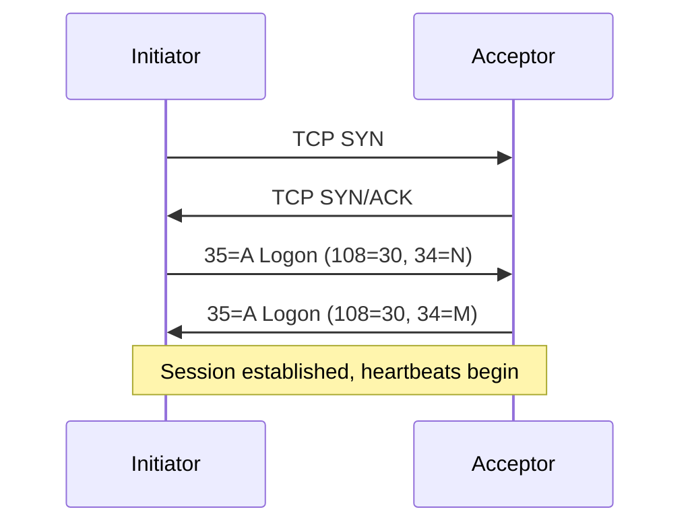
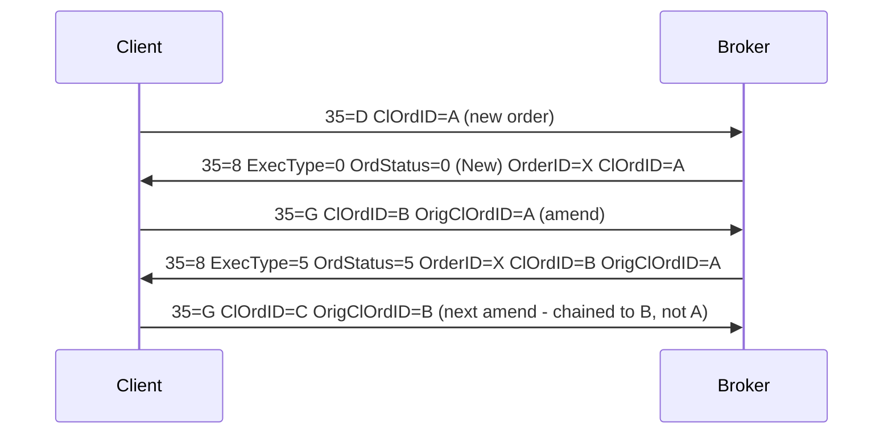

# FIX Protocol — 25 Quick-Hit Q&A

## Table of Contents

| # | Question |
|---|----------|
| Q1 | What is SOH and why does it matter? |
| Q2 | How is the FIX checksum (tag 10) calculated? |
| Q3 | What does MsgSeqNum (tag 34) do? |
| Q4 | Walk me through the Logon (35=A) handshake. |
| Q5 | What is the HeartBtInt (tag 108) and how is it used? |
| Q6 | Heartbeat (35=0) vs Test Request (35=1) — when does each fire? |
| Q7 | Gap Fill vs Sequence Reset — Reset (35=4) GapFillFlag Y vs N. |
| Q8 | What is PossDupFlag (tag 43) vs PossResend (tag 97)? |
| Q9 | ExecType (150) vs OrdStatus (39) — how are they different? |
| Q10 | Walk me through a cancel/replace (35=G) chain. |
| Q11 | ClOrdID (tag 11) vs OrderID (tag 37) — who owns which? |
| Q12 | What is a drop copy session and why does it exist? |
| Q13 | Resend Request (35=2) — what triggers it and how do you respond? |
| Q14 | Reject (35=3) vs Business Message Reject (35=j). |
| Q15 | What is OrigClOrdID (tag 41) and why is it required on cancel/replace? |
| Q16 | ExecID (tag 17) — what does it identify and must it be unique? |
| Q17 | LastQty/LastPx (32/31) vs CumQty/AvgPx (14/6). |
| Q18 | What is Logout (35=5) and what's the correct sequence to end a session? |
| Q19 | TimeInForce (tag 59) — the common values and edge cases. |
| Q20 | OrdType (tag 40) — market, limit, stop, stop-limit — key fields per type. |
| Q21 | What is a "stale" execution report and how would you spot one? |
| Q22 | SessionID components — what makes a FIX session unique? |
| Q23 | ResetSeqNumFlag (tag 141) on Logon — when is it legitimate? |
| Q24 | Handling a "MsgSeqNum too low" — what does the counterparty do? |
| Q25 | You see 35=8 with ExecType=4 (Cancelled) but no prior 35=G — what happened? |

---

### Q1. What is SOH and why does it matter?

**Interviewer signal:** Do you actually know the wire format or only the conceptual tags?

**Answer:**
SOH is ASCII 0x01, the Start-of-Header byte that terminates every tag=value pair in a FIX message. On the wire it's a single non-printable byte; in logs most tools render it as `|` or `^A` for readability. It matters because the FIX parser tokenises on SOH, not on newlines or pipes — if a counterparty sends a value that accidentally contains a literal 0x01 (rare, but I've seen it in a free-text tag 58), the message breaks mid-parse and the whole session can stall. When I'm reading raw packet captures I always confirm what the delimiter actually is before I start diffing messages.

**Watch-outs:** Don't say "pipe" — the pipe is a display convention, the wire byte is 0x01.

---

### Q2. How is the FIX checksum (tag 10) calculated?

**Interviewer signal:** Have you ever debugged a session that wouldn't come up?

**Answer:**
Tag 10 is the last field of every FIX message and it's a three-digit modulo-256 sum of every byte in the message up to (but not including) the checksum field itself, SOH included. Format is exactly `10=NNN<SOH>`, always three digits, zero-padded. If tag 10 is wrong the receiver drops the message and typically issues a Reject (35=3) or, if it's egregious, drops the session. In production, checksum mismatches almost always mean either a truncated write on the network layer or a middlebox that's rewriting bytes — I've never seen the engine itself compute it wrong, so I look at the transport first.

**Watch-outs:** It's mod 256, not a CRC. And it's a sum of bytes, not characters — matters for any high-bit content.

---

### Q3. What does MsgSeqNum (tag 34) do?

**Interviewer signal:** Do you understand FIX's guaranteed-delivery model?

**Answer:**
Tag 34 is the per-direction sequence number that lets FIX guarantee ordered, gap-free delivery over an inherently unreliable connection. Each side maintains its own outbound counter and expects the counterparty's inbound counter to increment by exactly one per message. On mismatch, the receiver either issues a Resend Request (35=2) if the incoming seq is too high, or drops the session if it's too low without PossDupFlag=Y. This is the mechanism that makes FIX recoverable after a TCP drop — on reconnect, both sides negotiate where they left off and replay the gap, rather than losing orders.

**Watch-outs:** Sequence numbers are per-session and per-direction — not global, not shared between sender and target.

---

### Q4. Walk me through the Logon (35=A) handshake.

**Interviewer signal:** Can you troubleshoot a session that won't establish?

**Answer:**
The initiator opens the TCP socket and sends Logon (35=A) with SenderCompID, TargetCompID, HeartBtInt (108), EncryptMethod (98=0 for none, typical), and optionally ResetSeqNumFlag (141). The acceptor validates the CompIDs against its config, checks the expected MsgSeqNum, and if everything's clean it sends its own Logon back — that mutual exchange is what actually completes the session. If seq numbers don't line up, the acceptor either sends Logon then immediately a Resend Request, or rejects with a Logout. In practice, 90% of Logon failures I've triaged are (a) wrong CompIDs, (b) wrong port/IP after a DR failover, or (c) a seq-num mismatch after one side rolled and the other didn't.

**Watch-outs:** Both sides send Logon — it's not a one-way "request/accept". Miss that and you'll misread session logs.

---

### Q5. What is the HeartBtInt (tag 108) and how is it used?

**Interviewer signal:** Do you know what keeps a session alive?

**Answer:**
Tag 108 is the heartbeat interval in seconds, agreed at Logon. Both sides must send a Heartbeat (35=0) if they've been silent for that many seconds, and must expect one from the counterparty. If nothing arrives in `HeartBtInt + reasonable-transmission-time` (spec suggests roughly 20% grace), the receiver sends a Test Request (35=1); if no response to that within another interval, the session is dropped. Typical values I've seen are 30 seconds for standard order flow and 10 or even 5 for latency-sensitive market data. The value is negotiated — whatever the initiator proposes, the acceptor echoes back and is what's used.

**Watch-outs:** 108=0 is legal and means "no heartbeats" — occasionally used on test rigs, never in production for us.

---

### Q6. Heartbeat (35=0) vs Test Request (35=1) — when does each fire?

**Interviewer signal:** Do you understand the liveness protocol?

**Answer:**
Heartbeat (35=0) is proactive — sent when a side has had no outbound traffic for the HeartBtInt, purely to prove the connection is up. Test Request (35=1) is reactive — sent when a side has heard nothing from the counterparty for HeartBtInt plus grace, and it carries a TestReqID (tag 112) that the counterparty must echo back in its response Heartbeat. If the echoed Heartbeat doesn't arrive within the next interval, you disconnect. So the sequence is: silence → Test Request → expected Heartbeat with matching 112 → session stays up.

**Watch-outs:** A Heartbeat sent in response to a Test Request must echo tag 112. A "naked" Heartbeat without 112 doesn't satisfy the test.

---

### Q7. Gap Fill vs Sequence Reset — Reset (35=4) GapFillFlag Y vs N.

**Interviewer signal:** Do you understand recovery vs the nuclear option?

**Answer:**
35=4 (Sequence Reset) has two modes controlled by GapFillFlag (tag 123). With GapFillFlag=Y ("gap fill mode"), it's used during resend to skip administrative messages the sender chooses not to retransmit — NewSeqNo (36) points to the next real message. This is the safe, spec-compliant use during a Resend Request response. With GapFillFlag=N or absent ("reset mode"), it forces the receiver's expected inbound seq to NewSeqNo unconditionally — this is the nuclear option, only valid outside of a resend, and only when both sides have agreed operationally. On a production session I would never let an automated system send 35=4 with GapFillFlag=N; that's an operator action after a manual seq-num intervention.

**Watch-outs:** Reset-mode 35=4 can only move sequences forward, never backward.

---

### Q8. What is PossDupFlag (tag 43) vs PossResend (tag 97)?

**Interviewer signal:** Can you distinguish protocol-level duplicates from application-level duplicates?

**Answer:**
PossDupFlag (43=Y) means "this exact message, with this exact MsgSeqNum, may already have been sent" — it's set on the retransmit path during a Resend Request response. The receiver deduplicates by seq number and largely ignores it if already processed. PossResend (97=Y) is application-level: "this may be a functional duplicate of a previous message, though with a different seq number and possibly different ClOrdID" — used when an upstream system replays orders after a crash. On PossResend the receiving app has to check business keys (ClOrdID, account, symbol, qty, timestamp) to decide if it's a dup. In OMS support I care much more about 97 because 43 is handled by the engine, whereas 97 lands in the application and can create real duplicate orders if the logic is sloppy.

**Watch-outs:** OrigSendingTime (tag 122) is mandatory when PossDupFlag=Y — a common cause of reject on resends.

---

### Q9. ExecType (150) vs OrdStatus (39) — how are they different?

**Interviewer signal:** This is the FIX 4.4 gotcha — do you know it?

**Answer:**
OrdStatus (39) describes the *current state of the order*: New, Partially Filled, Filled, Cancelled, Replaced, Rejected, and so on. ExecType (150) describes *what this specific ExecutionReport is about* — the event that produced it: New (0), Trade (F), Cancelled (4), Replaced (5), Rejected (8), Pending Cancel (6), etc. They can — and often do — differ. Classic example: an ExecutionReport with ExecType=F (Trade) and OrdStatus=1 (Partially Filled) means "here's a partial fill event, and after applying it the order is now partially filled". Before FIX 4.3, ExecTransType (tag 20) carried some of this semantic; from 4.3 onward, ExecType absorbed it and 20 is deprecated. When I'm debugging a fill mismatch, I read 150 first to know *what event this is*, then 39 to know *where the order stands now*.

**Watch-outs:** Pre-4.3 vs post-4.3 semantics differ — don't confuse ExecType with ExecTransType on old sessions.

---

### Q10. Walk me through a cancel/replace (35=G) chain.

**Interviewer signal:** Do you understand ClOrdID chaining under fire?

**Answer:**
The client sends OrderCancelReplaceRequest (35=G) with a *new* ClOrdID (11), OrigClOrdID (41) pointing at the previous ClOrdID, and the new order params. The broker acknowledges with an ExecutionReport, ExecType=E (Pending Replace) or straight to ExecType=5 (Replaced) with OrdStatus=5, and importantly the OrderID (37) stays the same across the chain — that's the broker's stable handle. If the broker rejects the replace, it sends OrderCancelReject (35=9) with the *new* ClOrdID and the OrigClOrdID that was targeted, plus CxlRejReason. On the next amend, OrigClOrdID must point to the *most recently accepted* ClOrdID, not the original — this is the "chain" that trips people up. I've seen production incidents where a client was still amending against ClOrdID N-2 after N-1 was accepted, and the broker rejected everything.

**Watch-outs:** OrigClOrdID always tracks the last *accepted* ClOrdID, not the last *sent*.

---

### Q11. ClOrdID (tag 11) vs OrderID (tag 37) — who owns which?

**Interviewer signal:** Foundational — do you know the two identity axes?

**Answer:**
ClOrdID (11) is client-assigned and must be unique per session per trading day — it identifies a specific client instruction (new, cancel, replace all get their own). OrderID (37) is broker-assigned and identifies the *order at the broker* across its entire lifecycle including amends. So on a new order, the client sends 11=A and gets back an ExecutionReport with 11=A and 37=X. On the amend, the client sends 11=B, OrigClOrdID(41)=A, and the response comes back with 11=B, 41=A, and *the same* 37=X. When I'm reconciling a fill I match on 37 because that's stable; when I'm looking up "what instruction did the trader send", I use 11.

**Watch-outs:** Some venues issue 37 lazily (only after ack) or reuse it across days — always check venue quirks.

---

### Q12. What is a drop copy session and why does it exist?

**Interviewer signal:** Do you know real ops architecture?

**Answer:**
A drop copy is a read-only FIX session where the broker or venue sends a copy of every execution report to a third party — typically a risk system, compliance archive, or middle-office reconciliation engine — separate from the trading session that generated the order. It's independent of the order-entry session, uses its own CompIDs, and receives only ExecutionReports (35=8) — no orders flow into it. The point is fault isolation: if the trading OMS is buggy or the fill message on the trading session is lost, the drop copy provides an independent record of what actually executed at the broker. In production support I use drop copies constantly to reconcile disputed fills — "the OMS says we didn't get filled, but the drop copy shows we did".

**Watch-outs:** Drop copy is downstream-only; you don't send orders into it, and it usually can't answer "is this order live" — only "here's what filled".

---

### Q13. Resend Request (35=2) — what triggers it and how do you respond?

**Interviewer signal:** Recovery understanding.

**Answer:**
Resend Request (35=2) is sent when the receiver detects an incoming MsgSeqNum higher than expected — meaning it missed one or more messages. It carries BeginSeqNo (7) and EndSeqNo (16), where EndSeqNo=0 means "everything from BeginSeqNo to current". The responder must replay those messages with PossDupFlag=Y and OrigSendingTime=original time; administrative messages (Heartbeat, Test Request, Resend Request itself, Sequence Reset, Logon, Logout) are typically *not* replayed but skipped via a Gap Fill (35=4 with 123=Y). Application messages — orders, execution reports — are replayed exactly. A gotcha is that during resend, both sides may be sending new messages too, so the recipient has to buffer the higher-seq new traffic until the resend gap is closed.

**Watch-outs:** Never replay administrative messages verbatim — always gap-fill over them.

---

### Q14. Reject (35=3) vs Business Message Reject (35=j).

**Interviewer signal:** Layer awareness — session vs application.

**Answer:**
Session-level Reject (35=3) means the message failed FIX-protocol validation: bad checksum, unknown MsgType, required tag missing, tag appearing in wrong context, wrong data type. It's raised by the FIX engine before the application ever sees the message. Business Message Reject (35=j) means the message parsed fine as FIX but the application couldn't process it for business reasons — unknown security, closed market, unsupported order type, entitlements. Practically: 35=3 = "your FIX is malformed"; 35=j = "your FIX is fine, your instruction is not". When I'm triaging, 35=3 usually points at the sender's FIX library or a schema mismatch; 35=j points at business config — entitlements, symbology, market hours.

**Watch-outs:** OrderCancelReject (35=9) is *neither* of these — it's a specific reject for cancel/replace requests only.

---

### Q15. What is OrigClOrdID (tag 41) and why is it required on cancel/replace?

**Interviewer signal:** Chain integrity.

**Answer:**
Tag 41 identifies *which* prior order this cancel or replace is acting on. Without it the broker has no unambiguous way to know what to modify — ClOrdID (11) on the incoming message is the *new* identifier for the amend/cancel itself, so 41 supplies the "target". It must reference the most recently accepted ClOrdID in the chain; using an older or unaccepted one is a common cause of 35=9 CancelReject. On the response, ExecutionReport or CancelReject carries both the new 11 and 41 so the client can reconcile which of its in-flight amends this response answers.

**Watch-outs:** If a replace is rejected, the *next* amend still targets the last accepted ClOrdID — the rejected one never joined the chain.

---

### Q16. ExecID (tag 17) — what does it identify and must it be unique?

**Interviewer signal:** Fill identity — critical for reconciliation.

**Answer:**
ExecID (17) uniquely identifies an individual ExecutionReport from a given broker/venue — every 35=8 has one, and within a trading day for that source it must be unique. That means partial fills, cancel confirmations, rejects, and pending states each carry a distinct ExecID even though they share the same OrderID (37) and typically the same ClOrdID (11). On the client side I dedupe by ExecID; if I ever see the same ExecID twice, that's either a resend (which the engine handles) or a real duplicate from upstream that needs an operator to investigate. For trade capture and clearing, ExecID plus ExecRefID (19, used on busts/corrects) is the primary key of a fill.

**Watch-outs:** ExecID uniqueness is per-source per-day, not globally forever.

---

### Q17. LastQty/LastPx (32/31) vs CumQty/AvgPx (14/6).

**Interviewer signal:** Fill math.

**Answer:**
LastQty (32) and LastPx (31) describe *this specific fill event* — how many shares and at what price traded on this ExecutionReport. CumQty (14) and AvgPx (6) describe the *order's running totals* after applying this fill — cumulative executed quantity and volume-weighted average price across all fills so far. There's also LeavesQty (151) which is the remaining open quantity. Sanity check I do in every fill reconciliation: `CumQty + LeavesQty = OrderQty` for open orders, and the incremental math `new_CumQty = old_CumQty + LastQty` must hold. Also `new_AvgPx = (old_CumQty*old_AvgPx + LastQty*LastPx) / new_CumQty` — I've caught broker bugs where AvgPx drifted from that identity.

**Watch-outs:** On non-fill ExecTypes (e.g. Cancelled), LastQty/LastPx are usually 0 or absent — don't treat them as fills.

---

### Q18. What is Logout (35=5) and what's the correct sequence to end a session?

**Interviewer signal:** Graceful shutdown vs socket drop.

**Answer:**
Logout (35=5) is the graceful termination. One side sends it with an optional Text (58) reason, the other side responds with its own 35=5, and *then* both close the socket. The initiator of the logout should wait a short period for the response Logout before dropping TCP — closing the socket first leaves the counterparty unsure whether messages were received. If a side receives 35=5 while it still has un-acked outbound messages, it should confirm sequence numbers first (potentially with a final Test Request or Resend) before responding. In practice most engines just send Logout and close; the well-behaved ones honour the two-way exchange.

**Watch-outs:** Socket drop without 35=5 is not the same as Logout — the far side will typically treat it as unexpected disconnect and may trigger alerts.

---

### Q19. TimeInForce (tag 59) — the common values and edge cases.

**Interviewer signal:** Basic order semantics.

**Answer:**
Common values: 0=Day (default, expires at session close), 1=GTC (Good Till Cancel), 3=IOC (Immediate or Cancel — fill what you can right now, cancel the rest), 4=FOK (Fill or Kill — all or nothing, immediately), 6=GTD (Good Till Date, paired with ExpireDate 432 or ExpireTime 126), 7=At the Close. IOC is the workhorse for aggressive orders; FOK is stricter and less common. Watch-outs: GTC handling varies by venue — some cancel at end of week, some carry indefinitely; and Day orders are only "day" in the venue's timezone, which matters for cross-region flow where a US day-order routed from Asia can expire before the trader expected.

**Watch-outs:** Some brokers don't support all TIFs; unsupported TIF returns Business Reject (35=j) or Reject (35=8 with ExecType=8).

---

### Q20. OrdType (tag 40) — market, limit, stop, stop-limit — key fields per type.

**Interviewer signal:** Do you know what fields to look at for each order type?

**Answer:**
1=Market: Price (44) not required and typically ignored; execution at prevailing market. 2=Limit: Price (44) required — the worst price acceptable. 3=Stop: StopPx (99) required — triggers a market order when the stock trades at StopPx. 4=Stop-Limit: both Price (44) and StopPx (99) required — triggers a limit order at Price when the stock trades at StopPx. 5=Market-with-protection and other variants exist but the four above cover 95% of flow. When I'm debugging a rejected order, OrdType is the first thing I check against the price fields — mismatch there (limit without a price, stop without a stop price) is a very common 35=j.

**Watch-outs:** A Market order with a Price tag is generally not rejected — the broker just ignores it. But some venues do reject.

---

### Q21. What is a "stale" execution report and how would you spot one?

**Interviewer signal:** Real-world troubleshooting instinct.

**Answer:**
A stale execution report is one that arrives out of chronological order relative to the order's current state — for example, an ExecType=0 (New Ack) arriving *after* an ExecType=F (Trade) for the same ClOrdID. Causes: (a) resend replaying old messages after a reconnect, in which case PossDupFlag=Y should flag it; (b) a slow message path where the ack was delayed behind faster fill traffic; (c) a bugged broker gateway serialising responses on different threads. I spot them by comparing SendingTime (52) and TransactTime (60) against the order's current state, and by watching for ExecType regressions (state going backwards in the FIX 4.4 order state diagram). Correct handling is usually "log and ignore" — the current state has already advanced past what this report describes.

**Watch-outs:** Never regress an order's OrdStatus just because a stale report says so — you'll break downstream P&L.

---

### Q22. SessionID components — what makes a FIX session unique?

**Interviewer signal:** Config-level understanding.

**Answer:**
A FIX session is uniquely identified by the tuple (BeginString, SenderCompID, TargetCompID) — and optionally SenderSubID/TargetSubID and Qualifier if configured. BeginString is the FIX version (`FIX.4.2`, `FIX.4.4`, `FIXT.1.1` for FIX 5.0). SenderCompID and TargetCompID identify the two parties and are swapped from each side's perspective — what one side calls Sender the other calls Target. Two sessions with the same SenderCompID/TargetCompID but different BeginString are different sessions and can run in parallel (rare but legal). When onboarding a new counterparty, mismatched CompIDs is the number one cause of Logon failure, and the failure mode is that the acceptor doesn't recognise the session and drops the connection with no Logon response — sometimes silently.

**Watch-outs:** Sub-IDs matter if configured — session lookup will fail if one side sends them and the other doesn't expect them.

---

### Q23. ResetSeqNumFlag (tag 141) on Logon — when is it legitimate?

**Interviewer signal:** Do you understand the operational impact?

**Answer:**
141=Y on a Logon message tells the counterparty "reset both inbound and outbound sequence numbers to 1 for this session". It's legitimate in two scenarios: (a) start-of-day reset if both parties have agreed to reset daily rather than persist sequences overnight, and (b) after operational intervention where seq numbers have got out of sync beyond recovery. It's *not* a substitute for proper resend recovery — using it to skip past a problem hides real message loss. Both sides must agree, and the counterparty must respond with its own Logon carrying 141=Y. If only one side resets, sequences immediately diverge and the session dies.

**Watch-outs:** Some brokers reject 141=Y intra-day as a safety measure — check the rules of engagement.

---

### Q24. Handling a "MsgSeqNum too low" — what does the counterparty do?

**Interviewer signal:** Do you know the recovery failure mode?

**Answer:**
If a received message has MsgSeqNum lower than expected and PossDupFlag is not set, that's a fatal protocol error — the sender has effectively rewound its own sequence, which is not recoverable within the protocol. Standard behaviour: send Logout (35=5) with Text describing the mismatch, and drop the session. The operator then has to investigate — usually the sender's state file was rolled back or reset without agreement. If PossDupFlag=Y *is* set, then the "low" seq is expected during resend and the receiver just checks whether it's already processed that seq and discards silently if so. So the flag is the difference between "controlled replay" and "unrecoverable divergence".

**Watch-outs:** Some engines *only* log and continue rather than dropping — that's non-compliant but common.

---

### Q25. You see 35=8 with ExecType=4 (Cancelled) but no prior 35=G — what happened?

**Interviewer signal:** Debugging instinct — unsolicited cancels are common.

**Answer:**
That's an *unsolicited cancel* — the broker or venue killed the order without the client asking. Common causes: (a) order expired (Day order at close, GTD past ExpireDate), (b) risk-triggered auto-cancel (fat-finger check, credit limit breach, position limit), (c) market state change like halt or LULD trigger, (d) DMA line cutover or DR failover where the venue clears open state, (e) operator manual cancel at the broker for a stuck order. The ExecutionReport should have ExecRestatementReason (378) populated with a hint — 0=GTC end of session, 1=Verbal, 3=Cancel on Trading Halt, 4=Cancel on System Failure, 8=Market Option, etc. In production I always look at 378 first, then correlate against the venue's status feed for market-wide events, then check with the broker for account-specific reasons.

**Watch-outs:** Don't assume the client cancelled it — search the outbound session for a 35=F/G before you page the trader.
