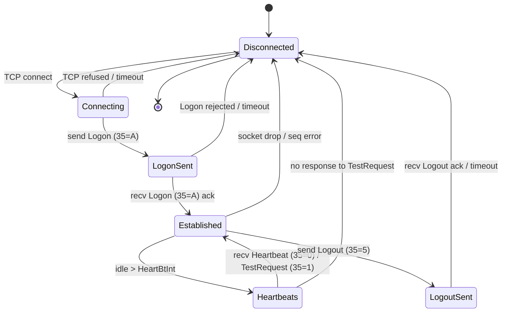
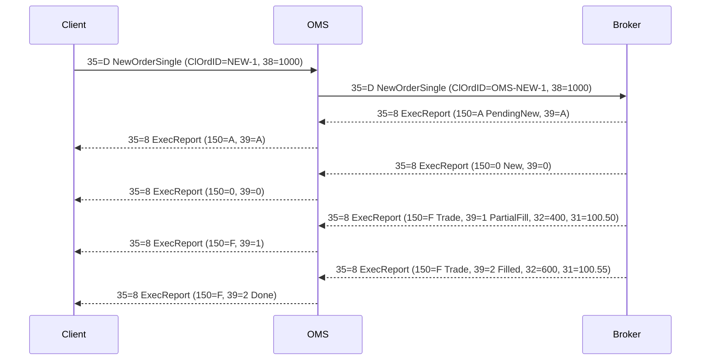
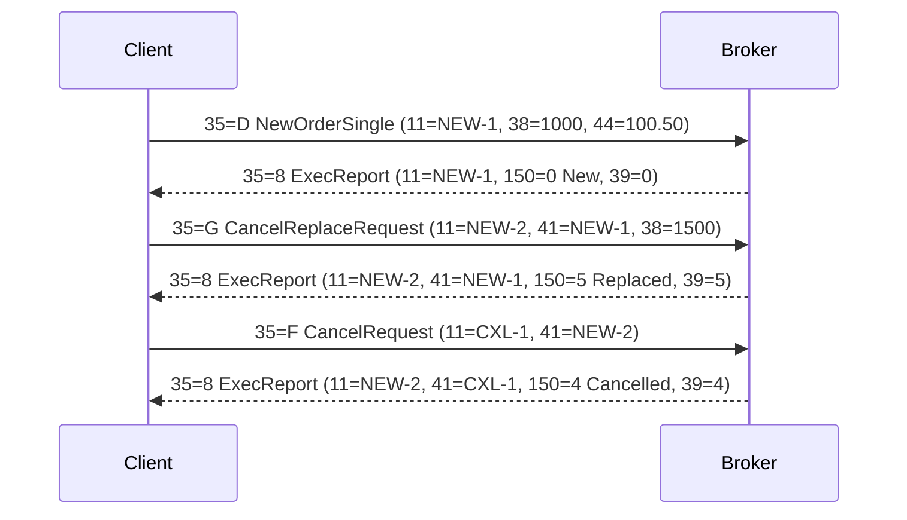
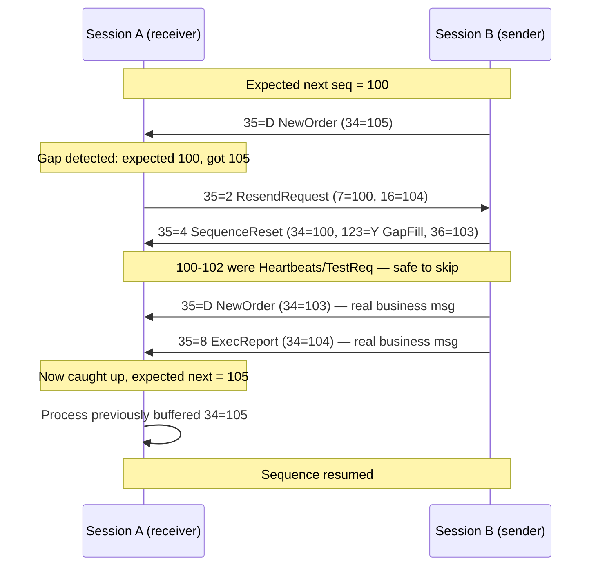
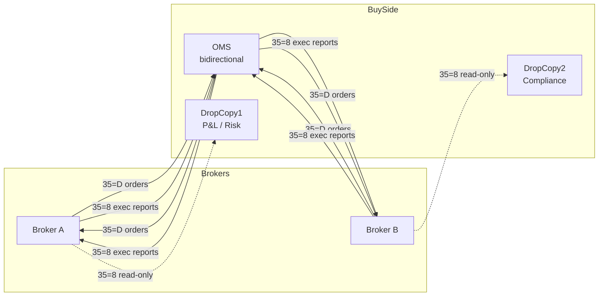
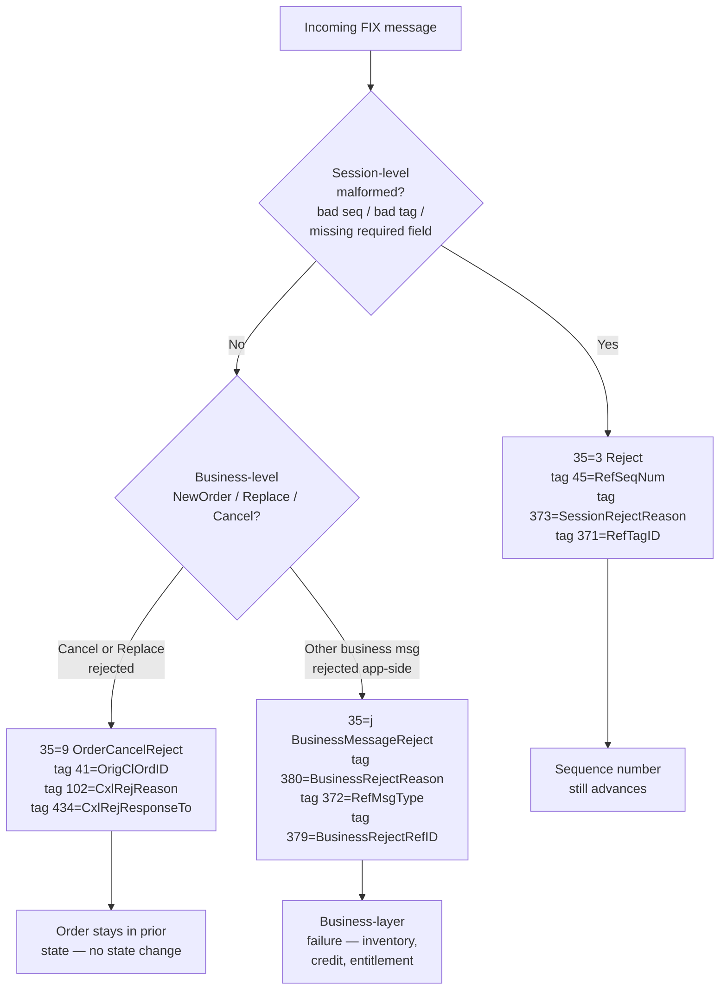

# FIX Protocol — Diagrams

## Table of Contents
1. [Session State Machine](#1-session-state-machine)
2. [Order Lifecycle Sequence](#2-order-lifecycle-sequence)
3. [Cancel/Replace Chain](#3-cancelreplace-chain)
4. [Gap Fill Sequence](#4-gap-fill-sequence)
5. [Drop Copy Topology](#5-drop-copy-topology)
6. [Reject Variants](#6-reject-variants)

---

## 1. Session State Machine

State transitions for a single FIX session from TCP connect through orderly logout. Every production incident involving "session down" maps to one of these transitions failing — most commonly stuck in `LogonSent` (credential/comp-ID mismatch) or bouncing out of `Established` on a heartbeat timeout.

**Caption:** The `Heartbeats` sub-state is really a nested loop inside `Established` — every `HeartBtInt` seconds (35=108) the counterparty must send a Heartbeat (35=0) or respond to a TestRequest (35=1). Two missed intervals trigger disconnect. Clean shutdown always goes through `LogoutSent`; anything else is an abnormal termination and forces resend logic on reconnect.

---

## 2. Order Lifecycle Sequence

Happy-path new order from client to broker with two partial fills. Every ExecutionReport (35=8) carries `OrdStatus` (39) and `ExecType` (150) — the interview trap is knowing they can diverge (e.g. ExecType=Trade while OrdStatus=PartiallyFilled).

**Caption:** `PendingNew` (150=A) is the broker's "I received it" ack — it is optional but common on regulated venues. The order is not working on the book until `New` (150=0). CumQty (14) and AvgPx (6) accumulate across fills; LastShares (32) and LastPx (31) describe only the current execution.

---

## 3. Cancel/Replace Chain

Cancel/Replace uses OrderCancelReplaceRequest (35=G) which atomically replaces the working order with a new one. `OrigClOrdID` (41) chains back to the prior ClOrdID — get that wrong and the broker sends OrderCancelReject (35=9) with reason `Unknown order`.

**Caption:** After a replace, all future references must use the new ClOrdID (`NEW-2`) — using `NEW-1` will get rejected as unknown. The cancel's ExecReport echoes both the working order's ClOrdID (11=NEW-2) and the cancel request's ID (41=CXL-1) so the client can correlate. If the replace race-conditions against a fill, expect an OrderCancelReject (35=9) with `CxlRejReason=Too late to cancel`.

---

## 4. Gap Fill Sequence

Triggered when the receiver detects `MsgSeqNum` (34) higher than expected — meaning messages were lost or the counterparty skipped sequences. The sender responds with either real message replays or a SequenceReset-GapFill (35=4, 123=Y) for admin messages that must not be replayed.

**Caption:** GapFillFlag=Y (tag 123) tells the receiver "trust me, 100-102 were admin — jump straight to NewSeqNo (36)". Business messages (D, G, F, 8) must always be replayed with `PossDupFlag=Y` (43=Y), never gap-filled — this is the single most common source of trade breaks after an outage. If the receiver rejects the reset, the session terminates.

---

## 5. Drop Copy Topology

Drop copy is a read-only ExecutionReport (35=8) feed to a separate consumer — used for real-time P&L, compliance surveillance, and back-office reconciliation. The OMS is the primary session for order entry; drop copies are parallel one-way feeds from each broker.

**Caption:** Dashed lines are drop copy — one-way, ExecutionReport-only, no order entry. Each drop copy has its own SenderCompID/TargetCompID pair and its own sequence numbers independent of the trading session. If the primary trading session goes down, drop copy typically stays up, giving support a real-time view of what the broker thinks is happening while OMS is dark.

---

## 6. Reject Variants

Three distinct reject messages, each for a specific failure class. Confusing them on a support ticket wastes hours — the sender ID, message type, and reason-code tag are all different.

**Caption:** Session Reject (35=3) means the message was malformed at the FIX layer — parser could not even understand it, so it never reached business logic. OrderCancelReject (35=9) is specific to F/G rejects, and the original order remains in whatever state it was in. BusinessMessageReject (35=j) is the catch-all for well-formed messages that failed business validation — think risk limit breach, unknown symbol, or expired entitlement.

---
