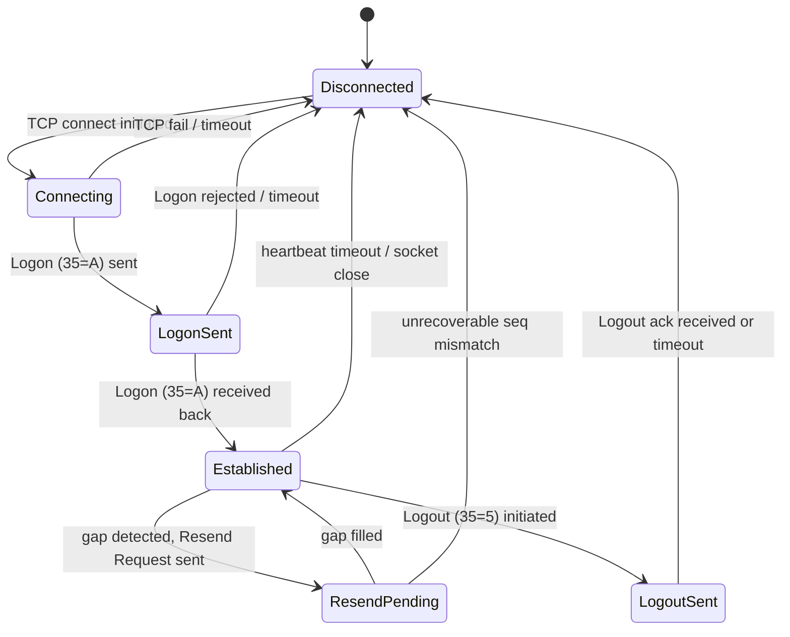

# 06 — Mock Interview: FIX Protocol Deep Dive

## Contents

| # | Dialogue | Duration |
|---|----------|----------|
| 1 | Walk me through a Logon and first order | 25 min |
| 2 | Session went down at 14:30 and came back at 14:34 — what do you do | 30 min |
| 3 | Whiteboard the session state machine | 20 min |

---

## Dialogue 1 — Walk me through a Logon and first order (25 min)

**Interviewer signal:** Probing whether the candidate has actually watched FIX logs go by, or only read a spec. Wants concrete tag numbers, sequence number behaviour, and the boundary between session layer and application layer.

---

**Interviewer:** So — let's start easy. A new counterparty just got provisioned. Walk me through what happens on the wire when they connect and send their first order. Talk me through it like I'm looking at the FIX log with you.

**Candidate:** Sure. Assume we're the acceptor — the counterparty is the initiator. First thing on the wire is the TCP connect on the port we've assigned them. Nothing FIX yet, just a socket. Once that's up, the initiator sends a Logon — `MsgType=A`. The critical tags on that first message are `8=FIX.4.4` or whatever version, `49=SenderCompID`, `56=TargetCompID`, `34=MsgSeqNum` — usually 1 if it's a clean start — `98=EncryptMethod=0` for no encryption, and `108=HeartBtInt`, typically 30 seconds. If they're using `141=ResetSeqNumFlag=Y` they're telling us to reset both sides to 1.

**Interviewer:** Stop there. What do you do with that ResetSeqNumFlag on your end?

**Candidate:** On the acceptor side, if `141=Y`, I have to reset my outbound sequence to 1 as well and send my Logon response with `34=1` and `141=Y` echoed back. That's the handshake agreement — both sides are agreeing "we're starting fresh, forget yesterday's sequence numbers." If I don't reset and just send `34=5847` because that's where my store left off, they'll reject with a sequence-too-high and we're stuck in a Resend loop.

**Interviewer:** And if `141` is absent or `N`?

**Candidate:** Then we're doing sequence continuity — I use whatever the next outbound is from my message store, they use theirs. If either side sees a gap on the first business message, they'll fire a Resend Request, `MsgType=2`, with `7=BeginSeqNo` and `16=EndSeqNo=0` meaning "everything from there on."

**Interviewer:** OK. Logon is accepted. What comes next before the first order?

**Candidate:** Once both Logons are exchanged, the session is Established. In practice the very next thing you'll see is a heartbeat exchange starting on the `108` interval. Neither side has to speak first at the app layer — some counterparties send a Test Request, `MsgType=1`, to confirm the pipe is warm before they send business messages. That's `112=TestReqID` and the other side has to reply with a Heartbeat, `MsgType=0`, echoing `112`.

Then the first order. New order single, `MsgType=D`. Header is the same — `8`, `9=BodyLength`, `35=D`, `34`, `49`, `56`, `52=SendingTime`. Body tags: `11=ClOrdID` — their unique client order ID, must be unique per session per day — `55=Symbol`, `54=Side` — 1 buy, 2 sell — `38=OrderQty`, `40=OrdType` — 1 market, 2 limit — `44=Price` if it's a limit, `59=TimeInForce`, `60=TransactTime`, `1=Account` if they route by account. Then `10=CheckSum` at the end.

**Interviewer:** What does the OMS do first when that D message hits?

**Candidate:** Session layer first — the engine validates `34=MsgSeqNum` is the expected one, validates the checksum on tag 10, validates `9=BodyLength`. If any of those fail it's a session-level reject, `MsgType=3`, with `45=RefSeqNum` and `373=SessionRejectReason`. The message never gets to the application.

If session layer is clean, the engine increments its expected inbound counter and hands the parsed message to the application. Application layer validates `11=ClOrdID` is not a duplicate for the day — if it is, we send back an Execution Report with `39=OrdStatus=8 Rejected` and `58=Text` explaining "duplicate ClOrdID." Then it validates the symbol is tradeable on our book, the account is entitled, the price is within the fat-finger band, and the TIF is supported.

**Interviewer:** And the ack back?

**Candidate:** Execution Report, `MsgType=8`. First one is the pending-new or new ack — `150=ExecType=0` for New in FIX 4.4, `39=OrdStatus=0`, `37=OrderID` — our internal order ID assigned by the OMS — `11=ClOrdID` echoed back so they can reconcile, `17=ExecID` unique per execution report, `14=CumQty=0`, `151=LeavesQty=OrderQty`, `6=AvgPx=0`. When it fills you get more Execution Reports with `150=F` Trade, updated `14`, `151`, `6`, and `31=LastPx`, `32=LastQty` for the fill itself.

**Interviewer:** Nice. One more — how does the day end?

**Candidate:** Depends on the counterparty's schedule. Standard is one side sends a Logout, `MsgType=5`, optionally with `58=Text` explaining why. The other side responds with its own Logout and then closes the socket. On a scheduled end-of-day, our engine has a configured logout time — say 22:00 local — where it initiates. Sequence numbers either reset overnight at the session boundary or persist depending on the session config. Most equities sessions I've supported do a nightly reset; some fixed-income sessions preserve sequences across days.

**Watch-outs:** Weak candidates conflate the session-level Reject (`MsgType=3`) with the application-level Business Message Reject (`MsgType=j`) or with an Execution Report reject (`39=8`). Three different rejects, three different meanings. Also — don't say "the OMS sends an ack" without saying which layer.

### Debrief

Interviewer is looking for four things here:

1. **Concrete tag numbers**, not just concepts. Saying "the Logon has an encrypt method and heartbeat" is weak. Saying "`98=0`, `108=30`" is strong.
2. **The layering.** Session vs application. Sequence numbers and checksums are session; ClOrdID duplication and fat-finger are application.
3. **The three types of reject.** Session Reject (`3`), Business Message Reject (`j`), and Execution Report Reject (`8` with `39=8`).
4. **`ResetSeqNumFlag` semantics.** This one trips people up because both sides have to agree.

If you can narrate a Logon with tag numbers off the top of your head, you signal that you've actually stared at logs. That is the single strongest signal in a FIX interview.

---

## Dialogue 2 — Session went down at 14:30 and came back at 14:34 — what do you do (30 min)

**Interviewer signal:** Real production support scenario. Wants to see the candidate's incident playbook — do they panic, or do they have a repeatable checklist? Wants to hear about gap fills, orders in flight, and stakeholder comms.

---

**Interviewer:** Let's do a scenario. It's 14:30 on a Tuesday. Trader messages you — "the London session is down, I can't send orders." You check and yes, the session to a European sell-side broker dropped. It comes back up at 14:34. Walk me through what you do in those four minutes and after.

**Candidate:** OK. First thing, before I do anything on the session — I acknowledge the trader within seconds. "Seeing it, investigating." That's a hard rule for me. Silence during an outage is the worst possible response because the trader is now guessing whether I've even noticed.

Then in parallel, I'm doing three things. One — check the FIX engine logs on our side to see the disconnect reason. Was it a socket close initiated by us, by them, was it a heartbeat timeout, or was it a hard TCP reset? That tells me whose problem it is. Two — check with the counterparty's support desk over the shared chat channel; they usually already know. Three — check the network side. Is it just this one session or is the whole VPN to that broker down? If it's the whole VPN, I'm escalating to network ops immediately because it affects more than one session.

**Interviewer:** Say the logs show a heartbeat timeout on our side. We didn't get their heartbeat for the `108` interval plus grace.

**Candidate:** Right, so the sequence is — we sent a Test Request, `MsgType=1`, when we crossed the heartbeat interval with no traffic. We waited the response timeout — typically the heartbeat interval again — got nothing, and disconnected. That points to their side being unresponsive, either the app hung or their network path went dark. Not conclusive on its own, but it's the working hypothesis.

**Interviewer:** OK, and while you're diagnosing, the session comes back at 14:34. What happens on reconnect?

**Candidate:** The initiator sends Logon. The critical question is what sequence numbers each side sends. If they send `34=N` where N is the next-expected outbound they had before the drop, and our expected inbound is also N, we're clean. Heartbeats resume, business as usual.

But almost always there's a gap. Say we were at inbound 4521 before the drop, and they come back with `34=4524`. That means they sent us 4521, 4522, 4523 during the outage and we never got them. Our engine detects the gap and sends a Resend Request, `MsgType=2`, `7=4521`, `16=4523`. They then have to resend those messages. If any of them were session-level messages like heartbeats, they resend them as Sequence Reset gap-fill, `MsgType=4`, `123=Y`, `36=NewSeqNo`. Application messages — orders, execution reports — they resend as the original message with `43=Y` PossDupFlag set.

**Interviewer:** And what if the gap is the other direction — they think they've received more than we sent?

**Candidate:** That's the ugly case. If they come back and their expected inbound is 8500, but we only ever sent up to 8497, they'll process our next real message as a Sequence Too Low and either reject the session or force a Logout. Now we have a sequence number mismatch that only resolves one of two ways — either we manually reset both sides to an agreed number, or we use `141=Y` on a fresh Logon to reset to 1. That's a coordinated action requiring both ops teams.

**Interviewer:** Let's rewind. During the four minutes the session was down — a trader had sent five orders through the OMS just before the drop, and one order was pending an ack that never came. What do you do about those five orders?

**Candidate:** This is where it gets real. I need to answer three questions for each order:

1. **Did our OMS get the order in?** Check the OMS blotter — is it there in Pending New or New state?
2. **Did the order actually leave our engine?** Check the FIX outbound log — is there a `35=D` for it, and what sequence number?
3. **Did the counterparty acknowledge it?** Look for a matching `35=8` inbound with the same `11=ClOrdID`.

If the D went out but no 8 came back before the drop, the order status is ambiguous. It may have reached them and they filled it, or it may have died on the wire. I do not resend blindly — that risks a duplicate at the broker. Instead I send an Order Status Request, `MsgType=H`, once the session is up, with the `11=ClOrdID` and `37=OrderID` if we have it. Their engine responds with an Execution Report showing the current state. If it's `39=0 New`, we're live and working. If it's `39=8 Rejected` or unknown, then I coordinate with the trader — usually we cancel-replace or resubmit with a new ClOrdID.

The five orders that were fully acknowledged before the drop — those are working orders at the broker regardless of the session state. Orders don't die when the session drops; they live in the broker's book. That's a common misconception I hear from traders in a panic. My job is to reassure them and prove it with the Order Status Request round trip once we're back up.

**Interviewer:** What if the trader wants to cancel one of those working orders while the session is still down?

**Candidate:** They can't via FIX — session is down, no messages moving. Two options. One, wait for reconnect and send `35=F` Order Cancel Request as soon as we're up. Two, and this is what we actually do in urgency — I call the broker's voice desk with the order details, ClOrdID, side, symbol, quantity, and ask for a manual cancel. The trader gives verbal authorization. The broker cancels on their side, and when the session comes back the reconciliation is done via Order Status Request. Voice cancel with FIX reconciliation is a standard pattern.

**Interviewer:** Last one on this — after the incident, what's your writeup?

**Candidate:** Post-incident I want three artifacts. First, a timeline: session drop at 14:30:12, first alert at 14:30:15, trader notified at 14:30:20, root cause identified at 14:31, resolution at 14:34:47, all orders reconciled at 14:38. Second, the RCA — in this case heartbeat timeout, further traced to counterparty's app-server GC pause based on their logs. Third, action items — do we need to tune our heartbeat interval, do we need a secondary path, is there a monitoring gap where we didn't alert fast enough. That goes into the incident tracker and gets circulated to the trading desk and to the counterparty's ops team.

**Watch-outs:** Do not say "I just resend the orders." That's the wrong answer and it's why interviewers ask this question. Duplicate orders at the broker are worse than a delayed reconciliation. Always Order Status Request first, then decide.

### Debrief

This is the highest-signal question in FIX interviews for a production support role. The interviewer wants to see:

1. **Trader comms first.** Silence during an outage is the number one complaint traders have about ops.
2. **Parallel investigation.** Engine logs, counterparty, network — all at once, not serially.
3. **Understanding of gap-fill vs sequence reset.** Resend Request, PossDupFlag, gap-fill Sequence Reset are the mechanics.
4. **Order state reconciliation via `35=H`.** Never blind resend.
5. **Voice fallback is legitimate.** Interviewers actually want to hear you say "call the desk" — it shows you know FIX is not the only tool.
6. **Post-incident discipline.** Timeline, RCA, actions.

If you can walk this scenario end to end without prompting, you sound like someone who has actually lived through outages.

---

## Dialogue 3 — Whiteboard the session state machine (20 min)

**Interviewer signal:** Tests whether the candidate can abstract the protocol into states and transitions, or only knows a linear happy path. Also tests whiteboarding skill — can they draw and explain simultaneously.

---

**Interviewer:** OK last one. Grab the marker. Draw me the FIX session state machine. Every state, every transition. Talk me through as you draw.

**Candidate:** Sure. I'll draw it as a state diagram. There are essentially six states a FIX session moves through.

Let me walk through each transition.

**Disconnected** is the starting state and the terminal state. No socket, no session. The engine has a message store on disk with sequence numbers persisted.

**Disconnected to Connecting:** The initiator opens a TCP socket to the acceptor's IP and port. The acceptor is listening. On the acceptor's side, the trigger is `accept()` returning a new socket. This is pure network — no FIX yet.

**Connecting to LogonSent:** Initiator sends `35=A` Logon with sender/target CompID, encrypt method, heartbeat interval, optional reset flag. The acceptor at this stage is in a mirror state, waiting for the Logon.

**LogonSent to Established:** The acceptor replies with its own `35=A`. Both sides have now agreed on session parameters. Heartbeat timers start. Sequence numbers are locked in — either continued from the message store or reset if `141=Y`.

**Established** is where 99% of session time is spent. Heartbeats every `108` seconds, business messages flowing, Test Requests if there's silence.

**Established to ResendPending:** This is the interesting one. Anytime the inbound sequence number is higher than expected, the engine sends `35=2` Resend Request and enters ResendPending. The engine still processes some messages during this state — administrative messages with the PossDupFlag can pass through — but business messages after the gap are typically queued until the gap is filled.

**ResendPending to Established:** The counterparty resends the gap, either as original application messages with `43=Y` or as Sequence Reset gap-fill `35=4, 123=Y` for admin messages they don't want to actually resend. Once the inbound counter catches up, we're back to Established.

**Established to LogoutSent:** Either side can initiate. Send `35=5` Logout. Now we're waiting for the counterparty's Logout in reply. Note — you should NOT immediately close the socket; you wait for the other side to acknowledge with their own Logout so both sides agree on final sequence numbers.

**LogoutSent to Disconnected:** Counterparty sends `35=5` back, we close the socket. Or if they don't respond within a timeout — typically 10 seconds — we close anyway.

**Established to Disconnected (unclean):** Heartbeat timeout, TCP RST, network drop. Session ends without proper Logout. On reconnect, sequence numbers persist and we do gap recovery.

**Interviewer:** Good. Now — what happens if you're in Established, and you receive a message with sequence number LOWER than expected, not higher?

**Candidate:** That's a different beast. A lower sequence means either the counterparty replayed something without PossDupFlag, or their message store got reset and they don't realize it. If it's a duplicate with `43=Y` PossDupFlag set, that's expected — it's a legitimate resend, and the application ignores or reconciles based on ClOrdID. If it's a lower sequence WITHOUT PossDupFlag — that's a protocol violation. The engine sends Logout with `58=Text="MsgSeqNum too low"` and disconnects. Now you're in the ugly manual reconciliation state I mentioned earlier — either coordinate a `141=Y` reset or agree to a specific starting sequence.

**Interviewer:** And one more corner case — what state are you in the moment you send Logout but haven't yet received the counter-Logout, and the counterparty sends you a new order?

**Candidate:** Great question. Technically I'm still in LogoutSent, and the session is still up at the transport layer. The specification is not fully strict here but the safe behaviour is: reject the new order at the application layer with an Execution Report `39=8 Rejected, 58="Session logging out"` so their engine knows not to expect a working order. Alternatively some engines just drop the message. I prefer the reject because it gives the counterparty explicit feedback rather than a mystery. Don't process it as a working order — the session is closing and you cannot guarantee delivery of subsequent execution reports.

**Watch-outs:** Weak candidates draw a linear diagram: Disconnected → Logon → Trade → Logout. They miss ResendPending and they miss the difference between clean and unclean disconnect. Also, don't forget that the state machine runs on both sides simultaneously — states can be asymmetric for brief moments and that's where bugs hide.

### Debrief

The state machine question is asked to test:

1. **Abstraction ability.** Can you compress the FIX spec into a diagram?
2. **Handling of the non-happy path.** ResendPending, unclean disconnect, sequence too low — these are where production bugs live.
3. **Simultaneous drawing and talking.** A whiteboard question is also a communication test.
4. **Corner cases when prompted.** Lower sequence numbers, messages during LogoutSent — good interviewers push on these.

Practical tip — before the interview, draw this diagram five times from scratch on paper. Muscle memory beats trying to remember it under pressure.

---

## Cross-cutting themes across all three dialogues

- **Tag numbers on demand.** Every experienced FIX engineer can rattle off `35=D`, `11=ClOrdID`, `54=Side`. Practice until these are automatic.
- **Session vs application distinction.** Almost every answer benefits from calling out which layer you're operating at.
- **Reconciliation over resend.** In any ambiguity, Order Status Request `35=H` before you resend anything.
- **Trader comms.** Ops candidates get bonus points for mentioning stakeholder management alongside technical steps.
- **Real logs.** Concrete tag values and timing beat abstract descriptions every time.
