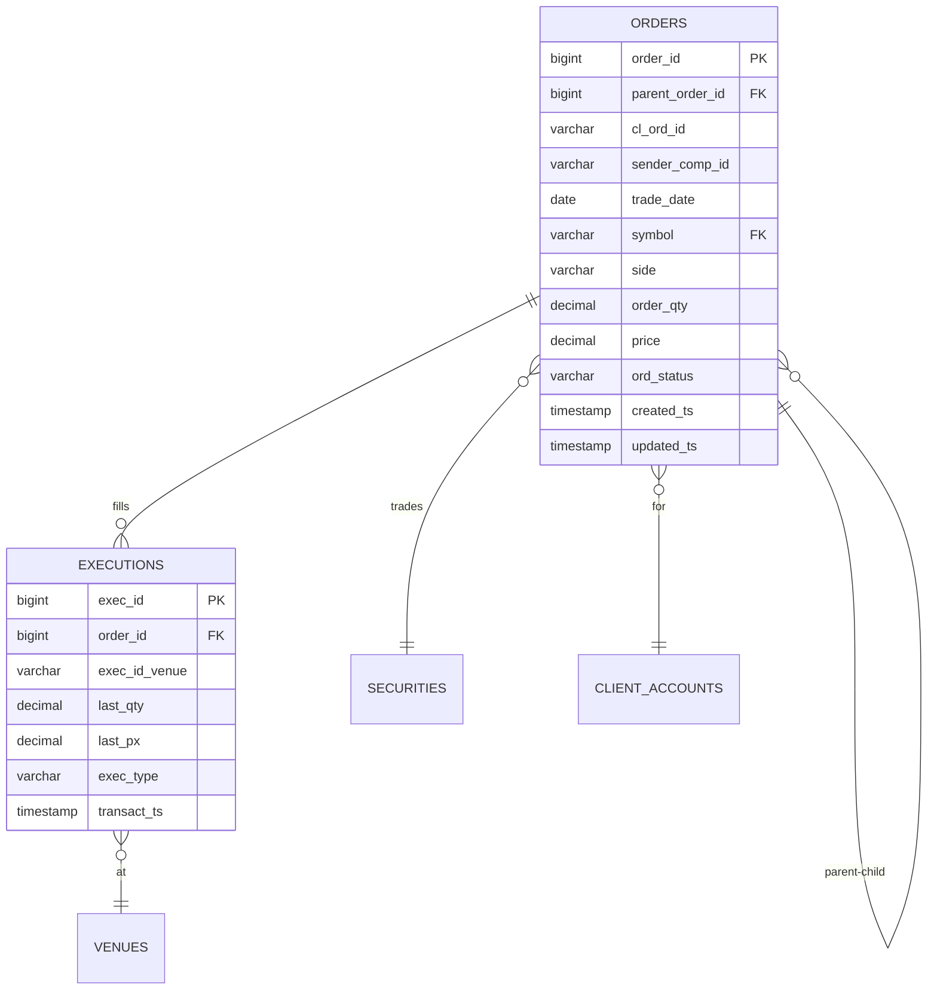
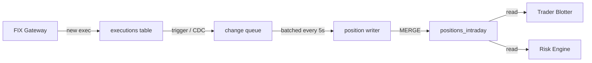

# 04 — SQL Comprehensive Q&A

> 100+ SQL questions for OMS/trading-support work. Covers joins, windows, tuning, isolation, vendor differences.

---

## 1. Joins — INNER/LEFT/RIGHT/FULL/CROSS/SELF/semi/anti EXISTS (10 Q&A)

### Q1. Walk me through the six join types and when you'd use each one in an OMS context.
**Interviewer signal:** Do you actually understand join semantics or just memorized keywords?
**Answer:**
- **INNER JOIN** — only matching rows on both sides. Use when I need orders that definitely have an execution: `orders o INNER JOIN executions e ON e.order_id = o.order_id`.
- **LEFT JOIN** — all rows from the left plus matches from the right. Use when I want every order and I want to see which ones are missing executions — the `NULL` on the right side is the diagnostic.
- **RIGHT JOIN** — mirror of LEFT. I rarely use it in practice; I just flip the tables so LEFT reads left-to-right.
- **FULL OUTER JOIN** — all rows from both sides. Use for reconciliation between our OMS state and the broker drop copy — I want to see orders present in one but not the other.
- **CROSS JOIN** — Cartesian product, no ON clause. Use it deliberately for calendar spines (dates × trader_ids to fill zero-fill rows in reports).
- **SELF JOIN** — table joined to itself. Use for parent/child basket links: `orders parent JOIN orders child ON child.parent_order_id = parent.order_id`.

**Watch-outs:** Candidates often say "LEFT gives all rows on the left." True, but the trap is filtering the right table in `WHERE` instead of the `ON` clause — that silently degrades a LEFT into an INNER.

---

### Q2. What's the difference between a filter in the `ON` clause versus the `WHERE` clause on an outer join?
**Interviewer signal:** Classic outer-join footgun. Do you know it?
**Answer:**
On an INNER join it doesn't matter. On an outer join it matters a lot.

- Predicates in `ON` filter the **right-hand rows before** the join — non-matches still produce a row with `NULL` on the right.
- Predicates in `WHERE` filter **after** the join. If the predicate references a right-side column, any row where that side is `NULL` gets dropped, silently turning the outer join into an inner join.

Example — I want all orders and today's fills only:

```sql
-- Correct: keeps orders with zero fills today
SELECT o.order_id, e.exec_qty
FROM orders o
LEFT JOIN executions e
  ON e.order_id = o.order_id
 AND e.exec_date = CURRENT_DATE;

-- Wrong: drops orders with no fill today
SELECT o.order_id, e.exec_qty
FROM orders o
LEFT JOIN executions e
  ON e.order_id = o.order_id
WHERE e.exec_date = CURRENT_DATE;
```

**Watch-outs:** The only exception is when you actually want an inner-join semantics — then `WHERE right.col IS NOT NULL` is a legitimate way to express it.

---

### Q3. What is a semi-join, and how do you write one in SQL?
**Interviewer signal:** Do you understand `EXISTS` semantics vs plain joins?
**Answer:**
A semi-join returns rows from the left table where **at least one** matching row exists on the right — but it does not duplicate rows if there are multiple matches, and it doesn't project columns from the right.

Three ways to express it:

```sql
-- EXISTS  (preferred — most explicit, short-circuits)
SELECT o.*
FROM orders o
WHERE EXISTS (SELECT 1 FROM executions e WHERE e.order_id = o.order_id);

-- IN  (fine for a single column, careful with NULLs)
SELECT o.*
FROM orders o
WHERE o.order_id IN (SELECT order_id FROM executions);

-- INNER JOIN with DISTINCT  (works but wasteful — you dedupe after joining)
SELECT DISTINCT o.*
FROM orders o
JOIN executions e ON e.order_id = o.order_id;
```

In production I default to `EXISTS` — the optimizer can stop scanning executions as soon as it finds one match per order, and it composes cleanly with correlated conditions like `AND e.exec_date = o.trade_date`.

**Watch-outs:** `IN (subquery)` returns unknown when the subquery contains `NULL`, which can silently drop rows in a `NOT IN`. `NOT EXISTS` doesn't have that trap.

---

### Q4. Anti-join — what is it and how do you write it? Give an OMS example.
**Interviewer signal:** Testing knowledge of `NOT EXISTS` vs `NOT IN` vs `LEFT JOIN … IS NULL`.
**Answer:**
An anti-join returns left rows that have **no** match on the right. In OMS reconciliation this is bread and butter: "orders in our system that the broker didn't acknowledge."

```sql
-- NOT EXISTS  (preferred — NULL-safe, fast)
SELECT o.order_id
FROM orders o
WHERE NOT EXISTS (
  SELECT 1 FROM broker_acks a
  WHERE a.client_order_id = o.client_order_id
);

-- LEFT JOIN + IS NULL  (equally fine, sometimes better on old optimizers)
SELECT o.order_id
FROM orders o
LEFT JOIN broker_acks a ON a.client_order_id = o.client_order_id
WHERE a.client_order_id IS NULL;

-- NOT IN  (DANGEROUS if the subquery can return NULL)
SELECT o.order_id
FROM orders o
WHERE o.client_order_id NOT IN (SELECT client_order_id FROM broker_acks);
```

**Watch-outs:** If `broker_acks.client_order_id` has even one `NULL`, `NOT IN` returns **zero rows** — because `x NOT IN (a, NULL)` evaluates to unknown. This has caused real prod incidents; I always use `NOT EXISTS`.

---

### Q5. Write a self-join to find orders and their parent basket order.
**Interviewer signal:** Self-join fluency, table aliasing.
**Answer:**
```sql
SELECT
  child.order_id       AS child_order_id,
  child.symbol,
  child.quantity,
  parent.order_id      AS basket_order_id,
  parent.basket_name,
  parent.trader_id
FROM orders child
LEFT JOIN orders parent
  ON parent.order_id = child.parent_order_id
WHERE child.trade_date = CURRENT_DATE
  AND child.parent_order_id IS NOT NULL;
```

Two aliases (`child`, `parent`) on the same physical table. `LEFT JOIN` because a standalone order has no parent — I still want to see it if I remove the `IS NOT NULL` filter. In our OMS this pattern surfaces the basket → child cascade during purge investigations.

**Watch-outs:** Forgetting to alias — `SELECT order_id FROM orders JOIN orders` fails on ambiguity. Also, deep hierarchies (parent → child → grandchild) need a recursive CTE, not a self-join.

---

### Q6. When would you deliberately use a CROSS JOIN?
**Interviewer signal:** Do you know it beyond "the accidental one that blows up prod"?
**Answer:**
Two legitimate cases in reporting:

1. **Calendar or dimension spines** — I need one row per (trader, business_date) even when the trader had no activity that day, so the fill-rate dashboard shows zeros instead of gaps.

```sql
SELECT t.trader_id, d.business_date, COALESCE(SUM(o.qty), 0) AS total_qty
FROM traders t
CROSS JOIN business_dates d
LEFT JOIN orders o
  ON o.trader_id = t.trader_id AND o.trade_date = d.business_date
WHERE d.business_date BETWEEN :start AND :end
GROUP BY t.trader_id, d.business_date;
```

2. **Parameter fan-out** — a single-row config table crossed against every symbol to produce per-symbol thresholds.

**Watch-outs:** An accidental CROSS JOIN (missing `ON`) between two million-row tables produces a trillion rows. Most modern parsers require `CROSS JOIN` to be explicit, but the old comma syntax `FROM a, b` will silently do it.

---

### Q7. What does a FULL OUTER JOIN give you, and give a real OMS use case.
**Interviewer signal:** Do you know how to do reconciliation in SQL?
**Answer:**
FULL OUTER returns matched rows plus unmatched rows from **both** sides, with `NULL` on the missing side. It's the canonical reconciliation query.

Every morning we reconcile OMS state against the broker's drop copy:

```sql
SELECT
  COALESCE(o.client_order_id, b.client_order_id) AS coid,
  o.status  AS oms_status,
  b.status  AS broker_status,
  CASE
    WHEN o.client_order_id IS NULL THEN 'MISSING_IN_OMS'
    WHEN b.client_order_id IS NULL THEN 'MISSING_AT_BROKER'
    WHEN o.status <> b.status     THEN 'STATUS_MISMATCH'
    ELSE 'MATCH'
  END AS recon_result
FROM oms_orders o
FULL OUTER JOIN broker_drop_copy b
  ON b.client_order_id = o.client_order_id
WHERE o.trade_date = CURRENT_DATE
   OR b.trade_date = CURRENT_DATE;
```

**Watch-outs:** Don't put `o.trade_date = CURRENT_DATE` alone in the `WHERE` — it kills the outer side. Use `OR` across both sides, or push the filter into the `ON`.

---

### Q8. Explain how a hash join, merge join, and nested loop join differ, and when the optimizer picks each.
**Interviewer signal:** Do you understand the execution side, not just the syntax?
**Answer:**
- **Nested loop** — for each row on the outer side, probe the inner side (ideally via index). Great when the outer is tiny (say, one trader) and the inner has a good index on the join key. Bad when both sides are big.
- **Hash join** — build an in-memory hash on the smaller side, then stream the bigger side against it. Great for equi-joins on large unsorted inputs. Costs memory; spills to disk if the build side exceeds `work_mem`.
- **Merge join** — sort both sides by the join key and walk them in lockstep. Great when both sides are already sorted (indexed) or when we're joining huge inputs where a hash won't fit.

The optimizer picks based on estimated cardinalities, available indexes, and memory budget. When a query goes from milliseconds to minutes overnight, it's usually stats going stale and the plan flipping from hash to nested loop over millions of rows.

**Watch-outs:** Nested loop over a non-indexed inner side scales quadratically. First thing I check on a slow query is the plan, then the join column stats.

---

### Q9. What happens with `NULL` in a join key?
**Interviewer signal:** Fundamental gotcha.
**Answer:**
`NULL = NULL` is not true — it's unknown. So rows with `NULL` in the join column never match, on inner or outer joins.

If I need `NULL`s to match each other — say, matching legs where an optional strategy_id is `NULL` on both sides — I have to be explicit:

```sql
ON (a.strategy_id = b.strategy_id
    OR (a.strategy_id IS NULL AND b.strategy_id IS NULL))
-- or, in Postgres/Oracle:
ON a.strategy_id IS NOT DISTINCT FROM b.strategy_id
```

**Watch-outs:** In `NOT IN` this bites hardest — a single `NULL` in the subquery zeros the whole result.

---

### Q10. Give me an interview-favorite: employees and managers self-join, but adapted to orders.
**Interviewer signal:** Can you compose a small non-trivial query on the fly?
**Answer:**
"For every child order, show the order and its parent's trader plus the parent's total notional across all children."

```sql
WITH parent_totals AS (
  SELECT parent_order_id, SUM(quantity * price) AS parent_notional
  FROM orders
  WHERE parent_order_id IS NOT NULL
  GROUP BY parent_order_id
)
SELECT
  c.order_id           AS child_id,
  c.symbol,
  p.trader_id          AS parent_trader,
  pt.parent_notional
FROM orders c
JOIN orders p
  ON p.order_id = c.parent_order_id
LEFT JOIN parent_totals pt
  ON pt.parent_order_id = p.order_id
WHERE c.trade_date = CURRENT_DATE;
```

Two techniques: self-join for the hierarchy, and a pre-aggregated CTE so I'm not doing a window sum inside the join.

**Watch-outs:** Don't compute the aggregate inside a correlated subquery in the SELECT list on a million-row table — it turns into a nested loop over the aggregate.

---

## 2. Subqueries — correlated vs uncorrelated (6 Q&A)

### Q1. Correlated vs uncorrelated subquery — define both.
**Interviewer signal:** Basic literacy.
**Answer:**
- **Uncorrelated** — the inner query is independent of the outer. It runs once, its result is used by the outer query. Example: `WHERE trader_id IN (SELECT trader_id FROM active_traders)`.
- **Correlated** — the inner query references a column from the outer query. Conceptually it re-executes per outer row. Example: `WHERE EXISTS (SELECT 1 FROM executions e WHERE e.order_id = o.order_id)`.

The optimizer doesn't always literally re-execute a correlated subquery — it often rewrites it as a semi-join or hash anti-join. But that's the mental model.

**Watch-outs:** A correlated scalar subquery in `SELECT` on a big table is a classic perf killer — always check the plan.

---

### Q2. Give an example where a correlated subquery is the natural expression.
**Interviewer signal:** Can you spot the pattern?
**Answer:**
"For each order, find its latest execution price."

```sql
SELECT
  o.order_id,
  (SELECT e.exec_price
   FROM executions e
   WHERE e.order_id = o.order_id
   ORDER BY e.exec_time DESC
   LIMIT 1) AS last_price
FROM orders o
WHERE o.trade_date = CURRENT_DATE;
```

Readable, correct — but scales badly. On a real prod table I'd rewrite it as a window function:

```sql
SELECT order_id, last_price FROM (
  SELECT o.order_id, e.exec_price AS last_price,
         ROW_NUMBER() OVER (PARTITION BY e.order_id ORDER BY e.exec_time DESC) AS rn
  FROM orders o
  JOIN executions e USING (order_id)
  WHERE o.trade_date = CURRENT_DATE
) t WHERE rn = 1;
```

**Watch-outs:** The correlated form is fine on a few hundred rows and clearer to read. Don't rewrite prematurely.

---

### Q3. Which is faster — `IN (subquery)` or `EXISTS (subquery)`?
**Interviewer signal:** Do you understand it depends?
**Answer:**
Modern optimizers usually rewrite both into the same semi-join plan, so performance is often identical. Historical rule of thumb:
- **`IN`** — inner runs once, result cached (good if inner is small).
- **`EXISTS`** — inner runs per outer row conceptually, can short-circuit (good if inner is huge and outer is small).

The real reason I pick `EXISTS`: it's null-safe on the negation (`NOT EXISTS`), it supports multi-column matches, and it can carry a correlated predicate. `IN` is only readable for a single-column check.

**Watch-outs:** Don't answer "always faster." It depends on the plan.

---

### Q4. What is a scalar subquery, and what's the risk?
**Interviewer signal:** Do you know it must return exactly one row?
**Answer:**
A scalar subquery is one that returns a single value (one row, one column) and is used inline like a column expression:

```sql
SELECT o.order_id,
       (SELECT name FROM traders t WHERE t.trader_id = o.trader_id) AS trader_name
FROM orders o;
```

Risks:
1. **More than one row** — runtime error (Postgres) or silent nondeterministic pick (some engines). Add a `LIMIT 1` and an `ORDER BY`, or ensure uniqueness.
2. **Zero rows** — returns `NULL`, which may propagate unexpectedly through downstream filters.
3. **Perf** — per outer row, so on a big table this can be a nested loop of subquery executions.

Usually a `LEFT JOIN` is cleaner and safer.

**Watch-outs:** "One row, one column." Two rows is an error, not a silent aggregation.

---

### Q5. Rewrite a correlated subquery as a join.
**Interviewer signal:** Refactoring fluency.
**Answer:**
"Orders where the last execution price is below the order limit."

Correlated:
```sql
SELECT o.*
FROM orders o
WHERE (SELECT MAX(e.exec_price) FROM executions e WHERE e.order_id = o.order_id) < o.limit_price;
```

Rewritten with a join:
```sql
SELECT o.*
FROM orders o
JOIN (
  SELECT order_id, MAX(exec_price) AS max_px
  FROM executions
  GROUP BY order_id
) x ON x.order_id = o.order_id
WHERE x.max_px < o.limit_price;
```

The join form pre-aggregates once. The optimizer can hash-join. The correlated form may or may not be rewritten depending on the engine — I always check `EXPLAIN`.

**Watch-outs:** The join form silently drops orders with no executions; the correlated `MAX` returns `NULL` for those, and `NULL < x` is unknown, so they're dropped too. Same behavior in this case — but not always. Test both.

---

### Q6. When is a subquery in the `FROM` clause (a derived table) the right tool?
**Interviewer signal:** Do you know when to use it vs a CTE?
**Answer:**
Any time I need to aggregate or window first, then join or filter. Two common cases:

1. **Pre-aggregation** — group first, then join, so I don't fan out then dedupe.
2. **Window then filter** — you can't put a window function in `WHERE` directly.

```sql
SELECT * FROM (
  SELECT order_id, symbol,
         ROW_NUMBER() OVER (PARTITION BY symbol ORDER BY quantity DESC) AS rn
  FROM orders
) t
WHERE rn <= 3;   -- top 3 orders per symbol
```

I'll use a CTE (`WITH`) when I need to reuse the derived table more than once or when readability matters. The two are semantically equivalent in modern engines (CTEs are no longer optimization fences in Postgres 12+).

**Watch-outs:** Old versions of Postgres materialized every CTE, which was sometimes a footgun. Know your version.

---

## 3. CTEs & recursive CTEs (parent-child order chains) (8 Q&A)

### Q1. What is a CTE and why use one over a subquery?
**Interviewer signal:** Baseline.
**Answer:**
A CTE (Common Table Expression) is a named, temporary result set introduced with `WITH` that lives for the duration of one statement:

```sql
WITH todays_orders AS (
  SELECT * FROM orders WHERE trade_date = CURRENT_DATE
)
SELECT * FROM todays_orders WHERE status = 'FILLED';
```

Reasons I reach for a CTE over a nested subquery:
- **Readability** — the query reads top-to-bottom in the order I think about it.
- **Reuse** — reference the same derived set multiple times without repeating SQL.
- **Recursion** — CTEs are the only way to write recursive SQL (parent/child chains).
- **Debugging** — I can comment out the final `SELECT` and inspect one CTE at a time.

**Watch-outs:** In older Postgres a CTE was an optimization fence — the planner couldn't push filters into it. That changed in PG 12 (unless you write `AS MATERIALIZED`).

---

### Q2. Anatomy of a recursive CTE.
**Interviewer signal:** Can you write one from scratch?
**Answer:**
A recursive CTE has two parts joined by `UNION ALL`:
1. **Anchor** — the base case, non-recursive.
2. **Recursive term** — references the CTE itself. Each iteration feeds its output back until it produces zero rows.

```sql
WITH RECURSIVE order_tree AS (
  -- anchor: the root basket order
  SELECT order_id, parent_order_id, symbol, 0 AS depth
  FROM orders
  WHERE order_id = :root_id

  UNION ALL

  -- recursive: children of the previous level
  SELECT o.order_id, o.parent_order_id, o.symbol, ot.depth + 1
  FROM orders o
  JOIN order_tree ot ON o.parent_order_id = ot.order_id
)
SELECT * FROM order_tree ORDER BY depth;
```

I keep three habits: track a `depth` column, cap recursion (or make sure cycles are impossible), and test on a small subtree first.

**Watch-outs:** Forgetting the `RECURSIVE` keyword (required in Postgres) or using `UNION` instead of `UNION ALL` — `UNION` dedupes each iteration and hurts perf.

---

### Q3. Walk a parent → child → grandchild basket cascade in an OMS.
**Interviewer signal:** Do you know your own domain in SQL?
**Answer:**
In our OMS a trader submits a basket; the basket spawns child orders per symbol; each child may spawn slices sent to different venues. That's three levels — I need recursion, not a self-join.

```sql
WITH RECURSIVE basket_cascade AS (
  SELECT
    order_id,
    parent_order_id,
    symbol,
    quantity,
    status,
    CAST(order_id AS VARCHAR(1000)) AS path,
    0 AS depth
  FROM orders
  WHERE order_id = :basket_id

  UNION ALL

  SELECT
    o.order_id,
    o.parent_order_id,
    o.symbol,
    o.quantity,
    o.status,
    bc.path || '/' || CAST(o.order_id AS VARCHAR(50)),
    bc.depth + 1
  FROM orders o
  JOIN basket_cascade bc ON o.parent_order_id = bc.order_id
)
SELECT depth, order_id, symbol, quantity, status, path
FROM basket_cascade
ORDER BY path;
```

The `path` column gives me a visual tree ordering. This is what I use during production support when a trader asks "why did my basket cancel — which leg died first?"

**Watch-outs:** If the basket has thousands of legs, the recursive scan can dominate the query. In practice I add `AND depth < 10` as a safety cap.

---

### Q4. How would you find all ancestors of a given child order (walk up the tree)?
**Interviewer signal:** Recursion direction awareness.
**Answer:**
Same shape as walking down, but the recursive join goes the other way — join the parent's row to the current row:

```sql
WITH RECURSIVE ancestors AS (
  SELECT order_id, parent_order_id, 0 AS level
  FROM orders
  WHERE order_id = :leaf_id

  UNION ALL

  SELECT p.order_id, p.parent_order_id, a.level + 1
  FROM orders p
  JOIN ancestors a ON a.parent_order_id = p.order_id
)
SELECT * FROM ancestors ORDER BY level;
```

Anchor is the leaf; each step climbs to the parent by matching `p.order_id = a.parent_order_id`. Terminates when `parent_order_id IS NULL`.

**Watch-outs:** If the schema stores `parent_order_id = order_id` for root orders (a nasty pattern), you get infinite recursion. Add a cycle guard: `AND p.order_id <> a.order_id`.

---

### Q5. How do you detect cycles in a recursive CTE?
**Interviewer signal:** Practical resilience.
**Answer:**
Two ways I use.

**Manual path tracking:**
```sql
WITH RECURSIVE walk AS (
  SELECT order_id, parent_order_id, ARRAY[order_id] AS visited
  FROM orders WHERE order_id = :root

  UNION ALL

  SELECT o.order_id, o.parent_order_id, w.visited || o.order_id
  FROM orders o
  JOIN walk w ON o.parent_order_id = w.order_id
  WHERE o.order_id <> ALL(w.visited)   -- guard
)
SELECT * FROM walk;
```

**Native cycle detection (SQL:2023, Postgres 14+):**
```sql
WITH RECURSIVE walk AS ( ... )
CYCLE order_id SET is_cycle USING cycle_path
SELECT * FROM walk WHERE NOT is_cycle;
```

For prod I stick with the array approach — portable across engines and explicit.

**Watch-outs:** Without a cycle guard, a bad data row (self-parenting order) hangs the query and pins CPU on the DB. I've seen it happen.

---

### Q6. Is a CTE materialized? What are the perf implications?
**Interviewer signal:** Optimizer awareness.
**Answer:**
Depends on the engine and version:
- **Postgres ≤11** — always materialized (optimization fence).
- **Postgres ≥12** — inlined by default unless the CTE is recursive, referenced multiple times, or uses `AS MATERIALIZED`.
- **Oracle** — inlined by default, hint `MATERIALIZE` to force.
- **SQL Server** — always inlined.

Two takeaways:
1. On modern Postgres, a CTE is stylistic — same plan as a subquery.
2. Sometimes I **want** materialization — when a CTE is expensive and reused three times downstream, `AS MATERIALIZED` prevents re-execution.

**Watch-outs:** Don't assume "CTEs are always slower" or "always faster." Read the plan on your engine and version.

---

### Q7. Write a query that returns each order's full ancestor path as a single string.
**Interviewer signal:** Recursion + string aggregation combined.
**Answer:**
```sql
WITH RECURSIVE ancestry AS (
  SELECT order_id, parent_order_id,
         CAST(order_id AS VARCHAR(4000)) AS path
  FROM orders WHERE parent_order_id IS NULL

  UNION ALL

  SELECT o.order_id, o.parent_order_id,
         a.path || ' > ' || CAST(o.order_id AS VARCHAR(50))
  FROM orders o
  JOIN ancestry a ON o.parent_order_id = a.order_id
)
SELECT order_id, path
FROM ancestry
WHERE order_id = :target;
```

Start at roots, descend, concatenate. Cheaper than climbing up per row.

**Watch-outs:** Watch the varchar length — long paths in deep hierarchies can truncate silently.

---

### Q8. When would a recursive CTE be the wrong tool?
**Interviewer signal:** Judgment call.
**Answer:**
- **Fixed depth known in advance** — three levels of basket → child → slice. A pair of joins is faster and simpler than recursion.
- **Very wide, shallow hierarchies** — a single-level parent/child fan-out is a self-join, not recursion.
- **When the DB doesn't support it** — MySQL only got it in 8.0. On older MySQL I've had to write a stored procedure loop.
- **Performance-critical hot path** — recursive CTEs can't be indexed against; on multi-million-row hierarchies with tight SLAs, a materialized closure table (denormalized ancestor list) may be the right architecture.

**Watch-outs:** Reach for the closure table pattern (ancestor, descendant, depth) when you're recursing millions of times a day; SQL recursion isn't cheap.

---

## 4. Window functions — ROW_NUMBER/RANK/DENSE_RANK/LAG/LEAD/FIRST_VALUE/LAST_VALUE/SUM OVER (12 Q&A)

### Q1. What is a window function and how is it different from `GROUP BY`?
**Interviewer signal:** Conceptual foundation.
**Answer:**
A window function computes a value across a set of rows related to the current row **without collapsing the rows**. `GROUP BY` collapses; window functions don't.

```sql
-- GROUP BY: one row per trader
SELECT trader_id, SUM(quantity) FROM orders GROUP BY trader_id;

-- Window: every order, plus that trader's total alongside it
SELECT order_id, trader_id, quantity,
       SUM(quantity) OVER (PARTITION BY trader_id) AS trader_total
FROM orders;
```

Every window function has three optional parts:
- `PARTITION BY` — reset the calculation per group.
- `ORDER BY` — order within the partition (required for ranking, LAG/LEAD, and for a moving frame).
- Frame clause (`ROWS BETWEEN … AND …` or `RANGE BETWEEN …`) — the sub-window of rows to aggregate over.

**Watch-outs:** No frame clause with `ORDER BY` on `SUM` defaults to `RANGE UNBOUNDED PRECEDING AND CURRENT ROW` — a running total, not the partition total. Bites people constantly.

---

### Q2. ROW_NUMBER vs RANK vs DENSE_RANK — walk through the difference.
**Interviewer signal:** Do you actually know the tie behavior?
**Answer:**
All three assign an integer per row in a partition, ordered by the `ORDER BY`. They differ on ties:

| Row values | ROW_NUMBER | RANK | DENSE_RANK |
|-----------:|-----------:|-----:|-----------:|
| 100        | 1          | 1    | 1          |
| 100        | 2          | 1    | 1          |
| 90         | 3          | 3    | 2          |
| 80         | 4          | 4    | 3          |

- **ROW_NUMBER** — unique, arbitrary tiebreak. Use when you need to pick exactly one row per group (e.g., latest execution per order).
- **RANK** — ties share, next rank skips (1,1,3,4). Use for competition-style ranking where a tie for first means no second place.
- **DENSE_RANK** — ties share, no gap (1,1,2,3). Use when you want contiguous rank labels.

**Watch-outs:** ROW_NUMBER's tiebreak is nondeterministic unless you add a unique secondary sort. `ORDER BY qty DESC, order_id` — always resolve ties explicitly.

---

### Q3. Give the canonical "latest row per group" query.
**Interviewer signal:** Do you know the top-1-per-group pattern?
**Answer:**
"Latest execution per order":

```sql
SELECT *
FROM (
  SELECT e.*,
         ROW_NUMBER() OVER (PARTITION BY order_id ORDER BY exec_time DESC, exec_id DESC) AS rn
  FROM executions e
) t
WHERE rn = 1;
```

I put a deterministic secondary key in the `ORDER BY` (`exec_id`) so ties don't produce nondeterministic answers across runs. This is the single most-used window pattern in OMS support — "what's the current fill state of this order."

**Watch-outs:** People try `MAX(exec_time) GROUP BY order_id` and then join back — works, but is one extra scan.

---

### Q4. Explain LAG and LEAD with an OMS example.
**Interviewer signal:** Practical fluency.
**Answer:**
`LAG(col, n, default)` returns the value from `n` rows before the current row within the partition, ordered by the `ORDER BY`. `LEAD` looks forward.

"For each execution, what was the price on the previous fill of that order?"

```sql
SELECT
  order_id,
  exec_id,
  exec_time,
  exec_price,
  LAG(exec_price)  OVER (PARTITION BY order_id ORDER BY exec_time) AS prev_price,
  LEAD(exec_price) OVER (PARTITION BY order_id ORDER BY exec_time) AS next_price,
  exec_price - LAG(exec_price) OVER (PARTITION BY order_id ORDER BY exec_time) AS price_delta
FROM executions;
```

This is my go-to for gap detection — "why did the fill price jump 5 bps between executions." I've used it during a trader escalation about volatile fills into an illiquid name.

**Watch-outs:** The first row per partition returns `NULL` for `LAG` unless you supply the third argument (`LAG(exec_price, 1, 0)`).

---

### Q5. Explain FIRST_VALUE and LAST_VALUE, and the LAST_VALUE gotcha.
**Interviewer signal:** Frame clause awareness.
**Answer:**
`FIRST_VALUE(col)` returns the first value in the window frame, `LAST_VALUE(col)` the last.

The gotcha: with `ORDER BY` and no explicit frame, the default frame is `RANGE BETWEEN UNBOUNDED PRECEDING AND CURRENT ROW`. So `LAST_VALUE` returns the **current row**, not the last row of the partition.

```sql
-- WRONG: returns current row's exec_price
SELECT order_id, exec_price,
       LAST_VALUE(exec_price) OVER (PARTITION BY order_id ORDER BY exec_time) AS last_px
FROM executions;

-- RIGHT: explicit frame
SELECT order_id, exec_price,
       LAST_VALUE(exec_price) OVER (
         PARTITION BY order_id
         ORDER BY exec_time
         ROWS BETWEEN UNBOUNDED PRECEDING AND UNBOUNDED FOLLOWING
       ) AS last_px
FROM executions;
```

Alternative: use `FIRST_VALUE(exec_price) OVER (PARTITION BY order_id ORDER BY exec_time DESC)`.

**Watch-outs:** This is the single most common window bug I see in code reviews.

---

### Q6. Explain SUM OVER — running total vs partition total.
**Interviewer signal:** Frame clause fluency.
**Answer:**
Same function, three different meanings depending on the frame:

```sql
-- 1. Partition total (SUM over whole partition, appears on every row)
SUM(quantity) OVER (PARTITION BY order_id)

-- 2. Running total (cumulative up to current row)
SUM(quantity) OVER (PARTITION BY order_id ORDER BY exec_time
                    ROWS BETWEEN UNBOUNDED PRECEDING AND CURRENT ROW)

-- 3. Moving window (last 3 rows)
SUM(quantity) OVER (PARTITION BY order_id ORDER BY exec_time
                    ROWS BETWEEN 2 PRECEDING AND CURRENT ROW)
```

Rule: no `ORDER BY` → whole partition. With `ORDER BY` and no frame → running total. With explicit frame → whatever you specified. I make it a habit to always spell the frame out.

**Watch-outs:** `RANGE` vs `ROWS` — `ROWS` counts rows, `RANGE` groups rows with equal `ORDER BY` values. For sums over prices, always use `ROWS` unless you know why you want `RANGE`.

---

### Q7. Compute the cumulative filled quantity per order.
**Interviewer signal:** Everyday OMS SQL.
**Answer:**
```sql
SELECT
  order_id,
  exec_id,
  exec_time,
  exec_qty,
  SUM(exec_qty) OVER (
    PARTITION BY order_id
    ORDER BY exec_time, exec_id
    ROWS BETWEEN UNBOUNDED PRECEDING AND CURRENT ROW
  ) AS cum_filled_qty,
  o.quantity AS order_qty,
  o.quantity - SUM(exec_qty) OVER (
    PARTITION BY order_id
    ORDER BY exec_time, exec_id
    ROWS BETWEEN UNBOUNDED PRECEDING AND CURRENT ROW
  ) AS remaining_qty
FROM executions e
JOIN orders o USING (order_id);
```

I include `exec_id` as a secondary sort so the running total is deterministic when two fills share the same timestamp.

**Watch-outs:** If you leave the frame off, some engines default to `RANGE`, which lumps same-timestamp fills together — the running total jumps in blocks. Explicit `ROWS` avoids the surprise.

---

### Q8. Compute a 5-execution moving average of fill price.
**Interviewer signal:** Sliding window.
**Answer:**
```sql
SELECT
  order_id,
  exec_id,
  exec_time,
  exec_price,
  AVG(exec_price) OVER (
    PARTITION BY order_id
    ORDER BY exec_time
    ROWS BETWEEN 4 PRECEDING AND CURRENT ROW
  ) AS ma5
FROM executions;
```

The frame `ROWS BETWEEN 4 PRECEDING AND CURRENT ROW` includes 5 rows total (4 back + current). For a centered moving average, use `2 PRECEDING AND 2 FOLLOWING`.

**Watch-outs:** For the first 4 rows in a partition, `ma5` is computed over fewer rows — an average of 1, 2, 3, 4 rows respectively. If you need a "full window only" filter, wrap in a subquery and filter on `ROW_NUMBER() >= 5`.

---

### Q9. NTILE — what is it and when would you use it?
**Interviewer signal:** Less-common window functions.
**Answer:**
`NTILE(n)` divides the ordered partition into `n` roughly equal buckets and assigns each row its bucket number. I use it for **quantile bucketing** — "put every trader's daily notional into deciles":

```sql
SELECT trader_id, daily_notional,
       NTILE(10) OVER (ORDER BY daily_notional) AS decile
FROM daily_trader_notionals;
```

Also useful for spreading a batch job across N workers — bucket the workload evenly.

**Watch-outs:** If the partition isn't evenly divisible, the earlier buckets get one extra row. Fine for stats, don't rely on it for exact-size chunks.

---

### Q10. Difference between `PARTITION BY` and `GROUP BY`?
**Interviewer signal:** Sharpening a concept.
**Answer:**
- `GROUP BY` collapses rows — one output row per group.
- `PARTITION BY` scopes a window function — every input row survives; the calculation resets at partition boundaries.

They can appear in the same query:

```sql
SELECT trader_id,
       COUNT(*) AS total_orders,
       COUNT(*) FILTER (WHERE status = 'FILLED')
         * 100.0 / COUNT(*) AS fill_pct,
       SUM(COUNT(*)) OVER () AS grand_total
FROM orders
GROUP BY trader_id;
```

Here the window function `SUM(COUNT(*)) OVER ()` operates on the grouped output — I get per-trader counts plus a grand total on each row.

**Watch-outs:** You can't reference a window function in a `WHERE` clause of the same level — window functions are computed after `WHERE`. Wrap in a subquery.

---

### Q11. Percentiles — PERCENT_RANK, CUME_DIST, PERCENTILE_CONT.
**Interviewer signal:** Statistical window familiarity.
**Answer:**
- `PERCENT_RANK()` — `(rank - 1) / (partition_rows - 1)`. Range 0..1.
- `CUME_DIST()` — fraction of rows with a value ≤ current row. Range (0,1].
- `PERCENTILE_CONT(p) WITHIN GROUP (ORDER BY col)` — the actual value at percentile `p`, interpolated. This is an **ordered-set aggregate**, not a window function, but often paired with window syntax via `OVER (PARTITION BY …)`.

Example — 95th percentile latency per venue:

```sql
SELECT venue,
       PERCENTILE_CONT(0.95) WITHIN GROUP (ORDER BY ack_latency_ms) AS p95_latency
FROM broker_acks
GROUP BY venue;
```

I run this daily for connectivity monitoring.

**Watch-outs:** `PERCENTILE_CONT` interpolates between the two nearest values. `PERCENTILE_DISC` picks the exact row. For continuous distributions use `CONT`; for discrete outcomes use `DISC`.

---

### Q12. Named windows — what are they and why bother?
**Interviewer signal:** Do you know the WINDOW clause?
**Answer:**
If I use the same window spec in multiple functions, I name it once with `WINDOW`:

```sql
SELECT
  order_id,
  exec_id,
  exec_price,
  LAG(exec_price)  OVER w AS prev_px,
  LEAD(exec_price) OVER w AS next_px,
  AVG(exec_price)  OVER w AS run_avg
FROM executions
WINDOW w AS (PARTITION BY order_id ORDER BY exec_time
             ROWS BETWEEN UNBOUNDED PRECEDING AND CURRENT ROW);
```

DRY, and easier to change one spec than three. Supported in Postgres, SQL Server (2022+), Oracle, MySQL 8.

**Watch-outs:** Some engines (older SQL Server) don't support the `WINDOW` clause; you'll have to repeat.

---

## 5. Aggregates & GROUPING (ROLLUP/CUBE/GROUPING SETS) (6 Q&A)

### Q1. What's the difference between ROLLUP, CUBE, and GROUPING SETS?
**Interviewer signal:** Do you know the OLAP extensions?
**Answer:**
All three produce multiple aggregation levels in a single query.

- **ROLLUP(a, b, c)** — hierarchical subtotals: `(a,b,c), (a,b), (a), ()`. Great for time hierarchies (year → quarter → month) or org hierarchies (region → country → office).
- **CUBE(a, b, c)** — every combination: 2^n groupings. Great when the dimensions are independent — e.g., (venue × side × strategy).
- **GROUPING SETS((a,b), (a), (c))** — you list exactly which combinations you want. Great when you only need a few specific rollups.

```sql
SELECT venue, side, SUM(qty)
FROM executions
GROUP BY GROUPING SETS ((venue, side), (venue), (side), ());
```

Result: totals by (venue, side), by venue, by side, and a grand total — all in one pass.

**Watch-outs:** `CUBE(n)` produces `2^n` grouping combinations. `CUBE(5)` = 32 groups — sometimes not what you want on a big fact table.

---

### Q2. What is `GROUPING()` used for?
**Interviewer signal:** Do you know how to tell subtotal rows apart?
**Answer:**
When you use `ROLLUP` or `CUBE`, aggregated levels have `NULL` in the columns that were rolled up. But the raw data might also legitimately contain `NULL`. `GROUPING(col)` returns 1 if that column's `NULL` in the current row is because of aggregation, 0 if it's a real data `NULL`.

```sql
SELECT
  CASE WHEN GROUPING(venue) = 1 THEN 'ALL VENUES' ELSE venue END AS venue,
  CASE WHEN GROUPING(side)  = 1 THEN 'ALL SIDES'  ELSE side  END AS side,
  SUM(qty)
FROM executions
GROUP BY ROLLUP(venue, side);
```

That produces nicely labeled subtotal and grand-total rows instead of ambiguous `NULL`s.

**Watch-outs:** `GROUPING_ID(a,b,c)` returns a bitmask instead of separate `GROUPING()` calls — one integer per row telling you which columns are rolled up. Handy for filtering to only certain subtotal levels.

---

### Q3. Aggregate functions with `FILTER` — what and why?
**Interviewer signal:** Modern SQL fluency.
**Answer:**
`FILTER (WHERE …)` lets you apply a per-aggregate predicate without wrapping in `CASE`:

```sql
SELECT
  trader_id,
  COUNT(*) AS total_orders,
  COUNT(*) FILTER (WHERE status = 'FILLED')     AS filled,
  COUNT(*) FILTER (WHERE status = 'CANCELLED')  AS cancelled,
  SUM(quantity) FILTER (WHERE side = 'BUY')     AS buy_qty,
  SUM(quantity) FILTER (WHERE side = 'SELL')    AS sell_qty
FROM orders
GROUP BY trader_id;
```

Cleaner and often faster than the `SUM(CASE WHEN … THEN … END)` idiom. Postgres, SQL:2003 standard, Oracle 12c+, SQL Server via a workaround.

**Watch-outs:** SQL Server doesn't support `FILTER` — you have to fall back to `SUM(CASE …)`.

---

### Q4. `HAVING` vs `WHERE` — spell it out.
**Interviewer signal:** Foundational.
**Answer:**
- `WHERE` filters **rows before** aggregation.
- `HAVING` filters **groups after** aggregation.

You can reference aggregate functions in `HAVING`, not in `WHERE`:

```sql
SELECT trader_id, SUM(quantity) AS total_qty
FROM orders
WHERE trade_date = CURRENT_DATE          -- filter rows
GROUP BY trader_id
HAVING SUM(quantity) > 1000000;          -- filter groups
```

Put every non-aggregate condition in `WHERE` for perf — you reduce the row count before grouping.

**Watch-outs:** `HAVING COUNT(*) > 5` is fine. `HAVING status = 'FILLED'` should be in `WHERE`.

---

### Q5. Distinct in aggregates — cost and correctness.
**Interviewer signal:** Do you think about the cost?
**Answer:**
`COUNT(DISTINCT col)` and `SUM(DISTINCT col)` are correct but expensive — they force the engine to dedupe before aggregating, usually via a sort or hash. On a billion-row table with a wide column, it's a heavy operation.

Alternatives:
- Pre-dedupe in a subquery, then aggregate.
- On engines that support it, `COUNT(DISTINCT ...)` may be rewritten into a `HashAggregate` — check the plan.
- For approximate counts, use `APPROX_COUNT_DISTINCT` (Snowflake, BigQuery, PG via `hll` extension).

**Watch-outs:** Multiple `COUNT(DISTINCT)`s in one SELECT explode — each one is a separate sort/hash. Consider splitting into multiple CTEs.

---

### Q6. Give a real OMS reporting query using GROUPING SETS.
**Interviewer signal:** Can you compose it?
**Answer:**
"Daily execution report — totals by (venue, side), by venue only, by side only, and grand total, in one query":

```sql
SELECT
  COALESCE(venue, 'ALL VENUES')          AS venue,
  COALESCE(side,  'ALL SIDES')           AS side,
  COUNT(*)                               AS exec_count,
  SUM(exec_qty)                          AS total_qty,
  SUM(exec_qty * exec_price)             AS notional,
  GROUPING_ID(venue, side)               AS grouping_level
FROM executions
WHERE exec_date = CURRENT_DATE
GROUP BY GROUPING SETS ((venue, side), (venue), (side), ())
ORDER BY grouping_level, venue, side;
```

The `grouping_level` column (0 = venue+side, 1 = venue only, 2 = side only, 3 = grand total) lets the downstream report engine style each row appropriately. One pass, one plan, cleaner than four `UNION ALL`s.

**Watch-outs:** Ordering matters for readability — grouping_level first so subtotals cluster together, then the dimension keys.
## 6. Set operators — UNION vs UNION ALL, INTERSECT, EXCEPT (4 Q&A)

### Q1. What's the difference between `UNION` and `UNION ALL`, and which do you reach for in practice?
**Interviewer signal:** Do you know the perf cost of the default?
**Answer:**
`UNION` concatenates two result sets and then removes duplicates — that requires an implicit sort or hash-distinct pass. `UNION ALL` just concatenates, no dedup. On an OMS reconciliation query where I'm merging today's orders from the primary DB with orders from the DR replica, `UNION ALL` is almost always what I want — I *know* the sets are disjoint by source, and the dedup step on millions of rows is pure overhead. I only use `UNION` when the sets can genuinely overlap and I need distinct rows — for example, unioning two views of "orders touched today" from different subsystems.
```sql
-- Reconcile: 20M rows, disjoint by source. UNION ALL is ~5x faster.
SELECT order_id, 'PRIMARY' AS src FROM orders_today
UNION ALL
SELECT order_id, 'DR'      AS src FROM orders_today_dr;
```
**Watch-outs:** Candidates default to `UNION` "to be safe" — that's the wrong instinct. Default should be `UNION ALL` and only add the dedup when the requirement demands it.

---

### Q2. What column-level rules apply to set operators?
**Interviewer signal:** Basic correctness — will their query even compile?
**Answer:**
Three rules: same number of columns on both sides, compatible data types in matching positions, and column names are taken from the **first** query. Order-by applies to the whole result and must reference the first query's column names or ordinal positions. NULLs are treated as equal for dedup in `UNION` — two rows with `NULL` in the same slot collapse to one.
**Watch-outs:** People try to `ORDER BY` a column from the second query — parser rejects it. Use the first query's column name or `ORDER BY 1`.

---

### Q3. Explain `INTERSECT` and `EXCEPT` with an OMS example.
**Interviewer signal:** Do you know these exist and when to use them over joins?
**Answer:**
`INTERSECT` returns rows present in **both** queries; `EXCEPT` (Postgres/SQL Server) or `MINUS` (Oracle) returns rows in the first but not the second. Both dedup by default. The classic OMS reconciliation:
```sql
-- Orders in our OMS but missing from the broker drop copy
SELECT order_id FROM oms_orders_today
EXCEPT
SELECT order_id FROM broker_drop_copy_today;
```
I could write the same thing with `LEFT JOIN ... WHERE right.id IS NULL` or `NOT EXISTS`. In practice `NOT EXISTS` is often the fastest on large tables because the optimizer can short-circuit on the first match; `EXCEPT` has to materialize both sides and dedup. But `EXCEPT` reads cleaner in ad-hoc reconciliation scripts.
**Watch-outs:** Oracle spells it `MINUS`, not `EXCEPT`. Some candidates get burned porting scripts between engines.

---

### Q4. Set operators dedup — how do they treat `NULL`?
**Interviewer signal:** Three-valued logic under set operators.
**Answer:**
This is the one place in SQL where `NULL = NULL` effectively holds. `UNION`, `INTERSECT`, and `EXCEPT` all treat two `NULL`s in the same column position as equal for dedup purposes. That's different from `WHERE a = b` or a join predicate, where `NULL = NULL` is `UNKNOWN` and the row is dropped. So two rows `(1, NULL)` from either side of a `UNION` collapse to one row, but the same two rows would *not* match on `t1.a = t2.a AND t1.b = t2.b`.
**Watch-outs:** Interviewers love this asymmetry — it's a favorite trick question.

---

## 7. NULLs & three-valued logic — ISNULL/COALESCE/NULLIF (6 Q&A)

### Q1. Explain three-valued logic and why `WHERE col = NULL` returns zero rows.
**Interviewer signal:** Fundamental SQL semantics.
**Answer:**
SQL boolean logic has three values: `TRUE`, `FALSE`, `UNKNOWN`. Any comparison with `NULL` — `col = NULL`, `col <> NULL`, `col > 5` when `col IS NULL` — yields `UNKNOWN`. The `WHERE` clause only keeps rows where the predicate is `TRUE`; `UNKNOWN` rows are filtered out. That's why you must write `WHERE col IS NULL` or `IS NOT NULL` — those are the only operators that return `TRUE`/`FALSE` against `NULL`. In OMS work I've seen developers write `WHERE cancel_reason <> 'CLIENT'` expecting to see orders where the reason is null or something else — but rows with `NULL` cancel_reason are silently dropped.
**Watch-outs:** `NOT IN (subquery)` with a `NULL` in the subquery returns **zero rows** — same trap. Use `NOT EXISTS` to be safe.

---

### Q2. `ISNULL` vs `COALESCE` vs `NVL` — which and when?
**Interviewer signal:** Know the vendor differences and the type-precedence gotcha.
**Answer:**
- `COALESCE(a, b, c, ...)` — ANSI standard, takes any number of args, returns the first non-null. Portable across Oracle, Postgres, SQL Server, DB2.
- `ISNULL(a, b)` — SQL Server / Sybase two-arg form. On SQL Server, `ISNULL` returns the type of the **first** argument and truncates the second silently — `ISNULL(CAST('AB' AS VARCHAR(2)), 'ABCDE')` returns `'AB'` for a NULL first arg. That's a bug factory.
- `NVL(a, b)` — Oracle two-arg. Oracle also has `NVL2(a, b, c)` — if `a` is non-null return `b` else `c`.

I default to `COALESCE` for portability and because it uses standard type-precedence rules — the result type is the highest precedence of all inputs.
**Watch-outs:** The `ISNULL` truncation bug on SQL Server is a real production issue — I flag it in code review every time.

---

### Q3. What does `NULLIF` do and where is it useful?
**Interviewer signal:** Do you know the inverse operator?
**Answer:**
`NULLIF(a, b)` returns `NULL` if `a = b`, otherwise returns `a`. It's the inverse of `COALESCE` in a sense — turn a sentinel value into `NULL`. Two uses:
1. **Divide-by-zero guard:** `SELECT total_notional / NULLIF(fill_qty, 0) FROM ...` — no exception, just `NULL`.
2. **Sentinel normalization:** upstream feed sends `'N/A'` or `''` for missing values; `NULLIF(client_id, '')` normalizes empty strings to `NULL` before load.

**Watch-outs:** People overuse it and end up with `NULL`s propagating through aggregates in ways they didn't expect.

---

### Q4. How do aggregate functions treat `NULL`?
**Interviewer signal:** Know why `COUNT(*)` and `COUNT(col)` differ.
**Answer:**
Aggregates — `SUM`, `AVG`, `MIN`, `MAX`, `COUNT(col)` — **ignore** `NULL`s. Only `COUNT(*)` counts every row including nulls. So `AVG(commission)` on 10 rows where 3 are null returns the sum of 7 divided by 7, not by 10. That surprises people. If you want nulls treated as zero, wrap in `COALESCE(commission, 0)` before aggregating. And `SUM` over a set of all nulls returns `NULL`, not `0` — another gotcha in reports where "no data" should show as zero.
```sql
-- Show 0 when no commissions, not NULL:
SELECT COALESCE(SUM(commission), 0) FROM executions WHERE trade_date = ?;
```
**Watch-outs:** `COUNT(DISTINCT col)` also ignores `NULL` — a common source of "count doesn't match" tickets.

---

### Q5. `NOT IN` versus `NOT EXISTS` with nullable columns — what's the trap?
**Interviewer signal:** Classic three-valued logic bug.
**Answer:**
If the subquery in `NOT IN` returns any `NULL`, the whole predicate becomes `UNKNOWN` for every row and you get **zero rows** back. Because `x NOT IN (1, 2, NULL)` expands to `x <> 1 AND x <> 2 AND x <> NULL`, and the last term is `UNKNOWN`.

```sql
-- Buggy: if any cancelled_order_id is NULL, returns 0 rows
SELECT order_id FROM orders
WHERE order_id NOT IN (SELECT cancelled_order_id FROM cancels);

-- Safe:
SELECT o.order_id FROM orders o
WHERE NOT EXISTS (SELECT 1 FROM cancels c WHERE c.cancelled_order_id = o.order_id);
```
`NOT EXISTS` uses row-by-row correlation and doesn't have the null-propagation problem.
**Watch-outs:** I default to `NOT EXISTS` for anti-joins. It's also usually the same or better plan.

---

### Q6. Can you index a nullable column, and does the index help with `IS NULL` queries?
**Interviewer signal:** Practical index behaviour on nulls — vendor-dependent.
**Answer:**
Depends on the engine.
- **Postgres:** B-tree indexes include `NULL` entries by default, and `WHERE col IS NULL` can use the index. You can also create a partial index `WHERE col IS NULL` for a small "unclaimed orders" set.
- **Oracle:** B-tree indexes do **not** store rows where all indexed columns are `NULL`. So `WHERE col IS NULL` won't use a single-column B-tree — you need a function-based index on `NVL(col, 'X')` or a composite that includes a NOT NULL column.
- **SQL Server:** stores `NULL`s in the index and supports `IS NULL` scans; filtered indexes `WHERE col IS NULL` are the cleaner solution.

In OMS work this matters when scanning for orders with `NULL parent_order_id` — the "top-level orders" query. On Oracle we had to add a function-based index to fix that scan.
**Watch-outs:** "Indexes don't work on nulls" is the folklore — it's only fully true on Oracle single-column B-tree.

---

## 8. Indexes — B-tree, bitmap, composite, covering, partial, function-based (10 Q&A)

### Q1. Explain a B-tree index and why it's the default.
**Interviewer signal:** Baseline structural understanding.
**Answer:**
A B-tree (really B+ tree in most engines) is a balanced multi-way search tree. Internal nodes hold key ranges and pointers to child pages; leaf nodes hold the indexed keys and either the row locator (heap-organized tables) or the full row (clustered index in SQL Server / index-organized table in Oracle). Depth grows logarithmically, so 100M rows fits in about 4 levels — a lookup is 4 page reads, largely cached. B-trees support equality (`=`), range (`<`, `>`, `BETWEEN`), prefix `LIKE 'ABC%'`, and `ORDER BY` on the leading key. That covers 90% of OMS access patterns — order lookup by ID, executions by (order_id, exec_time), positions by (trader_id, symbol).
**Watch-outs:** Don't confuse with binary search tree — B-tree nodes hold many keys per page (usually 100–500) to minimize IO.

---

### Q2. When is a bitmap index the right choice, and when is it disastrous?
**Interviewer signal:** Do you know the OLTP vs OLAP distinction?
**Answer:**
Bitmap indexes store one bit per row per distinct value — great for **low-cardinality** columns queried in complex AND/OR combinations, because bitmaps AND/OR together with fast bitwise ops. Perfect for a data warehouse: `WHERE region = 'EMEA' AND product = 'EQ' AND status = 'FILLED'` on billions of rows.

Disastrous in OLTP. Any DML that touches a bitmap has to lock a whole bitmap segment covering many rows, so concurrent updates serialize. On our OMS `orders` table with 500 fills per second, a bitmap on `status` would deadlock immediately. Oracle supports them; Postgres doesn't have persistent bitmap indexes (only in-memory bitmap scans built at query time from B-trees).
**Watch-outs:** "Low cardinality means use a bitmap" is a warehouse rule — never apply it to a hot OLTP table.

---

### Q3. What is a composite index and how does column order matter?
**Interviewer signal:** Understanding of leftmost-prefix rule.
**Answer:**
A composite index is a B-tree keyed on multiple columns in a defined order. The leftmost-prefix rule: an index on `(A, B, C)` supports predicates on `A`, `(A, B)`, or `(A, B, C)`, but **not** `B` alone or `(B, C)`. Range predicates on a leading column disable index use for trailing columns.

On our `executions` table, `(order_id, exec_time)` supports:
- `WHERE order_id = ?` — good, seek on `order_id`.
- `WHERE order_id = ? AND exec_time > ?` — good, seek+range.
- `WHERE exec_time > ?` alone — **cannot** use this index effectively (only a full index scan, no seek).

Column order should follow: equality-filtered columns first, then range-filtered, then columns needed for `ORDER BY` or covering.
**Watch-outs:** Optimizers can do "index skip scan" (Oracle) when the leading column has low cardinality, but don't rely on it — order the columns correctly.

---

### Q4. What is a covering index and when should you build one?
**Interviewer signal:** Do you know the "avoid heap lookup" pattern?
**Answer:**
A covering index contains all columns the query needs, so the engine can answer the query from the index alone without going to the base table. In SQL Server you use `INCLUDE` to add non-key columns; in Postgres 11+ you use `INCLUDE`; in MySQL you just add them to the index key. The plan shows "Index Only Scan" (Postgres) or "no key lookup" (SQL Server) — that's the goal.

Real example: a trader blotter query `SELECT order_id, symbol, side, qty FROM orders WHERE trader_id = ? AND order_date = CURRENT_DATE` — index on `(trader_id, order_date) INCLUDE (order_id, symbol, side, qty)` turned a 200ms scan into 2ms because it eliminated the heap probe for every row.
**Watch-outs:** Covering indexes add write cost — every update to an included column rewrites the index leaf. Only cover queries that are hot and reads dominate.

---

### Q5. What is a partial index and how does it help?
**Interviewer signal:** Do you know how to index a subset?
**Answer:**
A partial index (Postgres) or filtered index (SQL Server) is a B-tree that only stores rows matching a `WHERE` predicate. Great when you care about a small subset — for example, "open orders" out of 5 years of history.

```sql
-- Postgres: only 50k live orders indexed, not 500M archived
CREATE INDEX idx_open_orders ON orders (trader_id, symbol)
WHERE order_status IN ('NEW', 'PARTIAL');
```
The index is a fraction of the size, faster to scan, and cheaper to maintain because DML on closed orders doesn't touch it. Oracle simulates it with function-based indexes on `CASE` expressions.
**Watch-outs:** The query planner will only use the partial index if the query's predicate is provably contained in the index's predicate. `WHERE order_status = 'NEW'` — works. `WHERE order_status <> 'FILLED'` — the planner may not prove containment.

---

### Q6. What is a function-based (expression) index?
**Interviewer signal:** Do you know how to index around a wrapped column?
**Answer:**
An index on the result of a function or expression, not the raw column. Useful when the query wraps the column in a function — the plain index can't be used. Example: a case-insensitive symbol search:
```sql
CREATE INDEX idx_orders_symbol_upper ON orders (UPPER(symbol));
-- Query then uses the index:
SELECT * FROM orders WHERE UPPER(symbol) = 'AAPL';
```
Common uses in OMS: `LOWER(client_id)`, `TRUNC(exec_time)` for date-only lookups, `COALESCE(parent_order_id, order_id)` to index the "effective parent."
**Watch-outs:** The query has to use the **exact** expression from the index for it to match. `WHERE UPPER(symbol) = 'AAPL'` matches; `WHERE symbol = 'AAPL'` does not.

---

### Q7. When does an index hurt performance?
**Interviewer signal:** Do you understand the write-amplification cost?
**Answer:**
Every DML — INSERT, UPDATE, DELETE — must maintain every index on the table. On a hot OMS table with 10 indexes, an update to one indexed column can trigger a page split in that index, plus WAL/log writes. I've seen an over-indexed `Orders` table with 14 indexes bottleneck the whole gateway during a burst — DBA dropped 6 unused indexes and throughput doubled. Symptoms: high write latency, index bloat, page splits, contention on the index's rightmost leaf (when the leading column is monotonically increasing like `order_id sequence`).
**Watch-outs:** The "hot index leaf" problem — a leading `IDENTITY` column causes all inserts to hit the last page, serializing writes. Fix with a hash-partitioned index or reverse-key index (Oracle).

---

### Q8. How do you decide whether an index is being used?
**Interviewer signal:** Practical diagnostic skill.
**Answer:**
Two angles:
1. **Plan check:** `EXPLAIN` / `EXPLAIN ANALYZE` (Postgres), `SET STATISTICS PROFILE ON` (SQL Server), `DBMS_XPLAN.DISPLAY_CURSOR` (Oracle). Look for "Index Seek" or "Index Scan" on your index vs. a "Seq Scan" / "Table Scan".
2. **Usage stats:** `pg_stat_user_indexes.idx_scan`, `sys.dm_db_index_usage_stats` on SQL Server, `v$object_usage` on Oracle. An index with zero seeks over 30 days is a candidate to drop.

Common reasons an index isn't picked: predicate wraps the column in a function, implicit type conversion (`WHERE order_id = '12345'` on an INT column), stats out of date, or the optimizer thinks a seq scan is cheaper due to low selectivity.
**Watch-outs:** Trust the plan, not intuition. And check the estimated vs actual row counts — a big gap points to stale statistics.

---

### Q9. Clustered vs non-clustered index — what's the difference?
**Interviewer signal:** SQL Server / Sybase / MySQL InnoDB storage model.
**Answer:**
A **clustered** index defines the physical order of rows — the leaf level *is* the table. Each table can have exactly one. The primary key is often clustered. A **non-clustered** index is a separate B-tree with leaf entries pointing to the clustered key (in SQL Server) or the row-id (in a heap). Every non-clustered lookup on a clustered table does a bookmark lookup unless it's a covering index.

Design implications: pick the clustered key carefully — it should be narrow (bytes matter, every non-clustered index carries a copy), stable (updates re-locate rows), and ideally monotonically increasing to avoid page splits. On an OMS `orders` table, clustering on `(order_date, order_id)` groups today's orders together — great for range scans by date.
**Watch-outs:** Postgres and Oracle don't have "clustered indexes" in the SQL Server sense — Postgres has `CLUSTER` which is a one-time reorder, Oracle has index-organized tables (IOT).

---

### Q10. In an OMS with 500 orders/sec, walk me through how you'd design indexes on the `orders` table.
**Interviewer signal:** Applied judgment.
**Answer:**
Start from the workload:
- **Primary key:** `order_id` (surrogate, monotonically increasing) — clustered on SQL Server.
- **Gateway acknowledgment lookup:** `client_order_id` unique index — every inbound message probes this to detect duplicates.
- **Trader blotter:** composite `(trader_id, order_status, order_date)` — a covering index with `INCLUDE (symbol, side, qty, price)` for the blotter columns.
- **Executions join:** `(order_id)` on `executions` table — the hottest join path.
- **Parent/child basket:** `(parent_order_id)` — self-join for cascade queries.
- **Partial index for open orders:** `WHERE order_status IN ('NEW', 'PARTIAL')` on `(symbol, side)` for risk aggregation.

Skip:
- Bitmap on `order_status` — disastrous under write load.
- Index on `symbol` alone — too low selectivity, use as trailing column instead.
- Every FK "just because" — measure first.

Then measure: track `idx_scan` after a week, drop anything untouched, revisit quarterly.
**Watch-outs:** Don't design indexes from the schema. Design them from the top 10 queries in your workload.

---

## 9. Execution plans — nested loop/hash/merge join, cardinality, hints (10 Q&A)

### Q1. Explain nested-loop, hash, and merge join — one paragraph each.
**Interviewer signal:** Do you know when each is optimal?
**Answer:**
- **Nested loop:** for each row on the outer side, probe the inner side (usually via index). Great when outer is small and inner has a good index. Cost ~O(outer × log inner). Best for OLTP point lookups — "get executions for order 12345".
- **Hash join:** build a hash table on the smaller side, probe with the larger. Great for large equi-joins with no useful index. Cost ~O(build + probe), no sort needed. Best for reports and reconciliations. Requires memory; spills to disk if the build side exceeds `work_mem`.
- **Merge join:** sort both sides on the join key, then walk them together. Great when inputs are already sorted (covering index in key order) or both sides are huge and hash spills. Cost ~O(sort + merge).

**Watch-outs:** The optimizer picks based on cardinality estimates — bad stats cause it to pick nested loop for a 10M-row join and the query runs for hours.

---

### Q2. What's cardinality and why does the optimizer care so much about it?
**Interviewer signal:** Understanding of cost-based optimization.
**Answer:**
Cardinality is the number of rows the optimizer *estimates* a step will produce. Every plan cost is built from cardinality × per-row cost, so bad estimates cascade — an underestimated row count picks nested loop when hash join would be right, and the query blows up. Estimates come from column statistics: number of distinct values (NDV), histograms, most-common-values (MCV) list, and correlation between columns. If a query has a predicate on a rarely-updated column with stale stats, or a multi-column predicate with correlated columns (`symbol='AAPL' AND exchange='NASDAQ'` — highly correlated, but the optimizer assumes independence and multiplies selectivities), the estimate drifts.
**Watch-outs:** Extended statistics / multi-column stats objects fix the correlation problem on Postgres and SQL Server — worth knowing.

---

### Q3. How do you read an execution plan? Walk me through a specific one.
**Interviewer signal:** Can you actually diagnose?
**Answer:**
On Postgres I run `EXPLAIN (ANALYZE, BUFFERS)`:
```
Nested Loop  (cost=0.86..12345.67 rows=1000 width=64) (actual time=0.05..24.5 rows=987 loops=1)
  Buffers: shared hit=4523
  ->  Index Scan using orders_trader_date_idx on orders o
        (cost=0.43..123.45 rows=100 width=8) (actual rows=98 loops=1)
        Index Cond: (trader_id = 42 AND order_date = CURRENT_DATE)
  ->  Index Scan using executions_order_idx on executions e
        (cost=0.43..122.10 rows=10 width=56) (actual rows=10 loops=98)
        Index Cond: (order_id = o.order_id)
```
I read bottom-up. Inner scans first, outer last. For each node compare **estimated rows** to **actual rows** — a factor of 10+ off is a red flag. Check `loops` — 98 loops of 10 rows = 980 inner probes, reasonable for a nested loop. Buffers tells me cache hits — this one is fully cached. Total actual time and plan cost should correlate.
**Watch-outs:** Don't trust cost values across queries — they're arbitrary units. Use actual time and rows.

---

### Q4. Estimated vs actual rows are off by 100x — what do you do?
**Interviewer signal:** Diagnostic playbook.
**Answer:**
1. **Refresh stats:** `ANALYZE table` (Postgres), `UPDATE STATISTICS` (SQL Server), `DBMS_STATS.GATHER_TABLE_STATS` (Oracle). Skewed data + old stats is the #1 cause.
2. **Check for correlated predicates** — create extended stats / multi-column statistics.
3. **Look for parameter sniffing** — a plan cached for one parameter value is wrong for another. Force a recompile or use `OPTION (RECOMPILE)` on SQL Server.
4. **Histogram gaps** — for a heavily skewed column (like `order_status = 'NEW'` being 99%), the optimizer needs an MCV entry. Increase stats sample size.
5. **Data type mismatch** causing implicit conversion — kills cardinality inference. Fix the query or the column type.

**Watch-outs:** Don't jump to hints. Fix stats first — hints freeze the plan and become tech debt.

---

### Q5. What are query hints and when should you use them?
**Interviewer signal:** Do you know they're a last resort?
**Answer:**
Hints override the optimizer — force a join method, an index, or a leading table. Vendor syntax varies: Oracle `/*+ USE_HASH(o e) */`, SQL Server `OPTION (HASH JOIN, FORCE ORDER)`, MySQL `USE INDEX (...)`. Use them when:
- Optimizer picks a bad plan and you've exhausted stats/rewrites.
- Emergency production fix while you diagnose root cause.
- Known-stable pattern where the optimizer flip-flops between two plans (parameter sniffing).

Don't use them:
- As the default "safer" way to write queries.
- To fix a plan that will change again in 6 months when data grows — hints don't age well.

I've hinted `USE_HASH` on a reconciliation query where the optimizer kept picking nested loop after a schema change; the correct long-term fix was extended stats, but hint bought us the weekend.
**Watch-outs:** Postgres has no join-method hints — you have to use `pg_hint_plan` extension or rewrite. That's deliberate design.

---

### Q6. What's a "bad plan flip" and how do you catch it?
**Interviewer signal:** Production instinct.
**Answer:**
A plan flip is when a previously fast query suddenly runs slow because the cached plan changed — same query, same data volume, different plan. Triggers: stats update, parameter sniffing with a new value, memory pressure changing hash vs nested-loop cost, or a new index that shifts the optimizer's choice.

Detection: keep a query-performance baseline. On SQL Server the Query Store surfaces regression queries with a plan-change annotation. On Postgres `pg_stat_statements` tracks mean exec time per query; a jump correlates with `pg_stat_statements_reset` timestamps. When a PT trader tickets "the blotter is slow this morning" and nothing else changed, plan flip is my first hypothesis.
**Watch-outs:** Auto-analyze after a big batch load is a classic trigger — the new histogram tells the optimizer to switch strategies.

---

### Q7. Explain parameter sniffing.
**Interviewer signal:** SQL Server / Oracle-specific gotcha.
**Answer:**
When a parameterized query executes for the first time, the optimizer compiles a plan using the specific parameter values passed in — that plan is then cached and reused for future parameter values. If those first values were atypical (e.g. `trader_id = 42` who has 5 orders, plan uses index seek), a later call with `trader_id = 99` (10M orders) runs the seek-nested-loop plan and dies. Same query, wildly different runtime.

Fixes:
- `OPTION (RECOMPILE)` — always compile fresh, small CPU cost.
- `OPTION (OPTIMIZE FOR UNKNOWN)` — use average selectivity, not sniffed value.
- Local variables inside a stored proc — same effect as OPTIMIZE FOR UNKNOWN.
- Query Store forced plan.

**Watch-outs:** Postgres has less of this problem because plans are per-session by default; but `prepare`/`execute` with generic plans can have similar behaviour after 5 executions.

---

### Q8. What is a hash spill and why does it hurt?
**Interviewer signal:** Memory sizing intuition.
**Answer:**
A hash join builds an in-memory hash table on the smaller (build) side. If that build side exceeds `work_mem` (Postgres) / `hash_bucket_count` / `sort_area_size`, the engine spills partitions to disk (tempdb / temp tablespace / pgsql_tmp). Disk-backed hash is 10–100x slower than in-memory. Symptoms: query plan shows "Hash Batches: 32" (Postgres) or high tempdb IO on SQL Server. Fixes: raise `work_mem` for the session, add a `WHERE` earlier to shrink the build side, or force a merge join if inputs are already sorted.
**Watch-outs:** Setting `work_mem` too high globally causes concurrent queries to compete for RAM and OOM the box. Set per-session for the heavy report.

---

### Q9. When would the optimizer pick a full table scan over an index seek — and be right?
**Interviewer signal:** Do you know when index isn't the answer?
**Answer:**
- **Low selectivity:** query returns 40% of rows. Seeking + heap-lookup 40M times is worse than one sequential scan.
- **Small table:** 500 rows, fits in one page — scan is 1 IO.
- **Sequential scan + filter is cheaper than random IO:** especially on spinning disks where sequential read is 100x faster.
- **Aggregation over a large fraction of the table:** `SELECT COUNT(*) FROM orders` — full scan or index-only scan on the smallest index.
- **Optimizer sees the index would require a bitmap-heap-scan with many revisits** — chooses seq scan.

**Watch-outs:** "Full table scan is always bad" — false. It's the right plan for the right query. What's bad is *unintended* full scans on hot tables.

---

### Q10. How would you tune a slow query on the OMS `orders` join `executions` returning 1M rows?
**Interviewer signal:** Applied end-to-end tuning.
**Answer:**
Step by step:
1. **Get the plan** — `EXPLAIN ANALYZE`. Identify the join method and the bottleneck node.
2. **Check cardinality estimates** vs actual. If off, refresh stats.
3. **Are indexes being used?** — check `Index Scan` vs `Seq Scan`. If the join column has no index on `executions.order_id`, add it.
4. **Is nested-loop chosen with a 1M-row outer?** — force hash join (hint or rewrite) or increase `work_mem`.
5. **Can I reduce rows before the join?** — push predicates down. If I only need today's orders, filter first.
6. **Is the result set actually 1M rows or am I duplicating?** — check for join fan-out from missing predicates.
7. **Can the query be answered from a covering index?** — often yes for report-style queries.
8. **Batch/paginate** — do we really need 1M rows in one shot? Cursor or LIMIT/OFFSET may be better UX.

On the OMS I've turned a 5-minute reconciliation into 8 seconds by adding a covering index and forcing a hash join.
**Watch-outs:** Don't tune in isolation. Run the fix under realistic concurrency — a plan that's fast on an idle box can starve under production load.

---

## 10. Deadlocks, locking, isolation levels — RU/RC/RR/S/SNAPSHOT (10 Q&A)

### Q1. Walk me through the four ANSI isolation levels and the anomalies each prevents.
**Interviewer signal:** Textbook foundation you must have cold.
**Answer:**
| Level | Dirty read | Non-repeatable read | Phantom read |
|-------|-----------|---------------------|--------------|
| READ UNCOMMITTED | possible | possible | possible |
| READ COMMITTED | prevented | possible | possible |
| REPEATABLE READ | prevented | prevented | possible* |
| SERIALIZABLE | prevented | prevented | prevented |

- **Dirty read:** seeing another transaction's uncommitted changes.
- **Non-repeatable read:** re-reading the same row in one txn gives a different value.
- **Phantom read:** re-running the same range query returns new rows inserted by another txn.

`*` Postgres's `REPEATABLE READ` uses a snapshot and actually prevents phantoms too — stricter than the ANSI spec requires.

`SNAPSHOT` is a fifth level (SQL Server, Postgres RR) that uses versioning — same guarantees as SERIALIZABLE for the reader without the range locking.
**Watch-outs:** The spec allows RR to see phantoms; different engines implement it differently. Never assume portable behavior.

---

### Q2. What's the default isolation level on Postgres, Oracle, SQL Server, and Sybase?
**Interviewer signal:** Practical vendor knowledge.
**Answer:**
- **Postgres:** `READ COMMITTED` (statement-level snapshot, MVCC).
- **Oracle:** `READ COMMITTED` (statement-level snapshot from UNDO).
- **SQL Server:** `READ COMMITTED` (lock-based by default; `READ_COMMITTED_SNAPSHOT` if enabled switches to versioning).
- **Sybase ASE:** `READ COMMITTED` (lock-based, similar to SQL Server pre-snapshot).

All default to RC, but the *implementation* differs — Postgres/Oracle are MVCC out of the box, SQL Server and Sybase are 2PL unless configured otherwise. That explains why the same query pattern feels snappier on Postgres than on Sybase under a mixed workload.
**Watch-outs:** DB2 defaults to `CS` (Cursor Stability, roughly equivalent to RC). MySQL InnoDB defaults to `REPEATABLE READ`, not RC — a portability trap.

---

### Q3. What is a deadlock, and how does the engine detect it?
**Interviewer signal:** Fundamentals.
**Answer:**
A deadlock is a cycle in the wait-for graph: T1 holds lock A and waits for B; T2 holds B and waits for A. Neither will proceed. The engine runs a deadlock detector on a periodic interval (SQL Server: 5s default, Postgres: 1s `deadlock_timeout`, Oracle: continuous) that walks the wait-for graph. When a cycle is found, one transaction is chosen as the **victim** and rolled back with an error (SQL Server 1205, Postgres `40P01`, Oracle `ORA-00060`). The other transactions proceed. The victim application is expected to retry.
**Watch-outs:** Don't confuse deadlock (cycle) with a plain lock wait (linear wait chain). A long wait chain looks slow but resolves; a cycle never does.

---

### Q4. Describe a deadlock scenario you've debugged in the OMS.
**Interviewer signal:** Real-world storytelling.
**Answer:**
Classic pattern in our OMS: two threads modifying a parent order and its child fills.
- Thread A: `UPDATE orders SET status='CANCELLED' WHERE order_id = 100` — takes X lock on the parent row, then goes to update child rows: `UPDATE executions SET cancelled=1 WHERE order_id=100`.
- Thread B: `UPDATE executions SET price=... WHERE exec_id = 5001` — takes X lock on the execution row, then updates the parent for a running sum: `UPDATE orders SET filled_qty=... WHERE order_id = 100`.

A holds parent, wants child; B holds child, wants parent. Deadlock.

**Fix:** enforce a consistent lock order — always update parent first, then children, or vice versa, across every code path. We added an application-level rule and a code-review check. Also reduced lock scope by dropping the update of `filled_qty` into a nightly rollup instead of every fill.
**Watch-outs:** Deadlocks are a *design* symptom, not a database bug. Retrying without fixing the lock order just delays the incident.

---

### Q5. What lock modes exist and how do they interact?
**Interviewer signal:** Do you know the compatibility matrix?
**Answer:**
Common modes:
- **S (shared):** multiple readers.
- **U (update):** intent to update; blocks other U and X but not S. SQL Server uses U to avoid deadlocks in `UPDATE ... WHERE`.
- **X (exclusive):** writer, blocks everyone.
- **IS/IX (intent shared/exclusive):** placed on higher granularity (table) to signal row-level locks below, avoiding a full-table scan by another txn to check row locks.
- **SIX (shared with intent exclusive):** rare; scanner reading a table and updating some rows.

Compatibility (simplified): S/S compatible; S/X and X/X blocked; U/U blocked. Row-level locks on Postgres: `FOR SHARE`, `FOR UPDATE`, `FOR NO KEY UPDATE`, `FOR KEY SHARE`.
**Watch-outs:** SQL Server can escalate row locks to page or table locks when a single txn holds too many — a classic reason a "row update" mysteriously blocks the whole table.

---

### Q6. What is lock escalation and how do you prevent it?
**Interviewer signal:** SQL Server / Sybase production issue.
**Answer:**
When a single transaction holds too many low-granularity locks (5000+ on SQL Server), the engine escalates to a single table lock to save memory. That single table lock then blocks every other transaction. Symptoms: your innocuous `UPDATE ... WHERE trader_id = ?` on a large table suddenly blocks the entire blotter.

Preventions:
- Batch large DML into smaller commits (1000 rows at a time).
- Use partition-level locks: `ALTER TABLE ... SET (LOCK_ESCALATION = AUTO)` on partitioned tables.
- Add appropriate indexes so the scan touches fewer rows.
- Explicit `WITH (ROWLOCK)` hint (SQL Server) — hint, not cure.

**Watch-outs:** Postgres and Oracle don't escalate row locks — they use a lock manager that scales, so this problem is SQL Server / Sybase-specific.

---

### Q7. What is `SELECT FOR UPDATE` and when do you need it?
**Interviewer signal:** Application-level concurrency control.
**Answer:**
`SELECT ... FOR UPDATE` acquires row-level exclusive (or update) locks on the selected rows, held until commit. Use it when the read-then-write pattern needs to be atomic:
```sql
BEGIN;
SELECT filled_qty FROM orders WHERE order_id = 100 FOR UPDATE;
-- application computes new value
UPDATE orders SET filled_qty = ? WHERE order_id = 100;
COMMIT;
```
Without `FOR UPDATE`, two concurrent sessions can both read the same `filled_qty=100`, both compute `+50`, both write `150` — a lost update. With `FOR UPDATE` the second session blocks until the first commits.

Variants: `FOR UPDATE SKIP LOCKED` — skip locked rows (queue-worker pattern), `FOR UPDATE NOWAIT` — error instead of block, `FOR SHARE` — shared read lock.
**Watch-outs:** On an OMS this pattern is common for order state updates. Just make sure the transaction is short — locks held for a slow HTTP call outside the DB are a production disaster.

---

### Q8. What's optimistic vs pessimistic concurrency, and where does each fit in an OMS?
**Interviewer signal:** Design judgment.
**Answer:**
- **Pessimistic:** acquire locks up front; block conflicting txns; guarantees no conflict at commit but has contention cost. `SELECT FOR UPDATE` is pessimistic. Fits **hot short paths** where conflicts are likely and rollbacks are expensive — the OMS gateway acknowledging an order state change.
- **Optimistic:** don't lock, but check a version column at commit. `UPDATE orders SET ... , version=version+1 WHERE order_id=? AND version=?`. If zero rows affected, someone else beat you — retry. Fits **read-mostly, low-conflict** paths — trader UI editing an order that's rarely contested.

Choosing wrong: pessimistic on a low-conflict path wastes lock manager capacity; optimistic on a hot path burns CPU on retry storms.
**Watch-outs:** SNAPSHOT isolation gives you optimistic-style semantics automatically at the isolation-level level — no explicit version column needed on Postgres/Oracle/SQL Server with RCSI.

---

### Q9. Explain how `SERIALIZABLE` is implemented on Postgres (SSI) vs SQL Server.
**Interviewer signal:** Deep-dive vendor knowledge.
**Answer:**
- **Postgres:** uses **Serializable Snapshot Isolation (SSI)**. Every transaction runs on a snapshot (like RR), but the engine also tracks read-write dependencies (rw-conflicts). If it detects a dangerous cycle in the dependency graph, it aborts one transaction with `40001 serialization_failure`. No range locks needed, so it's low-contention — but you must handle retry in the app.
- **SQL Server:** uses **range locks** on the indexes touched by predicates. Under SERIALIZABLE, a `SELECT ... WHERE trader_id = 42` acquires shared range locks on the index range for `trader_id = 42`, preventing any concurrent INSERT/UPDATE/DELETE from adding a row that would become visible. Heavier blocking, no false aborts.

Trade-off: Postgres serializable is cheap on the happy path but requires retry logic; SQL Server serializable is heavier under concurrency but "just works" for the app.
**Watch-outs:** Postgres SSI can abort even simple two-txn scenarios that look safe — always instrument retry.

---

### Q10. How do you troubleshoot a lock-wait / blocking chain in production?
**Interviewer signal:** Diagnostic playbook.
**Answer:**
Playbook (SQL Server flavor, similar on other engines):
1. **Identify the blocker head** — the session at the root of the wait chain. `sys.dm_exec_requests` + `blocking_session_id`, or Postgres `pg_stat_activity` `wait_event_type = 'Lock'`.
2. **Get the blocker's SQL and transaction start time** — is it an idle-in-transaction session? Kill it if so.
3. **Get the lock resource** — which table, page, row, key. Postgres `pg_locks` joined to `pg_stat_activity`.
4. **Check if it's a runaway query** — long-running scan blocking a fast update. Kill the scan or add an index.
5. **Check for uncommitted app transactions** — the OMS UI opened a txn, ran a query, then waited for user input. Fix the app.
6. **Deadlock trace** — SQL Server system_health XEvent has the deadlock graph; enable trace flag 1222; Postgres logs deadlocks by default.
7. **Long-term:** collect a lock-wait histogram (top 10 blocked queries per day), turn it into a monthly action list.

On our OMS we alert on any blocker holding >30s and page the on-call. Nine out of ten times it's an app that forgot to commit a transaction — trader UI closed a modal without saving.
**Watch-outs:** Don't kill a session without knowing what it was doing — killing the blocker head can leave the DB in a rollback state that takes longer than the block did.
## 11. MVCC vs 2PL — Postgres/Oracle vs SQL Server (6 Q&A)

### Q1. Explain MVCC in one paragraph — how does it avoid readers blocking writers?
**Interviewer signal:** Do you understand *why* Postgres/Oracle feel different from SQL Server under load?
**Answer:**
MVCC — Multi-Version Concurrency Control — keeps multiple versions of a row keyed by transaction ID. When a writer updates a row, it doesn't overwrite the old version; it writes a new tuple and marks the old one with an `xmax`. A reader executing at snapshot T sees only versions where `xmin <= T` and `xmax > T` (or null). Because readers walk the version chain, they never take a shared lock on the current row, so they don't block writers, and writers don't block readers. Only writer-vs-writer on the same row conflicts, and that's handled with a row-level lock. Postgres and Oracle are MVCC by default. SQL Server is lock-based (2PL) unless you enable `READ_COMMITTED_SNAPSHOT` or `ALLOW_SNAPSHOT_ISOLATION`, which turn on a version store in tempdb.
**Watch-outs:** Don't say "MVCC means no locks" — writers still lock rows they're modifying; it's readers that go lock-free.

---

### Q2. What is 2PL and how does SQL Server implement it by default?
**Interviewer signal:** Baseline understanding of pessimistic locking.
**Answer:**
Two-Phase Locking has two phases per transaction: a **growing** phase where locks are acquired and a **shrinking** phase where they're released, typically at commit. SQL Server under default `READ COMMITTED` takes a shared (S) lock to read a row and releases it immediately after the read, then takes an update (U) lock that upgrades to exclusive (X) when it writes. Under `REPEATABLE READ` or `SERIALIZABLE` the S locks are held to commit, so re-reads are stable but blocking is heavier. The consequence: a long-running `SELECT` on the orders table can block an `UPDATE` from the OMS gateway, which is exactly the "why is my acknowledgment slow" ticket we get from PT traders during month-end reporting.
**Watch-outs:** Don't confuse 2PL with the two-phase *commit* protocol (2PC) — 2PL is intra-transaction locking, 2PC is distributed commit coordination.

---

### Q3. `READ COMMITTED` behaves differently on Postgres vs SQL Server. Explain.
**Interviewer signal:** Practical MVCC-vs-2PL gotcha that trips people up.
**Answer:**
On Postgres, `READ COMMITTED` gives each statement its own snapshot — a `SELECT` sees rows committed as of the moment the statement started. Readers never block, but two `SELECT`s inside the same transaction can see different data. On SQL Server default `READ COMMITTED`, it's lock-based: a shared lock is taken per row and released as it's read, so a concurrent `UPDATE` can block the reader mid-scan, or vice versa. If you turn on `READ_COMMITTED_SNAPSHOT` at database level, SQL Server switches to statement-level snapshots backed by the tempdb version store — behaviour then matches Postgres. In our OMS work I've seen a Sybase ASE report run under default RC block execution updates for 20+ seconds; on Postgres the same query pattern just reads the pre-image and moves on.
**Watch-outs:** Don't say "READ COMMITTED is portable across vendors" — the semantics are the same on paper (no dirty reads), but the *implementation* — locking vs snapshot — changes behaviour dramatically.

---

### Q4. What is the "version store" in SQL Server, and what's its Postgres/Oracle equivalent?
**Interviewer signal:** Where do old row versions actually live?
**Answer:**
When SQL Server has snapshot isolation enabled, it writes pre-image copies of updated rows into a **version store inside tempdb**. Long-running snapshot transactions pin those versions and can blow up tempdb — a known production risk. In Postgres, old row versions live in-place in the same heap page (or overflow), and `VACUUM` reclaims them once no snapshot needs them; without vacuum you get bloat. In Oracle, pre-images live in **UNDO tablespace**, sized separately with a retention setting; the classic failure mode is `ORA-01555 snapshot too old` when undo is overwritten before your long-running query finishes. Three engines, three failure modes: tempdb full, table bloat, ORA-01555.
**Watch-outs:** Postgres doesn't use a version store — everyone confuses this. Old versions sit in the heap; VACUUM is the collector.

---

### Q5. Under high write contention on an `orders` table, which model wins — MVCC or 2PL?
**Interviewer signal:** Practical judgment, not dogma.
**Answer:**
MVCC wins for the read-heavy paths — position rollups, trader blotters, reporting queries can run concurrently with the OMS gateway inserting fills. But MVCC does *not* eliminate writer-vs-writer contention: two sessions updating the same order row still serialize on a row lock, and Postgres can deadlock the same way SQL Server can. 2PL with fine-grained row locking on SQL Server can actually be competitive for pure write workloads because it doesn't pay the version-store cost. The real answer: MVCC dominates in mixed OLTP/reporting workloads — which is exactly what an OMS is. When I've seen Sybase ASE hit lock escalation to a table lock on `Orders` during EOD, an MVCC engine would have kept the traders' blotter queries flowing.
**Watch-outs:** "MVCC has no downside" is wrong — bloat, vacuum overhead, and long-transaction snapshot pinning are all real costs.

---

### Q6. What is `SELECT ... FOR UPDATE` and when do you use it under MVCC?
**Interviewer signal:** Do you know how to escalate to pessimistic locking on demand?
**Answer:**
`SELECT ... FOR UPDATE` takes a row-level exclusive lock on the selected rows, held to commit. It's how you get pessimistic-locking semantics inside an MVCC engine when you need to read-then-write atomically without racing. In our OMS I'd use it on the classic "read the current version of order O1 and its child slices, decide next action, update" pattern — without `FOR UPDATE`, two threads can each read the same snapshot and both write, and MVCC will silently accept both writes if they don't touch the same row. Postgres adds variants: `FOR NO KEY UPDATE`, `FOR SHARE`, `FOR KEY SHARE` — the last two let referential-integrity checks proceed without blocking. Oracle behaves the same; SQL Server equivalent is `WITH (UPDLOCK, HOLDLOCK)` or the isolation level `SERIALIZABLE`.
**Watch-outs:** Don't use `FOR UPDATE` inside a report — you'll block the OMS gateway. It's a targeted tool for read-modify-write, not a default.

---

## 12. Temp tables vs table variables vs CTEs (4 Q&A)

### Q1. When would you use a temp table vs a table variable in SQL Server?
**Interviewer signal:** Do you know statistics matter?
**Answer:**
Temp tables (`#t`) have full statistics, participate in query plans like a real table, and support indexes and `TRUNCATE`. Table variables (`@t`) historically had a fixed cardinality estimate of 1 (SQL Server 2019 introduced deferred compilation to fix this) and are scoped to the batch. Rule of thumb:
- **Table variable**: small, known-tiny sets (< a few hundred rows), scalar function-like passing, no need for indexing.
- **Temp table**: anything bigger, especially when the optimizer must pick a join order — think staging intraday executions during a rebuild, joining a 200k-row set to the orders table.
On Sybase ASE the semantics are close; on Postgres you use `CREATE TEMP TABLE` (session-scoped), and on Oracle `GLOBAL TEMPORARY TABLE` (data-only-temporary, definition permanent).
**Watch-outs:** "Table variables are always faster because they're in memory" — false. Both live in tempdb; the difference is statistics and scope.

---

### Q2. What's a CTE, and is it just a view or a temp table?
**Interviewer signal:** Do you understand CTEs are usually inlined, not materialized?
**Answer:**
A Common Table Expression is a named subquery available for the duration of one statement. In most engines it's a **syntactic aid** — the optimizer inlines it into the outer query. Postgres versions before 12 always materialized CTEs, which was a common performance foot-gun (you could no longer push predicates into them); from 12 onward it inlines by default unless you say `WITH ... AS MATERIALIZED`. SQL Server and Oracle inline. In our OMS I'll use a CTE to name the "orders active as of 15:59:59.999" subset and then join it to executions — it reads as a pipeline, not a nest of subqueries. Recursive CTEs are separate — those materialize row-by-row and are how you walk parent→child order trees.
**Watch-outs:** Don't rely on a CTE for reuse — if you reference it twice, the engine typically evaluates it twice. Use a temp table if you need materialization.

---

### Q3. Walk through a recursive CTE to explode an order hierarchy — parent order to child slices.
**Interviewer signal:** Practical SQL fluency on an OMS-shaped problem.
**Answer:**
```sql
WITH RECURSIVE order_tree AS (
    -- anchor: the parent
    SELECT order_id, parent_order_id, cl_ord_id, 0 AS depth
    FROM   orders
    WHERE  order_id = :root_order_id

    UNION ALL

    -- recursive step: children of anything already in the CTE
    SELECT o.order_id, o.parent_order_id, o.cl_ord_id, ot.depth + 1
    FROM   orders o
    JOIN   order_tree ot ON o.parent_order_id = ot.order_id
    WHERE  ot.depth < 10          -- depth guard
)
SELECT * FROM order_tree ORDER BY depth, order_id;
```
The anchor picks the root parent, the recursive term joins children on `parent_order_id`, and `UNION ALL` accumulates them. Depth guard is defensive — a malformed chain won't loop forever. This is how we trace a block that was sliced into DMA child orders during a T+1 investigation.
**Watch-outs:** SQL Server requires `WITH` (no `RECURSIVE` keyword); Postgres and Oracle need `RECURSIVE`. Missing the terminating condition = server stall.

---

### Q4. You have a query that does the same aggregation three times. Temp table, table variable, or CTE?
**Interviewer signal:** Trade-off thinking — reuse vs statistics vs scope.
**Answer:**
Temp table, almost always. A CTE would be re-evaluated on each reference. A table variable would be re-scanned but with a poor row estimate — if the aggregation returns 50k rows, the optimizer thinks it's 1 and picks the wrong join strategy. A temp table gets statistics, and if I add an index on the join key, the three downstream joins each get a decent plan. On Postgres the same reasoning applies — `CREATE TEMP TABLE ... AS SELECT` beats a triple-referenced non-materialized CTE. The one exception: if the input set is genuinely tiny and known, a table variable's zero-setup cost wins.
**Watch-outs:** Don't leak temp tables — in SQL Server they die with the session but a long-lived connection pool can keep them around; drop explicitly if the routine is long.

---

## 13. Partitioning — range/list/hash, partition pruning (6 Q&A)

### Q1. What are the three main partitioning strategies and when do you use each?
**Interviewer signal:** Basic vocabulary of partitioning.
**Answer:**
- **Range**: partition by a continuous key, typically date. `executions_2026_07`, `executions_2026_06`, etc. This is the default for anything time-series — orders, executions, audit journals — because most queries have a date predicate and old partitions become read-only.
- **List**: partition by discrete values. e.g., `orders_EMEA`, `orders_AMER`, `orders_APAC` for a region-sharded OMS. Good when the value set is small and stable.
- **Hash**: partition by hash of a key. Useful when you have no natural range and want even distribution — e.g., a large `sessions` table hashed by `session_id`. It sacrifices pruning by range in exchange for balanced I/O.
Composite forms exist — Oracle supports range-then-hash, useful for time series with client-scoped subshards.
**Watch-outs:** "Hash gives you pruning" — only for equality predicates on the hash key; range scans read every partition.

---

### Q2. What is partition pruning and how do you verify it's happening?
**Interviewer signal:** Do you know how to *prove* the optimizer is doing the right thing?
**Answer:**
Partition pruning is the optimizer eliminating partitions from a plan based on the WHERE predicate. If `executions` is range-partitioned by `trade_date` and I query `WHERE trade_date = '2026-07-18'`, the optimizer should touch exactly one partition. To verify:
- **Postgres**: `EXPLAIN` shows only the target partition scanned; look for absence of the sibling partition names.
- **Oracle**: `EXPLAIN PLAN` shows `PARTITION RANGE SINGLE` with `Pstart` and `Pstop` — same partition number = pruned to one.
- **SQL Server**: `SET STATISTICS PROFILE ON` and check `Partition Ids` in the plan.
The classic failure mode is the predicate being a function of the partition key (e.g., `WHERE CAST(trade_date AS varchar) = ...`) — the function hides the constraint from the optimizer and every partition is scanned.
**Watch-outs:** Implicit type conversion also kills pruning — `trade_date = '2026-07-18'` where `trade_date` is `TIMESTAMP` may or may not prune depending on engine.

---

### Q3. Partition-wise joins — what and why?
**Interviewer signal:** Do you know partitioning helps joins, not just scans?
**Answer:**
If two tables are partitioned on the same key with the same boundaries, the join can proceed partition-by-partition rather than table-by-table. `orders` and `executions` both range-partitioned by `trade_date` mean a join with `t.trade_date = e.trade_date` degenerates into 30 small joins instead of one huge join. Oracle calls this "partition-wise join"; Postgres 11+ supports it if `enable_partitionwise_join` is on. Benefits: smaller hash tables, better parallelism, cache locality. Practical caveat: the tables must share partition boundaries exactly — hash-partitioned tables with different partition counts do not qualify.
**Watch-outs:** Turning on partition-wise joins in Postgres has memory cost — each parallel worker builds its own hash table.

---

### Q4. How do you handle old partitions — is DELETE the right tool?
**Interviewer signal:** Operational side — retention.
**Answer:**
Never `DELETE` — that's a logged row-by-row operation on a partition that might have 100M rows. The pattern:
1. **Detach** the partition — Postgres `ALTER TABLE ... DETACH PARTITION`, Oracle `ALTER TABLE ... EXCHANGE PARTITION`, SQL Server `SWITCH PARTITION`.
2. Either drop the detached table or archive it to cold storage / a slower tablespace.
3. Add the next forward partition (`ATTACH PARTITION` or `SPLIT PARTITION`).
This is metadata-only in all three engines and takes milliseconds. In our OMS, executions older than 7 years get detached and archived to Parquet on S3 for compliance; the online table stays lean.
**Watch-outs:** `DETACH CONCURRENTLY` (Postgres 14+) avoids blocking; `DETACH` without it takes an `ACCESS EXCLUSIVE` lock.

---

### Q5. You partitioned by `trade_date` but the query is `WHERE order_id = ?`. What happens?
**Interviewer signal:** Do you understand the cost of partitioning by the wrong key?
**Answer:**
Every partition is scanned — the optimizer has no way to prune because `order_id` doesn't correlate with `trade_date`. If you have a global index on `order_id`, it can still be a single index lookup, but the lookup potentially touches every partition. Two mitigations:
1. **Global index** on `order_id` — Oracle supports true global indexes; Postgres does not natively (each partition has its own local index, so a global unique constraint isn't enforceable without an extension).
2. **Denormalize** the trade_date into the lookup path — cache it in the caller, propagate it into support tools, so every lookup is `WHERE order_id = ? AND trade_date = ?`.
This is the single most common mistake with partitioning — picking a key that doesn't match the dominant access pattern.
**Watch-outs:** Postgres global uniqueness across partitions requires the partition key be part of the primary key, or you use an extension like `pg_partman`.

---

### Q6. Trading tables: which do you partition, and by what?
**Interviewer signal:** Applied judgment for the domain.
**Answer:**
| Table                | Partition | Why |
|----------------------|-----------|-----|
| `executions`         | Range on `trade_date` | Append-only, always queried by date, retention by date |
| `orders`             | Range on `created_date` | Same access pattern, but keep hot dates local |
| `positions_snapshot` | Range on `as_of_date`  | EOD snapshots; older snapshots become read-only |
| `audit_journal`      | Range on `event_ts` monthly | Write-mostly, rarely queried, cheap to archive |
| `securities`         | None                   | Reference data — small, uniformly hot |
| `client_accounts`    | List on region maybe   | Only if region-sharded application |
Order tables and executions get **weekly** partitions during high-volume windows and **monthly** off-cycle. The trade-off is partition count vs. partition size — too many partitions and planning time balloons; too few and pruning is coarse.
**Watch-outs:** Don't partition sub-million-row tables — the overhead outweighs any pruning gain.

---

## 14. Trading DB patterns — orders, executions, positions rollup, EOD snapshot, audit journal, dedup by (ClOrdID, sender, date) (12 Q&A)

### Q1. Sketch the core OMS schema — orders, executions, positions.
**Interviewer signal:** Do you know the domain shape?
**Answer:**

Orders have a self-join for parent→child (block → slices). Executions are immutable append-only. Positions are derived, either on-the-fly aggregating executions or maintained via a rollup table refreshed intraday.
**Watch-outs:** Don't model `cl_ord_id` as the PK — it's client-scoped and not globally unique across senders or days.

---

### Q2. Dedup rule: how do you enforce uniqueness of `(ClOrdID, sender, date)`?
**Interviewer signal:** Do you understand FIX-level idempotency and its SQL expression?
**Answer:**
The FIX protocol requires `ClOrdID` unique per sender per trading day. So the natural key is `(sender_comp_id, cl_ord_id, trade_date)`. Two enforcement layers:
1. **Unique index** on `(sender_comp_id, cl_ord_id, trade_date)` — the database is the last line of defense. Duplicate inserts get a constraint violation and the OMS handles as "reject duplicate".
2. **Application-level idempotency**: when the gateway receives a NewOrderSingle, it checks the cache first, then attempts insert. On duplicate-key error, it returns the existing order ID so the client sees the same ACK for retries.
Trade date is essential — clients legitimately reuse the same `ClOrdID` next day. Missing this is how we've seen "phantom rejects" where a retransmitted order at 00:01 UTC gets treated as a dup of yesterday's.
**Watch-outs:** Trade date is not always calendar date — some markets roll at 17:00 EST. Use the *business* date, not `CURRENT_DATE`.

---

### Q3. How do you compute a real-time position from executions?
**Interviewer signal:** SQL fluency on the core trading calc.
**Answer:**
```sql
SELECT
    o.client_account,
    o.symbol,
    SUM(CASE WHEN o.side = 'B' THEN e.last_qty ELSE -e.last_qty END) AS net_qty,
    SUM(CASE WHEN o.side = 'B' THEN e.last_qty * e.last_px ELSE -e.last_qty * e.last_px END) AS net_notional
FROM   executions e
JOIN   orders     o ON o.order_id = e.order_id
WHERE  o.trade_date = :as_of_date
GROUP  BY o.client_account, o.symbol;
```
Buys add to position, sells subtract. Average price is `net_notional / net_qty`. In production this is not run ad-hoc — it's materialized in a `positions_intraday` table refreshed every 30s by a trigger or CDC pipeline, because a 10M-row execution scan every request would kill the DB.
**Watch-outs:** Corporate actions (splits, dividends) break the naive sum — real position engines have to apply adjustment factors.

---

### Q4. What is an EOD snapshot and why can't you just re-run the position query tomorrow?
**Interviewer signal:** Do you get why immutable snapshots matter?
**Answer:**
An EOD snapshot is the frozen state of positions and P&L at market close (or business-date rollover). You store it because:
1. **Reproducibility for audit and regulators** — "show me the position as of 2024-03-14 close" must return the *same* number in 2027 as it did on 2024-03-15.
2. **Corporate actions** applied overnight change historical view — recomputing yields a different number.
3. **Reference for T+1 reconciliation** — matched against custody / prime broker files the next morning.
Schema pattern: `positions_eod (as_of_date, account, symbol, net_qty, net_notional, avg_px, snapshotted_ts)`, `PRIMARY KEY (as_of_date, account, symbol)`. Partitioned by `as_of_date`. Once written, it's immutable — corrections go via a separate `positions_eod_adjustments` table with a link back.
**Watch-outs:** Don't `UPDATE` snapshots — even to fix errors. Always adjust via a companion table; the audit trail depends on this.

---

### Q5. Design the audit journal for order state transitions.
**Interviewer signal:** Compliance-grade thinking.
**Answer:**
```sql
CREATE TABLE order_audit (
    audit_id       bigint       IDENTITY PRIMARY KEY,
    order_id       bigint       NOT NULL,
    event_ts       timestamp    NOT NULL,
    prev_status    varchar(20),
    new_status     varchar(20)  NOT NULL,
    prev_leaves_qty decimal,
    new_leaves_qty  decimal,
    fix_msg_type   char(1),
    fix_seq_num    bigint,
    user_id        varchar(50),
    source_system  varchar(20),
    raw_fix_msg    text         -- full inbound / outbound FIX message
);

CREATE INDEX ix_audit_order_ts ON order_audit(order_id, event_ts);
```
Every OMS state transition — New → PendingNew → PartiallyFilled → Filled → Cancelled — writes one row. Append-only, no updates, no deletes. Partitioned monthly by `event_ts`. Retained per regulatory requirement — MiFID II is 5 years, some Asian regulators demand 7. The `raw_fix_msg` field is what a compliance investigator will read three years from now; without it you cannot prove what actually crossed the wire.
**Watch-outs:** Don't reuse the transactional `orders` table for audit — you'll compete for locks and disk. Separate table, separate tablespace where possible.

---

### Q6. What's the difference between logical and physical dedup in an OMS?
**Interviewer signal:** Nuance between message-level and business-level dedup.
**Answer:**
- **Physical dedup** — the FIX engine sees the same `MsgSeqNum` twice due to a retransmit and discards. Session-layer, handled by the FIX library (QuickFIX, our vendor's engine). Nothing hits the DB.
- **Logical dedup** — the client, or an upstream router, sends the same `ClOrdID` twice as a different `MsgSeqNum` (e.g., ResendRequest across a session bounce, or client retry after a timeout). The FIX engine passes both to the application. Only the DB's unique constraint on `(sender_comp_id, cl_ord_id, trade_date)` catches it.
The gateway must distinguish "genuine duplicate — respond with previous ACK" from "constraint violation for a different reason". Standard pattern: on duplicate-key error, look up the existing row and replay the previous execution report.
**Watch-outs:** "GapFill" messages during resends are not real messages — never write them to `order_audit` as if they were transitions.

---

### Q7. How do you handle order amendments (Cancel/Replace) in the schema?
**Interviewer signal:** Do you know the OMS entity model?
**Answer:**
Two schools:
1. **Chain of ClOrdIDs**: each replace creates a new order row with a new `ClOrdID`, linked back to the original via `orig_cl_ord_id`. The "current" order is the head of the chain. This maps 1:1 to the FIX protocol (`OrderCancelReplaceRequest` — MsgType `G`).
2. **Single row, versioned**: one order row, updated in place, with all changes captured in `order_audit`. Simpler queries but loses the FIX-level identity.
Most sell-side OMSes I've supported use the chain model — it's how the FIX spec talks about orders, and it's how the venue sees them. Executions link to the specific `order_id` (i.e., the specific `ClOrdID` version) that filled, so avg-price reconstruction still works.
**Watch-outs:** Position rollup must aggregate across the chain — `SUM` by root order or by `client_account, symbol`, not by leaf order.

---

### Q8. Why is `SELECT ... FROM executions WHERE trade_date = CURRENT_DATE` a bad query on a partitioned table?
**Interviewer signal:** Pruning gotcha.
**Answer:**
Two potential issues:
1. **Type mismatch** — if `trade_date` is `DATE` and `CURRENT_DATE` returns `TIMESTAMP` (some engines coerce), pruning may fail.
2. **Business date drift** — `CURRENT_DATE` is calendar date on the DB server, which may not be the trading date (T+0 vs T+1 markets, weekends, holidays). At 00:30 UTC on Monday, `CURRENT_DATE` might be Monday but the trading date is still Friday's session in Asia.
The right pattern is to bind an explicit `:business_date` from a calendar service. In our OMS we have a `TradingCalendar` service that returns the current business date for each market; every stored proc takes it as a parameter.
**Watch-outs:** Session timezone matters — `CURRENT_DATE` in Postgres is session-local; the DB might be UTC while the app is Tokyo.

---

### Q9. Sketch an intraday-refreshed positions rollup.
**Interviewer signal:** Do you know how to keep a derived table warm?
**Answer:**

Three components:
1. **CDC or trigger on `executions`** enqueues the exec_id (not the whole row) to a light-weight queue.
2. **Batched writer** dequeues every N seconds (5 in our setup), aggregates by `(account, symbol)`, and does a `MERGE` into `positions_intraday`.
3. **Read paths** — blotter, risk — always read from `positions_intraday`, never aggregate executions live.
Trade-off: latency (5s) vs DB load. A full recompute-on-read from executions during heavy trading would take minutes. The MERGE handles concurrent writers via row locks on `positions_intraday`.
**Watch-outs:** Don't put the trigger *in-transaction* with the exec insert on Sybase or MSSQL — you'll block gateway ACKs. Async is essential.

---

### Q10. How would you dedup a stream of executions being replayed from a broker after a reconciliation break?
**Interviewer signal:** Practical cleanup pattern.
**Answer:**
Broker sends yesterday's full execution file overnight; some of those executions I already have, some are new. Steps:
1. Load broker file into `executions_broker_stage` (temp partition).
2. Join on the natural key — typically `(broker_exec_id, trade_date)` or `(order_id_at_broker, transact_ts)`.
3. Any row in `stage` not in my `executions` table is a **missing execution** — investigate. Insert if valid.
4. Any row in my `executions` not in `stage` is a **phantom** — I have a fill the broker doesn't confirm. Escalate.
5. Any row where the natural key matches but `last_qty` or `last_px` differ is a **corrupt execution** — highest severity, wake someone up.
```sql
-- missing
SELECT s.* FROM stage s
LEFT JOIN executions e USING (broker_exec_id, trade_date)
WHERE e.exec_id IS NULL;
```
This is the T+1 reconciliation loop I've run hundreds of times.
**Watch-outs:** Executions from the venue vs from the broker's clearing feed have different keys — don't mix them up when building the join.

---

### Q11. What's the anatomy of an idempotent order-insert stored procedure?
**Interviewer signal:** Can you write production-grade OMS SQL?
**Answer:**
```sql
CREATE PROCEDURE sp_insert_order_idempotent (
    :cl_ord_id       varchar,
    :sender          varchar,
    :trade_date      date,
    :symbol          varchar,
    :side            char,
    :qty             decimal,
    :px              decimal,
    OUT :order_id    bigint,
    OUT :status      varchar    -- 'NEW' or 'DUPLICATE'
) AS
BEGIN
    BEGIN TRY
        INSERT INTO orders (cl_ord_id, sender_comp_id, trade_date, symbol, side, order_qty, price, ord_status, created_ts)
        VALUES (:cl_ord_id, :sender, :trade_date, :symbol, :side, :qty, :px, 'PendingNew', CURRENT_TIMESTAMP);

        SET :order_id = SCOPE_IDENTITY();
        SET :status = 'NEW';
    END TRY
    BEGIN CATCH
        IF ERROR_NUMBER() = 2627  -- unique violation
            SELECT :order_id = order_id, :status = 'DUPLICATE'
            FROM orders
            WHERE cl_ord_id = :cl_ord_id
              AND sender_comp_id = :sender
              AND trade_date = :trade_date;
        ELSE
            THROW;
    END CATCH
END;
```
Race-safe: two threads calling with the same `(cl_ord_id, sender, trade_date)` will have one INSERT succeed and one hit the duplicate-key path returning the winner's `order_id`. No `SELECT-then-INSERT` window.
**Watch-outs:** "Check first then insert" is a classic race — under load two threads see no row, both insert, one blows up. Rely on the unique constraint as the arbiter.

---

### Q12. Design the query to find "orders that were partially filled but never went to Filled or Cancelled" — a stuck-order report.
**Interviewer signal:** Applied SQL for a real ticket type.
**Answer:**
```sql
SELECT
    o.order_id,
    o.cl_ord_id,
    o.sender_comp_id,
    o.symbol,
    o.side,
    o.order_qty,
    COALESCE(SUM(e.last_qty), 0) AS cum_qty,
    o.order_qty - COALESCE(SUM(e.last_qty), 0) AS leaves_qty,
    o.ord_status,
    MAX(e.transact_ts) AS last_fill_ts
FROM   orders o
LEFT   JOIN executions e ON e.order_id = o.order_id
WHERE  o.trade_date = :business_date
  AND  o.ord_status = 'PartiallyFilled'
GROUP  BY o.order_id, o.cl_ord_id, o.sender_comp_id, o.symbol, o.side, o.order_qty, o.ord_status
HAVING MAX(e.transact_ts) < DATEADD(minute, -15, CURRENT_TIMESTAMP)
   AND o.order_qty - COALESCE(SUM(e.last_qty), 0) > 0
ORDER  BY last_fill_ts;
```
Reads: for today's orders currently at PartiallyFilled, if the last fill was more than 15 minutes ago and there's still `leaves_qty > 0`, it's stuck — no cancel, no full, no more fills. This is a real morning-check query for the support desk during volatile sessions.
**Watch-outs:** Some venues send fills out of order — the "last" transact_ts might not be chronological. Use `MAX(exec_id)` as a tiebreaker if seq matters.

---

## 15. Vendor differences — Sybase ASE (chained mode, tempdb), Oracle, MSSQL, Postgres (6 Q&A)

### Q1. What is Sybase ASE's "chained mode" and why does it trip people up?
**Interviewer signal:** Do you know the ASE gotcha that catches every Postgres/MSSQL dev?
**Answer:**
In ASE, transaction mode is per-session. **Unchained mode** (the T-SQL default) requires an explicit `BEGIN TRAN`; each statement autocommits otherwise. **Chained mode** (ANSI-ish) opens an implicit transaction on the first data-modifying statement and holds it open until you `COMMIT` or `ROLLBACK`. You set it with `SET CHAINED ON`. The trip-up: JDBC drivers often set chained mode automatically, so devs who tested a stored proc from `isql` (unchained) see totally different transactional behaviour when the app calls it — orphan open transactions, extended lock durations, tempdb objects sticking around. In one incident a Java service left transactions open for hours because it never called `commit()`, and the ASE spinlock queue blew up.
**Watch-outs:** Stored procedures in ASE can't switch chained mode inside — the outer session mode wins. Test as you deploy.

---

### Q2. Tempdb: what's different across the four engines?
**Interviewer signal:** Do you know where "temp" actually lives?
**Answer:**
- **Sybase ASE**: one or more `tempdb` databases per server, shared across sessions. `#temp` tables and internal work tables land here. Notorious for filling up and requiring restart historically; modern ASE has per-application tempdbs to isolate.
- **SQL Server**: single system `tempdb`, recreated at server start. Version store lives here under snapshot isolation. Also stores hash join spills, sort spills. Fill it and *everything* halts.
- **Postgres**: no monolithic tempdb — temp tables live in per-session temporary schemas backed by disk in `pg_default` or a designated tablespace. Work memory spills go to `pgsql_tmp` under the data directory.
- **Oracle**: dedicated `TEMP` tablespace(s), can be assigned per-user. Sort and hash operations spill here; global temporary tables use this space.
Common failure: a runaway report on any engine consumes temp space and blocks everyone. On ASE you'll get "log full in tempdb"; on MSSQL "could not allocate space in tempdb"; on Oracle `ORA-01652 unable to extend temp`.
**Watch-outs:** MSSQL tempdb has multiple files for a reason — contention on allocation pages. Sybase ASE has similar advice.

---

### Q3. Locking hints — how do MSSQL, Oracle, and Postgres differ?
**Interviewer signal:** Do you know each engine's opt-out from default behaviour?
**Answer:**
- **SQL Server**: rich hint vocabulary. `WITH (NOLOCK)` = dirty read, `WITH (READPAST)` = skip locked rows (useful for queue tables), `WITH (UPDLOCK)` = take update lock, `WITH (TABLOCK)` = force table lock. Applied per-table in the FROM clause.
- **Oracle**: hint comments — `/*+ INDEX(t idx_name) */`, `/*+ FULL(t) */`. Locking is via `FOR UPDATE`, `FOR UPDATE SKIP LOCKED`, `FOR UPDATE NOWAIT`. Read consistency is snapshot; you rarely need a "read uncommitted" hint because it doesn't exist.
- **Postgres**: `FOR UPDATE`, `FOR NO KEY UPDATE`, `FOR SHARE`, `FOR KEY SHARE`, all with optional `SKIP LOCKED` or `NOWAIT`. No `NOLOCK` — dirty reads aren't supported. Query hints are minimal by design (though `pg_hint_plan` extension exists).
- **Sybase ASE**: `holdlock`, `noholdlock`, `at isolation read uncommitted`, similar to MSSQL flavor.
Watch for developers pasting `WITH (NOLOCK)` from MSSQL into Postgres — it doesn't work, and the mental model behind it (block me less by reading dirty) doesn't apply.
**Watch-outs:** `NOLOCK` on MSSQL isn't just "faster read" — it can return duplicate rows or miss rows entirely due to page splits during scan.

---

### Q4. Identity / auto-increment: what changes across vendors?
**Interviewer signal:** Basic portability.
**Answer:**
- **MSSQL**: `IDENTITY(1,1)` column, retrieved with `SCOPE_IDENTITY()` or `@@IDENTITY` (the latter is unsafe under triggers). Modern versions also support `SEQUENCE` objects.
- **Oracle**: pre-12c required a `SEQUENCE` + `BEFORE INSERT` trigger. 12c+ has `GENERATED AS IDENTITY` inline. `sequence.NEXTVAL` and `.CURRVAL` are session-scoped.
- **Postgres**: `SERIAL` / `BIGSERIAL` are shorthand for a sequence + default; modern style is `GENERATED BY DEFAULT AS IDENTITY` (SQL standard).
- **Sybase ASE**: `IDENTITY` column, `@@identity` for retrieval, `identity_burn_max` monitoring for gaps.
Gaps happen everywhere on rollback — identity values are consumed regardless of transaction outcome. Don't rely on identity columns being gapless; they're not.
**Watch-outs:** `@@IDENTITY` on MSSQL returns the last identity from *any* table modified in the session, including triggers — `SCOPE_IDENTITY()` is the correct one for the current statement.

---

### Q5. `NULL` and empty string — Oracle's unique weirdness.
**Interviewer signal:** Do you know Oracle treats them the same?
**Answer:**
Oracle treats an empty string `''` as `NULL` in `VARCHAR2` — this is unique among mainstream engines. Consequences:
```sql
INSERT INTO t (name) VALUES ('');  -- Oracle: name IS NULL. Postgres: name = ''.
SELECT * FROM t WHERE name = '';   -- Oracle: returns nothing (NULL = '' is UNKNOWN).
SELECT * FROM t WHERE name IS NULL;-- Oracle: matches the inserted row.
```
This bites when porting a schema from Postgres or MSSQL to Oracle — code that distinguishes NULL (unknown) from empty string (present but blank) collapses. In one migration I saw the FIX `Account` field, which was empty when unset in Postgres, become indistinguishable from truly missing on Oracle.
**Watch-outs:** Also — `NULL` in a `UNIQUE` constraint is non-unique in all engines (multiple NULLs allowed), but Oracle's NULL-as-empty compounds surprises.

---

### Q6. Cross-vendor migration risks: what would you check first when moving an OMS DB from Sybase to Postgres?
**Interviewer signal:** Practical migration awareness.
**Answer:**
Priority list:
1. **Isolation semantics**: ASE default is `READ COMMITTED` with locking; Postgres default is `READ COMMITTED` with MVCC snapshots. Concurrent reads of in-flight orders will see different states — every stored proc needs to be reviewed for read-modify-write patterns.
2. **Transaction mode**: ASE chained/unchained ambiguity vs Postgres explicit `BEGIN/COMMIT`. Anywhere the app relied on autocommit semantics needs audit.
3. **Identity columns**: ASE `IDENTITY` → Postgres `GENERATED AS IDENTITY`. Gap handling differs.
4. **Case sensitivity**: ASE case-insensitive by default (server config); Postgres identifiers case-sensitive when quoted. Column names, table names — all fair game.
5. **Empty string vs NULL**: not an issue Sybase→Postgres, but critical if Oracle is in the mix.
6. **T-SQL constructs**: `SELECT INTO` semantics differ, `IF EXISTS` at DDL, temp table scope. Rewrites needed.
7. **Locking hints**: strip all `holdlock/noholdlock` — no direct equivalents; use isolation levels.
8. **Trigger semantics**: ASE fires triggers *once per statement*, not per row; Postgres row triggers are per-row unless `FOR EACH STATEMENT`. Rewrites needed.
9. **Datetime**: ASE `datetime` (3ms precision) vs Postgres `timestamp` (microsecond). Round-trip carefully.
10. **Error codes**: application error-handling paths reference `@@ERROR` values (ASE) that don't exist in Postgres — use `SQLSTATE`.
Beyond schema, the biggest operational shift: MVCC bloat and `VACUUM` become new failure modes the Sybase team has never handled.
**Watch-outs:** Don't underestimate stored proc rewrite volume — ASE T-SQL to Postgres PL/pgSQL is not a mechanical translation; error handling and cursor semantics differ.
