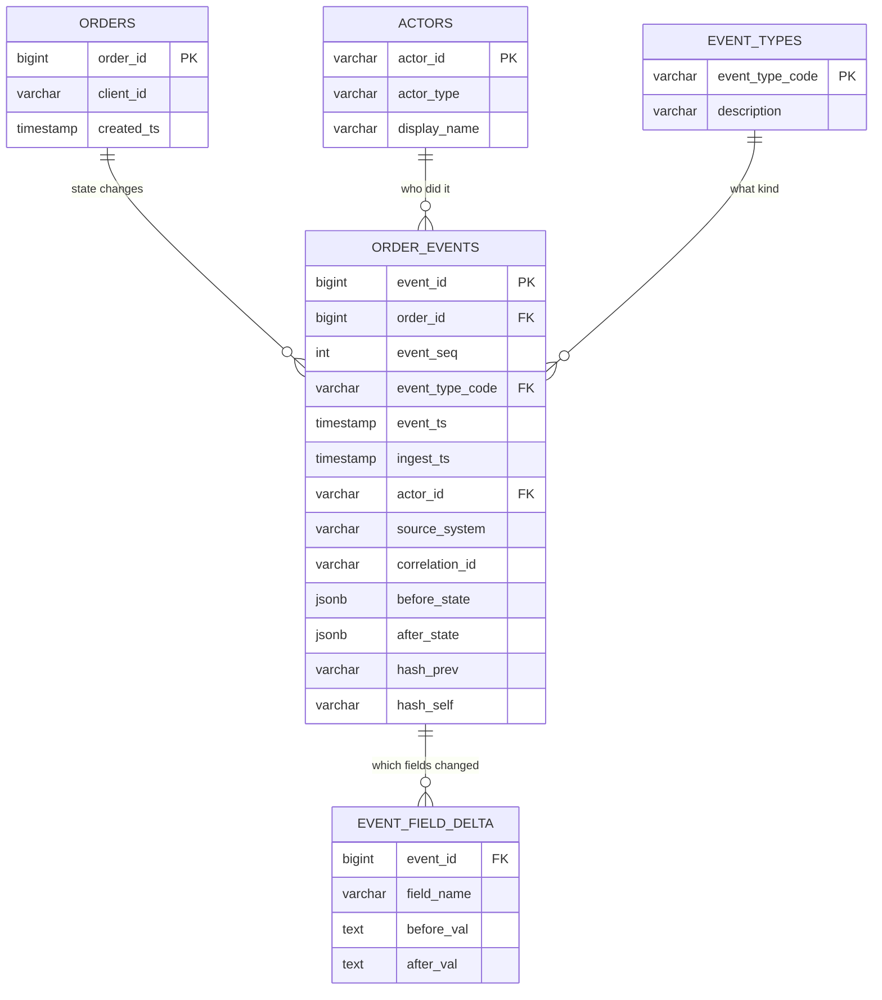

# SQL Mock Interview — 3 Dialogues

## Contents
1. [Dialogue 1 — Live SQL coding on orders/fills tables (30 min)](#dialogue-1--live-sql-coding-on-ordersfills-tables-30-min)
2. [Dialogue 2 — Slow EOD position query, diagnose (30 min)](#dialogue-2--slow-eod-position-query-diagnose-30-min)
3. [Dialogue 3 — Model a trade audit log for regulatory queries (30 min)](#dialogue-3--model-a-trade-audit-log-for-regulatory-queries-30-min)
4. [Overall debrief](#overall-debrief)

---

## Dialogue 1 — Live SQL coding on orders/fills tables (30 min)

**Setup — interviewer opens a shared editor with two tables:**

```sql
-- orders
order_id       BIGINT PRIMARY KEY
client_id      VARCHAR(16)
symbol         VARCHAR(12)
side           CHAR(1)          -- 'B' or 'S'
order_qty      INT
limit_px       NUMERIC(18,6)
order_status   VARCHAR(16)      -- NEW, PART, FILLED, CXL, REJ
created_ts     TIMESTAMP
venue          VARCHAR(8)

-- fills
fill_id        BIGINT PRIMARY KEY
order_id       BIGINT           -- FK -> orders
fill_qty       INT
fill_px        NUMERIC(18,6)
fill_ts        TIMESTAMP
liquidity_flag CHAR(1)          -- 'A' add, 'R' remove
```

### Q1. Warm-up — for today, give me every order and its total filled quantity, including orders with zero fills.

**Interviewer signal:** does the candidate reach for `LEFT JOIN` and `COALESCE` on instinct, and do they aggregate at the right grain.

**Answer:**

I would use a `LEFT JOIN` from `orders` to `fills`, group by the order, and coalesce the sum so unfilled orders show `0` instead of `NULL`.

```sql
SELECT
    o.order_id,
    o.client_id,
    o.symbol,
    o.order_qty,
    COALESCE(SUM(f.fill_qty), 0) AS filled_qty
FROM orders o
LEFT JOIN fills f
       ON f.order_id = o.order_id
WHERE o.created_ts >= CURRENT_DATE
  AND o.created_ts <  CURRENT_DATE + INTERVAL '1 day'
GROUP BY o.order_id, o.client_id, o.symbol, o.order_qty;
```

I filter on `orders.created_ts` rather than `fills.fill_ts` because if I filter on the fills side, the `LEFT JOIN` collapses to an `INNER JOIN` — unfilled orders would disappear.

**Watch-outs:** filtering the outer table in the `WHERE` clause on a column from the right side of a `LEFT JOIN` is the classic bug — it silently drops the rows you were trying to preserve.

---

### Q2. Now give me the top 5 clients by notional traded today.

**Interviewer signal:** correct notional formula (`qty * price` on fills, not orders), tie-breaking, and whether they think about currency.

**Answer:**

Notional lives on the fills, not the orders — a limit that never filled has zero notional regardless of `order_qty * limit_px`.

```sql
SELECT
    o.client_id,
    SUM(f.fill_qty * f.fill_px) AS notional_traded
FROM orders o
JOIN fills  f ON f.order_id = o.order_id
WHERE f.fill_ts >= CURRENT_DATE
  AND f.fill_ts <  CURRENT_DATE + INTERVAL '1 day'
GROUP BY o.client_id
ORDER BY notional_traded DESC
LIMIT 5;
```

Two caveats I would flag out loud: first, if `symbol` spans currencies I would need an FX table to normalize to a base CCY, else the ranking is meaningless. Second, `LIMIT 5` is not deterministic under ties — for a report I would add `client_id` as a tie-breaker in the `ORDER BY`.

**Watch-outs:** using `order_qty * limit_px` looks right and is wrong — that is the intended exposure, not what actually traded.

---

### Q3. For every order, show the running fill percentage — cumulative filled over `order_qty` — ordered by `fill_ts`.

**Interviewer signal:** window functions, specifically `SUM() OVER (PARTITION BY ... ORDER BY ...)`.

**Answer:**

Window function over the fills, partitioned by `order_id`, ordered by fill time.

```sql
SELECT
    f.order_id,
    f.fill_id,
    f.fill_ts,
    f.fill_qty,
    o.order_qty,
    SUM(f.fill_qty) OVER (
        PARTITION BY f.order_id
        ORDER BY f.fill_ts, f.fill_id
        ROWS BETWEEN UNBOUNDED PRECEDING AND CURRENT ROW
    ) * 1.0 / o.order_qty AS running_fill_pct
FROM fills f
JOIN orders o ON o.order_id = f.order_id;
```

I add `fill_id` as a secondary sort key because two fills can share a `fill_ts` down to the millisecond on a busy venue, and without a tie-breaker the running total is non-deterministic. The `* 1.0` forces float division in databases that would otherwise do integer division.

**Watch-outs:** forgetting the `ROWS BETWEEN` frame — some engines default to `RANGE`, which behaves surprisingly with duplicate order keys.

---

### Q4. Find orders where the last fill happened more than 5 minutes after the order was created but the order is still in `PART` state.

**Interviewer signal:** correlated aggregation, filtering post-aggregation, awareness of stuck-order patterns from production support.

**Answer:**

This is a common production-support query — half-filled orders that stalled. I aggregate fills per order, then filter.

```sql
WITH last_fill AS (
    SELECT
        order_id,
        MAX(fill_ts) AS last_fill_ts
    FROM fills
    GROUP BY order_id
)
SELECT
    o.order_id,
    o.client_id,
    o.symbol,
    o.created_ts,
    lf.last_fill_ts,
    EXTRACT(EPOCH FROM (lf.last_fill_ts - o.created_ts))/60 AS minutes_to_last_fill
FROM orders o
JOIN last_fill lf ON lf.order_id = o.order_id
WHERE o.order_status = 'PART'
  AND lf.last_fill_ts > o.created_ts + INTERVAL '5 minutes';
```

In practice on our OMS we would also join to a venue-heartbeat table — a "stuck PART" is often the symptom of a dropped venue session, not a slow market.

**Watch-outs:** putting the `MAX(fill_ts)` in a `HAVING` on a join without a CTE — works, but harder to reason about and slower once fills is billions of rows.

---

### Q5. Same table, but tell me — for each symbol — which client had the highest single-order notional today.

**Interviewer signal:** `ROW_NUMBER()` vs `RANK()`, and grouping at two levels.

**Answer:**

Top-1-per-group is the canonical `ROW_NUMBER()` pattern.

```sql
WITH order_notional AS (
    SELECT
        o.symbol,
        o.client_id,
        o.order_id,
        SUM(f.fill_qty * f.fill_px) AS order_notional
    FROM orders o
    JOIN fills  f ON f.order_id = o.order_id
    WHERE f.fill_ts >= CURRENT_DATE
    GROUP BY o.symbol, o.client_id, o.order_id
),
ranked AS (
    SELECT
        symbol,
        client_id,
        order_id,
        order_notional,
        ROW_NUMBER() OVER (
            PARTITION BY symbol
            ORDER BY order_notional DESC, order_id
        ) AS rn
    FROM order_notional
)
SELECT symbol, client_id, order_id, order_notional
FROM   ranked
WHERE  rn = 1;
```

I use `ROW_NUMBER` not `RANK` — the interviewer asked for one client per symbol, so ties must be broken deterministically. `order_id` is my tie-breaker.

**Watch-outs:** `RANK()` returns two rows on a tie and breaks the "one per symbol" invariant; `DENSE_RANK()` has the same issue.

---

### Debrief — Dialogue 1

- Strong: instinct for `LEFT JOIN`+`COALESCE`, notional on fills not orders, tie-breakers on `LIMIT` and window functions.
- Watch: I initially wrote `WHERE f.fill_ts` on the outer join in Q1 — self-corrected. Do that in production before an interviewer catches it.
- Missed prompt: I did not ask about the fills schema on `liquidity_flag` — could have volunteered an add/remove split for a bonus.

---

## Dialogue 2 — Slow EOD position query, diagnose (30 min)

**Setup — interviewer pastes a query and an `EXPLAIN` plan:**

```sql
-- Runs every night at 18:00. Started at 4 min, now 47 min.
SELECT
    p.account_id,
    p.symbol,
    p.sod_qty
      + COALESCE(SUM(CASE WHEN o.side='B' THEN f.fill_qty ELSE -f.fill_qty END), 0)
        AS eod_qty
FROM positions_sod p
LEFT JOIN orders o ON o.client_id = p.account_id AND o.symbol = p.symbol
LEFT JOIN fills  f ON f.order_id  = o.order_id
WHERE p.trade_date = CURRENT_DATE
GROUP BY p.account_id, p.symbol, p.sod_qty;
```

```
Seq Scan on fills f   (cost=0.00..8_912_331 rows=412_000_000)
Hash Left Join        (cost=... rows=180_000_000)
  Hash Cond: (o.order_id = f.order_id)
Hash Left Join        (cost=... rows=1_800_000)
  Hash Cond: (p.account_id = o.client_id AND p.symbol = o.symbol)
Seq Scan on orders o  (cost=..., rows=6_000_000)
Seq Scan on positions_sod p (cost=..., rows=90_000, filter: trade_date=CURRENT_DATE)
```

### Q1. Walk me through your diagnostic approach before you propose any fix.

**Interviewer signal:** does the candidate follow a method — data → plan → indexes → rewrite — or do they jump to "add an index".

**Answer:**

I go in this order. First, what changed — the query was fine 6 months ago. Volume grew, plan changed, stats stale, or a new column/predicate. Second, read the plan bottom-up — spot the biggest node and the join method. Third, check the row estimates against actual — bad estimates are usually stale statistics or a correlated predicate the optimizer cannot model. Fourth, only then do I talk indexes or rewrites.

Here, three signals jump out. `fills` is doing a sequential scan of 412M rows. The join `positions_sod` → `orders` is on a two-column key (`client_id`, `symbol`) — if there is no composite index, that is a hash join blowing up memory. And the whole query joins three tables at row grain then groups — 412M rows collapse to 90k, which means I am doing a huge amount of work to throw it away.

**Watch-outs:** proposing an index without reading the plan — the plan may say `Hash Join` on a spilled hash, which no index will fix.

---

### Q2. What is the biggest structural problem, and how would you rewrite it?

**Interviewer signal:** aggregate-before-join instinct.

**Answer:**

The biggest problem is join-then-aggregate. I should aggregate fills to a per-order signed quantity first, then aggregate to per-account-per-symbol, then join to `positions_sod`. That collapses 412M rows before the join instead of after.

```sql
WITH order_signed AS (
    SELECT
        o.client_id,
        o.symbol,
        SUM(CASE WHEN o.side='B' THEN f.fill_qty ELSE -f.fill_qty END) AS signed_qty
    FROM orders o
    JOIN fills  f ON f.order_id = o.order_id
    WHERE f.fill_ts >= CURRENT_DATE
      AND f.fill_ts <  CURRENT_DATE + INTERVAL '1 day'
    GROUP BY o.client_id, o.symbol
)
SELECT
    p.account_id,
    p.symbol,
    p.sod_qty + COALESCE(os.signed_qty, 0) AS eod_qty
FROM positions_sod p
LEFT JOIN order_signed os
       ON os.client_id = p.account_id
      AND os.symbol    = p.symbol
WHERE p.trade_date = CURRENT_DATE;
```

Two more things this rewrite does. The `WHERE f.fill_ts` predicate lets an index on `fills(fill_ts)` prune 411M of the 412M rows if today's fills are only a few million. And it moves the `LEFT JOIN` out of the aggregation, which the optimizer often re-orders better.

**Watch-outs:** the original had `LEFT JOIN orders` — if there is a position with no orders it must still appear. My rewrite preserves that because I `LEFT JOIN order_signed`, not `INNER JOIN`.

---

### Q3. What indexes would you add, and in what order of columns?

**Interviewer signal:** understanding of composite index column order — equality columns first, then range, then include columns.

**Answer:**

Given the rewritten query, I would want:

1. `fills(fill_ts, order_id)` — the `WHERE` is a range on `fill_ts`, then we join on `order_id`. Range column can go second on some engines, but in Postgres/Oracle putting the range column first is fine for a single-day scan; the alternative is `fills(order_id) INCLUDE (fill_qty, fill_ts)` if we always drive from orders — depends on data volume ratio.
2. `orders(client_id, symbol, order_id)` — the aggregate CTE groups on `client_id, symbol` and joins on `order_id`. This makes it an index-only scan.
3. `positions_sod(trade_date, account_id, symbol)` — equality on `trade_date`, then the join keys.

I would not blindly add all three at once — I would add the fills index first, re-run, and check the plan. Indexes on billion-row tables are not free — every insert on `fills` now maintains an extra B-tree.

**Watch-outs:** putting the range column before the equality column in a composite index — that is the textbook mistake. Rule of thumb — equality, then range, then include.

---

### Q4. The DBA says he cannot add indexes tonight. What can you do in the query alone?

**Interviewer signal:** pragmatism — production support reality is that DDL takes a change ticket.

**Answer:**

Three levers, all in the query text.

First, the aggregate-before-join rewrite from Q2 — that alone might drop the runtime an order of magnitude even on a sequential scan, because the hash table shrinks from 180M rows to a few million.

Second, materialize the fills subset. Even without an index, if `fills` is partitioned by `fill_ts` — which for a 412M-row table it almost certainly is — the `WHERE f.fill_ts >= CURRENT_DATE` predicate enables partition pruning. Confirm with `EXPLAIN`.

Third, if the query still misses SLA, I would consider a two-phase approach — write today's `order_signed` to a scratch table earlier in the batch (say, right after market close at 16:00), then the EOD job just does the final join. Push work forward in time.

**Watch-outs:** don't propose `SELECT /*+ INDEX(...) */` hints — they age badly and lock the plan against future optimizer improvements.

---

### Q5. How would you monitor this so you catch the regression next time before it breaks SLA?

**Interviewer signal:** production-support mindset, not just query-tuning mindset.

**Answer:**

Three monitors. First, capture the batch runtime as a metric — 4 min baseline, alert at 8 min, page at 20 min. Slow drift is the tell that data grew past a threshold. Second, log the row count of each stage — `fills` today, `orders` today, `positions_sod` today — so when someone gets paged they can see immediately if it is a data issue or a plan flip. Third, snapshot the query plan hash weekly; a plan change is often the root cause and is invisible unless you log it.

Also — a post-mortem question I would ask my team — is `positions_sod` even the right source, or should we be computing EOD from an already-aggregated intra-day position feed. Sometimes the fix is upstream.

**Watch-outs:** monitoring runtime only. A query can be fast and wrong — also log row-count sanity checks (e.g., today's fill count within 3-sigma of the 30-day median).

---

### Debrief — Dialogue 2

- Strong: method-before-fix, aggregate-before-join, index column ordering rationale.
- Watch: I said "Postgres/Oracle" — for a bank, name the actual engine (Sybase ASE, DB2, kdb+ are common). Tune vocabulary to the shop.
- Bonus opportunity: partition-pruning callout landed well; connect it explicitly to "reads billions of rows" from the plan next time.

---

## Dialogue 3 — Model a trade audit log for regulatory queries (30 min)

**Interviewer sets scene:** "Compliance needs to reconstruct — for any order — every state change with actor, timestamp, before/after values. Regulator can ask about a trade from 7 years ago. What is your schema?"

### Q1. Walk me through your schema on a whiteboard — tables, keys, and grain.

**Interviewer signal:** immutability, grain, actor attribution, and the ability to reconstruct state at any point in time.

**Answer:**

The core insight is that an audit log is append-only, immutable, and event-grained — one row per state change, never updated after insert.



Key design points I would talk through:

- Grain of `order_events` is one row per state change on one order — never coarser, never finer.
- `(order_id, event_seq)` is a natural key and gives strict ordering per order even if two events share a `event_ts` to the microsecond.
- I keep both `event_ts` (business time, from the source system) and `ingest_ts` (when we wrote it) — regulators care about the former, ops care about the latter.
- `before_state` / `after_state` are JSON snapshots — verbose, but they let compliance reconstruct any prior state without replaying every prior event. Storage is cheap; regulator time is not.
- `event_field_delta` is denormalized for queryability — "show me every time `limit_px` changed on this order" without JSON parsing.
- `hash_prev` / `hash_self` form a hash-chain — each event's hash includes the previous event's hash, so tampering is detectable. This is table-stakes for regulators like FINRA CAT and MiFID II.

**Watch-outs:** modeling this as `UPDATE`s on the `orders` table — that destroys history the moment a state changes. Auditors want the before value.

---

### Q2. Regulator asks — "reconstruct the exact state of order 12345 as of 2024-03-15 14:30:00 UTC". Write the query.

**Interviewer signal:** temporal query — get the latest event as of a point in time.

**Answer:**

The last event with `event_ts <= t` gives me `after_state` at time `t`.

```sql
SELECT
    e.order_id,
    e.event_seq,
    e.event_type_code,
    e.event_ts,
    e.actor_id,
    e.after_state
FROM order_events e
WHERE e.order_id = 12345
  AND e.event_ts <= TIMESTAMP '2024-03-15 14:30:00'
ORDER BY e.event_seq DESC
LIMIT 1;
```

I sort by `event_seq` descending, not `event_ts`, because two events could share a timestamp — `event_seq` is the strict ordering.

If the regulator asks for state across many orders at that time — a more common ask — I use a correlated `MAX(event_seq)` per order:

```sql
WITH latest AS (
    SELECT order_id, MAX(event_seq) AS event_seq
    FROM   order_events
    WHERE  event_ts <= TIMESTAMP '2024-03-15 14:30:00'
    GROUP  BY order_id
)
SELECT e.*
FROM   order_events e
JOIN   latest l USING (order_id, event_seq);
```

**Watch-outs:** using `MAX(event_ts)` — two events with the same timestamp will both come back, and the "reconstructed state" is non-deterministic.

---

### Q3. How do you prove to the regulator that the log has not been tampered with?

**Interviewer signal:** hash-chaining, WORM storage, and separation of duties.

**Answer:**

Three layers.

- **Hash chain in the table.** Every row's `hash_self = sha256(order_id || event_seq || event_type || event_ts || actor_id || after_state || hash_prev)`. Any retroactive edit breaks the chain from that point forward — I can detect it with a single walk of the events for that order.
- **WORM storage.** The physical layer — write once, read many. In our OMS shop this is typically a compliance-grade store (e.g., Sybase IQ archive, S3 Object Lock, Centera). The database itself does not have `DELETE` or `UPDATE` grants for app users.
- **Separation of duties.** The writer service has `INSERT` only. DBAs who have `DELETE` are logged separately in a system-level audit and do not have application credentials. This is what auditors actually look for — the "who could delete" question.

I would also mention external timestamping — periodically hashing the tail of the chain and publishing to an external trusted timestamp authority (RFC 3161) or an internal ledger — so we cannot rewrite history even by rebuilding the chain.

**Watch-outs:** relying only on `hash_prev` — if an insider has DB write access, they can rebuild the whole chain. WORM + separation of duties is what actually prevents that.

---

### Q4. Retention — 7 years. Query performance — regulators sometimes go deep on 5-year-old orders. How do you partition?

**Interviewer signal:** partitioning strategy for large immutable tables.

**Answer:**

Two-level partitioning.

- **Range-partition by `event_ts` monthly.** Regulators query "give me every order event in Q1 2022" — with monthly partitions, that hits 3 partitions instead of 84 months of data. And when data ages out at 7 years, dropping a partition is instant metadata; deleting rows is not.
- **Optionally sub-partition by hash of `order_id`** if the per-month partition is still too big — parallelism on regulator scans that hit one order.

Storage tiering — hot (0–90 days) on fast SSD with all indexes, warm (90 days–2 years) on cheaper SSD, cold (2–7 years) on object storage with columnar format (Parquet + external table, or IQ). Regulator query on 5-year-old data is slow but not impossible, and it costs pennies to store.

Indexes on the hot partition — `(order_id, event_seq)`, `(actor_id, event_ts)`, `(event_type_code, event_ts)`. The last two are for compliance queries like "every cancel done by user X last month" or "every reject event this week".

**Watch-outs:** partitioning by `order_id` — feels natural, terrible for time-range regulator queries. Partition by the column your queries filter on, not by the primary key.

---

### Q5. Compliance asks a new question every month — "show me every time the limit price was changed after the order went to market". How does your schema handle novel questions cheaply?

**Interviewer signal:** does the schema anticipate unknown future queries — the JSON snapshot vs. the delta table trade-off.

**Answer:**

Two-tier design. The `event_field_delta` table is what makes novel questions cheap.

```sql
SELECT e.order_id, e.event_seq, e.event_ts, d.before_val, d.after_val, e.actor_id
FROM   order_events      e
JOIN   event_field_delta d ON d.event_id = e.event_id
WHERE  d.field_name    = 'limit_px'
  AND  e.event_type_code = 'MODIFY'
  AND  EXISTS (
      SELECT 1 FROM order_events prior
      WHERE prior.order_id = e.order_id
        AND prior.event_seq < e.event_seq
        AND prior.event_type_code = 'ROUTED'
  );
```

The `field_name`-indexed delta table means "every change to X" is an index seek, not a full JSON scan of a billion rows. The JSON snapshot is the belt; the delta table is the suspenders.

When compliance asks a *truly* novel question that isn't covered by an index — I can always fall back to the JSON snapshot with a full scan or a materialized ad-hoc view. Slow, but possible. The design bets that 80% of compliance questions target specific fields, and those get an index.

I would also propose — on any new event type — a schema-review step where we decide which fields go into the delta table. Better to over-index the delta table by a few columns than to be surprised by a regulator.

**Watch-outs:** JSON-only design — every compliance question becomes a full-table JSON parse. Terrible latency, terrible cost.

---

### Debrief — Dialogue 3

- Strong: grain articulation, hash-chain + WORM + separation of duties as a stack, partitioning by query pattern not by PK.
- Watch: mention concrete regulators (FINRA CAT, MiFID II RTS 25, MAS) early — signals I have shipped for a regulated bank, not just modeled in the abstract.
- Bonus opportunity: I could have named GDPR right-to-be-forgotten conflicts with immutable audit — real production tension worth flagging.

---

## Overall debrief

**Themes that landed across all three:**

- Grain first — every question about aggregation started with "what is one row".
- `LEFT JOIN` + `COALESCE` for "include the zeros" — instinctive, not reasoned.
- Aggregate before join on large tables — the single biggest performance lever in Dialogue 2.
- Immutability + hash chain + WORM + separation of duties as a stack, not a single mechanism, for audit.

**Themes to sharpen:**

- Name the actual engine (Sybase ASE, DB2, kdb+) instead of generic "Postgres/Oracle" — bank interviewers listen for shop-specific vocabulary.
- Name the actual regulator (FINRA CAT, MiFID II RTS 25, MAS, CFTC Part 43) — signals production experience.
- Volunteer the "how do I monitor this in production" answer *before* being asked — that is the technical-analyst / prod-support differentiator.
- Ask about currency / FX normalization on notional questions — buy-side and sell-side interviewers both value this.

**One-line self-review:** the pattern to keep is *diagnose before fix, aggregate before join, immutable before queryable*.
