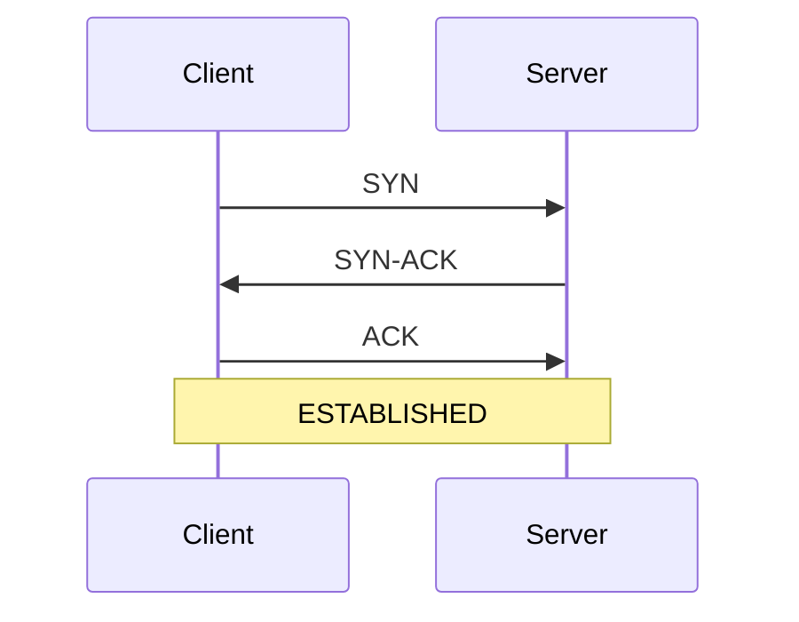

# Linux — 50 Highest-Frequency Q&A (Focused)

## Table of Contents

| Section | Questions |
|---------|-----------|
| Log parsing & searching | Q1–Q10 |
| Process & memory diagnosis | Q11–Q20 |
| Network diagnosis (tcpdump, ss, netstat) | Q21–Q30 |
| Signals & process control | Q31–Q37 |
| Shell scripting basics | Q38–Q45 |
| Filesystem, permissions, misc production | Q46–Q50 |

---

## Log parsing & searching

### Q1. A trader says "orders are stuck" at 09:35 EST. How do you find the relevant log lines fast?
**Interviewer signal:** Do you narrow the window before grepping GBs of logs?
**Answer:**
I never `grep` a whole day's log. First I bound the time window, then filter by identifier.

```bash
# 1. Locate today's OMS log
cd /var/log/oms/$(date +%Y%m%d)

# 2. Extract just the 09:30–09:40 window using sed (fast, no regex backtracking)
sed -n '/09:30:00/,/09:40:00/p' oms.log > /tmp/window.log

# 3. Now grep for the client/account/orderID
grep -i "ACCT=XYZ123" /tmp/window.log | less
```

For rotated gzipped files I use `zgrep` or `zcat file.gz | sed -n ...`. If the log is huge I use `LC_ALL=C grep` — it skips UTF-8 decoding and is 3–5x faster.

**Watch-outs:** Never run `grep -r` over `/var/log` on a live box — it thrashes page cache and can degrade the OMS process.

---

### Q2. How do you tail a log but only show lines matching a pattern, in real time?
**Interviewer signal:** Basic fluency with `tail -F` and pipes.
**Answer:**
```bash
tail -F /var/log/oms/session.log | grep --line-buffered "35=8\|35=9"
```
Two things matter here: `-F` (capital F) follows the file across log rotation; lowercase `-f` breaks when logrotate renames the file. `--line-buffered` on grep flushes each match immediately — without it, grep buffers 4KB and the output looks frozen.

**Watch-outs:** Don't forget `--line-buffered`. Also `awk '/pattern/'` needs `fflush()` or `stdbuf -oL awk ...` for the same reason.

---

### Q3. Count how many ExecutionReports (35=8) came in for a given ClOrdID.
**Interviewer signal:** Comfort chaining grep/awk.
**Answer:**
```bash
grep "11=ORD12345" fix.log | grep -c "35=8"
```
If ClOrdID and MsgType can appear in either order on the line, I use `grep -E "35=8.*11=ORD12345|11=ORD12345.*35=8"`. For real forensics I parse the FIX message properly with awk splitting on SOH (`\x01`):

```bash
awk -F'\x01' '/11=ORD12345/ {for(i=1;i<=NF;i++) if($i=="35=8") c++} END{print c+0}' fix.log
```

**Watch-outs:** `grep -c` counts lines, not matches. Two `35=8` on one line = 1.

---

### Q4. Show the top 10 error messages in a log file by frequency.
**Interviewer signal:** Standard `sort | uniq -c | sort -rn` idiom.
**Answer:**
```bash
grep -i "ERROR\|EXCEPTION" app.log \
  | awk -F'ERROR' '{print $2}' \
  | sed 's/[0-9]\+/N/g' \
  | sort | uniq -c | sort -rn | head -10
```
The `sed 's/[0-9]\+/N/g'` normalises numeric IDs so `Order 123 failed` and `Order 456 failed` group together. This is the same trick used in log-clustering tools.

**Watch-outs:** Without normalisation you get thousands of "unique" errors that are actually one error class.

---

### Q5. How do you extract just a column from a log line?
**Interviewer signal:** awk basics.
**Answer:**
```bash
# Get the 5th whitespace-separated column
awk '{print $5}' file.log

# Get column 3 from a CSV
awk -F',' '{print $3}' file.csv

# Get everything from field 4 to end
awk '{for(i=4;i<=NF;i++) printf "%s ", $i; print ""}' file.log

# Or with cut for fixed delimiters
cut -d',' -f3,5 file.csv
```

**Watch-outs:** `cut` cannot handle variable whitespace — for logs with multi-space alignment, always use awk.

---

### Q6. A log file is 40GB. How do you find lines between 14:00 and 14:05 without loading it into memory?
**Interviewer signal:** Streaming tools + sed address ranges.
**Answer:**
```bash
sed -n '/2026-07-18 14:00:00/,/2026-07-18 14:05:00/p' huge.log > slice.log
```
`sed` streams line by line, constant memory. For gzipped files:
```bash
zcat huge.log.gz | sed -n '/14:00:00/,/14:05:00/p'
```
If the file is sorted by time (usually true for append-only logs), `look` or a binary-search wrapper (`dategrep`, or a custom script using `dd` + `head`) is even faster.

**Watch-outs:** Do NOT `cat huge.log | grep` — cat reads it all. `grep pattern huge.log` streams natively.

---

### Q7. How do you follow multiple log files at once?
**Interviewer signal:** Awareness of `tail` multi-file mode or `multitail`.
**Answer:**
```bash
tail -F oms.log fix.log market-data.log
```
Each line is prefixed with the filename header when it switches. For side-by-side, I use `multitail -i oms.log -i fix.log`. In production I usually just open `tmux` with three panes, each running `tail -F` — easier to search individually.

**Watch-outs:** With too many files, header switches make output unreadable; better to run separate panes.

---

### Q8. Find files modified in the last 15 minutes under /var/log.
**Interviewer signal:** `find -mmin`.
**Answer:**
```bash
find /var/log -type f -mmin -15
```
`-mmin -15` means "modified less than 15 minutes ago". `-mmin +15` means "more than 15 minutes ago". Same for `-mtime` in days.

Combine with `-size` to find recently-grown large logs:
```bash
find /var/log -type f -mmin -15 -size +100M
```

**Watch-outs:** `-mmin -15` includes 0-14.999 minutes. `-mmin 15` means exactly 15.

---

### Q9. A log line spans multiple lines (stack trace). How do you grep and include N lines of context?
**Interviewer signal:** grep -A/-B/-C flags.
**Answer:**
```bash
grep -A 20 "NullPointerException" app.log     # 20 lines after
grep -B 5  "NullPointerException" app.log     # 5 lines before
grep -C 10 "NullPointerException" app.log     # 10 before and after
```
For structured stack traces where the exception header has a marker (e.g. `ERROR`) and subsequent lines start with whitespace, awk is better:
```bash
awk '/^ERROR/{flag=1} flag; /^[^ \t]/ && !/^ERROR/{flag=0}' app.log
```

**Watch-outs:** `-A/-B/-C` counts lines, not logical events. A 200-line stack trace needs `-A 200`.

---

### Q10. How do you search for a pattern across all files under a directory, recursively?
**Interviewer signal:** `grep -r` and its faster cousins.
**Answer:**
```bash
grep -r --include='*.log' "ORD12345" /var/log/oms/
```
`--include` prevents grep from reading binaries or gzipped files. For speed I prefer `ripgrep`:
```bash
rg -a "ORD12345" /var/log/oms/
```
`rg` is 5–10x faster because it parallelises and respects `.gitignore`. On locked-down prod hosts where `rg` isn't installed, `grep -rF` (fixed string, no regex) is the fastest option.

**Watch-outs:** `grep -r` on `/` will chase symlinks into `/proc` and hang.

---

## Process & memory diagnosis

### Q11. The OMS process is at 100% CPU. How do you investigate?
**Interviewer signal:** Layered approach — process, then threads, then stack.
**Answer:**
```bash
# 1. Find the process
top -c    # or ps -eo pid,pcpu,pmem,cmd --sort=-pcpu | head

# 2. Which thread inside it is hot?
top -H -p <PID>

# 3. What is that thread doing? — sample its stack
sudo perf top -p <PID>
# or a cheaper snapshot
sudo pstack <PID>
# for Java
jstack <PID> | grep -A 30 "0x<tid_hex>"

# 4. Look at syscall activity
sudo strace -c -p <PID> -f     # summary of syscalls after Ctrl+C
```
The pattern is: find the process → find the hot thread → correlate the thread ID to a Java thread dump or native stack. If `perf top` shows a single library function dominating, that's your smoking gun.

**Watch-outs:** `strace` slows the process 10–100x; never leave it attached to a live matching engine. Detach quickly.

---

### Q12. How do you see all threads of a process?
**Interviewer signal:** `ps -T` or `top -H`.
**Answer:**
```bash
ps -T -p <PID>              # column SPID is the thread ID
top -H -p <PID>             # interactive
ls /proc/<PID>/task/        # each dir is a TID
cat /proc/<PID>/status | grep Threads
```
For Java: `jstack <PID>` gives a full thread dump with names — much more actionable than raw TIDs.

**Watch-outs:** The TID from `top -H` is in decimal; in jstack the `nid=` is hex. Convert with `printf '%x\n' <tid>`.

---

### Q13. How do you check memory usage of a process?
**Interviewer signal:** RSS vs VSZ vs PSS awareness.
**Answer:**
```bash
ps -o pid,vsz,rss,pmem,cmd -p <PID>
cat /proc/<PID>/status | grep -E "VmRSS|VmSize|VmPeak|VmSwap"
# Detailed breakdown per mapping
cat /proc/<PID>/smaps_rollup
```
Key terms:
- **VSZ** — virtual size, includes memory-mapped files and unallocated address space. Not a real memory number.
- **RSS** — resident set size, physical RAM actually used by the process. Includes shared library pages.
- **PSS** — proportional set size (from smaps), splits shared pages by number of sharers. Best number for "how much is this process actually costing me."
- **VmSwap** — how many pages are swapped out.

**Watch-outs:** VSZ shocks people ("why is the OMS using 20GB virtual?"). It's usually mmap'd files — ignore it unless you see huge RSS.

---

### Q14. System memory is low — how do you find who's using it?
**Interviewer signal:** free, /proc/meminfo, top by RSS.
**Answer:**
```bash
free -h                                    # overview
cat /proc/meminfo | head -20               # detailed
ps -eo pid,rss,pmem,cmd --sort=-rss | head # top by RSS
smem -tk                                   # if installed — shows PSS
```
Read `free -h` carefully — "available" is the real "how much can a new process use" number, NOT "free". The buff/cache column is reclaimable, so a system with 1MB "free" but 30GB "buff/cache" is fine.

**Watch-outs:** New engineers panic seeing 0 free memory. Linux uses free RAM for disk cache aggressively — that's healthy.

---

### Q15. What is the difference between load average and CPU utilization?
**Interviewer signal:** Understanding of run-queue vs busy time.
**Answer:**
CPU utilization is the % of time a CPU is executing (user + system). Load average is the average number of processes either running OR in uninterruptible sleep (usually blocked on disk I/O) over 1, 5, and 15 minutes.

Consequences:
- Load 8 on an 8-core box = fully loaded but healthy.
- Load 8 on a 2-core box = 6 processes are constantly waiting.
- Load 20 on an idle box (0% CPU) = 20 processes blocked on disk — the disk is the bottleneck, not CPU. Check `iostat -x 1` and `iotop`.

**Watch-outs:** High load with low CPU is almost always I/O wait or D-state processes. Look at `ps aux | awk '$8 ~ /D/'`.

---

### Q16. How do you get a stack trace of a running (non-crashed) process?
**Interviewer signal:** `pstack`, `gdb`, `jstack` awareness.
**Answer:**
```bash
# C/C++ native
sudo pstack <PID>
# or
sudo gdb -p <PID> -batch -ex "thread apply all bt" -ex "detach"

# Java
jstack <PID>          # thread dump
jstack -l <PID>       # with lock info — needed for deadlock analysis

# Python (with py-spy)
sudo py-spy dump --pid <PID>
```
For an intermittent stall I do 3 consecutive jstacks 5 seconds apart. If the same thread is on the same line, it's stuck. If it moves, it's slow but progressing.

**Watch-outs:** `pstack` briefly stops the process. On a latency-critical engine, coordinate with the desk before running.

---

### Q17. How do you check open file descriptors of a process?
**Interviewer signal:** `lsof` and `/proc/<pid>/fd`.
**Answer:**
```bash
ls -l /proc/<PID>/fd | wc -l          # count
ls -l /proc/<PID>/fd                  # what each FD points to
lsof -p <PID>                         # richer view (sockets, files, pipes)
cat /proc/<PID>/limits | grep files   # the ulimit
```
When the OMS starts refusing new FIX sessions with "too many open files", the fix is either raise `ulimit -n` or find the FD leak. A leak shows up as a growing count of the same file/socket type.

**Watch-outs:** `ulimit -n` in a shell doesn't affect an already-running daemon. Bump it in the systemd unit (`LimitNOFILE=`) or wrapper script.

---

### Q18. Explain what /proc/<pid>/ contains that you'd actually use in production.
**Interviewer signal:** Practical /proc literacy.
**Answer:**
- `/proc/<pid>/cmdline` — full command line with args (null-separated).
- `/proc/<pid>/status` — human-readable summary (RSS, threads, UID, state).
- `/proc/<pid>/maps` — memory map, useful for finding which shared libs are loaded.
- `/proc/<pid>/fd/` — every open file descriptor.
- `/proc/<pid>/limits` — the ulimits this process is running under.
- `/proc/<pid>/environ` — env vars (null-separated) — great for confirming `LD_LIBRARY_PATH` or a config env is set right.
- `/proc/<pid>/stack` — kernel stack (if it's blocked in a syscall).
- `/proc/<pid>/io` — read/write bytes since start.

**Watch-outs:** Some entries need root or the same UID. `strings /proc/<pid>/environ | tr '\0' '\n'` is my usual trick.

---

### Q19. How do you find zombie processes and what causes them?
**Interviewer signal:** Understanding of process lifecycle.
**Answer:**
```bash
ps aux | awk '$8 ~ /^Z/'
ps -eo pid,ppid,state,cmd | awk '$3=="Z"'
```
A zombie is a process that exited but whose parent hasn't called `wait()` to reap it. It holds only a PID and exit code — no memory or CPU. Zombies are harmless individually but a rising count means the parent has a bug. Kill the PARENT (or send it SIGCHLD if it just missed the signal); killing the zombie itself does nothing.

**Watch-outs:** A single zombie is fine. Thousands = the parent is leaking — that's what to fix.

---

### Q20. How do you profile disk I/O on a busy host?
**Interviewer signal:** iostat, iotop, blktrace awareness.
**Answer:**
```bash
iostat -x 1                 # per-device: util%, await, r/s, w/s
iotop -oP                   # per-process I/O, only active
pidstat -d 1                # per-process disk read/write throughput
```
Key columns in `iostat -x`:
- **%util** — % of time the device is busy. Sustained >80% = saturated.
- **await** — avg wait time per I/O in ms. On SSDs, >10ms is suspect.
- **r_await / w_await** — split read vs write.

For deeper analysis I use `blktrace` or the eBPF-based `biolatency`/`biosnoop` from bcc-tools.

**Watch-outs:** `iostat`'s first sample is since-boot averages — always look at the second sample onward.

---

## Network diagnosis (tcpdump, ss, netstat)

### Q21. How do you check if a TCP port is listening?
**Interviewer signal:** `ss` fluency (netstat is deprecated).
**Answer:**
```bash
ss -tlnp             # TCP listening, numeric, with process
ss -tulnp            # TCP + UDP
ss -tanp | grep :443
# Old-school
netstat -tlnp
lsof -i :443
```
Flags: `-t` TCP, `-u` UDP, `-l` listening, `-n` numeric (don't resolve DNS/services), `-p` process (needs root for others' processes), `-a` all.

**Watch-outs:** Without `-n`, `ss` will do DNS lookups and hang if DNS is slow. Always use `-n`.

---

### Q22. A FIX session says "connected" but no messages flow. How do you confirm packets are actually arriving?
**Interviewer signal:** tcpdump on a specific host:port.
**Answer:**
```bash
sudo tcpdump -i any -nn host 10.20.30.40 and port 5001 -c 100
# Or write to pcap for Wireshark
sudo tcpdump -i any -nn host 10.20.30.40 and port 5001 -w /tmp/fix.pcap
```
- `-i any` — all interfaces (in prod you usually know which one).
- `-nn` — no DNS, no port name lookups (avoids hangs and clutter).
- `-c 100` — stop after 100 packets so I don't fill the disk.
- Filter first, always. A bare `tcpdump` on a busy trading host will drop packets.

If I see packets in but no application response, the socket buffer is likely full or the application isn't reading — check `ss -tmi 'dport = :5001'` for `Recv-Q` growing.

**Watch-outs:** Never run `tcpdump -w` without a rotation (`-C 100 -W 10` for 100MB × 10 files) — you will fill /var and page the desk.

---

### Q23. What do `Recv-Q` and `Send-Q` mean in `ss` output?
**Interviewer signal:** Understanding TCP buffers.
**Answer:**
- For an ESTABLISHED socket: `Recv-Q` = bytes in the kernel receive buffer waiting for the app to read. `Send-Q` = bytes the app has written but the kernel hasn't ACKed from the peer yet.
- For a LISTEN socket: `Recv-Q` = current backlog of pending accepts. `Send-Q` = max backlog (from `listen(backlog)`).

Diagnosis pattern:
- `Recv-Q` growing = our app isn't reading fast enough → slow consumer.
- `Send-Q` growing = the network or peer is slow to ACK → maybe congestion, packet loss, or peer stalled.

**Watch-outs:** People confuse the two directions. Recv-Q is bytes waiting FOR the local app; Send-Q is bytes waiting FOR the remote to ACK.

---

### Q24. How do you check bandwidth utilization on an interface?
**Interviewer signal:** sar, iftop, nload, /proc/net/dev.
**Answer:**
```bash
sar -n DEV 1                 # per-interface bytes/pkts per second
iftop -i eth0                # interactive by-connection
nload eth0                   # simple bar-chart view
ethtool -S eth0 | grep -E "rx_bytes|tx_bytes|rx_dropped|tx_dropped"
cat /proc/net/dev            # raw counters
```
For a quick "am I saturating the NIC?" I compare `sar -n DEV 1`'s rxkB/s + txkB/s against the NIC speed (`ethtool eth0 | grep Speed`). Approaching 90% of line-rate is bad news for market data.

**Watch-outs:** `ifconfig` counters wrap on 32-bit systems for high-throughput NICs. Prefer `ip -s link show` or `ethtool -S`.

---

### Q25. A connection to a remote host times out. How do you diagnose?
**Interviewer signal:** Layered network diagnosis.
**Answer:**
Layer-by-layer:
```bash
# 1. Is DNS resolving?
dig broker.example.com +short
getent hosts broker.example.com

# 2. Is the route working?
ip route get 10.20.30.40
traceroute -n 10.20.30.40
mtr -n 10.20.30.40    # real-time traceroute

# 3. Is the port open?
nc -zv 10.20.30.40 5001
# or
timeout 5 bash -c '</dev/tcp/10.20.30.40/5001' && echo open || echo closed

# 4. What does the SYN look like on the wire?
sudo tcpdump -nn host 10.20.30.40 and port 5001
```
If I see SYN going out but no SYN-ACK back → firewall or ACL. If I see SYN-ACK but RST → app is refusing (not listening or crashed). If ICMP unreachable → routing.

**Watch-outs:** `ping` doesn't test TCP. Many production networks block ICMP; ping failing doesn't mean the host is down.

---

### Q26. Explain the TCP three-way handshake and where it can fail.
**Interviewer signal:** Networking fundamentals.
**Answer:**
1. Client sends **SYN** to server:port.
2. Server responds **SYN-ACK**.
3. Client sends **ACK**. Connection is ESTABLISHED.



Failure modes:
- **No SYN-ACK, connection times out** → firewall dropping SYN, or server not listening (should get RST if reachable).
- **SYN received but reset (RST)** → server refuses (port closed or `iptables REJECT`).
- **SYN-ACK never gets back to client** → asymmetric routing or NAT dropping the return path.
- **Handshake completes but immediate FIN/RST** → app accepted then closed (auth failure, too many connections).

**Watch-outs:** RST is a normal server response for a closed port; it does NOT mean the network is broken.

---

### Q27. How do you see per-connection retransmits and RTT?
**Interviewer signal:** `ss -ti` for TCP internals.
**Answer:**
```bash
ss -tin state established '( dport = :5001 or sport = :5001 )'
```
The output shows per-socket lines like:
```
cubic wscale:7,7 rto:224 rtt:23.5/2 mss:1448 cwnd:10 ssthresh:7 bytes_sent:1234 bytes_retrans:12 retrans:0/3
```
Key fields:
- **rtt** — smoothed round-trip time in ms.
- **retrans:X/Y** — X current, Y total retransmits since socket open.
- **cwnd** — congestion window.
- **rto** — retransmission timeout.

Rising retransmits on a market-data feed almost always means packet loss upstream — capture with tcpdump and correlate with `ethtool -S | grep drop` on the NIC.

**Watch-outs:** Retransmits >0.1% on a data-center LAN is a real problem. Escalate to network engineering.

---

### Q28. tcpdump filter: capture only SYN packets from a specific IP.
**Interviewer signal:** BPF filter syntax.
**Answer:**
```bash
# SYN and not ACK — pure SYNs (initial handshake)
sudo tcpdump -i any -nn 'src host 10.20.30.40 and tcp[tcpflags] & tcp-syn != 0 and tcp[tcpflags] & tcp-ack == 0'
```
Or a friendlier form:
```bash
sudo tcpdump -i any -nn "src 10.20.30.40 and tcp[13]=2"
```
`tcp[13]` is the flags byte; `2` is SYN alone. `18` (0x12) is SYN-ACK, `4` is RST, `1` is FIN.

**Watch-outs:** BPF flag arithmetic doesn't work as expected over IPv6 or when VLAN tags are present. For those, use `-Y` in tshark or a Wireshark display filter.

---

### Q29. How do you find which process is using a given port?
**Interviewer signal:** ss/lsof/fuser.
**Answer:**
```bash
sudo ss -tlnp 'sport = :5001'
sudo lsof -i :5001
sudo fuser 5001/tcp
```
All three need root (or the process owner) to see the PID/name for other users' processes. `ss -p` is the modern default.

**Watch-outs:** Without `-p`, you get sockets but not process names. Without root, `-p` shows blank for other users' sockets.

---

### Q30. Difference between SO_REUSEADDR and SO_REUSEPORT.
**Interviewer signal:** Deeper socket knowledge — asked when the OMS won't restart.
**Answer:**
- **SO_REUSEADDR** — lets a socket bind to an address that's in `TIME_WAIT` from a previous connection. This is what fixes "Address already in use" when you restart the OMS immediately after killing it.
- **SO_REUSEPORT** — lets multiple sockets bind to the exact same address+port for load-balanced accept across processes/threads. Requires Linux 3.9+.

For OMS restart pain, ensure the server sets SO_REUSEADDR. If it doesn't, either wait ~60s for TIME_WAIT to clear or lower `net.ipv4.tcp_fin_timeout`.

**Watch-outs:** SO_REUSEADDR ≠ SO_REUSEPORT. Interviewers love this trap. Also, don't set `tcp_tw_recycle` — it was removed in newer kernels for a reason.

---

## Signals & process control

### Q31. What's the difference between SIGTERM and SIGKILL?
**Interviewer signal:** Understanding graceful vs forceful shutdown.
**Answer:**
- **SIGTERM (15)** — polite request to terminate. The process can catch it, flush buffers, close FIX sessions, checkpoint state, then exit. This is the default `kill <PID>`.
- **SIGKILL (9)** — kernel-enforced kill. Cannot be caught, blocked, or ignored. The process is torn down immediately, no cleanup.

Order of operations in production:
1. `kill <PID>` (SIGTERM) — wait 10–30s.
2. If still alive, `kill -9 <PID>` (SIGKILL).

For the OMS, always try SIGTERM first — SIGKILL leaves FIX sessions in a bad state and skips shutdown hooks that write recovery files.

**Watch-outs:** SIGKILL on a database process can corrupt data files. On the OMS, it can leave orders in an ambiguous state — you'll spend an hour reconciling with the exchange.

---

### Q32. What is SIGHUP typically used for on a daemon?
**Interviewer signal:** Daemon config reload convention.
**Answer:**
Historically SIGHUP was sent when a controlling terminal disconnected ("hangup"). By convention, daemons that don't have terminals repurposed it to mean "reload your config without restarting." Nginx, sshd, syslogd all do this.

```bash
kill -HUP <pid>          # or kill -1
pkill -HUP nginx
```
For the OMS I always check the vendor's documented signal handling — some vendors use SIGUSR1 or SIGUSR2 for reload/rotate instead of SIGHUP.

**Watch-outs:** Never assume SIGHUP reloads — some apps interpret it as SIGTERM. Check the man page.

---

### Q33. List the common signals you use in production.
**Interviewer signal:** Practical signal knowledge.
**Answer:**
| Signal | Num | Use |
|--------|-----|-----|
| SIGHUP  | 1  | Reload config (by convention) |
| SIGINT  | 2  | Ctrl+C in terminal |
| SIGQUIT | 3  | Ctrl+\ — dumps core; on JVM prints thread dump to stdout |
| SIGKILL | 9  | Uncatchable kill |
| SIGTERM | 15 | Polite terminate |
| SIGSTOP | 19 | Uncatchable pause |
| SIGCONT | 18 | Resume paused process |
| SIGUSR1/2 | 10/12 | App-defined (often log rotation or thread dump) |

For a Java OMS, `kill -3 <PID>` → SIGQUIT → prints a full thread dump into stdout/stderr log. Priceless during a hang.

**Watch-outs:** Signal numbers differ across architectures. Use names (`kill -HUP`) not numbers when writing scripts.

---

### Q34. How do you send a signal to all processes matching a name?
**Interviewer signal:** pkill/killall.
**Answer:**
```bash
pkill -TERM -f "oms-engine"          # match anywhere in the command line
pkill -HUP nginx                     # match just the process name
killall -TERM oms-engine             # like pkill but exact name match
```
`-f` matches the full command line — dangerous if too broad. Always dry-run:
```bash
pgrep -af "oms-engine"               # list what would be matched, no kill
```

**Watch-outs:** `pkill java` on a shared host can kill someone else's job. Always `pgrep` first.

---

### Q35. What is a defunct/zombie process and how do you get rid of it?
**Interviewer signal:** Repeat check for zombie understanding.
**Answer:**
See Q19. The only way to reap a zombie is for its parent to call `wait()`. You can't `kill -9` a zombie — it's already dead. Options:
1. Signal the parent (`kill -CHLD <parent_pid>`) — usually a no-op but sometimes prompts the parent to reap.
2. Kill the parent, which reparents the zombie to init/systemd, which reaps it immediately.
3. Restart the parent.

**Watch-outs:** Don't waste time trying to kill zombies directly. Fix the parent.

---

### Q36. How do you run a process so it survives a logout?
**Interviewer signal:** nohup, disown, screen/tmux.
**Answer:**
```bash
# Detach from terminal, ignore SIGHUP, log to file
nohup ./long-running-job.sh > /tmp/job.log 2>&1 &

# Or background then disown
./long-running-job.sh &
disown %1

# Best for interactive/long recovery work
tmux new -s recovery
# do stuff
# Ctrl+B D to detach, tmux attach -t recovery later
```
In production I always use tmux — I can detach, someone else can `tmux attach` and see what I'm doing during handover.

**Watch-outs:** `nohup` doesn't survive `sudo` context changes cleanly. Also, on modern systemd, `systemd-run --user --scope` is even safer.

---

### Q37. What happens to child processes when you kill the parent?
**Interviewer signal:** Process reparenting.
**Answer:**
Children don't die with the parent (unless the kernel is told to via `prctl(PR_SET_PDEATHSIG)`). They get reparented to PID 1 (init/systemd). If the parent held the terminal and sent SIGHUP to children on exit, the children may exit — but only if they don't ignore SIGHUP.

Practical case: killing an orchestrator shell script rarely kills the OMS it launched. To kill the whole tree:
```bash
pkill -TERM -P <parent_pid>          # kill children of parent
kill -TERM -<pgid>                   # kill entire process group (note leading dash)
```

**Watch-outs:** `kill -- -<pgid>` (negative PID) targets a process group. Common way to reliably kill a shell + its subprocesses.

---

## Shell scripting basics

### Q38. Write a script that reads a file line by line and processes each line.
**Interviewer signal:** Idiomatic bash reading.
**Answer:**
```bash
#!/bin/bash
while IFS= read -r line; do
  echo "Got: $line"
done < input.txt
```
Points:
- `IFS=` prevents trimming leading/trailing whitespace.
- `-r` prevents backslash interpretation.
- `< input.txt` at the end is preferred over `cat file | while` — the piped form runs the loop in a subshell, so variable changes don't persist.

**Watch-outs:** `for line in $(cat file)` splits on whitespace not newlines — never do this for lines. Always `while read`.

---

### Q39. How do you check the exit code of the previous command?
**Interviewer signal:** `$?` and error handling.
**Answer:**
```bash
./run-something.sh
if [ $? -ne 0 ]; then
  echo "Failed with exit $?"     # BUG: this $? is now the exit of [ ]!
  exit 1
fi
```
The idiomatic way:
```bash
if ! ./run-something.sh; then
  echo "Failed"
  exit 1
fi
```
Or capture it:
```bash
./run-something.sh
rc=$?
if [ "$rc" -ne 0 ]; then
  echo "Failed with $rc"
fi
```
Exit codes: 0 = success, 1–125 = app-defined error, 126 = not executable, 127 = command not found, 128+N = killed by signal N (137 = SIGKILL = 128+9).

**Watch-outs:** `$?` changes after every command including `[`. Capture into a variable if you need it twice.

---

### Q40. Write a for loop over files matching a pattern.
**Interviewer signal:** Globbing safety.
**Answer:**
```bash
for f in /var/log/oms/*.log; do
  [ -e "$f" ] || continue          # handle "no matches" case
  echo "Processing $f"
  gzip "$f"
done
```
Key: quote `"$f"` to handle filenames with spaces. The `[ -e "$f" ] || continue` protects against the glob expanding to itself if no matches (default bash behaviour without `nullglob`).

For files from a command:
```bash
find /var/log/oms -name "*.log" -mtime +7 -print0 | \
  while IFS= read -r -d '' f; do
    gzip "$f"
  done
```
`-print0` and `-d ''` use NUL delimiters to handle any filename safely.

**Watch-outs:** `for f in $(ls)` breaks on spaces and newlines in filenames. Use globs or `find -print0`.

---

### Q41. How do you pass arguments to a bash script and validate them?
**Interviewer signal:** `$@`, argument parsing.
**Answer:**
```bash
#!/bin/bash
set -euo pipefail

if [ "$#" -lt 2 ]; then
  echo "Usage: $0 <account> <date>" >&2
  exit 1
fi

account="$1"
date="$2"
shift 2
remaining=("$@")

echo "Account: $account, Date: $date, Others: ${remaining[*]}"
```
Best practices:
- `set -euo pipefail` — exit on error, exit on undefined variable, propagate pipe failures.
- Always quote `"$1"` — an empty or space-containing arg breaks otherwise.
- `$@` vs `$*`: `"$@"` preserves each arg as a separate word; `"$*"` joins them into one.

**Watch-outs:** `set -e` doesn't fire inside `if`, `||`, `&&`, or pipelines (without `pipefail`). Know the gotchas.

---

### Q42. Redirect stdout and stderr to a file, both together.
**Interviewer signal:** Redirection fluency.
**Answer:**
```bash
./cmd > out.log 2>&1                # both to out.log
./cmd &> out.log                    # bash shortcut, same effect
./cmd > out.log 2> err.log          # separate files
./cmd 2>&1 | tee out.log            # both to file AND stdout
./cmd > /dev/null 2>&1              # discard everything (send to void)
```
Order matters: `2>&1 > out.log` is WRONG — it duplicates stderr to the old stdout (terminal) before redirecting stdout to the file. Always do `> out.log 2>&1`, left to right.

**Watch-outs:** `>` truncates; `>>` appends. Accidentally using `>` on an active log file wipes it.

---

### Q43. What does `set -e`, `set -u`, `set -o pipefail` do?
**Interviewer signal:** Defensive scripting.
**Answer:**
- **`set -e`** — exit immediately if any command returns non-zero (with exceptions in `if`, `while`, `&&`, `||`).
- **`set -u`** — treat unset variables as errors. Catches typos like `$fiel` instead of `$file`.
- **`set -o pipefail`** — pipeline returns the exit code of the RIGHTMOST failing command, not just the last. Without this, `false | true` returns 0.

The trio `set -euo pipefail` is the safe default for any non-trivial script. For debugging add `set -x` to trace every command.

**Watch-outs:** `set -e` gives false confidence — it does not fire inside conditional constructs. Test your error paths.

---

### Q44. How do you schedule a script to run every 5 minutes?
**Interviewer signal:** crontab syntax.
**Answer:**
```bash
crontab -e
# Add:
*/5 * * * * /home/oms/bin/check-fix-sessions.sh >> /var/log/checker.log 2>&1
```
Fields: minute, hour, day-of-month, month, day-of-week, command.
- `*/5 * * * *` — every 5 minutes.
- `0 9 * * 1-5` — 09:00 Mon–Fri.
- `0 */2 * * *` — every 2 hours on the hour.

Always redirect stdout/stderr — otherwise cron emails the output, and if mail isn't configured you lose it. Also always specify absolute paths inside the script; cron's `$PATH` is minimal.

**Watch-outs:** `%` in cron commands must be escaped as `\%` — `date +%Y` will silently break otherwise.

---

### Q45. Write a one-liner to count occurrences of each unique value in column 3 of a CSV.
**Interviewer signal:** Idiomatic pipeline.
**Answer:**
```bash
awk -F',' 'NR>1 {print $3}' file.csv | sort | uniq -c | sort -rn
```
- `NR>1` — skip header row.
- `-F','` — CSV delimiter.
- `sort | uniq -c` — group and count. Sort is mandatory before uniq.
- `sort -rn` — sort descending by count.

For big files, `awk` alone is faster (avoids the sort):
```bash
awk -F',' 'NR>1 {c[$3]++} END{for(k in c) print c[k], k}' file.csv | sort -rn
```

**Watch-outs:** `uniq` without preceding `sort` only dedupes adjacent lines. Always sort first, or use the awk hashmap.

---

## Filesystem, permissions, misc production

### Q46. Disk is full on /var. How do you find what filled it?
**Interviewer signal:** du + sort, awareness of open-but-deleted files.
**Answer:**
```bash
df -h                             # confirm which mount
cd /var
sudo du -xh --max-depth=1 | sort -rh | head -20
# Repeat one level deeper in the biggest
sudo du -xh --max-depth=1 /var/log | sort -rh | head
```
- `-x` — don't cross filesystem boundaries.
- `-h` — human-readable.
- `sort -rh` — reverse, human-numeric sort (understands 1.5G > 800M).

If df says full but du says small — it's an open-but-deleted file:
```bash
sudo lsof +L1 | head             # files with link count < 1 = deleted but open
```
Fix: restart the process holding it, or `> /proc/<pid>/fd/<fd>` to truncate in place.

**Watch-outs:** The classic gotcha. An app rotated its log by copying+truncate, but the old FD is still open. `df` shows full, `du` doesn't find it.

---

### Q47. How do you check and change file permissions?
**Interviewer signal:** chmod/chown basics + octal.
**Answer:**
```bash
ls -l file.txt
# -rw-r--r-- 1 user grp 123 Jul 18 09:30 file.txt

chmod 640 file.txt        # user rw, group r, others none
chmod u+x script.sh       # add execute for user
chmod g-w file.txt        # remove group write
chown user:grp file.txt
chown -R oms:oms /opt/oms  # recursive
```
Octal digits: 4=read, 2=write, 1=execute. Sum them: rwx=7, rw-=6, r-x=5, r--=4.

For production the classic combos:
- Config files: 640 (owner rw, group r, others none).
- Executables: 750.
- Log files: 640 owned by the service account.
- SSH keys: 600 (readable/writable by owner only, or ssh refuses to use them).

**Watch-outs:** `chmod -R 777` "to make it work" is a security incident waiting to happen. Never do it on prod.

---

### Q48. What's the difference between a hard link and a symbolic link?
**Interviewer signal:** Filesystem fundamentals.
**Answer:**
- **Hard link** — additional directory entry pointing to the same inode. Both names ARE the file; deleting one leaves the other fully functional. Cannot cross filesystems; cannot link directories.
- **Symbolic (soft) link** — a small file containing the path to another file. Breaks if the target is moved or deleted. Can cross filesystems and link directories.

```bash
ln original hardlink              # hard
ln -s original softlink           # symbolic
ls -li                            # -i shows inode; hard links share it
readlink -f softlink              # resolve to real path
```

**Watch-outs:** `cp -a` preserves symlinks. `cp` (default) follows them. Matters when copying config directories with symlinks.

---

### Q49. How do you find files larger than 1GB?
**Interviewer signal:** find with size predicates.
**Answer:**
```bash
find / -xdev -type f -size +1G 2>/dev/null
# Or human-friendly, sorted
find /var -xdev -type f -size +1G -exec ls -lh {} \; 2>/dev/null | \
  sort -k5 -rh
```
- `-xdev` — stay on one filesystem.
- `-size +1G` — greater than 1 GB. Units: c (bytes), k, M, G.
- `2>/dev/null` — suppress "Permission denied" noise.

**Watch-outs:** `find / -size ...` without `-xdev` walks NFS mounts, `/proc`, `/sys` — slow and misleading. Always scope to a mount.

---

### Q50. Explain umask.
**Interviewer signal:** Default permission understanding.
**Answer:**
Umask is a mask of permissions to REMOVE from newly created files. Default file creation is 666 for files, 777 for directories. The kernel subtracts the umask.

```bash
umask               # print current, e.g. 0022
umask 027           # set to 027
# With umask 022: new file = 666 & ~022 = 644
# With umask 027: new file = 666 & ~027 = 640; new dir = 777 & ~027 = 750
```
For shared service accounts on the OMS host I set `umask 027` in the profile — new logs are readable only by the service user and its group, no world-readable secrets.

**Watch-outs:** Umask doesn't affect existing files, only new ones. And it's per-shell — set it in the systemd unit (`UMask=0027`) for daemons.

---
