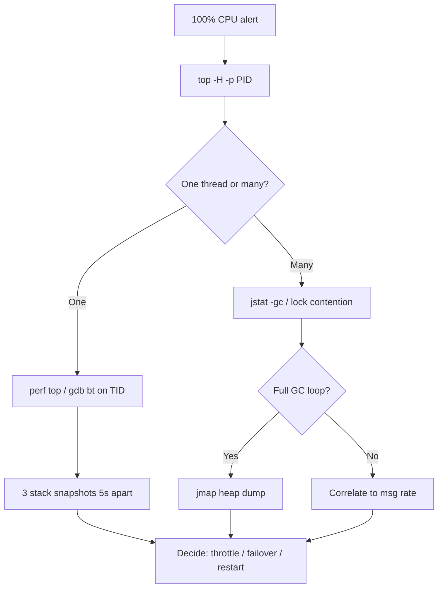
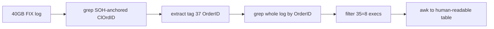

# Mock Interview — Linux Production Support

## Contents

| # | Scenario | Duration |
|---|----------|----------|
| Q1 | FIX session dropped at 15:04 — walk me through shell diagnosis | 30 min |
| Q2 | OMS process at 100% CPU — what commands in order | 30 min |
| Q3 | Extract all execution reports for one order from a 40GB log | 25 min |
| — | Debrief — what a strong candidate demonstrates | — |

---

### Q1. It's 15:04. A FIX session to a European sell-side broker just dropped. The trader is screaming. Walk me through your shell diagnosis, turn by turn.

**Interviewer signal:** They want to see whether you have a mental model of a live FIX session — layers (network, process, application, counterparty) — and whether you triage top-down or thrash. They're also probing for the discipline to *not touch anything* before you know what broke.

**Answer:**

I work top-down, cheapest checks first, and I don't restart anything until I've captured state.

**Turn 1 — confirm the outage is real, not a monitoring artifact.**

```bash
# Is the session marker file / heartbeat file recent?
ls -lrt /var/log/oms/fix/sessions/ | tail -5
# Grep the session log for the disconnect
tail -200 /var/log/oms/fix/session_EUR_BROKER.log | grep -E "Logout|Disconnect|Heartbeat|SocketReadError"
```

If I see `SocketReadError` or `HeartBtInt timeout`, that's a network or peer-side issue. If I see `Logout(35=5)` with a text tag 58, the counterparty walked away deliberately — read tag 58.

**Turn 2 — is our process even alive?**

```bash
ps -ef | grep -i fixengine | grep -v grep
pgrep -af 'session=EUR_BROKER'
```

If the process is gone, that's a different investigation (core dump, OOM killer — `dmesg -T | tail -50`, `journalctl -u oms-fix --since '15:00'`).

**Turn 3 — is the socket still there?**

```bash
ss -tnp | grep <peer_ip>
# or
netstat -antp | grep :<fix_port>
```

I want to see `ESTABLISHED`. If I see `CLOSE_WAIT`, our side hasn't cleaned up — peer sent FIN, we didn't. If `TIME_WAIT`, session already died. If nothing, the TCP connection is fully gone.

**Turn 4 — network path to the broker.**

```bash
ping -c 5 <broker_gateway>
traceroute -n <broker_gateway>
mtr -rwc 20 <broker_gateway>   # if allowed
```

Packet loss on `mtr` at a specific hop points to a network provider issue — I loop in network ops with the mtr output.

**Turn 5 — did *we* cause it? Check load and disk.**

```bash
uptime                          # load avg spike?
df -h /var/log/oms              # log partition full = writes fail = session dies
free -h                         # memory pressure
iostat -xz 1 3                  # disk saturation
```

A full `/var/log` is the single most common self-inflicted FIX drop I've seen.

**Turn 6 — the definitive evidence: the FIX log itself.**

```bash
# Last 500 messages before the drop, timestamps included
awk -v cutoff="15:04:00" '$0 ~ cutoff {found=1} found' /var/log/oms/fix/session_EUR_BROKER.log | head -200
```

I look for the last `35=0` heartbeat we sent and received. Gap in either direction gives the direction of failure.

**Turn 7 — capture, then act.**

Before I resend Logon, I snapshot:

```bash
cp /var/log/oms/fix/session_EUR_BROKER.log /tmp/incident_$(date +%Y%m%d_%H%M).log
netstat -s > /tmp/netstat_$(date +%H%M).txt
```

Then, per runbook, I coordinate with the broker's support desk before initiating re-logon — sequence numbers must match. Blind re-logon with a mismatched `MsgSeqNum` will get us rejected and looks amateur.

**Watch-outs:** Don't `kill -9` the FIX engine to "kick it" — you'll lose the in-memory sequence state and force a resend storm. Don't ping the broker's public IP; ping the actual dedicated line / cross-connect gateway. Don't forget to check *our* NTP drift — a clock skew > 60s will fail Logon at some brokers.

---

### Q2. Trader complains the OMS is slow. `top` shows our main process pegged at 100% CPU. What commands do you run, in order, and why?

**Interviewer signal:** They want to see the sequence: **narrow to a thread → sample what it's doing → correlate to workload → decide action**. Amateurs immediately restart. Strong candidates gather evidence first.

**Answer:**

100% on one core vs. 100% across all cores is a completely different problem, so my first move is to see the shape of the load.

**Step 1 — is it one thread or the whole process?**

```bash
top -H -p $(pgrep -f oms_main)
```

`-H` shows threads. If one thread is at 100% and the others idle → hot loop or stuck GC / market-data burst on one handler. If all threads are hot → real workload spike or lock contention.

**Step 2 — capture what the hot thread is doing.**

```bash
# Get the TID of the hot thread from top, then:
sudo perf top -t <TID>              # samples symbols live
# or a quick stack snapshot:
sudo cat /proc/<PID>/task/<TID>/stack
sudo gdb -p <PID> -batch -ex "thread apply all bt" 2>/dev/null > /tmp/oms_stacks.txt
```

If I don't have `perf` or root, `jstack` for a JVM, or `pstack <PID>` for C++. Take three snapshots 5 seconds apart — if the same frame is on top all three times, that's my culprit.

**Step 3 — correlate to workload.**

```bash
# Order/execution rate right now vs. baseline
tail -f /var/log/oms/oms.log | grep -c "NewOrder"    # count per second by eye
# Or the OMS's own metrics endpoint if it has one
curl -s localhost:9090/metrics | grep -E 'msg_rate|queue_depth'
```

Is this real market volume (open/close auction, news event) or is one client hammering us? A single misbehaving algo sending 50k cancel/replace per second will pin a session handler.

**Step 4 — GC / memory (if JVM).**

```bash
jstat -gc <PID> 1000 10          # GC activity per second, 10 samples
```

If we're in a `Full GC` loop, CPU looks like 100% but the process is doing no useful work. Fix is a heap dump (`jmap -dump:live,format=b,file=/tmp/heap.hprof <PID>`) and hand it to dev — do *not* restart yet if this is a memory leak, because you'll lose the evidence.

**Step 5 — I/O check, because "CPU" can be misleading.**

```bash
iostat -xz 1 5
pidstat -d 1 5 -p <PID>
```

High `%iowait` in top means the process is CPU-bound waiting on disk — usually log-flushing pathology (sync writes to a slow disk).

**Step 6 — decide.**

- Real workload → throttle upstream (disable a noisy client's session, engage the trader to slow down).
- Hot loop bug → capture stacks + heap dump, then failover to standby if we have one.
- GC storm → heap dump, then controlled restart in a maintenance window if possible.
- Never restart before I have `top -H`, three stack snapshots, and the log tail from the minute before the spike. That's the artifact set dev will ask for.



**Watch-outs:** `top` without `-H` hides the actual culprit thread. `strace` on a hot process will *slow it further* and can mask the problem — use `perf` or stack sampling. And don't confuse `%CPU > 100` on `top` — that's normalized to a single core; 400% on a 16-core box is fine, 100% pinned on one core often isn't.

---

### Q3. Given a 40GB FIX log for a trading day, extract every execution report (35=8) for a single ClOrdID. How do you do it — and how do you do it *fast*?

**Interviewer signal:** They're testing whether you can reason about scale — 40GB won't fit in memory, `grep` alone is fine but naive, and there are traps around SOH delimiters, multi-line messages, and related ClOrdIDs from cancel/replace chains.

**Answer:**

The naive answer is `grep ClOrdID=ABC123 fixlog | grep '35=8'`. That works and I'd run it first as a sanity check. But three things bite you in production:

1. **FIX field delimiter is SOH (`\x01`), not pipe.** So `grep ClOrdID=ABC123` will also match `SecondaryClOrdID=ABC123` or `OrigClOrdID=ABC123`. Anchor it.
2. **Cancel/replace chains change the ClOrdID.** The order the trader cares about may have five ClOrdIDs across its lifecycle — you need `OrigClOrdID` too, and possibly `OrderID` (37) which is broker-assigned and stable.
3. **40GB is I/O-bound.** Read it once, not twice.

**Step 1 — sanity grep, with a proper anchor.**

FIX fields are `<TAG>=<VALUE>\x01`. So the safe pattern is `\x0111=ABC123\x01` (SOH-11=-value-SOH). In `grep`:

```bash
LC_ALL=C grep -a $'\x0111=ABC123\x01' /logs/fix_20260717.log > /tmp/order_ABC123.log
```

`LC_ALL=C` gives you ~3-5x speedup on ASCII-only matching. `-a` because grep may see binary bytes and refuse.

**Step 2 — find the full ClOrdID lineage.**

```bash
# Get OrderID (tag 37) from any hit
LC_ALL=C grep -oa $'\x0137=[^\x01]*' /tmp/order_ABC123.log | sort -u
```

Say it returns `37=BRK-9988`. Now sweep the day's log by broker OrderID — that catches every ClOrdID in the cancel/replace chain:

```bash
LC_ALL=C grep -a $'\x0137=BRK-9988\x01' /logs/fix_20260717.log > /tmp/order_full.log
```

**Step 3 — filter to executions only (MsgType 35=8).**

```bash
LC_ALL=C grep -a $'\x0135=8\x01' /tmp/order_full.log > /tmp/order_ABC123_execs.log
wc -l /tmp/order_ABC123_execs.log
```

**Step 4 — make it readable.**

FIX with SOH is unreadable. Pipe through `tr` for display only (never write pipe-delimited back to a file that other tools expect SOH in):

```bash
tr '\x01' '|' < /tmp/order_ABC123_execs.log | less -S
```

Or extract just the fields the trader wants (ExecID 17, ExecType 150, OrdStatus 39, LastPx 31, LastQty 32, TransactTime 60):

```bash
awk 'BEGIN{FS="\x01"} {
  delete f
  for(i=1;i<=NF;i++){ split($i,kv,"="); f[kv[1]]=kv[2] }
  printf "%s  ExecID=%s  ExecType=%s  OrdStatus=%s  LastQty=%s  LastPx=%s\n",
    f[52], f[17], f[150], f[39], f[32], f[31]
}' /tmp/order_ABC123_execs.log
```

**Step 5 — going fast on 40GB.**

- `LC_ALL=C grep` — mandatory.
- If the log is gzipped: `zgrep` is fine but single-threaded; `pigz -dc file.gz | LC_ALL=C grep ...` uses multiple cores for decompression.
- If I do this daily: pre-split logs by hour, or index by ClOrdID/OrderID at write time into a sidecar. On my current desk we run a small indexer that writes `(orderid, byte_offset)` into a SQLite so lookups are O(1) seeks, not a 40GB scan.
- Never load into `vim` or `less` without `-S` and without letting it stream. `less +G` on a 40GB file is fine; `wc -l` will take minutes — use `ls -la` for size, not line count, unless asked.

**Step 6 — a small trap I always mention.**

If the log spans midnight or comes from a bidirectional session, you may have *two* messages with the same ClOrdID (one inbound from client, one outbound to broker). Filter on `SenderCompID` (49) and `TargetCompID` (56) if the trader only wants what went to the market.



**Watch-outs:** Using unanchored `grep ClOrdID=X` will hit `OrigClOrdID` and `SecondaryClOrdID`. Forgetting `LC_ALL=C` on ASCII data is a 3x waste. Running the extraction on the primary logging disk while the OMS is writing at 200MB/s can cause disk contention — do it on a replica or after hours if possible.

---

## Debrief — what the interviewer is scoring

| Signal | Weak | Strong |
|---|---|---|
| **Diagnosis order** | Restarts first, thinks later | Captures state, then acts — process → socket → network → app log |
| **Tool depth** | `top`, `grep`, `tail` only | `ss`, `perf`, `pidstat`, `jstat`, `mtr`, `pstack`, thread-level `top -H` |
| **FIX literacy** | Treats log as plain text | Knows SOH delimiter, MsgType semantics, ClOrdID vs OrderID vs OrigClOrdID lineage |
| **Scale awareness** | Would `cat 40GB \| grep` twice | `LC_ALL=C`, single pass, indexing for repeat lookups |
| **Blast-radius discipline** | `kill -9`, blind re-logon | Snapshots first, coordinates seq-num with counterparty, prefers failover to restart |
| **Communication** | Silent while typing | Narrates hypothesis → command → what result would mean |

**Red flags any interviewer will catch:**
- "I'd just restart it" as the first move.
- Not knowing the difference between `CLOSE_WAIT` and `TIME_WAIT`.
- Confusing `top` %CPU (per-core) with system-wide load.
- Assuming FIX is line-oriented text.
- Not mentioning the counterparty at all in a FIX outage.

**Green flags to demonstrate:**
- Capturing artifacts (`/tmp/incident_*`) *before* remediating.
- Talking about coordinating with broker support / network ops — production support is a team sport.
- Knowing when *not* to act (memory leak evidence → don't restart yet).
- Having a runbook mindset: "per our SOP, step 3 is…"
