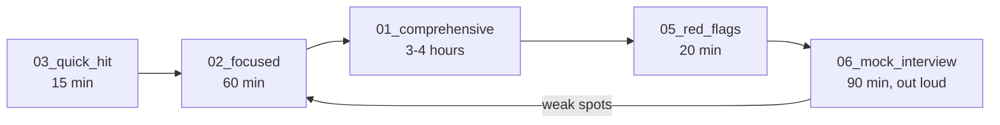

# Networking for OMS Support — Index

Landing page for the networking section. Every file is written for a Technical Analyst / Production Support role at an investment bank or trading firm, with a candidate who has ~5 years supporting a vendor OMS.

## Files in this section

| File | Purpose | Depth | Target audience |
|------|---------|-------|-----------------|
| `01_comprehensive.md` | 100+ Q&A covering OSI/TCP/UDP/multicast/routing/DNS/TLS/LB/trading-specific/latency/market-data/FIX socket issues/diag tools/PCAP/buffers/HTTP2/QUIC/VPN/cloud VPC | Deep | Onsite loop, principal-level support round |
| `02_focused.md` | 50 Q&A drilling the high-frequency topics: TCP state machine, multicast troubleshooting, TLS handshake, kernel bypass, PCAP for FIX, load balancers | Mid | 2nd-round tech screen |
| `03_quick_hit.md` | 25 rapid-fire "one-breath" Q&A — port ranges, MTU, TIME_WAIT, RST vs FIN, ephemeral range, well-known ports | Shallow | Phone screen warm-up |
| `05_red_flags.md` | 15 wrong statements to recognize (and how to gently correct the interviewer if it comes up) | N/A | Self-audit |
| `06_mock_interview.md` | 3 full dialogues: (a) broker session drops every 2h, (b) wire-level walk-through of "Buy 100 AAPL", (c) low-latency market data path | Applied | Onsite loop rehearsal |

## Recommended prep order

## What interviewers actually ask (based on published Glassdoor / HL / LeetCode discuss patterns for bank + prop-shop TA/support roles)

1. **TCP state machine** — TIME_WAIT, CLOSE_WAIT, FIN vs RST. Comes up in nearly every FIX-related session-drop question.
2. **Multicast** — every market-data role. IGMP joins, PIM sparse, A/B feed arbitration.
3. **TLS handshake** — 1.2 vs 1.3, mTLS, cert chain, SAN mismatch, session resumption.
4. **PCAP analysis** — read a `tcpdump` sample, spot the drop / retransmit / RST.
5. **Latency decomposition** — propagation vs serialization vs queueing; one-way vs RTT; PTP.
6. **Diagnostic tools** — `mtr`, `ss -tnp`, `tcpdump`, `ethtool`, `iperf3`. Expect a live-terminal question.
7. **Kernel bypass** — Solarflare Onload / EF_VI / DPDK. Named-drop-with-substance if the desk is low-latency.
8. **Load balancers** — L4 vs L7, DSR, sticky sessions (why FIX sessions cannot round-robin).
9. **Cloud VPC** — as banks move risk / non-realtime OMS to AWS, VPC / PrivateLink / SG vs NACL show up.

## Cross-refs

- FIX socket-level failures — deeper protocol context in `../03_fix_protocol/`.
- Linux-side commands (`ss`, `tcpdump`, `ethtool`) — see `../05_linux/`.
- Situational OMS scenarios that hinge on networking — see `../07_situational/`.
- OSI/L2/L3 quick reference and port cheatsheet — see `../08_cheat_sheet/`.
