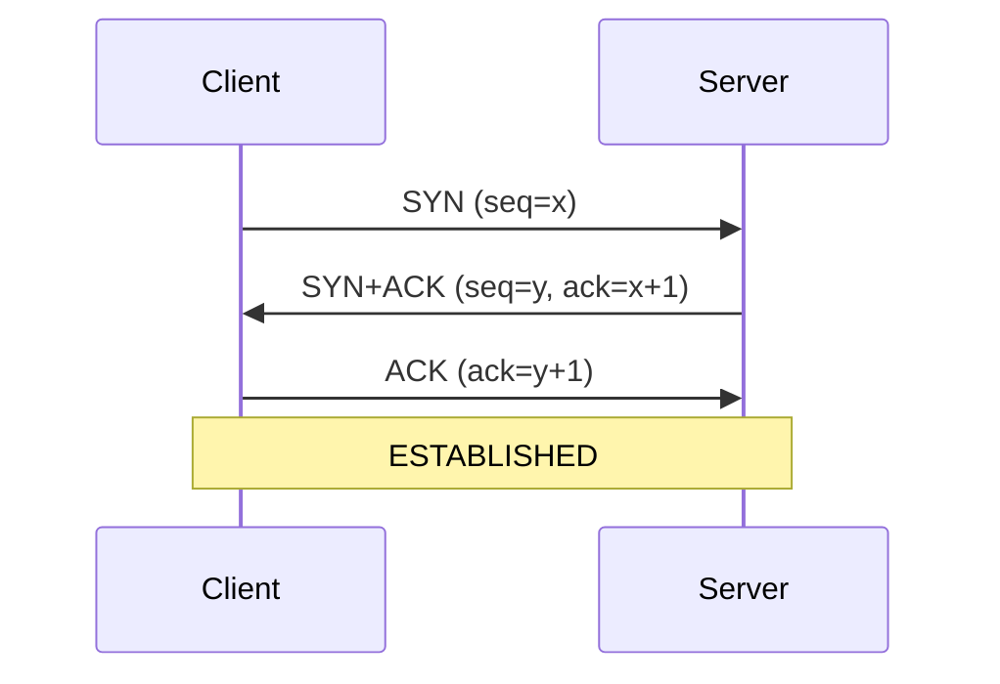

# 06 — Networking Comprehensive Q&A

> 100+ questions on TCP, market data multicast, TLS, colo, kernel bypass, cloud VPCs.

---

## 1. OSI/TCP-IP models (6 Q&A)

### Q1. Walk me through the OSI layers and give a concrete OMS example at each layer.
**Interviewer signal:** Do you actually understand the layering, or is this rote memorization?
**Answer:**
I use OSI as a mental map when triaging incidents. Top-down:

- **L7 Application** — FIX 4.4 messages between our OMS and a European sell-side broker; also HTTP/REST to our reference-data service.
- **L6 Presentation** — character encoding (ASCII/UTF-8 for FIX tag values), TLS record encoding.
- **L5 Session** — TLS session, FIX session (logon/heartbeat/sequence numbers). FIX session state lives here conceptually even though it rides on TCP.
- **L4 Transport** — TCP for FIX and drop-copy, UDP multicast for market data.
- **L3 Network** — IP routing between our DMZ and the broker's edge; ACLs on firewalls filter here.
- **L2 Data Link** — Ethernet, VLANs; MAC-level issues show up as unicast flooding or STP loops.
- **L1 Physical** — fiber, SFPs, patch panels; a flapping port at L1 causes intermittent FIX disconnects.

When a trader calls "orders are stuck," I walk the stack: is the TCP session up (L4)? Are we exchanging heartbeats and MsgSeqNums advancing (L5/L7)? Any packet loss on the WAN link (L3)?
**Watch-outs:** Don't say "TLS is L6" without nuance — it spans 5/6/7 depending on who you ask. Mentioning session-layer FIX is a good tell.

### Q2. How does TCP/IP differ from OSI, and why do practitioners use TCP/IP?
**Interviewer signal:** Practical grasp of the two models.
**Answer:**
TCP/IP is a 4-layer model — Link, Internet, Transport, Application — that collapses OSI's 5, 6, 7 into a single Application layer and merges Physical + Data Link into Link. It's what actually shipped on the internet, so operationally it maps 1:1 to the tools we use: `tcpdump` sees Link/IP/TCP; Wireshark dissects the Application. OSI is pedagogical; TCP/IP is what you debug.
**Watch-outs:** Don't claim OSI is "wrong" — it's still the best shared vocabulary across network and app teams.

### Q3. Where does FIX sit in the stack, and what does that imply for recovery?
**Interviewer signal:** Understanding that FIX has its own sequencing on top of TCP.
**Answer:**
FIX is an application-layer protocol (L7) with its own session semantics (L5-ish): MsgSeqNum, ResendRequest, GapFill, Logon with ResetSeqNumFlag. It rides on TCP, which already guarantees in-order byte delivery. That double-bookkeeping matters in recovery: if TCP resets, the OMS reconnects and replays from the last acknowledged FIX MsgSeqNum — not the last TCP byte. So a network blip that only kills TCP is recoverable via FIX resend; a FIX seq-num mismatch, however, needs a resend request or a session reset coordinated with the broker.
**Watch-outs:** Never confuse TCP retransmit (byte-level, invisible to app) with FIX resend (message-level, driven by MsgSeqNum).

### Q4. What layer does a load balancer operate at, and why does it matter for FIX?
**Interviewer signal:** Do you know L4 vs L7 load balancing and its impact on stateful protocols?
**Answer:**
Depends on the LB. An L4 LB (like a classic NLB) makes decisions on IP:port — it can distribute TCP connections but doesn't inspect FIX. An L7 LB (like F5 with an iRule or nginx) can parse HTTP but generally can't parse FIX without custom logic. For FIX we almost always use L4 with **sticky source IP** or a **direct connection** because FIX sessions are long-lived and stateful — you can't round-robin messages of a single logon across backends. Broker X specifically requires a fixed SenderCompID ↔ backend pairing, which forces us to expose distinct listeners rather than LB.
**Watch-outs:** Don't say "we just put FIX behind an LB." Sticky and health-check semantics are essential.

### Q5. In a packet capture, what would you see at each TCP/IP layer for a new FIX Logon?
**Interviewer signal:** Can you read a pcap.
**Answer:**
Frame by frame in Wireshark:

- **Ethernet II** — src/dst MAC, EtherType 0x0800 (IPv4).
- **IPv4** — src/dst IPs, TTL, protocol 6 (TCP), DF flag.
- **TCP** — SYN → SYN/ACK → ACK three-way handshake to port 9876 (or whatever the broker gave us), then a PSH+ACK with the FIX payload.
- **FIX** — `8=FIX.4.4|9=...|35=A|49=SENDER|56=TARGET|34=1|52=...|98=0|108=30|10=...`

If TLS is in use, after the TCP handshake you see a TLS ClientHello/ServerHello and then encrypted Application Data — FIX bytes are inside.
**Watch-outs:** Confusing the TCP handshake with the FIX Logon exchange — they're distinct.

### Q6. Where does encapsulation vs decapsulation happen, and why do MTU issues bite here?
**Interviewer signal:** Understanding that each layer adds a header, and payload budget is finite.
**Answer:**
Going out: app data → FIX message → TLS record → TCP segment (20B header) → IP packet (20B header) → Ethernet frame (14B header + 4B FCS). Coming in: strip in reverse. The MTU (usually 1500) is the max IP payload on Ethernet, so TCP MSS is 1460 (1500 − 20 IP − 20 TCP). If a VPN or GRE tunnel adds overhead and PMTUD is broken (ICMP filtered), you get silent black-holing: small FIX messages flow, large market-data snapshots hang. I've seen this exact symptom on a VPN circuit to a US buy-side client.
**Watch-outs:** Don't just say "MTU 1500" — mention the arithmetic and ICMP-black-hole failure mode.

## 2. TCP fundamentals — 3-way, 4-way, TIME_WAIT 2*MSL, CLOSE_WAIT, RST vs FIN, keepalives, Nagle, delayed ACK, congestion Reno/Cubic/BBR, SACK (14 Q&A)

### Q1. Walk me through the TCP 3-way handshake and what can go wrong.
**Interviewer signal:** Foundational — you need to nail this.
**Answer:**



Failure modes I've seen:

- **SYN sent, no SYN/ACK** — firewall drop, wrong port, or server not listening. `tcpdump` on both sides isolates it.
- **SYN/ACK sent, no final ACK** — asymmetric routing or reverse-path ACL.
- **RST from server** — port closed or SYN cookies rejected.
- **Slow handshake** — RTT high or SYN retransmit (default 3s, 6s, 12s...).

For FIX to a European sell-side broker across the Atlantic, RTT of 80ms is normal; if I see 500ms handshake, that's a WAN issue not an application issue.
**Watch-outs:** ISN randomization exists for security — don't say "seq starts at 0."

### Q2. Explain TCP's 4-way close and why we sometimes see half-closed connections.
**Interviewer signal:** Understanding of graceful shutdown vs. abort.
**Answer:**

```
Client                         Server
  |--FIN, ACK----------------->|   (client done sending)
  |<-ACK-----------------------|
  |<-FIN, ACK------------------|   (server done sending)
  |--ACK---------------------->|
```

Between the client's FIN and the server's FIN, the connection is **half-closed** — server can still send, client can only ACK. Applications can do a `shutdown(SHUT_WR)` deliberately, but usually both sides `close()` and the halves collapse.

In production I see half-close asymmetry when the OMS reads slower than the broker sends — server's FIN sits queued while the OMS's TCP receive window drains.
**Watch-outs:** FIN doesn't kill the socket immediately — TIME_WAIT still applies to the active closer.

### Q3. What is TIME_WAIT and why is it 2*MSL?
**Interviewer signal:** Do you understand why this exists — it's a common production annoyance.
**Answer:**
TIME_WAIT is the state the **active closer** sits in after sending the final ACK. Duration is 2×MSL (Maximum Segment Lifetime, typically 60s on Linux → 120s total, though tuned lower). Two purposes:

1. **Absorb stray duplicates** — an old segment from the just-closed connection could arrive after a new connection reuses the same 4-tuple; TIME_WAIT lets it be discarded.
2. **Ensure the peer received the final ACK** — if it's lost, the peer retransmits FIN and we must ACK again.

Production impact: an OMS that opens many short-lived connections (say to a REST reference-data service) can exhaust ephemeral ports because each stays in TIME_WAIT for 60–120s. Fixes: `SO_REUSEADDR`, connection pooling, or `net.ipv4.tcp_tw_reuse` (careful with NAT).
**Watch-outs:** `tcp_tw_recycle` is removed in Linux 4.12 — don't recommend it.

### Q4. What is CLOSE_WAIT, and why do I panic when I see thousands of them?
**Interviewer signal:** Real operational experience.
**Answer:**
CLOSE_WAIT means the peer sent us a FIN, our kernel ACKed it, but **our application hasn't called `close()`**. It's almost always an application bug — a handler that didn't clean up on peer disconnect. On our OMS I have an alert on `ss -tan state close-wait | wc -l`; anything over ~50 for a FIX gateway signals a leak. Left unchecked, we run out of file descriptors and stop accepting new connections. The fix is in the app, not the kernel — no tuning saves you.
**Watch-outs:** Don't confuse CLOSE_WAIT (our app's problem) with TIME_WAIT (kernel's normal cleanup).

### Q5. RST vs FIN — when does each happen and what should the OMS do?
**Interviewer signal:** Do you know that RST is an abort and needs special handling?
**Answer:**
- **FIN** — graceful close, both sides drain buffers, seq numbers ordered.
- **RST** — abortive close, immediate. Sent on: closed port, SO_LINGER=0 close, kernel deciding the connection is dead (e.g., data arrived on a closed socket, keepalive timeout).

Impact on FIX: a FIN lets us finish reading buffered messages; an RST discards in-flight bytes. If a broker RSTs mid-message, we may have received a partial FIX frame — the parser should discard it. On reconnect we rely on MsgSeqNum resend, not on the socket state.

Common RST triggers in production: firewall idle-timeout kills the flow's state table entry, next segment gets an "unknown connection" RST from the middlebox. Fix: TCP keepalives shorter than the firewall idle timeout.
**Watch-outs:** RST doesn't guarantee delivery to the peer — it's fire-and-forget.

### Q6. Explain TCP keepalives and how you'd tune them for a FIX session.
**Interviewer signal:** Practical config knowledge.
**Answer:**
TCP keepalive is a kernel-level probe on idle sockets. Defaults on Linux: `tcp_keepalive_time=7200s`, `tcp_keepalive_intvl=75s`, `tcp_keepalive_probes=9` — so ~2h idle before the first probe. Useless for FIX.

For FIX I rely on **application-level heartbeats** (tag 108, typically 30s) instead. The FIX heartbeat is authoritative — if the broker misses 2× HeartBtInt with no TestRequest response, we tear down. TCP keepalive is a belt-and-braces backstop; I set `tcp_keepalive_time=60`, `intvl=10`, `probes=3` on the OMS so a dead peer is detected in ~90s even if the app misses it.
**Watch-outs:** Don't rely on TCP keepalive alone — it's off by default per-socket and needs `SO_KEEPALIVE`.

### Q7. Nagle's algorithm and delayed ACK — why can they interact badly?
**Interviewer signal:** Deep TCP knowledge that separates seniors from mid-level.
**Answer:**
- **Nagle** — coalesce small writes: don't send a small segment while another is unacked. Reduces silly-window syndrome.
- **Delayed ACK** — receiver holds ACK up to 40ms hoping to piggyback on data, reducing pure-ACK overhead.

Combined pathology: sender writes small, Nagle holds it waiting for ACK; receiver holds ACK waiting for data or timer. Result: up to 40ms latency spike on small requests. For FIX and market-data-adjacent request/reply where every ms matters, we set `TCP_NODELAY` (disables Nagle). If we're bulk-writing a large snapshot, we can leave Nagle on and get better throughput.
**Watch-outs:** `TCP_NODELAY` alone isn't a latency panacea — `TCP_QUICKACK` on the reader also helps but is not sticky on Linux.

### Q8. What is the TCP congestion control algorithm doing during slow start vs. congestion avoidance?
**Interviewer signal:** Real understanding of cwnd dynamics.
**Answer:**
- **Slow start** — cwnd starts small (initial window ~10 MSS on modern Linux), doubles per RTT until it hits `ssthresh` or a loss.
- **Congestion avoidance** — after `ssthresh`, cwnd grows by ~1 MSS per RTT (additive increase).
- **Loss event** — halve cwnd (multiplicative decrease), enter fast recovery on triple-dup-ACK.

For a FIX session, the send rate is far below any reasonable cwnd, so we live in a permanent "cwnd is enormous" regime — congestion control basically doesn't matter for us. It bites bulk transfers: an EOD reconciliation file over a lossy WAN suffers because loss halves cwnd repeatedly.
**Watch-outs:** Don't say "TCP is slow because of slow start" for small messages — slow start is per-connection, and after warm-up cwnd is fine.

### Q9. Compare Reno, CUBIC, and BBR.
**Interviewer signal:** Awareness that TCP congestion control has evolved.
**Answer:**
- **Reno** — classic AIMD (additive increase, multiplicative decrease) on packet loss. Fine on lossless LANs, poor on high-BDP links because it takes many RTTs to refill cwnd after a loss.
- **CUBIC** — Linux default since 2.6.19. Cubic function of time since last congestion event; recovers faster on high-bandwidth long-RTT links (transatlantic).
- **BBR** — Google's model-based algorithm. Instead of reacting to loss, it estimates bottleneck bandwidth and RTT and paces to that. Great on shallow buffers and lossy wireless; can be unfair when mixed with loss-based flows.

For a FIX session I don't care — the send rate is trivial. For our EOD file feeds across the WAN, CUBIC (default) is fine; BBR would be worth testing if we ever saw loss-driven throughput collapse.
**Watch-outs:** BBRv1 had bufferbloat/fairness issues; BBRv2/v3 addressed them. Don't oversell BBR.

### Q10. What is SACK and why does it matter?
**Interviewer signal:** Understanding of loss recovery.
**Answer:**
Selective ACK (RFC 2018) lets the receiver tell the sender which non-contiguous byte ranges it has. Without SACK, if you lose one segment in a window of 20, the sender knows only "up to segment N is ACKed" and might retransmit everything after N (Reno's classic behavior). With SACK, receiver says "I have N+2 through N+20 but not N+1," and the sender retransmits just N+1.

Big deal on lossy or long-RTT links. On our transatlantic FIX links a single-packet loss without SACK could cost us seconds; with SACK, one RTT. It's on by default on Linux; I only check `net.ipv4.tcp_sack=1` if I'm auditing.
**Watch-outs:** SACK is advisory — sender can still choose to retransmit conservatively.

### Q11. What is the difference between the receive window and the congestion window?
**Interviewer signal:** Do you know both limits on in-flight bytes?
**Answer:**
- **rwnd** (receive window) — flow control, advertised by receiver: "I have this much buffer space."
- **cwnd** — congestion control, sender-side: "network can handle this much."

Effective in-flight = `min(rwnd, cwnd)`. On a slow consumer, rwnd shrinks and eventually hits zero → zero-window probes. On a lossy network, cwnd shrinks after loss. In production I look at both via `ss -tin`; a persistent `rwnd = 0` means the app isn't reading fast enough (bug or GC pause); a small cwnd means the network is dropping.
**Watch-outs:** Window scaling (RFC 1323) lets rwnd exceed 64KB; make sure it's enabled on high-BDP paths.

### Q12. What happens when a FIX socket experiences packet loss — what do I actually see?
**Interviewer signal:** Bridging TCP theory to FIX operations.
**Answer:**
TCP handles the loss transparently: retransmit after RTO or fast retransmit on 3 dup-ACKs. From the FIX app's perspective, the message just arrives a bit later; there's no gap. The tell is **latency spikes** — a 200ms RTO retransmit shows up as a 200ms hiccup in FIX ack latency. I check:

1. `netstat -s | grep -i retrans` for retransmit counters trending up.
2. `ss -tin` for cwnd and RTO on the specific socket.
3. `tcpdump` for actual retransmits and dup-ACKs.

If FIX MsgSeqNum has a gap, that is **not** a TCP loss — TCP would have retransmitted. A seq-num gap means the app or gateway dropped a message, or (rarely) the FIX session was reset. Different problem.
**Watch-outs:** Confusing TCP retransmit with FIX gap is a classic junior mistake.

### Q13. What is the difference between TCP RTO and Fast Retransmit?
**Interviewer signal:** Loss recovery detail.
**Answer:**
- **RTO** — Retransmit Timeout, computed from smoothed RTT + variance. Minimum on Linux is 200ms (`tcp_rto_min`). Fires when nothing has been ACKed for RTO duration.
- **Fast Retransmit** — sender sees 3 duplicate ACKs (receiver ACKing the same seq repeatedly because later segments arrived), infers loss without waiting for RTO. Much faster.

RTO is the fallback when there's no data flowing to trigger dup-ACKs (e.g., you lost the last segment of a burst). On our FIX links I've seen 200ms latency spikes that were exactly one RTO — usually the last message before a lull got dropped.
**Watch-outs:** Don't confuse RTO with keepalive timers — different mechanisms.

### Q14. When would you use `SO_LINGER` with timeout 0, and why is it dangerous?
**Interviewer signal:** Awareness of socket options that trigger RST.
**Answer:**
`SO_LINGER` with `l_onoff=1, l_linger=0` on `close()` sends a **RST immediately**, discarding any queued data. Use case: kill a hung connection quickly without leaving a socket in TIME_WAIT.

Dangerous because:
- The peer sees an RST, not a graceful close — they may log it as an error.
- Any unsent data (including in-flight FIX messages) is dropped without notification.
- Downstream state may diverge — broker thinks we sent a message, we think we didn't.

I've only used it in tooling that needs to blow away leftover sockets during a forced restart, never in the FIX critical path.
**Watch-outs:** Don't set this "to avoid TIME_WAIT" — you're trading data safety for port availability.

## 3. UDP & multicast — IGMP, SSM, PIM, why market data uses multicast, gap detection (10 Q&A)

### Q1. Why does market data use UDP multicast instead of TCP unicast?
**Interviewer signal:** Do you understand the fundamental trade-off?
**Answer:**
Three reasons:

1. **Fan-out** — one publisher, thousands of consumers on the trading floor. TCP would need one connection per consumer; multicast delivers one packet that the network replicates to all subscribers of the group.
2. **Latency** — no retransmit delay, no head-of-line blocking. Stale data is worthless; a retransmitted quote from 200ms ago is noise, not signal.
3. **Bandwidth** — the publisher sends once; the exchange's edge router does the fan-out.

Trade-offs: no delivery guarantee, no ordering, no flow control. The application layer handles gap detection and, if provided, a separate TCP "recovery" or "retransmit" channel (e.g., PIM/MDP3 style — feed A, feed B, plus a snapshot channel).
**Watch-outs:** Don't say "UDP is faster than TCP" — the win is fan-out and no HOL blocking, not raw per-packet latency.

### Q2. What is IGMP and how does it enable multicast subscription?
**Interviewer signal:** L3 multicast plumbing.
**Answer:**
IGMP (Internet Group Management Protocol) is how hosts tell their local L3 switch/router "I want to receive multicast group 239.1.2.3." Version summary:

- **IGMPv2** — join/leave via Report/Leave messages; router queries periodically.
- **IGMPv3** — adds source filtering (INCLUDE/EXCLUDE lists), required for SSM.

The switch does IGMP snooping to build a table mapping group → egress ports, so multicast doesn't flood every port on the VLAN. If snooping is broken, market data floods the VLAN and starves unrelated hosts — I've seen this take down a trading room.
**Watch-outs:** "IGMP joins the group" — technically the host joins on the local segment; PIM does the WAN-side routing.

### Q3. Explain the difference between ASM (Any-Source Multicast) and SSM (Source-Specific Multicast).
**Interviewer signal:** Modern multicast deployment knowledge.
**Answer:**
- **ASM (*,G)** — receiver subscribes to group G, doesn't specify source. Requires a Rendezvous Point (RP) in PIM-SM to bridge senders and receivers. Traditional, but vulnerable to unwanted senders on the group.
- **SSM (S,G)** — receiver subscribes to a specific (source, group) pair. Requires IGMPv3. No RP needed. Simpler, safer, and standard for exchange feeds — you subscribe to "this group from this exact exchange source IP."

Exchange feeds like MDP3, ITCH, and OPRA are SSM. Getting SSM wrong (using ASM by mistake) shows up as either no data (routing doesn't converge) or unauthorized sources leaking.
**Watch-outs:** SSM group range is 232.0.0.0/8 by convention — don't collide.

### Q4. What is PIM and how does it distribute multicast across a routed network?
**Interviewer signal:** WAN-scale multicast routing.
**Answer:**
PIM (Protocol Independent Multicast) is the L3 routing protocol for multicast. It's "protocol independent" because it reuses the unicast RIB for RPF (Reverse Path Forwarding) checks.

- **PIM-SM (Sparse Mode)** — builds a shared tree rooted at an RP for (*,G), then switches to a shortest-path tree (SPT) per source. Used with ASM.
- **PIM-SSM** — no RP; receiver's leaf router builds an SPT directly toward the source IP. Used with SSM.
- **PIM-DM (Dense Mode)** — flood-and-prune, only viable in small dense networks.

For exchange feeds via the WAN, we care that PIM-SSM converges quickly and that RPF succeeds — if the unicast route to the source flaps, multicast drops. I've traced a market-data outage to a unicast BGP reconvergence causing RPF failures for 20 seconds.
**Watch-outs:** PIM isn't itself carrying data — it just builds forwarding state. Data is native IP multicast packets.

### Q5. How do you detect gaps in a market data feed?
**Interviewer signal:** Practical UDP application logic.
**Answer:**
Every packet has a monotonic sequence number in the app header (exchange-specific, e.g., MDP3 has `MsgSeqNum` in the packet header). The feed handler:

1. Tracks the last-seen sequence per channel.
2. On receipt, checks `pkt.seq == last + 1`.
3. If `pkt.seq > last + 1` → **gap**, buffer subsequent packets briefly (some feeds arrive slightly out of order due to A/B feed timing).
4. After a short wait (say 5–50ms), if the gap isn't filled by the redundant B feed, hit the exchange's TCP snapshot/replay channel to request the missing range.
5. If `pkt.seq < last` → duplicate (usually the B feed), discard.

Metrics I alert on: gap rate per second, replay request rate, out-of-order rate, and time-to-recovery.
**Watch-outs:** Naive gap detection that immediately requests replay on every gap creates a thundering herd on the exchange's TCP endpoint.

### Q6. What is A/B feed arbitration and why is it standard for market data?
**Interviewer signal:** Redundancy pattern awareness.
**Answer:**
Exchanges publish the same feed on two independent multicast groups (Feed A and Feed B) via disjoint network paths. Consumers subscribe to both and arbitrate: for each packet, take whichever arrived first (by seq num), discard the duplicate.

Benefit: single-packet losses on one path are covered by the other. Only when both A and B drop the same packet do we fall back to the exchange's TCP recovery. On our OMS's market-data adapter we log per-feed loss rates independently — divergence between A and B loss rates points to a specific path (usually a switch or SFP on one side).
**Watch-outs:** Timing skew between A and B matters; you need a small reorder window to accept "B beat A by 2ms."

### Q7. What is TCP recovery / snapshot channel and how does it complement multicast?
**Interviewer signal:** Understanding of the full recovery stack.
**Answer:**
Multicast is best-effort. For gaps that neither A nor B fills, exchanges provide:

- **Snapshot channel** — periodic full state of the book (usually multicast, higher-sequence, so joiners can bootstrap).
- **Replay/TCP recovery** — a unicast TCP request-reply endpoint where the client asks "give me packets N through M for channel X."

The feed handler needs to know when to use which:

- Small gap, replay is fast → TCP replay.
- Large gap or session start → wait for next snapshot cycle, apply, then join incremental.

Handling this wrong (asking for a 1M-packet replay on TCP) can overload the exchange's recovery endpoint and get you rate-limited or disconnected.
**Watch-outs:** Snapshots are usually bandwidth-throttled and periodic — don't assume "just get a fresh snapshot" is instant.

### Q8. What kernel/OS tuning matters for multicast receivers?
**Interviewer signal:** Ops-level knowledge.
**Answer:**
- **Socket receive buffer** — `SO_RCVBUF`; default 200KB is way too small for a busy feed. I set 8–32MB and bump `net.core.rmem_max` accordingly.
- **NIC ring buffer** — `ethtool -G ethN rx 4096` to prevent NIC-level drops during bursts.
- **IRQ affinity / RSS** — pin NIC RX queues to specific CPU cores; keep the feed handler on the same NUMA node as the NIC.
- **`SO_REUSEPORT`** — for scaling receivers across cores.
- **Disable GRO/LRO on receive** — batching kills latency for time-sensitive apps.
- **Monitor drops** — `ethtool -S ethN | grep -i drop`, `netstat -s | grep -i "packet receive errors"`, `ss -uapn` for UDP recv-Q.

I've fixed a "feed handler dropping packets" incident purely by tripling the socket buffer — the app was fine, the kernel queue was full.
**Watch-outs:** Increasing rmem doesn't help if the app can't drain fast enough; check the drain rate first.

### Q9. Why is UDP checksum verification important and when might it be skipped?
**Interviewer signal:** Data integrity awareness.
**Answer:**
UDP has a 16-bit checksum over pseudo-header + UDP header + payload. It's optional in IPv4 (can be zero), mandatory in IPv6. For market data, the exchange sets it; the receiver's NIC or kernel verifies. On modern NICs, checksum offload does this in hardware.

Skipping (e.g., `UDP_NO_CHECK6_TX` or checksum-zero on IPv4) is used in latency-critical monitoring where bit errors are handled at the app layer via CRC or sequence checks. For production market data we always verify — a corrupted price is worse than a missing price.
**Watch-outs:** VXLAN and other tunnels sometimes zero the outer UDP checksum; make sure the inner protocol verifies.

### Q10. What happens if a host misses an IGMP query — do subscriptions expire?
**Interviewer signal:** Multicast liveness details.
**Answer:**
Yes. The querier (elected router or switch) sends periodic General Queries; hosts respond with Membership Reports. If no host reports for a group within the group-membership-interval (~260s default with IGMPv2), the switch prunes that group off the port. Subscriber goes silent, feed handler starts logging gaps that never recover.

Real-world: a host with a heavy CPU stall (say, a long GC) misses the IGMP query. Recovery: some stacks respond immediately on receipt of any query; others wait for the next report interval. On our OMS market-data receivers we watch for sudden per-port drop-outs and correlate with IGMP snooping table changes on the ToR switch.
**Watch-outs:** IGMP snooping querier configuration is subtle — in a pure-L2 VLAN with no router, you need a snooping querier or membership times out.

## 4. IP addressing & routing — v4/v6, CIDR, RFC1918, NAT, MTU 1500/9000, PMTUD, OSPF/BGP (8 Q&A)

### Q1. What is CIDR and how do you calculate the subnet for 10.20.30.0/22?
**Interviewer signal:** Baseline networking arithmetic.
**Answer:**
CIDR (Classless Inter-Domain Routing) uses a prefix length instead of classful A/B/C boundaries. `/22` means 22 mask bits, 10 host bits → 1024 addresses, 1022 usable.

For 10.20.30.0/22:
- The `/22` mask is `255.255.252.0`.
- The 22 network bits leave the third octet's top 6 bits as network; bottom 2 bits + fourth octet are host.
- 30 in binary is `00011110`; masking with the top-6 pattern (`11111100`) gives `00011100` = 28.
- So the network is **10.20.28.0/22**, usable range **10.20.28.1 – 10.20.31.254**, broadcast **10.20.31.255**.

I use CIDR daily when reading firewall rules — a rule for `10.20.28.0/22` covers the whole trading VLAN, not just `10.20.30.x`.
**Watch-outs:** Don't confuse `/22` (1024 addresses) with `/24` (256). Off-by-a-factor-of-4 is embarrassing on a firewall change.

### Q2. What are the RFC1918 ranges and why do they matter for a bank's network?
**Interviewer signal:** Fundamentals.
**Answer:**
- `10.0.0.0/8` — 10.x.x.x
- `172.16.0.0/12` — 172.16.x.x to 172.31.x.x
- `192.168.0.0/16` — 192.168.x.x

These are non-routable on the public internet. Banks use them internally for everything: OMS, market-data VLANs, back-office. Any traffic leaving the enterprise crosses a NAT or is proxied. When integrating with a client's network, IP overlap is the classic problem — two firms both using 10.10.0.0/16 need NAT at the boundary, and I've spent hours debugging why "the same URL from the same IP" behaves differently — it was a NAT'd view.
**Watch-outs:** 100.64.0.0/10 (CGNAT) is often mistaken for RFC1918; it isn't.

### Q3. Explain source NAT vs. destination NAT and where you see each in an OMS setup.
**Interviewer signal:** Practical NAT understanding.
**Answer:**
- **SNAT (Source NAT)** — rewrite source IP on egress. Typical: internal 10.x host reaches an external broker via a firewall's public IP.
- **DNAT (Destination NAT)** — rewrite destination on ingress. Typical: broker connects to our public IP:9876; firewall rewrites to internal FIX gateway 10.10.5.5:9876.

For FIX we usually run **static NAT / 1:1 mappings** so the broker sees a stable IP and we can whitelist theirs. On the OMS side, if a US buy-side client connects into us, they hit our public VIP → DNAT → FIX gateway. If our OMS reaches out to a European sell-side broker, we SNAT to our egress VIP that they've whitelisted.

Debugging: when a broker says "we're not seeing your logon," half the time it's a NAT mismatch — we're not SNAT'ing to the IP they whitelisted, or their firewall is rejecting our source.
**Watch-outs:** PAT (many-to-one port translation) breaks assumptions about stable ephemeral source ports — don't PAT FIX.

### Q4. Compare IPv4 and IPv6 for a trading environment.
**Interviewer signal:** Awareness even if we don't run IPv6 in prod.
**Answer:**
- **Header** — IPv4 has variable-length header (options); IPv6 has fixed 40-byte header, options via extension headers. Faster to parse.
- **Address** — 32-bit vs 128-bit; ~340 undecillion vs ~4 billion.
- **Fragmentation** — IPv4 routers can fragment; IPv6 does not — only the source fragments, and PMTUD is mandatory.
- **Checksums** — IPv4 has header checksum, IPv6 removes it (relies on link layer + transport).
- **NAT** — largely unnecessary in IPv6; global addresses everywhere.

In banking, IPv4 dominates the trading fabric — brokers, exchanges, market data are all v4. IPv6 is more common for corporate/mobile. If we ever move, PMTUD failures become louder because there's no in-network fragmentation as a safety net.
**Watch-outs:** Don't overstate IPv6 adoption in the trading space — it's still rare on FIX links.

### Q5. Why do some hosts use MTU 9000 (jumbo frames) and when is it dangerous?
**Interviewer signal:** Understanding of MTU trade-offs.
**Answer:**
Jumbo frames (MTU 9000) improve throughput by amortizing per-packet overhead — fewer interrupts, more payload per frame. Used inside data centers for storage traffic, backups, and market-data replication.

Danger: **MTU mismatch**. If one segment of the path is 1500 and DF (don't fragment) is set, packets are dropped and ICMP "fragmentation needed" is sent. If ICMP is filtered (common in banks!), you get **PMTUD black-holing**: TCP handshake works (small packets), but the first full-MTU segment silently disappears and the connection hangs. Symptom: FIX Logon succeeds, first big NewOrderList disappears.

Diagnosis: `ping -M do -s 8972 target` — if the small ping works but the jumbo doesn't, you have an MTU gap.
**Watch-outs:** MTU must be end-to-end consistent, or PMTUD must work. In practice, keep external-facing links at 1500 and only use jumbo inside a well-controlled DC fabric.

### Q6. Explain Path MTU Discovery and its failure modes.
**Interviewer signal:** Real ops-facing troubleshooting knowledge.
**Answer:**
PMTUD (RFC 1191) works like this: sender sets DF (Don't Fragment) on all packets. If a router along the path has smaller MTU, it drops the packet and sends ICMP Type 3, Code 4 ("fragmentation needed, DF set") back with the next-hop MTU. Sender caches this and reduces the send size.

Failure modes:

1. **ICMP filtered** — the ICMP message never gets back, sender keeps retransmitting the same too-big packet → **black hole**.
2. **Router doesn't include next-hop MTU** — old routers just send Code 4 without the MTU; sender has to guess.
3. **Path asymmetry** — ICMP takes a different return path that's blocked.

Linux mitigation: PLPMTUD (packetization-layer PMTUD, RFC 4821) probes without relying on ICMP. Also `tcp_mtu_probing=1` enables it.
**Watch-outs:** Blindly setting a lower MTU on the interface is a common wrong fix — it hides the root cause and you pay for it forever.

### Q7. OSPF vs BGP — what's the role of each and where do they show up in a bank?
**Interviewer signal:** L3 routing at a high level.
**Answer:**
- **OSPF** — Interior Gateway Protocol, link-state, fast convergence within an AS. Used inside a single site or campus network. Each router builds a full topology (LSDB) and runs Dijkstra.
- **BGP** — Exterior Gateway Protocol, path-vector, policy-driven. Used between ASes (peering with ISPs, brokers, exchanges via cross-connect). Also used internally at scale (iBGP) in big fabrics — but that's a design choice, not the norm.

In a bank: OSPF or IS-IS runs across the internal fabric (data center, WAN backbone). BGP runs at the edge, peering with ISPs, exchange colo cross-connects, and sometimes broker private lines. When a market-data feed dies, I'll check the exchange's BGP session at the edge and OSPF adjacency on our internal path.
**Watch-outs:** Don't say "OSPF is faster than BGP" — different jobs. BGP convergence is intentionally slow because policy matters more than speed.

### Q8. What's the difference between a broadcast, a multicast, and a unicast — and how does an OMS use each?
**Interviewer signal:** Basic delivery models.
**Answer:**
- **Unicast** — one to one. FIX sessions, drop-copy, TCP recovery channels. Point-to-point.
- **Broadcast** — one to all on a subnet. Rare above L2; ARP is the classic example. Trading apps generally don't broadcast — it doesn't scale beyond one L2 segment.
- **Multicast** — one to many subscribers. Market data (MDP3, ITCH, OPRA), some internal pub/sub, cluster membership (Aeron, some MoM products).

Concrete: our OMS has FIX unicast to brokers, multicast subscriptions to exchange market data, and internal multicast for the price cache to distribute quotes to trader desktops (though many shops have moved to TCP fan-out via a middleware bus for easier NAT/firewall traversal).
**Watch-outs:** Anycast is a fourth mode — one destination, multiple physical hosts, used by DNS/CDN — worth mentioning if the interviewer probes.
## 5. DNS

### Q1. Walk me through the common DNS record types and when you'd use each.
**Interviewer signal:** Basic DNS literacy.
**Answer:**
- **A** — hostname to IPv4 address.
- **AAAA** — hostname to IPv6 address.
- **CNAME** — alias one name to another canonical name; cannot coexist with other records at the same label and never at the zone apex.
- **PTR** — reverse lookup, IP to hostname; lives in `in-addr.arpa` / `ip6.arpa` zones; used by mail servers and SSH logs.
- **MX / TXT / SRV / NS** round out the common set — MX for mail, TXT for SPF/DKIM/verification, SRV for service discovery, NS for delegation.

**Watch-outs:** Don't put a CNAME at the zone apex — use ALIAS/ANAME or flatten to A.

### Q2. What is TTL, and how does it affect a DNS change rollout?
**Interviewer signal:** Understands caching and change management.
**Answer:** TTL is how long resolvers and downstream caches may hold a record before re-querying authoritative. Lower TTL means faster propagation but more query load; higher TTL is cheaper but slower to roll back. Standard playbook before a cutover: drop TTL to 60s a day ahead, do the switch, verify, then raise back. Note that some resolvers and JVMs ignore TTL (Java's `networkaddress.cache.ttl` defaults to forever with a SecurityManager) so app-level restarts may still be needed.

**Watch-outs:** Negative caching (NXDOMAIN) has its own TTL via the SOA minimum field.

### Q3. What is split-horizon DNS and why do trading firms use it?
**Interviewer signal:** Real network topology awareness.
**Answer:** Split-horizon (a.k.a. split-brain) DNS returns different answers for the same name depending on the querying client's network. Internal resolvers hand out RFC1918 or private-VLAN addresses for `oms.internal.example`, while external resolvers either return a DMZ VIP or refuse to answer. Trading shops use it so market-data feed handlers and OMS hosts reach counterparties over dedicated cross-connects rather than the public internet, and to hide internal topology.

**Watch-outs:** DNSSEC and split-horizon fight each other; misconfigured views cause "works from my laptop, fails from prod" bugs.

### Q4. Show the commands you'd use to debug a DNS resolution issue on Linux.
**Interviewer signal:** Hands-on Linux comfort.
**Answer:**
```bash
# authoritative lookup, bypassing local cache
dig +short oms.example.com @8.8.8.8
dig +trace oms.example.com          # follow delegation from root
dig -x 10.20.30.40                  # reverse PTR

# what will glibc actually do? check nsswitch and resolver
getent hosts oms.example.com
cat /etc/nsswitch.conf | grep hosts # order: files dns myhostname
cat /etc/resolv.conf                # nameservers, search domains

# tcpdump on port 53 if you suspect nothing is going out
sudo tcpdump -ni any port 53
```
`/etc/nsswitch.conf`'s `hosts:` line decides whether `/etc/hosts`, DNS, mDNS, or systemd-resolved is consulted and in what order — a rogue `/etc/hosts` entry is a classic gotcha.

**Watch-outs:** `nslookup` uses its own resolver path; prefer `dig` or `getent hosts` to match what the app sees.

## 6. Firewalls

### Q1. iptables vs nftables — what changed and why does it matter?
**Interviewer signal:** Awareness of current Linux stack.
**Answer:** nftables is the replacement for iptables/ip6tables/arptables/ebtables, all unified under one `nft` CLI and one kernel subsystem (`nf_tables`). It has a single ruleset with named tables/chains, atomic rule updates, native sets and maps (so no more "one rule per IP"), and better performance on large rulesets. iptables commands still work via the `iptables-nft` shim on modern distros (RHEL 8+, Ubuntu 20.04+). New work should be in nftables; legacy runbooks still lean on iptables syntax.

**Watch-outs:** Mixing `iptables-legacy` and `iptables-nft` on the same host silently splits your ruleset.

### Q2. Explain INPUT, OUTPUT, and FORWARD chains.
**Interviewer signal:** Packet flow understanding.
**Answer:**
- **INPUT** — packets destined for the local host (something bound on this box).
- **OUTPUT** — packets originating from the local host.
- **FORWARD** — packets being routed through this host to somewhere else; only matters if IP forwarding is on (router / NAT gateway / container host).
- On a bastion or bridge/gateway, FORWARD is where the real policy lives; on a plain app server it's usually empty and you police INPUT/OUTPUT.

**Watch-outs:** Docker inserts its own FORWARD rules — hand-rolled DROP policies on FORWARD can break container networking.

### Q3. What is conntrack and why do stateful firewalls need it?
**Interviewer signal:** Understands why "ESTABLISHED,RELATED" works.
**Answer:** conntrack is the kernel connection-tracking table that remembers 5-tuples and their state (NEW, ESTABLISHED, RELATED, INVALID). A stateful rule like `-m conntrack --ctstate ESTABLISHED,RELATED -j ACCEPT` at the top of INPUT lets replies from outbound connections back in without opening the ports statically. The table is bounded (`net.netfilter.nf_conntrack_max`); on a high-throughput OMS or feed handler it can fill, at which point new connections get dropped and you see "nf_conntrack: table full" in dmesg.

**Watch-outs:** UDP has no real state — conntrack timeouts (30s default) can prematurely close FIX-over-UDP-adjacent flows; tune `nf_conntrack_udp_timeout*`.

### Q4. Write a minimal stateful ruleset that allows SSH and an app on 8080, drops the rest.
**Interviewer signal:** Can you actually type it.
**Answer:**
```bash
# iptables flavor
iptables -P INPUT DROP
iptables -P FORWARD DROP
iptables -P OUTPUT ACCEPT
iptables -A INPUT -i lo -j ACCEPT
iptables -A INPUT -m conntrack --ctstate ESTABLISHED,RELATED -j ACCEPT
iptables -A INPUT -m conntrack --ctstate INVALID -j DROP
iptables -A INPUT -p tcp --dport 22   -m conntrack --ctstate NEW -j ACCEPT
iptables -A INPUT -p tcp --dport 8080 -m conntrack --ctstate NEW -j ACCEPT
iptables -A INPUT -p icmp -j ACCEPT
```
Order matters: put the ESTABLISHED accept first so 99% of packets short-circuit.

**Watch-outs:** Set the default policy to DROP only after you've inserted the ACCEPT for your current SSH session — otherwise you lock yourself out.

## 7. Load Balancers & Proxies

### Q1. L4 vs L7 load balancing — where do you draw the line?
**Interviewer signal:** Design judgment.
**Answer:**
- **L4** (HAProxy in TCP mode, LVS/IPVS, AWS NLB) — routes on 5-tuple, does not parse the payload, lowest latency, TLS passthrough only. Right for FIX sessions, kdb+ RDB tickerplants, raw TCP.
- **L7** (nginx, HAProxy in HTTP mode, Envoy, AWS ALB) — parses HTTP, can route on path/header/host, terminate TLS, do retries, inject headers. Right for REST APIs, gRPC, browser-facing traffic.
- Trading order paths usually want L4 for latency; management/monitoring planes use L7.

**Watch-outs:** L7 breaks anything that isn't strictly HTTP — don't front FIX with an ALB.

### Q2. What is Direct Server Return (DSR) and when would you use it?
**Interviewer signal:** Knows LVS-style architectures.
**Answer:** In DSR (a.k.a. direct routing), the load balancer only sees the inbound half of the flow — the request comes in via the VIP, and the backend replies **directly** to the client, bypassing the LB on the return path. This slashes LB CPU and latency, and lets one LB front huge outbound bandwidth (market-data multicast fan-out, streaming). Requires backends to accept traffic for the VIP (loopback alias with `arp_ignore=1`) and the LB and backends on the same L2 segment.

**Watch-outs:** No L7 inspection possible; asymmetric routing confuses stateful firewalls and conntrack.

### Q3. Sticky sessions vs stateless — how do you decide, and what mechanisms exist?
**Interviewer signal:** Understands trade-offs.
**Answer:** Prefer stateless; use stickiness only when session state can't be externalized. Mechanisms:
- **Source IP hash** (L4) — cheap but breaks behind NAT/CGNAT.
- **Cookie insertion** (L7) — LB sets a cookie naming the backend.
- **Consistent hashing** (e.g., on session ID header) — survives backend add/remove better than modulo.

For an OMS, TCP-level stickiness is inherent to the FIX session (one long-lived TCP connection); the stickiness question really surfaces on HTTP APIs and websocket fan-out.

**Watch-outs:** Sticky + slow drain = uneven backend load during deploys; always pair with connection draining.

### Q4. What makes a good health check, and how do you avoid flapping?
**Interviewer signal:** Production ops sense.
**Answer:**
- Check the actual dependency path, not just TCP accept — e.g., a `/health` that touches the DB pool and downstream feed handler.
- Separate **liveness** (is the process alive) from **readiness** (should traffic go here now).
- Use rise/fall thresholds (e.g., 2 successes to add, 3 failures to remove) and reasonable interval/timeout.
- Fail-open with caution: if every backend fails the check, some LBs black-hole; others send traffic to all — know which you have.
- Slow-start / connection ramp for freshly added backends so JIT warmup doesn't kill them.

**Watch-outs:** Health check that hits `/` on a busy app can itself DoS the app; put health on a dedicated cheap endpoint.

## 8. TLS

### Q1. Walk through a TLS 1.2 handshake.
**Interviewer signal:** Core crypto/networking depth.
**Answer:**
1. **ClientHello** — client sends supported ciphers, TLS versions, SNI, random.
2. **ServerHello** — server picks cipher, sends its random.
3. **Certificate** — server sends its cert chain.
4. **ServerKeyExchange** (ECDHE ciphers) — server sends ephemeral DH params signed by cert key.
5. **ServerHelloDone**.
6. **ClientKeyExchange** — client sends its ECDHE public.
7. Both derive the master secret from the two randoms + shared secret; exchange **ChangeCipherSpec** + **Finished** (encrypted, integrity-checked).
8. Application data flows.

Two round trips before app data. TLS 1.3 collapses this to one RTT (or 0-RTT with early data).

**Watch-outs:** RSA key exchange (no ECDHE) has no forward secrecy — banned in modern configs.

### Q2. What is mTLS and where do you deploy it?
**Interviewer signal:** Zero-trust / service-mesh awareness.
**Answer:** Mutual TLS — the server presents a cert as normal, and the client also presents one, which the server validates against a trusted CA. Used for service-to-service auth inside a mesh (Istio, Linkerd), for FIX sessions over the internet with counterparties, and for admin/API gateways where password auth isn't good enough. Nice property: identity is at the transport layer, no bearer token to leak.

**Watch-outs:** Client cert rotation and revocation are painful — need an internal CA plus short-lived certs (SPIFFE/SPIRE) or you'll drift.

### Q3. Explain the certificate chain and how the client validates it.
**Interviewer signal:** Understands PKI.
**Answer:** The server presents its leaf cert plus intermediates (but not the root). The client walks the chain: for each cert, verify the signature using the issuer's public key, check validity dates, check name constraints and key usage, and continue until it reaches a cert whose issuer is in the local trust store (the root CA). Also checks revocation via CRL or OCSP (with OCSP stapling reducing the extra round trip). If the server forgets to send intermediates, some clients (browsers) fetch them via AIA; many services (Java, curl) don't and fail.

**Watch-outs:** Expired intermediate is the classic 3 AM outage — monitor the whole chain, not just the leaf.

### Q4. SAN vs CN — why did SAN win?
**Interviewer signal:** Modern TLS knowledge.
**Answer:** CN (Common Name) is a single string in the cert subject that historically held the hostname. Subject Alternative Name is a proper extension that lists one or more DNS names, IPs, or URIs. Chrome dropped CN matching in 2017 (RFC 2818 deprecated it long before), so a cert **must** have a SAN today. SAN also supports multiple hostnames and wildcards cleanly on a single cert.

**Watch-outs:** Wildcards match only one label — `*.example.com` covers `a.example.com` but not `a.b.example.com`.

### Q5. TLS 1.2 vs 1.3 — what's actually different?
**Interviewer signal:** Currency.
**Answer:**
- **Handshake:** 1 RTT (1.3) vs 2 RTT (1.2); 0-RTT resumption in 1.3.
- **Cipher suites:** 1.3 removed RSA key exchange, CBC modes, SHA-1, static DH — only AEAD ciphers (AES-GCM, ChaCha20-Poly1305) remain; suite negotiation is much simpler.
- **Forward secrecy:** mandatory in 1.3 (ECDHE only).
- **Encrypted handshake:** most of the handshake after ServerHello is encrypted in 1.3, including the cert.
- **Session resumption:** unified via PSK; no more session tickets vs session IDs split.

**Watch-outs:** Some middleboxes/legacy deep-packet-inspection gear break TLS 1.3; also SNI is still cleartext until ECH is widely deployed.

### Q6. What is session resumption and why do we care?
**Interviewer signal:** Latency-sensitive design.
**Answer:** Session resumption lets a client reconnect and skip the full handshake by reusing keying material from a prior session. Two mechanisms: **session IDs** (server-side cache, doesn't scale across LB backends) and **session tickets** (server hands the client an encrypted blob it presents next time — stateless from server view, but ticket key rotation matters). In TLS 1.3, both are unified into PSK-based resumption, enabling 0-RTT. For a low-latency FIX gateway or trader-facing REST API, resumption cuts the reconnect cost from ~2 RTT (100ms+ cross-region) to near-zero.

**Watch-outs:** 0-RTT data is replayable — never use it for non-idempotent requests like order placement.

## 9. Trading-Specific Low-Latency Networking

### Q1. What is colocation and why does every serious trading firm pay for it?
**Interviewer signal:** Understands the physics.
**Answer:** Colo is renting rack space inside (or right next to) the exchange's matching-engine data center — NY4/NY5 for US equities, LD4 for London, TY3 for Tokyo, HKEX for Hong Kong. The value is deterministic sub-microsecond latency to the matching engine, with cable lengths equalized between tenants so no one gets a physical edge from being closer within the same cage. Without colo you're adding tens to hundreds of microseconds of fiber propagation just to get to the venue, which is fatal for arb and market making.

**Watch-outs:** "Latency equalization" is a policy, not a law of physics — some venues enforce it strictly, some don't.

### Q2. What is a cross-connect and how does it differ from going over the internet?
**Interviewer signal:** Physical-layer awareness.
**Answer:** A cross-connect is a physical fiber patch cable between your cage and another tenant's cage (or the exchange's) inside the same data center, provisioned by the DC operator. It's dedicated bandwidth, no shared routers, no ISP in the middle, and latency is basically the speed of light through the fiber run — typically single-digit microseconds intra-DC. Contrast with internet paths that traverse multiple carriers, add jitter, and get MTU-fragmented.

**Watch-outs:** Cross-connects charge monthly per port; forget to decom old ones and cost balloons.

### Q3. What is Direct Market Access (DMA)?
**Interviewer signal:** Knows the trader-facing product.
**Answer:** DMA lets a buy-side client route orders directly to the exchange under a broker's membership, without the broker's traders touching the order — the broker provides connectivity, credit checks, and regulatory oversight (pre-trade risk under SEC 15c3-5 / MiFID II). Sponsored access is the more aggressive variant where the client's system connects with minimal broker intermediation. From a latency perspective, DMA cuts out the broker's OMS hop; from a controls perspective, all pre-trade risk (fat-finger, credit, restricted list) still must run inline.

**Watch-outs:** "Naked" sponsored access (no pre-trade checks) is illegal under 15c3-5; every DMA path must have risk checks in-band.

### Q4. Why do firms build microwave links between exchanges?
**Interviewer signal:** Understands the geography of latency.
**Answer:** Light travels ~33% faster through air than through glass fiber, and microwave links can go point-to-point in straight lines while fiber follows conduits and rights-of-way. NY-Chicago is ~4.5ms over the best fiber, ~4.0ms over microwave — that ~500us edge is worth tens of millions a year to firms doing futures/equities arb (ES vs SPY, treasuries). Downside: microwave is weather-sensitive (rain fade), limited bandwidth (~1 Gbps typical), and needs line-of-sight towers on hilltops. Serious firms run microwave for time-critical signals and fiber as fallback.

**Watch-outs:** Millimeter-wave/laser links push further but even more weather-sensitive; regulatory (FCC) tower approvals are the real bottleneck.

### Q5. What is an FPGA NIC and where does it fit in a trading stack?
**Interviewer signal:** Understands hardware acceleration.
**Answer:** An FPGA NIC (Solarflare/AMD X3, Exablaze/Cisco Nexus SmartNIC, Napatech) is a network card whose datapath is programmable in Verilog/VHDL or higher-level HLS. Firms push latency-critical logic — market data parsing, order book construction, tick-to-trade strategies, pre-trade risk — onto the card so the packet never touches the host CPU. Tick-to-trade times drop from single-digit microseconds (kernel bypass + userland C++) to sub-microsecond (~250ns is the current SOTA). Trade-off: dev cycle is slow (synthesis, place-and-route), debugging is painful, and only the hottest strategy loops justify it.

**Watch-outs:** Hardware strategy is hard to change intraday; keep a software fallback path.

### Q6. Kernel bypass — compare Solarflare EF_VI, DPDK, and Onload.
**Interviewer signal:** Deep low-latency Linux.
**Answer:**
- **Onload** (Solarflare/AMD) — transparent user-space TCP/UDP stack; you `LD_PRELOAD` and unchanged sockets code bypasses the kernel. Easiest to adopt, lowest change to app; ~1-2us TCP one-way.
- **EF_VI** — Solarflare's raw layer-2 API; you get direct RX/TX descriptor rings, build packets yourself, no TCP stack. Sub-microsecond RX, but you own everything above L2. Used for market data receivers.
- **DPDK** — vendor-neutral poll-mode driver framework; dedicates cores to spinning on NIC queues, no interrupts, hugepages, big ecosystem (Mellanox, Intel, Broadcom). Great for high-throughput packet processing; heavier weight than EF_VI for pure latency.

All three share: no context switch, no copy into kernel buffers, poll-mode instead of interrupt-driven, and pinned cores.

**Watch-outs:** Poll mode burns a full core at 100% — capacity planning and thermal both matter.

### Q7. Jumbo frames — why aren't they a free win for trading?
**Interviewer signal:** Nuance, not cargo-cult.
**Answer:** Jumbo frames (MTU 9000 vs standard 1500) reduce per-packet overhead and are great for **throughput**-bound workloads like storage replication or bulk market-data replay. For trading order flow they're often worse: FIX messages and single-order market-data updates are small (100-500 bytes), so a jumbo MTU gains nothing on payload but adds serialization delay if you ever *do* fill a frame, and it complicates path MTU — one mis-configured switch in the path and you get black-hole PMTUD failures. Most order paths stay at 1500; market-data multicast fan-out and cross-DC replication may go jumbo end-to-end with careful verification.

**Watch-outs:** All L2 hops must agree on MTU; a single 1500-MTU switch in a jumbo path causes silent drops on packets with DF set.

