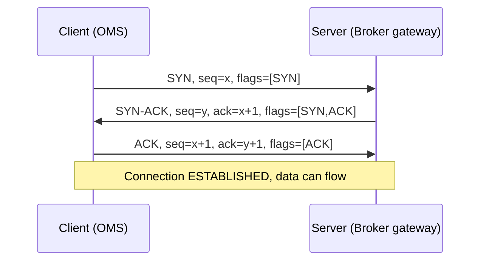
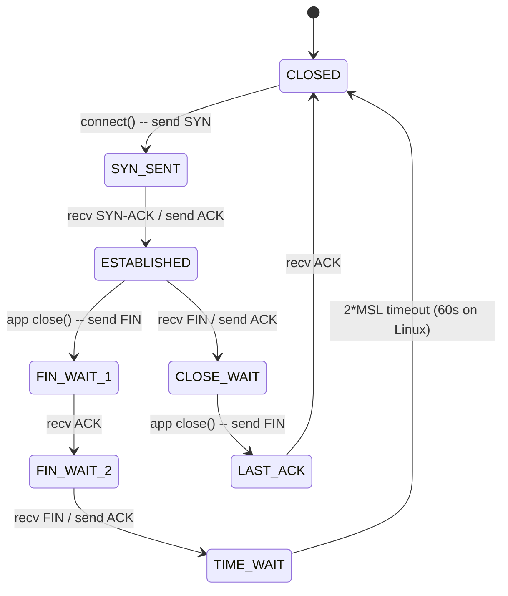

# 06 — Networking Focused Q&A

> 50 highest-frequency networking questions.

---

## Networking — TCP States, Handshake, tcpdump for FIX/Multicast, MTU/MSS, Keepalive vs Heartbeat

### Q1. Walk me through the TCP three-way handshake and tell me exactly which flags are set on each segment.
**Interviewer signal:** Does the candidate actually understand TCP setup, or just parrot "SYN, SYN-ACK, ACK"?
**Answer:**
Three segments, three flag states, and two sequence numbers get synchronised:



- **Segment 1 — SYN:** Client picks an ISN `x`, sends `SYN=1, seq=x`. State moves `CLOSED -> SYN_SENT`.
- **Segment 2 — SYN-ACK:** Server picks ISN `y`, sends `SYN=1, ACK=1, seq=y, ack=x+1`. Server was in `LISTEN`, moves to `SYN_RCVD`.
- **Segment 3 — ACK:** Client sends `ACK=1, seq=x+1, ack=y+1`. Both sides now `ESTABLISHED`.

MSS, window scale, SACK-permitted and timestamps are negotiated in the SYN and SYN-ACK TCP options — this is why you must always capture the SYN if you're debugging performance or PMTU issues; you can't recover it later in the flow.

**Watch-outs:** Don't say the client "chooses port 443" — the client picks an ephemeral source port, the *server* listens on 443/whatever. Also, ISNs are not zero — modern kernels randomise them for security.

---

### Q2. A FIX session is stuck in SYN_SENT on the OMS side. What does that tell you, and how do you diagnose it?
**Interviewer signal:** Can they map a TCP state to a real production symptom?
**Answer:**
`SYN_SENT` means our OMS sent a SYN and never received a SYN-ACK. Session log will show "connecting..." repeatedly. It is almost always one of four things:

1. **Firewall drop (silent):** ACL between OMS and the broker gateway is blocking outbound to the destination port — no RST comes back, so we sit in SYN_SENT until the SYN retry budget expires (~63s on Linux default of tcp_syn_retries=6).
2. **Wrong destination:** IP or port typo in the session config. `telnet <host> <port>` or `nc -vz <host> <port>` from the OMS box will tell you immediately.
3. **Server not listening:** Gateway process is down. In that case you'd get a RST, not a silent drop — state flips to CLOSED, not stuck in SYN_SENT.
4. **Asymmetric routing / return path blocked:** SYN reaches server, SYN-ACK gets dropped on the way back.

Diagnostics I'd run in order: `ss -tan | grep <port>` to confirm state, `tcpdump -i any -nn host <broker-ip> and port <port>` to see if SYN goes out and whether anything comes back, then `traceroute -T -p <port>` for path visibility. If SYN goes out but no SYN-ACK returns, escalate to network team with the pcap.

**Watch-outs:** Don't confuse SYN_SENT (our side) with SYN_RCVD (their side). If you're the client, you never see SYN_RCVD in `ss` output for that flow.

---

### Q3. Explain the TIME_WAIT state — why it exists, how long it lasts, and why it matters in production.
**Interviewer signal:** This is a classic — separates real network-savvy support engineers from bookworms.
**Answer:**
TIME_WAIT is the state the side that sent the **final ACK** in the connection-close sequence enters. It exists for two reasons:

1. **Handle lost final ACK:** If our ACK to the peer's FIN is lost, the peer will retransmit its FIN. We need to still recognise that FIN and re-ACK it. If we'd already gone to CLOSED, we'd send a RST — confusing the peer.
2. **Prevent old duplicate segments from a prior connection contaminating a new connection** with the same 4-tuple (src IP, src port, dst IP, dst port). Any stray segments must die on the wire first.

Duration is **2 × MSL (Maximum Segment Lifetime)**. RFC 793 defines MSL as 2 minutes so TIME_WAIT should be 4 minutes, but Linux hardcodes it to **60 seconds** (`TCP_TIMEWAIT_LEN` in the kernel).

**Why it matters in prod:** On the *active close* side (typically our OMS box that initiates disconnects for end-of-day session logout), TIME_WAIT sockets can pile up. If we're bouncing 500 FIX sessions in a tight loop during a rollback, we can exhaust ephemeral ports for outbound connections. Symptoms: `cannot assign requested address`, EADDRNOTAVAIL. Mitigation is **not** to blindly enable `tcp_tw_recycle` (removed in 4.12) — the correct fix is `SO_REUSEADDR` on the listening socket, or bind to a specific source port range and let TIME_WAIT drain.

**Watch-outs:** People confuse TIME_WAIT with CLOSE_WAIT — completely different sides of the close. TIME_WAIT is the *active closer*, CLOSE_WAIT is the *passive closer* who hasn't closed yet.

---

### Q4. What does CLOSE_WAIT mean, and why is a large CLOSE_WAIT count on the OMS almost always an application bug?
**Interviewer signal:** Understanding that CLOSE_WAIT is a *local* problem.
**Answer:**
CLOSE_WAIT means: **the remote peer closed its side of the connection (sent us a FIN), we ACKed it, but our application has not yet called `close()` on its socket.** The kernel is waiting on us.

State transition on the passive-close side:
```
ESTABLISHED  --recv FIN, send ACK-->  CLOSE_WAIT  --app calls close()-->  LAST_ACK  --recv ACK-->  CLOSED
```

So if `ss -tan | grep CLOSE_WAIT | wc -l` is climbing on the OMS box, it means our OMS process is failing to close its file descriptors after the broker/exchange hung up. That's a socket leak in our code (or the vendor's). It's *never* fixed by a kernel tune — you either:
- Fix the app to detect the FIN (e.g., select/epoll reads returning 0) and call close.
- Restart the offending process to reclaim FDs.

I've hit this in production when our OMS vendor's FIX engine had a race: the reader thread got an EOF but the writer thread was still queued to send a heartbeat, so `close()` was deferred. The socket sat in CLOSE_WAIT indefinitely, we ran out of FDs, and new sessions couldn't be established. Vendor patched the close-ordering logic.

**Watch-outs:** Never blame the network for CLOSE_WAIT. The peer already closed cleanly; the problem is on the local side.

---

### Q5. Draw the full TCP state diagram for a FIX session lifecycle from Logon to graceful Logout.
**Interviewer signal:** Deep familiarity with connection lifecycle.
**Answer:**



Mapping to FIX:
- **CLOSED -> ESTABLISHED**: TCP setup before FIX Logon (35=A) can be exchanged.
- **ESTABLISHED**: FIX session is up; Logon exchanged; heartbeats flowing.
- Graceful FIX Logout (35=5) is *application-layer* — after both sides exchange Logout messages, one side calls `close()` and TCP tear-down begins.
- If our OMS initiated the close, we go FIN_WAIT_1 -> FIN_WAIT_2 -> TIME_WAIT.
- If the broker initiated, we go ESTABLISHED -> CLOSE_WAIT -> LAST_ACK -> CLOSED.

**Watch-outs:** Simultaneous close is a real thing (both sides FIN at once) — you can transit through CLOSING. Rare, but I've seen it on flaky WAN links.

---

### Q6. What is a half-closed TCP connection, and how can it bite a FIX session?
**Interviewer signal:** Nuance around directional close.
**Answer:**
TCP is bidirectional and each direction closes independently. A **half-close** is when one side has sent FIN (its send-direction is closed) but the other side is still sending. The half-closed side is in FIN_WAIT_2; the still-sending side is in CLOSE_WAIT.

For FIX this matters because: if the broker gateway crashes and its OS sends FIN on our behalf, our OMS might not notice immediately if it's write-only busy or blocked. We keep queuing 35=D new orders into our send buffer, `send()` returns success, but the TCP stack quietly discards them once it also receives a RST or when its send buffer fills. Traders think their orders are in flight; they're not.

Defensive coding:
- Use `SO_KEEPALIVE` or an application heartbeat (which FIX gives us via 35=0) so both directions of the socket are exercised.
- Handle `read() == 0` (EOF) as "peer half-closed, tear down" — don't ignore it just because you have data to write.

**Watch-outs:** Don't assume that a successful `send()` means the peer got the data — it only means the local kernel accepted it into the send buffer.

---

### Q7. Explain MTU vs MSS and how they relate.
**Interviewer signal:** Basic layering fluency.
**Answer:**
- **MTU (Maximum Transmission Unit)** is a Layer-2/3 concept: the largest IP packet (headers + payload) that can traverse a given link without fragmentation. Ethernet default is 1500 bytes.
- **MSS (Maximum Segment Size)** is a Layer-4 (TCP) concept: the largest **TCP payload** (no IP or TCP headers) that either side is willing to receive in a single segment.

Standard IPv4 relationship: `MSS = MTU - IP header (20) - TCP header (20) = 1460` for a 1500-byte MTU.

MSS is negotiated per direction in the TCP options of the SYN and SYN-ACK. Each side advertises its own MSS; the effective per-direction MSS is the peer's advertisement (capped by any Path MTU Discovery result).

For FIX/OMS traffic this is usually invisible — FIX messages are small (few hundred bytes) and rarely near MSS. But for **large drop-copy replays, allocation blobs, or FIXatdl XML pushes** you can hit MSS-sized segments, and if PMTU black-holing is happening upstream you get stalls that look like session issues.

**Watch-outs:** People say "MSS = MTU - 40" without noting that IPv6 has a 40-byte header, so on IPv6 with 1500 MTU you get MSS = 1440. Also, VPNs/GRE/IPsec eat into MTU — a 1500 raw MTU becomes ~1400 effective, and you must clamp MSS accordingly.

---

### Q8. What is PMTU black-holing and how would you diagnose it on a broker link?
**Interviewer signal:** Real-world troubleshooting instinct.
**Answer:**
Path MTU Discovery uses ICMP "Fragmentation Needed" (Type 3, Code 4) to tell the sender to reduce segment size when a downstream link has a smaller MTU. **Black-holing** happens when some firewall silently drops those ICMP responses. The sender never learns to shrink, keeps sending 1500-byte packets with DF (Don't Fragment) set, and those packets die on the smaller-MTU link.

Symptoms: **small messages (heartbeats, logons, small orders) work fine; large messages hang.** A trader complains "my big allocation blob times out but small orders are fine" — classic PMTU black-hole.

Diagnosis:
```bash
# Try increasing payload sizes; the point where it stops is your effective PMTU
ping -M do -s 1472 <broker-ip>   # 1472 payload + 8 ICMP + 20 IP = 1500
ping -M do -s 1400 <broker-ip>
# tcpdump for the ICMP that should be coming back
tcpdump -i any -nn icmp
```

If pings succeed at 1400 but fail at 1472 with DF set, PMTU is ~1428 somewhere on the path. Fix is either whitelisting ICMP Type 3 in the firewall, or MSS clamping on the routers/firewalls carrying the flow (`iptables ... TCPMSS --clamp-mss-to-pmtu`).

**Watch-outs:** Don't just ping without `-M do` — normal pings fragment and hide the issue.

---

### Q9. Write the tcpdump filter you'd use to capture a single FIX session between our OMS at 10.20.30.40 and a broker gateway at 172.16.5.100 on port 55501.
**Interviewer signal:** Practical tcpdump fluency.
**Answer:**

```bash
sudo tcpdump -i any -nn -s 0 -w /tmp/fix_broker.pcap \
    'host 10.20.30.40 and host 172.16.5.100 and tcp port 55501'
```

Breakdown of flags:
- `-i any` — all interfaces; use the specific NIC (`-i eth0`) in prod to reduce noise.
- `-nn` — no DNS or port name resolution (faster, and stops accidentally hammering DNS).
- `-s 0` — full packet capture (default in modern tcpdump but I set it explicitly). Older versions snapped to 68 bytes and truncated the FIX payload.
- `-w` — write raw pcap so I can open in Wireshark later.
- Filter: `host A and host B and tcp port P` — restricts to that specific 4-tuple flow.

For live inspection with FIX payload visible:
```bash
sudo tcpdump -i any -nn -A -s 0 'host 172.16.5.100 and tcp port 55501'
```
`-A` prints ASCII, so you can eyeball `35=D`, `11=...`, `49=...` right in the terminal.

**Watch-outs:** If you forget `-s 0` on an older tcpdump, or you don't have permission for promiscuous mode, you may only see TCP headers and no FIX payload — leading you to falsely conclude "the session is silent."

---

### Q10. How would you tcpdump only FIX Logon (35=A) messages between our OMS and a broker?
**Interviewer signal:** Payload-based filtering — advanced tcpdump.
**Answer:**
FIX has no fixed byte offset for tag 35 (it's the third tag after `8=FIX...` and `9=<len>`), but `35=A` in the payload is a stable enough substring that we can use BPF byte matching. In practice I use ngrep or Wireshark display filters for content:

```bash
# ngrep is easier for text patterns
sudo ngrep -d any -W byline '35=A' 'host 172.16.5.100 and tcp port 55501'

# tcpdump with hex-match on '35=A' after SOH
# ASCII '35=A' = 0x33 0x35 0x3d 0x41, preceded by SOH (0x01) in a real FIX msg
sudo tcpdump -i any -nn -s 0 -A 'tcp port 55501 and (tcp[((tcp[12] & 0xf0) >> 2)+0:4] = 0x35354101 or tcp[((tcp[12] & 0xf0) >> 2)+1:4] = 0x35354101)'
```

Honestly, in production I capture the whole session to pcap and grep afterward:
```bash
tcpdump -r fix_broker.pcap -A | grep -E '35=A|35=5|35=2|35=3'   # Logon, Logout, ResendReq, Reject
```

That's much more maintainable than a clever BPF.

**Watch-outs:** BPF pattern-matching in `tcp[...]` is fragile because it assumes the pattern lies at a fixed offset after the TCP header, which it doesn't when FIX message length varies. Prefer ngrep or Wireshark's `tcp contains "35=A"` display filter.

---

### Q11. How is tcpdump different for multicast market data vs unicast FIX order flow?
**Interviewer signal:** Understanding of L2 semantics and IGMP.
**Answer:**
Fundamental differences:

| Aspect | Unicast FIX | Multicast market data |
|--------|-------------|-----------------------|
| Transport | TCP | UDP |
| Destination IP | Single host | Class D group (224.0.0.0/4) |
| L2 MAC | Peer's MAC | Derived from group IP (01:00:5e:xx:xx:xx) |
| Interface must join group? | No | Yes, via IGMP |
| tcpdump filter | `host` / `port` | `net 224.0.0.0/4` or `multicast` or `host <group>` |

For multicast:
```bash
# Capture a specific multicast group and port (e.g., exchange market data)
sudo tcpdump -i eth1 -nn -s 0 'udp and host 233.54.12.111 and port 30001'

# Or all multicast on that NIC
sudo tcpdump -i eth1 -nn 'multicast'

# See the IGMP joins/leaves — critical for debugging "no data" issues
sudo tcpdump -i eth1 -nn 'igmp'
```

Key gotcha: **tcpdump can capture multicast even if your host hasn't joined the group** because it puts the NIC in promiscuous mode. So you might see packets in the capture that your app isn't receiving. If the app isn't getting data, verify IGMP membership with `ip maddr show` or `netstat -gn`, not just tcpdump.

**Watch-outs:** Don't run multicast captures on `-i any` — the pseudo-device may drop multicast, and you won't see the true NIC-level view. Always pin to the specific NIC that carries the feed.

---

### Q12. A trader says "market data is stale." How do you use tcpdump to prove whether the exchange stopped sending, or our host stopped receiving?
**Interviewer signal:** Ability to reason about capture point.
**Answer:**
Two-step check:

1. **Is the exchange still sending?** Capture on the NIC facing the feed handler, filtered by group:
   ```bash
   sudo tcpdump -i eth1 -nn -c 100 'host 233.54.12.111 and port 30001'
   ```
   If packets are flowing, the exchange side is healthy. If nothing arrives in 5–10 seconds during market hours, the feed itself has stopped — call the exchange operations desk.

2. **If packets are flowing but app is stale:** the issue is between kernel and app. Check:
   - `netstat -su | grep -i "receive errors\|packet receive"` — kernel UDP receive-buffer overflows.
   - `ethtool -S eth1 | grep -i drop` — NIC-level drops.
   - `/proc/net/udp` for the socket queue depth (`rx_queue` column).
   - `ip maddr show eth1` — is the group still joined?

I also check sequence-number gaps in the feed itself. Most exchanges include a sequence in the header — grep for gaps in the pcap and you'll instantly see if it's a burst-loss issue vs a full stop.

**Watch-outs:** Don't only tcpdump on the NIC — if the kernel is dropping due to socket buffer overflow, tcpdump (which taps before the socket layer) still shows the packets. So "tcpdump sees them but the app doesn't" *is* the diagnosis pointing at socket buffer / app slowness.

---

### Q13. What is TCP Nagle's algorithm and why do we disable it for FIX?
**Interviewer signal:** Latency-awareness.
**Answer:**
Nagle's algorithm (RFC 896) coalesces small outbound writes into a single segment to reduce the "silly small packets" problem: it holds a small write until either (a) an ACK arrives for previously sent data, or (b) enough data has accumulated to fill an MSS.

Great for telnet. **Terrible for latency-sensitive FIX order flow.** A single 35=D order is ~200 bytes; Nagle might delay sending it up to ~40ms (the delayed-ACK timer) waiting for either more data or the peer's ACK. On a low-volume session that's a real latency spike.

We disable it with `TCP_NODELAY` on the socket:
```c
int flag = 1;
setsockopt(fd, IPPROTO_TCP, TCP_NODELAY, &flag, sizeof(flag));
```

Every serious FIX engine — the one from our OMS vendor included — sets `TCP_NODELAY` by default. If you're evaluating a new engine, that's a checkbox to confirm.

**Watch-outs:** `TCP_NODELAY` doesn't turn off delayed ACKs on the *receiving* side — that's a separate kernel behaviour. The pathological interaction is Nagle-on-sender + delayed-ACK-on-receiver, which can hit 200ms latencies on tiny writes.

---

### Q14. What's the difference between TCP keepalive and a FIX heartbeat?
**Interviewer signal:** Two different mechanisms, two different layers.
**Answer:**
Different layer, different purpose, different timescale:

| Aspect | TCP keepalive | FIX heartbeat (35=0) |
|--------|---------------|----------------------|
| Layer | L4 (kernel) | L7 (application) |
| Message | Empty TCP segment | FIX message with `35=0` |
| Default interval | 2 hours (Linux `tcp_keepalive_time`) | HeartBtInt (tag 108) — usually 30s |
| Enabled by | `SO_KEEPALIVE` sockopt | Always on in a FIX session |
| Detects | Dead peer / half-open TCP | Application-level stall (app frozen, GC, queue backup) |
| Reaction to failure | RST or connection reset error | FIX Logout, session drop, re-Logon |

FIX heartbeats are much more valuable operationally because they also detect *application-level* failure — an app can have a live TCP socket but its main thread frozen (GC pause, deadlock). TCP keepalive won't catch that; FIX heartbeat will, because if we don't get any message (heartbeat or otherwise) within `HeartBtInt + reasonable transmission time`, we send a Test Request (35=1). If they don't respond within `HeartBtInt` seconds, we consider the session dead and disconnect.

We typically enable **both**: TCP keepalive as a belt-and-braces catch for firewall idle timeouts on very quiet sessions, and FIX heartbeats as the primary liveness signal.

**Watch-outs:** Setting TCP keepalive to fire every 30s is a code smell — you're papering over an application-layer heartbeat that should exist. Fix the app, don't hammer the kernel.

---

### Q15. Walk me through what happens when a firewall silently drops idle FIX connections after 60 minutes.
**Interviewer signal:** Real production war-story instinct.
**Answer:**
Stateful firewalls (Palo Alto, Cisco ASA, Checkpoint) hold a connection-tracking entry for every TCP flow. If they see no traffic for the configured idle timeout (commonly 60 min for TCP), they garbage-collect the entry. From then on:

- If either side sends new data, the firewall doesn't recognise the flow — depending on config, it either drops silently or sends a RST.
- If dropped silently, both ends' TCP stacks eventually notice via retransmissions timing out (~15 min on Linux default), and we get a `Connection timed out` error.
- If RST is injected, we get `Connection reset by peer` immediately on the next send.

For FIX this is the classic overnight-quiet-session problem: broker session goes idle overnight, firewall reaps it, we open in the morning and every order gets rejected with a session-level error.

Fixes I've deployed:
1. **Application heartbeat frequency** (`HeartBtInt=30`) — this alone keeps the flow "hot" and the firewall entry alive. If we're seeing drops with 30s heartbeats, there's a bigger issue.
2. **TCP keepalive** with `tcp_keepalive_time=1800` (30 min) as a fallback.
3. **Ask netsec to bump idle timeout** for the specific FIX destination ports — usually to 24h.

**Watch-outs:** Don't confuse "TCP RST after idle" with "server crashed" — same symptom on our side, totally different root cause.

---

### Q16. What does the SO_LINGER socket option do, and would you ever set it on a FIX socket?
**Interviewer signal:** Understanding of graceful vs abortive close.
**Answer:**
`SO_LINGER` controls what `close()` does when there's unsent data in the socket send buffer:

- **Off (default):** `close()` returns immediately. Kernel keeps trying to send the buffered data in the background; if it succeeds, connection closes gracefully. If it fails, data is lost silently.
- **On with timeout > 0:** `close()` blocks up to N seconds waiting for buffered data to be sent and ACKed. If timeout expires, kernel sends RST (abortive close), and the socket goes to CLOSED (skipping FIN_WAIT/TIME_WAIT).
- **On with timeout = 0:** `close()` returns immediately AND sends RST. No graceful teardown. No TIME_WAIT. Data in flight is discarded.

Would I set it on a FIX socket? **Rarely.** The default (linger off) is right for FIX because we do a graceful FIX Logout (35=5) at the app layer first, then close. If we set `SO_LINGER 0`, we'd RST the connection abortively, which is bad manners — the broker sees a session drop instead of a clean logout, and might raise alerts.

The one place I'd use `SO_LINGER 0` is emergency shutdown: OMS is being killed hard, we don't care about graceful. But even then, better to send Logout first and then linger off.

**Watch-outs:** `SO_LINGER 0` is *not* a way to avoid TIME_WAIT properly — you're papering over ephemeral-port exhaustion with a protocol-violating RST. Fix the port-exhaustion root cause instead.

---

### Q17. What's the difference between a FIN and a RST in a packet capture, and what does each imply?
**Interviewer signal:** Reading pcaps.
**Answer:**
- **FIN:** graceful shutdown, one direction at a time. "I'm done sending, but I'll still receive." Peer must ACK, then eventually FIN back. Full 4-way close.
- **RST:** abortive reset. "This connection is dead, drop it now." No ACK expected. Any unread data in the peer's buffer is discarded.

In tcpdump output:
```
14:23:45.123  10.20.30.40.55501 > 172.16.5.100.55501: Flags [F.], seq 12345, ack 67890
14:23:45.135  10.20.30.40.55501 > 172.16.5.100.55501: Flags [R.], seq 12345
```
`[F.]` = FIN + ACK; `[R.]` = RST + ACK; `[R]` = pure RST.

Diagnostic implication:
- **FIN sequence:** everything is nominal, one side asked to close.
- **RST from peer immediately after our SYN:** nothing is listening on that port.
- **RST mid-session:** either the peer crashed, or a stateful device (firewall, load balancer) injected the RST because it lost state, or the peer's socket buffer overflowed and the kernel decided to abort.
- **RST from us:** our app called close with `SO_LINGER 0`, or the kernel got data on a closed socket (e.g., firewall reaped the flow and a late segment arrived), or someone killed the process with `SIGKILL` and pending sends were aborted.

**Watch-outs:** A RST doesn't always come from an endpoint — middleboxes can inject them. If you see RSTs but neither end's application logged a close, suspect a firewall/LB.

---

### Q18. How would you measure round-trip latency on a FIX session using tcpdump?
**Interviewer signal:** Turning captures into numbers.
**Answer:**
Two techniques:

**1. Handshake RTT (baseline):**
```bash
tcpdump -r fix_broker.pcap -nn 'tcp[tcpflags] & (tcp-syn|tcp-ack) != 0' | head -3
```
The delta between the initial SYN timestamp and the SYN-ACK timestamp is the RTT at connection setup — a clean measurement because no application processing is involved.

**2. Message-level RTT (application latency):**
For a 35=D order to 35=8 ExecutionReport (150=0 New) roundtrip, I open the pcap in Wireshark, use display filter `tcp.port == 55501 and fix`, and use "Time delta from previous displayed packet" to get microsecond-level latency between the outbound D and the inbound 8.

For scripted analysis I use `tshark`:
```bash
tshark -r fix_broker.pcap -Y 'fix' \
    -T fields -e frame.time_epoch -e fix.MsgType -e fix.ClOrdID \
    | awk 'BEGIN{OFS="\t"} {print $0}'
```
Then join outbound D and inbound 8 by ClOrdID and diff the timestamps.

Note: `tcpdump` timestamps come from the kernel at packet arrival on the NIC (or `SO_TIMESTAMP` if hardware timestamping enabled). That's *wire-close-to-wire* latency — it doesn't include OS scheduling delays inside our OMS process. For end-to-end app latency, correlate with OMS log timestamps too.

**Watch-outs:** Kernel timestamps have limited resolution (~microsecond). For sub-microsecond you need NIC hardware timestamps + `PTP` synchronization.

---

### Q19. What kernel-level TCP tunables would you review on an OMS host handling hundreds of FIX sessions?
**Interviewer signal:** Sysadmin awareness.
**Answer:**
The ones I audit first:

```bash
# Ephemeral port range — expand for many outbound sessions
sysctl net.ipv4.ip_local_port_range     # default 32768 60999; widen to 10000 65535

# Backlog for listen() — accept queue depth
sysctl net.core.somaxconn                # default 128; bump to 4096 for busy listeners

# Half-open connection queue (SYN queue)
sysctl net.ipv4.tcp_max_syn_backlog      # default 128–1024; bump to 8192

# Reuse TIME_WAIT sockets for outbound (safe)
sysctl net.ipv4.tcp_tw_reuse             # 1 = allow reuse; do NOT enable tw_recycle (removed)

# Socket buffer sizes — critical for burst tolerance
sysctl net.core.rmem_max
sysctl net.core.wmem_max
sysctl net.ipv4.tcp_rmem
sysctl net.ipv4.tcp_wmem

# Keepalive settings if we rely on kernel keepalive
sysctl net.ipv4.tcp_keepalive_time         # 7200s default; often lower for firewall-tolerance
sysctl net.ipv4.tcp_keepalive_intvl
sysctl net.ipv4.tcp_keepalive_probes

# TIME_WAIT duration is NOT tunable via sysctl on Linux (hardcoded 60s)
```

On top of those: file descriptor ulimit (`ulimit -n`), CPU affinity for the FIX threads (pin to specific cores, isolate from OS interrupts), and disabling TCP offload features (LRO, GRO) that reorder or coalesce packets in ways that can hurt latency-sensitive applications.

**Watch-outs:** Don't blindly copy-paste sysctls from a blog. Baseline the workload first, change one thing at a time, and measure. And `tcp_tw_recycle` was removed in kernel 4.12 — do not enable on RHEL 7.x if it's still there; it broke NAT'd clients.

---

### Q20. Explain what a "silly window syndrome" is and whether it's still relevant.
**Interviewer signal:** Deep TCP knowledge.
**Answer:**
Silly window syndrome (SWS) is a pathological TCP behaviour where either:
- Receiver advertises a tiny window (few bytes), sender packs small segments, ridiculous per-byte overhead.
- Sender pushes tiny writes into a socket that has a small buffer.

The fixes have been in every TCP stack for 30+ years:
- **Receiver-side (Clark's fix):** don't advertise window increases until either half the buffer is free or a full MSS is available.
- **Sender-side (Nagle's algorithm):** coalesce small writes, described earlier.

So in practice it's not relevant on modern kernels — RFC 1122 mandated the fixes. It might resurface with a buggy custom TCP stack (some ultra-low-latency network cards run their own userspace stack; if the vendor got the window-update rules wrong, you'd see SWS). But for our OMS running on a stock Linux, it's a solved problem.

**Watch-outs:** If someone in an interview asks about SWS, they're testing textbook depth. Answer briefly and pivot to Nagle/`TCP_NODELAY` which is the practical concern for FIX.

---

### Q21. Explain the difference between a TCP session dying because of RST vs because of timeout, from the OMS logs' perspective.
**Interviewer signal:** Correlating logs and pcaps.
**Answer:**
Two different error signatures:

- **RST from peer:** `send()` or `recv()` returns immediately with `ECONNRESET` (Connection reset by peer). Very fast failure — usually within one RTT of whatever triggered the RST. Log entry appears within milliseconds. In pcap, one `[R.]` segment.
- **Timeout (no response, TCP retransmits, eventually gives up):** kernel retransmits the segment with exponentially backing-off intervals (200ms, 400ms, 800ms, ...). Total time to `ETIMEDOUT` is governed by `tcp_retries2` (default 15 on Linux, ~15 minutes real-world). Log entry lags the actual network event by many minutes. In pcap, you see multiple retransmissions of the same segment with no response, then nothing.

Practical implication: if a session drop appears **instantly** in the OMS log with "Connection reset," we look at the peer or middlebox as the culprit. If the session hung for 5–15 minutes before erroring with "timed out," the peer is likely gone/unreachable and no one told us.

**Watch-outs:** `tcp_retries2 = 15` gives ~925 seconds worst case. If your OMS should fail-fast during outages, tune this per-socket via `TCP_USER_TIMEOUT` sockopt rather than globally.

---

### Q22. When would you use `ss` instead of `netstat` on a modern Linux OMS box?
**Interviewer signal:** Modern tooling awareness.
**Answer:**
**Always.** `netstat` is deprecated (from `net-tools`, unmaintained since ~2011). `ss` is from `iproute2` and is:
- Faster (reads directly from kernel netlink rather than parsing `/proc/net/tcp`).
- Richer output (congestion window, RTT, retransmits, buffer sizes).
- More flexible filtering.

Commands I use daily:
```bash
ss -tan                          # all TCP, numeric
ss -tanp                         # add process/PID
ss -tan state established        # only ESTABLISHED
ss -tan state time-wait          # TIME_WAIT count check
ss -tani '( dport = :55501 )'    # extended info (rtt, cwnd) for a specific port
ss -tulpn                        # everything listening (t=tcp, u=udp, l=listen, p=proc, n=num)
```

`ss -tani` output includes `rtt`, `cwnd`, `retrans`, `bytes_sent`, `bytes_acked` — invaluable for spotting a specific FIX session that's degrading (rising retrans count, shrinking cwnd) before it fails outright.

**Watch-outs:** `netstat -an` still works and old runbooks reference it, but the moment you need per-flow RTT or retransmit stats, only `ss` gives it to you without a pcap.

---

### Q23. In tcpdump, what does `-i any` capture vs `-i eth0`, and why does it matter for FIX diagnostics?
**Interviewer signal:** Interface awareness.
**Answer:**
- `-i any` uses a Linux pseudo-device that captures from all interfaces. Convenient, but has trade-offs:
  - Cannot capture VLAN tags reliably.
  - Cannot go promiscuous.
  - May drop or reorder packets under load.
  - On some kernels, doesn't capture the true Ethernet header (Linux "cooked" pseudo-header instead).
- `-i eth0` (or the specific NIC) captures raw frames from that NIC directly. Preserves VLAN tags, promisc mode works, and packet timestamps are more accurate.

For FIX diagnostics specifically:
- Debugging session drops between two hosts: `-i eth0` (the actual NIC) — you'll see any duplicate ACKs, retransmissions, and out-of-orders faithfully.
- Debugging localhost-loopback flows (e.g., our OMS talking to an in-box adapter over 127.0.0.1): `-i lo`.
- Doing a quick "am I even seeing this destination" check: `-i any` is fine.

For multicast market data I *always* use the specific NIC — `-i any` has known issues with multicast reception on Linux.

**Watch-outs:** Don't confuse the pseudo-device with the real one. If someone hands you a pcap taken with `-i any` and asks you to check the VLAN or MAC, you're stuck.

---

### Q24. What's the practical difference between UDP unicast, UDP multicast, and TCP for market data vs order flow?
**Interviewer signal:** Design rationale.
**Answer:**
Three protocols, three use cases:

| Protocol | Where | Why |
|----------|-------|-----|
| **TCP** | Order flow (FIX), drop-copy, execution reports | Reliability: guaranteed delivery, in-order, retransmits. We *must* know if an order was received. Latency cost is acceptable for order rates. |
| **UDP multicast** | Exchange market data feeds (ITCH, ARCA, CME MDP) | Fan-out efficiency: one packet on the wire reaches N subscribers. Unreliable is OK because we have sequence numbers and gap-fill mechanisms (usually via a separate unicast "recovery" TCP channel). |
| **UDP unicast** | Rare in trading — sometimes proprietary internal telemetry, or "conflated" pricing feeds to a single subscriber | No fan-out benefit; used when TCP overhead is undesirable and app handles reliability. |

Key operational implications:
- Multicast requires network infrastructure that supports IGMP snooping and PIM routing; adding a new host to a market data feed involves network team.
- TCP session drops require re-Logon and often a ResendRequest (35=2) sequence — well-defined FIX-level recovery.
- Multicast gaps require gap-fill: application detects sequence gaps and requests missing messages via a separate TCP recovery channel or a "replay" mechanism.

**Watch-outs:** Don't say "UDP is faster than TCP" as a blanket statement. On idle links they have similar latency. UDP wins only because it lacks retransmit-induced head-of-line blocking and because multicast avoids fan-out overhead.

---

### Q25. Put it all together: a trader reports "my FIX session to Broker X just dropped and won't reconnect." What is your first-15-minutes diagnostic playbook?
**Interviewer signal:** Structured triage under pressure.
**Answer:**
My checklist, in order, ~15 min:

1. **Confirm scope (1 min):** is this one trader/session or all sessions to that broker? `ss -tan | grep <broker-ip>` on the OMS box to see all flows. If all sessions to Broker X are affected, it's a broker-side or network issue; if one session, it's session-specific config or auth.

2. **Check OMS session log (2 min):** last messages before the drop. Common signatures:
   - `Connection reset by peer` -> RST from broker/middlebox — network or broker-side.
   - `HeartBtInt exceeded, no response to TestRequest` -> broker app was hung, OMS killed the session.
   - `Logout (35=5) received` -> broker deliberately logged us out; check `58=Text` for reason.
   - `Sequence number mismatch` -> re-Logon will need gap fill.

3. **Layer-3/4 reachability (2 min):**
   ```bash
   ping -c 5 <broker-ip>
   nc -vz <broker-ip> <broker-port>
   traceroute -T -p <broker-port> <broker-ip>
   ```

4. **Live capture on reconnect attempt (3 min):**
   ```bash
   sudo tcpdump -i any -nn -w /tmp/reconnect.pcap 'host <broker-ip> and tcp port <broker-port>' &
   # Trigger OMS reconnect
   ```
   Then analyse: SYN going out? SYN-ACK coming back? RST from broker after Logon? What's in the FIX Logout `58=Text`?

5. **Cross-check with broker (3 min):** ping their support channel. Are they seeing our SYNs? Do they see a Logon attempt and reject it (bad SenderCompID/TargetCompID/password rotation)? Have they made any change today?

6. **Check middleboxes (2 min):** firewall logs for drops between our OMS and their gateway, load-balancer session-table state if there's an LB in the path.

7. **Sequence-number check (2 min):** if the broker is up and reachable but our Logon is being rejected with a sequence issue, we may need to reset sequences on both sides — coordinate with the broker before doing anything destructive.

Communicate progress every 5 minutes to the trader and desk manager. If we exceed 15 min without resolution, escalate to on-call network and to the vendor.

**Watch-outs:** Don't restart the OMS session engine as step 1. That destroys state and evidence, and if the problem was a broker issue you'll have made the diagnosis harder.
## 26. Networking Deep-Dive (Questions 26-50)

### Q26. Why do HFT firms collocate in exchange data centers, and what's the difference between cross-connect and cage?

**Interviewer signal:** Tests understanding of physical infrastructure trade-offs for latency optimization.

**Answer:** Colocation eliminates WAN latency by placing servers in the same building as exchange matching engines—reducing round-trip time from milliseconds to microseconds. **Cross-connect** is a direct fiber link between your cage and the exchange's network equipment (shortest path, lowest latency). **Cage** is your private locked space housing racks; you still need cross-connect for exchange connectivity. Premium: exchange proximity hosting (XPH) puts you closest to matching engine.

**Watch-outs:** Don't confuse cross-connect (fiber link) with the physical cage rental. Mention that some exchanges offer microwave/millimeter-wave for inter-exchange arbitrage (Chicago-NYC ~4ms vs fiber ~7ms).

---

### Q27. What's the difference between DMA and sponsored access in trading infrastructure?

**Interviewer signal:** Gauges familiarity with market access models and risk controls.

**Answer:** **DMA (Direct Market Access):** Broker provides infrastructure; orders flow through broker's FIX gateway with pre-trade risk checks at broker level. **Sponsored access:** Client connects directly to exchange using broker's membership ID; risk checks happen at client side (faster but client-managed). True "naked access" (no risk checks) is banned post-2010 by SEC Rule 15c3-5.

**Watch-outs:** Clarify that sponsored access still uses broker's MPID but bypasses broker infrastructure. Mention FINRA's requirement for broker pre-trade risk controls even in sponsored models.

---

### Q28. When would you use kernel bypass techniques like Solarflare Onload or DPDK, and what are the trade-offs?

**Interviewer signal:** Assesses low-latency optimization knowledge and engineering judgment.

**Answer:** **Use when:** Sub-10µs latency required; kernel network stack overhead (syscalls, interrupts, context switches) is bottleneck. **Onload:** User-space TCP/IP stack for Solarflare NICs; application uses standard sockets API. **DPDK:** Polls NIC directly from user space; requires custom packet processing. **Trade-offs:** Complexity (debugging, monitoring harder), CPU pinning required (wastes cores on polling), OS networking tools (tcpdump) don't work, licensing costs.

**Watch-outs:** Mention that kernel bypass only helps if you're already optimized (batching, zero-copy). In cloud environments, SR-IOV or ENA Express may be easier than full DPDK. Don't claim "always faster"—latency wins are typically 5-20µs.

---

### Q29. Should you enable jumbo frames on your internal trading LAN, and how does it affect latency?

**Interviewer signal:** Tests nuanced understanding of MTU tuning for low-latency vs throughput.

**Answer:** **For internal LAN:** Jumbo frames (9000 MTU) reduce CPU overhead for bulk data (market data replay, backups) but slightly increase per-packet latency due to serialization delay. **For order entry:** Keep 1500 MTU—small FIX messages don't benefit, and you avoid fragmentation risk if packets leave your network. **Key:** Ensure entire path supports 9000 MTU (switch buffers, NICs); mismatched MTU causes black-hole scenarios.

**Watch-outs:** Calculate serialization delay: 9000 bytes @ 10Gbps = 7.2µs vs 1500 bytes = 1.2µs. Mention that some HFT shops disable jumbo frames entirely to minimize tail latency.

---

### Q30. What's the typical ephemeral port range, and why does it matter for high-frequency connections?

**Interviewer signal:** Checks awareness of OS networking limits under load.

**Answer:** **Linux default:** 32768-60999 (~28K ports). **Problem:** If making thousands of connections/sec (e.g., REST API polling), you exhaust ports faster than TIME_WAIT (default 60s) expires. **Solutions:** Expand range (`net.ipv4.ip_local_port_range = 10000 65535`), reduce TIME_WAIT (`net.ipv4.tcp_tw_reuse = 1`), use connection pooling, or bind multiple source IPs.

**Watch-outs:** Mention that Windows uses 49152-65535 (16K range). In FIX, persistent connections avoid this problem; REST/HTTP/1.1 Keep-Alive helps but watch for server-side timeouts.

---

### Q31. How do you detect TCP retransmissions, and what network metrics indicate them?

**Interviewer signal:** Gauges operational troubleshooting skills for connectivity issues.

**Answer:** **Indicators:** `netstat -s | grep retran` (retransmit count), `ss -ti` (show per-connection retransmit info), Wireshark filter `tcp.analysis.retransmission`. **Metrics:** RTT spikes, duplicate ACKs, out-of-order packets. **Root causes:** Packet loss (congestion, bad cable), insufficient TCP window size, asymmetric routing.

**Watch-outs:** Distinguish fast retransmit (3 dup ACKs) from timeout-based retransmit (RTO). Mention that in market data, UDP multicast avoids retransmits but requires NACK/recovery logic at application layer.

---

### Q32. Walk through the TLS handshake steps when establishing a FIX-over-TLS session to an exchange.

**Interviewer signal:** Tests protocol-level understanding of secure connectivity—critical for exchange drops.

**Answer:**
1. **ClientHello:** Client sends supported TLS versions, cipher suites, random nonce.
2. **ServerHello:** Server picks TLS version, cipher, sends its random nonce + certificate (public key).
3. **Certificate validation:** Client verifies server cert against trusted CA chain.
4. **Key exchange:** Client generates pre-master secret, encrypts with server's public key, sends.
5. **Finished:** Both derive session keys from pre-master + randoms; send encrypted "Finished" messages.
6. **FIX Logon:** Application sends FIX `Logon<A>` message over encrypted channel.

**Watch-outs:** Mention that TLS 1.3 reduces handshake to 1-RTT (vs 2-RTT in TLS 1.2). In mTLS, server also requests client certificate in step 2.

---

### Q33. In mutual TLS (mTLS), how is the client certificate chain validated by the exchange?

**Interviewer signal:** Assesses PKI knowledge for production troubleshooting (cert expiry, chain issues).

**Answer:** Exchange validates:
1. **Signature verification:** Each cert in chain (client → intermediate → root CA) is signed by parent's private key; verify with parent's public key.
2. **Trust anchor:** Root CA must be in exchange's trusted store.
3. **Validity period:** Check NotBefore/NotAfter timestamps.
4. **Revocation:** Check CRL (Certificate Revocation List) or OCSP (Online Certificate Status Protocol).
5. **Subject/SAN match:** CN or SubjectAltName matches expected client identity.

**Watch-outs:** Common failure: intermediate cert not included in client's chain bundle. Mention that some exchanges use CRL, others OCSP (faster but adds DNS dependency).

---

### Q34. What happens during cipher suite negotiation, and what's a secure choice for FIX connections?

**Interviewer signal:** Evaluates security awareness and performance trade-offs in encryption.

**Answer:** During TLS handshake, client sends list of supported cipher suites; server picks strongest mutually supported one. **Components:** Key exchange (ECDHE), authentication (RSA/ECDSA), encryption (AES-128-GCM), MAC (implicit in GCM). **Secure choice:** `TLS_ECDHE_RSA_WITH_AES_128_GCM_SHA256` (forward secrecy, AEAD). **Avoid:** CBC mode (padding oracle attacks), RC4, 3DES, non-ephemeral DH (no forward secrecy).

**Watch-outs:** AES-NI hardware acceleration makes AES-GCM fast (~2µs overhead per message). Some exchanges mandate specific suites; check exchange specs. TLS 1.3 removes weaker options entirely.

---

### Q35. How does TLS session resumption work, and what's the difference between session tickets and session IDs?

**Interviewer signal:** Tests optimization knowledge for minimizing reconnect latency.

**Answer:** Both avoid full handshake on reconnect (saves 1-RTT).  
**Session ID:** Server stores session state; client sends ID in ClientHello; server looks up cached keys (server memory cost).  
**Session ticket:** Server encrypts session state, sends to client; client stores ticket and presents on reconnect (stateless for server, scales better). TLS 1.3 uses PSK (Pre-Shared Key) mode for 0-RTT resumption but vulnerable to replay attacks (not safe for idempotent FIX).

**Watch-outs:** Mention that session tickets expire (typically 24 hours). For FIX, reconnect <5 times/day so full handshake cost is negligible; prioritize correctness over 0-RTT optimizations.

---

### Q36. How do you detect gaps in multicast market data feeds using sequence numbers?

**Interviewer signal:** Gauges understanding of UDP market data reliability patterns.

**Answer:** Each multicast packet has sequence number (e.g., ITCH `SequenceNumber`, FAST seqNum). On receive:
1. Check `expected_seq == received_seq`.
2. If `received_seq > expected_seq + 1`: gap detected → request retransmit via unicast NACK/recovery channel.
3. Buffer out-of-order packets (jitter); deliver in-order to application.
4. If gap unrepairable (retransmit timeout): declare data loss, log, alert.

**Watch-outs:** Some protocols (MoldUDP64) include sequence in every message; others (FAST) only in packet header. Mention that A/B feed redundancy helps: if feed A gaps, use feed B.

---

### Q37. What are common A/B feed arbitration algorithms, and when would you use each?

**Interviewer signal:** Assesses feed redundancy design for mission-critical market data.

**Answer:**
- **First-message wins:** Use whichever feed delivers message first (lowest latency path). Risk: stale data if faster feed skips messages.
- **Sequence-based merge:** Deliver in sequence order regardless of arrival time (correctness over latency). Use for book-building where order matters.
- **Voting (2-of-3):** Require 2 feeds to agree before delivering (rare in HFT due to latency cost).
- **Primary/failover:** Always use feed A unless gap detected; switch to B (simplest but doesn't exploit dual-path latency).

**Watch-outs:** CME/ICE offer A/B feeds on different multicast groups; Nasdaq offers primary/secondary. Mention TCP retransmit recovery as backup to multicast.

---

### Q38. What's the typical latency difference between SIP (consolidated tape) and direct exchange feeds?

**Interviewer signal:** Tests market structure knowledge and regulatory arbitrage awareness.

**Answer:** **SIP (Securities Information Processor):** 300µs-5ms behind direct feeds due to aggregation delay (collect from all venues → consolidate → distribute). **Direct feeds:** 50-200µs from exchange. **Reg NMS impact:** NBBO calculated from SIP, so market makers must respect SIP prices, but HFT can see direct feed opportunities before SIP updates. **Result:** "Latency arbitrage"—faster traders act on direct feed, slower ones see stale SIP.

**Watch-outs:** Post-2020, exchanges offer "depth-of-book" products at lower latency than SIP but higher cost. Mention IEX's speed bump (350µs) was designed to neutralize latency arbitrage.

---

### Q39. Explain PTP (IEEE 1588 Precision Time Protocol) and the Best Master Clock (BMC) algorithm.

**Interviewer signal:** Evaluates time-sync infrastructure knowledge for exchange timestamping/TCA.

**Answer:** **PTP:** Synchronizes clocks over Ethernet to sub-microsecond accuracy. **BMC algorithm:** Elects best grandmaster clock based on priority, class (atomic > GPS > NTP), accuracy. **Process:** Grandmaster sends `Sync` + `Follow_Up` (T1); slave replies `Delay_Req` (T2); master replies `Delay_Resp` (T3). Slave calculates offset = `((T1 - T2) + (T4 - T3)) / 2`. Hardware timestamping (PHY-level) eliminates kernel jitter.

**Watch-outs:** Mention that switches must be PTP-aware (boundary clocks or transparent clocks). CME requires PTP for trade-at timestamp audits. GPS disciplined oscillators (GPSDO) provide stratum-1 accuracy.

---

### Q40. What does `SO_TIMESTAMPING` with `SOF_TIMESTAMPING_TX_HARDWARE` give you, and when is it useful?

**Interviewer signal:** Tests low-level socket tuning for latency measurement.

**Answer:** Enables NIC hardware to timestamp when packet leaves Ethernet PHY (vs kernel software timestamp which includes queueing delay). **Use case:** Measure true wire latency in TCA (Transaction Cost Analysis)—compare exchange recv timestamp to your NIC TX timestamp. **Setup:** `setsockopt(fd, SOL_SOCKET, SO_TIMESTAMPING, SOF_TIMESTAMPING_TX_HARDWARE)`. **Retrieve:** `recvmsg()` with `MSG_ERRQUEUE` to get TX completion timestamp.

**Watch-outs:** Requires PTP-capable NIC (Intel X710, Mellanox ConnectX). RX hardware timestamps (`SOF_TIMESTAMPING_RX_HARDWARE`) also available. Mention that kernel timestamps are typically 10-50µs delayed vs hardware.

---

### Q41. What's the difference between `mtr` and `traceroute`, and when would you use each?

**Interviewer signal:** Assesses network diagnostics skills for production troubleshooting.

**Answer:** **traceroute:** One-time path discovery; sends UDP (or ICMP) with incrementing TTL to discover hops. **mtr (My TraceRoute):** Continuous traceroute with per-hop packet loss and latency stats (like ping + traceroute). **Use cases:** `mtr` for diagnosing intermittent issues (e.g., "2% loss at hop 5"), `traceroute` for one-off path checks. **Variants:** `traceroute -I` (ICMP), `traceroute -T` (TCP, bypasses firewalls).

**Watch-outs:** Some routers deprioritize ICMP TTL-exceeded (gives false high latency). Mention that in production, check both A and B feed paths to exchange.

---

### Q42. Write a `tcpdump` command to capture FIX traffic on port 9001, VLAN 100, and save to pcap for Wireshark analysis.

**Interviewer signal:** Tests practical packet capture skills for protocol debugging.

**Answer:**
```bash
tcpdump -i eth0 -nn 'tcp port 9001 and vlan 100' -w fix_capture.pcap -s 65535
```
**Breakdown:** `-i eth0` (interface), `-nn` (no DNS/port resolution), `vlan 100` (802.1Q tag), `-w` (write to file), `-s 65535` (capture full packets, not just headers). **Read:** `tcpdump -r fix_capture.pcap -A` (ASCII) or open in Wireshark with FIX dissector.

**Watch-outs:** Add `-c 1000` to limit packet count (avoid filling disk). Use `host X.X.X.X` to filter by IP. Mention that in kernel bypass (DPDK), tcpdump won't see packets (need custom tooling).

---

### Q43. When running `ss -tanp`, what do the columns `Recv-Q`, `Send-Q`, and `State` tell you?

**Interviewer signal:** Evaluates Linux socket diagnostics for connection health monitoring.

**Answer:**
- **Recv-Q:** Bytes in kernel receive buffer not yet read by application (if high: app slow).
- **Send-Q:** Bytes in kernel send buffer not yet ACK'd by peer (if high: network congestion or slow receiver).
- **State:** `ESTABLISHED` (connected), `TIME_WAIT` (closed, waiting for stray packets), `CLOSE_WAIT` (remote closed, waiting for local close).
- **-p:** Shows PID/process name.

**Watch-outs:** `CLOSE_WAIT` accumulation means app not closing sockets (leak). `Send-Q` sustained > 0 suggests TCP window full (tune `net.ipv4.tcp_wmem`). Mention `ss -ti` for per-connection RTT/retransmit stats.

---

### Q44. In AWS VPC, what's the difference between security groups and NACLs for controlling traffic?

**Interviewer signal:** Tests cloud networking fundamentals for hybrid/cloud trading deployments.

**Answer:**
- **Security groups:** Stateful firewall at instance level; only allow rules (implicit deny); return traffic auto-allowed. Example: Allow inbound TCP 9001 from `10.0.0.0/8`.
- **NACLs (Network ACLs):** Stateless firewall at subnet level; allow + deny rules; must explicitly allow return traffic. Evaluated before security groups.
**Use case:** Security groups for 95% of rules (simple, stateful); NACLs for deny rules (e.g., block specific IP ranges).

**Watch-outs:** NACL rules evaluated in order (lowest rule number first); security groups evaluate all rules. Mention default NACL allows all; default security group denies all inbound.

---

### Q45. What is AWS PrivateLink, and when would you use it for trading infrastructure?

**Interviewer signal:** Gauges cloud architecture knowledge for secure cross-VPC connectivity.

**Answer:** **PrivateLink:** Private connectivity from your VPC to AWS services (or third-party SaaS) without traversing internet; uses VPC endpoint. **Use cases:** Connect to exchange cloud gateway (e.g., CME Globex AWS endpoint), access vendor risk analytics service, internal microservices across VPCs. **Benefits:** No IGW/NAT gateway needed, traffic doesn't leave AWS backbone, lower latency than public internet.

**Watch-outs:** Two types: Gateway endpoints (S3/DynamoDB, free), Interface endpoints (everything else, charged per hour + data). Mention inter-region PrivateLink (e.g., us-east-1 → eu-west-1) supported but higher latency.

---

### Q46. What is BGP, and why would a trading firm use it for colo connectivity?

**Interviewer signal:** Assesses understanding of enterprise/colo routing for multi-homed setups.

**Answer:** **BGP (Border Gateway Protocol):** Exterior routing protocol that exchanges routes between autonomous systems (AS). **Use case:** Multi-homed colo (two ISPs for redundancy)—advertise your IP prefixes via BGP to both ISPs; if one link fails, traffic routes via backup. **AS numbers:** Public (IANA-assigned) or private (64512-65534 for internal use). **Metric:** AS path length, local preference, MED (Multi-Exit Discriminator).

**Watch-outs:** BGP convergence is slow (30-180s); not suitable for sub-second failover (use VRRP/HSRP at L3 for that). Mention that misconfigured BGP announcements caused Pakistan to black-hole YouTube in 2008 (prefix hijacking).

---

### Q47. Explain CIDR notation `10.1.32.0/20` and calculate the usable IP range and host count.

**Interviewer signal:** Tests basic subnetting math for VPC/network design.

**Answer:**
- **CIDR:** `/20` = 20 network bits, 12 host bits (32 - 20).
- **Subnet mask:** 255.255.240.0.
- **Range:** `10.1.32.0` to `10.1.47.255` (2^12 = 4096 IPs).
- **Usable hosts:** 4094 (minus network address `.0` and broadcast `.255`).
**Calculation trick:** `10.1.32.0/20` → binary `00100000`, last changeable bit is 2^4 = 16 → ranges are 0-15, 16-31, 32-47, etc.

**Watch-outs:** AWS reserves 5 IPs per subnet (.0, .1=VPC router, .2=DNS, .3=future, .255=broadcast). Mention RFC1918 private ranges: 10/8, 172.16/12, 192.168/16.

---

### Q48. What's the difference between NAT and PAT, and which does a home router typically use?

**Interviewer signal:** Clarifies NAT terminology (often conflated in casual usage).

**Answer:**
- **NAT (Network Address Translation):** One-to-one mapping of private IP to public IP (e.g., `10.0.0.5 → 203.0.113.10`).
- **PAT (Port Address Translation), aka NAT Overload:** Many private IPs to one public IP using different source ports (e.g., `10.0.0.5:5001 → 203.0.113.10:12345`). **Home routers use PAT** (all devices share one public IP).
**Problem:** Breaks inbound connections (can't know which internal host); requires port forwarding.

**Watch-outs:** In trading, PAT breaks FIX (exchange can't initiate TCP connection to you). Use 1:1 NAT or public IPs in colo. Mention CGN (Carrier-Grade NAT) in ISPs causes double-NAT pain.

---

### Q49. What is anycast, and why is it used for DNS root servers?

**Interviewer signal:** Tests advanced routing knowledge for global service architectures.

**Answer:** **Anycast:** Multiple servers share same IP address in different geographic locations; router sends packet to nearest server (via BGP shortest AS-path). **DNS root servers:** 13 IPs (a-m.root-servers.net) but hundreds of physical instances globally via anycast—your query goes to closest one. **Benefits:** DDoS mitigation (load distributed), low latency (geographic proximity), automatic failover (if instance down, BGP withdraws route).

**Watch-outs:** Contrast with **unicast** (one IP = one server) and **multicast** (one IP = group subscription). Mention that CDNs (Cloudflare, Akamai) use anycast for edge PoPs.

---

### Q50. How does CDN edge caching reduce latency for market data docs or web dashboards?

**Interviewer signal:** Evaluates content delivery understanding for low-latency document retrieval.

**Answer:** **CDN (Content Delivery Network):** Caches static content (HTML, JSON, images) at edge locations near users. **Process:** User requests `https://docs.exchange.com/fix-spec.pdf` → DNS resolves to nearest CDN PoP → if cached, serve immediately (5-20ms); if not, fetch from origin (100-300ms), cache, serve. **Headers:** `Cache-Control: max-age=3600` tells CDN how long to cache. **Use case:** Trading firm dashboards (risk reports, PnL), exchange API docs, historical data files.

**Watch-outs:** Dynamic content (real-time PnL) not cacheable—use WebSocket or SSE for that. Mention invalidation strategies: time-based (TTL), versioned URLs (`fix-spec-v2.pdf`), or explicit purge API. Edge compute (Cloudflare Workers) can run logic at PoPs.

---
