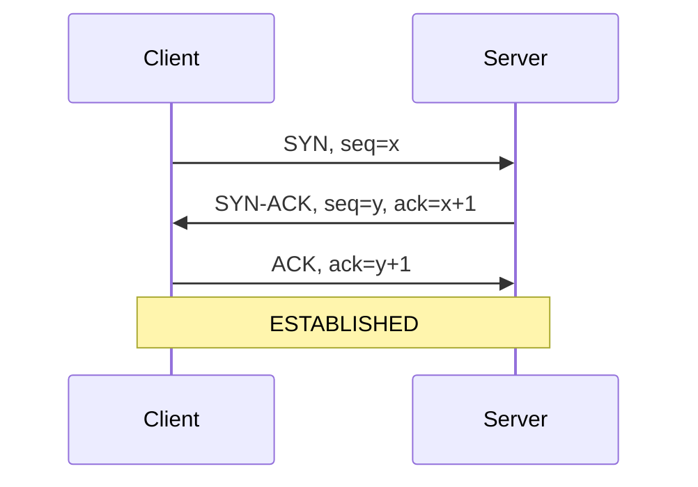
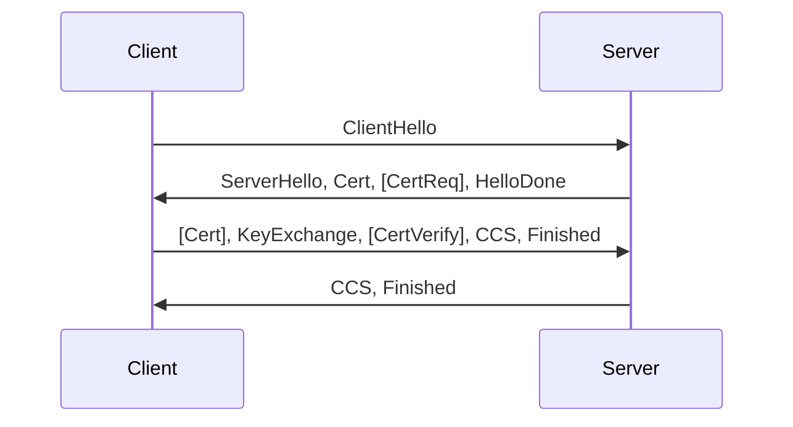

# Networking — 25 Quick-Hit Q&A

## Contents
- Q1. Walk me through the TCP 3-way handshake.
- Q2. What is TIME_WAIT and why does it exist?
- Q3. A socket is stuck in CLOSE_WAIT. What does that mean and who has to fix it?
- Q4. How do you filter tcpdump to a specific port?
- Q5. MSS vs MTU — what is the difference?
- Q6. TCP keepalive vs FIX heartbeat — same thing?
- Q7. Walk me through a TLS 1.2 handshake.
- Q8. What is DNS TTL and why should support care?
- Q9. What is a colo and why do trading firms pay for it?
- Q10. What is kernel bypass and when would you use it?
- Q11. What does `netstat -an | grep 5001` tell you?
- Q12. Nagle's algorithm — why do trading apps disable it?
- Q13. What is the FIN vs RST difference on a socket close?
- Q14. SYN flood — what does it look like from the server side?
- Q15. What is the receive window (rwnd)?
- Q16. Explain `ss -s` output at a high level.
- Q17. A FIX session drops every 5 minutes. First three things you check?
- Q18. What does `traceroute` actually do?
- Q19. Layer 2 vs Layer 3 — where does an OMS live?
- Q20. What is a jumbo frame and where does it help?
- Q21. Why does TCP retransmit and how do you spot it in Wireshark?
- Q22. What is head-of-line blocking?
- Q23. Multicast vs unicast — why do market data feeds use multicast?
- Q24. What is a socket buffer and why does it matter for a busy FIX gateway?
- Q25. HTTP/1.1 vs HTTP/2 — one-line summary and why HTTP/2 didn't win in trading.

---

### Q1. Walk me through the TCP 3-way handshake.
**Interviewer signal:** Baseline. They want to know the candidate can talk TCP without hand-waving.
**Answer:**
Client sends SYN with an initial sequence number. Server replies SYN-ACK with its own ISN and acknowledges the client's ISN+1. Client sends ACK acknowledging the server's ISN+1. After that third packet the connection is ESTABLISHED and either side can send data. On Linux you can watch it in `tcpdump -i any -nn 'tcp and port 5001 and (tcp-syn|tcp-ack) != 0'`.



**Watch-outs:** Don't say "SYN, SYN, ACK" — it is SYN, SYN-ACK, ACK. Three segments, not four.

---

### Q2. What is TIME_WAIT and why does it exist?
**Interviewer signal:** Whether the candidate has actually restarted a FIX engine and hit "address already in use".
**Answer:**
TIME_WAIT is the state the side that sent the final ACK sits in for 2*MSL (usually 60–120 seconds on Linux) after closing. It exists so that any late-arriving duplicate segments from the old connection get discarded instead of being delivered to a new connection reusing the same 4-tuple, and so the peer's retransmitted FIN can still be ACKed. In prod it shows up when you bounce a FIX acceptor and it can't rebind — the fix is usually `SO_REUSEADDR`, or picking a fresh source port, not tuning `tcp_tw_reuse` blindly.
**Watch-outs:** Don't recommend `net.ipv4.tcp_tw_recycle` — it was removed in kernel 4.12 and was always dangerous behind NAT.

---

### Q3. A socket is stuck in CLOSE_WAIT. What does that mean and who has to fix it?
**Interviewer signal:** Do they understand that CLOSE_WAIT is a bug in *our* application, not the peer.
**Answer:**
CLOSE_WAIT means the peer sent a FIN and our kernel ACKed it, but our application has not called `close()` on the socket. It is a leak on our side — the OMS process is holding the fd open. If you see hundreds piling up in `netstat` against a broker session, the OMS session thread is either wedged, not reading the read-side EOF, or missed the disconnect callback. Restart clears it but the real fix is in the vendor code path handling remote FIN. Contrast with FIN_WAIT_2, which is the mirror — we sent FIN, peer hasn't closed.
**Watch-outs:** Don't blame the network or the broker. CLOSE_WAIT is always the local app.

---

### Q4. How do you filter tcpdump to a specific port?
**Interviewer signal:** Can they actually run tcpdump on a prod box without help.
**Answer:**
```bash
sudo tcpdump -i any -nn -s0 -w /tmp/fix.pcap 'tcp port 5001'
```
`-i any` catches all interfaces, `-nn` skips DNS and service name resolution (fast, and does not hit /etc/services), `-s0` captures full packet, `-w` writes pcap for Wireshark. To split by direction use `src port 5001` or `dst port 5001`. To limit rate use `-c 10000` or rotate with `-C 100 -W 10`. For a specific peer add `and host 10.20.30.40`.
**Watch-outs:** On a busy gateway, don't run tcpdump without `-w` to a file — printing to the terminal drops packets.

---

### Q5. MSS vs MTU — what is the difference?
**Interviewer signal:** Do they understand where fragmentation bites.
**Answer:**
MTU is the maximum size of the entire IP packet on a link — typically 1500 bytes on Ethernet. MSS is the maximum size of the TCP *payload* — MTU minus IP header (20) minus TCP header (20) = 1460 for standard Ethernet. MSS is negotiated in the SYN options. If a middlebox has a smaller MTU (VPN, GRE tunnel) and PMTUD is broken, you get black-holed connections that handshake fine but hang on the first big message — classic symptom of an order that hangs at 1460 bytes.
**Watch-outs:** Jumbo frames push MTU to 9000, but only if every hop supports it end-to-end.

---

### Q6. TCP keepalive vs FIX heartbeat — same thing?
**Interviewer signal:** Do they know why FIX has its own heartbeat.
**Answer:**
No. TCP keepalive is a kernel-level probe, default 2 hours idle on Linux, and only proves the *socket* is alive — it does not prove the peer application is alive. FIX heartbeat (35=0) runs at the application layer, typically every 30 seconds, and proves the counterparty's session process is still reading and writing FIX. A firewall can happily ACK keepalives on behalf of a dead broker; FIX heartbeat catches that. In an OMS you rely on FIX heartbeat + TestRequest (35=1) for liveness, and set TCP keepalive as a belt-and-braces backup with `tcp_keepalive_time=60`.
**Watch-outs:** Don't say keepalive replaces heartbeat.

---

### Q7. Walk me through a TLS 1.2 handshake.
**Interviewer signal:** Baseline security literacy — most FIX-over-TLS uses 1.2 in banks.
**Answer:**
1. Client sends `ClientHello` with supported cipher suites, random nonce, SNI.
2. Server replies `ServerHello` picking a cipher, its random, and its certificate chain.
3. If mutual TLS, server sends `CertificateRequest`.
4. Client verifies the chain, sends `ClientKeyExchange` (pre-master secret encrypted with server's public key, or an ECDHE public value), its own cert if mTLS, and `CertificateVerify`.
5. Both derive the master secret and session keys.
6. Both send `ChangeCipherSpec` + `Finished`, and application data flows encrypted.



TLS 1.3 collapses this into one round trip and drops RSA key transport.
**Watch-outs:** Don't confuse "encrypted" (symmetric session key) with "authenticated" (certificate chain validation).

---

### Q8. What is DNS TTL and why should support care?
**Interviewer signal:** Have they debugged a failover where the app cached the old IP.
**Answer:**
TTL is how long a resolver may cache a DNS record before re-querying authoritative. When a broker fails their FIX endpoint from primary to DR, if our JVM cached the A record for hours, the OMS keeps hitting the dead IP. Java in particular caches DNS forever by default unless `networkaddress.cache.ttl` is set — a classic gotcha. During a DR test you often need to bounce the session or explicitly clear the resolver. Rule of thumb: production trading endpoints should have TTL in the 30–300 second range.
**Watch-outs:** DNS TTL is advisory. Some resolvers ignore very low values; some apps cache forever.

---

### Q9. What is a colo and why do trading firms pay for it?
**Interviewer signal:** Do they understand the latency motivation.
**Answer:**
Colocation is renting rack space inside the exchange's own data centre (e.g. NY4 for Nasdaq, LD4 for LSE, TY3 for TSE). Instead of running an order over a WAN with millisecond RTT, our gateway sits meters from the matching engine and the round trip is microseconds — cross-connect fibre lengths are even standardised so no participant has a distance advantage. It matters for execution algos and market-making where being 500µs faster wins a queue position. For an OMS that just routes to a broker, colo matters less; for the broker's smart-router hitting the venue, it matters enormously.
**Watch-outs:** Colo alone doesn't help if your app is slow — kernel bypass, CPU pinning, and warm caches matter as much.

---

### Q10. What is kernel bypass and when would you use it?
**Interviewer signal:** Do they know why HFT shops build custom stacks.
**Answer:**
Kernel bypass means the NIC delivers packets directly to userspace, skipping the kernel TCP/IP stack — technologies like Solarflare OpenOnload, DPDK, or ef_vi. You avoid context switches, kernel copies, and interrupt overhead, dropping latency from tens of microseconds to a few. You use it on latency-critical paths: market data feed handlers, exchange order gateways, tick-to-trade loops. You would *not* use it for a general OMS admin path — it complicates deployment, TLS termination, and observability. In our stack the FIX session gateway usually sits on kernel sockets; only the low-touch DMA/algo engine warrants bypass.
**Watch-outs:** Kernel bypass doesn't magically make bad code fast — the app itself has to be lock-free and cache-friendly.

---

### Q11. What does `netstat -an | grep 5001` tell you?
**Interviewer signal:** Everyday support fluency.
**Answer:**
It lists every socket bound to or connected on port 5001 with numeric addresses (no DNS, no service names). Columns: proto, recv-Q, send-Q, local address, foreign address, state. Two things I actually look at: (1) is a LISTEN present — proving the FIX acceptor started; (2) how many ESTABLISHED / CLOSE_WAIT / TIME_WAIT — proving whether sessions are up and clean. A growing send-Q means the peer isn't reading; a growing recv-Q means our app isn't reading. Modern boxes prefer `ss -tanp | grep 5001` — faster and shows the process.
**Watch-outs:** `netstat` is deprecated on newer distros; know `ss` too.

---

### Q12. Nagle's algorithm — why do trading apps disable it?
**Interviewer signal:** Do they know `TCP_NODELAY`.
**Answer:**
Nagle's algorithm buffers small writes until either a full-MSS-worth of data is ready or a prior ACK arrives, to reduce packet count on slow links. For a FIX engine this is a disaster — small NewOrderSingle messages get delayed up to 40ms waiting for delayed ACK, adding round-trip latency for no reason. Every trading application sets `TCP_NODELAY` on the socket to disable Nagle. Vendor cores usually expose this as a session config; verify it in the pcap by checking that a 200-byte FIX message goes out in one segment immediately, not batched.
**Watch-outs:** Disabling Nagle plus writing byte-by-byte gives you the worst of both worlds — always disable Nagle *and* write the whole message in one syscall.

---

### Q13. What is the FIN vs RST difference on a socket close?
**Interviewer signal:** Post-mortem literacy from pcap reading.
**Answer:**
FIN is graceful — "I'm done sending, but I'll still read." Each side sends its own FIN and both drain cleanly. RST is abrupt — "tear this connection down now, drop any pending data." An RST happens when: the app called `close()` on a socket with unread receive data, the peer sent to a port with no listener, `SO_LINGER` with timeout 0 was set, or the OS killed a process holding the socket. In a FIX outage, RST from the broker usually means their session-layer rejected us (auth failure, sequence gap) and hung up — check their logs. FIN usually means a clean logout (35=5) followed by close.
**Watch-outs:** A middlebox (firewall, load balancer) can also inject RSTs — don't always blame the endpoint.

---

### Q14. SYN flood — what does it look like from the server side?
**Interviewer signal:** Basic security / OS knowledge.
**Answer:**
Half-open connections pile up in SYN_RECV state because the client never sends the final ACK. The listen backlog fills, legitimate SYNs get dropped, and `dmesg` shows "possible SYN flooding on port X. Sending cookies." Defence is SYN cookies (`net.ipv4.tcp_syncookies=1`) which encode the state in the SYN-ACK sequence number so no memory is held until the ACK returns. You'd rarely see this on internal FIX ports behind a firewall, but a public API gateway needs it.
**Watch-outs:** SYN cookies disable some TCP options (window scaling, SACK) for the flooded connections; usually fine but a known trade-off.

---

### Q15. What is the receive window (rwnd)?
**Interviewer signal:** Do they understand flow control.
**Answer:**
The receive window is the amount of unacknowledged data the sender is allowed to have in flight, advertised in every ACK from the receiver. It represents free buffer space at the receiver. If our OMS is slow to read (GC pause, disk-bound), rwnd shrinks; sender stalls. In Wireshark you see `[TCP Window Full]` and `[TCP ZeroWindow]` markers. Window scaling (option in SYN) lets the window exceed 64KB — essential over high-BDP links. When a broker complains "we're back-pressuring you," it means our advertised window went to zero.
**Watch-outs:** Don't confuse rwnd (flow control, receiver-driven) with cwnd (congestion control, sender-driven).

---

### Q16. Explain `ss -s` output at a high level.
**Interviewer signal:** Familiarity with the modern tool.
**Answer:**
`ss -s` gives a socket summary: total sockets, TCP counts by state (established, closed, orphaned, timewait), plus transport totals for RAW, UDP, INET, FRAG. On a FIX gateway I glance at it to spot: too many timewait after a bounce, orphaned sockets (usually a leak), or a spike in synrecv (possible flood or slow backend). For per-socket detail I follow up with `ss -tanp` or `ss -tanpi` (with `-i` giving cwnd, rto, retransmits).
**Watch-outs:** `ss` reads from the kernel's netlink interface, much faster than `netstat` on boxes with tens of thousands of sockets.

---

### Q17. A FIX session drops every 5 minutes. First three things you check?
**Interviewer signal:** Diagnostic instinct — do they jump to conclusions.
**Answer:**
1. **Heartbeat interval and TestRequest behaviour** — if HeartBtInt is 30s and we drop at exactly 5*30 = 150s or 300s, we're missing heartbeats. Check FIX log for gaps in 35=0 or unanswered 35=1.
2. **Firewall idle timeout** — many enterprise firewalls kill idle TCP connections at 300s. If FIX heartbeats aren't getting through (misconfigured proxy stripping them), the firewall thinks the session is idle.
3. **Peer-side session logs** — was it us or them who initiated the disconnect? A 35=5 (Logout) vs an unexpected FIN vs an RST tells three different stories.

Then pcap the session with tcpdump filtered on the peer IP and correlate to the timeline.
**Watch-outs:** Don't immediately restart. The pattern (exactly every 5 minutes) is the diagnostic clue — losing it costs you the root cause.

---

### Q18. What does `traceroute` actually do?
**Interviewer signal:** Baseline networking curiosity.
**Answer:**
Traceroute sends UDP (or ICMP, or TCP with `-T`) packets with incrementing TTL values — 1, 2, 3… Each router along the path decrements TTL; when it hits zero the router sends back an ICMP Time Exceeded, revealing itself. The final hop replies with ICMP Port Unreachable (UDP mode) or an ACK (TCP mode), signalling the destination. This maps L3 hops. In practice, banks block ICMP so traceroute stops silently mid-path — use `tcptraceroute` or `mtr --tcp --port 5001` to trace through the actual FIX port and get past ACL-blocked ICMP.
**Watch-outs:** Reverse path may differ from forward path; a slow hop shown may not be the actual bottleneck (routers deprioritise ICMP generation).

---

### Q19. Layer 2 vs Layer 3 — where does an OMS live?
**Interviewer signal:** OSI literacy without going full academic.
**Answer:**
L2 is Ethernet — MAC addresses, switches, VLANs. L3 is IP — addresses, routing, subnets. An OMS lives at L7 (application, FIX protocol) on top of L4 (TCP) on top of L3 (IP). Support usually cares about L3/L4 for connectivity and L7 for session logic. L2 comes up occasionally when the network team asks "is this a same-VLAN issue?" — meaning is the OMS host and the FIX gateway in the same broadcast domain (no router hop).
**Watch-outs:** Don't try to recite all seven layers unless asked — they want to know you can find the right layer for the problem.

---

### Q20. What is a jumbo frame and where does it help?
**Interviewer signal:** Awareness of throughput tuning.
**Answer:**
A jumbo frame is an Ethernet frame with MTU 9000 instead of 1500. It reduces per-packet overhead — for a 1MB transfer you send ~110 frames instead of ~700, cutting CPU and interrupt cost. Useful for bulk data: intra-DC replication, market data snapshots, log shipping, NFS. Doesn't help FIX order flow — messages are 200 bytes. Requires end-to-end support: every switch, NIC, and endpoint on the path must have MTU 9000 configured, or you get silent drops when packets exceed the smallest hop's MTU.
**Watch-outs:** Jumbo frames + a misconfigured switch = intermittent drops that look like application bugs.

---

### Q21. Why does TCP retransmit and how do you spot it in Wireshark?
**Interviewer signal:** Pcap analysis fluency.
**Answer:**
TCP retransmits when it doesn't receive an ACK before the retransmission timer (RTO) fires, or on fast retransmit (three duplicate ACKs signal loss). In Wireshark, use display filter `tcp.analysis.retransmission` or `tcp.analysis.fast_retransmission`. High retransmit rate on an internal LAN means physical layer (cable, NIC, port errors — check `ethtool -S`). On a WAN it usually means congestion or a lossy hop. For a FIX session, retransmits explain intermittent latency spikes — the message eventually got there but 200ms late.
**Watch-outs:** Wireshark also flags "spurious retransmission" when the original packet did arrive — different meaning, don't conflate.

---

### Q22. What is head-of-line blocking?
**Interviewer signal:** Depth on protocol design.
**Answer:**
In TCP, because it delivers a strictly ordered byte stream, if one segment is lost, all later segments already at the receiver sit in the kernel buffer waiting — the application can't read anything past the gap until the retransmit fills it. That's head-of-line blocking. It's why a single dropped packet on a busy FIX session can delay dozens of already-arrived orders by an RTT. QUIC (HTTP/3) works around it by running independent streams over UDP. For FIX we accept it because ordered delivery is what the protocol assumes.
**Watch-outs:** HOL blocking is a TCP property; it is not something you fix at the app layer without changing transport.

---

### Q23. Multicast vs unicast — why do market data feeds use multicast?
**Interviewer signal:** Understanding of feed architecture.
**Answer:**
Unicast sends one copy per subscriber; multicast sends one copy to a group address and the network fans it out. For an exchange feed with thousands of subscribers, unicast would require thousands of TCP sessions and multiply bandwidth; multicast lets the exchange send each tick once. It runs over UDP with a group like `233.54.12.111:14310`, and receivers `IGMP JOIN` the group. Reliability is handled at the app layer (sequence numbers, gap-fill via TCP recovery channel). Unicast stays sensible for order flow — one bilateral session per counterparty, guaranteed delivery via TCP.
**Watch-outs:** Multicast needs network gear (routers, switches) to support IGMP snooping properly, otherwise it floods every port.

---

### Q24. What is a socket buffer and why does it matter for a busy FIX gateway?
**Interviewer signal:** OS tuning literacy.
**Answer:**
Each TCP socket has a send buffer and a receive buffer in kernel memory. When our OMS `write()`s a FIX message it goes into the send buffer; TCP drains it onto the wire as the window allows. Incoming bytes fill the receive buffer until the app reads them. Defaults on Linux are around 200KB but auto-tune up to `net.ipv4.tcp_rmem`/`tcp_wmem` limits. On a bursty gateway you want them large enough to absorb a microburst without the send-Q filling and blocking `write()`. Check current sizes with `ss -tim`. Sizing wrong = either wasted memory or backpressure into the app under load.
**Watch-outs:** Bigger is not always better — huge buffers hide latency (bufferbloat).

---

### Q25. HTTP/1.1 vs HTTP/2 — one-line summary and why HTTP/2 didn't win in trading.
**Interviewer signal:** Breadth beyond FIX.
**Answer:**
HTTP/1.1: one request in flight per TCP connection (or pipelined but rarely used), text-based. HTTP/2: multiplexed streams over a single TLS-wrapped connection, binary framing, header compression. HTTP/2 didn't displace FIX because FIX is session-oriented with sequence-number-based recovery, session-level logon/logout, and decades of counterparty tooling — replacing it isn't a protocol upgrade, it's a market ecosystem change. Where HTTP/2 (and gRPC on top of it) does show up in trading is internal microservices — reference data, risk checks, admin APIs.
**Watch-outs:** Don't claim FIX is "obsolete" — it is the de-facto standard and shows no sign of leaving.
