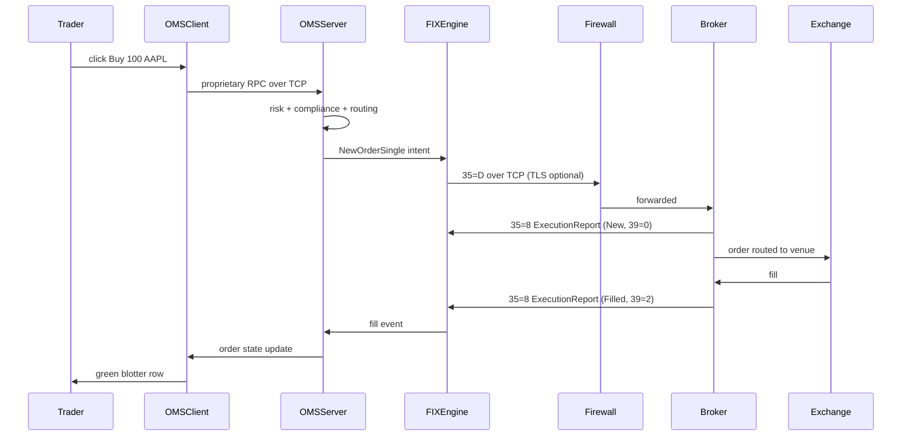

# Mock Interview — Networking & Trading Wire Protocols

## Contents

1. [Dialogue 1 — Broker FIX session drops every 2 hours (30 min)](#dialogue-1--broker-fix-session-drops-every-2-hours-30-min)
2. [Dialogue 2 — What happens on the wire when I press Buy 100 AAPL (30 min)](#dialogue-2--what-happens-on-the-wire-when-i-press-buy-100-aapl-30-min)
3. [Dialogue 3 — Whiteboard the low-latency market data path, exchange to strategy (30 min)](#dialogue-3--whiteboard-the-low-latency-market-data-path-exchange-to-strategy-30-min)
4. [Debrief — patterns across all three](#debrief--patterns-across-all-three)

---

## Dialogue 1 — Broker FIX session drops every 2 hours (30 min)

**Scenario the interviewer sets up:** *"Production has been paging us since Monday. Our FIX session to a European sell-side broker is dropping roughly every two hours. Orders in flight get orphaned, traders are angry. Walk me through how you'd diagnose it. I'll act as the broker's support desk when you need me."*

---

### Q1. Where do you start — logs, packet capture, or the counterparty?

**Interviewer signal:** they want to see if the candidate has a triage instinct, not a "run tcpdump immediately" reflex.

**Answer:**
Before I touch anything, I want two facts: is the drop **exactly** every two hours or roughly, and which side sends the FIN — us or them. That determines the entire investigation tree.

So step one, I pull the FIX engine log and grep for `Logout`, `Disconnect`, and socket close events over the last 48 hours. I plot the timestamps. If it's exactly 7,200 seconds ±5s, that's a timer somewhere — likely an idle timeout on a firewall or load balancer. If it's ragged, it's more likely heartbeat starvation or a network event.

Step two, I check who initiated. If our engine logs "peer disconnected" with no FIN observed, the path was cut mid-stream — firewall or NAT eviction. If we see a clean `Logout (35=5)` from the broker, that's application-layer and I need to ask them why.

I only reach for `tcpdump` once I know which hypothesis I'm testing. Packet capture is expensive to read; I don't want to swim in it blind.

**Watch-outs:** candidates who jump to Wireshark first usually can't articulate what they're looking for. Interviewer wants hypothesis-first debugging.

---

### Q2. You check the logs. Drops happen at 09:03, 11:03, 13:03, 15:03 UTC. What's your read?

**Interviewer signal:** can the candidate recognize a fixed-interval pattern and enumerate the small set of things that produce it.

**Answer:**
Exactly two hours to the second means a timer, not a network flake. The candidates in order of likelihood:

1. **Stateful firewall idle timeout** — Palo Alto, Checkpoint, and Cisco ASA default TCP idle timeout is often 3600s but is frequently tuned to 7200s. If FIX heartbeats aren't traversing (blocked, or below the firewall's "keepalive-worthy" threshold on some vendors), the state table entry expires and the next packet gets a RST.
2. **Load balancer session timeout** — F5 and AWS NLB both have configurable idle timeouts. NLB's default is 350s, so unlikely here, but F5 SNAT persistence records can be tuned to 2h.
3. **Broker-side session recycling** — some brokers cycle FIX sessions on a schedule (rare but real, especially for older infra).
4. **Our own OMS-side scheduled job** doing something at :03 past even hours — a config reload, a cert refresh, a GC pause long enough to miss a heartbeat.

Given the `:03` offset, I'd bet on #1 or #2. The firewall was probably reloaded at 07:03 UTC on Monday and now its 2-hour timers are anchored to that.

**Watch-outs:** don't say "must be the network" without naming the timer. Precision matters.

---

### Q3. You believe it's an idle firewall. But we send FIX heartbeats every 30 seconds. Why would the firewall time out?

**Interviewer signal:** this is a real trap — do you understand that FIX heartbeats are TCP payload and should reset the firewall state timer?

**Answer:**
That's the right question, and the answer usually isn't "the firewall is broken." It's one of three things:

1. **Traffic is flowing but on a different 5-tuple than the firewall thinks.** If there's a NAT device in between and its mapping expired even though our side kept sending, the return path is broken. The firewall sees our packets go out on tuple A, but the broker's replies come back on a stale tuple B and get dropped. We think we're heart-beating; we're actually monologuing.
2. **Heartbeats are being coalesced or dropped by a middlebox.** Some deep-packet-inspection appliances parse FIX and if the heartbeat message is malformed (wrong `10=` checksum, extra whitespace), they silently drop it. The engine thinks it sent; the wire says otherwise.
3. **The engine's heartbeat thread is starved.** JVM GC pause, or a config where the heartbeat is application-layer but shares a thread pool with order processing. Under load at market open, heartbeats slip past `HeartBtInt × 2` and the counterparty logs us out.

To distinguish: I ask netops to check the firewall's session table right before the expected drop and confirm the entry's `last-activity` timestamp. If it's stale despite our engine logging outbound heartbeats, we've got a wire-visibility problem and I now do want tcpdump — on both sides of the firewall.

**Watch-outs:** "heartbeats prevent all idle timeouts" is the naive answer. Real networks have asymmetric paths and lying middleboxes.

---

### Q4. tcpdump on our side shows we're sending heartbeats. Broker's side shows they're not receiving them for the last 4 minutes before the drop. Where do you go?

**Interviewer signal:** systematic bisection — can the candidate narrow the fault domain?

**Answer:**
The packet is leaving us and not arriving. Somewhere in the path it's being dropped. I need to bisect.

The path is roughly: our OMS host → our LAN switch → our firewall → carrier/leased line → broker's edge firewall → broker's LAN → broker's FIX engine. I ask netops for:

- Interface counters (errors, drops, discards) on our egress and the firewall's ingress/egress on the broker-facing interface, for the exact 4-minute window.
- The firewall session table entry for this 5-tuple: is it still there? What's the byte counter?
- If we have a leased line with a provider (e.g., BT Radianz, TNS), open a ticket with the provider correlation ID and the 5-tuple.

The most common finding in my experience: the firewall session **is** aging out because the vendor's counter only ticks on ACKs of *new* data, and something upstream is buffering our heartbeats so no fresh ACK arrives in the last window. That's a TCP window / MTU / PMTU-blackhole class of problem, and it often shows up as retransmits in tcpdump right before the drop.

**Watch-outs:** don't skip the interface counters. "Firewall is fine" from netops without counter evidence is not evidence.

---

### Q5. Meanwhile, what do you tell the desk? Traders are yelling.

**Interviewer signal:** production support is half technical, half comms. Can you hold the line under pressure?

**Answer:**
Short, timestamped, no speculation. Something like:

> "FIX session to \[broker\] is dropping approx every 2h since Monday 09:03 UTC. Working with netops + broker on suspected firewall idle-timeout. Impact: orders in flight at drop time require manual reconciliation. Mitigation: manually resending session logon on drop, ETA ~30s per event. Next update in 30 min."

Then I make sure the desk has a written recon protocol — how to identify orphaned orders, who to call at the broker for out-trades. If drops are predictable at :03, I proactively drain the book at :02 during the incident window. That's the kind of thing traders forgive you for if you tell them; not if they discover it after a bad print.

**Watch-outs:** never say "it's a broker problem" until you've proved it. That relationship survives outages; it doesn't survive finger-pointing.

---

### Q6. Root cause turns out to be that the broker's firewall was replaced Sunday night and the new one doesn't honor TCP keepalives below 7200s. Fix?

**Interviewer signal:** are you a "escalate and wait" engineer or do you know the layered fixes?

**Answer:**
Three layers of fix, in ascending order of "who has to do work":

1. **Immediate (us):** shorten FIX `HeartBtInt` from 30s to 10s in the session config. More application-layer traffic keeps the firewall state alive. Confirm the broker agrees — some enforce a floor.
2. **Immediate (kernel):** on our OMS host, enable and tune TCP-level keepalives: `net.ipv4.tcp_keepalive_time=60`, `tcp_keepalive_intvl=15`, `tcp_keepalive_probes=4`. These are OS-level and independent of FIX. Belt and suspenders.
3. **Proper fix (broker):** they raise a change to lower the firewall idle timeout on their session-facing rule to 3600s or less, or configure it to inspect FIX and treat heartbeats as activity.

I'd deploy #1 and #2 today with a change ticket, and track #3 to closure. And I'd add an alert: heartbeats sent vs. heartbeats acknowledged, with a threshold. If we see acks stop while sends continue, we page before the drop, not after.

**Watch-outs:** "just increase the heartbeat interval" is a partial fix. The alert is what stops the next incident.

---

## Dialogue 2 — What happens on the wire when I press Buy 100 AAPL (30 min)

**Scenario:** *"You're onboarding a new junior BA on Monday. Walk me through, in as much detail as you can, everything that happens when a trader clicks Buy 100 AAPL market order in your OMS. Assume the destination is a US broker via FIX 4.4. Draw it, name protocols, name latencies. I'll interrupt."*

---

### Q1. Start from the click. What's the first thing that happens?

**Interviewer signal:** does the candidate distinguish UI event from business action, and know the layers.

**Answer:**
The click is a UI event captured by the OMS client — in our stack, a Java Swing or web front-end. It becomes an in-process order object with: symbol AAPL, side Buy, qty 100, order type Market, TIF Day, account, trader ID, timestamp. The client validates locally — is the trader entitled to trade AAPL, is 100 within their max order size limit, is the account open. That's typically sub-millisecond because it's a cache lookup.

Then the client packages this as a request to the OMS server. Depending on the vendor, this is either a proprietary binary RPC over TCP or a message on an internal bus (Tibco EMS, Solace, Kafka). In our OMS it's the vendor's proprietary framing over TCP with heartbeats — think of it as FIX-adjacent but private.

**Watch-outs:** don't say "the click sends a FIX message." It doesn't — FIX is only on the external leg.

---

### Q2. What does the OMS server do with it?

**Interviewer signal:** understanding of pre-trade risk, compliance, routing.

**Answer:**
The server does the heavy lifting in a chain of stages:

1. **Enrichment:** attach the account's clearing broker, capacity (agent/principal), commissioning schema, symbology mapping (AAPL → CUSIP 037833100, RIC AAPL.OQ, ISIN US0378331005 — the destination decides which it wants).
2. **Pre-trade risk:** notional check (100 × ~$220 = $22,000, well within limits), fat-finger check (is 100 unreasonable for this trader? no), restricted-list check, wash-trade check against opposite-side orders resting.
3. **Compliance:** short-sale flag (not applicable, it's a buy), Reg NMS considerations for equities, MiFID II fields if EU — but this is US so mostly Rule 606/605 tagging.
4. **Routing decision:** where does 100 shares of AAPL go? Small marketable order like this typically goes to a broker's smart order router (SOR), not direct to an exchange. The OMS looks up the routing table for AAPL + this account + this trader and picks Broker X.
5. **State persist:** write the order to the OMS database, assign a `ClOrdID`, mark status `PendingNew`.

All of this in maybe 200 microseconds to 2 milliseconds depending on the vendor and how much of it is in-memory vs. DB round-trip.

**Watch-outs:** candidates who skip risk and go straight to FIX show they've never worked a production OMS.

---

### Q3. Now the FIX message. Show me the fields.

**Interviewer signal:** actual FIX literacy — can they name the tags without googling.

**Answer:**
FIX 4.4 NewOrderSingle, tag 35=D. Minimum required tags plus what a real broker demands:

```
8=FIX.4.4|9=<bodylen>|35=D|49=OURFIRM|56=BROKERX|34=<seqnum>|52=<UTCtime>|
11=OURCLORDID20260718000042|55=AAPL|48=037833100|22=1|54=1|38=100|40=1|
59=0|60=<UTCtime>|1=ACCOUNT123|21=1|60=<UTCtime>|100=BROKERX_SOR|10=<checksum>|
```

Field-by-field, the important ones:

- `8` BeginString — protocol version. Session-level.
- `9` BodyLength — everything between BodyLength and CheckSum.
- `35=D` MsgType — NewOrderSingle.
- `49/56` SenderCompID / TargetCompID — session identity.
- `34` MsgSeqNum — monotonic per session, this is how FIX guarantees ordered delivery.
- `52` SendingTime — our clock, UTC, ideally sub-second precision.
- `11` ClOrdID — our unique ID for this order. Must be unique per session per day. Broker echoes it back on every execution report.
- `55` Symbol, `48` SecurityID, `22` IDSource (1=CUSIP) — instrument identification. Some brokers want just 55, some want the CUSIP for unambiguous routing.
- `54=1` Side (1=Buy).
- `38=100` OrderQty.
- `40=1` OrdType (1=Market).
- `59=0` TimeInForce (0=Day).
- `60` TransactTime — when the trader hit the button.
- `1` Account.
- `21=1` HandlInst (1=Automated, no broker intervention).
- `100` ExDestination — broker's SOR.
- `10` CheckSum — sum of all bytes mod 256, three ASCII digits.

Framing is SOH-delimited (0x01), not pipe. Pipe is for readability.

**Watch-outs:** confusing `11` ClOrdID with `37` OrderID (broker-assigned). Getting `54` sides wrong. Forgetting `21` HandlInst.

---

### Q4. What's the wire look like below FIX?

**Interviewer signal:** OSI stack awareness — TCP, TLS, sometimes MQ.

**Answer:**



Below FIX at layer 4 it's a persistent TCP connection, usually one session per broker per environment. Layer 5 is FIX session state — sequence numbers, heartbeats, resend requests. TLS is increasingly common but not universal for FIX; many brokers still rely on leased lines or IPsec tunnels for privacy. Layer 3 is IP over a leased line, MPLS, or in some cases the public internet with a VPN. Layer 2 depends — often it's just Ethernet through the counterparty's carrier of choice.

**Watch-outs:** don't claim FIX runs over UDP. Order flow is always TCP because you need reliability and ordering. Market data can be UDP; orders never.

---

### Q5. What does the broker send back and in what order?

**Interviewer signal:** ExecutionReport lifecycle knowledge — the single most important message in FIX.

**Answer:**
Almost always a sequence of `35=8` ExecutionReports, distinguished by `150` ExecType and `39` OrdStatus:

1. **150=0, 39=0** — New. "I received your order, it's live at the venue." Comes back within milliseconds if the session and SOR are healthy.
2. **150=F, 39=1 or 2** — Trade / Partial or Full fill. Contains `31` LastPx, `32` LastQty, `14` CumQty, `6` AvgPx, `17` ExecID (broker-unique fill ID), `31/32` for the specific fill.
3. Possibly interim **150=E, 39=6** — PendingReplace if we amended, **150=4, 39=4** if canceled, **150=8, 39=8** Rejected if it never reached the venue.

For a market order in AAPL during regular hours, expect New then Filled within 50–500ms end to end from click to green blotter, depending on how far the SOR routes and how deep the book is.

**Watch-outs:** confusing `39` OrdStatus (state) with `150` ExecType (event that caused this report). They match most of the time, but not always — a partial fill has `150=F, 39=1` where 1 is "partially filled."

---

### Q6. Something goes wrong — the broker never sends back the New. What do you check?

**Interviewer signal:** operational reflexes.

**Answer:**
Three checks, in this order:

1. **Session health:** is 35=0 Heartbeat still exchanging? If not, session is dead and my order is in limbo. Recover the session, then check what the broker has on their side by ClOrdID.
2. **Our sequence numbers:** did the message actually go out? Grep the FIX log for `11=OURCLORDID20260718000042`. If not there, the OMS server dropped it before the engine — internal problem.
3. **Broker acknowledgment:** the TCP ACK for our 35=D — did we see it? If yes, they received the bytes. Then it's their problem, and I open a ticket citing the ClOrdID, their SenderCompID, and the exact `52` SendingTime.

While that's in flight, I tell the trader: "Order 42 is unconfirmed. Do not resend. I'll have status in 5 min." Never let them resend blindly — you get double fills that way.

**Watch-outs:** letting the trader resend is the classic P1. Always require confirmation of the original's fate first.

---

## Dialogue 3 — Whiteboard the low-latency market data path, exchange to strategy (30 min)

**Scenario:** *"Pretend we're setting up a new low-latency equities strategy in our firm. Whiteboard for me the market data path from the exchange all the way into the strategy's decision loop. Where does latency come from, where are the risks, what would you monitor?"*

---

### Q1. Start at the exchange. What does the exchange publish and how?

**Interviewer signal:** knowledge of exchange multicast feeds vs consolidated tapes.

**Answer:**
For US equities, exchanges publish two conceptual things: their proprietary direct feed and the consolidated feed (SIP).

- **Direct feed** (e.g., Nasdaq TotalView-ITCH, NYSE Integrated) — full depth of book, order-by-order, sub-millisecond publication, delivered as UDP multicast on the exchange's colocation network. This is what low-latency shops pay for.
- **SIP** (CTA/UTP) — top of book, aggregated across all listed exchanges, delivered with a small latency penalty (used to be tens of ms, now closer to 1ms for the modern SIPs).

For our strategy we'd take the direct feed of every venue we care about (Nasdaq, NYSE, BATS, EDGX at minimum) via UDP multicast, colocated in the same datacenter as the matching engine — so NY4/NY5 for Nasdaq, Mahwah for NYSE, Secaucus for BATS.

**Watch-outs:** SIP-only is not a low-latency strategy. If someone claims LL and mentions the SIP, ask more.

---

### Q2. Draw the path.

**Interviewer signal:** can the candidate render the tick-to-trade path end-to-end and place kernel-bypass, NIC, feed handler, book, strategy, and order-out on the same diagram.

**Answer:**



```mermaid
flowchart LR
    A[Exchange matching engine] -->|"UDP multicast<br/>ITCH / arca"| B[Exchange gateway<br/>colo cross-connect]
    B -->|"cross-connect<br/>~1μs"| C[Firm NIC<br/>kernel bypass<br/>Solarflare/Mellanox]
    C -->|"onload / DPDK<br/>~5μs"| D[Feed handler<br/>parse ITCH]
    D -->|"shared memory<br/>~1μs"| E[Order book builder<br/>maintain L2/L3]
    E -->|"shared memory"| F[Strategy engine<br/>decision loop]
    F -->|"shared memory"| G[Order gateway<br/>build FIX or binary]
    G -->|"kernel bypass"| H[NIC out]
    H -->|"cross-connect"| I[Exchange order entry]
```

Tick-to-trade budget for a competitive shop is under 10 microseconds wire to wire, meaning from the moment the exchange's UDP packet hits our NIC to the moment our order packet leaves our NIC. The best shops are under 1μs using FPGAs.

**Watch-outs:** don't mix up co-location (same building) with proximity hosting (same metro). They differ by hundreds of microseconds.

---

### Q3. Why UDP multicast for market data and not TCP?

**Interviewer signal:** does the candidate understand the fundamental tradeoff.

**Answer:**
Three reasons:

1. **Fan-out.** Multicast lets the exchange publish one packet and have every subscriber receive it simultaneously. TCP would require a per-subscriber stream — enormous cost and per-subscriber jitter.
2. **Latency.** No connection setup, no retransmit-driven head-of-line blocking. If a packet drops, TCP would stall the whole stream while it recovered. UDP lets you drop and keep moving.
3. **Determinism.** Multicast delivery is (roughly) simultaneous to all listeners — important for fairness.

The tradeoff: UDP means we can drop packets and get gaps in the sequence numbers. Every real market data feed has a **gap recovery** mechanism — usually a separate TCP feed you request retransmission from, plus a second "B feed" multicast that carries the same data on a different multicast group so you can arbitrage between A and B feeds for missing packets.

**Watch-outs:** claiming "UDP has no reliability" misses that the reliability lives at the application layer via sequence numbers and A/B arbitration.

---

### Q4. Where does latency come from and how do you attack each source?

**Interviewer signal:** performance engineering literacy.

**Answer:**

| Source | Typical | Attack |
|---|---|---|
| Fiber propagation | 5μs per km | Colocate; cross-connect same rack |
| Switch hop | 300ns–1μs each | Minimize hops; use cut-through switches (Arista 7130) |
| NIC to kernel | 5–20μs | Kernel bypass — Solarflare OpenOnload, Mellanox VMA, DPDK |
| Kernel scheduler | 10μs+ jitter | Pin threads, isolate CPUs (`isolcpus`), disable hyperthreading |
| Parse / decode | 100ns–5μs | Hand-tuned C++ or FPGA; avoid virtual dispatch |
| Order book update | 500ns–10μs | Cache-friendly structures, no allocation on hot path |
| Strategy decision | varies | Whatever your alpha requires — but no logging or DB on hot path |
| Serialize FIX out | 1–10μs | Or better: use the exchange's native binary order entry (OUCH, ArcaDirect) — FIX is fat |

Big wins on any real project:

- **Kernel bypass** — biggest single latency reduction from moving off vanilla sockets.
- **Busy-wait polling** instead of interrupt-driven I/O.
- **NUMA locality** — pin the NIC, feed handler, book builder, and strategy on the same NUMA node.
- **Cache warmth** — hot path fits in L1/L2, no cold-start on the first tick of the day.

**Watch-outs:** don't cite microseconds without saying what you measured. "5μs feed handler" means what — end-to-end tick-to-book, or just parse?

---

### Q5. What do you monitor in prod?

**Interviewer signal:** operational maturity — LL systems fail silently and expensively.

**Answer:**
Four categories:

1. **Correctness:** gap counters per feed (packets received vs. expected sequence), A/B arbitration wins/losses, checksum failures, book-crossed events (bid > ask, which indicates a decode bug).
2. **Latency:** histograms not averages. p50, p99, p99.9 of tick-to-book and tick-to-trade. If p99.9 blows up while p50 is fine, something is jittering — GC, page fault, IRQ.
3. **Throughput:** packets per second per feed vs. exchange's published rate. If we're seeing 80% of what the exchange says it published, we have loss upstream.
4. **Business:** fill rates vs. quotes, adverse selection, slippage vs. arrival price. If latency degrades, alpha degrades — this is the ultimate signal.

Alerting: any gap > 1s unrecovered pages immediately. Latency p99 above SLA for 30s pages. Fill rate drop > 20% intraday pages.

**Watch-outs:** monitoring averages instead of tails is a rookie error. In LL, the tail is the story.

---

### Q6. What breaks and how do you recover?

**Interviewer signal:** war stories, resilience.

**Answer:**
Three classic failure modes:

1. **Multicast storm / feed gap.** Feed handler falls behind, drops packets, sequence numbers gap out. Recovery: A/B arbitration first (cheap, in-memory); if both A and B are gapped, request retransmit on the TCP recovery channel; if still gapped, snapshot the book from the exchange's periodic full snapshot feed. During gap, strategy should stop trading — a stale book leads to bad trades.
2. **Clock drift.** PTP (Precision Time Protocol) syncs our servers to the exchange's grandmaster within nanoseconds. If PTP loses sync, our latency measurements become fiction. Monitor PTP offset continuously.
3. **NIC / cross-connect fail.** Redundant NICs on separate switches on separate cross-connects. Failover in software is expensive; the good shops have active-active feeds with A/B on physically diverse paths.

And the failure mode that always bites: **someone deploys a config change during trading hours** and the strategy sees a different multicast group than the feed handler subscribed to. Silent — no gaps, no errors, just no data. Monitor "time since last tick per symbol" and alert on staleness.

**Watch-outs:** the "silent no-data" failure is the interviewer's favorite gotcha. Have an answer.

---

## Debrief — patterns across all three

**What ties these dialogues together:**

1. **Hypothesis before evidence.** In all three, the strong answer starts by naming what would prove or disprove a theory, not by dumping tools. Interviewers reject candidates who go "I'd check the logs and then Wireshark and then…" without saying what they're testing.

2. **The 5-tuple is the atom of network debugging.** SrcIP, SrcPort, DstIP, DstPort, Protocol. Every firewall, load balancer, and monitoring system is organized around it. If you can't produce the 5-tuple for a failing flow, you can't have the conversation with netops.

3. **Layer discipline.** FIX at L7, TCP at L4, IP at L3. The candidate who says "the FIX heartbeat failed" when the real answer is "the TCP session was reset by an intermediate device" is missing the layer. Every layer has its own failure modes and its own tools.

4. **UDP for data, TCP for orders — always.** If the interviewer trips you into saying UDP for orders, you're done. Reliability and ordering are non-negotiable for order flow.

5. **Colocation, kernel bypass, NUMA, and busy-polling** are the four horsemen of low-latency. Any LL discussion that omits them is theoretical.

6. **Monitor the tails, not the means.** p99, p99.9, max. Averages hide the incidents. In production support, the average is fine 99% of the time and useless 100% of the time.

7. **Comms are half the job.** In Dialogue 1 Q5, the trader-facing answer is as much a required skill as the packet analysis. A production support engineer who can't write a calm sitrep is a liability.

**Red flags interviewers watch for:**
- Jumping to tools before hypotheses.
- Blaming the counterparty without evidence.
- Confusing FIX tags — especially `11` vs `37`, or `39` vs `150`.
- Claiming order flow can run on UDP.
- Reciting microsecond numbers without saying what was measured.
- Never mentioning gap recovery or A/B feed arbitration.

**Green flags:**
- Naming the 5-tuple and asking netops for state-table evidence.
- Distinguishing session-layer FIX events from TCP-level events.
- Layered fixes (immediate, kernel, counterparty) rather than a single "escalate" motion.
- Ownership of the trader-facing message.
- Knowing which exchange lives in which datacenter (NY4, Mahwah, Secaucus, CH1).
