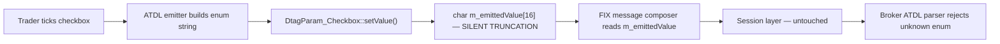

# 06 — Mock Interview: Four Dialogues

## Contents
1. [Round 1 — Behavioral (HR / hiring manager, 30 min)](#round-1--behavioral-hr--hiring-manager-30-min)
2. [Round 2 — Deep-dive incident walkthrough (senior technical analyst, 45 min)](#round-2--deep-dive-incident-walkthrough-senior-technical-analyst-45-min)
3. [Round 3 — Conflict / teamwork (ex-trader turned tech lead, 30 min)](#round-3--conflict--teamwork-ex-trader-turned-tech-lead-30-min)
4. [Round 4 — Skip-level (head of trading support, 20 min)](#round-4--skip-level-head-of-trading-support-20-min)

Each round: turn-by-turn dialogue, then a **Debrief** block calling out what landed, what to sharpen, and the recruiter/hiring signals in play.

---

## Round 1 — Behavioral (HR / hiring manager, 30 min)

**Format:** conversational, warm, screening. The hiring manager is looking for signal on communication, motivation, and cultural fit. They already know you can code — this round is whether they can put you in front of a trader at 07:30 on a bad Monday.

### Q1. Tell me about yourself.
**Interviewer signal:** can you compress five years into a 90-second narrative arc that lands the job you want.
**Answer:**
I have around five years supporting production OMS platforms at a global bank OMS built on our vendor core — Equities, PT, and Multi-Cross flow. I sit between the trading floor and engineering: I own L2/L3 triage, root-cause on FIX and order-lifecycle issues, and drive fixes end-to-end with our OMS vendor and internal core teams. My day splits three ways: reactive — traders calling about a stuck order or a booking mismatch; proactive — reading purge logs, alert firings, latency graphs before anyone screams; and project — ATDL rollouts, new venue certifications, DFD onboardings. I'm at the point where I want more ownership of platform decisions, not just triage, which is what pulled me toward this role.
**Watch-outs:** don't recite your CV; end on why *this* role, not why you're leaving.

### Q2. What are your strengths?
**Interviewer signal:** self-awareness plus one strength that maps to the JD.
**Answer:**
Three things.
- **Reading source under pressure.** I don't wait for vendor to answer a Sev-1 — I open the code path and reason from the buffer up. Last quarter I traced a checkbox tag truncation to a 16-byte char array in the vendor's DtagParam header before the vendor even acknowledged the ticket.
- **Translating between trader and engineer.** Traders say "the order looks weird"; engineers need "on second replace, tag 12 populated on child but blank on parent." I do that translation live on a call without losing either side.
- **Post-mortem discipline.** Every Sev-2+ I own gets a written RCA with a repro, the offending line range, and a preventive control. That's how our team's repeat-incident rate dropped.
**Watch-outs:** don't list five vague adjectives. Two or three, each with a receipt.

### Q3. What's a weakness — a real one?
**Interviewer signal:** honesty and evidence of active work on it, not a humblebrag.
**Answer:**
I over-index on getting to root cause before communicating status. Early in my career a trader was waiting on a reject, and I spent 20 minutes reading the FIX log before I updated him. He'd already escalated to his desk head. I now run a strict two-track: a stakeholder update every 15 minutes in the incident channel — even if it's "still investigating, ruling out venue" — and the deep dive in parallel. Silent debugging is a bug in the process, and I fixed mine.
**Watch-outs:** never say "perfectionism" or "I work too hard." Give one concrete miss and the mechanism you built to prevent recurrence.

### Q4. Why this role?
**Interviewer signal:** did you read the JD, do you know the desk, are you likely to leave in a year.
**Answer:**
Three reasons, in order. First, the desk mix — high-touch plus program plus algo on a single OMS is exactly what I've been supporting, so I can be productive in weeks not quarters. Second, the platform ownership piece in the JD — you want someone who can drive vendor tickets and internal changelists, not just route them, and that's the seat I want. Third, the team's reputation for taking analysts seriously in design reviews. I've been in shops where support is downstream of every decision; I've read enough of your engineering blog to know that's not the case here.
**Watch-outs:** never say "growth" or "I want to learn" as the primary reason — that reads as junior. Anchor on what you'll *give* the team.

### Q5. Why leave your current firm?
**Interviewer signal:** are you running toward something or away from something; are you a flight risk.
**Answer:**
I'm not unhappy — I've had a good run at the current shop and would recommend it. What I'm running toward is a floor with more product surface. On my current desk I know the OMS end to end, but the flow is narrow: single asset class, one primary broker feed. This role has PT plus Multi-Cross plus a live IOBX book, which triples the interesting failure modes and the interesting fixes.
**Watch-outs:** never criticise current manager, team, or firm. Neutral or positive, always. "Running toward" language is the tell recruiters listen for.

### Q6. Where do you see yourself in three years?
**Interviewer signal:** are your ambitions compatible with the seat, or will you be bored in 12 months.
**Answer:**
Three years in, I want to be the person on this desk who owns the platform roadmap for one flow — say Multi-Cross or IOBX — end to end. Not just triaging incidents on it, but sitting in the vendor's release-review, blocking bad ATDL changes before they ship, and running the internal capacity model for it. I don't want to be a manager in three years; I want to be the senior IC the manager consults before signing off on a change.
**Watch-outs:** don't say "your job." Don't say "manager" unless the seat is a manager track. Anchor on scope and influence.

### Q7. Any questions for me?
**Interviewer signal:** did you do homework; are you the sort who asks good questions on the desk.
**Answer:**
Three, if there's time.
1. What's the current biggest pain point on this desk — what would the person in this seat fix in month one?
2. How does support get looped into the vendor's release cycle? Is there a pre-prod validation window we own?
3. What does "great" look like at the twelve-month mark in this seat — how will I know I'm hitting the bar?
**Watch-outs:** never ask about salary, WFH, or vacation in round one. Ask questions that show you're already thinking like a member of the team.

### Debrief — Round 1
- **What landed:** concrete strengths with receipts, an honest weakness with a corrective mechanism, and a "running toward" framing on the leaving question.
- **What to sharpen:** the tell-me-about-yourself needs to land under 90 seconds — practise the closing sentence so it flows into "why this role" without a beat.
- **Recruiter signal you gave off:** low-drama, engineering-literate, unlikely to be a flight risk, comfortable with traders.
- **Red flag you avoided:** talking down your current shop; naming names; over-claiming expertise on flow you haven't touched.

---

## Round 2 — Deep-dive incident walkthrough (senior technical analyst, 45 min)

**Format:** whiteboard-style. Interviewer wants to see how you think, not just what you know. They will interrupt. They will push on the parts you're weakest on.

### Q1. Pick a real incident from the last year, walk me through it. Start with what the trader saw.
**Interviewer signal:** can you tell a story with a clean timeline, or do you jump straight to the code and lose them.
**Answer:**
This was a Multi-Cross ATDL issue on tag 21283, `IOBX-CROSS-PRE-POST`, a boolean checkbox on the cross ticket. The trader's report was: he had checked the box in the front-end, but on the wire the tag was arriving at the broker as `IOBX-CROSS-PRE-PO` — truncated. The broker's ATDL parser rejected the order for an unknown enum value. Cross was blocked. This was on a US Multi-Cross flow at market open, so the pressure was real.

My timeline:
- **T+0** — trader message with two screenshots: front-end and rejected FIX 35=8.
- **T+5** — reproduced in UAT, confirmed truncation happens client-side, before the wire.
- **T+20** — narrowed to ATDL processing, not the FIX engine.
- **T+45** — root cause: the vendor's `DtagParam_Checkbox` class stores the emitted string in a `char[16]` buffer, and the ATDL `maxLength` attribute only applies to `TextField_t`, not `CheckBox_t`. So the runtime happily wrote `IOBX-CROSS-PRE-POST` — 19 chars — into a 16-byte buffer, truncated at 15 plus null.
- **T+70** — hot-fix: shortened the emitted string to a compliant abbreviation the broker's ATDL also understood; opened vendor ticket to widen the buffer to `char[64]`.
- **T+next-release** — permanent fix from vendor: buffer widened. We also switched three other long checkbox tags to `constValue` + `StateRule` pattern so we don't sit on the same landmine.

### Q2. Wait — how did you know it was client-side and not the FIX engine?
**Interviewer signal:** do you actually understand the layers, or are you just narrating.
**Answer:**
Two data points. First, our OMS logs the ATDL-emitted string at the moment the ticket is composed, before it hands the message to the FIX session. That log line showed the value already truncated. Second, I checked the outbound FIX capture at the session layer and the field was already short there — the FIX engine wasn't doing anything to it. So the mutation had to be upstream of the session, which is the ATDL emitter. From there it's the vendor's `DtagParam` layer.

### Q3. Show me on the whiteboard where the bug lives.
**Interviewer signal:** you know the code path, not just the symptom.
**Answer:**
```cpp
// utl/include/DtagParam.h, lines ~199-200 in the vendor tree
class DtagParam_Checkbox : public DtagParam {
    // ...
    char m_emittedValue[16];   // <-- 15 usable chars + null
    // ...
};
```
The setter that writes into `m_emittedValue` uses `strncpy` with `sizeof(m_emittedValue) - 1`, so no crash — just silent truncation. And critically, the ATDL `maxLength` attribute the vendor's docs advertise is enforced in `DtagParam_TextField::validate()` but there is no corresponding validate on the checkbox path. So there's no error, no log warning — the string just gets shorter.



### Q4. Why widen to 64 and not 32?
**Interviewer signal:** do you make decisions with numbers or with vibes.
**Answer:**
I looked at every ATDL enum string emitted on our profile — grep across the config — and the longest legitimate one was 41 characters, from a legacy conditional-order tag we still emit for one venue. 32 would fit today's traffic but not next year's if the naming conventions keep drifting toward descriptive enums. 64 gives us headroom without meaningfully changing struct size — `DtagParam_Checkbox` is heap-allocated per ticket, not stack-blasted per message, so the extra bytes don't hit us in a hot path. I made that argument in the vendor ticket with the numbers, and they took the 64.

### Q5. What was your rollback plan for the hot-fix?
**Interviewer signal:** operational maturity — do you think about the un-happy path.
**Answer:**
The hot-fix was a config change on the ATDL profile — shorten the emitted string, no code deploy. Rollback was reverting the config file and bouncing the ticket-composer process, which was a 90-second operation with no order impact because we did it out of hours the same day. I confirmed with the broker that both the old truncated form and the new abbreviated form were acceptable in their parser, so we had a fallback even if we forgot to revert — which is the kind of thing you always want before a Friday deploy.

### Q6. What did you write up afterwards and who saw it?
**Interviewer signal:** post-mortem hygiene; do you close the loop.
**Answer:**
A one-page RCA with three sections — timeline, root cause with the file and line range, and preventive controls. Distribution was the desk head, the OMS engineering lead, and the vendor account manager. The preventive-controls section is the part I care most about: I proposed a lint rule on our ATDL profile that fails CI if any checkbox `enumID` string exceeds 15 characters. That rule is now in our pre-merge pipeline. That's the piece that means we won't see this class of bug again on our platform even if the vendor doesn't ship the widened buffer.

### Q7. If you had 30 more minutes on this, what would you dig into?
**Interviewer signal:** intellectual honesty — you know where the gaps are in your own analysis.
**Answer:**
Two things I didn't fully close.
1. **Other 16-byte buffers in the same file.** I only proved the fix for `DtagParam_Checkbox`. The vendor's `DtagParam_Radio` and `DtagParam_DropDown` classes have similar-looking definitions and I never opened them. There's a real chance the same fixed-width buffer is sitting there waiting for a longer enum. I'd want to grep the whole `DtagParam.h` for `char[16]` and audit each one.
2. **Silent-truncation telemetry.** The reason this bug shipped is that truncation was silent. Even after the buffer widening, if someone in ten years emits a 65-char enum, we're back in the same movie. I'd want a runtime assert or a warning log any time `strncpy` truncates in the emitter. That's a vendor-side change and it's a harder sell, but it's the real durable fix.

### Debrief — Round 2
- **What landed:** clean timeline with T+ notation, showed the exact file and line, defended the 64 with numbers, closed with intellectual honesty on gaps.
- **What to sharpen:** when the interviewer asked how you knew it was client-side, you gave two data points — good — but you could add "and I ran the ATDL emitter in isolation with the tag value, reproduced without a FIX session at all" to nail the isolation-of-variables point.
- **Signal you gave off:** L3-capable, can read vendor source, can drive a vendor ticket to closure, has the process discipline to write up an RCA and land a lint rule.
- **Red flag you avoided:** blaming the vendor. You noted the vendor bug factually and moved to the durable fix on your side. Interviewers hate blame-shifting even when it's warranted.

---

## Round 3 — Conflict / teamwork (ex-trader turned tech lead, 30 min)

**Format:** he ran an execution desk for eight years, now runs the tech team supporting it. He is looking for whether you'll listen to traders, and whether you'll push back when they're wrong. Both matter equally.

### Q1. Tell me about a time you disagreed with a trader on the cause of an issue.
**Interviewer signal:** do you have the spine to hold a technical position, and the tact not to make it personal.
**Answer:**
About a year ago a senior trader on the merged-DMA desk called me about what he was sure was a commission mis-config. He'd done a replace on an order that had been merged from two parents, and the child that went to a European sell-side broker on the wire had tag 12 and tag 13 populated with the wrong commission type — the broker got charged, effectively. His view: "you guys pushed a commission-config change last week, this is on you."

I disagreed. The commission-config change last week was on a different flow, and the timing coincidence isn't evidence. But I didn't argue on the call. I said: give me 45 minutes, I'll come back with what I find, and if I'm wrong I'll say so.

Root cause turned out to be in the merge path. When the OMS merges two parents into one child, at `OMS.cpp` around lines 5123–5125 it clears the parent's `_comm_type` to null. On the first replace, the flow inside `FLEX_ORDER_COMMISSION_OVERRIDE` checks `if(!get_comm_type())` — cleared, so the override applies. Fine. But on the second replace, the incoming replace already carries a populated `_comm_type` from the front-end, so the `if(!get_comm_type())` guard is false, the override is skipped, and stale commission data leaks through to the broker.

So he was right that it was a bug. He was wrong about which bug. I came back to him with the file, the line, and a two-minute repro. He was, honestly, a little annoyed at first — nobody likes being told their diagnosis was off — but he respected the receipts. We shipped a fix that same week that either clears `_comm_type` on every replace of a merged order, or applies the override unconditionally on merged children. Vendor took the second option.

### Q2. What did you learn from that?
**Interviewer signal:** self-reflection, and whether you internalise the trader's perspective.
**Answer:**
Two things.
First — traders' diagnoses are anchored in what they can see, which is the wire and the ticket. That's a real signal, not noise. He was pattern-matching on "commission was wrong; there was a commission-config change last week." That's a reasonable Bayesian prior if you don't have access to the merge path. My job is to bring the layers he doesn't see into the conversation, without being condescending about it.
Second — the way I handled the call mattered as much as the fix. If I'd argued on the phone I'd have won the argument and lost the relationship. I asked for time, came back with evidence, and let the evidence do the talking. That trader now calls me first, not last, when something looks off. That's the outcome I optimise for.

### Q3. Have you ever been in a situation where a trader asked you to do something you thought was risky or wrong?
**Interviewer signal:** where's your line, and do you have the confidence to hold it.
**Answer:**
Yes. During a bad afternoon on the IOBX book, a trader wanted me to manually flip an order's portfolio field in the DB from an agency portfolio to a principal one, because the cross had come out as half-agency-half-principal and he wanted the P-leg tagged clean before he booked it.

I said no. Not because I couldn't do it, but because manually mutating `_portfolio` in the DB skips every downstream propagation — the child orders wouldn't see the change, the allocation records wouldn't match, the P&L attribution would be wrong. The correct fix was to work out why `PropAcctAssign` was firing without also updating `_portfolio` — which turned out to be that `Order::Copy()` was inheriting `_portfolio` from an agency parent, and the `if(_portfolio.empty())` guard in `FirmOrder::ActionStageNew()` never fires because the field is non-empty. `PropAcctAssign` later updates `_trading_acct` but not `_portfolio`, so you get the half-half state.

I gave him three options: cancel-and-resubmit clean, book manually with a compliance note and I'll open a Sev-2 for the propagation gap, or wait 30 minutes while I patch the `Order::Copy` path in a lower environment and we validate. He took option two. I opened the Sev-2 that afternoon, and the propagation fix went live the next release.

### Q4. He's still your senior. How do you say no without breaking the relationship?
**Interviewer signal:** the softer half of the same skill — social calibration.
**Answer:**
I never say "no." I say "not this way, and here's why, and here are the paths that get you what you actually want." Traders don't want to win an argument with support; they want the P&L to be right by end-of-day. If I frame my pushback as "here's how we protect your P&L attribution", I'm on his side, not opposite him. And I make it easy for him to pick — three options, ranked by risk, with the time cost of each. Nine times out of ten they take the middle option, which is the one I'd have picked anyway.

### Q5. Tell me about a time you had to work with an engineer or vendor who wasn't pulling their weight.
**Interviewer signal:** how you handle upward-adjacent conflict without whining.
**Answer:**
We had an alert-subscription bug where alerts weren't firing for one specific trader even though the subscription clearly existed in the DB and matched the alert type. Every other trader on the same subscription got the fire. I opened a vendor ticket, and for two weeks the vendor's response was "user error, check the config." I'd checked the config three times.

I stopped waiting. I pulled the vendor source for the alert manager and traced the fire path. The generic-alert short-circuit at line 356 was firing, but the subscription wasn't in the `m_subscriptions` multimap for that trader in memory — even though it was in the DB. Turned out the trader had had a reconnect that day; on reconnect, `RemoveSubscriptions` had cleared his in-memory map, and the DB re-add on reconnect had a race that dropped his row.

I sent the vendor a repro with the exact reconnect sequence, the exact line where the map was cleared, and the exact line where the re-add missed. They shipped a fix in the next patch. Two weeks of "user error" became a two-line source fix once I did their job for them.

The lesson isn't "the vendor is bad." The lesson is: if you know you're right, don't wait for someone else to confirm it. Bring the receipts. Nobody argues with a repro.

### Q6. Have you ever escalated over your manager's head?
**Interviewer signal:** judgment on when to break process, and whether you'd do it thoughtfully or dramatically.
**Answer:**
Once, and I told my manager I was going to, before I did. There was a proposed vendor release that was going to change the EOD purge cascade — specifically the basket-active propagation rule — and I believed it would leave stale baskets alive across the roll. My manager thought the risk was acceptable given the release timeline. I disagreed on the risk, and I thought the desk head needed to be the one making the call, because it was his end-of-day risk, not ours.

I told my manager: I'm going to raise this with the desk head, I want you in the meeting, and here's the one-pager I'm going to send. He was fine with it. Desk head backed my read on the risk, we blocked that piece of the release, and the vendor split it into a two-phase rollout with a purge dry-run mode we could validate first. The relationship with my manager stayed intact because I didn't go behind him — I went with him. That's the only way to escalate.

### Debrief — Round 3
- **What landed:** the commission-leak story shows technical strength; the portfolio-flip story shows judgment; the escalation story shows political maturity.
- **What to sharpen:** on Q4 you could add a specific example of the "three-options" framing — the ex-trader will latch onto concrete verbatim over abstractions.
- **Signal you gave off:** trader-safe, not a doormat, will push back with evidence, will not go rogue.
- **Red flag you avoided:** never trashed the trader, never trashed the vendor, never trashed your manager. Everyone in your stories comes out looking okay, and you come out looking like the one who solved it.

---

## Round 4 — Skip-level (head of trading support, 20 min)

**Format:** 20 minutes, cordial, high-signal. He's meeting a dozen candidates. He wants to know if you're serious about the firm and serious about the seat. He is not going to ask you a technical question. He is going to ask you what you care about.

### Q1. Where do you see yourself in five years?
**Interviewer signal:** trajectory clarity, and whether it's compatible with a support-track career at this firm.
**Answer:**
Five years out I want to be the platform owner for one flow on this desk — Multi-Cross is the one I'd want, given the complexity. Owning it means: the vendor calls me before they change anything on it; the desk head consults me before signing a new venue on to it; and new hires get onboarded by shadowing me on it. I don't need a manager title for that. I want the seat that the manager consults before signing off on a change. If in five years I'm still doing pure L2 triage, we've both under-invested.
**Watch-outs:** don't say "your job." Don't say "I'll figure it out as I go." Anchor on scope, not title.

### Q2. Why this firm, specifically?
**Interviewer signal:** did you actually research, or is this any-firm-in-a-storm.
**Answer:**
Three specific reasons, and I want to be honest that only one of them is public.
One — the desk mix. You run high-touch, PT, and Multi-Cross on one platform, which is rare. Most banks split those across two OMSs and you lose the design coherence. That's a five-year technical bet I want to be inside.
Two — your engineering blog, specifically the two posts on how your team handles vendor releases. The pre-prod validation window you run is exactly what I've been arguing for at my current shop. You've already built the thing I want to work in.
Three — this one's not public — I've spoken to two former members of this team, both of whom moved on for reasons unrelated to the team, and both of them said the same thing: this floor takes support seriously in design reviews. That's the ceiling issue at most shops, and I'd rather join a place that solved it than a place I have to fight to fix it.
**Watch-outs:** never say "prestige" or "brand." Never say "compensation" — even if it's true. Reference-check answers land hardest.

### Q3. What's the hardest thing about production support?
**Interviewer signal:** self-awareness about the job you're actually applying for.
**Answer:**
Two things, and they compound.
First — the asymmetry. When you do it well, nothing happens, and nobody notices. When you miss one thing, everyone notices, and the story of the miss lasts longer than the story of the six months of clean run. You have to be at peace with that or you burn out.
Second — the interrupt-driven pattern shreds deep work. You cannot ship a lint rule or a capacity model between two Sev-2s. So the discipline is protecting one block of uninterrupted time a day for the strategic work, and being religious about defending it. That's the difference between a support analyst who's still doing pure triage in year five and one who's owning the platform.
The hardest thing is holding both — being fully present on the interrupt when it comes, and fully present on the strategic block when it's the strategic block. Most people are good at one.
**Watch-outs:** don't say "the pressure" or "the hours" without an insight attached. He knows the job is hard; he wants your read on which axis of hard.

### Q4. If we made you an offer today, what would make you say yes on the spot? What would make you hesitate?
**Interviewer signal:** are you interviewing us back; do you have a real decision framework.
**Answer:**
Yes on the spot if two things are true. One, the seat is a platform-ownership track and not indefinitely L2 triage — I'd want to see that reflected in the first year's objectives, not just implied. Two, the vendor relationship is one I can meaningfully influence. If your team already runs pre-prod validation and you have a monthly with the vendor's account team where support has a voice, I know I can do the job I want.
Hesitate on if the compensation numbers imply I'd be lateral without the scope upgrade — I'm not moving for lateral. And hesitate on if the on-call rotation is thinner than four analysts, because that's where burnout lives, and I've seen it kill teams.
Nothing about the firm itself gives me pause. It's about whether the seat matches the pitch.
**Watch-outs:** don't ask about salary — this is your one chance to signal you have a floor without naming a number.

### Q5. Any questions for me?
**Interviewer signal:** what you care about at the head-of-desk level, not the manager level.
**Answer:**
Two.
One — where does trading support sit in the firm's five-year platform strategy? Is there a plan to grow the function, or is it steady-state? I want to know if I'm joining a growing team or a stable one, because they're different jobs.
Two — the hardest question I can ask you: what's the thing about your team that you'd fix if you could, and what's stopping you? I don't want to walk in blind about the thing everyone knows and nobody says.
**Watch-outs:** the second question is a power move; only ask it if the rapport in the room supports it. If he's been terse and short, drop it and ask something safer about team rituals.

### Debrief — Round 4
- **What landed:** the two-former-team-members reference on Q2 is the single strongest thing you said all day; it signals you have a network, you did homework, and you're joining eyes-open.
- **What to sharpen:** on Q4 the "hesitate on" answer is bold — good, but only works if you've already banked the technical rounds. Read the room. If earlier rounds went well, use it; if they went shaky, dial it down to "I'd want to understand the first-year objectives."
- **Signal you gave off:** senior, decisive, has options, has a network in the firm, thinks in five-year arcs not one-year arcs.
- **Red flag you avoided:** no salary talk, no complaints about current firm, no vague "growth" language, no fawning about the brand.

---

## Cross-round patterns to remember

- **Anchor stories in file, line, and time.** Even the behavioural round benefits from "T+45, `DtagParam.h` line 199." Interviewers remember specifics.
- **Never trash anyone.** Vendors, managers, traders, previous employers — all come out looking okay in your stories. You come out looking like the one who solved it.
- **Frame trader pushback as protecting their P&L, not blocking their request.** You're on their side, technically.
- **Three-option framing beats yes/no.** Give three options ranked by risk with time cost. They will always pick the middle one, which is usually the one you wanted.
- **Close with a question that shows you're already in the seat.** "What would month one look like" beats "what's the tech stack" every time.
