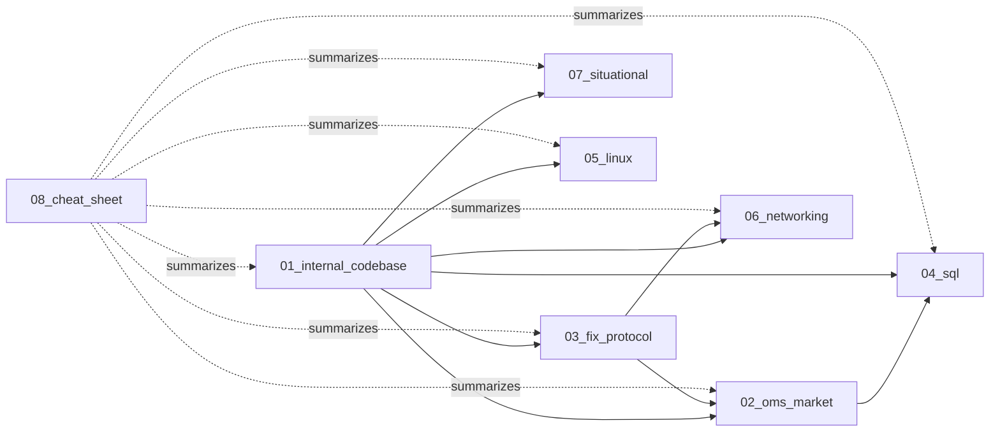

# Master Index — Interview Prep Kit

> Full prep kit for a **Technical Analyst / Production Support** role at an investment bank or trading firm supporting a vendor OMS. ~5 years experience. Every doc is Q&A-first, mermaid-heavy, and anonymized.

---

## Contents

- [1. Reading plans](#1-reading-plans) — pick your prep window (2 weeks / 3 days / 1 day / 5 hours)
- [2. Topic directories](#2-topic-directories) — every file across all 8 directories
- [3. How to use each file type](#3-how-to-use-each-file-type)
- [4. Cross-topic dependencies](#4-cross-topic-dependencies)
- [5. Quick lookup — "if they ask X, open Y"](#5-quick-lookup--if-they-ask-x-open-y)

---

## 1. Reading plans

### Plan A — 2 weeks (deep)

| Day | Morning (2h) | Evening (1h) |
|---|---|---|
| **1** | `01_internal_codebase/01_comprehensive.md` sections 1–3 (architecture, CompIDs, wire flow) | `08/01_cheatsheet_fix_tags.md` |
| **2** | `01_internal_codebase/01_comprehensive.md` sections 4–7 (purge, DFD, ATDL, alerts) | `01_internal_codebase/04_diagrams.md` |
| **3** | `03_fix_protocol/01_comprehensive.md` full | `08/02_cheatsheet_order_lifecycle.md` |
| **4** | `03_fix_protocol/02_focused.md` + `06_mock_interview.md` | `03_fix_protocol/04_diagrams.md` |
| **5** | `02_oms_market/01_comprehensive.md` sections 1–5 (buy vs sell, order types, venues) | `08/03_cheatsheet_us_market_structure.md` |
| **6** | `02_oms_market/01_comprehensive.md` sections 6–10 (options, FX, T+1, Reg NMS) | `02_oms_market/06_mock_interview.md` |
| **7** | `04_sql/01_comprehensive.md` + hands-on `07_exercises.md` | `08/04_cheatsheet_sql.md` |
| **8** | `05_linux/01_comprehensive.md` + `07_exercises.md` | `08/05_cheatsheet_linux.md` |
| **9** | `06_networking/01_comprehensive.md` | `08/06_cheatsheet_networking.md` |
| **10** | `07_situational/01_comprehensive.md` (all 5 STAR stories) | `08/07_cheatsheet_star_openers.md` — rehearse each story out loud |
| **11** | Mock loop: `03_fix/06_mock` + `02_oms/06_mock` back-to-back | `08/08_flashcards.md` (first 30) |
| **12** | Mock loop: `01_internal/06_mock` + `07_situational` rehearsal | `08/08_flashcards.md` (last 30) |
| **13** | `05_red_flags.md` files across dirs 01–07 (know what NOT to say) | Rest — sleep |
| **14** | `08/09_last_hour_checklist.md` | Interview |

### Plan B — 3 days (focused)

- **Day 1:** `01_internal_codebase/02_focused.md` + `03_fix_protocol/02_focused.md` + cheat sheets 01, 02
- **Day 2:** `02_oms_market/02_focused.md` + `04_sql/02_focused.md` + `05_linux/02_focused.md` + cheat sheets 03, 04, 05
- **Day 3:** `06_networking/02_focused.md` + `07_situational/01_comprehensive.md` (memorize 3 STAR stories) + cheat sheets 06, 07 + flashcards

### Plan C — 1 day (crash)

- **AM (4h):** All `03_quick_hit.md` files across dirs 01, 02, 03, 04
- **PM (4h):** `05_linux/03_quick_hit.md` + `06_networking/03_quick_hit.md` + `07_situational` (memorize 3 STAR stories) + all 9 cheat sheets in `08/`

### Plan D — 5 hours (emergency)

1. **h1:** `08/00_INDEX.md` (this) + `08/01_cheatsheet_fix_tags.md` + `08/02_cheatsheet_order_lifecycle.md`
2. **h2:** `08/03_cheatsheet_us_market_structure.md` + `08/04_cheatsheet_sql.md`
3. **h3:** `08/05_cheatsheet_linux.md` + `08/06_cheatsheet_networking.md`
4. **h4:** `08/07_cheatsheet_star_openers.md` — rehearse 3 stories out loud
5. **h5:** `08/08_flashcards.md` (fast-cycle) + `08/09_last_hour_checklist.md`

---

## 2. Topic directories

### `_context/` — session state

| File | One-liner |
|---|---|
| `RESUME.md` | Session state; progress; sources read; ground rules. |

### `01_internal_codebase/` — vendor OMS walkthrough (anonymized)

| File | One-liner |
|---|---|
| `00_INDEX.md` | Nav for this dir. |
| `01_comprehensive.md` | 100+ Q&A on OMS architecture, CompIDs, base/client-code split, DFD, purge, ATDL, AlertSubscriptions, cross-flow. |
| `02_focused.md` | Top 40–60 likely questions ranked by frequency in real T/A loops. |
| `03_quick_hit.md` | 25 highest-signal questions for last-minute cram. |
| `04_diagrams.md` | Mermaid: wire flow, session state, order state, purge cascade, alert match logic. |
| `05_red_flags.md` | Answers that scream "junior" — avoid these. |
| `06_mock_interview.md` | 45-min mock dialogue with follow-ups. |

### `02_oms_market/` — market knowledge

| File | One-liner |
|---|---|
| `00_INDEX.md` | Nav. |
| `01_comprehensive.md` | Buy-side vs sell-side OMS, order types, US equities/options/FX/FI, Reg NMS, MiFID II delta. |
| `02_focused.md` | Ranked top 50. |
| `03_quick_hit.md` | 25 must-knows. |
| `05_red_flags.md` | e.g. confusing OMS with EMS, misstating T+1, calling ATS "dark pool" loosely. |
| `06_mock_interview.md` | Dialogue. |

### `03_fix_protocol/` — FIX 4.2 / 4.4 / 5.0 SP2

| File | One-liner |
|---|---|
| `00_INDEX.md` | Nav. |
| `01_comprehensive.md` | Session layer (Logon/Heartbeat/Test/Resend/SeqReset/Logout), app layer, ExecType matrix, drop copy, admin vs app. |
| `02_focused.md` | Top 50. |
| `03_quick_hit.md` | 25. |
| `04_diagrams.md` | Session state machine, resend flow, order state, cross flow. |
| `05_red_flags.md` | e.g. "35=8 is a new order", confusing OrdStatus 39 with ExecType 150. |
| `06_mock_interview.md` | Dialogue with hard-fail probes. |

### `04_sql/` — trading DB patterns

| File | One-liner |
|---|---|
| `00_INDEX.md` | Nav. |
| `01_comprehensive.md` | Window functions, joins, isolation, deadlocks, partitioning, index strategy, trading query recipes. |
| `02_focused.md` | Top 50. |
| `03_quick_hit.md` | 25. |
| `05_red_flags.md` | 15 wrong-answer patterns that torpedo SQL rounds. |
| `06_mock_interview.md` | 3 dialogues: live-coding, EOD slow-query diagnosis, trade audit log design. |
| `07_exercises.md` | 20 hands-on SQL problems w/ solutions (fills, VWAP, gaps, running P&L). |

### `05_linux/` — prod support Linux

| File | One-liner |
|---|---|
| `00_INDEX.md` | Nav. |
| `01_comprehensive.md` | grep/awk/sed for FIX logs, process/memory, systemd, cron, gdb basics. |
| `02_focused.md` | Top 50. |
| `03_quick_hit.md` | 25. |
| `05_red_flags.md` | 15 wrong-answer patterns to avoid on Linux rounds. |
| `06_mock_interview.md` | 3 dialogues: dropped FIX session, OMS at 100% CPU, extract execs from 40 GB log. |
| `07_exercises.md` | 20 hands-on shell drills w/ solutions. |

### `06_networking/` — TCP + market data

| File | One-liner |
|---|---|
| `00_INDEX.md` | Nav. |
| `01_comprehensive.md` | TCP state machine, TCP tuning, tcpdump/ss/netstat, multicast for MD, colo, latency budget. |
| `02_focused.md` | Top 50. |
| `03_quick_hit.md` | 25. |
| `05_red_flags.md` | 15 wrong-answer patterns (with correction cues). |
| `06_mock_interview.md` | 3 dialogues: recurring session drop, wire walk of "Buy 100 AAPL", low-latency MD path. |

### `07_situational/` — anonymized STAR stories

| File | One-liner |
|---|---|
| `00_INDEX.md` | Nav. |
| `01_comprehensive.md` | 40+ full STAR stories: buffer truncation, tag12 commission override, alert routing miss, purge cascade, IRST staleness. |
| `02_focused.md` | 20 tightest stories re-cut for a 45-min behavioral loop. |
| `03_quick_hit.md` | 12 one-paragraph openers for classic HR questions. |
| `05_red_flags.md` | e.g. blaming clients, no metrics, no ownership language. |
| `06_mock_interview.md` | 4 dialogues: HR/hiring-mgr, senior technical, ex-trader conflict, skip-level. |

### `08_cheat_sheet/` — one-pagers (this dir)

| File | One-liner |
|---|---|
| `00_INDEX.md` | **This file.** Master nav + reading plans. |
| `01_cheatsheet_fix_tags.md` | FIX tags reference table (msg types, typical values). |
| `02_cheatsheet_order_lifecycle.md` | ExecType × OrdStatus matrix + mermaid state machine. |
| `03_cheatsheet_us_market_structure.md` | NBBO, Reg NMS, LULD, MOO/MOC, ISO, 605/606, T+1, ATSs. |
| `04_cheatsheet_sql.md` | Window funcs, joins, isolation, trading snippets. |
| `05_cheatsheet_linux.md` | FIX log parsing, TCP diagnosis, process/mem one-liners. |
| `06_cheatsheet_networking.md` | TCP states, ports, tcpdump/ss, multicast. |
| `07_cheatsheet_star_openers.md` | 10 opener sentences + 5 versatile 3-sentence stories. |
| `08_flashcards.md` | 60 flashcards across all topics. |
| `09_last_hour_checklist.md` | Final-hour prep list. |

---

## 3. How to use each file type

| Suffix | Purpose | When to open |
|---|---|---|
| `00_INDEX.md` | Directory navigation | First entry into a topic |
| `01_comprehensive.md` | Deep 100+ Q&A | 2-week plan, or single-topic deep dive |
| `02_focused.md` | Ranked top 40–60 | 3-day plan |
| `03_quick_hit.md` | Top 20–25 highest-signal | 1-day / same-day crash |
| `04_diagrams.md` | Mermaid state machines & flows | Whenever you need a picture |
| `05_red_flags.md` | What NOT to say | Night before — 15-min skim |
| `06_mock_interview.md` | Live dialogue | Rehearse aloud, ideally with a partner |
| `07_exercises.md` | Hands-on drills | Whiteboard prep (SQL/Linux only) |
| `08_cheat_sheet/*` | One-page reference | Last hour + during callback follow-ups |

---

## 4. Cross-topic dependencies

- Cannot answer OMS internals (`01`) without FIX (`03`) and market structure (`02`).
- SQL (`04`) questions are usually **applied to** an OMS trade DB — always frame in trading language.
- Linux (`05`) + Networking (`06`) show up together as "how did you debug a stuck FIX session in prod".
- STAR stories (`07`) draw on every technical dir.

---

## 5. Quick lookup — "if they ask X, open Y"

| If the interviewer asks... | Open... |
|---|---|
| "Walk me through order lifecycle" | `08/02_cheatsheet_order_lifecycle.md` + `03_fix/04_diagrams.md` |
| "Explain FIX tag 39 vs 150" | `08/01_cheatsheet_fix_tags.md` + `03_fix/01_comprehensive.md` §ExecType |
| "How did you debug a prod incident?" | `08/07_cheatsheet_star_openers.md` + pick a `07_situational/01_comprehensive.md` story |
| "What is Reg NMS Rule 611?" | `08/03_cheatsheet_us_market_structure.md` |
| "Difference between OMS and EMS?" | `02_oms_market/01_comprehensive.md` §1 |
| "Write a SQL to find missing sequence numbers" | `08/04_cheatsheet_sql.md` + `04_sql/07_exercises.md` |
| "grep me all rejects from yesterday's FIX log" | `08/05_cheatsheet_linux.md` |
| "TCP session hangs — how do you diagnose?" | `08/06_cheatsheet_networking.md` + `06_networking/01_comprehensive.md` |
| "Tell me about a time you disagreed with a trader" | `08/07_cheatsheet_star_openers.md` §Story 3 |
| "What's a cross order?" | `01_internal_codebase/01_comprehensive.md` §cross flow |
| "Explain T+1" | `08/03_cheatsheet_us_market_structure.md` §T+1 |
| "What's Sub-Penny Rule?" | `08/03_cheatsheet_us_market_structure.md` §Sub-Penny |

---

**Last-mile:** if you have 60 minutes, read only `08/09_last_hour_checklist.md`. Everything else is optional.
