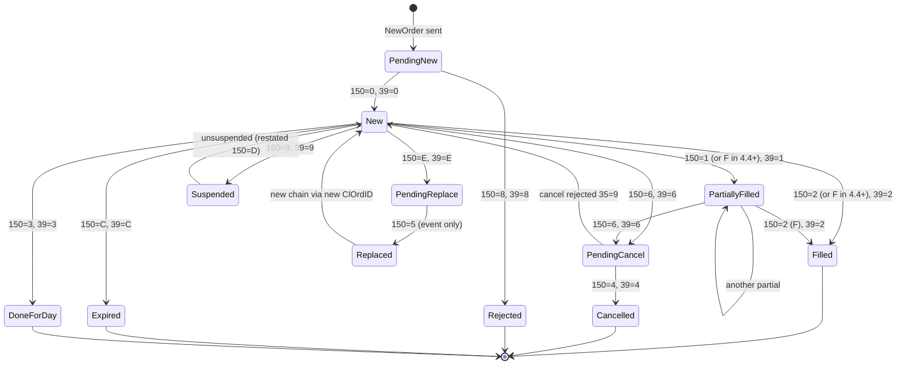
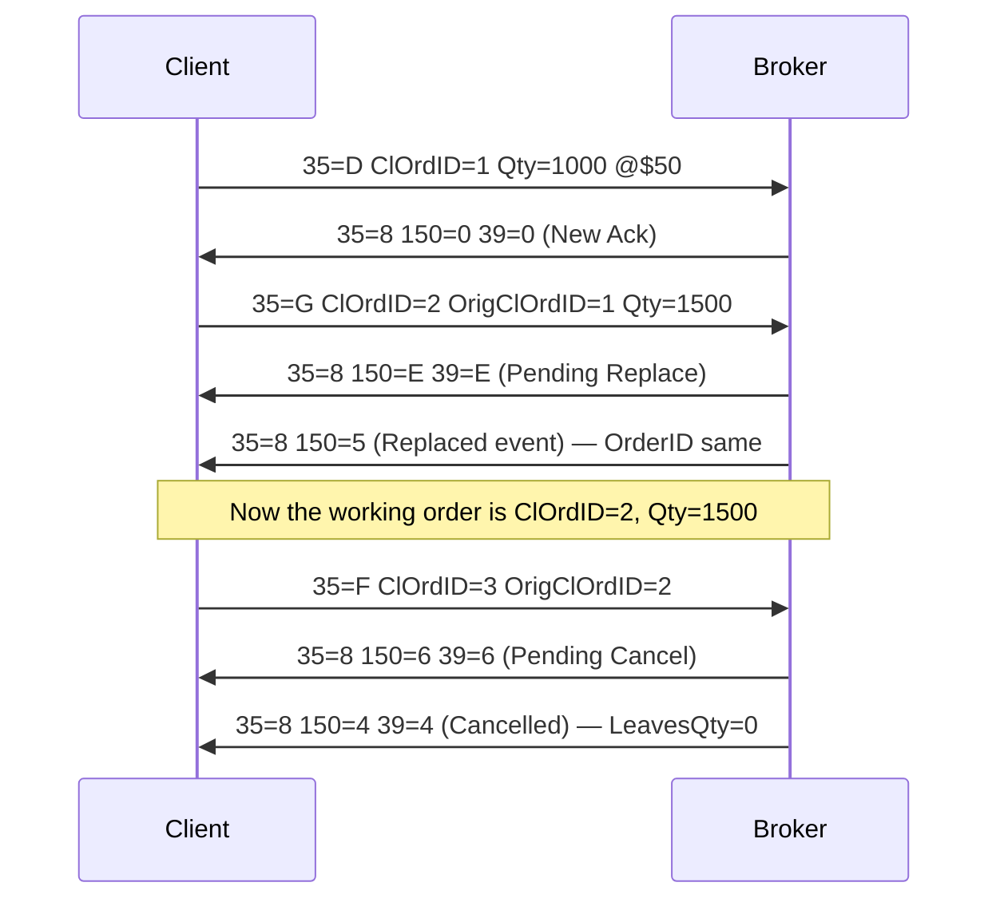
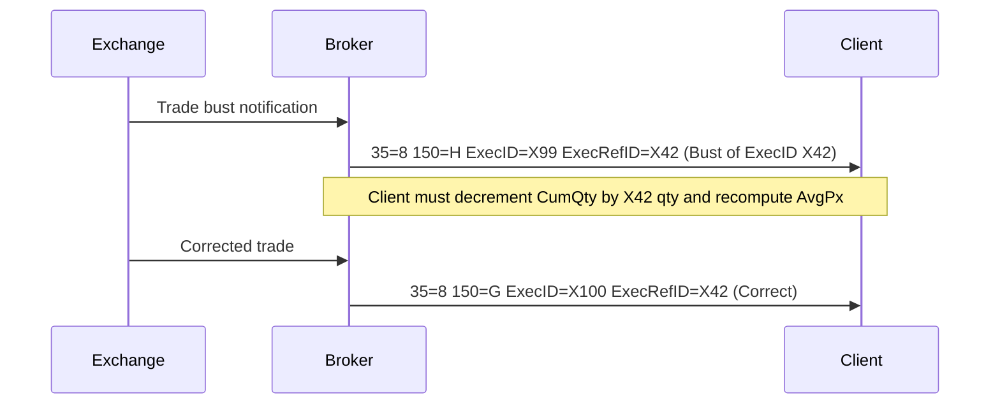
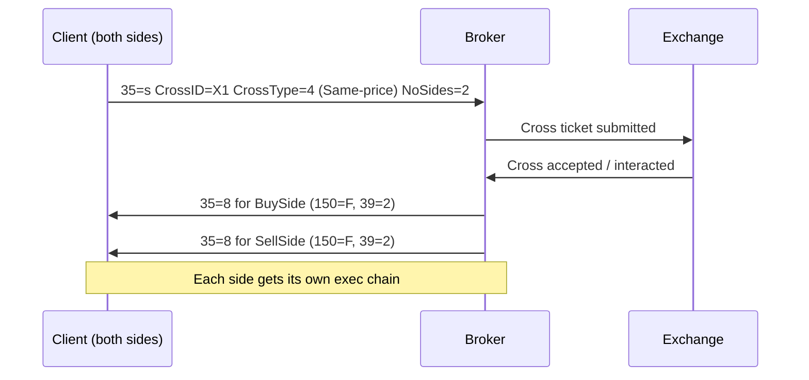

# Order Lifecycle — One-Page Reference

> The **ExecType (150) × OrdStatus (39)** matrix is the single most-tested topic for a T/A role. Memorize the state machine and the transition rules.

---

## Contents

- [1. The mental model — event vs state](#1-the-mental-model--event-vs-state)
- [2. Master state machine (mermaid)](#2-master-state-machine-mermaid)
- [3. ExecType × OrdStatus matrix](#3-exectype--ordstatus-matrix)
- [4. Invariants you must never violate](#4-invariants-you-must-never-violate)
- [5. Cancel / Replace flow](#5-cancel--replace-flow)
- [6. Bust / correct flow](#6-bust--correct-flow)
- [7. Cross-order flow](#7-cross-order-flow)
- [8. Common failure modes](#8-common-failure-modes)

---

## 1. The mental model — event vs state

| Concept | FIX tag | Meaning |
|---|---|---|
| **ExecType** | 150 | The **event** that caused this message. "What just happened." |
| **OrdStatus** | 39 | The **state** of the order after the event. "Where we now are." |

Rule: many `150` values map onto a smaller set of `39` values. Not every ExecType has a same-name OrdStatus (e.g. `150=D` Restated, `150=5` Replaced have no persistent OrdStatus).

## 2. Master state machine (mermaid)

## 3. ExecType × OrdStatus matrix

### FIX 4.2 (still used at some large banks)

| Event → | 150 | Typical 39 after event | Notes |
|---------|-----|------------------------|-------|
| New ack | `0` | `0` | First response from broker. |
| Partial fill | `1` | `1` | Repeats per partial. |
| Full fill | `2` | `2` | Terminal. |
| Done for day | `3` | `3` | Day order end-of-day. |
| Cancelled | `4` | `4` | Terminal for that ClOrdID chain. |
| Replaced | `5` | `1` or `2` | State reflects post-replace fills. |
| Pending cancel | `6` | `6` | Between cancel request and confirmation. |
| Stopped | `7` | `7` | Guaranteed price protection. |
| Rejected | `8` | `8` | Terminal — with tag 103 or 58. |
| Suspended | `9` | `9` | Order paused. |
| Pending new | `A` | `A` | Before broker ACK. |
| Calculated | `B` | (unchanged) | For allocations. |
| Expired | `C` | `C` | GTD / GTC expiry. |
| Restated | `D` | (unchanged) | Broker-initiated correction; tag 378 required. |
| Pending replace | `E` | `E` | Between replace request and confirmation. |

### FIX 4.4+ delta

- `150=1` (PartialFill) and `150=2` (Fill) are **merged into `150=F`** (Trade). Distinguish partial vs full by looking at `39` (1 vs 2) or `151` (LeavesQty > 0 vs 0).
- New events: `150=G` (Trade Correct), `150=H` (Trade Cancel/Bust). Both require `19` (ExecRefID).

## 4. Invariants you must never violate

1. **`CumQty + LeavesQty = OrderQty`** (pre-cancel). After cancel, `LeavesQty=0` and `CumQty + Cancelled = OrderQty`.
2. **`AvgPx × CumQty = Σ (LastQty × LastPx)`** across all fill exec reports — modulo rounding.
3. **Every `35=8` with `150=8` (Rejected) is terminal.** No more fills should arrive on that `ClOrdID`.
4. **Cancel request (35=F) does NOT change state until the ack.** State goes `New → PendingCancel → Cancelled` (or back to `New` on reject).
5. **Replace = new ClOrdID chain.** Tag 41 (`OrigClOrdID`) points to the previous one; tag 37 (`OrderID`) remains stable across the chain.
6. **PartialFill can arrive after PendingCancel.** Race: fill was on the book when your cancel hit; you get a fill *and* a cancel-ack for the residual.
7. **`150=D` (Restated)** must carry `378` (ExecRestatementReason). If missing → session-level reject.

## 5. Cancel / Replace flow

**Watch-out:** if broker rejects the cancel, response is `35=9` (OrderCancelReject) — **not** `35=8`. Tag 434 tells you if it was CxlReq (1) or CxlRepl (2).

## 6. Bust / correct flow

- `150=H` (Trade Cancel): the fill at `ExecRefID` never happened; back it out.
- `150=G` (Trade Correct): fill at `ExecRefID` had wrong qty/px; the new msg carries the corrected values.
- In 4.2, `20=1/2` (ExecTransType) played this role.

## 7. Cross-order flow

**Watch-out:** internalization / SI crosses are common in HFT/prime-broker OMS. A broker may match two client orders off-exchange under Reg NMS Rule 611(b)(9) (block trade). Two independent 35=8s result — one per side.

## 8. Common failure modes

| Symptom | Likely root cause | Where to look |
|---|---|---|
| `LeavesQty > 0` after `39=2` | Broker sending stale replacement — reject downstream | Trade DB reconciliation query |
| `AvgPx` off by fraction | Rounding accumulation across many partials | Recompute from raw fills |
| Dupe fills | Broker resent 35=8 without 43=Y | Filter by ExecID uniqueness |
| Order stuck in `39=6` (PendingCancel) | Cancel ack lost; broker still working | Send `35=H` (OrderStatusRequest) |
| `150=D` (Restated) surprise | Broker-side correction (typically comm/exec-fee restatement) | Check tag 378 reason code |
| ClOrdID reused | Client bug — `41` chain broken | Force uniqueness in OMS validation |
| `LastMkt` != expected venue | Router changed destination | Compare to `100` in original 35=D vs 30 on 35=8 |
