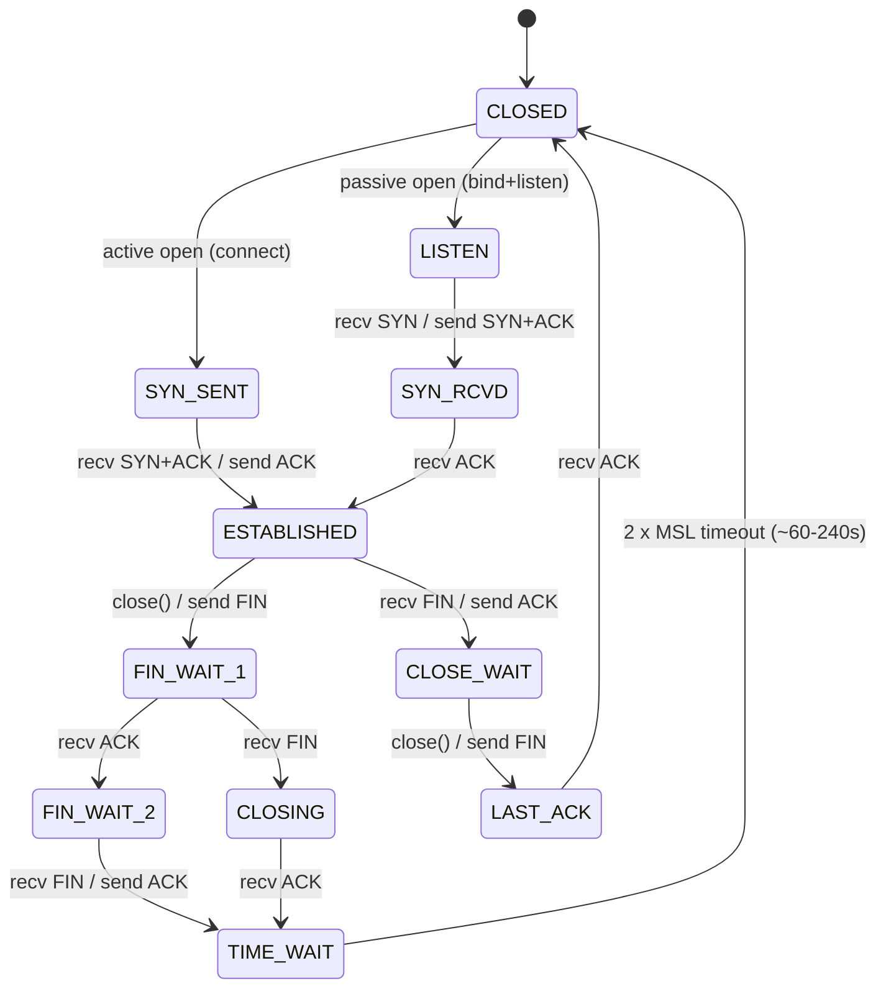

# Networking — One-Page Reference

> TCP + market-data essentials. What a T/A pulls up when a FIX session drops or an MDP feed is late.

---

## Contents

- [1. TCP state machine](#1-tcp-state-machine)
- [2. Common ports](#2-common-ports)
- [3. tcpdump filter syntax](#3-tcpdump-filter-syntax)
- [4. ss / netstat flags](#4-ss--netstat-flags)
- [5. Multicast diagnostics](#5-multicast-diagnostics)
- [6. Latency budget (typical)](#6-latency-budget-typical)
- [7. TCP tunables that matter](#7-tcp-tunables-that-matter)
- [8. Diagnostic playbook](#8-diagnostic-playbook)

---

## 1. TCP state machine



**Read the states like this:**

| State | What it means | Concern for a T/A? |
|-------|---------------|----|
| `LISTEN` | Server-side idle, awaiting SYN | Normal. |
| `SYN_SENT` | Client waiting for SYN+ACK | Stuck here → firewall / no server. |
| `SYN_RECV` (a.k.a. SYN_RCVD) | Server received SYN, sent SYN+ACK | Many piled → SYN flood or slow client. |
| `ESTABLISHED` | Data can flow | Expected. |
| `FIN_WAIT_1/2` | We initiated close, waiting FIN back | Long stay → peer not closing. |
| `CLOSE_WAIT` | Peer closed, **we haven't** | **Almost always an app bug** (fd leak). |
| `TIME_WAIT` | Wait 2×MSL then reclaim | Many is normal on high-connection-rate services. |
| `LAST_ACK` | Waiting final ACK | Transient. |

**Watch-out:** if you see thousands of `CLOSE_WAIT`, blame the application code (it's not calling `close()`). If thousands of `TIME_WAIT`, tune `tcp_tw_reuse` on Linux or add SO_REUSEADDR — do **not** enable `tcp_tw_recycle` (removed in kernel 4.12; unsafe with NAT).

## 2. Common ports

| Port | Service | Notes |
|------|---------|-------|
| 22 | SSH | Prod access. |
| 80/443 | HTTP/HTTPS | REST APIs, market data over HTTPS. |
| 21/990 | FTP/FTPS | Legacy static files, allocations. |
| 22/22 | SFTP | Post-trade files. |
| 25/587/465 | SMTP | Alerts. |
| 53 | DNS | UDP + TCP. |
| 123 | NTP | UDP — clock sync. |
| 389/636 | LDAP/LDAPS | Auth. |
| 1433 | SQL Server | |
| 1521 | Oracle | |
| 5432 | Postgres | |
| 5672 | AMQP (RabbitMQ) | |
| 6379 | Redis | |
| 9092 | Kafka | |
| **9878-9880** | FIX (typical) | Bilaterally agreed; nothing IANA-standard. Common ranges 8000–9999. |
| 2049 | NFS | |
| 27017 | MongoDB | |
| 3268/3269 | AD Global Catalog | |
| 8443 | HTTPS alt / admin | Common for OMS admin consoles. |

**Multicast market data**: uses **UDP** on assigned addresses & ports per feed spec — e.g. NASDAQ TotalView-ITCH via NASSDAQ MoldUDP64 on 233.54.12.\* ranges (illustrative). Every venue publishes its own MDP guide.

## 3. tcpdump filter syntax

```bash
# Basic — one host + port
sudo tcpdump -i eth0 -nn 'host broker.example.com and port 9878'

# SYN only (session-establish problems)
sudo tcpdump -i eth0 -nn 'tcp[tcpflags] & tcp-syn != 0 and tcp[tcpflags] & tcp-ack = 0'

# RST only (resets — often "connection refused" or force close)
sudo tcpdump -i eth0 -nn 'tcp[tcpflags] & tcp-rst != 0'

# Packets with payload (PSH set) — for FIX message flow
sudo tcpdump -i eth0 -nn 'tcp[tcpflags] & tcp-push != 0'

# Print ASCII payload (looks nice for FIX)
sudo tcpdump -i eth0 -A -s0 'port 9878'

# Write to pcap for wireshark; -s0 = full snap length
sudo tcpdump -i eth0 -w /tmp/fix.pcap -s0 'host broker and port 9878'

# Only inbound
sudo tcpdump -i eth0 -nn 'dst host me.example.com and port 9878'

# BPF combinations
sudo tcpdump -nn '(host a or host b) and (port 9878 or port 9879) and not host mon.example.com'

# Multicast market data on eth1
sudo tcpdump -i eth1 -nn 'net 233.54.0.0/16'

# Interface + count
sudo tcpdump -i eth0 -c 100 -nn 'port 9878'
```

**Read the flags column:** `S`=SYN, `.`=ACK, `P`=PSH, `F`=FIN, `R`=RST, `U`=URG, `E`=ECN-echo.

## 4. ss / netstat flags

```bash
# Listeners
ss -ltnp                             # -l listening, -t tcp, -n numeric, -p pid

# All established to port 9878
ss -tan '( sport = :9878 or dport = :9878 )' state established

# Connection summary
ss -s

# Retransmits / RTO per socket
ss -tin                              # -i extended info (rtt, cwnd, retrans)

# Timers (RTO, keepalive)
ss -o                                # timer info

# Per-cgroup, per-user (recent kernels)
ss -tp

# Legacy netstat
netstat -anp | awk '$6=="TIME_WAIT"' | wc -l
netstat -i                           # interface stats
```

**High-value ss trick:**
```bash
ss -tin '( sport = :9878 or dport = :9878 )' | grep -E 'ESTAB|rtt|bytes|retrans'
```
This shows current RTT, retransmits, and byte counters per session — perfect for "is our FIX connection slow?"

## 5. Multicast diagnostics

```bash
# What multicast groups is this host subscribed to?
ip maddr show
# or
netstat -gn

# Confirm IGMP query/report on the wire
sudo tcpdump -i eth1 -nn igmp

# Is the switch actually forwarding to me?  (sniff group)
sudo tcpdump -i eth1 -nn 'net 233.54.0.0/16'

# Kernel counters
netstat -su | grep -iE 'igmp|multi'
ip -s link show eth1

# Force-join a group for testing (mtools smcroute) — but usually the app should join

# Reverse-Path Forwarding checks (multicast requires RPF-clean route)
ip route get 233.54.12.1
```

**Common multicast problems:**
- **IGMP snooping** on switch drops your group; ensure switch has proper querier.
- **Wrong NIC** — multi-homed hosts may join on the wrong interface. Use `setsockopt(IP_MULTICAST_IF)`.
- **TTL=1** blocks routing across L3 boundary; feed publisher may raise TTL.
- **Missing SPT switch (source-specific multicast SSM)** — feeds now often use `SSM 232.0.0.0/8` requiring IGMPv3.
- **UDP loss** silent — always check the venue's gap-recovery mechanism (retransmission service).

## 6. Latency budget (typical)

| Hop | Latency | Notes |
|------|---------|-------|
| App → NIC (kernel) | 2–10 μs | Kernel bypass (DPDK, Solarflare Onload) can cut to <1 μs. |
| NIC → NIC (wire, same rack) | 0.1–1 μs | Fibre + cut-through switch. |
| Rack → rack (colo) | 1–5 μs | |
| Cross-datacenter (NJ2 ↔ NJ3, Aurora ↔ Mahwah) | 100–500 μs | Fibre length dominates. |
| NYC ↔ Chicago (microwave) | 4.1 ms one-way | Beats fibre by ~2 ms. |
| NYC ↔ London (transatlantic) | 30 ms one-way | Cable-dependent. |
| Retail → exchange via internet | 20–200 ms | Public internet. |

**OMS-to-exchange target for a well-tuned bank stack:** end-to-end **< 50 μs** in colo, on kernel-bypass.

## 7. TCP tunables that matter

| Sysctl | Purpose | Typical prod |
|---|---|---|
| `net.ipv4.tcp_no_metrics_save` | Prevent stale RTT cache polluting new conns | 1 |
| `net.ipv4.tcp_tw_reuse` | Reuse `TIME_WAIT` sockets for outbound conns | 1 |
| `net.core.somaxconn` | Listen backlog | 4096+ |
| `net.ipv4.tcp_max_syn_backlog` | SYN queue | 4096+ |
| `net.core.netdev_max_backlog` | Per-CPU inbound queue | 5000+ |
| `net.ipv4.tcp_rmem` / `tcp_wmem` | Socket buffer autotune | `4096 87380 16M` |
| `net.core.rmem_max` / `wmem_max` | Ceilings | 16777216 |
| `net.ipv4.tcp_slow_start_after_idle` | Reset cwnd after idle | **0** for FIX (long-lived, bursty) |
| `net.ipv4.tcp_congestion_control` | CC algo | `bbr` (modern), `cubic` (default) |
| `net.ipv4.tcp_syncookies` | SYN flood mitigation | 1 |
| `net.ipv4.tcp_keepalive_time` | Idle before probe | 300s for FIX (heartbeat handles most) |

## 8. Diagnostic playbook

### 8.1 "FIX session won't connect"

1. `ping broker.example.com` — L3 reachability.
2. `nc -vz broker 9878` — TCP handshake.
3. `traceroute broker` — where does it die? (may be blocked; try `tcptraceroute`).
4. `sudo tcpdump -i any -nn 'host broker and port 9878' -c 20` — is any packet coming back?
   - Only outbound SYN, no SYN-ACK → firewall drop or no listener.
   - RST from far end → wrong port or app not up.
5. Check DNS: `dig +short broker.example.com` — expected IP?
6. Check local firewall: `iptables -L -n -v` / `firewall-cmd --list-all`.
7. Ask the broker to check their side of the FIX config (allowed source IP, expected `SenderCompID`).

### 8.2 "FIX session is slow / gaps"

1. `ss -tin '( dport = :9878 or sport = :9878 )'` — check `rtt`, `retrans`, `cwnd`.
2. `sar -n DEV 1 5` — NIC bytes/pps.
3. Look for reset events: `dmesg -T | tail -50`.
4. NIC ring drops: `ethtool -S eth0 | grep -Ei 'drop|discard|err'`.
5. CPU pinning: which core is handling this interrupt? `cat /proc/interrupts | grep eth0`.
6. Any kernel packet drops? `netstat -s | grep -iE 'drop|error|reset'`.

### 8.3 "Multicast MD feed lost"

1. `ip maddr show eth1` — subscribed?
2. `sudo tcpdump -i eth1 -nn -c 50 'host <group>'` — arriving on NIC?
3. NIC counters: `ethtool -S eth1 | grep -iE 'multi|drop|discard'`.
4. IGMP report present on wire? `sudo tcpdump -i eth1 -nn igmp` — should re-send every ~60s.
5. Switch side: ask netops for **IGMP snooping** table entry for this group.
6. Application: was join re-issued after NIC re-init / VLAN change?

---

## Rapid-fire trivia

- **MSS** default IPv4 = 1460 (1500 MTU − 20 IP − 20 TCP).
- **Nagle's algorithm** (`TCP_NODELAY` off) coalesces small writes — **always disable on FIX**.
- **Delayed ACK** (kernel side) adds ~40 ms → often paired with Nagle for the "200ms latency mystery." Set `TCP_QUICKACK`.
- **Cwnd** doubles per RTT during slow-start; halves on loss under CUBIC.
- **BBR** ignores loss for CC and models bandwidth × RTT — better on lossy transatlantic links.
- **QUIC / HTTP/3** = UDP-based; not seen in FIX transport but worth naming.
- **PTP** (Precision Time Protocol, IEEE 1588) — sub-microsecond time sync via hardware timestamps. Regulatorily required for MiFID II clock-sync (100 μs on HFT, 1 ms on standard).
